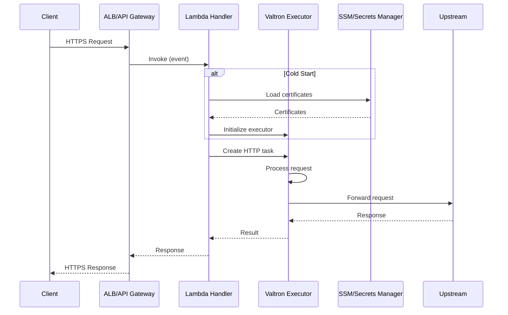

# Valtron Integration: Serverless Web Server

**Location:** `/home/darkvoid/Boxxed/@dev/repo-expolorations/caddy/caddy/`
**Source:** Caddy web server + Valtron executor
**Target:** AWS Lambda deployment (NO async/tokio in hot path)
**Date:** 2026-03-27

---

## Table of Contents

1. [Overview](#1-overview)
2. [Lambda Architecture](#2-lambda-architecture)
3. [HTTP Request Handling](#3-http-request-handling)
4. [Certificate Management](#4-certificate-management)
5. [State Management](#5-state-management)
6. [Cold Start Optimization](#6-cold-start-optimization)
7. [Complete Implementation](#7-complete-implementation)
8. [Deployment](#8-deployment)

---

## 1. Overview

### 1.1 Why Valtron for Lambda?

AWS Lambda has specific constraints:
- **No persistent connections** - Functions are stateless
- **Cold starts** - First invocation is slow
- **Timeout limits** - Maximum 15 minutes
- **Memory limits** - Maximum 10GB

**Valtron benefits:**
- No async runtime overhead
- Deterministic execution
- Single-threaded (no Send/Sync requirements)
- Fits Lambda's execution model

### 1.2 Architecture Comparison

```
Traditional Caddy (Long-running):
┌─────────────────────────────────────┐
│  Caddy Process                      │
│  ┌─────────────────────────────┐    │
│  │  TLS Manager (persistent)   │    │
│  │  Connection Pool            │    │
│  │  Certificate Cache          │    │
│  └─────────────────────────────┘    │
└─────────────────────────────────────┘
         ▲
         │ Long-lived connections

Lambda with Valtron (Serverless):
┌─────────────┐  ┌─────────────┐  ┌─────────────┐
│  Lambda 1   │  │  Lambda 2   │  │  Lambda 3   │
│  ┌───────┐  │  │  ┌───────┐  │  │  ┌───────┐  │
│  │Valtron│  │  │  │Valtron│  │  │  │Valtron│  │
│  │ Task  │  │  │  │ Task  │  │  │  │ Task  │  │
│  └───────┘  │  │  └───────┘  │  │  └───────┘  │
└─────────────┘  └─────────────┘  └─────────────┘
         ▲                ▲                ▲
         │                │                │
    Stateless        Stateless        Stateless
```

---

## 2. Lambda Architecture

### 2.1 Request Flow



### 2.2 Module Structure

```
caddy-lambda/
├── src/
│   ├── main.rs                    # Lambda entry point
│   ├── handler.rs                 # Request handler
│   ├── executor.rs                # Valtron executor setup
│   ├── tls/
│   │   ├── mod.rs                 # TLS management
│   │   ├── acme.rs                # ACME client (blocking)
│   │   └── certs.rs               # Certificate storage
│   ├── proxy/
│   │   ├── mod.rs                 # Reverse proxy
│   │   └── transport.rs           # HTTP transport
│   └── config/
│       ├── mod.rs                 # Configuration
│       └── parser.rs              # Caddyfile parsing
├── Cargo.toml
└── template.yaml                  # SAM template
```

---

## 3. HTTP Request Handling

### 3.1 Lambda Entry Point

```rust
use lambda_runtime::{service_fn, Error, LambdaEvent};
use aws_lambda_events::alb::{AlbTargetGroupRequest, AlbTargetGroupResponse};

/// Global state (cached across invocations)
struct AppState {
    routes: Arc<RouteList>,
    cert_manager: Arc<CertificateManager>,
    config: Arc<ServerConfig>,
}

impl AppState {
    async fn new() -> Result<Self, Error> {
        // Load configuration
        let config = load_config().await?;

        // Load or initialize certificates
        let cert_manager = CertificateManager::new(&config).await?;

        // Build route table
        let routes = build_routes(&config)?;

        Ok(Self {
            routes: Arc::new(routes),
            cert_manager: Arc::new(cert_manager),
            config: Arc::new(config),
        })
    }
}

#[tokio::main]
async fn main() -> Result<(), Error> {
    // Initialize once (cold start)
    let state = Arc::new(AppState::new().await?);

    // Create handler
    let func = service_fn(move |event: LambdaEvent<AlbTargetGroupRequest>| {
        let state = state.clone();

        async move {
            handle_request(event.payload, state).await
        }
    });

    lambda_runtime::run(func).await
}
```

### 3.2 Request Handler with Valtron

```rust
use foundation_core::valtron::single::{initialize as valtron_init, spawn, run_until_complete};
use std::sync::mpsc;

async fn handle_request(
    event: AlbTargetGroupRequest,
    state: Arc<AppState>,
) -> Result<AlbTargetGroupResponse, Error> {
    // Convert ALB event to HTTP request
    let http_request = event_to_request(event)?;

    // Use valtron for request processing (no async in hot path)
    let response = tokio::task::spawn_blocking(move || {
        // Initialize valtron executor (single-threaded)
        valtron_init(42);  // Deterministic seed

        // Create channel for result
        let (tx, rx) = mpsc::channel();

        // Create and schedule task
        let task = HttpRequestTask {
            request: Some(http_request),
            routes: state.routes.clone(),
            response_tx: Some(tx),
        };

        spawn()
            .with_task(task)
            .schedule()
            .expect("Failed to schedule task");

        // Run executor to completion
        run_until_complete();

        // Get result
        rx.recv().expect("Task didn't produce result")
    }).await.expect("Task panicked")?;

    // Convert response to ALB format
    let alb_response = response_to_alb(response)?;

    Ok(alb_response)
}
```

### 3.3 HttpRequest TaskIterator

```rust
use foundation_core::valtron::{TaskIterator, TaskStatus, NoSpawner};
use http::{Request, Response};
use std::sync::mpsc;

pub struct HttpRequestTask {
    request: Option<Request<Bytes>>,
    routes: Arc<RouteList>,
    response_tx: Option<mpsc::Sender<Result<Response<Bytes>, HandlerError>>>,
}

impl TaskIterator for HttpRequestTask {
    type Ready = Result<Response<Bytes>, HandlerError>;
    type Pending = ();
    type Spawner = NoSpawner;

    fn next(&mut self) -> Option<TaskStatus<Self::Ready, Self::Pending, NoSpawner>> {
        // Take the request
        let request = self.request.take()?;

        // Process request synchronously
        // (routes.serve_request uses blocking HTTP client)
        let response = self.routes.serve_request_sync(request);

        // Send result through channel
        if let Some(tx) = self.response_tx.take() {
            let _ = tx.send(response.clone());
        }

        Some(TaskStatus::Ready(response))
    }
}
```

### 3.4 Blocking Route Handling

```rust
impl RouteList {
    /// Synchronous request handling (for valtron)
    pub fn serve_request_sync(&self, req: Request<Bytes>) -> Result<Response<Bytes>, HandlerError> {
        // Find matching route
        for route in self.routes.iter() {
            // Check matchers
            let matches = route.matchers.iter().all(|m| m.matches_sync(&req));

            if matches {
                // Execute handlers synchronously
                return self.execute_handlers_sync(req, &route.handlers);
            }
        }

        Err(HandlerError::NotFound)
    }

    fn execute_handlers_sync(
        &self,
        req: Request<Bytes>,
        handlers: &[Arc<dyn HttpHandlerSync>],
    ) -> Result<Response<Bytes>, HandlerError> {
        // Build handler chain
        let mut current_req = req;

        for handler in handlers {
            match handler.serve_http_sync(current_req) {
                Ok(response) => return Ok(response),
                Err(HandlerError::Continue(next_req)) => {
                    current_req = next_req;
                }
                Err(e) => return Err(e),
            }
        }

        Err(HandlerError::NotFound)
    }
}
```

---

## 4. Certificate Management

### 4.1 Certificate Storage in SSM

```rust
use aws_sdk_ssm::Client as SsmClient;

pub struct CertificateStorage {
    ssm: SsmClient,
    param_prefix: String,
}

impl CertificateStorage {
    pub fn new(ssm: SsmClient, prefix: &str) -> Self {
        Self {
            ssm,
            param_prefix: prefix.to_string(),
        }
    }

    pub async fn store(&self, domain: &str, cert: &Certificate) -> Result<(), Error> {
        let cert_param = format!("{}/certs/{}", self.param_prefix, domain);
        let key_param = format!("{}/keys/{}", self.param_prefix, domain);

        // Store certificate
        self.ssm.put_parameter()
            .name(&cert_param)
            .value(String::from_utf8_lossy(&cert.cert_pem))
            .overwrite(true)
            .send()
            .await?;

        // Store private key (encrypted)
        self.ssm.put_parameter()
            .name(&key_param)
            .value(String::from_utf8_lossy(&cert.key_pem))
            .type_(ParameterType::SecureString)
            .overwrite(true)
            .send()
            .await?;

        Ok(())
    }

    pub async fn load(&self, domain: &str) -> Result<Option<Certificate>, Error> {
        let cert_param = format!("{}/certs/{}", self.param_prefix, domain);

        let cert_response = self.ssm.get_parameter()
            .name(&cert_param)
            .send()
            .await;

        match cert_response {
            Ok(resp) => {
                let cert_pem = resp.parameter.unwrap().value.unwrap();
                let key_param = format!("{}/keys/{}", self.param_prefix, domain);

                let key_response = self.ssm.get_parameter()
                    .name(&key_param)
                    .with_decryption(true)
                    .send()
                    .await?;

                let key_pem = key_response.parameter.unwrap().value.unwrap();

                Ok(Some(Certificate {
                    cert_pem: cert_pem.into_bytes(),
                    key_pem: key_pem.into_bytes(),
                    // ... parse dates from cert
                    not_before: chrono::Utc::now(),
                    not_after: chrono::Utc::now() + chrono::Duration::days(90),
                    subjects: vec![domain.to_string()],
                }))
            }
            Err(SdkError::ServiceError(e)) if e.err().is_parameter_not_found() => Ok(None),
            Err(e) => Err(e.into()),
        }
    }
}
```

### 4.2 Blocking ACME Client

```rust
use ureq;  // Blocking HTTP client for valtron

pub struct BlockingAcmeClient {
    ca_url: String,
    http_client: ureq::Agent,
}

impl BlockingAcmeClient {
    pub fn new(ca_url: &str) -> Self {
        Self {
            ca_url: ca_url.to_string(),
            http_client: ureq::Agent::new(),
        }
    }

    /// Issue certificate synchronously (for valtron)
    pub fn issue_certificate(&self, domains: &[String]) -> Result<Certificate, TlsError> {
        // 1. Get directory
        let directory = self.http_client.get(&self.ca_url)
            .call()
            .map_err(|e| TlsError::AcmeError(e.to_string()))?
            .into_json::<AcmeDirectory>()?;

        // 2. Create account (or load existing)
        let account = self.get_or_create_account()?;

        // 3. Create order
        let order = self.create_order(&account, domains)?;

        // 4. Solve challenges
        for auth_url in &order.authorizations {
            let auth = self.get_authorization(auth_url)?;
            let challenge = auth.challenges.iter()
                .find(|c| c.type == "http-01")
                .ok_or(TlsError::NoSupportedChallenge)?;

            // Present challenge
            let key_auth = self.compute_key_auth(&account.key, &challenge.token);

            // For Lambda, we need to store this somewhere the challenge verifier can reach
            // Options: S3 + CloudFront, DynamoDB + custom resolver, etc.
            self.present_challenge(&challenge.token, &key_auth)?;

            // Notify ACME server
            self.notify_challenge(&challenge.url)?;

            // Wait for validation
            self.wait_for_challenge(&challenge.url)?;

            // Clean up
            self.cleanup_challenge(&challenge.token)?;
        }

        // 5. Finalize order
        let csr = self.generate_csr(domains)?;
        self.finalize_order(&order, &csr)?;

        // 6. Download certificate
        let cert_pem = self.download_certificate(&order.certificate)?;

        Ok(Certificate {
            cert_pem: cert_pem.into_bytes(),
            key_pem: vec![],  // Generated separately
            not_before: chrono::Utc::now(),
            not_after: chrono::Utc::now() + chrono::Duration::days(90),
            subjects: domains.to_vec(),
        })
    }
}
```

### 4.3 Challenge Resolution for Lambda

```rust
// For Lambda, HTTP-01 challenges need external storage
// Option 1: S3 + CloudFront
pub struct S3ChallengeStorage {
    s3: aws_sdk_s3::Client,
    bucket: String,
    cloudfront: CloudFrontClient,
}

impl S3ChallengeStorage {
    pub async fn present_challenge(&self, token: &str, key_auth: &str) -> Result<(), Error> {
        let key = format!(".well-known/acme-challenge/{}", token);

        self.s3.put_object()
            .bucket(&self.bucket)
            .key(&key)
            .body(key_auth.to_string().into_bytes().into())
            .content_type("text/plain")
            .send()
            .await?;

        // Invalidate CloudFront cache
        self.cloudfront.create_invalidation()
            .distribution_id(&self.distribution_id)
            .invalidation_batch(InvalidationBatch {
                paths: Paths {
                    items: Some(vec![format!("/{}", key)]),
                    quantity: 1,
                },
                caller_reference: format!("acme-{}", chrono::Utc::now().timestamp()),
            })
            .send()
            .await?;

        Ok(())
    }

    pub async fn cleanup_challenge(&self, token: &str) -> Result<(), Error> {
        let key = format!(".well-known/acme-challenge/{}", token);

        self.s3.delete_object()
            .bucket(&self.bucket)
            .key(&key)
            .send()
            .await?;

        Ok(())
    }
}
```

---

## 5. State Management

### 5.1 Connection Pooling for Lambda

```rust
use hyper::client::HttpConnector;
use hyper::Client;
use once_cell::sync::Lazy;

// Global connection pool (reused across invocations)
static HTTP_CLIENT: Lazy<Client<HttpConnector>> = Lazy::new(|| {
    Client::builder()
        .pool_max_idle_per_host(10)
        .build_http()
});

pub struct ProxyTransport {
    client: &'static Client<HttpConnector>,
}

impl ProxyTransport {
    pub fn shared() -> &'static Self {
        static TRANSPORT: Lazy<ProxyTransport> = Lazy::new(|| {
            ProxyTransport { client: &HTTP_CLIENT }
        });
        &TRANSPORT
    }

    pub async fn send(&self, req: Request<Bytes>) -> Result<Response<Bytes>, HandlerError> {
        // Use the shared client (connections may be reused)
        let response = self.client.request(req)
            .await
            .map_err(|e| HandlerError::UpstreamError(e.to_string()))?;

        // Convert response
        let (parts, body) = response.into_parts();
        let body_bytes = hyper::body::to_bytes(body).await?;

        Ok(Response::from_parts(parts, body_bytes))
    }
}
```

### 5.2 Certificate Caching

```rust
use moka::sync::Cache;

pub struct CertificateCache {
    cache: Cache<String, Certificate>,
    storage: CertificateStorage,
}

impl CertificateCache {
    pub fn new(storage: CertificateStorage) -> Self {
        Self {
            cache: Cache::builder()
                .max_capacity(100)
                .time_to_live(Duration::from_hours(24))
                .build(),
            storage,
        }
    }

    pub fn get(&self, domain: &str) -> Option<Certificate> {
        // Check in-memory cache first
        if let Some(cert) = self.cache.get(domain) {
            // Check if not expired
            if cert.not_after > chrono::Utc::now() {
                return Some(cert);
            }
            // Remove expired
            self.cache.invalidate(domain);
        }

        // Check storage (SSM)
        // Note: This would need to be async or use blocking
        None
    }

    pub fn insert(&self, domain: String, cert: Certificate) {
        self.cache.insert(domain, cert);
    }
}
```

---

## 6. Cold Start Optimization

### 6.1 Minimize Dependencies

```toml
# Cargo.toml - Production optimized
[profile.release]
opt-level = 3
lto = true
codegen-units = 1
panic = "abort"
strip = true

[dependencies]
# Only essential dependencies
lambda_runtime = "0.13"
aws_lambda_events = "0.15"
aws-sdk-ssm = "1.0"
http = "1.0"
bytes = "1.0"
ureq = { version = "2.0", default-features = false, features = ["tls"] }
serde = { version = "1.0", features = ["derive"] }
serde_json = "1.0"

# Valtron (single-threaded, no tokio in hot path)
foundation_core = { path = "../../../ewe_platform/backends/foundation_core" }

# Caching
moka = { version = "0.12", features = ["sync"] }

# Minimal TLS
rcgen = "0.13"
x509-parser = "0.16"
```

### 6.2 Lazy Initialization

```rust
use once_cell::sync::OnceCell;

// Initialize expensive resources lazily
static CONFIG: OnceCell<Arc<ServerConfig>> = OnceCell::new();
static CERT_CACHE: OnceCell<Arc<CertificateCache>> = OnceCell::new();

fn get_config() -> &'static Arc<ServerConfig> {
    CONFIG.get_or_init(|| {
        // Load configuration once
        Arc::new(load_config_sync())
    })
}

fn get_cert_cache() -> &'static Arc<CertificateCache> {
    CERT_CACHE.get_or_init(|| {
        // Initialize cache once
        let storage = CertificateStorage::new_sync();
        Arc::new(CertificateCache::new(storage))
    })
}
```

### 6.3 Provisioned Concurrency

```yaml
# template.yaml
Resources:
  CaddyLambda:
    Type: AWS::Serverless::Function
    Properties:
      CodeUri: .
      Handler: bootstrap
      Runtime: provided.al2023
      MemorySize: 2048
      Timeout: 30
      Architectures:
        - x86_64
      ProvisionedConcurrencyConfig:
        ProvisionedConcurrentExecutions: 10  # Keep instances warm
      Environment:
        Variables:
          RUST_LOG: info
          GOMEMLIMIT: 1GiB
```

---

## 7. Complete Implementation

### 7.1 Main Entry Point

```rust
// src/main.rs
use lambda_runtime::{service_fn, Error, LambdaEvent};
use aws_lambda_events::alb::{AlbTargetGroupRequest, AlbTargetGroupResponse};
use tracing::{info, error};

mod handler;
mod executor;
mod tls;
mod proxy;
mod config;

use handler::RequestHandler;
use tls::CertificateManager;
use config::ServerConfig;

/// Global application state
struct AppState {
    handler: RequestHandler,
    cert_manager: CertificateManager,
}

impl AppState {
    async fn new() -> Result<Self, Error> {
        info!("Initializing Caddy Lambda");

        // Load configuration
        let config = ServerConfig::load().await?;
        info!("Configuration loaded: {} routes", config.routes.len());

        // Initialize certificate manager
        let cert_manager = CertificateManager::new(&config).await?;
        info!("Certificate manager initialized");

        // Build request handler
        let handler = RequestHandler::new(&config)?;
        info!("Request handler built");

        Ok(Self { handler, cert_manager })
    }
}

#[tokio::main]
async fn main() -> Result<(), Error> {
    // Initialize logging
    tracing_subscriber::fmt()
        .with_env_filter(tracing_subscriber::EnvFilter::from_default_env())
        .init();

    info!("Caddy Lambda starting...");

    // Initialize state (cold start)
    let state = std::sync::Arc::new(AppState::new().await?);

    info!("Caddy Lambda ready");

    // Create handler function
    let func = service_fn(move |event: LambdaEvent<AlbTargetGroupRequest>| {
        let state = state.clone();

        async move {
            let request_id = event.context.request_id.clone();
            info!("Processing request: {}", request_id);

            match handle_request(event.payload, state).await {
                Ok(response) => Ok(response),
                Err(e) => {
                    error!("Request failed: {}", e);
                    Err(e)
                }
            }
        }
    });

    // Run Lambda runtime
    lambda_runtime::run(func).await
}

async fn handle_request(
    event: AlbTargetGroupRequest,
    state: std::sync::Arc<AppState>,
) -> Result<AlbTargetGroupResponse, Error> {
    state.handler.handle(event, &state.cert_manager).await
}
```

### 7.2 SAM Template

```yaml
# template.yaml
AWSTemplateFormatVersion: '2010-09-09'
Transform: AWS::Serverless-2016-10-31

Globals:
  Function:
    Timeout: 30
    MemorySize: 2048
    Runtime: provided.al2023
    Architectures:
      - x86_64

Resources:
  CaddyFunction:
    Type: AWS::Serverless::Function
    Properties:
      FunctionName: caddy-proxy
      CodeUri: .
      Handler: bootstrap
      ProvisionedConcurrencyConfig:
        ProvisionedConcurrentExecutions: 5
      Environment:
        Variables:
          RUST_LOG: info
          CERT_PREFIX: /caddy/prod
          UPSTREAM_BASE_URL: http://backend.internal
      Events:
        HttpApi:
          Type: HttpApi
          Properties:
            ApiId: !Ref HttpApi
        CloudWatchEvent:
          Type: EventBridgeRule
          Properties:
            Schedule: rate(5 minutes)
            Input: '{"source": "warmup"}'

  HttpApi:
    Type: AWS::Serverless::HttpApi
    Properties:
      StageName: prod
      CorsConfiguration:
        AllowOrigins:
          - "*"
        AllowMethods:
          - GET
          - POST
          - PUT
          - DELETE
          - OPTIONS

  CertificateBucket:
    Type: AWS::S3::Bucket
    Properties:
      BucketName: !Sub "caddy-certs-${AWS::AccountId}"
      PublicAccessBlockConfiguration:
        BlockPublicAcls: true
        BlockPublicPolicy: true
        IgnorePublicAcls: true
        RestrictPublicBuckets: true

  CertificateParameter:
    Type: AWS::SSM::Parameter
    Properties:
      Name: /caddy/prod/config
      Type: SecureString
      Value: "{}"

Outputs:
  CaddyFunction:
    Description: Caddy Lambda Function
    Value: !Ref CaddyFunction

  HttpApiUrl:
    Description: HTTP API URL
    Value: !Sub "https://${HttpApi}.execute-api.${AWS::Region}.amazonaws.com/prod"
```

### 7.3 Build Script

```bash
#!/bin/bash
# build.sh

set -e

echo "Building Caddy Lambda..."

# Build for Lambda
cargo build --release --target x86_64-unknown-linux-gnu

# Create deployment package
mkdir -p deployment
cp target/x86_64-unknown-linux-gnu/release/bootstrap deployment/

# Package for SAM
cd deployment
zip -r ../caddy-lambda.zip .

echo "Build complete: caddy-lambda.zip"

# Deploy with SAM
# sam deploy --guided
```

---

## 8. Deployment

### 8.1 SAM Deploy

```bash
# Build
./build.sh

# First deploy (guided)
sam deploy --guided

# Subsequent deploys
sam deploy --stack-name caddy-lambda

# Check status
sam stack list
sam stack events caddy-lambda
```

### 8.2 Environment Configuration

```bash
# Set up environment variables
aws ssm put-parameter \
  --name /caddy/prod/config \
  --type SecureString \
  --value '{"upstreams": ["http://backend-1:8080", "http://backend-2:8080"]}'

# Initialize certificate
aws ssm put-parameter \
  --name /caddy/prod/certs/example.com \
  --type String \
  --value "$(cat cert.pem)"

aws ssm put-parameter \
  --name /caddy/prod/keys/example.com \
  --type SecureString \
  --value "$(cat key.pem)"
```

### 8.3 Testing

```bash
# Invoke Lambda
aws lambda invoke \
  --function-name caddy-proxy \
  --payload '{"httpMethod":"GET","path":"/health","headers":{}}' \
  response.json

# Check logs
aws logs tail /aws/lambda/caddy-proxy --follow

# Test with curl (through API Gateway)
curl https://xxxxx.execute-api.us-east-1.amazonaws.com/prod/health
```

---

## Summary

### Key Takeaways

1. **Valtron for Lambda**: Single-threaded executor fits Lambda's stateless model
2. **No tokio in hot path**: Use blocking HTTP clients (ureq) with valtron
3. **Certificate storage**: SSM Parameter Store or Secrets Manager
4. **Challenge resolution**: S3 + CloudFront for HTTP-01
5. **Cold start**: Minimize dependencies, use provisioned concurrency
6. **Connection pooling**: Global static client for reuse across invocations

### Deployment Checklist

- [ ] Build for correct architecture (x86_64 or arm64)
- [ ] Set up SSM parameters for config
- [ ] Configure S3 bucket for ACME challenges
- [ ] Enable provisioned concurrency
- [ ] Set up CloudWatch alarms
- [ ] Configure API Gateway or ALB integration
- [ ] Test cold start performance
- [ ] Monitor memory usage and adjust

---

*This completes the Caddy exploration. See [exploration.md](exploration.md) for the full index.*
