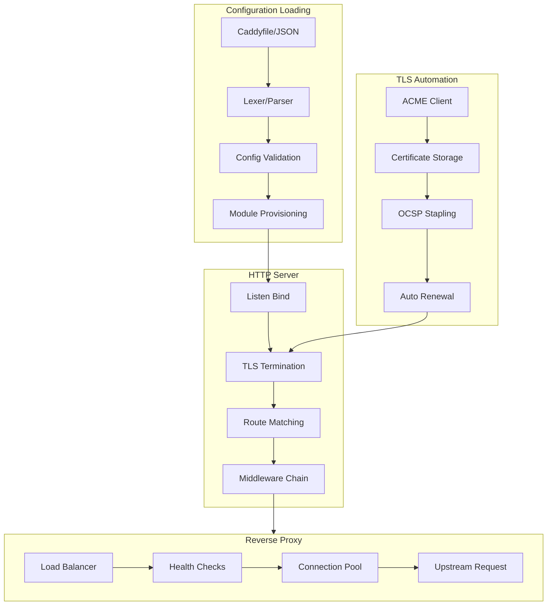

# Caddy: Complete Exploration

## Overview

**Caddy** is an extensible web server platform that uses TLS by default. Written in Go, it pioneered automatic HTTPS and has served trillions of requests while managing millions of TLS certificates. The core innovation is making HTTPS the default while providing an incredibly flexible module system.

### Why This Exploration Exists

This is a **complete textbook** that takes you from zero web server knowledge to understanding how to build and deploy production web servers with Rust/valtron replication.

### Key Characteristics

| Aspect | Caddy |
|--------|-------|
| **Core Innovation** | Automatic HTTPS, ACME TLS automation |
| **Dependencies** | Go standard library + certmagic + quic-go |
| **Lines of Code** | ~25,000 (core server) |
| **Purpose** | Web server, reverse proxy, TLS termination |
| **Architecture** | Module-based, config-driven middleware chains |
| **Runtime** | Native binary (no runtime dependencies) |
| **Rust Equivalent** | Standard library + valtron (no tokio) |

---

## Complete Table of Contents

This exploration consists of multiple deep-dive documents. Read them in order for complete understanding:

### Part 1: Foundations
1. **[Zero to Web Server Engineer](00-zero-to-webserver-engineer.md)** - Start here if new to web servers
   - HTTP protocol fundamentals
   - TLS/HTTPS from first principles
   - Reverse proxy patterns
   - Connection handling basics

### Part 2: Core Implementation
2. **[Module System Deep Dive](01-module-system-deep-dive.md)**
   - Caddy module registration and lifecycle
   - Module namespaces and discovery
   - Provisioner, Validator, CleanerUpper interfaces
   - Building custom modules

3. **[TLS Automation Deep Dive](02-tls-automation-deep-dive.md)**
   - ACME protocol implementation
   - Let's Encrypt integration
   - Certificate lifecycle management
   - On-demand TLS
   - OCSP stapling

4. **[Reverse Proxy Deep Dive](03-reverse-proxy-deep-dive.md)**
   - Load balancing algorithms
   - Active and passive health checks
   - Connection pooling and reuse
   - Streaming and buffering strategies

5. **[Caddyfile Configuration Deep Dive](04-caddyfile-config-deep-dive.md)**
   - Lexer and parser implementation
   - Directive processing
   - Snippet and import handling
   - Environment variable expansion

### Part 3: Rust Replication
6. **[Rust Revision](rust-revision.md)**
   - Complete Rust translation guide
   - Type system design
   - Ownership and borrowing strategy
   - Valtron integration patterns

### Part 4: Production
7. **[Production-Grade Implementation](production-grade.md)**
   - Performance optimizations
   - Memory management
   - Graceful reloads
   - Monitoring and observability

8. **[Valtron Integration](05-valtron-integration.md)**
   - Serverless web server deployment
   - Lambda-compatible handlers
   - Request/response streaming
   - Cold start optimization

---

## Quick Reference: Caddy Architecture

### High-Level Flow



### Component Summary

| Component | Lines | Purpose | Deep Dive |
|-----------|-------|---------|-----------|
| Module System | 400 | Plugin architecture, registration | [Module System](01-module-system-deep-dive.md) |
| TLS Automation | 800 | ACME, Let's Encrypt, cert management | [TLS Automation](02-tls-automation-deep-dive.md) |
| HTTP Server | 1200 | Request handling, routing | [Reverse Proxy](03-reverse-proxy-deep-dive.md) |
| Reverse Proxy | 1500 | Load balancing, health checks | [Reverse Proxy](03-reverse-proxy-deep-dive.md) |
| Caddyfile Parser | 600 | Configuration language | [Caddyfile Config](04-caddyfile-config-deep-dive.md) |
| Listeners | 700 | Network binding, SO_REUSEPORT | [Zero to Web Server](00-zero-to-webserver-engineer.md) |

---

## File Structure

```
caddy/
├── caddy.go                          # Core server lifecycle, Run(), Load()
├── modules.go                        # Module registration, discovery
├── context.go                        # Context with module loading
├── listeners.go                      # Network address parsing, binding
├── listen.go                         # Low-level listener creation
├── listen_unix.go                    # Unix socket handling, SO_REUSEPORT
├── logging.go                        # Structured logging setup
├── storage.go                        # Storage interface for certs/state
├── replacer.go                       # Placeholder replacement {env.X}
├── admin.go                          # Admin API for dynamic config
│
├── caddyconfig/
│   ├── caddyfile/
│   │   ├── lexer.go                  # Tokenizer for Caddyfile
│   │   ├── parse.go                  # Parser for server blocks
│   │   ├── dispenser.go              # Token stream navigation
│   │   └── formatter.go              # Caddyfile formatting
│   └── httpcaddyfile/
│       ├── httptype.go               # HTTP app config type
│       ├── serveroptions.go          # Server block options
│       └── directives.go             # Directive ordering
│
├── modules/
│   ├── caddyhttp/
│   │   ├── server.go                 # HTTP server implementation
│   │   ├── routes.go                 # Route compilation, middleware
│   │   ├── matchers.go               # Request matchers (path, header, etc.)
│   │   ├── reverseproxy/
│   │   │   ├── reverseproxy.go       # Core proxy handler
│   │   │   ├── httptransport.go      # HTTP transport config
│   │   │   ├── healthchecks.go       # Active/passive health checks
│   │   │   ├── selectionpolicies.go  # Load balancing algorithms
│   │   │   └── upstreams.go          # Upstream pool management
│   │   ├── fileserver/               # Static file serving
│   │   ├── encode/                   # Response compression
│   │   ├── headers/                  # Header manipulation
│   │   └── rewrite/                  # URL rewriting
│   │
│   ├── caddytls/
│   │   ├── tls.go                    # TLS app implementation
│   │   ├── automation.go             # Certificate automation config
│   │   ├── acmeissuer.go             # ACME certificate issuer
│   │   ├── zerosslissuer.go          # ZeroSSL issuer
│   │   ├── connpolicy.go             # TLS connection policies
│   │   ├── matchers.go               # Certificate matchers
│   │   └── distributedstek/          # Distributed session tickets
│   │
│   ├── caddypki/                     # PKI certificate authority
│   ├── logging/                      # Log encoder, writer modules
│   ├── caddyfs/                      # File system modules
│   └── standard/                     # Standard module bundle
│
├── cmd/
│   └── caddy/
│       └── main.go                   # CLI entrypoint
│
├── internal/
│   └── filesystems/                  # File system abstraction
│
└── exploration.md                    # This file (index)
├── 00-zero-to-webserver-engineer.md  # START HERE: Web server foundations
├── 01-module-system-deep-dive.md     # Module architecture
├── 02-tls-automation-deep-dive.md    # ACME, Let's Encrypt
├── 03-reverse-proxy-deep-dive.md     # Load balancing, proxies
├── 04-caddyfile-config-deep-dive.md  # Configuration parsing
├── rust-revision.md                  # Rust translation
├── production-grade.md               # Production deployment
└── 05-valtron-integration.md         # Serverless deployment
```

---

## How to Use This Exploration

### For Complete Beginners (Zero Web Server Experience)

1. Start with **[00-zero-to-webserver-engineer.md](00-zero-to-webserver-engineer.md)**
2. Read each section carefully, work through examples
3. Continue through all deep dives in order
4. Implement along with the explanations
5. Finish with production-grade and valtron integration

**Time estimate:** 30-60 hours for complete understanding

### For Experienced Go Developers

1. Skim [00-zero-to-webserver-engineer.md](00-zero-to-webserver-engineer.md) for context
2. Deep dive into module system and TLS automation
3. Review [rust-revision.md](rust-revision.md) for Rust translation patterns
4. Check [production-grade.md](production-grade.md) for deployment considerations

### For Web Server Practitioners

1. Review [Caddy core source](caddy.go) directly
2. Use deep dives as reference for specific components
3. Compare with nginx, Envoy, HAProxy architectures
4. Extract insights for educational content

---

## Running Caddy

```bash
# Navigate to Caddy directory
cd /home/darkvoid/Boxxed/@formulas/src.rust/src.caddy/caddy

# Build from source
cd cmd/caddy/
go build

# Run with Caddyfile
./caddy run --config ../../Caddyfile

# Run with JSON config
./caddy run --config ../../config.json

# Use the admin API for dynamic config
curl localhost:2019/load --data-binary @config.json
```

### Example Caddyfile

```caddyfile
# Simple static site
example.com {
    root * /var/www/html
    file_server
    encode gzip
}

# Reverse proxy
api.example.com {
    reverse_proxy localhost:8080
}

# Automatic HTTPS with Let's Encrypt
app.example.com {
    tls user@example.com
    reverse_proxy app:3000
}
```

---

## Key Insights

### 1. Module System Architecture

Caddy's module system is the foundation:

```go
// Module interface - all plugins implement this
type Module interface {
    CaddyModule() ModuleInfo
}

type ModuleInfo struct {
    ID  ModuleID      // e.g., "http.handlers.reverse_proxy"
    New func() Module // Constructor
}

// Registration (called in init())
func RegisterModule(instance Module) {
    modules[string(mod.ID)] = mod
}
```

### 2. Automatic HTTPS Flow

```
1. Server starts, parses config
2. TLS app provisions automation policies
3. ACMEIssuer obtains certificates for domains
4. Certificates stored in storage (default: filesystem)
5. OCSP stapling enabled automatically
6. Renewal checks run periodically
7. Graceful reload applies new certs
```

### 3. Middleware Chain Pattern

```go
// Routes compile to middleware chains
type Middleware func(http.ResponseWriter, *http.Request) error

func (r Route) Compile(next Handler) Handler {
    return func(w, r) error {
        // Execute matcher
        if !r.Match(r) {
            return next.ServeHTTP(w, r)
        }
        // Execute handlers in chain
        for _, handler := range r.Handlers {
            err := handler.ServeHTTP(w, r, next)
            if err != nil {
                return err
            }
        }
        return next.ServeHTTP(w, r)
    }
}
```

### 4. Graceful Reloads

```go
// Listeners can overlap during config transitions
// SO_REUSEPORT allows multiple processes on same socket
// Old config drains while new config accepts

func (na NetworkAddress) Listen(...) (any, error) {
    // Check for existing listener
    if ln, err := reuseUnixSocket(na.Network, address); ln != nil {
        return ln, nil
    }
    // Create new with SO_REUSEPORT
    return listenReusable(ctx, key, network, address, config)
}
```

### 5. Valtron for Rust Replication

The Rust equivalent uses TaskIterator:

```rust
// Go async with channels
func (h *Handler) ServeHTTP(w http.ResponseWriter, r *http.Request) error {
    // ... handle request
}

// Rust with valtron (no async/await)
struct HandleRequest {
    request: Request,
    response_tx: mpsc::Sender<Response>,
}

impl TaskIterator for HandleRequest {
    type Ready = Response;
    type Pending = ();
    type Spawner = NoSpawner;

    fn next(&mut self) -> Option<TaskStatus<Self::Ready, Self::Pending>> {
        // Process request synchronously
        let response = self.process();
        Some(TaskStatus::Ready(response))
    }
}
```

---

## From Caddy to Real Web Servers

| Aspect | Caddy | Production Web Servers |
|--------|-------|----------------------|
| Modules | Go plugins | Compiled-in or dynamic |
| Config | Caddyfile/JSON/API | nginx.conf, YAML, CRDs |
| TLS | Automatic (certmagic) | Manual or cert-manager |
| Scaling | SO_REUSEPORT | Worker processes, shards |
| Proxying | Reverse proxy module | Upstream, load balancer |
| Observability | Structured logs, metrics | Prometheus, tracing |

**Key takeaway:** The core patterns (module system, middleware chains, TLS automation) scale to production with infrastructure changes, not algorithm changes.

---

## Your Path Forward

### To Build Web Server Skills

1. **Implement a custom Caddy module** (handler, matcher, or transport)
2. **Build a TLS automation policy** (custom issuer or manager)
3. **Create a load balancer algorithm** (custom selection policy)
4. **Translate to Rust with valtron** (TaskIterator pattern)
5. **Study the papers** (ACME RFC 8555, HTTP/2 RFC 7540, TLS 1.3 RFC 8446)

### Recommended Resources

- [Caddy Documentation](https://caddyserver.com/docs/)
- [CertMagic](https://github.com/caddyserver/certmagic)
- [ACME RFC 8555](https://datatracker.ietf.org/doc/html/rfc8555)
- [Valtron README](/home/darkvoid/Boxxed/@dev/ewe_platform/backends/foundation_core/src/valtron/README.md)
- [TaskIterator Specification](/home/darkvoid/Boxxed/@dev/ewe_platform/specifications/08-valtron-async-iterators/)

---

## Document History

| Date | Change |
|------|--------|
| 2026-03-27 | Initial exploration created |
| 2026-03-27 | Deep dives 00-05 and rust-revision outlined |
| 2026-03-27 | Production-grade and valtron-integration planned |

---

*This exploration is a living document. Revisit sections as concepts become clearer through implementation.*
