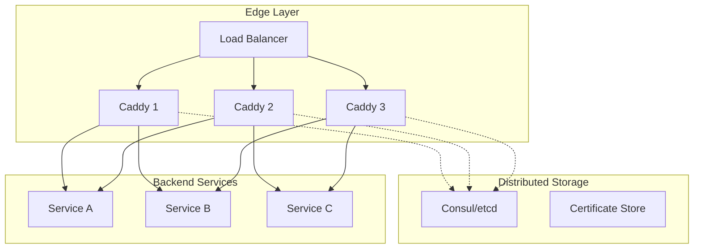
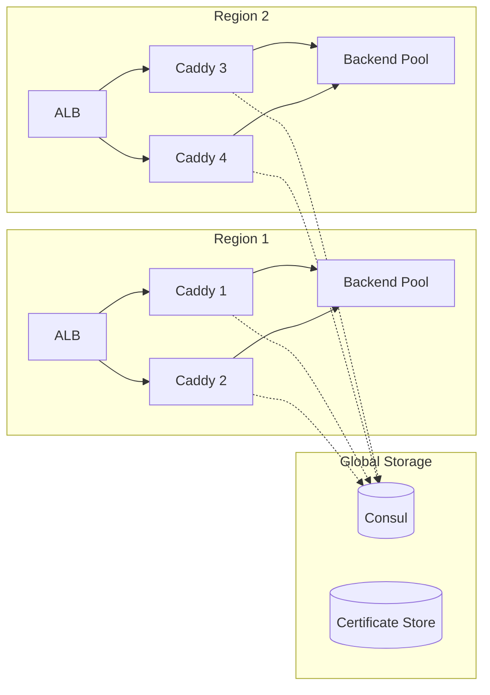

# Caddy Production-Grade Implementation

**Location:** `/home/darkvoid/Boxxed/@dev/repo-expolorations/caddy/caddy/`
**Source:** Caddy web server production patterns
**Focus:** Performance, scaling, monitoring, deployment

---

## Table of Contents

1. [Production Overview](#1-production-overview)
2. [Performance Optimizations](#2-performance-optimizations)
3. [Memory Management](#3-memory-management)
4. [Graceful Reloads](#4-graceful-reloads)
5. [Monitoring and Observability](#5-monitoring-and-observability)
6. [Scaling Strategies](#6-scaling-strategies)
7. [Security Hardening](#7-security-hardening)
8. [Deployment Patterns](#8-deployment-patterns)

---

## 1. Production Overview

### 1.1 Production Requirements

| Requirement | Caddy Approach |
|-------------|----------------|
| High Availability | Graceful reloads, health checks |
| Performance | Connection pooling, keepalive |
| Security | Automatic TLS, OCSP stapling |
| Observability | Structured logs, metrics |
| Scalability | SO_REUSEPORT, distributed storage |

### 1.2 Production Architecture



---

## 2. Performance Optimizations

### 2.1 Connection Pooling

```go
// From modules/caddyhttp/reverseproxy/httptransport.go
type HTTPTransport struct {
    // Optimize connection pool sizes
    MaxConnsPerHost     int  // 0 = unlimited, production: 100-1000
    MaxIdleConns        int  // Production: 100-1000
    MaxIdleConnsPerHost int  // Production: 10-100
    IdleConnTimeout     caddy.Duration  // Production: 90s
}

// Production configuration
{
  "transport": {
    "protocol": "http",
    "max_conns_per_host": 1000,
    "max_idle_conns": 1000,
    "max_idle_conns_per_host": 100,
    "idle_conn_timeout": "90s"
  }
}
```

### 2.2 Keepalive Tuning

```go
// From modules/caddyhttp/server.go
type Server struct {
    KeepAliveInterval   caddy.Duration  // Production: 15-30s
    KeepAliveIdle       caddy.Duration  // Production: 15-60s
    KeepAliveCount      int             // Production: 5-10
}

// Linux socket options for production
// Set via sysctl or in code:
// net.ipv4.tcp_keepalive_time = 60
// net.ipv4.tcp_keepalive_intvl = 15
// net.ipv4.tcp_keepalive_probes = 5
```

### 2.3 Buffer Optimization

```go
// Response buffering strategy
func (h *Handler) copyResponse(ctx *reverseProxyContext, resp *http.Response) error {
    // For small responses, buffer completely
    if resp.ContentLength > 0 && resp.ContentLength <= 32*1024 {
        body, _ := io.ReadAll(io.LimitReader(resp.Body, 32*1024))
        _, err := ctx.writer.Write(body)
        return err
    }

    // For large/streaming responses, use buffered copy
    buf := make([]byte, 32*1024)  // 32KB buffer
    _, err := io.CopyBuffer(ctx.writer, resp.Body, buf)
    return err
}
```

### 2.4 Worker Pool Pattern

```go
// Limit concurrent upstream connections
type connectionLimiter struct {
    semaphores map[string]*semaphore.Weighted
}

func (cl *connectionLimiter) acquire(upstream string) bool {
    sem := cl.semaphores[upstream]
    return sem.TryAcquire(1)
}

func (cl *connectionLimiter) release(upstream string) {
    cl.semaphores[upstream].Release(1)
}

// Usage in reverse proxy
if !limiter.acquire(upstream.Dial) {
    // Too many connections, retry or return 503
    return HandlerError{Status: 503, Message: "Service temporarily overloaded"}
}
defer limiter.release(upstream.Dial)
```

---

## 3. Memory Management

### 3.1 Sync.Pool for Buffer Reuse

```go
// From reverseproxy.go - Buffer pooling
var responseBufPool = sync.Pool{
    New: func() interface{} {
        return bytes.NewBuffer(make([]byte, 0, 32*1024))
    },
}

func getBuffer() *bytes.Buffer {
    return responseBufPool.Get().(*bytes.Buffer)
}

func putBuffer(buf *bytes.Buffer) {
    buf.Reset()
    responseBufPool.Put(buf)
}

// Usage
buf := getBuffer()
defer putBuffer(buf)
```

### 3.2 Memory Limits

```go
// Set GOMEMLIMIT for production
// This tells Go runtime the memory target
func init() {
    // Set to 75% of available memory
    var mem runtime.MemStats
    runtime.ReadMemStats(&mem)
    debug.SetMemoryLimit(int64(float64(mem.Sys) * 0.75))
}

// Or via environment variable
// GOMEMLIMIT=4GiB caddy run
```

### 3.3 GC Tuning

```bash
# Production GC settings
export GOGC=50       # More frequent GC (default 100)
export GOMEMLIMIT=4GiB

# For latency-sensitive workloads
# Lower GOGC = less memory, more CPU
# Higher GOGC = more memory, less CPU
```

---

## 4. Graceful Reloads

### 4.1 SO_REUSEPORT Pattern

```go
// From listen_unix.go
func listenReusable(ctx context.Context, lnKey, network, address string, config net.ListenConfig) (net.Listener, error) {
    // Check for existing listener (graceful reload)
    if ls, ok := listenersPool.Load(lnKey); ok {
        // Share the same socket (SO_REUSEPORT)
        return ls.(net.Listener), nil
    }

    // Create new listener with SO_REUSEPORT
    listener, err := net.Listen(network, address)
    if err != nil {
        return nil, err
    }

    // Set SO_REUSEPORT for graceful reloads
    setReusePort(listener)

    // Store for future reuse
    listenersPool.Store(lnKey, listener)
    return listener, nil
}
```

### 4.2 Drain Strategy

```go
// Graceful shutdown with drain period
func (s *Server) gracefulShutdown(ctx context.Context) error {
    // 1. Stop accepting new connections
    s.listener.Close()

    // 2. Wait for in-flight requests to complete
    drainTimeout := 30 * time.Second
    drainCtx, cancel := context.WithTimeout(ctx, drainTimeout)
    defer cancel()

    // Wait for active requests to drain
    ticker := time.NewTicker(100 * time.Millisecond)
    defer ticker.Stop()

    for {
        select {
        case <-drainCtx.Done():
            // Timeout, force close
            return s.forceClose()
        case <-ticker.C:
            if s.activeRequests() == 0 {
                return nil  // Drained successfully
            }
        }
    }
}
```

### 4.3 Zero-Downtime Deploy

```bash
#!/bin/bash
# Zero-downtime reload script

# 1. Start new Caddy instance (shares socket via SO_REUSEPORT)
caddy run --config new.json &
NEW_PID=$!

# 2. Wait for new instance to be ready
sleep 2

# 3. Signal old instance to gracefully shutdown
kill -SIGTERM $OLD_PID

# 4. Wait for drain (configurable)
wait $OLD_PID

echo "Reload complete, new PID: $NEW_PID"
```

---

## 5. Monitoring and Observability

### 5.1 Structured Logging

```go
// From logging.go
type LogEncoderConfig struct {
    Format     string  // "json", "console"
    TimeFormat string  // "rfc3339", "unix"
    Level      string  // "DEBUG", "INFO", "WARN", "ERROR"
}

// Production JSON logging
{
  "logging": {
    "logs": {
      "default": {
        "level": "INFO",
        "encoder": {
          "format": "json",
          "time_format": "rfc3339"
        },
        "include": ["http.log.access"],
        "fields": {
          "service": "caddy",
          "environment": "production"
        }
      }
    }
  }
}

// Example output:
// {"level":"info","ts":"2026-03-27T10:00:00Z","logger":"http.log.access","msg":"handled request","request":{"method":"GET","uri":"/api/users","proto":"HTTP/2.0"},"status":200,"duration":0.003,"upstream":"backend:8080"}
```

### 5.2 Metrics (Prometheus)

```go
// From metrics.go
var (
    httpRequestsTotal = promauto.NewCounterVec(
        prometheus.CounterOpts{
            Name: "caddy_http_requests_total",
            Help: "Total number of HTTP requests",
        },
        []string{"server", "handler", "status"},
    )

    httpRequestDuration = promauto.NewHistogramVec(
        prometheus.HistogramOpts{
            Name:    "caddy_http_request_duration_seconds",
            Help:    "HTTP request duration in seconds",
            Buckets: prometheus.DefBuckets,
        },
        []string{"server", "handler"},
    )

    upstreamHealth = promauto.NewGaugeVec(
        prometheus.GaugeOpts{
            Name: "caddy_upstream_health",
            Help: "Upstream health status (1=healthy, 0=unhealthy)",
        },
        []string{"upstream"},
    )
)

// Enable metrics in config
{
  "metrics": {
    "routes": ["/metrics"],
    "listen": ":2019"
  }
}
```

### 5.3 Health Endpoints

```caddyfile
# Health check endpoint
health.example.com {
    respond /health "OK" 200
    respond /ready "Ready" 200 {
        @ready {
            expr {upstream.healthy} > 0
        }
    }
}
```

---

## 6. Scaling Strategies

### 6.1 Horizontal Scaling



### 6.2 Distributed Certificate Storage

```json
{
  "storage": {
    "module": "caddy.storage.consul",
    "address": "http://consul:8500",
    "prefix": "caddy/",
    "timeout": "10s"
  }
}
```

```go
// Consul storage implementation
type ConsulStorage struct {
    client *consul.Client
    prefix string
}

func (c *ConsulStorage) Store(ctx context.Context, key string, data []byte) error {
    fullKey := c.prefix + key
    p := &consul.KVPair{Key: fullKey, Value: data}
    _, err := c.client.KV().Put(p, nil)
    return err
}

func (c *ConsulStorage) Load(ctx context.Context, key string) ([]byte, error) {
    fullKey := c.prefix + key
    p, _, err := c.client.KV().Get(fullKey, nil)
    if err != nil {
        return nil, err
    }
    if p == nil {
        return nil, os.ErrNotExist
    }
    return p.Value, nil
}
```

### 6.3 Rate Limiting

```go
// Token bucket rate limiter
type RateLimiter struct {
    limiter *rate.Limiter
}

func (rl *RateLimiter) Allow() bool {
    return rl.limiter.Allow()
}

// Per-client rate limiting
type ClientRateLimiter struct {
    mu       sync.Mutex
    limiters map[string]*RateLimiter
    config   RateLimitConfig
}

func (crl *ClientRateLimiter) getLimiter(clientIP string) *RateLimiter {
    crl.mu.Lock()
    defer crl.mu.Unlock()

    if limiter, ok := crl.limiters[clientIP]; ok {
        return limiter
    }

    limiter := &RateLimiter{
        limiter: rate.NewLimiter(
            rate.Limit(crl.config.RPS),
            crl.config.Burst,
        ),
    }
    crl.limiters[clientIP] = limiter

    // Cleanup after TTL
    go func() {
        time.Sleep(crl.config.TTL)
        crl.mu.Lock()
        delete(crl.limiters, clientIP)
        crl.mu.Unlock()
    }()

    return limiter
}
```

---

## 7. Security Hardening

### 7.1 TLS Configuration

```json
{
  "tls_connection_policies": [{
    "protocol_min": "tls1.2",
    "protocol_max": "tls1.3",
    "cipher_suites": [
      "TLS_AES_128_GCM_SHA256",
      "TLS_AES_256_GCM_SHA384",
      "TLS_CHACHA20_POLY1305_SHA256"
    ],
    "curves": ["x25519", "secp256r1"],
    "alpn": ["h2", "http/1.1"]
  }]
}
```

### 7.2 Security Headers

```caddyfile
example.com {
    header {
        # OWASP recommended headers
        Strict-Transport-Security "max-age=31536000; includeSubDomains; preload"
        Content-Security-Policy "default-src 'self'; script-src 'self'; style-src 'self' 'unsafe-inline'"
        X-Content-Type-Options "nosniff"
        X-Frame-Options "DENY"
        X-XSS-Protection "1; mode=block"
        Referrer-Policy "strict-origin-when-cross-origin"
        Permissions-Policy "geolocation=(), microphone=(), camera=()"
    }

    # Remove server header
    header -Server
}
```

### 7.3 Request Size Limits

```json
{
  "max_header_bytes": 1048576,  // 1MB
  "read_timeout": "10s",
  "read_header_timeout": "5s",
  "write_timeout": "60s"
}
```

### 7.4 Trusted Proxies

```caddyfile
example.com {
    # Only trust X-Forwarded-* from known proxies
    trusted_proxies private_ranges

    @blocked {
        remote_ip blocked_range
    }
    handle @blocked {
        respond 403
    }
}
```

---

## 8. Deployment Patterns

### 8.1 Docker Deployment

```dockerfile
FROM caddy:2-alpine

# Production configuration
COPY Caddyfile /etc/caddy/Caddyfile
COPY config.json /etc/caddy/config.json

# Run as non-root
USER caddy

# Health check
HEALTHCHECK --interval=30s --timeout=3s \
  CMD wget -q --spider http://localhost:2019/ready || exit 1

EXPOSE 80 443 2019

CMD ["caddy", "run", "--config", "/etc/caddy/config.json"]
```

```yaml
# docker-compose.yml
version: '3.8'
services:
  caddy:
    build: .
    ports:
      - "80:80"
      - "443:443"
    volumes:
      - caddy_data:/data
      - caddy_config:/config
    environment:
      - GOMEMLIMIT=2GiB
      - GOGC=50
    deploy:
      replicas: 3
      resources:
        limits:
          memory: 2G

volumes:
  caddy_data:
  caddy_config:
```

### 8.2 Kubernetes Deployment

```yaml
apiVersion: apps/v1
kind: Deployment
metadata:
  name: caddy
spec:
  replicas: 3
  selector:
    matchLabels:
      app: caddy
  template:
    metadata:
      labels:
        app: caddy
    spec:
      containers:
      - name: caddy
        image: caddy:2
        ports:
        - containerPort: 80
        - containerPort: 443
        - containerPort: 2019
        env:
        - name: GOMEMLIMIT
          value: "2GiB"
        readinessProbe:
          httpGet:
            path: /ready
            port: 2019
          initialDelaySeconds: 5
          periodSeconds: 10
        livenessProbe:
          httpGet:
            path: /health
            port: 2019
          initialDelaySeconds: 15
          periodSeconds: 30
        volumeMounts:
        - name: config
          mountPath: /etc/caddy
        - name: data
          mountPath: /data
      volumes:
      - name: config
        configMap:
          name: caddy-config
      - name: data
        emptyDir: {}
---
apiVersion: v1
kind: Service
metadata:
  name: caddy
spec:
  type: LoadBalancer
  ports:
  - name: http
    port: 80
  - name: https
    port: 443
  selector:
    app: caddy
```

### 8.3 Systemd Service

```ini
# /etc/systemd/system/caddy.service
[Unit]
Description=Caddy Web Server
Documentation=https://caddyserver.com/docs/
After=network.target network-online.target
Wants=network-online.target

[Service]
Type=notify
User=caddy
Group=caddy
ExecStart=/usr/bin/caddy run --environ --config /etc/caddy/Caddyfile
ExecReload=/usr/bin/caddy reload --config /etc/caddy/Caddyfile
TimeoutStopSec=30
LimitNOFILE=1048576
LimitNPROC=512
Environment=GOMEMLIMIT=2GiB
Environment=GOGC=50
Restart=on-failure
RestartSec=5s

# Security hardening
NoNewPrivileges=true
ProtectSystem=strict
ProtectHome=true
ReadWritePaths=/var/lib/caddy /etc/caddy

[Install]
WantedBy=multi-user.target
```

### 8.4 AWS Lambda (Serverless)

```go
// See valtron-integration.md for full Lambda implementation
// Key points:
// 1. Use API Gateway or ALB as trigger
// 2. Cold start optimization with provisioned concurrency
// 3. Store certs in Parameter Store or Secrets Manager
// 4. Use RDS Proxy for database connections
```

---

## Summary

### Production Checklist

- [ ] Configure connection pooling
- [ ] Set memory limits (GOMEMLIMIT)
- [ ] Enable structured JSON logging
- [ ] Configure Prometheus metrics
- [ ] Set up health endpoints
- [ ] Configure distributed storage (for multiple instances)
- [ ] Harden TLS configuration
- [ ] Add security headers
- [ ] Configure rate limiting
- [ ] Set up graceful reloads
- [ ] Configure monitoring/alerting

### Key Metrics to Monitor

| Metric | Alert Threshold |
|--------|-----------------|
| Request latency (p99) | > 500ms |
| Error rate (5xx) | > 1% |
| Upstream health | Any unhealthy |
| Memory usage | > 80% |
| Connection pool exhaustion | > 90% |
| Certificate expiry | < 7 days |

---

*Continue with [Valtron Integration](05-valtron-integration.md) for serverless deployment.*
