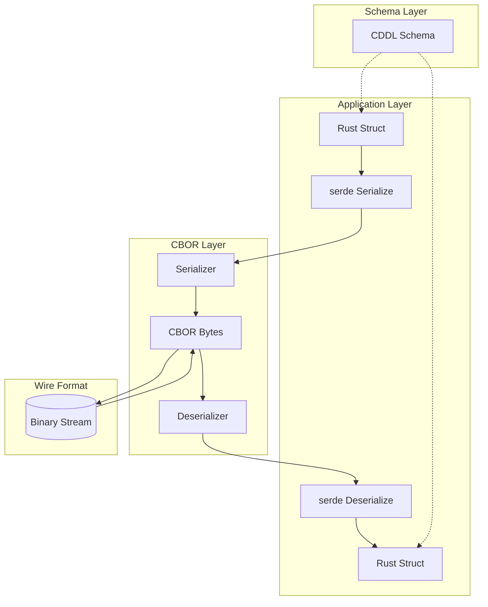

# CBOR: Complete Exploration

## Overview

**CBOR (Concise Binary Object Representation)** is a binary data format specified in [RFC 7049](https://www.rfc-editor.org/rfc/rfc7049.html) and updated in [RFC 8949](https://www.rfc-editor.org/rfc/rfc8949.html). It's designed to be a universal serialization format that is both human-readable (with tools) and extremely compact.

### Why This Exploration Exists

This is a **complete textbook** that takes you from zero serialization knowledge to understanding how to build production CBOR serialization engines with Rust for the ewe_platform.

### Key Characteristics

| Aspect | CBOR |
|--------|------|
| **Specification** | RFC 7049 / RFC 8949 |
| **Data Model** | 7 major types (uint, nint, bstr, tstr, array, map, tag/simple) |
| **Encoding** | Binary with self-describing type prefixes |
| **Schema Language** | CDDL (Concise Data Definition Language) |
| **Rust Libraries** | serde_cbor, ciborium, cbor-codec |
| **Use Cases** | COSE, CWT, SenML, IoT, WebAuthn, OSCORE |
| **Performance** | Faster than JSON, comparable to MessagePack |

---

## Complete Table of Contents

This exploration consists of multiple deep-dive documents. Read them in order for complete understanding:

### Part 1: Foundations
1. **[Zero to Serialization Engineer](00-zero-to-serialization-engineer.md)** - Start here if new to serialization
   - What is serialization?
   - Binary vs text formats
   - CBOR design goals
   - Major types overview
   - First encoding examples

### Part 2: Core CBOR
2. **[CBOR Data Model Deep Dive](01-cbor-data-model-deep-dive.md)**
   - The 7 major types
   - Additional information encoding
   - Definite vs indefinite length
   - Tags and semantic types
   - Canonical encoding rules

3. **[Schema and Validation Deep Dive](02-schema-validation-deep-dive.md)**
   - CDDL syntax and semantics
   - Schema definition patterns
   - Validation strategies
   - Tag constraints
   - Error handling

### Part 3: Comparison and Use Cases
4. **[Performance Comparison Deep Dive](03-performance-comparison-deep-dive.md)**
   - vs JSON (size, speed, parsing)
   - vs MessagePack
   - vs Protocol Buffers
   - vs FlatBuffers
   - Benchmark methodology

5. **[Use Cases Deep Dive](04-use-cases-deep-dive.md)**
   - COSE (CBOR Object Signing and Encryption)
   - CWT (CBOR Web Tokens)
   - SenML (Sensor Measurement Lists)
   - IoT protocols
   - WebAuthn authenticator data

### Part 4: Rust Implementation
6. **[Rust Revision](rust-revision.md)**
   - serde_cbor library guide
   - ciborium for no_std
   - cbor-codec for low-level control
   - Custom derive macros
   - Error handling patterns

7. **[Production-Grade CBOR](production-grade.md)**
   - Streaming encoding/decoding
   - Zero-copy deserialization
   - Memory management
   - Security considerations
   - Fuzzing and testing

### Part 5: Integration
8. **[Valtron Integration](05-valtron-integration.md)**
   - CBOR serialization tasks
   - Streaming with TaskIterator
   - No async/await, no tokio
   - Integration with ewe_platform

---

## Quick Reference: CBOR Architecture

### High-Level Data Flow



### CBOR Major Types Summary

| Major Type | Value | Description | Example |
|------------|-------|-------------|---------|
| **Unsigned Integer** | 0 | Non-negative integers | `0x05` = 5 |
| **Negative Integer** | 1 | Negative integers | `0x20` = -1 |
| **Byte String** | 2 | Binary data | `0x45Hello` = "Hello" |
| **Text String** | 3 | UTF-8 text | `0x65Hello` = "Hello" |
| **Array** | 4 | Ordered list | `0x83010203` = [1,2,3] |
| **Map** | 5 | Key-value pairs | `0xa1616101` = {"a": 1} |
| **Tag** | 6 | Semantic annotation | `0xc24100` = bignum(0) |
| **Simple/Float** | 7 | Booleans, null, floats | `0xf4` = false |

### Component Summary

| Component | Description | Deep Dive |
|-----------|-------------|-----------|
| **Data Model** | 7 major types, tags, canonical order | [Data Model](01-cbor-data-model-deep-dive.md) |
| **Schema** | CDDL for type definitions | [Schema Validation](02-schema-validation-deep-dive.md) |
| **Encoding** | Binary prefix + payload | [Data Model](01-cbor-data-model-deep-dive.md) |
| **Rust serde** | Type-safe serialization | [Rust Revision](rust-revision.md) |
| **Performance** | Size and speed characteristics | [Performance](03-performance-comparison-deep-dive.md) |
| **Security** | COSE, CWT, OSCORE | [Use Cases](04-use-cases-deep-dive.md) |
| **Production** | Streaming, zero-copy | [Production-Grade](production-grade.md) |

---

## File Structure

```
cbor/
├── exploration.md                      # This file (index)
├── 00-zero-to-serialization-engineer.md # START HERE: Serialization foundations
├── 01-cbor-data-model-deep-dive.md     # Major types, encoding rules
├── 02-schema-validation-deep-dive.md   # CDDL, schema validation
├── 03-performance-comparison-deep-dive.md # vs JSON, MessagePack, etc.
├── 04-use-cases-deep-dive.md           # COSE, CWT, SenML, IoT
├── 05-valtron-integration.md           # Valtron serialization tasks
├── rust-revision.md                    # Rust implementation guide
└── production-grade.md                 # Production considerations
```

---

## Source Libraries Explored

### serde_cbor

```
/home/darkvoid/Boxxed/@formulas/src.rust/src.cbor/cbor/
├── src/
│   ├── lib.rs                          # Main library exports
│   ├── de.rs                           # Deserializer implementation
│   ├── ser.rs                          # Serializer implementation
│   ├── error.rs                        # Error types
│   ├── tags.rs                         # CBOR tag handling
│   ├── value/
│   │   ├── mod.rs                      # Value enum
│   │   ├── de.rs                       # Value deserializer
│   │   └── ser.rs                      # Value serializer
│   ├── read.rs                         # Input abstraction
│   └── write.rs                        # Output abstraction
```

### cbor-codec

```
/home/darkvoid/Boxxed/@formulas/src.rust/src.cbor/cbor-codec/
├── src/
│   ├── lib.rs                          # Library exports
│   ├── types.rs                        # Type definitions
│   ├── value.rs                        # Value AST
│   ├── encoder.rs                      # Low-level encoder
│   ├── decoder.rs                      # Low-level decoder
│   ├── skip.rs                         # Skip utilities
│   └── slice.rs                        # Slice reading
```

---

## How to Use This Exploration

### For Complete Beginners (Zero Serialization Experience)

1. Start with **[00-zero-to-serialization-engineer.md](00-zero-to-serialization-engineer.md)**
2. Read each section carefully, work through examples
3. Continue through all deep dives in order
4. Implement along with the explanations
5. Finish with production-grade and valtron integration

**Time estimate:** 20-40 hours for complete understanding

### For Experienced Rust/serde Developers

1. Skim [00-zero-to-serialization-engineer.md](00-zero-to-serialization-engineer.md) for context
2. Deep dive into [rust-revision.md](rust-revision.md) for serde_cbor patterns
3. Review CDDL and schema validation in [02-schema-validation-deep-dive.md](02-schema-validation-deep-dive.md)
4. Check [production-grade.md](production-grade.md) for deployment considerations

### For Protocol Designers

1. Review CDDL specification in [02-schema-validation-deep-dive.md](02-schema-validation-deep-dive.md)
2. Study canonical encoding in [01-cbor-data-model-deep-dive.md](01-cbor-data-model-deep-dive.md)
3. Review COSE/CWT patterns in [04-use-cases-deep-dive.md](04-use-cases-deep-dive.md)
4. Compare performance characteristics in [03-performance-comparison-deep-dive.md](03-performance-comparison-deep-dive.md)

---

## Running CBOR Examples

### Basic serde_cbor Usage

```rust
use serde::{Serialize, Deserialize};
use serde_cbor::{to_vec, from_slice};

#[derive(Debug, Serialize, Deserialize, PartialEq)]
struct Person {
    name: String,
    age: u32,
}

fn main() -> Result<(), serde_cbor::Error> {
    let person = Person {
        name: "Alice".to_string(),
        age: 30,
    };

    // Serialize to CBOR bytes
    let bytes = to_vec(&person)?;
    println!("CBOR: {:02x?}", bytes);

    // Deserialize back
    let decoded: Person = from_slice(&bytes)?;
    assert_eq!(person, decoded);

    Ok(())
}
```

### Using ciborium (no_std compatible)

```rust
use ciborium::{to_writer, from_reader};
use std::collections::HashMap;

fn main() {
    let mut map = HashMap::new();
    map.insert("key", 42);

    let mut bytes = Vec::new();
    to_writer(&map, &mut bytes).unwrap();

    let decoded: HashMap<&str, u32> = from_reader(&bytes[..]).unwrap();
    assert_eq!(map, decoded);
}
```

### Low-level cbor-codec

```rust
use cbor::{Encoder, Decoder, Config};
use std::io::Cursor;

fn main() {
    // Direct encoding
    let mut encoder = Encoder::new(Vec::new());
    encoder.u64(42).unwrap();
    encoder.text("Hello").unwrap();
    let bytes = encoder.into_writer();

    // Direct decoding
    let mut decoder = Decoder::new(Config::default(), Cursor::new(bytes));
    println!("{:?}", decoder.u64()); // Some(42)
    println!("{:?}", decoder.text()); // Some("Hello")
}
```

---

## Key Insights

### 1. Self-Describing Format

CBOR is self-describing - every byte tells you what type of data follows:

```
0x05       = unsigned integer 5
0x20       = negative integer -1
0x45Hello  = 5-byte byte string "Hello"
0x65Hello  = 5-byte text string "Hello"
0xf4       = boolean false
0xf6       = null
```

### 2. Canonical Encoding

CBOR defines canonical encoding rules (RFC 7049 bis) for deterministic serialization:

- Maps must have keys in canonical order
- Integers must use shortest encoding
- Floats must use shortest representation
- Indefinite length not allowed in canonical CBOR

### 3. Tags for Semantic Types

Tags add semantic meaning to basic types:

```
Tag 0: Standard date/time string
Tag 1: Epoch-based date/time
Tag 2: Positive bignum
Tag 3: Negative bignum
Tag 6: Base64url encoding
Tag 7: Base64 encoding
Tag 24: Embedded CBOR
Tag 55799: Self-describe CBOR
```

### 4. Schema with CDDL

CDDL (RFC 8610) provides schema definition:

```cddl
Person = {
    name: tstr,
    age: uint,
    email: tstr / null
}
```

### 5. Rust Integration via serde

serde_cbor provides seamless Rust integration:

```rust
#[derive(Serialize, Deserialize)]
struct Message {
    id: u64,
    payload: Vec<u8>,
}
```

---

## From CBOR to Real Systems

| Domain | CBOR Application | Standards |
|--------|-----------------|-----------|
| **Security** | COSE (CBOR Object Signing) | RFC 8152 |
| **Identity** | CWT (CBOR Web Tokens) | RFC 8392 |
| **IoT** | SenML (Sensor ML) | RFC 8428 |
| **WebAuthn** | Authenticator data | W3C spec |
| **Mesh** | OSCORE (Object Security) | RFC 8613 |
| **Blockchain** | Cardano ledger | CDDL specs |

**Key takeaway:** CBOR is the serialization layer for modern IoT and security protocols.

---

## Your Path Forward

### To Build CBOR Skills

1. **Implement basic encoder/decoder** from RFC 7049
2. **Create CDDL schemas** for your data types
3. **Benchmark vs JSON** for your use case
4. **Integrate with valtron** for ewe_platform
5. **Study COSE/CWT** for security applications

### Recommended Resources

- [RFC 7049 / RFC 8949](https://www.rfc-editor.org/rfc/rfc8949.html) - CBOR specification
- [RFC 8610](https://www.rfc-editor.org/rfc/rfc8610.html) - CDDL specification
- [cbor.io](https://cbor.io/) - Official CBOR website
- [serde_cbor docs](https://docs.rs/serde_cbor/) - Rust library
- [ciborium docs](https://docs.rs/ciborium/) - no_std CBOR

---

## Document History

| Date | Change |
|------|--------|
| 2026-03-27 | Initial CBOR exploration created |
| 2026-03-27 | Deep dives 00-05 outlined |
| 2026-03-27 | Rust revision and production-grade planned |

---

*This exploration is a living document. Revisit sections as concepts become clearer through implementation.*
