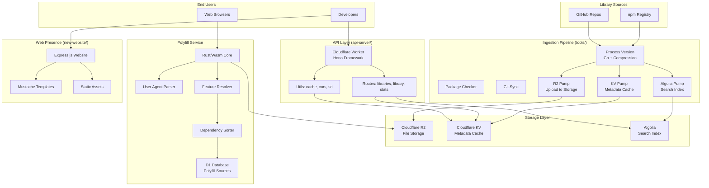
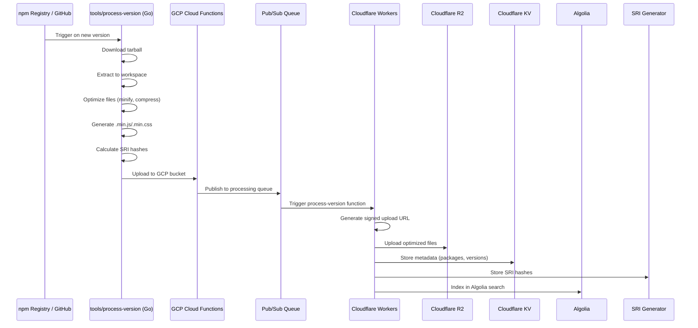
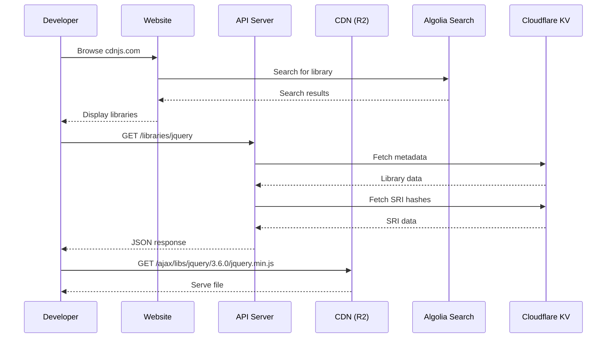

# Project Exploration: cdnjs Ecosystem

## Overview

cdnjs is the #1 free and open-source CDN (Content Delivery Network) built to make life easier for developers by serving over 4,000+ JavaScript libraries, CSS frameworks, and other web assets. It serves billions of requests monthly through Cloudflare's global edge network.

The cdnjs ecosystem consists of several interconnected components:

1. **API Server** - A Cloudflare Worker-based API that serves library metadata, version information, and SRI hashes
2. **Tools** - Go-based build tools and automation for library ingestion, processing, and distribution
3. **Polyfill Service** - A Rust/WebAssembly polyfill.io alternative providing feature detection and polyfill delivery
4. **New Website** - The cdnjs.com website (Express.js based)
5. **Workspace** - Docker-based development environment
6. **Brand** - Branding assets, logos, and design guidelines
7. **GitStats** - Git statistics and analytics for the main repository

cdnjs manages its massive scale through:
- **Cloudflare Workers** for edge-distributed API serving
- **Cloudflare KV** for metadata caching
- **Cloudflare R2** for file storage
- **Algolia** for search indexing across 4,000+ libraries
- **Automated processing pipelines** using Go and Rust for file optimization (minification, brotli/gzip compression, SRI generation)

## Repository

- **Location:** `/home/darkvoid/Boxxed/@formulas/Others/src.webStandards/src.cdnjs`
- **Sub-repositories:**
  - api-server: https://github.com/cdnjs/api-server
  - new-website: https://github.com/cdnjs/new-website
  - tools: https://github.com/cdnjs/tools
  - polyfill-service: Internal (Cloudflare-managed)
  - brand: https://github.com/cdnjs/brand
- **Primary Languages:** JavaScript (Node.js), Go, Rust
- **License:** MIT (code), CC BY-NC 4.0 (branding)

## Directory Structure

```
src.cdnjs/
├── api-server/                 # Cloudflare Worker API server (Node.js + Hono)
│   ├── src/
│   │   ├── index.js           # Main entry point, Hono app initialization
│   │   ├── routes/
│   │   │   ├── index.js       # Health, robots.txt, root redirects
│   │   │   ├── libraries.js   # GET /libraries endpoint (search via Algolia)
│   │   │   ├── library.js     # GET /libraries/:library/:version endpoints
│   │   │   ├── stats.js       # Statistics endpoints
│   │   │   ├── whitelist.js   # Whitelist endpoints
│   │   │   └── errors.js      # Error handling
│   │   └── utils/
│   │       ├── algolia.js     # Algolia search client
│   │       ├── cache.js       # Cloudflare KV caching
│   │       ├── cors.js        # CORS configuration
│   │       ├── fetchJson.js   # JSON fetching utility
│   │       ├── files.js       # File filtering utilities
│   │       ├── filter.js      # Response field filtering
│   │       ├── kvMetadata.js  # Cloudflare KV metadata access
│   │       ├── respond.js     # Response formatting
│   │       └── sriForVersion.js # SRI hash generation
│   ├── .eslintrc.cjs
│   ├── package.json           # Dependencies: hono, algoliasearch, toucan-js
│   ├── wrangler.toml          # Cloudflare Worker configuration
│   ├── Makefile               # Deploy targets (staging/production)
│   └── .github/workflows/     # CI/CD pipelines
│
├── tools/                      # Build and automation tools (Go)
│   ├── cmd/
│   │   ├── checker/           # Package validation
│   │   ├── git-sync/          # Git synchronization
│   │   ├── process-version/   # Main version processor (optimization pipeline)
│   │   ├── process-version-host/ # GCP Cloud Function trigger
│   │   └── r2-pump/           # R2 storage uploader
│   ├── compress/              # File compression utilities
│   │   ├── algorithm.go       # Compression algorithm selection
│   │   ├── css.go             # CSS minification
│   │   ├── js.go              # JavaScript minification (uglify-js/es)
│   │   ├── jpeg.go            # JPEG optimization
│   │   ├── png.go             # PNG optimization (zopflipng)
│   │   └── util.go            # Utility functions
│   ├── functions/             # Cloudflare Workers Functions
│   │   ├── algolia-pump/      # Push metadata to Algolia
│   │   ├── check-pkg-updates/ # Check for package updates
│   │   ├── force-update/      # Force update trigger
│   │   ├── kv-pump/           # Push to Cloudflare KV
│   │   ├── process-version/   # Version processing trigger
│   │   └── r2-pump/           # R2 upload function
│   ├── algolia/               # Algolia indexing
│   ├── kv/                    # KV namespace management
│   ├── packages/              # Package configuration handling
│   ├── sri/                   # SRI hash calculation
│   ├── schema_human.json      # Package JSON schema (documented)
│   ├── schema_non_human.json  # Package JSON schema (compact)
│   ├── go.mod                 # Go module definition
│   └── Makefile               # Build targets
│
├── polyfill-service/           # Polyfill.io alternative (Rust + Wasm)
│   ├── library/
│   │   ├── src/
│   │   │   ├── lib.rs         # Main library entry
│   │   │   ├── ua.rs          # User agent parsing
│   │   │   ├── old_ua.rs      # Legacy UA handling
│   │   │   ├── parse.rs       # Query parameter parsing
│   │   │   ├── polyfill_parameters.rs # Feature request parsing
│   │   │   ├── features_from_query_parameter.rs # Feature resolution
│   │   │   ├── get_polyfill_string.rs # Bundle generation
│   │   │   ├── toposort.rs    # Dependency topological sort
│   │   │   ├── meta.rs        # Polyfill metadata
│   │   │   └── buffer.rs      # Buffer handling
│   │   └── Cargo.toml         # Rust dependencies (worker, semver, regex)
│   ├── polyfill-libraries/    # Polyfill definitions by version
│   │   ├── 3.111.0/           # Latest version (60K+ files)
│   │   │   ├── AbortController/
│   │   │   ├── Array.from/
│   │   │   ├── fetch/
│   │   │   ├── Promise/
│   │   │   └── ... (400+ polyfills)
│   │   └── [version].json     # Version manifests
│   └── test/                  # Test suite
│
├── new-website/                # cdnjs.com website (Express.js)
│   ├── webServer/
│   │   ├── main.js            # Main entry point
│   │   ├── app.js             # Express app configuration
│   │   ├── routes/
│   │   │   ├── index.js       # Homepage
│   │   │   └── libraries.js   # Library pages
│   │   └── utils/
│   │       ├── libraries.js   # Library data handling
│   │       ├── cache.js       # Caching layer
│   │       ├── templating.js  # Mustache templates
│   │       └── breadcrumbs.js # Navigation breadcrumbs
│   ├── public/
│   │   ├── css/               # Stylesheets
│   │   ├── js/                # Client-side JavaScript
│   │   ├── img/               # Images and logos
│   │   └── packages.min.json  # Minified package manifest
│   ├── templates/             # Mustache HTML templates
│   │   ├── home.html
│   │   ├── library.html
│   │   ├── libraries.html
│   │   ├── api.html
│   │   └── ...
│   ├── apiServer.js           # Legacy API server (Express.js)
│   ├── update.js              # Sitemap generation
│   ├── reindex.js             # Algolia reindexing
│   ├── package.json
│   └── .github/workflows/
│
├── workspace/                  # Docker development environment
│   ├── Dockerfile             # Ubuntu 18.04 based image
│   ├── README.md              # Usage instructions
│   ├── LICENSE                # MIT license
│   └── .travis.yml            # CI configuration
│
├── brand/                      # Branding assets
│   ├── logo/
│   │   ├── standard/          # Standard logos (PNG, SVG)
│   │   ├── favicon/           # Favicon variants
│   │   └── README.md
│   ├── palette/               # Color palette definitions
│   ├── illustrations/
│   │   ├── banner/            # Banner graphics
│   │   ├── shirt/             # Merchandise designs
│   │   ├── business-card/     # Business cards
│   │   └── background/        # Background patterns
│   ├── website/               # Website design assets
│   ├── LICENSE.md             # CC BY-NC 4.0
│   └── README.md
│
└── cdnjs-gitstats/             # Git statistics (2011-2019)
    ├── activity.html          # Activity charts
    ├── authors.html           # Contributor stats
    ├── commits_by_year.png    # Commit history graphs
    ├── hour_of_day.html       # Commit time distribution
    └── sortable.js            # Table sorting
```

## Architecture

### High-Level System Architecture



### Library Ingestion Pipeline (npm/GitHub -> CDN)



### API Server Architecture

```mermaid
graph LR
    subgraph "Request Flow"
        Req[Incoming Request]
        CF[Cloudflare Edge]
        W[Cloudflare Worker]
    end

    subgraph "Hono Application"
        Logger[Logger Middleware]
        CORS[CORS Middleware]
        Sentry[Sentry Middleware]
        Routes[Route Handlers]
    end

    subgraph "Route Handlers"
        RI[/:library Routes]
        RLib[/libraries Routes]
        RStats[/stats Routes]
        RHealth[/health]
    end

    subgraph "Data Sources"
        KV[Cloudflare KV<br/>Metadata]
        Algolia[Algolia<br/>Search]
        Cache[Response Cache]
    end

    Req ->> CF: HTTPS Request
    CF ->> W: Route to Worker
    W ->> Logger: Log request
    Logger ->> CORS: Add CORS headers
    CORS ->> Sentry: Initialize error tracking
    Sentry ->> Routes: Route matching

    Routes ->> RLib: GET /libraries?search=...
    Routes ->> RI: GET /libraries/:name/:version
    Routes ->> RStats: GET /stats
    Routes ->> RHealth: GET /health

    RLib ->> Algolia: Search query
    RLib ->> Cache: Cache results (15 min)
    RI ->> KV: Fetch metadata
    RI ->> KV: Fetch SRI hashes
    RI ->> Cache: Cache response (355 days)

    Algolia --> RLib: Search results
    KV --> RI: Library metadata
    Cache --> W: Cached response
    Routes --> W: JSON Response
    W --> CF: Return to edge
    CF --> Req: HTTP Response
```

### Polyfill Service Feature Detection

```mermaid
flowchart TD
    Request["GET /polyfill?features=fetch,promise&ua=Mozilla/..."]

    subgraph "Parse Request"
        ParseParams[Parse Query Parameters]
        ParseUA[Parse User Agent]
    end

    subgraph "Feature Resolution"
        Resolve[Resolve Features]
        Alias[Alias Expansion]
        BrowserCheck[Browser Support Check]
        Deps[Resolve Dependencies]
    end

    subgraph "Bundle Generation"
        Sort[Topological Sort]
        Fetch[Fetch from D1]
        Gate[Add Feature Detects]
        Wrap[Wrap in IIFE]
    end

    Request ->> ParseParams
    ParseParams ->> ParseUA
    ParseUA ->> Resolve

    Resolve ->> Alias{Is Alias?}
    Alias ->|Yes| AliasExpand[Expand to Real Features]
    Alias ->|No| BrowserCheck
    AliasExpand ->> BrowserCheck

    BrowserCheck ->|Needed| AddFeature[Add to Bundle]
    BrowserCheck ->|Not Needed| Skip[Skip Polyfill]
    AddFeature ->> Deps[Check Dependencies]
    Deps -> Resolve

    AddFeature -.-> Sort
    Skip -.-> Sort

    Sort -> Fetch[Fetch Sources from D1]
    Fetch -> Gate{Gated Feature?}
    Gate ->|Yes| AddDetect[Wrap in if (!feature)]
    Gate ->|No| Direct[Include Directly]
    AddDetect -> Wrap
    Direct -> Wrap

    Wrap -> Output["Return Bundle with:\n- Explainer Comment\n- Sorted Polyfills\n- Feature Detects\n- Callback (if requested)"]
```

## Component Breakdown

### api-server/

- **Location:** `/home/darkvoid/Boxxed/@formulas/Others/src.webStandards/src.cdnjs/api-server`
- **Purpose:** Serves library metadata API via Cloudflare Workers
- **Framework:** Hono (lightweight web framework for Workers)
- **Dependencies:**
  - `hono` - Web framework
  - `algoliasearch` - Search client
  - `toucan-js` - Sentry error tracking
  - `@sentry/integrations` - Sentry integrations
- **Key Features:**
  - Search across 4,000+ libraries via Algolia
  - Fetch library metadata from Cloudflare KV
  - Generate SRI hashes for files
  - Response caching with configurable TTL
  - CORS support for cross-origin requests

**Entry Point:** `src/index.js`

```javascript
const app = new Hono();
app.use('*', logger());
app.use('*', cors(corsOptions));
// Sentry middleware injection
// Route registration
indexRoutes(app);
librariesRoutes(app);
libraryRoutes(app);
statsRoutes(app);
whitelistRoutes(app);
errorRoutes(app);
app.fire();
```

### tools/

- **Location:** `/home/darkvoid/Boxxed/@formulas/Others/src.webStandards/src.cdnjs/tools`
- **Purpose:** Library ingestion, processing, and distribution pipeline
- **Language:** Go (with some Node.js dependencies for minification)
- **Key Components:**

| Component | Purpose |
|-----------|---------|
| `cmd/process-version/` | Main processing pipeline: extract, optimize, compress, upload |
| `cmd/git-sync/` | Sync library repositories from GitHub |
| `cmd/r2-pump/` | Upload processed files to Cloudflare R2 |
| `compress/` | File compression (JS, CSS, PNG, JPEG, Brotli, Gzip) |
| `functions/` | Cloudflare Workers Functions for async processing |
| `algolia/` | Algolia search index management |
| `kv/` | Cloudflare KV namespace management |

**Process Version Flow:**

```go
func main() {
    config := readConfig()           // Read package.json config
    extractInput(source)             // Extract npm/git tarball
    optimizePackage(ctx, config)     // Minify, compress, generate SRI
    // Output: .min.js, .min.css, .br, .gz, .sri files
}
```

### polyfill-service/

- **Location:** `/home/darkvoid/Boxxed/@formulas/Others/src.webStandards/src.cdnjs/polyfill-service`
- **Purpose:** Feature detection and polyfill delivery (polyfill.io alternative)
- **Language:** Rust compiled to WebAssembly
- **Runtime:** Cloudflare Workers with D1 database
- **Key Features:**
  - User agent parsing for browser detection
  - Feature dependency resolution
  - Topological sorting for correct load order
  - Gated polyfills (feature detection wrappers)
  - Minified and raw output formats
  - JSONP callback support

**Library Structure:**
- 400+ polyfills across 20+ versions
- Each polyfill has: `meta.json`, `raw.js`, `min.js`
- Browser support data per polyfill
- Dependency graph for resolution

### new-website/

- **Location:** `/home/darkvoid/Boxxed/@formulas/Others/src.webStandards/src.cdnjs/new-website`
- **Purpose:** Main cdnjs.com website
- **Framework:** Express.js (Node.js)
- **Template Engine:** Mustache
- **Search:** Algolia integration
- **Key Routes:**
  - `/` - Homepage with library search
  - `/libraries/:name` - Individual library pages
  - `/libraries` - Library listing
  - `/api` - API documentation
  - `/about` - About page

## Entry Points

### api-server Entry Point

- **File:** `src/index.js`
- **Description:** Cloudflare Worker entry that initializes Hono app
- **Flow:**
  1. Import Hono framework and middleware
  2. Initialize Sentry error tracking (if DSN configured)
  3. Register route handlers
  4. Start server with `app.fire()`

### tools/process-version Entry Point

- **File:** `cmd/process-version/main.go`
- **Description:** Processes new library versions from npm/GitHub
- **Flow:**
  1. Read package configuration JSON
  2. Extract tarball from input
  3. Optimize files (minify JS/CSS, compress images)
  4. Generate minified variants (.min.js, .min.css)
  5. Calculate SRI hashes
  6. Compress with Brotli and Gzip
  7. Output to /output directory for R2 upload

### polyfill-service Entry Point

- **File:** `library/src/lib.rs` (Rust library)
- **Description:** Wasm module for polyfill bundle generation
- **Flow:**
  1. Parse query parameters (features, ua, minify)
  2. Parse user agent for browser detection
  3. Resolve requested features and aliases
  4. Check browser support for each feature
  5. Resolve dependencies transitively
  6. Topologically sort polyfills
  7. Fetch sources from D1 database
  8. Wrap in IIFE with feature detects
  9. Return bundled JavaScript

### new-website Entry Point

- **File:** `webServer/main.js`
- **Description:** Express.js web server
- **Flow:**
  1. Initialize Express app
  2. Configure middleware (compression, CORS, static)
  3. Load library data from packages.min.json
  4. Register routes
  5. Start server on PORT 5500

## Data Flow



## External Dependencies

| Dependency | Version | Purpose | Used By |
|------------|---------|---------|---------|
| **hono** | ^4.2.7 | Web framework for Cloudflare Workers | api-server |
| **algoliasearch** | ^4.22.0 | Search indexing and querying | api-server, new-website |
| **toucan-js** | ^3.3.1 | Sentry error tracking for Workers | api-server |
| **wrangler** | ^3.22.3 | Cloudflare Workers CLI | api-server |
| **express** | ^4.17.1 | Web framework | new-website |
| **compression** | ^1.7.4 | HTTP compression middleware | new-website |
| **mustache** | ^2.3.2 | Template engine | new-website |
| **worker-rs** | git:75a8408 | Rust bindings for Cloudflare Workers | polyfill-service |
| **semver** | 1.0 | Semantic version parsing | polyfill-service, tools |
| **pkg/errors** | - | Error handling | tools |
| **cloud.google.com/go/pubsub** | - | Google Pub/Sub for job queue | tools |
| **cloud.google.com/go/storage** | - | Google Cloud Storage | tools |

## Configuration

### api-server (wrangler.toml)

```toml
name = "cdnjs-api-worker"
main = "src/index.js"
compatibility_date = "2022-05-20"
kv_namespaces = [
    { binding = "CACHE", id = "845ae1599dcf4d75950b61201a951b73" }
]
[vars]
DISABLE_CACHING = false
METADATA_BASE = "https://metadata.speedcdnjs.com"
SENTRY_DSN = ""
SENTRY_ENVIRONMENT = "development"
[env.production]
route = { pattern = "api.cdnjs.com/*", zone_name = "cdnjs.com" }
```

### Environment Variables

| Variable | Component | Purpose |
|----------|-----------|---------|
| `SENTRY_DSN` | api-server | Error tracking endpoint |
| `METADATA_BASE` | api-server | Base URL for KV metadata API |
| `DISABLE_CACHING` | api-server | Disable response caching |
| `PROJECT` | tools | GCP project ID |
| `PROCESSING_QUEUE` | tools | Pub/Sub topic name |
| `OUTGOING_BUCKET` | tools | GCS bucket for output |
| `GOOGLE_ACCESS_ID` | tools | Service account for signing |
| `WORKERS_KV_*` | tools | Cloudflare KV credentials |
| `CLOUDFLARE_API_TOKEN` | api-server | Worker deployment token |
| `CLOUDFLARE_ACCOUNT_ID` | api-server | Account ID for deployment |

## Testing

### api-server

- **Framework:** Mocha + Chai + chai-http
- **Runner:** Miniflare (local Workers runtime)
- **Coverage:** All routes tested for status codes and response structure
- **Commands:**
  ```bash
  npm test              # Run all tests
  npm run test:eslint   # Lint JavaScript
  npm run test:mocha    # Run Mocha suite
  npm run test:echint   # EditorConfig validation
  ```

### tools

- **Framework:** Go testing package
- **CI:** GitHub Actions (test-workflow.yml)
- **Coverage:** Unit tests for compression, SRI, package handling

### polyfill-service

- **Framework:** Rust test framework + Wasm testing
- **Test Directory:** `test/`
- **Coverage:** UA parsing, feature resolution, bundle generation

### new-website

- **Frameworks:** eslint, stylelint, html-validate, linthtml
- **Commands:**
  ```bash
  npm test              # Run all validators
  npm run dev:web       # Start website locally
  npm run dev:api       # Start API server locally
  ```

## Key Insights

1. **Massive Scale:** cdnjs serves 4,000+ libraries with over 110,000 files across 36,000+ directories in this exploration alone.

2. **Edge-First Architecture:** The API server runs entirely on Cloudflare Workers, leveraging edge caching and KV for millisecond response times globally.

3. **Multi-Language Stack:** JavaScript (Node.js) for web/API, Go for high-performance processing, Rust (Wasm) for polyfill service - each language chosen for its strengths.

4. **Automated Pipeline:** Library updates flow through an automated pipeline: npm/GitHub -> Go processor -> R2 storage -> KV metadata -> Algolia index -> API availability.

5. **Polyfill.io Replacement:** After polyfill.io's acquisition, cdnjs built a Rust-based alternative using the same API contract, running on Cloudflare's stack.

6. **SRI by Default:** Every JS/CSS file gets Subresource Integrity hashes calculated and served via the API for secure CDN usage.

7. **Aggressive Caching:** Responses are cached from 15 minutes (search) to 355 days (immutable version data) to minimize origin load.

8. **Compression Pipeline:** Files are compressed with multiple algorithms (Brotli-11, Gzip-9) for optimal delivery based on client support.

9. **Docker Development:** The workspace Dockerfile clones all repositories and sets up a complete development environment with shallow git clones to manage the 88GB+ main repo.

10. **Search-First Discovery:** Algolia powers search across all libraries with configurable fields, making discovery of the right library version efficient.

## Open Questions

1. **Main Repository Location:** The main cdnjs/cdnjs repository (containing actual library files) is not present here - this appears to be infrastructure only. Where is the 88GB+ main repository with the actual `/ajax/libs/` file tree?

2. **R2 Migration Status:** Is cdnjs fully migrated to Cloudflare R2, or does it still use Google Cloud Storage? The tools directory shows both GCP and R2 references.

3. **Auto-update Mechanism:** How does the autoupdate system (mentioned in schema_human.json) actually trigger? Is it webhook-based or polling?

4. **Package Approval Process:** What is the human review process for adding new libraries to cdnjs? Is there a PR workflow documented elsewhere?

5. **GitStats Currency:** The gitstats data ends in 2019 - is this still being maintained or has it been replaced with a different analytics system?

6. **Polyfill Service Scale:** The polyfill-service has 400+ polyfills across 20+ versions - what is the strategy for deprecating old versions?

7. **KV Namespace Structure:** How is the KV data structured? What keys/namespaces are used for packages, versions, and SRI data?

8. **CDN Cache Invalidation:** When a file is updated (force update), how is the CDN cache invalidated across Cloudflare's edge network?
