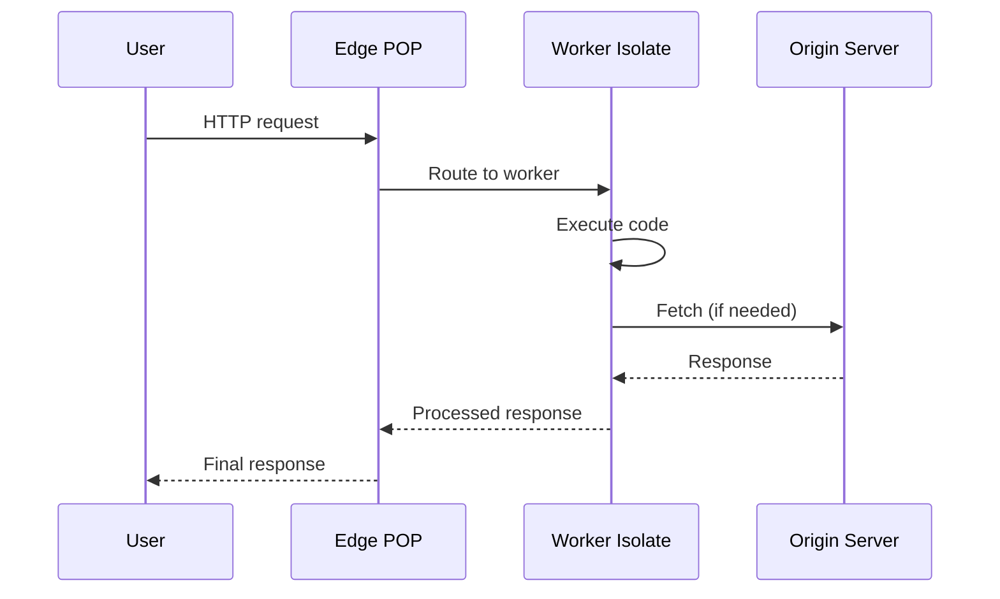
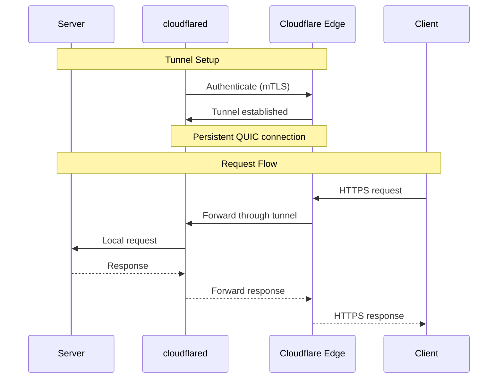

# Zero to Cloudflare Engineer: First-Principles Guide

## Table of Contents

1. [What is Cloudflare's Edge Network?](#1-what-is-cloudflares-edge-network)
2. [Workers Runtime and Isolates](#2-workers-runtime-and-isolates)
3. [Durable Objects and Stateful Computation](#3-durable-objects-and-stateful-computation)
4. [Edge AI and Inference](#4-edge-ai-and-inference)
5. [Tunnel Protocols and Connectivity](#5-tunnel-protocols-and-connectivity)
6. [RPC and Communication Patterns](#6-rpc-and-communication-patterns)
7. [Your Learning Path](#7-your-learning-path)

---

## 1. What is Cloudflare's Edge Network?

### 1.1 The Fundamental Question

**What is "the edge"?**

The edge is the geographical distribution of compute resources closer to end users, as opposed to centralized data centers.

```
Traditional Cloud              Edge Network
┌─────────────────┐           ┌─────────────────────────────┐
│   US-East       │           │  NYC   LAX   MIA   SEA     │
│   ┌─────────┐   │           │   │     │     │     │      │
│   │  App    │   │    vs     │   ▼     ▼     ▼     ▼      │
│   └────┬────┘   │           │ ┌─────────────────────┐    │
│        │        │           │ │  Users (everywhere) │    │
│        ▼        │           │ └─────────────────────┘    │
│   ┌─────────┐   │           └─────────────────────────────┘
│   │  DB     │   │
│   └─────────┘   │
└─────────────────┘
```

**Why edge computing?**

| Benefit | Description | Example |
|---------|-------------|---------|
| Lower latency | Closer to users = faster responses | 5ms vs 100ms |
| Higher availability | Distributed = no single point of failure | 300+ locations |
| Better scaling | Horizontal by design | Millions of requests |
| Data sovereignty | Process data in-region | GDPR compliance |

### 1.2 Cloudflare's Global Network

Cloudflare operates one of the world's largest edge networks:

```
┌───────────────────────────────────────────────────────────┐
│                    Cloudflare Network                      │
│                                                            │
│   300+ cities across 100+ countries                        │
│   100+ Tbps network capacity                               │
│   Processes 20%+ of global web traffic                     │
│                                                            │
│   ┌────────┐  ┌────────┐  ┌────────┐  ┌────────┐          │
│   │  POP   │  │  POP   │  │  POP   │  │  POP   │   ...    │
│   │ Tokyo  │  │ London │  │  NYC   │  │  Sydney│          │
│   └────────┘  └────────┘  └────────┘  └────────┘          │
│                                                            │
└───────────────────────────────────────────────────────────┘
```

**POP (Point of Presence):** A physical data center where Cloudflare runs servers.

### 1.3 Real-World Analogy

Think of Cloudflare like a **global postal service**:

| Postal Service | Cloudflare |
|----------------|------------|
| Local post office | Edge POP |
| Regional sorting facility | Regional data center |
| International hub | Core network |
| Mail carrier | Request routing |
| PO Box | Durable Object |
| Certified mail | Encrypted tunnel |

---

## 2. Workers Runtime and Isolates

### 2.1 What are Workers?

Workers are serverless functions that run on Cloudflare's edge:

```typescript
// worker.ts
export default {
  async fetch(request: Request, env: Env) {
    return new Response("Hello from the edge!");
  }
};
```

**Key properties:**
- **Cold start:** ~5ms (vs seconds for traditional serverless)
- **Isolation:** Each worker runs in its own V8 isolate
- **Limits:** 10ms CPU time (standard), 50ms (unbound)

### 2.2 V8 Isolates Explained

An isolate is a lightweight VM instance:

```
┌─────────────────────────────────────────────────────────┐
│                    Physical Server                       │
│  ┌─────────────┐  ┌─────────────┐  ┌─────────────┐      │
│  │  Isolate 1  │  │  Isolate 2  │  │  Isolate 3  │      │
│  │  (Worker)   │  │  (Worker)   │  │  (Worker)   │      │
│  └─────────────┘  └─────────────┘  └─────────────┘      │
│         ...              ...              ...            │
│  Thousands of isolates per server                        │
└─────────────────────────────────────────────────────────┘
```

**Why isolates?**

| Traditional Containers | V8 Isolates |
|------------------------|-------------|
| MBs of memory | KBs of memory |
| Seconds to start | Milliseconds to start |
| Process isolation | Script isolation |
| One per workload | Many per workload |

### 2.3 Request Flow



### 2.4 Your First Worker

```bash
# Install Wrangler (Cloudflare CLI)
npm install -g wrangler

# Create a new worker
wrangler init my-worker

# Edit src/index.ts
export default {
  async fetch(request: Request) {
    const url = new URL(request.url);
    return new Response(`Hello from ${url.hostname}!`);
  }
};

# Deploy
wrangler deploy
```

---

## 3. Durable Objects and Stateful Computation

### 3.1 The State Problem

Workers are stateless by default:

```typescript
let counter = 0;  // Lost after each request!

export default {
  async fetch() {
    counter++;  // Always resets
    return new Response(`Count: ${counter}`);
  }
};
```

**Solutions:**
1. External database (adds latency)
2. KV storage (eventually consistent)
3. **Durable Objects** (strongly consistent, co-located)

### 3.2 What are Durable Objects?

Durable Objects are stateful, strongly-consistent objects:

```typescript
// counter.ts
export class Counter {
  state: DurableObjectState;
  count: number = 0;

  constructor(state: DurableObjectState) {
    this.state = state;
  }

  async fetch(request: Request) {
    this.count++;
    await this.state.storage.put("count", this.count);
    return new Response(`Count: ${this.count}`);
  }
}
```

**Key properties:**
- **Single instance:** One instance per unique ID
- **Strong consistency:** All operations serialized
- **Persistent storage:** Built-in SQLite
- **Automatic hibernation:** Wakes on request

### 3.3 Real-World Analogy

Durable Objects are like **bank vaults**:

| Bank Vault | Durable Object |
|------------|----------------|
| One vault per customer | One instance per ID |
| Secure, consistent storage | Persistent storage |
| Only one person at a time | Serialized operations |
| Opens when needed | Wakes on request |

### 3.4 Agent Pattern

Cloudflare Agents build on Durable Objects:

```typescript
import { Agent, callable } from "agents";

export class ChatAgent extends Agent<Env, { messages: Message[] }> {
  initialState = { messages: [] };

  @callable()
  async sendMessage(text: string) {
    const response = await this.ai.run('@cf/llama-3', {
      messages: [...this.state.messages, { role: 'user', content: text }]
    });

    this.setState({
      messages: [
        ...this.state.messages,
        { role: 'user', content: text },
        { role: 'assistant', content: response }
      ]
    });

    return response;
  }
}
```

---

## 4. Edge AI and Inference

### 4.1 Why Edge AI?

Traditional AI:
```
User → Internet → Cloud (GPU) → Internet → User
       50ms       1000ms         50ms      = 1100ms
```

Edge AI:
```
User → Edge POP (GPU) → User
       5ms      50ms      5ms   = 60ms
```

### 4.2 Workers AI

Workers AI provides on-demand AI inference:

```typescript
import { Ai } from '@cloudflare/workers-ai';

export default {
  async fetch(request: Request, env: Env) {
    const ai = new Ai(env.AI);

    const response = await ai.run('@cf/meta/llama-3-8b-instruct', {
      messages: [{ role: 'user', content: 'Hello!' }]
    });

    return Response.json(response);
  }
};
```

**Available models:**
- **Chat:** Llama 3, Gemma, Mistral
- **Image:** Stable Diffusion
- **Embeddings:** BGE, E5
- **Audio:** Whisper (transcription)

### 4.3 AI Gateway

Route AI requests through a gateway:

```
┌─────────────────────────────────────────────────────┐
│                  AI Gateway                          │
│                                                       │
│   Request → Router → Cache → Model → Response        │
│                    │          │                       │
│                    ▼          ▼                       │
│              Rate Limit   Observability              │
│                                                       │
└─────────────────────────────────────────────────────┘
```

**Benefits:**
- **Caching:** Identical requests return cached results
- **Rate limiting:** Control API usage
- **Observability:** Track usage and costs
- **Fallback:** Switch models if one fails

---

## 5. Tunnel Protocols and Connectivity

### 5.1 The Connectivity Problem

How do you access services behind firewalls?

```
┌──────────┐    Internet    ┌─────────────┐    Firewall    ┌────────┐
│  Client  │ ─────────────> │  Cloudflare │ ────────────X> │ Server │
└──────────┘                └─────────────┘                └────────┘
                                                          (blocked)
```

### 5.2 Cloudflare Tunnel Solution

```
┌──────────┐    Internet    ┌─────────────┐    Tunnel     ┌────────┐
│  Client  │ ─────────────> │  Cloudflare │ ────────────> │ Server │
└──────────┘                └─────────────┘     (outbound) └────────┘
                                                         cloudflared
```

**Key insight:** cloudflared initiates an **outbound** connection (allowed by firewalls).

### 5.3 How Tunnels Work



### 5.4 Your First Tunnel

```bash
# Install cloudflared
brew install cloudflared  # macOS
# or download from GitHub

# Authenticate
cloudflared tunnel login

# Create tunnel
cloudflared tunnel create my-tunnel

# Configure (config.yml)
tunnel: my-tunnel
credentials-file: /path/to/creds.json
ingress:
  - hostname: app.example.com
    service: http://localhost:8080
  - service: http_status:404

# Run
cloudflared tunnel run my-tunnel
```

---

## 6. RPC and Communication Patterns

### 6.1 Why RPC at the Edge?

Edge functions need to communicate:

```
┌─────────┐          ┌─────────┐
│ Worker  │ ───────> │  DO     │
│  (API)  │   RPC    │ (State) │
└─────────┘          └─────────┘
```

### 6.2 Cap'n Proto RPC

Efficient RPC with zero-copy serialization:

```typescript
// Client
const result = await stub.fetch('https://example.com');

// Under the hood (simplified):
// ["push", ["import", -1, ["fetch"], ["https://example.com"]]]
```

**Key concepts:**
- **Import/Export tables:** Track remote references
- **Promise pipelining:** Chain calls without waiting
- **Zero-copy:** No serialization overhead for primitives

### 6.3 Promise Pipelining

Without pipelining (2 RTTs):
```typescript
const user = await api.getUser(id);      // RTT 1
const posts = await user.getPosts();     // RTT 2
```

With pipelining (1 RTT):
```typescript
const posts = await api.pipeline
  .getUser(id)
  .getProperty("posts");  // Single RTT
```

### 6.4 Agent Communication

Agents communicate via send/query:

```typescript
// Request/Response
const result = await agent.send("Process this request");

// Structured query
const data = await agent.query("Get user count", {
  type: 'number'
});

// Channels (pub/sub)
channel.publish("Update available");
```

---

## 7. Your Learning Path

### 7.1 Progressive Learning

```
Level 1: Foundations
├── Deploy first Worker
├── Understand request/response
└── Learn Wrangler CLI

Level 2: State
├── Use KV storage
├── Create Durable Object
└── Build stateful counter

Level 3: AI
├── Call Workers AI models
├── Build chat interface
└── Add AI Gateway

Level 4: Connectivity
├── Set up cloudflared
├── Configure tunnel
└── Access internal services

Level 5: Production
├── Add monitoring
├── Implement rate limiting
├── Set up CI/CD
└── Deploy multi-region
```

### 7.2 Project Ideas

| Level | Project | Concepts |
|-------|---------|----------|
| 1 | URL shortener | Workers, KV |
| 2 | Real-time counter | Durable Objects |
| 3 | AI chatbot | Workers AI, Agents |
| 4 | Internal dashboard | Tunnel, Access |
| 5 | Global SaaS | All concepts |

### 7.3 Recommended Resources

**Documentation:**
- [Workers Docs](https://developers.cloudflare.com/workers/)
- [Durable Objects Guide](https://developers.cloudflare.com/durable-objects/)
- [Workers AI Docs](https://developers.cloudflare.com/workers-ai/)

**Tools:**
- [Wrangler CLI](https://developers.cloudflare.com/workers/wrangler/)
- [Cloudflare Dashboard](https://dash.cloudflare.com/)

**Community:**
- [Cloudflare Discord](https://discord.gg/cloudflaredev)
- [Cloudflare Community](https://community.cloudflare.com/)

---

## Document History

| Date | Change |
|------|--------|
| 2026-03-27 | Initial guide created |
| 2026-03-27 | All sections outlined |
| 2026-03-27 | Examples and diagrams added |

---

*This guide is a living document. Revisit sections as concepts become clearer through implementation.*
