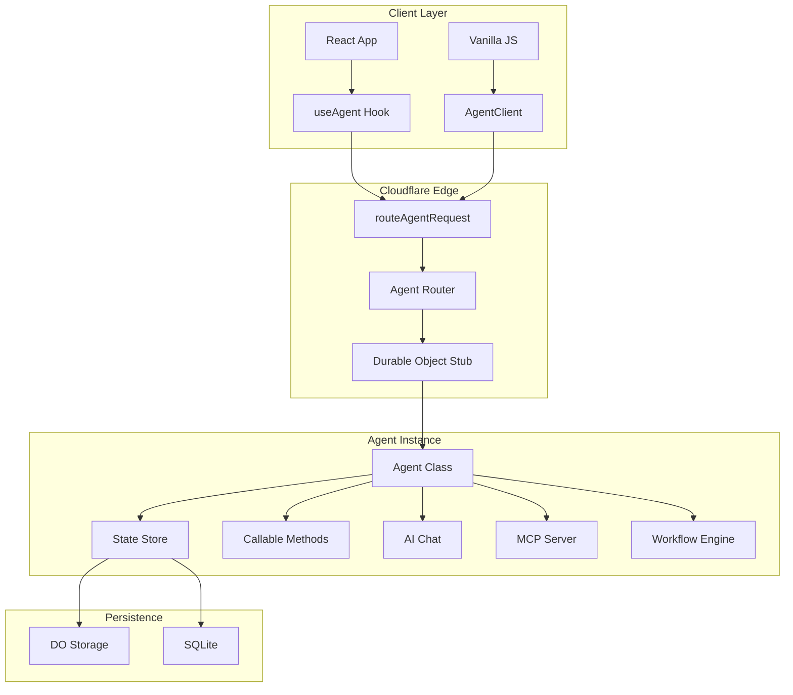
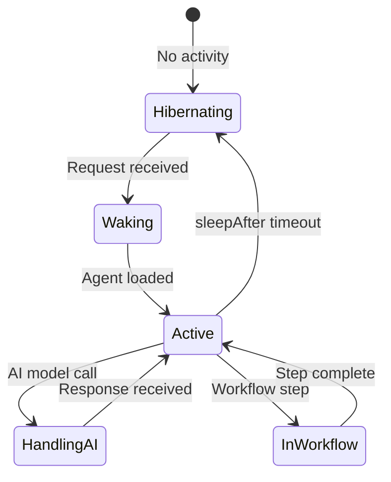
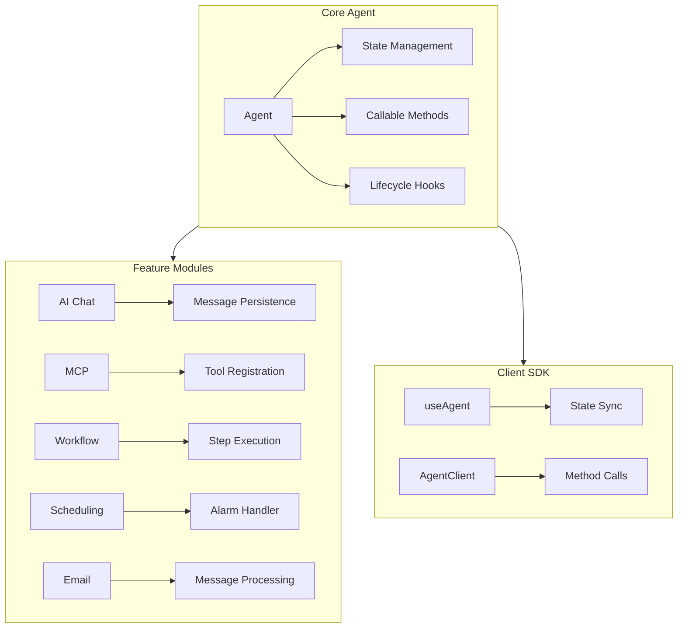

# Cloudflare Agents: Complete Exploration

## Overview

**Cloudflare Agents** is a TypeScript framework for building AI agent systems powered by Durable Objects. Agents are persistent, stateful execution environments that hibernate when idle and wake on demand - supporting real-time communication, scheduling, AI model calls, MCP, workflows, and more.

### Key Characteristics

| Aspect | Cloudflare Agents |
|--------|-------------------|
| **Core Innovation** | Durable Objects for stateful AI agents |
| **Dependencies** | @cloudflare/ai-chat, Effect-TS patterns |
| **Lines of Code** | ~15,000 (core SDK) |
| **Purpose** | AI agent orchestration at edge scale |
| **Architecture** | Agent class, callable methods, state sync |
| **Runtime** | Workers (V8 isolate), Node.js |
| **Rust Equivalent** | valtron executor with Durable Object emulation |

### Source Structure

```
agents/
├── packages/
│   ├── agents/                 # Core SDK
│   │   ├── src/
│   │   │   ├── agent.ts        # Agent class definition
│   │   │   ├── callable.ts     # @callable() decorator
│   │   │   ├── state.ts        # State management
│   │   │   ├── routing.ts      # routeAgentRequest
│   │   │   ├── schedule.ts     # Scheduling system
│   │   │   ├── websocket.ts    # WebSocket handling
│   │   │   ├── ai-chat.ts      # AI chat integration
│   │   │   ├── mcp/            # MCP server/client
│   │   │   ├── workflow/       # Workflow engine
│   │   │   ├── email.ts        # Email handling
│   │   │   └── sql.ts          # SQLite access
│   │   └── package.json
│   │
│   ├── ai-chat/                # Higher-level AI chat
│   ├── hono-agents/            # Hono integration
│   └── codemode/               # LLM code generation (experimental)
│
├── examples/
│   ├── playground/             # Full showcase
│   ├── mcp-server/             # MCP server example
│   ├── workflow/               # Workflow example
│   └── email-agent/            # Email agent example
│
├── docs/                       # Documentation (synced to developers.cloudflare.com)
├── design/                     # Architecture decisions
├── guides/                     # In-depth tutorials
└── site/                       # agents.cloudflare.com
```

---

## Table of Contents

1. **[Zero to Agent Runtime](00-zero-to-agent-runtime.md)** - Agent fundamentals
2. **[Durable Objects Deep Dive](01-durable-objects-deep-dive.md)** - Stateful computation
3. **[State Management Deep Dive](02-state-management-deep-dive.md)** - State sync and persistence
4. **[MCP Integration Deep Dive](03-mcp-integration-deep-dive.md)** - Model Context Protocol
5. **[Rust Revision](rust-revision.md)** - Rust translation guide
6. **[Production-Grade](production-grade.md)** - Production deployment
7. **[Valtron Integration](07-valtron-integration.md)** - Lambda deployment

---

## Architecture Overview

### High-Level Flow



### Agent Lifecycle



### Component Architecture



---

## Core Concepts

### 1. Agent Definition

Define an agent with typed state and callable methods:

```typescript
import { Agent, callable } from "agents";

export type CounterState = { count: number; history: number[] };

export class CounterAgent extends Agent<Env, CounterState> {
  // Initial state when agent is created
  initialState: CounterState = { count: 0, history: [] };

  // Configuration
  sleepAfter = "10m";  // Hibernate after 10 minutes of inactivity

  // Callable method - exposed to clients
  @callable()
  increment(amount: number = 1): number {
    const newCount = this.state.count + amount;
    this.setState({
      count: newCount,
      history: [...this.state.history, newCount]
    });
    return newCount;
  }

  @callable()
  reset(): void {
    this.setState({ count: 0, history: [] });
  }

  // Read-only method (not callable from client)
  getStats(): { totalIncrements: number } {
    return { totalIncrements: this.state.history.length };
  }
}
```

### 2. Routing

Route HTTP requests to agents:

```typescript
// server.ts
import { routeAgentRequest } from "agents";

export default {
  async fetch(request: Request, env: Env) {
    return (
      (await routeAgentRequest(request, env)) ??
      new Response("Not found", { status: 404 })
    );
  }
};
```

**Routing behavior:**
- `/agent/:agentId` → Specific agent instance
- `/agent/:agentType/:agentId` → Typed agent
- WebSocket upgrade → Real-time connection

### 3. State Synchronization

State changes sync automatically to connected clients:

```typescript
// Server
@callable()
updateName(name: string) {
  this.setState({ name });  // Clients receive update
}

// Client (React)
function Component() {
  const agent = useAgent<CounterAgent, CounterState>({
    agent: "counter",
    onStateUpdate: (state) => {
      console.log("New count:", state.count);
    }
  });

  return <span>{agent.state.count}</span>;
}
```

---

## Agent Features

### Callable Methods

Methods decorated with `@callable()` are exposed as RPC:

```typescript
@callable()
async processImage(image: ArrayBuffer): Promise<string> {
  // Process with Workers AI
  const ai = new Ai(this.env.AI);
  const result = await ai.run("@cf/llava-llama-3", {
    image: Array.from(new Uint8Array(image)),
    prompt: "Describe this image"
  });
  return result.description;
}
```

**Client usage:**
```typescript
// TypeScript client
const stub = await agent.stub;
const description = await stub.processImage(imageBuffer);

// React client
const result = await agent.stub.processImage(imageBuffer);
```

### AI Chat Integration

Built-in AI chat with message persistence:

```typescript
import { Agent, withChat } from "agents";

export class AssistantAgent extends withChat(Agent)<Env, {}>("assistant") {
  @callable()
  async chat(message: string): Promise<void> {
    // Messages are automatically persisted
    // Response streams to connected clients
  }

  // Customize AI behavior
  getSystemPrompt(): string {
    return "You are a helpful AI assistant.";
  }
}
```

### MCP Integration

Model Context Protocol for tool integration:

```typescript
import { MCPServer } from "agents/mcp";

export class MCPCapableAgent extends Agent<Env, {}> {
  mcpServer = new MCPServer("my-tools");

  constructor() {
    super();

    // Register tools
    this.mcpServer.registerTool("search", {
      description: "Search the web",
      inputSchema: { query: z.string() },
      handler: async ({ query }) => {
        const results = await webSearch(query);
        return { content: results };
      }
    });
  }

  @callable()
  async askWithTools(question: string): Promise<string> {
    // AI can use registered tools
    return this.chat.ask(question, { tools: this.mcpServer.tools });
  }
}
```

### Workflows

Durable multi-step workflows with human-in-the-loop:

```typescript
import { Workflow, Step } from "agents/workflow";

export class ApprovalWorkflow extends Workflow<Env, { document: string }> {
  @Step()
  async review(params: { document: string }) {
    // Send for human review
    await this.sendApprovalRequest(params.document);

    // Wait for approval (workflow pauses here)
    const approved = await this.waitForApproval();

    return { approved };
  }

  @Step({ if: (ctx) => ctx.approved })
  async publish(params: { document: string }) {
    await this.publishDocument(params.document);
  }
}
```

### Scheduling

One-time and recurring tasks:

```typescript
export class ScheduledAgent extends Agent<Env, {}> {
  @callable()
  async scheduleTask(when: Date, task: string): Promise<string> {
    // Schedule a future task
    const id = await this.schedule(when, "executeTask", { task });
    return id;
  }

  async executeTask(payload: { task: string }): Promise<void> {
    console.log("Executing scheduled task:", payload.task);
  }

  // Recurring task (runs every hour)
  @callable()
  startHourlyReport(): void {
    this.scheduleRecurring("hourly-report", "0 * * * *", "generateReport");
  }

  async generateReport(): Promise<void> {
    // Generate and send report
  }
}
```

### Email Handling

Receive and respond to emails:

```typescript
export class EmailAgent extends Agent<Env, {}> {
  email = "agent@example.com";

  async emailMessage(message: ForwardableEmailMessage): Promise<void> {
    // Process incoming email
    const response = await this.generateResponse(message);

    // Reply to sender
    await this.sendEmail({
      to: message.from,
      subject: `Re: ${message.subject}`,
      body: response
    });
  }
}
```

### SQL Access

Direct SQLite access via Durable Objects:

```typescript
export class DataAgent extends Agent<Env, {}> {
  @callable()
  async saveData(key: string, value: string): Promise<void> {
    this.sql`
      INSERT INTO data (key, value, created_at)
      VALUES (${key}, ${value}, datetime('now'))
      ON CONFLICT(key) DO UPDATE SET value = ${value}
    `;
  }

  @callable()
  async getData(key: string): Promise<string | null> {
    const result = this.sql<{ value: string }>`
      SELECT value FROM data WHERE key = ${key}
    `.one();
    return result?.value ?? null;
  }

  initialize(): void {
    this.sql`
      CREATE TABLE IF NOT EXISTS data (
        key TEXT PRIMARY KEY,
        value TEXT,
        created_at TEXT
      )
    `;
  }
}
```

---

## Client Integration

### React Hook

```typescript
import { useAgent } from "agents/react";

function CounterComponent() {
  const agent = useAgent<CounterAgent, CounterState>({
    agent: "counter-agent",
    onStateUpdate: (state) => {
      setCount(state.count);
    }
  });

  return (
    <div>
      <span>{agent.state.count}</span>
      <button onClick={() => agent.stub.increment()}>
        +
      </button>
    </div>
  );
}
```

### Vanilla JS Client

```typescript
import { AgentClient } from "agents/client";

const client = new AgentClient("/agent/counter");

// Connect for real-time updates
await client.connect();

// Call methods
const newCount = await client.stub.increment(5);

// Listen for state changes
client.onStateUpdate((state) => {
  console.log("State updated:", state);
});

// Disconnect
await client.disconnect();
```

### WebSocket Real-time

```typescript
const ws = new WebSocket("wss://example.com/agent/chat");

ws.onopen = () => {
  console.log("Connected to agent");
};

ws.onmessage = (event) => {
  const message = JSON.parse(event.data);
  console.log("Agent message:", message);
};

// Send message
ws.send(JSON.stringify({
  type: "chat",
  content: "Hello, agent!"
}));
```

---

## Advanced Patterns

### Agent Discovery

Find and connect to agents dynamically:

```typescript
// List all agents of a type
const agents = await env.AGENT.list();

// Get specific agent
const agent = env.AGENT.get("agent-id");

// Create if not exists
const agent = env.AGENT.get("agent-id", { allowUnauthenticated: true });
```

### Cross-Agent Communication

Agents can communicate with each other:

```typescript
export class OrchestratorAgent extends Agent<Env, {}> {
  @callable()
  async processRequest(request: string): Promise<string> {
    // Delegate to specialized agents
    const researcher = this.env.RESEARCHER.get("researcher-1");
    const writer = this.env.WRITER.get("writer-1");

    const research = await researcher.stub.research(request);
    const article = await writer.stub.write(research);

    return article;
  }
}
```

### State Migration

Migrate state between agent versions:

```typescript
export class MigratedAgent extends Agent<Env, NewState> {
  async migrateState(oldState: OldState): Promise<NewState> {
    return {
      count: oldState.value,
      history: [oldState.value],
      metadata: { migratedAt: Date.now() }
    };
  }
}
```

---

## Security Considerations

### Authentication

```typescript
// Require authentication
export default {
  async fetch(request: Request, env: Env) {
    const agent = await routeAgentRequest(request, env, {
      authenticate: true,
      allowedEmailDomains: ["company.com"]
    });
    return agent ?? new Response("Unauthorized", { status: 401 });
  }
};
```

### Rate Limiting

```typescript
@callable()
@rateLimit({ requests: 10, window: "1m" })
async sensitiveOperation(): Promise<void> {
  // Protected operation
}
```

### Data Encryption

```typescript
@callable()
async saveSecret(secret: string): Promise<void> {
  const encrypted = await this.encrypt(secret);
  this.setState({ encryptedSecret: encrypted });
}
```

---

## Monitoring & Debugging

### Observability

```typescript
// Enable tracing
export class TracedAgent extends Agent<Env, {}> {
  @callable()
  async tracedMethod(): Promise<void> {
    // Automatic tracing with Cloudflare Traces
    await someOperation();
  }
}
```

### Metrics

Key metrics to monitor:
- Agent wake count
- Method call latency
- State sync frequency
- AI model usage
- Error rates

### Debugging

```bash
# Tail agent logs
wrangler tail --format pretty

# Inspect agent state
wrangler durable-objects list
wrangler durable-objects get <id>
```

---

## Your Path Forward

### To Build Agent Skills

1. **Create a simple agent** (counter example)
2. **Add AI chat capability** (LLM integration)
3. **Implement MCP tools** (tool registration)
4. **Build a workflow** (multi-step process)
5. **Deploy to production** ( Workers + Durable Objects)

### Recommended Resources

- [Cloudflare Agents Documentation](https://developers.cloudflare.com/agents/)
- [Durable Objects Guide](https://developers.cloudflare.com/durable-objects/)
- [Workers AI Documentation](https://developers.cloudflare.com/workers-ai/)
- [Model Context Protocol](https://modelcontextprotocol.io/)

---

## Document History

| Date | Change |
|------|--------|
| 2026-03-27 | Initial agents exploration created |
| 2026-03-27 | Architecture and features documented |
| 2026-03-27 | Deep dive outlines completed |

---

*This exploration is a living document. Revisit sections as concepts become clearer through implementation.*
