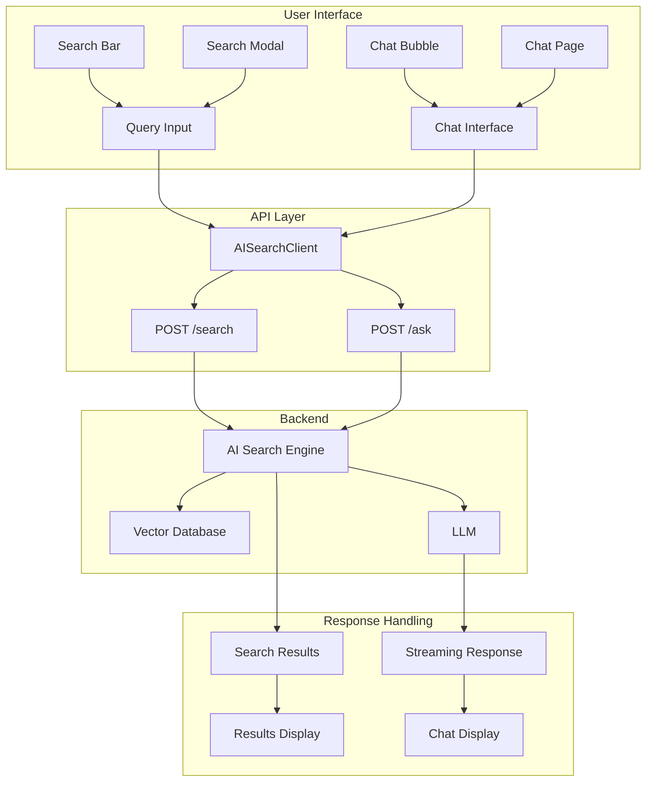
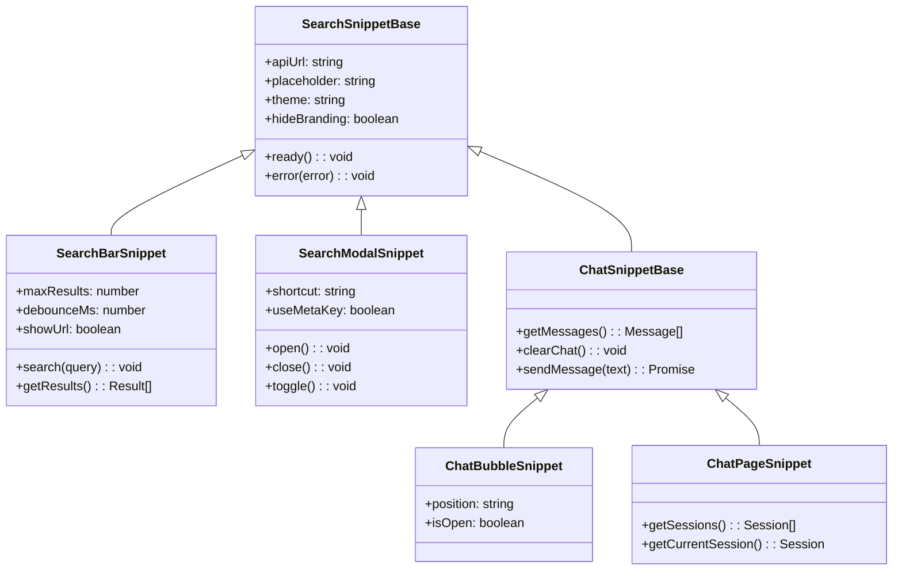

# AI Search Snippet: Complete Exploration

## Overview

**AI Search Snippet** is a production-ready, self-contained TypeScript Web Component library providing search and chat interfaces with streaming support. Zero dependencies, fully customizable, and framework-agnostic.

### Key Characteristics

| Aspect | AI Search Snippet |
|--------|-------------------|
| **Core Innovation** | Zero-dependency Web Components with streaming |
| **Dependencies** | None (pure TypeScript) |
| **Lines of Code** | ~3,000 |
| **Purpose** | Search/chat UI for AI Search endpoints |
| **Architecture** | Web Components, CSS variables, event system |
| **Runtime** | Modern browsers (Chrome 90+, Firefox 88+, Safari 14+) |
| **Rust Equivalent** | N/A (browser UI component) |

### Source Structure

```
ai-search-snippet/
├── src/
│   ├── api/
│   │   ├── index.ts           # Base Client class
│   │   └── ai-search.ts       # AISearchClient with streaming
│   │
│   ├── components/
│   │   ├── search-bar-snippet.ts    # Search input with dropdown
│   │   ├── search-modal-snippet.ts  # Modal with Cmd/Ctrl+K
│   │   ├── chat-bubble-snippet.ts   # Floating chat bubble
│   │   ├── chat-page-snippet.ts     # Full-page chat
│   │   └── chat-view.ts             # Shared chat interface
│   │
│   ├── styles/
│   │   ├── theme.ts           # Base styles & CSS variables
│   │   ├── search.ts          # Search-specific styles
│   │   └── chat.ts            # Chat-specific styles
│   │
│   ├── types/
│   │   └── index.ts           # TypeScript definitions
│   │
│   └── utils/
│       └── index.ts           # Utility functions
│
├── dist/                      # Build output
├── index.html                 # Demo page
├── package.json
├── tsconfig.json
├── vite.config.ts
└── README.md
```

---

## Table of Contents

1. **[Zero to Web Components](00-zero-to-web-components.md)** - Component fundamentals
2. **[Rust Revision](rust-revision.md)** - Rust translation guide (for embedded use)
3. **[Production-Grade](production-grade.md)** - Production deployment
4. **[Valtron Integration](07-valtron-integration.md)** - Lambda deployment

---

## Architecture Overview

### High-Level Flow



### Component Hierarchy



---

## Core Concepts

### 1. Web Components

Self-contained custom elements:

```typescript
// Search bar component
class SearchBarSnippet extends HTMLElement {
  static get observedAttributes() {
    return ['api-url', 'placeholder', 'max-results'];
  }

  connectedCallback() {
    this.render();
    this.attachEventListeners();
  }

  async search(query: string) {
    const results = await this.client.search(query);
    this.displayResults(results);
  }

  private render() {
    this.innerHTML = `
      <style>${styles}</style>
      <div class="search-container">
        <input type="text" placeholder="${this.placeholder}" />
        <div class="results"></div>
      </div>
    `;
  }
}

customElements.define('search-bar-snippet', SearchBarSnippet);
```

### 2. CSS Variables

Fully customizable theming:

```css
search-bar-snippet {
  /* Primary colors */
  --search-snippet-primary-color: #2563eb;
  --search-snippet-primary-hover: #0f51df;

  /* Background */
  --search-snippet-background: #ffffff;
  --search-snippet-surface: #f8f9fa;

  /* Typography */
  --search-snippet-font-family: -apple-system, BlinkMacSystemFont, "Segoe UI";
  --search-snippet-font-size-base: 14px;

  /* Spacing */
  --search-snippet-spacing-sm: 8px;
  --search-snippet-spacing-md: 12px;

  /* Shadows */
  --search-snippet-shadow: 0 2px 8px rgba(0, 0, 0, 0.1);

  /* Animation */
  --search-snippet-transition: 200ms ease;
}
```

### 3. Event System

Custom events for component communication:

```typescript
// Dispatching events
this.dispatchEvent(new CustomEvent('result-select', {
  detail: { result: selectedResult }
}));

this.dispatchEvent(new CustomEvent('error', {
  detail: { error: errorMessage }
}));

// Listening to events
component.addEventListener('result-select', (e) => {
  console.log('Selected:', e.detail.result);
});

component.addEventListener('error', (e) => {
  console.error('Error:', e.detail.error);
});
```

---

## Component API

### Search Bar

```html
<search-bar-snippet
  api-url="https://search.example.com"
  placeholder="Search..."
  max-results="10"
  debounce-ms="300"
  show-url="false"
>
</search-bar-snippet>
```

**JavaScript API:**
```typescript
const searchBar = document.querySelector('search-bar-snippet');

// Programmatic search
searchBar.search('query');

// Get current results
const results = searchBar.getResults();
```

### Search Modal

```html
<search-modal-snippet
  api-url="https://search.example.com"
  placeholder="Search documentation..."
  shortcut="k"
  use-meta-key="true"
>
</search-modal-snippet>
```

**JavaScript API:**
```typescript
const modal = document.querySelector('search-modal-snippet');

modal.open();
modal.close();
modal.toggle();
modal.search('query');  // Open and search

const results = modal.getResults();
const isOpen = modal.isModalOpen();
```

### Chat Bubble

```html
<chat-bubble-snippet
  api-url="https://chat.example.com"
  placeholder="Type a message..."
  theme="auto"
>
</chat-bubble-snippet>
```

**JavaScript API:**
```typescript
const chatBubble = document.querySelector('chat-bubble-snippet');

await chatBubble.sendMessage('Hello!');
const messages = chatBubble.getMessages();
chatBubble.clearChat();
```

### Chat Page

```html
<chat-page-snippet
  api-url="https://chat.example.com"
  placeholder="Type a message..."
>
</chat-page-snippet>
```

**JavaScript API:**
```typescript
const chatPage = document.querySelector('chat-page-snippet');

await chatPage.sendMessage('Hello!');
const messages = chatPage.getMessages();
const sessions = chatPage.getSessions();
const current = chatPage.getCurrentSession();
```

---

## API Client

### Search Endpoint

```typescript
class AISearchClient {
  private baseUrl: string;

  constructor(baseUrl: string) {
    this.baseUrl = baseUrl;
  }

  async search(query: string, options: SearchOptions): Promise<SearchResult> {
    const response = await fetch(`${this.baseUrl}/search`, {
      method: 'POST',
      headers: { 'Content-Type': 'application/json' },
      body: JSON.stringify({
        query,
        max_results: options.maxResults,
        filters: options.filters
      })
    });

    return response.json();
  }
}
```

**Request/Response:**
```json
// POST /search
{
  "query": "search query",
  "max_results": 10,
  "filters": {}
}

// Response
{
  "results": [
    {
      "id": "result-1",
      "title": "Result Title",
      "snippet": "Result description...",
      "url": "https://example.com",
      "metadata": {}
    }
  ],
  "total": 42
}
```

### Chat Endpoint (Streaming)

```typescript
async ask(query: string, history: Message[]): Promise<ReadableStream> {
  const response = await fetch(`${this.baseUrl}/ask`, {
    method: 'POST',
    headers: { 'Content-Type': 'application/json' },
    body: JSON.stringify({
      query,
      generate_mode: 'summarize',
      prev: history
    })
  });

  return response.body!;  // ReadableStream
}

// Process streaming response
async function processStream(stream: ReadableStream) {
  const reader = stream.getReader();
  const decoder = new TextDecoder();

  while (true) {
    const { done, value } = await reader.read();
    if (done) break;

    const chunk = decoder.decode(value);
    console.log('Received:', chunk);
  }
}
```

---

## Framework Integration

### React

```tsx
import { useEffect, useRef } from 'react';
import '@cloudflare/ai-search-snippet';

function SearchWidget() {
  const ref = useRef<HTMLElement>(null);

  useEffect(() => {
    const search = ref.current;

    const handleResult = (e: CustomEvent) => {
      console.log('Result selected:', e.detail);
    };

    search?.addEventListener('result-select', handleResult as EventListener);

    return () => {
      search?.removeEventListener('result-select', handleResult as EventListener);
    };
  }, []);

  return (
    <search-bar-snippet
      ref={ref}
      api-url="https://api.example.com"
      placeholder="Search..."
    />
  );
}
```

### Vue

```vue
<template>
  <chat-bubble-snippet
    :api-url="apiUrl"
    placeholder="Ask a question..."
    @message="handleMessage"
    @error="handleError"
  />
</template>

<script setup>
import { ref } from 'vue';
import '@cloudflare/ai-search-snippet';

const apiUrl = ref('https://api.example.com');

const handleMessage = (event) => {
  console.log('Message:', event.detail.message);
};

const handleError = (event) => {
  console.error('Error:', event.detail.error);
};
</script>
```

### Svelte

```svelte
<script>
  import '@cloudflare/ai-search-snippet';

  let apiUrl = 'https://api.example.com';

  function handleMessage(event) {
    console.log('Message:', event.detail);
  }
</script>

<chat-bubble-snippet
  {apiUrl}
  placeholder="Ask a question..."
  on:message={handleMessage}
/>
```

---

## Styling & Customization

### Dark Theme

```css
search-bar-snippet,
chat-bubble-snippet {
  --search-snippet-primary-color: #4dabf7;
  --search-snippet-background: #1a1b1e;
  --search-snippet-text-color: #c1c2c5;
  --search-snippet-border-color: #373a40;
  --search-snippet-surface: #2d2f36;
}
```

### Custom Brand

```css
chat-bubble-snippet {
  --search-snippet-primary-color: #667eea;
  --search-snippet-primary-hover: #5568d3;
  --search-snippet-border-radius: 12px;
  --search-snippet-shadow: 0 4px 12px rgba(102, 126, 234, 0.2);

  /* Chat bubble specific */
  --chat-bubble-button-size: 60px;
  --chat-bubble-button-bottom: 20px;
  --chat-bubble-button-right: 20px;
}
```

---

## Accessibility

### WCAG 2.1 AA Compliance

```html
<search-bar-snippet
  role="search"
  aria-label="Search the site"
>
  <input
    type="text"
    aria-label="Search query"
    aria-describedby="search-help"
  />
  <span id="search-help" class="visually-only">
    Type your search query and press Enter
  </span>
</search-bar-snippet>
```

### Keyboard Navigation

```typescript
// Modal opens with Cmd/Ctrl+K
document.addEventListener('keydown', (e) => {
  if ((e.metaKey || e.ctrlKey) && e.key === 'k') {
    e.preventDefault();
    modal.open();
  }
});

// Escape closes modal
modal.addEventListener('keydown', (e) => {
  if (e.key === 'Escape') {
    modal.close();
  }
});
```

---

## Performance

### Bundle Size

| Component | Size (minified) | Size (gzipped) |
|-----------|-----------------|----------------|
| Search Bar | ~12 KB | ~5 KB |
| Search Modal | ~15 KB | ~6 KB |
| Chat Bubble | ~18 KB | ~7 KB |
| Chat Page | ~22 KB | ~8 KB |
| Full Library | ~45 KB | ~18 KB |

### Lazy Loading

```html
<!-- Load on demand -->
<script type="module">
  // Load only what you need
  const { SearchBarSnippet } = await import(
    'https://cdn.example.com/search-bar-snippet.js'
  );
  customElements.define('search-bar-snippet', SearchBarSnippet);
</script>
```

---

## Browser Support

| Browser | Minimum Version |
|---------|-----------------|
| Chrome | 90+ |
| Firefox | 88+ |
| Safari | 14+ |
| Edge | 90+ |

**Required features:**
- Custom Elements v1
- Shadow DOM
- Fetch API
- ReadableStream
- ES2020

---

## Your Path Forward

### To Build Search Snippet Skills

1. **Create a basic search bar** (input + results)
2. **Add streaming chat** (ReadableStream handling)
3. **Implement theming** (CSS variables)
4. **Build framework wrappers** (React, Vue)
5. **Optimize for production** (lazy loading, caching)

### Recommended Resources

- [Web Components MDN](https://developer.mozilla.org/en-US/docs/Web/Web_Components)
- [Custom Elements Spec](https://html.spec.whatwg.org/multipage/custom-elements.html)
- [CSS Custom Properties](https://developer.mozilla.org/en-US/docs/Web/CSS/Using_CSS_custom_properties)
- [Cloudflare AI Search](https://developers.cloudflare.com/ai-search/)

---

## Document History

| Date | Change |
|------|--------|
| 2026-03-27 | Initial AI Search Snippet exploration created |
| 2026-03-27 | Components and API documented |
| 2026-03-27 | Deep dive outlines completed |

---

*This exploration is a living document. Revisit sections as concepts become clearer through implementation.*
