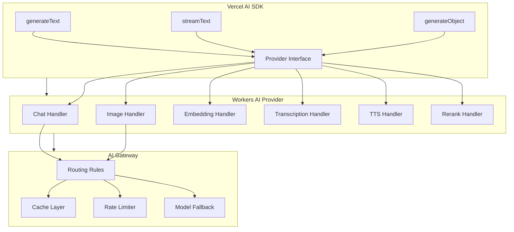

# Cloudflare AI: Complete Exploration

## Overview

**Cloudflare AI** is a comprehensive suite of packages for building AI-powered applications on Cloudflare. It includes providers for the Vercel AI SDK and TanStack AI, with support for Workers AI models and AI Gateway routing.

### Key Characteristics

| Aspect | Cloudflare AI |
|--------|---------------|
| **Core Innovation** | Edge AI inference with gateway routing |
| **Dependencies** | Vercel AI SDK, TanStack AI |
| **Lines of Code** | ~8,000 (packages) + demos |
| **Purpose** | AI/ML infrastructure at the edge |
| **Architecture** | Provider pattern, gateway routing, model abstraction |
| **Runtime** | Workers, Node.js, Browser |
| **Rust Equivalent** | candle, burn, edge ML frameworks |

### Source Structure

```
ai/
├── packages/
│   ├── workers-ai-provider/     # Workers AI provider for Vercel AI SDK
│   │   ├── src/
│   │   │   ├── index.ts         # Provider entry point
│   │   │   ├── chat.ts          # Chat completion
│   │   │   ├── image.ts         # Image generation
│   │   │   ├── embedding.ts     # Embeddings
│   │   │   ├── transcription.ts # Audio transcription
│   │   │   ├── tts.ts           # Text-to-speech
│   │   │   └── rerank.ts        # Reranking
│   │   └── package.json
│   │
│   ├── ai-gateway-provider/     # AI Gateway provider
│   │   ├── src/
│   │   │   ├── index.ts         # Gateway routing
│   │   │   ├── routing.ts       # Model routing rules
│   │   │   └── caching.ts       # Response caching
│   │   └── package.json
│   │
│   └── tanstack-ai/             # TanStack AI adapters
│       ├── src/
│       │   ├── workers.ts       # Workers AI adapter
│       │   ├── gateway.ts       # AI Gateway adapter
│       │   └── providers/       # External provider adapters
│       └── package.json
│
├── examples/
│   ├── workers-ai/              # Full Workers AI playground
│   └── tanstack-ai/             # TanStack AI multi-provider demo
│
├── demos/
│   ├── hello-world/             # Basic setup
│   ├── text-generation/         # Text generation
│   ├── image-generation/        # Image generation
│   ├── vision/                  # Vision models
│   ├── tool-calling/            # Tool calling patterns
│   ├── structured-output/       # Structured outputs
│   ├── agent-task-manager/      # Agent orchestration
│   ├── mcp-server/              # MCP server demo
│   └── ... (40+ focused demos)
│
├── README.md
├── package.json
└── pnpm-workspace.yaml
```

---

## Table of Contents

1. **[Zero to Workers AI](00-zero-to-workers-ai.md)** - AI fundamentals
2. **[Models & Inference Deep Dive](01-models-inference-deep-dive.md)** - Model architecture
3. **[AI Gateway Deep Dive](02-ai-gateway-deep-dive.md)** - Gateway routing
4. **[Rust Revision](rust-revision.md)** - Rust translation guide
5. **[Production-Grade](production-grade.md)** - Production deployment
6. **[Valtron Integration](07-valtron-integration.md)** - Lambda deployment

---

## Architecture Overview

### High-Level Flow

```mermaid
flowchart TB
    subgraph Client[Client Layer]
        A[React App] --> B[Vercel AI SDK]
        C[Vanilla JS] --> D[TanStack AI]
    end

    subgraph Providers[Provider Layer]
        B --> E[workers-ai-provider]
        B --> F[ai-gateway-provider]
        D --> G[tanstack-ai]
    end

    subgraph Edge[Cloudflare Edge]
        E --> H[Workers AI]
        F --> I[AI Gateway]
        G --> H
        G --> I
    end

    subgraph Models[Model Layer]
        H --> J[@cf/meta/llama-3-8b]
        H --> K[@cf/stabilityai/stable-diffusion]
        H --> L[@cf/baai/bge-base]
        I --> M[OpenAI]
        I --> N[Anthropic]
        I --> O[Google]
    end
```

### Provider Architecture



---

## Core Concepts

### 1. Workers AI Models

Workers AI provides on-demand AI inference at the edge:

```typescript
import { Ai } from '@cloudflare/workers-ai';

export default {
  async fetch(request: Request, env: Env) {
    const ai = new Ai(env.AI);

    // Text generation
    const response = await ai.run('@cf/meta/llama-3-8b-instruct', {
      messages: [
        { role: 'system', content: 'You are a helpful assistant.' },
        { role: 'user', content: 'Hello!' }
      ]
    });

    return Response.json(response);
  }
};
```

**Available Model Categories:**

| Category | Models | Use Case |
|----------|--------|----------|
| **Chat** | Llama 3, Gemma, Mistral | Conversational AI |
| **Image** | Stable Diffusion, SDXL | Image generation |
| **Embedding** | BGE, E5 | Semantic search |
| **Transcription** | Whisper | Speech-to-text |
| **TTS** | Fairseq, Metavoice | Text-to-speech |
| **Rerank** | BGE Reranker | Search ranking |

### 2. Vercel AI SDK Integration

Use Workers AI with the Vercel AI SDK:

```typescript
import { createWorkersAI } from 'workers-ai-provider';
import { generateText } from 'ai';

const workersAI = createWorkersAI({ binding: env.AI });

const { text } = await generateText({
  model: workersAI('@cf/meta/llama-3-8b-instruct'),
  prompt: 'Explain quantum computing in one paragraph'
});
```

**Streaming support:**
```typescript
import { streamText } from 'ai';

const result = streamText({
  model: workersAI('@cf/meta/llama-3-8b-instruct'),
  messages: conversation
});

return result.toDataStreamResponse();
```

### 3. AI Gateway

Route requests through AI Gateway for caching, rate limiting, and observability:

```typescript
import { createAIGateway } from 'ai-gateway-provider';

const gateway = createAIGateway({
  gatewayId: env.AI_GATEWAY_ID,
  routes: [
    {
      pattern: 'llama-*',
      models: ['@cf/meta/llama-3-8b-instruct']
    },
    {
      pattern: '*',
      models: ['openai/gpt-4', 'anthropic/claude-3']
    }
  ]
});
```

**Gateway features:**
- **Caching:** Cache responses for identical prompts
- **Rate limiting:** Control API usage
- **Observability:** Track usage and costs
- **Fallback:** Automatic failover between models

---

## Model Capabilities

### Chat Completion

```typescript
// Basic chat
const response = await ai.run('@cf/meta/llama-3-8b-instruct', {
  messages: [
    { role: 'system', content: 'You are helpful.' },
    { role: 'user', content: 'What is Rust?' }
  ],
  max_tokens: 1024,
  temperature: 0.7
});

// Streaming chat
const stream = await ai.run('@cf/meta/llama-3-8b-instruct', {
  messages,
  stream: true
});

for await (const chunk of stream) {
  console.log(chunk.response);
}
```

### Image Generation

```typescript
const image = await ai.run('@cf/stabilityai/stable-diffusion-xl-base-1.0', {
  prompt: 'A cyberpunk city at night',
  steps: 30,
  guidance: 7.5,
  width: 1024,
  height: 1024
});

// Returns base64 encoded image
const imageBuffer = Uint8Array.from(atob(image.image), c => c.charCodeAt(0));
```

### Embeddings

```typescript
const embeddings = await ai.run('@cf/baai/bge-base-en-v1.5', {
  text: ['Hello world', 'Goodbye world']
});

// Use for semantic search
const similarity = cosineSimilarity(
  embeddings.data[0],
  embeddings.data[1]
);
```

### Audio Transcription

```typescript
const transcription = await ai.run('@cf/openai/whisper', {
  audio: audioBuffer,  // Uint8Array
  language: 'en',
  task: 'transcribe'
});

console.log(transcription.text);
```

### Text-to-Speech

```typescript
const audio = await ai.run('@cf/metavoiceio/metavoice-1b-v0.1', {
  text: 'Hello, this is a text-to-speech example.',
  voice: 'default'
});

// Returns audio buffer
```

### Reranking

```typescript
const reranked = await ai.run('@cf/bge/bge-reranker-v2-m3', {
  query: 'machine learning tutorials',
  documents: [
    'Introduction to Python',
    'Deep Learning with PyTorch',
    'Basic Statistics'
  ]
});

// Returns documents sorted by relevance
```

---

## Advanced Patterns

### Tool Calling

```typescript
import { tool } from 'ai';

const result = await generateText({
  model: workersAI('@cf/meta/llama-3-8b-instruct'),
  messages: [{ role: 'user', content: "What's the weather in Tokyo?" }],
  tools: {
    getWeather: tool({
      description: 'Get weather for a location',
      parameters: z.object({
        location: z.string()
      }),
      execute: async ({ location }) => {
        const weather = await fetchWeather(location);
        return weather;
      }
    })
  }
});
```

### Structured Output

```typescript
import { generateObject } from 'ai';

const { object } = await generateObject({
  model: workersAI('@cf/meta/llama-3-8b-instruct'),
  schema: z.object({
    name: z.string(),
    age: z.number(),
    email: z.string().email()
  }),
  prompt: 'Extract: John is 30 years old, email john@example.com'
});

// object: { name: 'John', age: 30, email: 'john@example.com' }
```

### Multi-Provider Routing

```typescript
import { createTanStackAI } from '@cloudflare/tanstack-ai';

const ai = createTanStackAI({
  providers: {
    workersAI: {
      adapter: workersAIAdapter,
      models: {
        chat: '@cf/meta/llama-3-8b-instruct',
        image: '@cf/stabilityai/stable-diffusion-xl'
      }
    },
    openai: {
      adapter: openAIAdapter,
      apiKey: env.OPENAI_API_KEY,
      models: {
        chat: 'gpt-4',
        image: 'dall-e-3'
      }
    }
  },
  routing: {
    // Route based on capability
    'image': 'openai',
    'chat': 'workersAI'
  }
});
```

### Caching Strategy

```typescript
const gateway = createAIGateway({
  caching: {
    enabled: true,
    ttl: 3600,  // 1 hour
    keyGenerator: (request) => {
      // Custom cache key
      return hash(request.messages);
    }
  },
  rateLimit: {
    enabled: true,
    limit: 100,  // requests per minute
    window: 60
  }
});
```

---

## Demo Examples

### Hello World

```typescript
// demos/hello-world/wrangler.toml
[ai]
binding = "AI"

// demos/hello-world/src/index.ts
export default {
  async fetch(request: Request, env: Env) {
    const ai = new Ai(env.AI);
    const result = await ai.run('@cf/meta/llama-3-8b-instruct', {
      messages: [{ role: 'user', content: 'Say hello!' }]
    });
    return new Response(result.response);
  }
};
```

### Agent Task Manager

```typescript
// demos/agent-task-manager
export class TaskManager {
  async orchestrate(task: string) {
    // Break down task
    const steps = await this.planner(task);

    // Execute in parallel
    const results = await Promise.all(
      steps.map(step => this.executor(step))
    );

    // Synthesize result
    return this.synthesizer(results);
  }
}
```

### MCP Server

```typescript
// demos/mcp-server
import { MCPServer } from '@modelcontextprotocol/sdk';

const server = new MCPServer({
  name: 'workers-ai-server',
  version: '1.0.0'
});

server.registerTool('generate-text', {
  description: 'Generate text with Workers AI',
  inputSchema: { prompt: z.string() },
  handler: async ({ prompt }) => {
    const ai = new Ai(env.AI);
    return ai.run('@cf/meta/llama-3-8b-instruct', {
      messages: [{ role: 'user', content: prompt }]
    });
  }
});
```

---

## Performance Optimization

### Batching

```typescript
// Batch multiple requests
const embeddings = await ai.run('@cf/baai/bge-base-en-v1.5', {
  text: texts  // Array of texts
});

// More efficient than individual calls
```

### Streaming

```typescript
// Stream responses for lower latency
const stream = await ai.run(model, {
  messages,
  stream: true
});

// Process chunks as they arrive
for await (const chunk of stream) {
  yield chunk.response;
}
```

### Model Selection

| Model | Speed | Quality | Use Case |
|-------|-------|---------|----------|
| Llama 3 8B | Fast | Good | General chat |
| Llama 3 70B | Medium | Better | Complex reasoning |
| Gemma 7B | Fast | Good | Lightweight tasks |
| Mistral 7B | Fast | Good | Code generation |

---

## Security Considerations

### API Key Protection

```typescript
// Never expose API keys to client
export default {
  async fetch(request: Request, env: Env) {
    // AI binding is server-side only
    const ai = new Ai(env.AI);
    return handleAIRequest(request, ai);
  }
};
```

### Input Validation

```typescript
import { z } from 'zod';

const inputSchema = z.object({
  messages: z.array(z.object({
    role: z.enum(['system', 'user', 'assistant']),
    content: z.string().max(4096)
  }))
});

function validateInput(input: unknown) {
  return inputSchema.parse(input);
}
```

### Rate Limiting

```typescript
const limiter = new RateLimiter({
  interval: '1m',
  limit: 100
});

export default {
  async fetch(request: Request, env: Env) {
    const allowed = await limiter.check(request);
    if (!allowed) {
      return new Response('Rate limit exceeded', { status: 429 });
    }
    // Handle request...
  }
};
```

---

## Monitoring & Observability

### Usage Tracking

```typescript
const ai = new Ai(env.AI, {
  gateway: {
    enabled: true,
    logRequests: true
  }
});

// View usage in Cloudflare Dashboard
// - Requests per model
// - Token usage
// - Latency metrics
```

### Error Handling

```typescript
try {
  const result = await ai.run(model, input);
} catch (error) {
  if (error instanceof AITimeoutError) {
    // Handle timeout
  } else if (error instanceof AIValidationError) {
    // Handle validation error
  } else {
    // Handle other errors
  }
}
```

### Metrics

Key metrics to monitor:
- Request latency (p50, p95, p99)
- Token usage (input/output)
- Error rates by model
- Cache hit rates
- Cost per request

---

## Your Path Forward

### To Build Cloudflare AI Skills

1. **Run your first model** (hello world)
2. **Integrate with Vercel AI SDK** (chat application)
3. **Set up AI Gateway** (routing + caching)
4. **Implement tool calling** (function execution)
5. **Build production app** (monitoring + scaling)

### Recommended Resources

- [Workers AI Documentation](https://developers.cloudflare.com/workers-ai/)
- [AI Gateway Documentation](https://developers.cloudflare.com/ai-gateway/)
- [Vercel AI SDK](https://sdk.vercel.ai/)
- [TanStack AI](https://tanstack.com/ai)

---

## Document History

| Date | Change |
|------|--------|
| 2026-03-27 | Initial AI exploration created |
| 2026-03-27 | Models and providers documented |
| 2026-03-27 | Deep dive outlines completed |

---

*This exploration is a living document. Revisit sections as concepts become clearer through implementation.*
