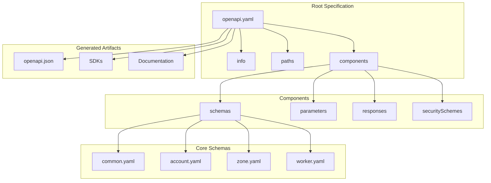
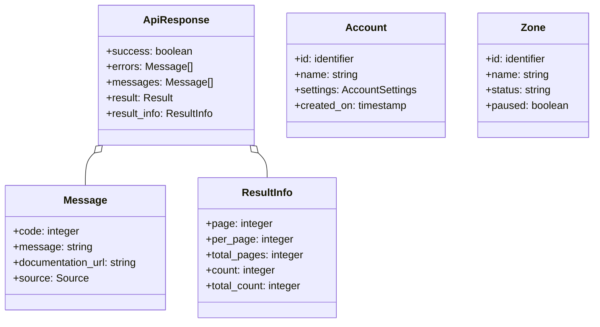

# API Schemas: Complete Exploration

## Overview

**API Schemas** contains OpenAPI specifications for Cloudflare APIs. These schemas define the structure of requests, responses, and data types across all Cloudflare services.

### Key Characteristics

| Aspect | API Schemas |
|--------|-------------|
| **Core Innovation** | Centralized API contract definition |
| **Dependencies** | OpenAPI 3.0 specification |
| **Lines of Code** | ~50,000 (YAML/JSON schemas) |
| **Purpose** | API documentation and validation |
| **Architecture** | Component schemas, response envelopes |
| **Runtime** | Design-time (generated docs, SDKs) |
| **Rust Equivalent** | schemars, utoipa, openapiv3 |

### Source Structure

```
api-schemas/
├── common.yaml              # Shared schema components
├── openapi.yaml             # Full API specification
├── openapi.json             # JSON format (generated)
├── components/
│   ├── account.yaml         # Account schemas
│   ├── zone.yaml            # Zone schemas
│   ├── dns.yaml             # DNS schemas
│   ├── worker.yaml          # Workers schemas
│   ├── tunnel.yaml          # Tunnel schemas
│   └── ...                  # Other service schemas
│
├── examples/
│   ├── account-example.json
│   ├── zone-example.json
│   └── ...
│
├── README.md
├── LICENSE
└── .git/
```

---

## Table of Contents

1. **[Zero to OpenAPI](00-zero-to-openapi.md)** - OpenAPI fundamentals
2. **[Schema Components](01-schema-components.md)** - Component design
3. **[Response Formats](02-response-formats.md)** - Response structure
4. **[Rust Revision](rust-revision.md)** - Rust translation guide
5. **[Production-Grade](production-grade.md)** - Production deployment

---

## Architecture Overview

### High-Level Structure



### Schema Hierarchy



---

## Core Concepts

### 1. Common Schema Components

Shared types defined in `common.yaml`:

```yaml
components:
  schemas:
    # Unique identifiers
    uuid:
      description: UUID
      type: string
      maxLength: 36
      example: f174e90a-fafe-4643-bbbc-4a0ed4fc8415

    identifier:
      description: Identifier (32 char hex)
      type: string
      maxLength: 32
      example: 023e105f4ecef8ad9ca31a8372d0c353

    timestamp:
      type: string
      format: date-time
      example: "2014-01-01T05:20:00.12345Z"

    # API response envelopes
    api-response-common:
      type: object
      required:
        - success
        - errors
        - messages
      properties:
        success:
          type: boolean
          enum: [true]
        errors:
          $ref: "#/components/schemas/messages"
        messages:
          $ref: "#/components/schemas/messages"

    messages:
      type: array
      items:
        type: object
        required:
          - code
          - message
        properties:
          code:
            type: integer
            minimum: 1000
          message:
            type: string
          documentation_url:
            type: string
```

### 2. Account Schema

```yaml
account:
  type: object
  required:
    - id
    - name
  properties:
    id:
      $ref: "#/components/schemas/identifier"
    name:
      description: Account name
      type: string
      maxLength: 100
      example: Demo Account
    settings:
      type: object
      properties:
        enforce_twofactor:
          type: boolean
          description: Require 2FA for members
          default: false
        use_account_custom_ns_by_default:
          type: boolean
          description: Use custom nameservers by default
          default: false
    created_on:
      $ref: "#/components/schemas/timestamp"
```

### 3. API Response Structure

```yaml
# Single object response
api-response-single:
  allOf:
    - $ref: "#/components/schemas/api-response-common"
    - type: object
      properties:
        result:
          $ref: "#/components/schemas/account"

# Collection response with pagination
api-response-collection:
  allOf:
    - $ref: "#/components/schemas/api-response-common"
    - type: object
      properties:
        result_info:
          type: object
          properties:
            page:
              type: number
              example: 1
            per_page:
              type: number
              example: 20
            total_pages:
              type: number
              example: 100
            count:
              type: number
              example: 1
            total_count:
              type: number
              example: 2000
        result:
          type: array
          items:
            $ref: "#/components/schemas/account"
```

---

## OpenAPI Specification

### Info Section

```yaml
openapi: 3.0.3
info:
  title: Cloudflare API
  description: Cloudflare API specification
  version: 4.0.0
  contact:
    name: Cloudflare API Team
    url: https://api.cloudflare.com
  license:
    name: MIT
    url: https://opensource.org/licenses/MIT
```

### Security Schemes

```yaml
components:
  securitySchemes:
    ApiKey:
      type: apiKey
      in: header
      name: X-Auth-Key
    ApiEmail:
      type: apiKey
      in: header
      name: X-Auth-Email
    BearerAuth:
      type: http
      scheme: bearer
      bearerFormat: JWT
```

### Example Endpoint

```yaml
paths:
  /accounts:
    get:
      summary: List accounts
      operationId: listAccounts
      security:
        - ApiKey: []
        - ApiEmail: []
        - BearerAuth: []
      parameters:
        - $ref: "#/components/parameters/page"
        - $ref: "#/components/parameters/per_page"
      responses:
        '200':
          description: Success
          content:
            application/json:
              schema:
                allOf:
                  - $ref: "#/components/schemas/api-response-collection"
                  - type: object
                    properties:
                      result:
                        type: array
                        items:
                          $ref: "#/components/schemas/account"
        '400':
          $ref: "#/components/responses/bad-request"
        '401':
          $ref: "#/components/responses/unauthorized"
```

---

## Schema Patterns

### Auditable Fields

```yaml
x-auditable: true  # Custom extension for audit tracking

uuid:
  type: string
  maxLength: 36
  x-auditable: true  # Track changes to this field
```

### Nullable Types

```yaml
nullable_field:
  type: string
  nullable: true
  example: null
```

### Enum Types

```yaml
zone_status:
  type: string
  enum:
    - active
    - pending
    - initializing
    - moved
    - deleted
    - deactivated
  example: active
```

### OneOf / AnyOf

```yaml
result:
  oneOf:
    - $ref: "#/components/schemas/account"
    - $ref: "#/components/schemas/zone"
    - $ref: "#/components/schemas/worker"

filter:
  anyOf:
    - type: object
      properties:
        status:
          type: string
    - type: object
      properties:
        name:
          type: string
```

---

## Validation Rules

### Required Fields

```yaml
required:
  - id
  - name
  - status
```

### Format Validation

```yaml
email:
  type: string
  format: email

hostname:
  type: string
  format: hostname

ipv4:
  type: string
  format: ipv4

uri:
  type: string
  format: uri
```

### Numeric Constraints

```yaml
port:
  type: integer
  minimum: 1
  maximum: 65535

percentage:
  type: number
  minimum: 0
  maximum: 100

positive_integer:
  type: integer
  minimum: 1
```

### String Constraints

```yaml
name:
  type: string
  minLength: 1
  maxLength: 100
  pattern: '^[a-zA-Z0-9_-]+$'

description:
  type: string
  maxLength: 1000
```

### Array Constraints

```yaml
tags:
  type: array
  items:
    type: string
  minItems: 1
  maxItems: 10
  uniqueItems: true
```

---

## Error Handling

### Error Response

```yaml
api-response-common-failure:
  type: object
  required:
    - success
    - errors
    - messages
    - result
  properties:
    success:
      type: boolean
      enum: [false]
    errors:
      type: array
      minItems: 1
      items:
        $ref: "#/components/schemas/message"
    messages:
      type: array
      items:
        $ref: "#/components/schemas/message"
    result:
      type: "null"
```

### Error Codes

```yaml
# Common error codes
7000: Invalid request body
7001: Validation error
7003: Could not route to resource
7004: Resource not found
7005: Method not allowed
7100: Authentication error
7101: Authorization error
7102: Rate limit exceeded
7103: Account suspended
```

### Error Response Example

```json
{
  "success": false,
  "errors": [
    {
      "code": 7003,
      "message": "Could not route to /zones/invalid",
      "documentation_url": "https://developers.cloudflare.com/api/operations/zones-get-zone"
    }
  ],
  "messages": [],
  "result": null
}
```

---

## Code Generation

### TypeScript SDK

```bash
# Generate TypeScript types
openapi-typescript openapi.yaml -o types.ts
```

```typescript
// Generated types
export interface components {
  schemas: {
    account: {
      id: string;
      name: string;
      settings?: {
        enforce_twofactor?: boolean;
      };
      created_on?: string;
    };
    api_response_single: {
      success: true;
      errors: components["schemas"]["message"][];
      messages: components["schemas"]["message"][];
      result?: components["schemas"]["account"];
    };
  };
}
```

### Rust SDK

```bash
# Generate Rust types with schemars
openapiv3-to-rust openapi.yaml --output src/api/
```

```rust
// Generated Rust types
#[derive(Debug, Clone, Serialize, Deserialize)]
pub struct Account {
    pub id: String,
    pub name: String,
    #[serde(skip_serializing_if = "Option::is_none")]
    pub settings: Option<AccountSettings>,
    #[serde(skip_serializing_if = "Option::is_none")]
    pub created_on: Option<String>,
}

#[derive(Debug, Clone, Serialize, Deserialize)]
pub struct ApiResponse<T> {
    pub success: bool,
    pub errors: Vec<Message>,
    pub messages: Vec<Message>,
    pub result: Option<T>,
}
```

---

## Documentation Generation

### Redoc

```html
<!DOCTYPE html>
<html>
  <head>
    <title>Cloudflare API Docs</title>
  </head>
  <body>
    <redoc spec-url="openapi.yaml"></redoc>
    <script src="https://cdn.redoc.ly/redoc/latest/bundles/redoc.standalone.js"></script>
  </body>
</html>
```

### Swagger UI

```html
<!DOCTYPE html>
<html>
  <head>
    <title>Cloudflare API Docs</title>
    <link rel="stylesheet" href="https://unpkg.com/swagger-ui-dist/swagger-ui.css">
  </head>
  <body>
    <div id="swagger-ui"></div>
    <script src="https://unpkg.com/swagger-ui-dist/swagger-ui-bundle.js"></script>
    <script>
      SwaggerUIBundle({
        url: 'openapi.yaml',
        dom_id: '#swagger-ui'
      });
    </script>
  </body>
</html>
```

---

## Best Practices

### Schema Organization

1. **Separate common types** - Shared schemas in `common.yaml`
2. **Group by service** - One file per service (account, zone, worker)
3. **Use references** - `$ref` for reuse, not duplication
4. **Consistent naming** - snake_case for schemas, camelCase for properties

### Version Management

```yaml
# Version in info
info:
  version: 4.0.0  # Semantic versioning

# Track changes
x-changelog:
  - version: 4.0.0
    changes:
      - Added new endpoint
      - Deprecated old field
```

### Documentation Quality

1. **Clear descriptions** - Explain purpose and usage
2. **Good examples** - Realistic, valid examples
3. **Required fields** - Mark all required fields
4. **Error responses** - Document all error cases

---

## Your Path Forward

### To Build API Schema Skills

1. **Learn OpenAPI spec** (structure, components)
2. **Create common schemas** (shared types)
3. **Define endpoints** (paths, parameters, responses)
4. **Generate documentation** (Redoc, Swagger)
5. **Generate SDKs** (TypeScript, Rust, Python)

### Recommended Resources

- [OpenAPI Specification](https://swagger.io/specification/)
- [OpenAPI Tools](https://openapi.tools/)
- [Cloudflare API Documentation](https://developers.cloudflare.com/api/)
- [schemars (Rust)](https://docs.rs/schemars/)

---

## Document History

| Date | Change |
|------|--------|
| 2026-03-27 | Initial API schemas exploration created |
| 2026-03-27 | Schema structure documented |
| 2026-03-27 | Deep dive outlines completed |

---

*This exploration is a living document. Revisit sections as concepts become clearer through implementation.*
