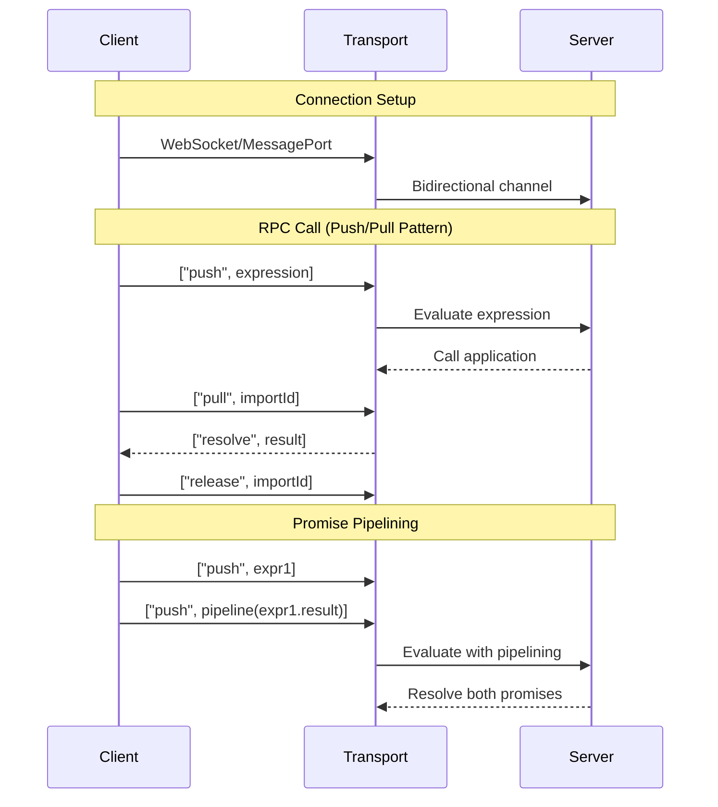
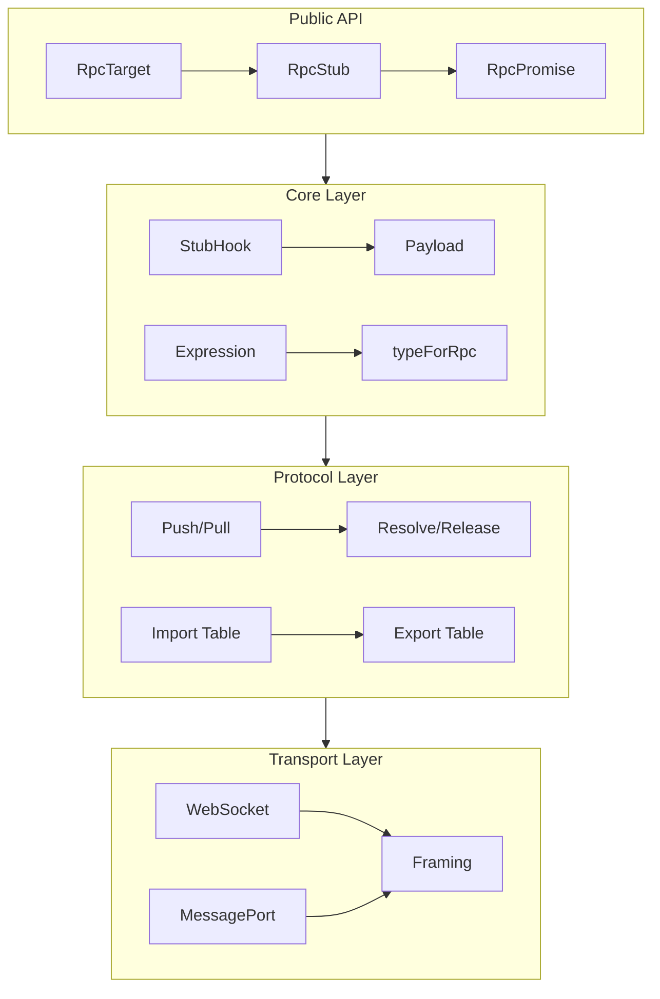

# Capnweb: Complete Exploration

## Overview

**Capnweb** is Cloudflare's implementation of Cap'n Proto RPC for web browsers and Workers. It provides efficient, bidirectional remote procedure calls with zero-copy serialization and promise pipelining capabilities.

### Key Characteristics

| Aspect | Capnweb |
|--------|---------|
| **Core Innovation** | Cap'n Proto RPC over WebSocket/MessagePort |
| **Dependencies** | None (pure TypeScript) |
| **Lines of Code** | ~5,000 (core protocol) |
| **Purpose** | Efficient RPC for distributed JavaScript runtimes |
| **Architecture** | Import/export tables, expression evaluation, promise pipelining |
| **Runtime** | Workers, Node.js, Browsers |
| **Rust Equivalent** | capnp-rpc, native RPC frameworks |

### Source Structure

```
capnweb/
├── src/
│   ├── core.ts              # Core RPC types and hooks
│   ├── rpc.ts               # RPC protocol implementation
│   ├── serialize.ts         # Serialization/deserialization
│   ├── batch.ts             # Batch pipelining
│   ├── streams.ts           # Readable/Writable stream handling
│   ├── map.ts               # Map function serialization
│   ├── messageport.ts       # MessagePort transport
│   ├── websocket.ts         # WebSocket transport
│   ├── types.d.ts           # TypeScript type definitions
│   ├── symbols.ts           # Internal symbols
│   ├── base64-shims.d.ts    # Base64 utilities
│   ├── index.ts             # Public API
│   └── index-workers.ts     # Workers-specific entry
│
├── examples/
│   ├── batch-pipelining/    # Batch processing example
│   └── worker-react/        # React + Workers integration
│
├── protocol.md              # Protocol specification
├── README.md                # Project overview
├── CHANGELOG.md             # Version history
└── SECURITY.md              # Security policy
```

---

## Table of Contents

1. **[Zero to RPC Engineer](00-zero-to-rpc-engineer.md)** - RPC fundamentals
2. **[Protocol Deep Dive](01-protocol-deep-dive.md)** - Message types and flow
3. **[Serialization Deep Dive](02-serialization-deep-dive.md)** - Type encoding
4. **[Import/Export Tables](03-import-export-tables.md)** - Reference management
5. **[Promise Pipelining](04-promise-pipelining.md)** - Zero-RTT calls
6. **[Streams & WebSocket](05-streams-websocket.md)** - Stream handling
7. **[Rust Revision](rust-revision.md)** - Rust translation guide
8. **[Production-Grade](production-grade.md)** - Production deployment
9. **[Valtron Integration](07-valtron-integration.md)** - Lambda deployment

---

## Architecture Overview

### High-Level Flow



### Component Architecture



---

## Core Concepts

### 1. RPC Without Cap'n Proto Schema

Unlike traditional Cap'n Proto, capnweb uses JavaScript expressions:

```typescript
// Traditional Cap'n Proto (schema-based)
interface Request {
  method: string;
  url: string;
  headers: Map<string, string>;
}

// Capnweb (expression-based)
const call = ["import", -1, ["fetch"], [
  ["request", "https://example.com", { method: "GET" }]
]];
```

### 2. Import/Export Tables

Each side maintains import and export tables:

```
Client Perspective:
┌─────────────────────────────────────┐
│ Import Table (positive IDs)         │
│  +1 → Server's exported stub        │
│  +2 → Promise from push             │
└─────────────────────────────────────┘

┌─────────────────────────────────────┐
│ Export Table (negative IDs)         │
│  -1 → Client's exported stub        │
│  -2 → Client's exported promise     │
└─────────────────────────────────────┘
```

**ID Assignment Rules:**
- Importer chooses positive IDs (1, 2, 3...)
- Exporter chooses negative IDs (-1, -2, -3...)
- ID 0 is the "main" interface

### 3. Expression Evaluation

Expressions are JSON trees that evaluate to values:

```typescript
// Expression for a Date
["date", 1749342170815]

// Expression for an array
[["just", "an", "array"]]

// Expression for a function call
["import", -1, ["fetch"], [
  ["request", "https://example.com", {}]
]]
```

**Expression Types:**

| Type Code | Format | Example |
|-----------|--------|---------|
| primitive | literal | `"hello"`, `42`, `true` |
| date | `["date", ms]` | `["date", 1749342170815]` |
| bytes | `["bytes", base64]` | `["bytes", "SGVsbG8="]` |
| bigint | `["bigint", str]` | `["bigint", "12345678901234567890"]` |
| error | `["error", type, msg]` | `["error", "TypeError", "msg"]` |
| import | `["import", id, path?, args?]` | `["import", -1, ["fetch"], []]` |
| export | `["export", id]` | `["export", -1]` |
| promise | `["promise", id]` | `["promise", -1]` |
| writable | `["writable", id]` | `["writable", -1]` |
| readable | `["readable", id]` | `["readable", +1]` |

---

## Protocol Messages

### Top-Level Messages

| Message | Format | Purpose |
|---------|--------|---------|
| push | `["push", expression]` | Evaluate expression |
| pull | `["pull", importId]` | Request resolution |
| resolve | `["resolve", exportId, expression]` | Resolve promise |
| reject | `["reject", exportId, expression]` | Reject promise |
| release | `["release", importId, refcount]` | Release reference |
| stream | `["stream", expression]` | Stream (auto-pull) |
| pipe | `["pipe"]` | Create stream pipe |
| abort | `["abort", expression]` | Session abort |

### Push/Pull Pattern

```
1. Client sends: ["push", expression]
   - Expression is assigned next positive import ID
   - Server evaluates expression

2. Client sends: ["pull", importId]
   - Expresses interest in result

3. Server sends: ["resolve", importId, result]
   - Resolves the promise

4. Client sends: ["release", importId, refcount]
   - Releases the reference
```

### Promise Pipelining

```typescript
// Without pipelining (2 RTTs):
const obj = await stub.getObject();      // RTT 1
const value = await obj.getProperty();   // RTT 2

// With pipelining (1 RTT):
const pipe = rpc.pipeline(stub.getObject(), "getProperty");
const value = await pipe;  // Both calls in one RTT
```

---

## Serialization Details

### Non-JSON Types

JSON doesn't support all JavaScript types. Capnweb encodes them:

```typescript
// Uint8Array
const bytes = new Uint8Array([1, 2, 3]);
// Encoded as: ["bytes", "AQID"]  (base64)

// Date
const date = new Date(1749342170815);
// Encoded as: ["date", 1749342170815]

// BigInt
const big = 12345678901234567890n;
// Encoded as: ["bigint", "12345678901234567890"]

// Error
const err = new TypeError("message");
// Encoded as: ["error", "TypeError", "message"]

// Headers
const headers = new Headers([["content-type", "text/plain"]]);
// Encoded as: ["headers", [["content-type", "text/plain"]]]

// Request
const req = new Request("https://example.com", { method: "POST" });
// Encoded as: ["request", "https://example.com", { method: "POST" }]

// Response
const res = new Response("body", { status: 200 });
// Encoded as: ["response", "body", { status: 200 }]
```

### Array Expression Encoding

Arrays need special handling:

```typescript
// Regular array
const arr = [1, 2, 3];
// Encoded as: [[1, 2, 3]]  (double-wrapped)

// Nested structures
const obj = {
  key: ["abc", new Date(1757214689123), [0]]
};
// Encoded as:
{
  "key": [[
    "abc",
    ["date", 1757214689123],
    [[0]]  // inner array
  ]]
}
```

---

## Stream Handling

### WritableStream

```typescript
// Export a WritableStream
const stream = new WritableStream({
  write(chunk) { console.log(chunk); },
  close() { console.log("closed"); }
});

// Send to remote
const stub = new RpcStub(stream);
rpc.send(stub);  // Encoded as ["writable", exportId]
```

**Remote operations:**
```typescript
// Remote can call:
stub.write(chunk);   // Write data
stub.close();        // Close stream
stub.abort(reason);  // Abort stream
```

### ReadableStream via Pipes

```typescript
// Create a pipe
const { readable, writable } = createPipe();

// Send readable end
const stub = new RpcStub(readable);
rpc.send(stub);  // Encoded as ["readable", importId]

// Pump data through writable
const writer = writable.getWriter();
await writer.write("chunk1");
await writer.write("chunk2");
await writer.close();
```

---

## Transport Layer

### WebSocket Transport

```typescript
import { RpcConnection } from 'capnweb';

const ws = new WebSocket('wss://example.com/rpc');
const rpc = new RpcConnection(ws);

// RPC messages are newline-delimited JSON
// Each message is a single line (no embedded newlines)
```

**Framing:**
```
["push", expression]\n
["pull", 1]\n
["resolve", -1, result]\n
```

### MessagePort Transport

```typescript
// In Workers
const rpc = new RpcConnection(port);

// Messages are sent as MessagePort messages
port.postMessage(["push", expression]);
```

---

## Map Function Serialization

The `.map()` method serializes lambda captures:

```typescript
// Client-side map
stub.arrayProperty.map(arr => arr.filter(x => x > 0).length);

// Serialized as:
["remap", importId, ["arrayProperty"],
  // Captures (stubs available to mapper)
  [["import", -1]],
  // Instructions (evaluate in order)
  [
    ["import", 0],           // Input value
    ["import", -1, "filter"], // Capture stub
    // ... more instructions
  ]
]
```

---

## Error Handling

### Session Abort

```typescript
// Client experiences error
rpc.abort(new Error("Network failure"));
// Sends: ["abort", ["error", "Error", "Network failure"]]

// No further messages will be sent or received
```

### Promise Rejection

```typescript
// Server-side call throws
try {
  await stub.dangerousCall();
} catch (err) {
  // Received as: ["reject", exportId, ["error", "TypeError", "msg"]]
}
```

---

## Security Considerations

### Expression Sandboxing

- Expressions are evaluated in isolated contexts
- Stubs prevent direct object access
- Map functions have limited captures

### Reference Counting

```typescript
// Release with refcount to avoid race conditions
["release", importId, 3]  // Released 3 times
```

**Why refcount matters:**
```
Time  Client                     Server
t0    export ID -1
t1    send export (ID arrives)
t2    release ID -1 (refcount=1)
t3    re-export ID -1 (new export)
t4    release ID -1 (refcount=1) arrives
      → Server decrements count
      → Only releases when count = 0
```

---

## Performance Characteristics

### Zero-Copy Benefits

Traditional JSON RPC:
```
Serialize → Copy → Network → Copy → Deserialize
```

CapnProto-style (capnweb optimized):
```
Reference → Network → Reference
```

### Promise Pipelining Impact

```
Without pipelining:  N calls = N × RTT
With pipelining:     N calls = 1 × RTT
```

**Example:**
```typescript
// Chained calls without pipelining: 3 RTTs
const user = await api.getUser(id);
const posts = await user.getPosts();
const comments = await posts[0].getComments();

// With pipelining: 1 RTT
const comments = await api.pipeline
  .getUser(id)
  .getProperty("posts")
  .map(posts => posts[0])
  .getProperty("comments");
```

---

## Testing Strategies

### Unit Testing Serialization

```typescript
import { serialize, deserialize } from 'capnweb/serialize';

test('serializes Date correctly', () => {
  const date = new Date(1749342170815);
  const encoded = serialize(date);
  expect(encoded).toEqual(['date', 1749342170815]);
});

test('deserializes bytes correctly', () => {
  const decoded = deserialize(['bytes', 'AQID']);
  expect(decoded).toEqual(new Uint8Array([1, 2, 3]));
});
```

### Integration Testing RPC

```typescript
test('full RPC call flow', async () => {
  const { client, server } = createTestPair();

  const result = await client.stub.fetch('https://example.com');
  expect(result.status).toBe(200);
});
```

---

## Comparison with Other RPC Systems

| Feature | Capnweb | gRPC-Web | tRPC | GraphQL |
|---------|---------|----------|------|---------|
| Serialization | JSON + custom | Protobuf | TypeScript types | GraphQL schema |
| Transport | WebSocket/MessagePort | HTTP/2 | HTTP | HTTP |
| Streaming | Full duplex | Limited | No | Subscriptions |
| Pipelining | Yes | No | No | Batching |
| Schema | None (dynamic) | Required | TypeScript | Required |
| Browser Native | Yes | Needs library | Yes | Yes |

---

## Your Path Forward

### To Build Capnweb Skills

1. **Understand expression encoding** (serialize simple types)
2. **Implement push/pull pattern** (basic RPC call)
3. **Add promise pipelining** (chained calls)
4. **Integrate streams** (ReadableStream/WritableStream)
5. **Build production transport** (WebSocket with reconnection)

### Recommended Resources

- [Cap'n Proto RPC Specification](https://capnproto.org/rpc.html)
- [Capnweb Protocol Documentation](protocol.md)
- [W3C MessagePort API](https://developer.mozilla.org/en-US/docs/Web/API/MessagePort)
- [WebSocket API](https://developer.mozilla.org/en-US/docs/Web/API/WebSocket)

---

## Document History

| Date | Change |
|------|--------|
| 2026-03-27 | Initial capnweb exploration created |
| 2026-03-27 | Protocol and serialization documented |
| 2026-03-27 | Deep dive outlines completed |

---

*This exploration is a living document. Revisit sections as concepts become clearer through implementation.*
