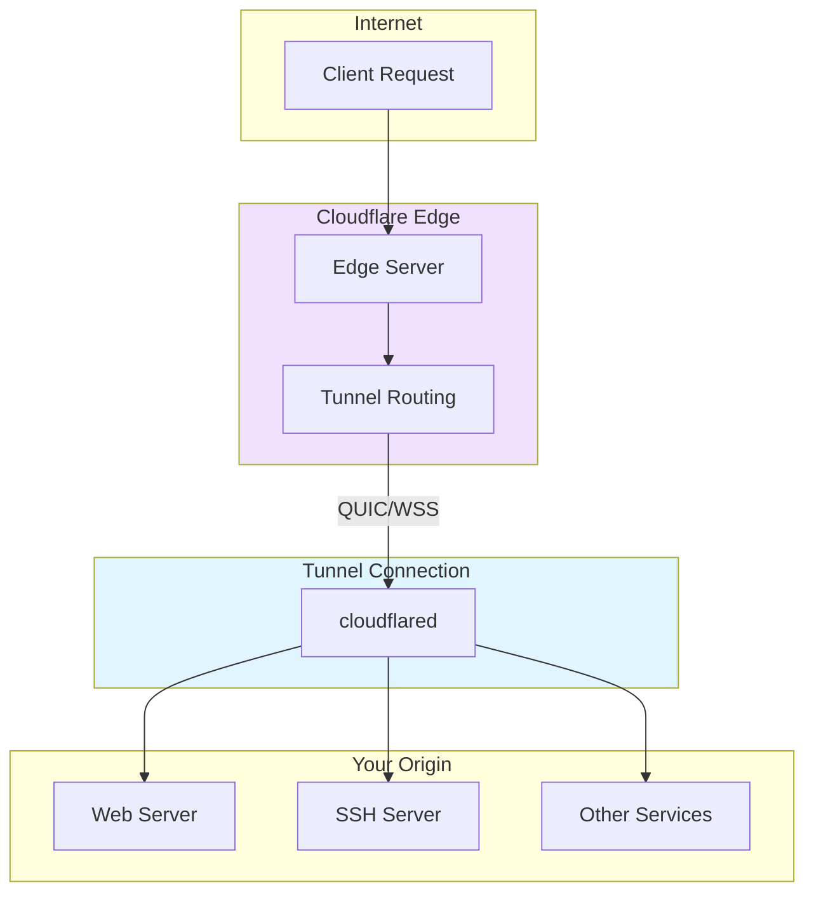
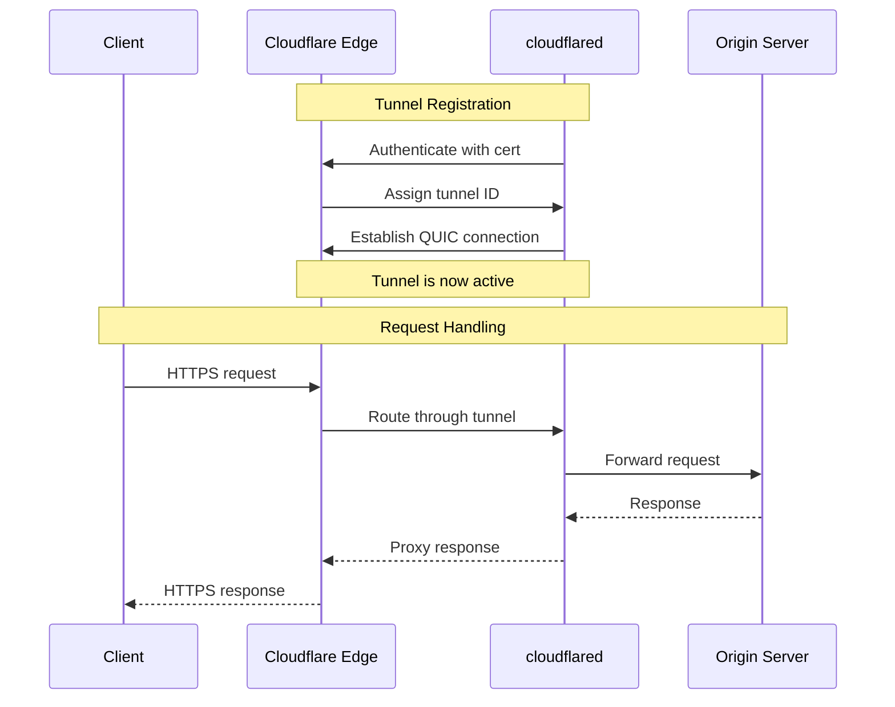
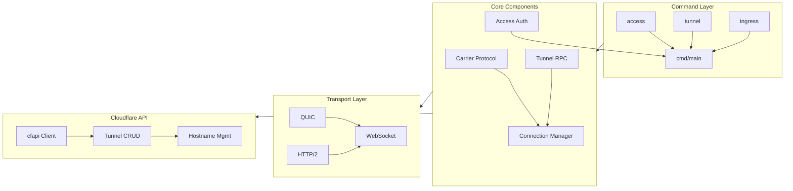
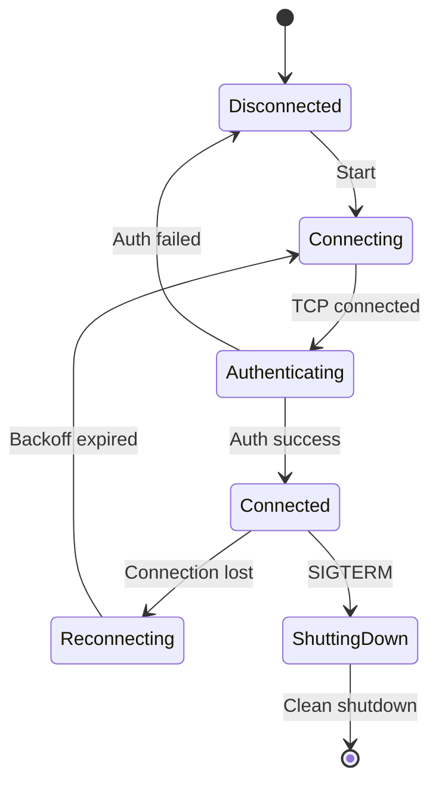

# Cloudflared: Complete Exploration

## Overview

**Cloudflared** is the command-line client for Cloudflare Tunnel, a tunneling daemon that proxies traffic from the Cloudflare network to your origins without requiring firewall changes. It provides secure, outbound-only connectivity between your infrastructure and Cloudflare's edge.

### Key Characteristics

| Aspect | Cloudflared |
|--------|-------------|
| **Core Innovation** | Outbound-only tunnel protocol |
| **Dependencies** | Go 1.24+, capnp |
| **Lines of Code** | ~100,000+ |
| **Purpose** | Secure origin connectivity |
| **Architecture** | Tunnel protocol, carrier, access authentication |
| **Runtime** | Native binary (Linux, macOS, Windows, Docker) |
| **Rust Equivalent** | quinn (QUIC), native tunnel implementations |

### Source Structure

```
cloudflared/
├── cmd/cloudflared/
│   ├── access/           # Zero Trust Access commands
│   ├── tunnel/           # Tunnel management
│   ├── ingress/          # Ingress routing
│   └── ...               # Other subcommands
│
├── carrier/              # Carrier protocol implementation
│   ├── carrier.go        # Core carrier logic
│   ├── websocket.go      # WebSocket transport
│   └── carrier_test.go   # Tests
│
├── cfapi/                # Cloudflare API client
│   ├── client.go         # API client
│   ├── tunnel.go         # Tunnel operations
│   ├── hostname.go       # Hostname management
│   └── ...
│
├── cfio/                 # I/O utilities
│   └── copy.go           # Stream copying
│
├── client/               # Client configuration
│   └── config.go         # Config parsing
│
├── ingress/              # Ingress routing
│   ├── rules.go          # Routing rules
│   └── controller.go     # Request routing
│
├── tunnelrpc/            # Tunnel RPC protocol
│   ├── protocol.go       # Protocol definition
│   └── transport.go      # Transport layer
│
├── vendor/               # vendored dependencies
│   └── github.com/       # Go modules
│
├── .github/              # GitHub Actions
├── component-tests/      # Component integration tests
├── AGENTS.md             # AI agent guidance
├── CHANGES.md            # Changelog
├── README.md             # Project overview
└── Makefile              # Build system
```

---

## Table of Contents

1. **[Zero to Tunnel Engineer](00-zero-to-tunnel-engineer.md)** - Tunnel fundamentals
2. **[Tunnel Protocol Deep Dive](01-tunnel-protocol-deep-dive.md)** - Protocol architecture
3. **[Carrier Protocol Deep Dive](02-carrier-protocol.md)** - Message transport
4. **[Access Authentication](03-access-authentication.md)** - Zero Trust auth
5. **[Edge Connectivity](04-edge-connectivity.md)** - Edge integration
6. **[Rust Revision](rust-revision.md)** - Rust translation guide
7. **[Production-Grade](production-grade.md)** - Production deployment
8. **[Valtron Integration](07-valtron-integration.md)** - Lambda deployment

---

## Architecture Overview

### High-Level Flow



### Connection Flow



### Component Architecture



---

## Core Concepts

### 1. Tunnel Architecture

A Cloudflare Tunnel is a logical connection between your origin and Cloudflare:

```
┌─────────────────────────────────────────────────────────┐
│                    Cloudflare Edge                       │
│  ┌─────────────┐  ┌─────────────┐  ┌─────────────┐      │
│  │   POP NY    │  │   POP LDN   │  │   POP SIN   │      │
│  └──────┬──────┘  └──────┬──────┘  └──────┬──────┘      │
│         │                │                │              │
│         └────────────────┼────────────────┘              │
│                          │                               │
│                   ┌──────▼──────┐                        │
│                   │  Tunnel     │                        │
│                   │  Router     │                        │
│                   └──────┬──────┘                        │
└──────────────────────────┼───────────────────────────────┘
                           │ QUIC/WSS (outbound from origin)
                           │
                    ┌──────▼──────┐
                    │ cloudflared │
                    │  (daemon)   │
                    └──────┬──────┘
                           │
         ┌─────────────────┼─────────────────┐
         │                 │                 │
    ┌────▼────┐      ┌────▼────┐      ┌────▼────┐
    │  :8080  │      │  :22    │      │  :3306  │
    │  HTTP   │      │  SSH    │      │  MySQL  │
    └─────────┘      └─────────┘      └─────────┘
```

**Key properties:**
- **Outbound-only:** No inbound firewall rules needed
- **Mutual TLS:** Both sides authenticate
- **Encrypted:** All traffic is encrypted
- **Persistent:** Automatic reconnection

### 2. Tunnel Identity

Each tunnel has a unique identity:

```bash
# Create a new tunnel
cloudflared tunnel create my-tunnel

# Creates:
# - Tunnel ID (UUID)
# - Certificate (tunnel.crt)
# - Private key (tunnel.key)
```

**Certificate structure:**
```
Tunnel Certificate:
├── Tunnel ID (subject CN)
├── Account ID
├── Issue date
└── Signature (Cloudflare CA)
```

### 3. Ingress Rules

Ingress rules define how requests are routed:

```yaml
# config.yml
ingress:
  # Route /api/* to local API server
  - hostname: api.example.com
    path: /api/*
    service: http://localhost:8080

  # Route SSH to local SSH server
  - hostname: ssh.example.com
    service: ssh://localhost:22

  # Default catch-all
  - service: http://localhost:3000

  # Reject everything else
  - service: http_status:404
```

**Rule matching order:**
1. Hostname match
2. Path match
3. First matching rule wins
4. Default rule (last) catches all

---

## Protocol Details

### Tunnel Protocol Stack

```
┌─────────────────────────────────┐
│     Application (HTTP/SSH)      │
├─────────────────────────────────┤
│     Tunnel RPC Protocol         │
├─────────────────────────────────┤
│     QUIC / WebSocket            │
├─────────────────────────────────┤
│     TCP / TLS                   │
├─────────────────────────────────┤
│     IP Network                  │
└─────────────────────────────────┘
```

### Carrier Protocol

The carrier protocol handles message framing:

```go
// carrier.go
type Carrier struct {
    conn    net.Conn
    encoder Encoder
    decoder Decoder
}

func (c *Carrier) Send(msg Message) error {
    // Frame: [length][message]
    data := c.encoder.Encode(msg)
    length := uint32(len(data))

    // Write length prefix
    binary.Write(c.conn, binary.BigEndian, length)

    // Write message
    c.conn.Write(data)
    return nil
}

func (c *Carrier) Receive() (Message, error) {
    // Read length prefix
    var length uint32
    binary.Read(c.conn, binary.BigEndian, &length)

    // Read message
    data := make([]byte, length)
    c.conn.Read(data)

    return c.decoder.Decode(data)
}
```

### Connection Lifecycle



---

## Access & Authentication

### Zero Trust Access

Cloudflare Access provides authentication before reaching origins:

```
Client → Cloudflare Edge → Access Policy → Tunnel → Origin
                              │
                              ▼
                         Identity Provider
                         (Okta, Google, etc.)
```

**Access flow:**
1. User requests protected resource
2. Cloudflare checks Access policy
3. If not authenticated, redirect to IdP
4. On success, set Access token cookie
5. Forward request with identity headers

### Service Tokens

For machine-to-machine authentication:

```bash
# Create service token
cloudflared access service-token create

# Use in requests
curl -H "CF-Access-Client-Id: ..." \
     -H "CF-Access-Client-Secret: ..." \
     https://protected.example.com
```

### Certificate Authentication

Tunnel certificates for origin authentication:

```go
// cfapi/client.go
type TunnelClient struct {
    cert       *x509.Certificate
    privateKey *ecdsa.PrivateKey
    apiClient  *http.Client
}

func (c *TunnelClient) authenticate() error {
    // Mutual TLS handshake
    // Certificate verified by Cloudflare CA
    return nil
}
```

---

## Tunnel Types

### HTTP Tunnels

Standard HTTP/HTTPS traffic:

```yaml
ingress:
  - hostname: app.example.com
    service: http://localhost:8080
    originRequest:
      noTLSVerify: false
      connectTimeout: 30s
```

### TCP Tunnels

Raw TCP traffic (SSH, databases, etc.):

```yaml
ingress:
  - hostname: ssh.example.com
    service: ssh://localhost:22
```

```bash
# Connect via cloudflared access
cloudflared access ssh --hostname ssh.example.com
```

### RDP Tunnels

Remote Desktop Protocol:

```yaml
ingress:
  - hostname: rdp.example.com
    service: rdp://localhost:3389
```

### SMB Tunnels

File sharing:

```yaml
ingress:
  - hostname: fileshare.example.com
    service: smb://localhost:445
```

---

## Deployment Modes

### Standalone Daemon

```bash
# Run as daemon
cloudflared tunnel run my-tunnel

# With config file
cloudflared tunnel --config config.yml run
```

### Docker Container

```dockerfile
FROM cloudflare/cloudflared:latest

COPY tunnel.crt /etc/cloudflared/
COPY tunnel.key /etc/cloudflared/
COPY config.yml /etc/cloudflared/

CMD ["tunnel", "--config", "/etc/cloudflared/config.yml", "run"]
```

```bash
docker run -d \
  -v ./config:/etc/cloudflared \
  cloudflare/cloudflared
```

### Kubernetes

```yaml
apiVersion: apps/v1
kind: Deployment
metadata:
  name: cloudflared
spec:
  replicas: 2  # High availability
  template:
    spec:
      containers:
      - name: cloudflared
        image: cloudflare/cloudflared:latest
        args:
        - tunnel
        - --config
        - /etc/cloudflared/config.yml
        - run
        volumeMounts:
        - name: tunnel-creds
          mountPath: /etc/cloudflared
      volumes:
      - name: tunnel-creds
        secret:
          secretName: tunnel-credentials
```

### Systemd Service

```ini
# /etc/systemd/system/cloudflared.service
[Unit]
Description=Cloudflare Tunnel
After=network.target

[Service]
Type=simple
User=cloudflared
ExecStart=/usr/local/bin/cloudflared tunnel run my-tunnel
Restart=always

[Install]
WantedBy=multi-user.target
```

---

## Load Balancing

### Multiple Connectors

Run multiple cloudflared instances for the same tunnel:

```
Cloudflare Edge
       │
   ┌───┴───┐
   │       │
   ▼       ▼
Instance 1  Instance 2
   │         │
   ▼         ▼
 Origin A  Origin B
```

**Benefits:**
- High availability
- Geographic distribution
- Load distribution

### Health Checks

```yaml
originConfig:
  healthCheck:
    path: /health
    interval: 30s
    timeout: 10s
    failures: 3
```

### Regional Affinity

```yaml
originConfig:
  regionConfig:
    - region: us-east
      priority: 1
    - region: eu-west
      priority: 2
```

---

## Monitoring & Observability

### Metrics

Cloudflared exposes Prometheus metrics:

```bash
# Enable metrics
cloudflared tunnel --metrics 0.0.0.0:2000 run
```

**Key metrics:**
```
# Connection metrics
cloudflared_tunnel_connections_active
cloudflared_tunnel_connections_total
cloudflared_tunnel_connection_errors

# Request metrics
cloudflared_tunnel_requests_total
cloudflared_tunnel_request_duration_seconds

# Health metrics
cloudflared_tunnel_origin_health
```

### Logging

```yaml
# config.yml
logging:
  level: info  # debug, info, warn, error
  output: /var/log/cloudflared.log
```

### Diagnostics

```bash
# Test tunnel connectivity
cloudflared tunnel list

# Check tunnel status
cloudflared tunnel info my-tunnel

# Debug connection
cloudflared tunnel --logfile debug.log run
```

---

## Security Considerations

### Certificate Security

```bash
# Rotate tunnel credentials
cloudflared tunnel rotate my-tunnel

# Revoke compromised certificate
cloudflared tunnel delete my-tunnel
```

### Network Security

| Setting | Description | Default |
|---------|-------------|---------|
| `noTLSVerify` | Skip TLS verification | false |
| `connectTimeout` | Connection timeout | 30s |
| `keepAliveConnections` | Max idle connections | 100 |
| `disableChunkedEncoding` | Disable chunked transfer | false |

### Access Control

```yaml
access:
  - name: "Admin only"
    require:
      - email:
          endingWith: "@company.com"
      - group:
          - "Admins"
```

---

## Troubleshooting

### Common Issues

| Issue | Cause | Solution |
|-------|-------|----------|
| "Unable to reach the origin" | Origin not running | Start origin service |
| "Certificate error" | Expired cert | Rotate credentials |
| "Too many connections" | Resource limits | Increase limits |
| "DNS resolution failed" | DNS misconfiguration | Check DNS settings |

### Debug Commands

```bash
# Verbose logging
cloudflared --loglevel debug tunnel run

# Test ingress rules
cloudflared tunnel ingress validate --config config.yml

# Connection diagnostics
cloudflared tunnel list --show-connections
```

---

## Comparison with Alternatives

| Feature | cloudflared | ngrok | Tailscale | WireGuard |
|---------|-------------|-------|-----------|-----------|
| Protocol | QUIC/WSS | Custom | WireGuard | WireGuard |
| Authentication | mTLS + Access | Token | OAuth | Pre-shared key |
| Load Balancing | Built-in | Paid | Limited | No |
| Access Control | Full ZTNA | Limited | Network-level | No |
| Self-hostable | No | Yes | Yes | Yes |
| Edge Network | Global | Regional | Mesh | Self-managed |

---

## Your Path Forward

### To Build Cloudflared Skills

1. **Create your first tunnel** (hello world)
2. **Configure ingress rules** (multiple services)
3. **Set up Access policies** (authentication)
4. **Deploy with HA** (multiple instances)
5. **Implement monitoring** (metrics + alerts)

### Recommended Resources

- [Cloudflare Tunnel Documentation](https://developers.cloudflare.com/cloudflare-one/networks/connectors/cloudflare-tunnel/)
- [Cloudflare Access Documentation](https://developers.cloudflare.com/cloudflare-one/access/)
- [QUIC Protocol Specification](https://datatracker.ietf.org/doc/html/rfc9000)
- [Cap'n Proto Documentation](https://capnproto.org/)

---

## Document History

| Date | Change |
|------|--------|
| 2026-03-27 | Initial cloudflared exploration created |
| 2026-03-27 | Protocol and architecture documented |
| 2026-03-27 | Deep dive outlines completed |

---

*This exploration is a living document. Revisit sections as concepts become clearer through implementation.*
