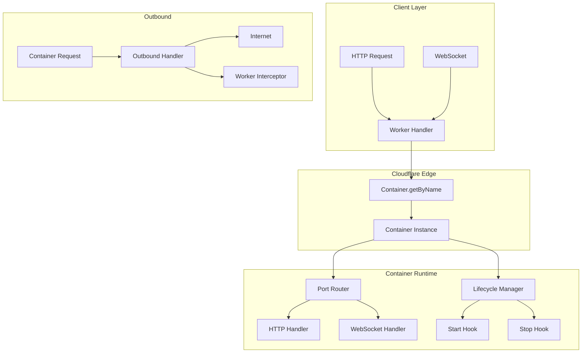
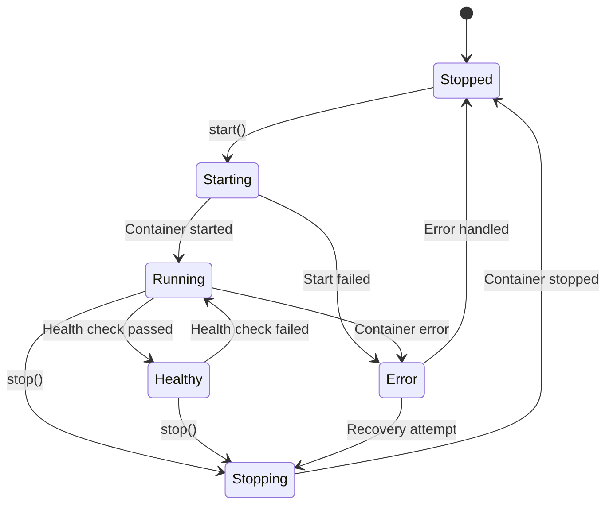
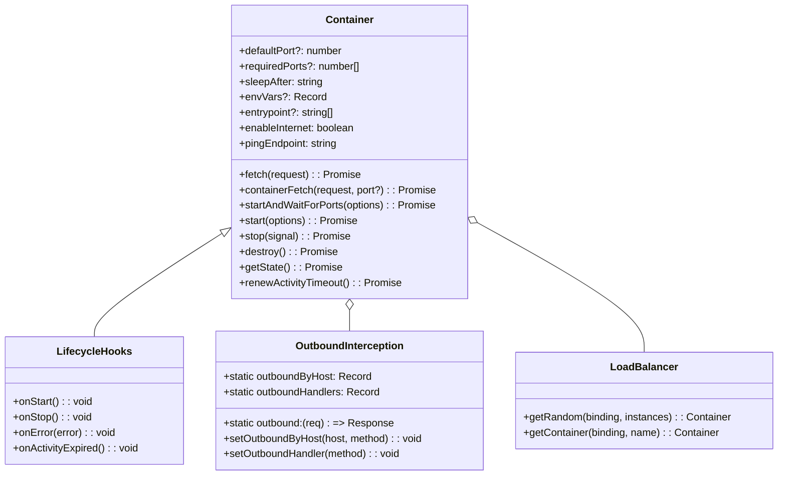

# Containers: Complete Exploration

## Overview

**Containers** is a class library for interacting with containers on Cloudflare Workers. It provides HTTP request proxying, WebSocket forwarding, container lifecycle management, and outbound request interception.

### Key Characteristics

| Aspect | Containers |
|--------|------------|
| **Core Innovation** | Container orchestration at the edge |
| **Dependencies** | Durable Objects |
| **Lines of Code** | ~2,000 |
| **Purpose** | Container lifecycle and request routing |
| **Architecture** | Container class, port management, interception |
| **Runtime** | Workers, Node.js |
| **Rust Equivalent** | Docker API client, containerd bindings |

### Source Structure

```
containers/
├── src/
│   ├── container.ts         # Main Container class
│   ├── lifecycle.ts         # Lifecycle hooks
│   ├── ports.ts             # Port management
│   ├── outbound.ts          # Outbound interception
│   ├── loadbalancer.ts      # Load balancing utilities
│   ├── types.ts             # TypeScript types
│   └── index.ts             # Public API
│
├── examples/
│   ├── http-example/        # HTTP proxying
│   ├── websocket-example/   # WebSocket forwarding
│   ├── lifecycle-example/   # Lifecycle hooks
│   └── loadbalancer/        # Load balancing
│
├── CHANGELOG.md
├── CONTRIBUTING.md
├── package.json
├── README.md
└── tsconfig.json
```

---

## Table of Contents

1. **[Zero to Container Engineer](00-zero-to-container-engineer.md)** - Container fundamentals
2. **[Lifecycle Management](01-lifecycle-management.md)** - Start/stop/hooks
3. **[Port Management](02-port-management.md)** - Port handling
4. **[Outbound Interception](03-outbound-interception.md)** - Request routing
5. **[Rust Revision](rust-revision.md)** - Rust translation guide
6. **[Production-Grade](production-grade.md)** - Production deployment
7. **[Valtron Integration](07-valtron-integration.md)** - Lambda deployment

---

## Architecture Overview

### High-Level Flow



### Container Lifecycle



### Component Architecture



---

## Core Concepts

### 1. Container Definition

```typescript
import { Container } from '@cloudflare/containers';

export class MyContainer extends Container {
  // Default port for the container
  defaultPort = 8080;

  // Sleep after 1 minute of inactivity
  sleepAfter = '1m';

  // Environment variables
  envVars = {
    NODE_ENV: 'production',
    LOG_LEVEL: 'info'
  };

  // Custom entrypoint
  entrypoint = ['node', 'server.js'];

  // Enable internet access
  enableInternet = true;

  // Lifecycle hooks
  onStart(): void {
    console.log('Container started!');
  }

  onStop(): void {
    console.log('Container stopped!');
  }

  onError(error: unknown): void {
    console.error('Container error:', error);
    throw error;
  }
}
```

### 2. Container Binding

Configure container binding in wrangler.toml:

```toml
[ durable_objects ]
bindings = [
  { name = "MY_CONTAINER", class_name = "MyContainer" }
]
```

### 3. Request Routing

```typescript
export default {
  async fetch(request: Request, env: Env) {
    const pathname = new URL(request.url).pathname;

    // Route to specific container
    if (pathname.startsWith('/specific/')) {
      const container = env.MY_CONTAINER.getByName(pathname);
      return await container.fetch(request);
    }

    // Load balance across instances
    const container = await getRandom(env.MY_CONTAINER, 5);
    return await container.fetch(request);
  }
};
```

---

## Container Methods

### Fetch (HTTP/WebSocket)

```typescript
// Forward HTTP request
const response = await container.fetch(request);

// Forward WebSocket (must use fetch, not containerFetch)
const response = await container.fetch(request);
if (response.webSocket) {
  response.webSocket.accept();
  // Proxy WebSocket
}

// Target specific port
import { switchPort } from '@cloudflare/containers';
const response = await container.fetch(switchPort(request, 8080));
```

### Container Fetch (HTTP only)

```typescript
// Traditional signature
const response = await container.containerFetch(request, 8080);

// Fetch-style signature
const response = await container.containerFetch('/api/data', {
  method: 'POST',
  headers: { 'Content-Type': 'application/json' },
  body: JSON.stringify({ query: 'example' })
}, 8080);
```

### Start and Wait

```typescript
interface StartAndWaitForPortsOptions {
  startOptions?: {
    envVars?: Record<string, string>;
    entrypoint?: string[];
    enableInternet?: boolean;
  };
  ports?: number | number[];
  cancellationOptions?: {
    abort?: AbortSignal;
    instanceGetTimeoutMS?: number;
    portReadyTimeoutMS?: number;
    waitInterval?: number;
  };
}

await container.startAndWaitForPorts({
  ports: [8080, 9090],
  startOptions: {
    envVars: { NODE_ENV: 'production' }
  },
  cancellationOptions: {
    portReadyTimeoutMS: 30000,
    waitInterval: 500
  }
});
```

### State Management

```typescript
type State = {
  lastChange: number;
} & (
  | { status: 'running' | 'stopping' | 'stopped' | 'healthy' }
  | { status: 'stopped_with_code'; exitCode?: number }
);

const state = await container.getState();
console.log('Container status:', state.status);
```

---

## Lifecycle Hooks

### onStart

Called when container transitions to running:

```typescript
onStart(): void {
  console.log('Container started successfully');

  // Initialize resources
  this.setupDatabase();
  this.startBackgroundTasks();
}
```

### onStop

Called when container shuts down:

```typescript
async onStop(): Promise<void> {
  console.log('Container stopping...');

  // Cleanup resources
  await this.closeDatabase();
  await this.saveState();

  // Optionally restart
  // this.startAndWaitForPorts();
}
```

### onError

Called when container encounters an error:

```typescript
onError(error: unknown): void {
  console.error('Container error:', error);

  // Log to monitoring
  this.sendToMonitoring(error);

  // Decide whether to restart
  if (this.isRecoverable(error)) {
    this.startAndWaitForPorts();
  } else {
    throw error;
  }
}
```

### onActivityExpired

Called when activity timeout expires:

```typescript
async onActivityExpired(): Promise<void> {
  console.log('Container activity expired');

  // Save state before shutdown
  await this.saveState();

  // Stop container (default behavior)
  await this.destroy();

  // Or extend lifetime for long-running tasks
  // await this.performFinalTasks();
  // await this.destroy();
}
```

---

## Outbound Interception

### Static Handlers

```typescript
export class MyContainer extends Container {
  enableInternet = false;  // Block by default

  // Per-host handlers
  static outboundByHost = {
    'google.com': (req, env, ctx) => {
      return new Response('Blocked');
    },
    'api.example.com': async (req, env, ctx) => {
      // Proxy with auth
      const response = await fetch(req.url, {
        ...req,
        headers: {
          ...req.headers,
          'Authorization': `Bearer ${env.API_KEY}`
        }
      });
      return response;
    }
  };

  // Named handlers
  static outboundHandlers = {
    async github(req, env, ctx) {
      return new Response('GitHub proxy');
    }
  };

  // Default catch-all
  static outbound = (req) => {
    return new Response(`Cannot reach ${req.url}`, { status: 403 });
  };
}
```

### Runtime Configuration

```typescript
// Set host-specific handler at runtime
await container.setOutboundByHost('github.com', 'github');

// Remove host-specific override
await container.removeOutboundByHost('github.com');

// Set catch-all handler
await container.setOutboundHandler('github');

// Replace all host handlers
await container.setOutboundByHosts({
  'google.com': 'google-handler',
  'api.example.com': 'api-handler'
});
```

### Matching Order

```
1. Runtime setOutboundByHost override
2. Static outboundByHost
3. Runtime setOutboundHandler catch-all
4. Static outbound (catch-all)
5. Direct internet (if enableInternet=true)
6. Blocked (if enableInternet=false)
```

---

## Load Balancing

### getRandom Helper

```typescript
import { getRandom, getContainer } from '@cloudflare/containers';

export default {
  async fetch(request, env) {
    // Load balance across N instances
    const container = await getRandom(env.MY_CONTAINER, 5);
    return container.fetch(request);
  }
};
```

### Custom Load Balancing

```typescript
class CustomLoadBalancer {
  private instances: string[] = ['inst-1', 'inst-2', 'inst-3'];
  private weights: number[] = [1, 2, 1];

  async getWeightedInstance(binding) {
    // Weighted random selection
    const total = this.weights.reduce((a, b) => a + b, 0);
    let random = Math.random() * total;

    for (let i = 0; i < this.instances.length; i++) {
      random -= this.weights[i];
      if (random <= 0) {
        return getContainer(binding, this.instances[i]);
      }
    }

    return getContainer(binding, this.instances[0]);
  }
}
```

---

## Advanced Patterns

### Multi-Port Routing

```typescript
export class MultiPortContainer extends Container {
  // No defaultPort - manual routing

  async fetch(request: Request): Promise<Response> {
    const url = new URL(request.url);

    try {
      if (url.pathname.startsWith('/api')) {
        return await this.containerFetch(request, 3000);
      } else if (url.pathname.startsWith('/admin')) {
        return await this.containerFetch(request, 8080);
      } else {
        return await this.containerFetch(request, 80);
      }
    } catch (error) {
      return new Response(`Error: ${error}`, { status: 500 });
    }
  }
}
```

### Activity Management

```typescript
export class LongRunningContainer extends Container {
  sleepAfter = '1h';  // Long timeout

  async performBackgroundTask(data: any): Promise<void> {
    console.log('Performing background task...');

    // Manually renew activity timeout
    await this.renewActivityTimeout();

    console.log('Activity timeout renewed');
  }

  async fetch(request: Request): Promise<Response> {
    const url = new URL(request.url);

    if (url.pathname === '/task') {
      await this.performBackgroundTask();
      return Response.json({ success: true });
    }

    // fetch() automatically renews activity
    return this.containerFetch(request);
  }
}
```

### Scheduled Tasks

```typescript
export class ScheduledContainer extends Container {
  async schedule<T = string>(
    when: Date | number,
    callback: string,
    payload?: T
  ): Promise<Schedule<T>> {
    // Schedule a task
    return this.scheduler.schedule(when, callback, payload);
  }

  // Instead of overriding alarm(), use schedule()
  // alarm() is used for activity timeout renewal
}
```

---

## Security Considerations

### Internet Access Control

```typescript
// Block all outbound by default
enableInternet = false;

// Explicitly allow specific hosts
static outboundByHost = {
  'api.trusted.com': allowedHandler
};

// Block everything else
static outbound = (req) => {
  return new Response('Blocked', { status: 403 });
};
```

### Request Validation

```typescript
async fetch(request: Request): Promise<Response> {
  // Validate request origin
  const origin = request.headers.get('Origin');
  if (!this.isAllowedOrigin(origin)) {
    return new Response('Unauthorized', { status: 401 });
  }

  // Rate limiting
  const rateLimited = await this.checkRateLimit(request);
  if (rateLimited) {
    return new Response('Too many requests', { status: 429 });
  }

  return this.containerFetch(request);
}
```

---

## Monitoring & Debugging

### State Inspection

```typescript
// Get container state
const state = await container.getState();
console.log('Status:', state.status);
console.log('Last change:', new Date(state.lastChange));

// Check exit code
if (state.status === 'stopped_with_code') {
  console.log('Exit code:', state.exitCode);
}
```

### Activity Monitoring

```typescript
// Log activity renewals
onStart(): void {
  this.activityLog = [];
}

async renewActivityTimeout(): Promise<void> {
  this.activityLog.push(Date.now());
  await super.renewActivityTimeout();
}

// Analyze activity patterns
getActivityPattern(): { avgInterval: number } {
  const intervals = [];
  for (let i = 1; i < this.activityLog.length; i++) {
    intervals.push(this.activityLog[i] - this.activityLog[i - 1]);
  }
  return {
    avgInterval: intervals.reduce((a, b) => a + b, 0) / intervals.length
  };
}
```

---

## Your Path Forward

### To Build Container Skills

1. **Create a basic container** (HTTP proxying)
2. **Add lifecycle hooks** (start/stop handlers)
3. **Configure outbound interception** (request routing)
4. **Implement load balancing** (multiple instances)
5. **Deploy to production** (Workers + containers)

### Recommended Resources

- [Cloudflare Containers Documentation](https://developers.cloudflare.com/containers/)
- [Durable Objects Guide](https://developers.cloudflare.com/durable-objects/)
- [Docker API Documentation](https://docs.docker.com/engine/api/)
- [Kubernetes Basics](https://kubernetes.io/docs/tutorials/)

---

## Document History

| Date | Change |
|------|--------|
| 2026-03-27 | Initial containers exploration created |
| 2026-03-27 | Architecture and API documented |
| 2026-03-27 | Deep dive outlines completed |

---

*This exploration is a living document. Revisit sections as concepts become clearer through implementation.*
