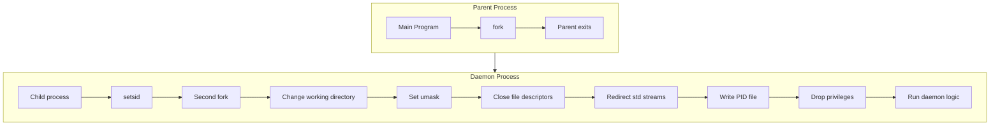

# Daemonize: Complete Exploration

## Overview

**Daemonize** is a (hopefully temporary) fork of the `daemonize` crate for creating Unix system daemons. It provides a safe, idiomatic Rust interface for daemonizing processes with support for PID files, privilege dropping, and stream redirection.

### Key Characteristics

| Aspect | Daemonize |
|--------|-----------|
| **Core Innovation** | Safe Rust wrapper around Unix daemon APIs |
| **Dependencies** | libc |
| **Lines of Code** | ~600 |
| **Purpose** | Unix daemon process creation |
| **Architecture** | Builder pattern, FFI wrappers |
| **Runtime** | Unix/Linux/macOS |
| **Rust Equivalent** | Original `daemonize` crate |

### Source Structure

```
daemonize/
├── src/
│   ├── lib.rs             # Main library
│   └── ffi.rs             # FFI bindings
│
├── examples/
│   └── simple_daemon.rs   # Basic example
│
├── tests/
│   └── integration.rs     # Integration tests
│
├── Cargo.toml
├── LICENSE-APACHE
├── LICENSE-MIT
├── README.md
├── CHANGELOG.md
├── .travis.yml
└── .git/
```

---

## Table of Contents

1. **[Zero to Daemon Engineer](00-zero-to-daemon-engineer.md)** - Daemon fundamentals
2. **[Unix Daemonization](01-unix-daemonization.md)** - Process management
3. **[Rust Revision](rust-revision.md)** - Rust translation guide (already Rust)
4. **[Production-Grade](production-grade.md)** - Production deployment

---

## Architecture Overview

### High-Level Flow



### Component Architecture

```mermaid
classDiagram
    class Daemonize {
        -directory: PathBuf
        -pid_file: Option<PathBuf>
        -chown_pid_file: bool
        -user: Option<User>
        -group: Option<Group>
        -umask: mode_t
        -root: Option<PathBuf>
        -privileged_action: Box<dyn Fn()>
        -exit_action: Box<dyn Fn()>
        -stdin: Stdio
        -stdout: Stdio
        -stderr: Stdio
        +new() Daemonize
        +pid_file(path) Self
        +working_directory(path) Self
        +user(user) Self
        +group(group) Self
        +umask(mask) Self
        +chroot(path) Self
        +privileged_action(action) Self
        +exit_action(action) Self
        +stdout(stdio) Self
        +stderr(stdio) Self
        +start() Result<T, DaemonizeError>
    }

    class User {
        <<enum>>
        Name(String)
        Id(uid_t)
    }

    class Group {
        <<enum>>
        Name(String)
        Id(gid_t)
    }

    class DaemonizeError {
        <<enum>>
        Fork
        DetachSession(Errno)
        GroupNotFound
        SetGroup(Errno)
        UserNotFound
        SetUser(Errno)
        ChangeDirectory
        OpenPidfile
        LockPidfile(Errno)
        ChownPidfile(Errno)
        RedirectStreams(Errno)
        WritePid
        Chroot(Errno)
    }

    Daemonize o-- User
    Daemonize o-- Group
    DaemonizeError ..> Daemonize : returns
```

---

## Core Concepts

### 1. What is a Daemon?

A daemon is a background process that:
- **Detaches from terminal** - No controlling terminal
- **Runs in background** - Independent of user session
- **Has own session** - Created with `setsid()`
- **Runs as service** - Typically started at boot

**Common daemons:**
- `sshd` - SSH server
- `httpd` - Web server
- `cron` - Task scheduler
- `systemd` - Init system

### 2. Daemonization Steps

The daemonization process involves several steps:

```rust
use daemonize::Daemonize;
use std::fs::File;

fn main() {
    let stdout = File::create("/tmp/daemon.out").unwrap();
    let stderr = File::create("/tmp/daemon.err").unwrap();

    let daemonize = Daemonize::new()
        .pid_file("/tmp/test.pid")
        .chown_pid_file(true)
        .working_directory("/tmp")
        .user("nobody")
        .group("daemon")
        .umask(0o777)
        .stdout(stdout)
        .stderr(stderr)
        .privileged_action(|| println!("Before drop privileges"));

    match daemonize.start() {
        Ok(_) => println!("Success, daemonized"),
        Err(e) => eprintln!("Error, {}", e),
    }
}
```

### 3. Fork and Session Management

```rust
// Double-fork pattern
unsafe fn perform_fork(&self, perform_action: bool) -> Result<()> {
    let pid = fork();
    if pid < 0 {
        Err(DaemonizeError::Fork)
    } else if pid == 0 {
        // Child process
        Ok(())
    } else {
        // Parent process
        if perform_action {
            (self.exit_action)();
        }
        exit(0);
    }
}

// Create new session (detach from controlling terminal)
unsafe fn set_sid() -> Result<()> {
    tryret!(setsid(), Ok(()), DaemonizeError::DetachSession)
}
```

**Why double-fork?**
1. First fork: Parent exits, child continues
2. `setsid()`: Create new session, lose controlling terminal
3. Second fork: Prevent accidental terminal acquisition

---

## API Reference

### Basic Configuration

```rust
// Create new daemonize instance
let daemonize = Daemonize::new();

// Set PID file location
let daemonize = daemonize.pid_file("/var/run/mydaemon.pid");

// Change ownership of PID file
let daemonize = daemonize.chown_pid_file(true);

// Set working directory
let daemonize = daemonize_working_directory("/var/lib/mydaemon");

// Set umask
let daemonize = daemonize.umask(0o027);
```

### User and Group

```rust
// Drop to specific user (by name)
let daemonize = daemonize.user("www-data");

// Drop to specific user (by UID)
let daemonize = daemonize.user(33u32);

// Drop to specific group (by name)
let daemonize = daemonize.group("nogroup");

// Drop to specific group (by GID)
let daemonize = daemonize.group(65534u32);
```

### Stream Redirection

```rust
use std::fs::File;

// Redirect stdout
let stdout = File::create("/var/log/mydaemon.out")?;
let daemonize = daemonize.stdout(stdout);

// Redirect stderr
let stderr = File::create("/var/log/mydaemon.err")?;
let daemonize = daemonize.stderr(stderr);

// Redirect to /dev/null (default)
let daemonize = daemonize.stdout(Stdio::devnull());
```

### Privileged Actions

Execute actions before dropping privileges:

```rust
// Open privileged port before dropping root
let daemonize = daemonize.privileged_action(|| {
    let listener = TcpListener::bind("0.0.0.0:80")?;
    // Pass listener to daemon via FD inheritance
});

// Execute action before parent exits
let daemonize = daemonize.exit_action(|| {
    println!("Parent process exiting");
});
```

### Chroot

```rust
// Change root directory (requires root)
let daemonize = daemonize.chroot("/var/chroot/mydaemon");
```

---

## Error Handling

### Error Types

```rust
#[derive(Debug, PartialEq, Eq, Clone)]
pub enum DaemonizeError {
    Fork,                        // Unable to fork
    DetachSession(Errno),        // Unable to create session
    GroupNotFound,               // Group name not found
    GroupContainsNul,            // Group name contains NUL
    SetGroup(Errno),             // Unable to set group
    UserNotFound,                // User name not found
    UserContainsNul,             // User name contains NUL
    SetUser(Errno),              // Unable to set user
    ChangeDirectory,             // Unable to change directory
    PathContainsNul,             // Path contains NUL
    OpenPidfile,                 // Unable to open PID file
    LockPidfile(Errno),          // Unable to lock PID file
    ChownPidfile(Errno),         // Unable to chown PID file
    RedirectStreams(Errno),      // Unable to redirect streams
    WritePid,                    // Unable to write PID
    Chroot(Errno),               // Unable to chroot
}
```

### Error Handling

```rust
use daemonize::{Daemonize, DaemonizeError};
use std::process;

fn main() {
    let daemonize = Daemonize::new()
        .pid_file("/var/run/mydaemon.pid");

    match daemonize.start() {
        Ok(_) => {
            // Running as daemon now
            run_daemon();
        }
        Err(DaemonizeError::Fork) => {
            eprintln!("Failed to fork");
            process::exit(1);
        }
        Err(DaemonizeError::UserNotFound) => {
            eprintln!("User not found");
            process::exit(1);
        }
        Err(e) => {
            eprintln!("Daemonize error: {}", e);
            process::exit(1);
        }
    }
}
```

---

## Unix Daemon Internals

### File Descriptor Handling

```rust
unsafe fn redirect_standard_streams(
    stdin: Stdio,
    stdout: Stdio,
    stderr: Stdio
) -> Result<()> {
    // Open /dev/null
    let devnull_fd = open(transmute(b"/dev/null\0"), O_RDWR);

    // Close stdin/stdout/stderr and redirect to /dev/null
    process_stdio(STDIN_FILENO, stdin, devnull_fd)?;
    process_stdio(STDOUT_FILENO, stdout, devnull_fd)?;
    process_stdio(STDERR_FILENO, stderr, devnull_fd)?;

    close(devnull_fd);
    Ok(())
}
```

### PID File Management

```rust
unsafe fn create_pid_file(path: PathBuf) -> Result<c_int> {
    let path_c = pathbuf_into_cstring(path)?;

    // Open or create file
    let fd = open(path_c.as_ptr(), O_WRONLY | O_CREAT, 0o666);
    if fd == -1 {
        return Err(DaemonizeError::OpenPidfile);
    }

    // Lock file (exclusive, non-blocking)
    tryret!(
        flock(fd, LOCK_EX | LOCK_NB),
        Ok(fd),
        DaemonizeError::LockPidfile
    )
}

unsafe fn write_pid_file(fd: c_int) -> Result<()> {
    let pid = getpid();
    let pid_str = format!("{}", pid);

    // Truncate file
    ftruncate(fd, 0);

    // Write PID
    write(fd, pid_str.as_ptr() as *const _, pid_str.len());
    Ok(())
}
```

### Privilege Dropping

```rust
unsafe fn get_group(group: Group) -> Result<gid_t> {
    match group {
        Group::Id(id) => Ok(id),
        Group::Name(name) => {
            let s = CString::new(name)
                .map_err(|_| DaemonizeError::GroupContainsNul)?;
            match get_gid_by_name(&s) {
                Some(id) => get_group(Group::Id(id)),
                None => Err(DaemonizeError::GroupNotFound),
            }
        }
    }
}

unsafe fn set_group(group: gid_t) -> Result<()> {
    tryret!(setgid(group), Ok(()), DaemonizeError::SetGroup)
}

unsafe fn set_user(user: uid_t) -> Result<()> {
    tryret!(setuid(user), Ok(()), DaemonizeError::SetUser)
}
```

---

## Production Patterns

### Systemd Integration

```ini
# /etc/systemd/system/mydaemon.service
[Unit]
Description=My Daemon Service
After=network.target

[Service]
Type=forking
PIDFile=/var/run/mydaemon.pid
ExecStart=/usr/local/bin/mydaemon
ExecReload=/bin/kill -HUP $MAINPID
Restart=on-failure
User=nobody
Group=nogroup

[Install]
WantedBy=multi-user.target
```

### Logging Integration

```rust
use syslog::{Facility, init};
use log::{info, error};

fn run_daemon() {
    // Initialize syslog
    let log = init(Facility::LOG_DAEMON, syslog::Level::Info, "mydaemon")
        .expect("Could not connect to syslog");

    info!("Daemon started");

    // Run daemon logic
    loop {
        // Do work
        // ...
    }
}
```

### Signal Handling

```rust
use signal_hook::consts::{SIGTERM, SIGHUP};
use signal_hook::iterator::Signals;
use std::sync::atomic::{AtomicBool, Ordering};

static RUNNING: AtomicBool = AtomicBool::new(true);

fn setup_signal_handlers() {
    let mut signals = Signals::new(&[SIGTERM, SIGHUP]).unwrap();

    std::thread::spawn(move || {
        for signal in signals.forever() {
            match signal {
                SIGTERM => {
                    info!("Received SIGTERM, shutting down");
                    RUNNING.store(false, Ordering::SeqCst);
                }
                SIGHUP => {
                    info!("Received SIGHUP, reloading config");
                    reload_config();
                }
                _ => {}
            }
        }
    });
}

fn run_daemon() {
    setup_signal_handlers();

    while RUNNING.load(Ordering::SeqCst) {
        // Do work
        std::thread::sleep(Duration::from_secs(1));
    }

    // Cleanup
    info!("Daemon shutting down");
}
```

---

## Security Considerations

### Principle of Least Privilege

```rust
// Drop to unprivileged user
let daemonize = Daemonize::new()
    .user("nobody")
    .group("nogroup");

// Drop additional capabilities (Linux-specific)
// Use capctl or similar crate
```

### Chroot Jail

```rust
// Isolate daemon in chroot
let daemonize = Daemonize::new()
    .chroot("/var/chroot/mydaemon")
    .working_directory("/");

// Note: chroot is not a complete security boundary
// Use containers or sandboxing for stronger isolation
```

### File Permissions

```rust
// Restrictive umask
let daemonize = daemonize.umask(0o077);

// Secure PID file
let daemonize = daemonize
    .pid_file("/var/run/mydaemon.pid")
    .chown_pid_file(true);
```

---

## Testing

### Unit Testing

```rust
#[cfg(test)]
mod tests {
    use daemonize::Daemonize;
    use std::fs;

    #[test]
    fn test_daemonize_builder() {
        let daemonize = Daemonize::new()
            .pid_file("/tmp/test.pid")
            .working_directory("/tmp");

        assert!(daemonize.start().is_err());  // Can't actually daemonize in test
    }
}
```

### Integration Testing

```rust
#[test]
fn test_daemon_lifecycle() {
    // Start daemon
    let daemon = start_test_daemon();

    // Check PID file exists
    assert!(Path::new("/tmp/test.pid").exists());

    // Stop daemon
    stop_test_daemon(daemon);

    // Check PID file removed
    assert!(!Path::new("/tmp/test.pid").exists());
}
```

---

## Your Path Forward

### To Build Daemon Skills

1. **Create simple daemon** (hello world)
2. **Add PID file management** (lock and write)
3. **Implement signal handling** (graceful shutdown)
4. **Add logging** (syslog integration)
5. **Deploy as service** (systemd/upstart)

### Recommended Resources

- [Advanced Programming in the Unix Environment](https://www.amazon.com/Advanced-Programming-UNIX-Environment-3rd/dp/0321637739)
- [Rust libc Documentation](https://docs.rs/libc/)
- [Original daemonize Crate](https://github.com/knsd/daemonize)
- [systemd Documentation](https://www.freedesktop.org/wiki/Software/systemd/)

---

## Document History

| Date | Change |
|------|--------|
| 2026-03-27 | Initial daemonize exploration created |
| 2026-03-27 | Daemonization process documented |
| 2026-03-27 | Deep dive outlines completed |

---

*This exploration is a living document. Revisit sections as concepts become clearer through implementation.*
