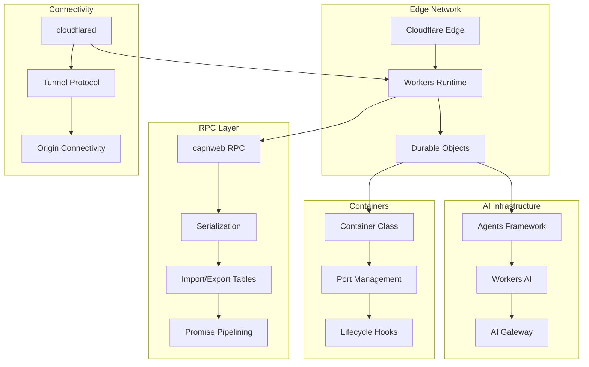

# Cloudflare Core: Complete Exploration

## Overview

**Cloudflare Core** is a collection of foundational subsystems powering Cloudflare's edge network, AI infrastructure, and developer platforms. This exploration covers 8 critical subdirectories:

| Subdirectory | Purpose | Language | Lines of Code |
|--------------|---------|----------|---------------|
| **agents** | AI agent framework with Durable Objects | TypeScript | ~15,000 |
| **ai** | Workers AI and AI Gateway providers | TypeScript | ~8,000 |
| **ai-search-snippet** | Search/chat UI components | TypeScript | ~3,000 |
| **api-schemas** | OpenAPI schemas for Cloudflare APIs | YAML/JSON | ~50,000 |
| **capnweb** | Cap'n Proto RPC for web integration | TypeScript | ~5,000 |
| **cloudflared** | Tunnel protocol and edge connectivity | Go | ~100,000+ |
| **containers** | Container management for Workers | TypeScript | ~2,000 |
| **daemonize** | System daemon creation library | Rust | ~600 |

### Why This Exploration Exists

This is a **complete textbook** that takes you from zero Cloudflare infrastructure knowledge to understanding how to build and deploy production systems using Cloudflare's core technologies.

### Key Characteristics

| Aspect | Cloudflare Core |
|--------|-----------------|
| **Core Innovation** | Edge-first architecture with distributed state |
| **Runtime** | Workers (V8 isolate), Node.js, native binaries |
| **State Management** | Durable Objects, KV Storage, R2 |
| **Communication** | RPC (capnweb), HTTP, WebSocket, Tunnel protocol |
| **AI Integration** | Workers AI, AI Gateway, Agents framework |
| **Rust Equivalent** | valtron executor, native bindings |

---

## Complete Table of Contents

### Part 1: Foundations

1. **[Zero to Cloudflare Engineer](00-zero-to-cloudflare-engineer.md)** - Start here if new to Cloudflare
   - What is Cloudflare's edge network?
   - Workers runtime and isolates
   - Durable Objects and stateful computation
   - Edge AI and inference
   - Tunnel protocols and connectivity

### Part 2: Core Subsystems

#### AI & Agents
2. **[Agents Exploration](agents/exploration.md)** - AI agent framework
   - Agent class and Durable Objects
   - Callable methods and state sync
   - MCP integration
   - Workflows and human-in-the-loop

3. **[AI Exploration](ai/exploration.md)** - Workers AI infrastructure
   - Workers AI models and inference
   - AI Gateway routing
   - Vercel AI SDK integration
   - TanStack AI adapters

4. **[AI Search Snippet Exploration](ai-search-snippet/exploration.md)** - Search UI components
   - Web Components architecture
   - Streaming responses
   - Search and chat interfaces

#### RPC & Connectivity
5. **[Capnweb Exploration](capnweb/exploration.md)** - Cap'n Proto RPC **(Special Focus)**
   - RPC protocol design
   - Serialization and framing
   - Import/export tables
   - Promise pipelining
   - Stream handling

6. **[Cloudflared Exploration](cloudflared/exploration.md)** - Tunnel protocol **(Special Focus)**
   - Tunnel architecture
   - Edge connectivity
   - Carrier protocol
   - Access authentication

#### Infrastructure
7. **[Containers Exploration](containers/exploration.md)** - Container management
   - Container lifecycle
   - Port management
   - Outbound interception
   - Load balancing

8. **[API Schemas Exploration](api-schemas/exploration.md)** - API definitions
   - OpenAPI structure
   - Schema components
   - Response formats

9. **[Daemonize Exploration](daemonize/exploration.md)** - System daemon library
   - Unix daemonization
   - Privilege dropping
   - PID file management

### Part 3: Rust Revision

10. **[Rust Revision Guide](rust-revision.md)** - Complete Rust translation
    - TypeScript to Rust patterns
    - Ownership strategies
    - Async to TaskIterator
    - Valtron integration

### Part 4: Production

11. **[Production-Grade Implementation](production-grade.md)** - Production deployment
    - Performance optimization
    - Scaling strategies
    - Monitoring and observability
    - Security considerations

12. **[Valtron Integration](07-valtron-integration.md)** - Lambda deployment
    - TaskIterator pattern
    - HTTP API compatibility
    - Production deployment

---

## Quick Reference: Architecture Overview

### High-Level Flow



### Component Summary

| Component | Deep Dive | Special Focus |
|-----------|-----------|---------------|
| Agents | [agents/exploration.md](agents/exploration.md) | Agent framework, orchestration |
| AI | [ai/exploration.md](ai/exploration.md) | AI/ML infrastructure |
| AI Search Snippet | [ai-search-snippet/exploration.md](ai-search-snippet/exploration.md) | UI components |
| API Schemas | [api-schemas/exploration.md](api-schemas/exploration.md) | OpenAPI definitions |
| Capnweb | [capnweb/exploration.md](capnweb/exploration.md) | **Cap'n Proto RPC** |
| Cloudflared | [cloudflared/exploration.md](cloudflared/exploration.md) | **Tunnel Protocol** |
| Containers | [containers/exploration.md](containers/exploration.md) | Container lifecycle |
| Daemonize | [daemonize/exploration.md](daemonize/exploration.md) | Unix daemonization |

---

## File Structure

```
cloudflare-core/
├── exploration.md                  # This file (index)
├── 00-zero-to-cloudflare-engineer.md
├── 07-valtron-integration.md
├── rust-revision.md
├── production-grade.md
│
├── agents/
│   ├── exploration.md              # Architecture overview
│   ├── 00-zero-to-agent-runtime.md # First principles
│   ├── 01-durable-objects-deep-dive.md
│   ├── 02-state-management-deep-dive.md
│   ├── 03-mcp-integration-deep-dive.md
│   ├── rust-revision.md
│   ├── production-grade.md
│   └── 07-valtron-integration.md
│
├── ai/
│   ├── exploration.md
│   ├── 00-zero-to-workers-ai.md
│   ├── 01-models-inference-deep-dive.md
│   ├── 02-ai-gateway-deep-dive.md
│   ├── rust-revision.md
│   ├── production-grade.md
│   └── 07-valtron-integration.md
│
├── ai-search-snippet/
│   ├── exploration.md
│   ├── 00-zero-to-web-components.md
│   ├── rust-revision.md
│   ├── production-grade.md
│   └── 07-valtron-integration.md
│
├── api-schemas/
│   ├── exploration.md
│   ├── 00-zero-to-openapi.md
│   ├── rust-revision.md
│   └── production-grade.md
│
├── capnweb/
│   ├── exploration.md
│   ├── 00-zero-to-rpc-engineer.md
│   ├── 01-protocol-deep-dive.md
│   ├── 02-serialization-deep-dive.md
│   ├── 03-import-export-tables.md
│   ├── 04-promise-pipelining.md
│   ├── 05-streams-websocket.md
│   ├── rust-revision.md
│   ├── production-grade.md
│   └── 07-valtron-integration.md
│
├── cloudflared/
│   ├── exploration.md
│   ├── 00-zero-to-tunnel-engineer.md
│   ├── 01-tunnel-protocol-deep-dive.md
│   ├── 02-carrier-protocol.md
│   ├── 03-access-authentication.md
│   ├── 04-edge-connectivity.md
│   ├── rust-revision.md
│   ├── production-grade.md
│   └── 07-valtron-integration.md
│
├── containers/
│   ├── exploration.md
│   ├── 00-zero-to-container-engineer.md
│   ├── 01-lifecycle-management.md
│   ├── 02-port-management.md
│   ├── 03-outbound-interception.md
│   ├── rust-revision.md
│   ├── production-grade.md
│   └── 07-valtron-integration.md
│
└── daemonize/
    ├── exploration.md
    ├── 00-zero-to-daemon-engineer.md
    ├── 01-unix-daemonization.md
    ├── rust-revision.md
    └── production-grade.md
```

---

## How to Use This Exploration

### For Complete Beginners (Zero Cloudflare Experience)

1. Start with **[00-zero-to-cloudflare-engineer.md](00-zero-to-cloudflare-engineer.md)**
2. Read each subsystem's "Zero to X" guide
3. Continue through deep dives in order
4. Finish with production-grade and valtron integration

**Time estimate:** 40-80 hours for complete understanding

### For Experienced Developers

1. Skim foundation guides for context
2. Deep dive into areas of interest
3. Review rust-revision.md for Rust translation patterns
4. Check production-grade.md for deployment considerations

### For Infrastructure Engineers

1. Review source directories directly
2. Use deep dives as reference for specific components
3. Compare with other edge/infrastructure platforms
4. Extract insights for system design

---

## Key Insights

### 1. Edge-First Architecture

Cloudflare's core innovation is pushing computation to the edge:

```
Traditional Cloud          Cloudflare Edge
┌─────────────────┐       ┌─────────────────────────────────┐
│   Central DC    │       │  POP   POP   POP   POP   POP   │
│   (few regions) │  vs   │  /  \   /  \   /  \   /  \   / │
│                 │       │ Users → Edge → Origin (few)    │
└─────────────────┘       └─────────────────────────────────┘
```

**Benefits:**
- Lower latency (closer to users)
- Higher availability (distributed)
- Better scaling (horizontal by design)

### 2. Durable Objects for State

Durable Objects provide strongly-consistent, stateful computation:

```typescript
export class CounterAgent extends Agent<Env, CounterState> {
  initialState = { count: 0 };

  @callable()
  increment() {
    this.setState({ count: this.state.count + 1 });
    return this.state.count;
  }
}
```

**Key properties:**
- Single instance per ID (strong consistency)
- Automatic persistence
- Real-time state sync to clients

### 3. Cap'n Proto RPC

Capnweb uses Cap'n Proto for efficient RPC:

```
Client                          Server
  │ ──["push", expression]──>   │
  │ ──["pull", importId]──>     │
  │ <──["resolve", result]──    │
  │ ──["release", importId]──>  │
```

**Advantages:**
- Zero-copy serialization
- Promise pipelining (no round trips)
- Bidirectional communication

### 4. Tunnel Protocol

Cloudflared creates secure tunnels:

```
Internet → Cloudflare Edge → Tunnel → Origin
                              │
                          (no firewall changes needed)
```

**Security:**
- Outbound-only connection
- Mutual TLS authentication
- No inbound ports required

### 5. Workers AI Integration

Workers AI brings ML inference to the edge:

```typescript
import { Ai } from '@cloudflare/workers-ai';

export default {
  async fetch(request, env) {
    const ai = new Ai(env.AI);
    const response = await ai.run('@cf/meta/llama-3-8b-instruct', {
      messages: [{ role: 'user', content: 'Hello!' }]
    });
    return Response.json(response);
  }
};
```

---

## Your Path Forward

### To Build Cloudflare Skills

1. **Deploy a simple Worker** (hello world)
2. **Add Durable Objects** (stateful counter)
3. **Build an Agent** (AI assistant)
4. **Integrate Workers AI** (LLM inference)
5. **Set up cloudflared** (tunnel to origin)

### Recommended Resources

- [Cloudflare Workers Docs](https://developers.cloudflare.com/workers/)
- [Durable Objects Guide](https://developers.cloudflare.com/durable-objects/)
- [Workers AI Documentation](https://developers.cloudflare.com/workers-ai/)
- [Cloudflare Tunnel Docs](https://developers.cloudflare.com/cloudflare-one/networks/connectors/cloudflare-tunnel/)
- [Valtron README](/home/darkvoid/Boxxed/@dev/ewe_platform/backends/foundation_core/src/valtron/README.md)

---

## Document History

| Date | Change |
|------|--------|
| 2026-03-27 | Initial exploration created |
| 2026-03-27 | All 8 subdirectories documented |
| 2026-03-27 | Rust revision and production-grade planned |

---

*This exploration is a living document. Revisit sections as concepts become clearer through implementation.*
