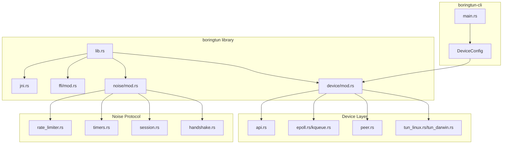

# Cloudflare Rust Projects Exploration

## Overview

The `src.cloudflare` directory contains a collection of Cloudflare's open-source Rust projects and libraries. This is primarily a mirrored collection of various Cloudflare repositories focused on networking, cryptography, and infrastructure tooling.

## Major Projects

### 1. BoringTun (WireGuard Implementation)

**Location:** `boringtun/`

BoringTun is an implementation of the WireGuard protocol designed for portability and speed. It's successfully deployed on millions of iOS and Android devices and thousands of Cloudflare servers.

#### Architecture



#### Key Components

**`boringtun/src/lib.rs`** - Main library entry point that exports:
- `device` module (feature-gated) - Userspace WireGuard device implementation
- `noise` module - WireGuard noise protocol implementation
- `ffi` module - C FFI bindings
- `jni` module - Java Native Interface bindings
- `x25519` re-exports - Curve25519 cryptographic types

**`boringtun/src/device/mod.rs`** - Core device implementation:
- `Device` struct - Main WireGuard interface
- `DeviceHandle` - Event loop handle with worker threads
- `Peer` management - Per-peer state and routing
- Event polling via epoll (Linux) or kqueue (macOS)
- UDP socket management for encrypted tunnel traffic
- TUN interface integration

**`boringtun/src/noise/mod.rs`** - Protocol implementation:
- `Tunn` struct - Tunnel state machine
- Packet encapsulation/decapsulation
- Handshake state management
- Session management (8 sessions in ring buffer)
- Rate limiting for handshakes
- Timer management for keepalives and rekeys

**`boringtun/src/noise/handshake.rs`** - Noise IK protocol:
- Handshake initiation and response
- Cookie mechanism for DDoS protection
- X25519 key exchange
- ChaCha20-Poly1305 AEAD encryption
- Blake2s hashing and HMAC
- Tai64N timestamps for replay protection

#### Directory Structure

```
boringtun/
├── boringtun/              # Main library crate
│   ├── src/
│   │   ├── device/         # Device, peer, TUN handling
│   │   │   ├── allowed_ips.rs
│   │   │   ├── api.rs
│   │   │   ├── dev_lock.rs
│   │   │   ├── drop_privileges.rs
│   │   │   ├── epoll.rs (Linux)
│   │   │   ├── kqueue.rs (macOS)
│   │   │   ├── mod.rs
│   │   │   ├── peer.rs
│   │   │   ├── tun_linux.rs
│   │   │   └── tun_darwin.rs
│   │   ├── noise/          # WireGuard protocol
│   │   │   ├── errors.rs
│   │   │   ├── handshake.rs
│   │   │   ├── mod.rs
│   │   │   ├── rate_limiter.rs
│   │   │   ├── session.rs
│   │   │   └── timers.rs
│   │   ├── ffi/            # C FFI bindings
│   │   ├── jni.rs          # Java bindings
│   │   ├── serialization.rs
│   │   ├── sleepyinstant/  # Cross-platform Instant
│   │   └── lib.rs
│   ├── benches/            # Cryptographic benchmarks
│   └── Cargo.toml
├── boringtun-cli/          # Command-line interface
│   ├── src/main.rs
│   └── Cargo.toml
├── Cargo.toml              # Workspace root
├── README.md
└── LICENSE.md
```

#### Dependencies

Key crates used:
- `x25519-dalek` - Curve25519 ECDH
- `chacha20poly1305` - AEAD encryption
- `blake2` - Hashing
- `hmac` - Message authentication
- `ring` - Additional crypto primitives
- `parking_lot` - Fast synchronization
- `tracing` - Logging
- `socket2` - Cross-platform sockets
- `nix` - Unix system APIs

#### Usage Pattern

```rust
// Create a tunnel
let tunnel = Tunn::new(
    static_private,  // X25519 private key
    peer_public,     // Peer's public key
    preshared_key,   // Optional PSK
    keepalive,       // Persistent keepalive interval
    index,           // Peer index
    rate_limiter,    // Optional rate limiter
);

// Encapsulate outgoing packets
let result = tunnel.encapsulate(&ip_packet, &mut buffer);

// Decapsulate incoming packets
let result = tunnel.decapsulate(Some(src_addr), &udp_payload, &mut buffer);
```

---

### 2. Pingora (Proxy Framework)

**Location:** `Others/pingora/`

Pingora is Cloudflare's Rust framework for building fast, reliable, and programmable network proxies.

#### Architecture Components

```
pingora/
├── pingora-core/          # Core abstractions
├── pingora-proxy/         # HTTP proxy implementation
├── pingora-cache/         # Response caching
├── pingora-load-balancing/# Load balancing logic
├── pingora-pool/          # Connection pooling
├── pingora-limits/        # Rate limiting
├── pingora-lru/           # LRU cache
├── pingora-header-serde/  # Header serialization
├── pingora-http/          # HTTP utilities
├── pingora-runtime/       # Tokio runtime setup
├── pingora-timeout/       # Timeout handling
├── pingora-boringssl/     # BoringSSL bindings
├── pingora-openssl/       # OpenSSL bindings
├── pingora-rustls/        # Rustls integration
└── pingora/               # Meta-crate re-exporting all
```

#### Key Features

- Async I/O via Tokio
- Connection pooling and multiplexing
- HTTP/1.1 and HTTP/2 support
- TLS termination via BoringSSL/OpenSSL/rustls
- Caching with configurable policies
- Load balancing with health checks
- Rate limiting at multiple levels

---

### 3. Quiche (QUIC + HTTP/3)

**Location:** `Others/quiche/`

Quiche is Cloudflare's implementation of the QUIC transport protocol and HTTP/3.

#### Structure

```
quiche/
├── quiche/                  # Core QUIC implementation
├── qlog/                    # QLOG logging support
├── octets/                  # Octet parsing utilities
├── h3i/                     # HTTP/3 integration tests
├── apps/                    # Example applications
├── tools/http3_test/        # HTTP/3 test tools
└── fuzz/                    # Fuzzing harnesses
```

#### Protocol Support

- QUIC (RFC 9000)
- HTTP/3 (RFC 9114)
- DATASET extension
- QPACK header compression

---

### 4. Daphne (Privacy-Preserving Data Aggregation)

**Location:** `Others/daphne/`

Daphne is Cloudflare's implementation of the DAP (Distributed Aggregation Protocol) standard for privacy-preserving data aggregation.

#### Crates

```
daphne/
├── daphne/                      # Core protocol implementation
├── daphne-server/               # Server implementation
├── daphne-worker/               # Cloudflare Workers integration
├── daphne-worker-test/          # Test utilities
├── daphne-service-utils/        # Shared service utilities
└── dapf/                        # CLI tooling
```

---

### 5. Lol-html (Streaming HTML Parser)

**Location:** `Others/lol-html/`

A streaming HTML rewriter that can process arbitrarily large HTML documents with constant memory usage.

#### Features

- Streaming/Incremental parsing
- CSS selector-based rewrites
- Content rewriting via Lua or Rust
- Zero-copy parsing where possible
- FFI bindings for C and JavaScript

---

### 6. BoringSSL Bindings

**Location:** `Others/boring/`

Rust bindings for BoringSSL, Cloudflare's TLS library fork.

#### Crates

- `boring` - Main high-level API
- `boring-sys` - Low-level FFI bindings
- `tokio-boring` - Async I/O integration
- `hyper-boring` - Hyper HTTP client integration

---

### 7. Other Notable Projects

| Project | Description |
|---------|-------------|
| `aloha-rs` | BHTTP (Binary HTTP) implementation |
| `highway-rs` | HighwayHash implementation |
| `rustracing` / `rustracing_jaeger` | Distributed tracing |
| `networkquality-rs` | Network quality measurement |
| `wasm-coredump` | WebAssembly core dump handling |
| `trie-hard` | Trie data structure implementation |
| `shellflip` | Shell utilities |
| `recapn` | Message serialization framework |
| `workerd-cxx` | Rust integration for workerd C++ runtime |
| `miniflare` | Local Cloudflare Workers simulator |
| `cloudflared` | Cloudflare Tunnel client (Go, with Rust components) |
| `entropy-map` | Entropy collection for cryptography |
| `foundations` | Internal framework/library |

---

## Common Patterns

### 1. Workspace Structure

Most projects use Cargo workspaces:

```toml
[workspace]
members = [
    "crate-a",
    "crate-b",
]
```

### 2. Feature Flags

Extensive use of feature flags for optional functionality:

```toml
[features]
default = []
device = ["socket2", "thiserror"]
jni-bindings = ["ffi-bindings", "jni"]
```

### 3. Error Handling

Consistent use of `thiserror` for error types:

```rust
#[derive(Debug, thiserror::Error)]
pub enum Error {
    #[error("i/o error: {0}")]
    IoError(#[from] io::Error),
    // ...
}
```

### 4. Logging

Universal adoption of `tracing` crate for structured logging.

### 5. Async Runtime

Heavy use of Tokio for async I/O across projects.

---

## Security Considerations

1. **Cryptographic Operations**: All crypto uses well-audited crates (`ring`, `x25519-dalek`, `chacha20poly1305`)
2. **Memory Safety**: Extensive use of Rust's type system to prevent memory errors
3. **Constant-time Operations**: Use of `ring::constant_time` for sensitive comparisons
4. **DDoS Protection**: Rate limiting built into protocol implementations (handshake rate limiting in BoringTun)

---

## Testing Strategies

1. **Unit Tests**: Extensive unit tests in `mod tests` blocks
2. **Integration Tests**: Separate `tests/` directories with end-to-end tests
3. **Fuzzing**: Several projects include fuzzing harnesses
4. **Benchmarks**: Criterion-based benchmarks for performance-critical code

---

## References

- [BoringTun GitHub](https://github.com/cloudflare/boringtun)
- [Pingora GitHub](https://github.com/cloudflare/pingora)
- [Quiche GitHub](https://github.com/cloudflare/quiche)
- [Daphne GitHub](https://github.com/cloudflare/daphne)
- [Lol-html GitHub](https://github.com/cloudflare/lol-html)
