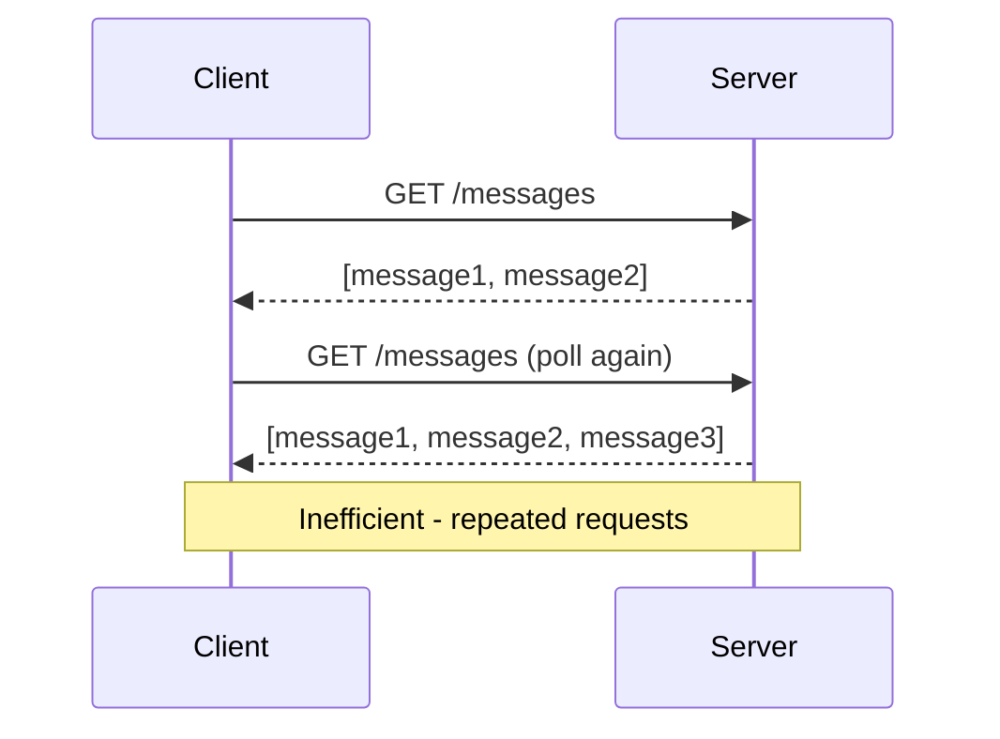
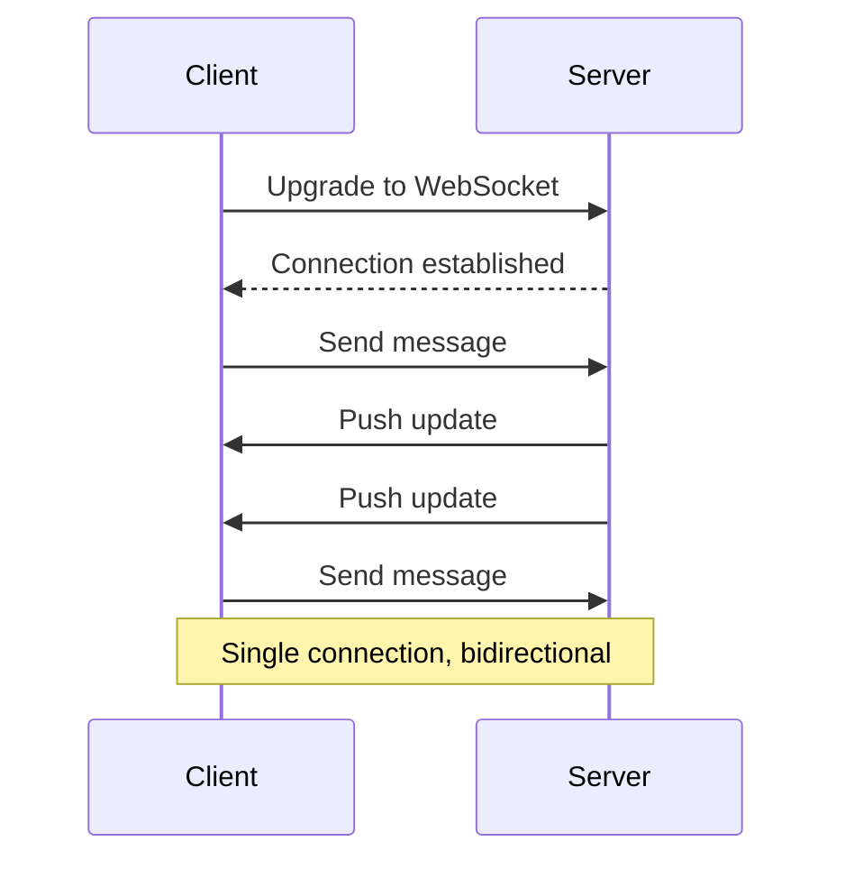
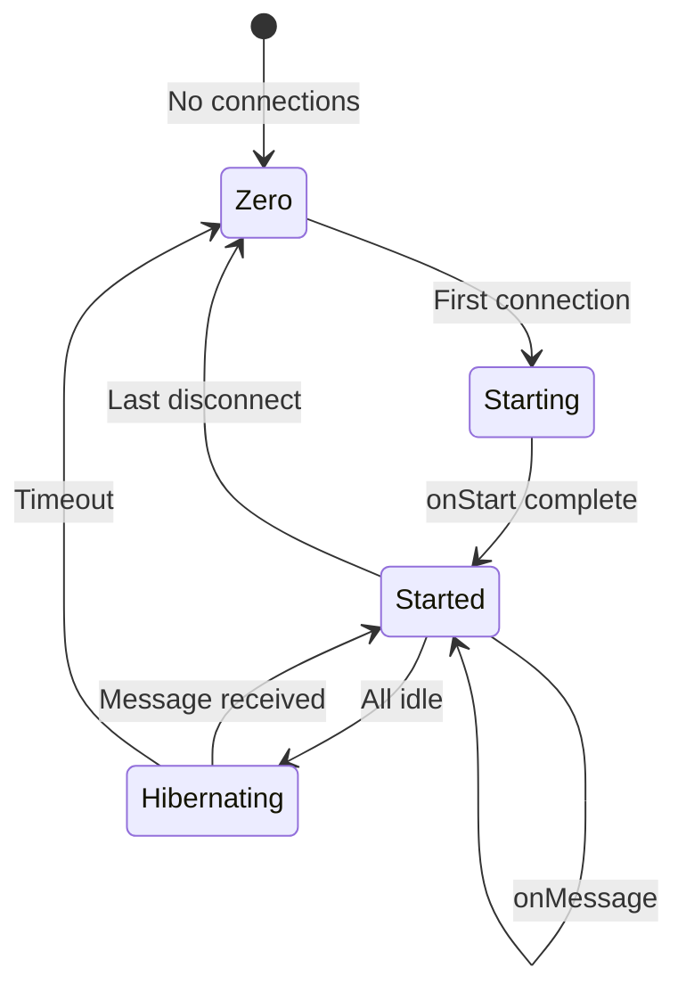
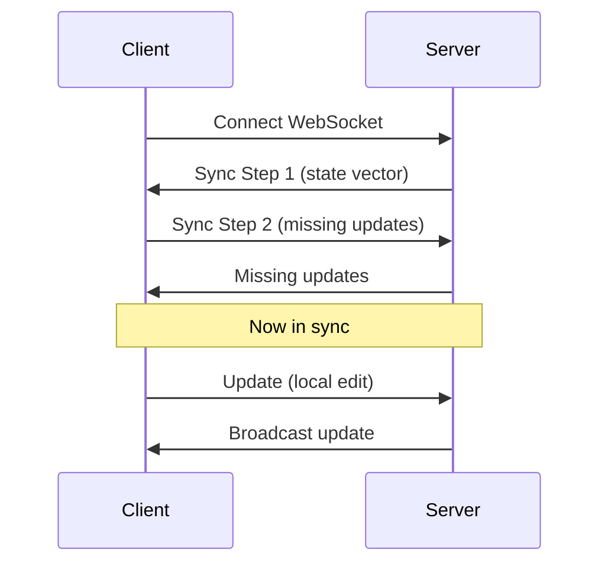

# Zero to Multiplayer Backend Engineer: First-Principles Guide

## Table of Contents

1. [What Are Multiplayer Backends?](#1-what-are-multiplayer-backends)
2. [WebSocket Fundamentals](#2-websocket-fundamentals)
3. [Room-Based Architecture](#3-room-based-architecture)
4. [State Synchronization Patterns](#4-state-synchronization-patterns)
5. [Presence and Heartbeat Systems](#5-presence-and-heartbeat-systems)
6. [Durable Objects Primer](#6-durable-objects-primer)
7. [Your Learning Path](#7-your-learning-path)

---

## 1. What Are Multiplayer Backends?

### 1.1 The Fundamental Question

**What is a multiplayer backend?**

A multiplayer backend is a server infrastructure that:
1. **Maintains persistent connections** with multiple clients simultaneously
2. **Synchronizes state** between all connected clients in real-time
3. **Manages room/session state** that persists beyond individual connections
4. **Handles presence** - knowing who is connected and their status

```
┌─────────────────────────────────────────────────────────┐
│              Multiplayer Backend                         │
│  ┌──────────┐    ┌──────────┐    ┌──────────┐          │
│  │  Accept  │ -> │  Sync    │ -> │ Persist  │          │
│  │ Connections│   │  State   │   │  State   │          │
│  └──────────┘    └──────────┘    └──────────┘          │
│       ^                                   |             │
│       └────────── Clients ────────────────┘             │
└─────────────────────────────────────────────────────────┘
```

**Real-world analogy:** A game master hosting a board game night

| Aspect | Game Master | Multiplayer Backend |
|--------|-------------|---------------------|
| Setup | Prepares game board | Initializes room state |
| Players | Invites and tracks players | Manages WebSocket connections |
| Rules | Enforces game rules | Validates and applies state changes |
| Broadcast | Announces moves to all | Broadcasts updates to clients |
| Persistence | Remembers game state | Saves to database |

### 1.2 Traditional vs. Room-Based Architecture

**Traditional Server Architecture:**

```
                    ┌─────────────┐
                    │   Server    │
                    │  (Stateless)│
                    └──────┬──────┘
                           │
         ┌─────────────────┼─────────────────┐
         │                 │                 │
    ┌────┴────┐       ┌────┴────┐       ┌────┴────┐
    │  Redis  │       │  Redis  │       │  Redis  │
    │  Room A │       │  Room B │       │  Room C │
    └─────────┘       └─────────┘       └─────────┘
```

**PartyKit Room-Based Architecture:**

```
         ┌─────────────┐       ┌─────────────┐       ┌─────────────┐
         │   Room A    │       │   Room B    │       │   Room C    │
         │ (Durable Obj)│       │ (Durable Obj)│       │ (Durable Obj)│
         │  + State    │       │  + State    │       │  + State    │
         │  + Clients  │       │  + Clients  │       │  + Clients  │
         └─────────────┘       └─────────────┘       └─────────────┘
```

**Key Differences:**

| Aspect | Traditional | Room-Based (PartyKit) |
|--------|-------------|----------------------|
| State location | External (Redis, DB) | Inside server (Durable Object) |
| Connection handling | Separate layer | Built into room |
| Scaling | Horizontal servers | Automatic per-room |
| Complexity | Higher (coordination) | Lower (isolated rooms) |

### 1.3 Multiplayer Use Cases

| Use Case | Description | Example |
|----------|-------------|---------|
| **Collaborative Editing** | Multiple users editing shared document | Google Docs, Notion |
| **Multiplayer Games** | Real-time game state synchronization | Chess, multiplayer shooters |
| **Live Chat** | Messaging between multiple participants | Slack, Discord |
| **Collaborative Whiteboards** | Shared drawing/canvas | Miro, tldraw |
| **Live Dashboards** | Real-time data updates | Stock tickers, monitoring |
| **Co-browsing** | Shared browsing experience | Customer support |

---

## 2. WebSocket Fundamentals

### 2.1 HTTP vs. WebSocket

**HTTP Request/Response:**



**WebSocket Persistent Connection:**



### 2.2 WebSocket API Basics

```typescript
// Client-side WebSocket
const ws = new WebSocket("wss://myserver.com/room1");

// Connection lifecycle
ws.addEventListener("open", () => {
  console.log("Connected!");
  ws.send("Hello, server!");
});

ws.addEventListener("message", (event) => {
  console.log("Received:", event.data);
});

ws.addEventListener("close", (event) => {
  console.log("Disconnected:", event.code, event.reason);
});

ws.addEventListener("error", (error) => {
  console.error("WebSocket error:", error);
});
```

### 2.3 WebSocket Ready States

| State | Constant | Value | Description |
|-------|----------|-------|-------------|
| CONNECTING | `ws.CONNECTING` | 0 | Connection not yet open |
| OPEN | `ws.OPEN` | 1 | Connection open and ready |
| CLOSING | `ws.CLOSING` | 2 | Connection closing |
| CLOSED | `ws.CLOSED` | 3 | Connection closed |

### 2.4 PartySocket: Resilient WebSocket Client

PartyKit provides `PartySocket` - a WebSocket wrapper with automatic reconnection:

```typescript
import PartySocket from "partysocket";

const socket = new PartySocket({
  host: "localhost:8787",
  party: "my-server",
  room: "my-room",
  id: "user-123", // Optional: identify this client

  // Reconnection options
  maxReconnectionDelay: 10000,
  minReconnectionDelay: 1000,
  reconnectionDelayGrowFactor: 1.3,
  maxRetries: Infinity
});

// Same API as standard WebSocket
socket.addEventListener("open", () => { /* ... */ });
socket.addEventListener("message", (event) => { /* ... */ });
socket.send("Hello!");
```

**Key Features:**
- Automatic reconnection with exponential backoff
- Message buffering during disconnection
- URL updates between reconnections
- Cross-platform (browser, Node.js, React Native)

### 2.5 Connection Lifecycle in PartyServer

```typescript
export class MyServer extends Server {
  // 1. Server starts (first connection or wake from hibernation)
  async onStart(props?: Props) {
    console.log(`Server ${this.name} starting`);
    // Load state from storage
  }

  // 2. New WebSocket connection
  onConnect(connection: Connection, ctx: ConnectionContext) {
    console.log(`Client ${connection.id} connected`);
    // Initialize connection state
    connection.setState({ user: "Alice", cursor: { x: 0, y: 0 } });
  }

  // 3. Message received from client
  onMessage(connection: Connection, message: WSMessage) {
    console.log(`Message from ${connection.id}:`, message);
    // Process and broadcast
    this.broadcast(message, [connection.id]);
  }

  // 4. Connection closes
  onClose(connection: Connection, code: number, reason: string) {
    console.log(`Client ${connection.id} disconnected: ${reason}`);
    // Cleanup
  }
}
```

---

## 3. Room-Based Architecture

### 3.1 What is a "Room"?

A **room** is an isolated server instance that:
- Has a unique name/identifier
- Maintains its own state
- Manages multiple WebSocket connections
- Handles message routing between clients

```typescript
// URL pattern: /parties/:party/:room
// Example: /parties/chat/lobby
// - party = "chat" (server class)
// - room = "lobby" (room name)

// Each unique room is a separate Durable Object instance
// /parties/chat/lobby  -> DO instance "lobby"
// /parties/chat/general -> DO instance "general"
```

### 3.2 Room Isolation

```
┌─────────────────────────────────────────────────────────┐
│                    Cloudflare Edge                       │
│                                                          │
│  ┌─────────────┐  ┌─────────────┐  ┌─────────────┐      │
│  │   Room A    │  │   Room B    │  │   Room C    │      │
│  │ ┌─────────┐ │  │ ┌─────────┐ │  │ ┌─────────┐ │      │
│  │ │ Client1 │ │  │ │ Client3 │ │  │ │ Client5 │ │      │
│  │ │ Client2 │ │  │ │ Client4 │ │  │ │ Client6 │ │      │
│  │ └─────────┘ │  │ └─────────┘ │  │ └─────────┘ │      │
│  │   State A   │  │   State B   │  │   State C   │      │
│  └─────────────┘  └─────────────┘  └─────────────┘      │
│                                                          │
│  Each room is completely isolated - no shared memory    │
└─────────────────────────────────────────────────────────┘
```

### 3.3 Broadcasting Patterns

**Broadcast to All:**
```typescript
this.broadcast("Hello everyone!");
```

**Broadcast to All Except Sender:**
```typescript
onMessage(connection, message) {
  // Exclude the sender from the broadcast
  this.broadcast(message, [connection.id]);
}
```

**Broadcast to Filtered Connections:**
```typescript
getConnectionTags(connection): string[] {
  return [`team:${connection.state.team}`];
}

broadcastToTeam(team: string, message: string) {
  for (const conn of this.getConnections(`team:${team}`)) {
    conn.send(message);
  }
}
```

### 3.4 Connection State

Each connection can have arbitrary state (up to 2KB):

```typescript
onConnect(connection, ctx) {
  // Set connection state
  connection.setState({
    userId: "123",
    username: "Alice",
    cursor: { x: 100, y: 200 },
    color: "#ff0000",
    isTyping: false
  });
}

// Access state later
const state = connection.state;
console.log(`${state.username} is at ${state.cursor.x}, ${state.cursor.y}`);
```

### 3.5 Room Lifecycle



---

## 4. State Synchronization Patterns

### 4.1 The State Sync Problem

When multiple clients modify shared state, you need to ensure:
1. **Consistency** - All clients see the same state
2. **Concurrency** - Multiple clients can edit simultaneously
3. **Convergence** - Conflicts resolve automatically

### 4.2 Naive Approaches (and Why They Fail)

**Last Write Wins:**
```typescript
// PROBLEM: Concurrent edits overwrite each other
// Client A sets title to "Hello"
// Client B sets title to "World"
// Result: Only "World" remains, A's edit lost
```

**Central Authority:**
```typescript
// PROBLEM: Single point of failure, high latency
// All edits must go through central server
// Server becomes bottleneck
```

### 4.3 CRDTs (Conflict-Free Replicated Data Types)

CRDTs are data structures that:
- Can be replicated across multiple clients
- Allow concurrent modifications
- Automatically converge to the same state

**Key Properties:**
| Property | Description |
|----------|-------------|
| **Commutativity** | Operations can be applied in any order |
| **Associativity** | Grouping doesn't matter: (a+b)+c = a+(b+c) |
| **Idempotency** | Applying same operation twice has no extra effect |

### 4.4 Yjs CRDT Implementation

Yjs is a popular CRDT library used with PartyKit:

```typescript
import { YServer } from "y-partyserver";
import * as Y from "yjs";

export class DocServer extends YServer {
  // Yjs document is automatically created
  // this.document: Y.Doc

  onConnect(connection) {
    // Initialize shared content if empty
    if (this.document.getLength() === 0) {
      const text = this.document.getText("content");
      text.insert(0, "Start editing together!");
    }
  }
}
```

**Client-side Yjs provider:**
```typescript
import YProvider from "y-partyserver/provider";
import * as Y from "yjs";

const doc = new Y.Doc();
const provider = new YProvider("localhost:8787", "my-doc", doc);

// Access shared types
const text = doc.getText("content");
text.observe((event) => {
  console.log("Content changed:", text.toString());
});

// Make edits (automatically synced to all clients)
text.insert(0, "Hello ");
```

### 4.5 Yjs Sync Protocol



### 4.6 Operational Transform (Alternative to CRDT)

OT transforms operations to resolve conflicts:

```
Client A: Insert "X" at position 5
Client B: Delete at position 3

Without OT:
- A applies: "Hello World" -> "HelloX World"
- B applies: "HelloX World" -> "HelX World" (wrong - deleted wrong char)

With OT:
- B's delete transforms to position 4 (accounting for A's insert)
- Result: "Hel World" (correct)
```

**CRDT vs OT:**

| Aspect | CRDT (Yjs) | OT |
|--------|------------|-----|
| Convergence | Automatic | Requires transformation |
| History | Full history | May discard history |
| Complexity | Lower | Higher |
| Performance | Good | Excellent for text |
| Adoption | Growing | Established (Google Docs) |

---

## 5. Presence and Heartbeat Systems

### 5.1 What is Presence?

**Presence** is knowing:
- Who is currently connected
- Their current status (active, idle, away)
- Metadata (cursor position, typing indicator)

### 5.2 Simple Presence with Connection State

```typescript
interface UserState {
  id: string;
  name: string;
  cursor: { x: number; y: number };
  color: string;
  lastActive: number;
}

onConnect(connection, ctx) {
  const userState: UserState = {
    id: connection.id,
    name: extractName(ctx.request),
    cursor: { x: 0, y: 0 },
    color: getRandomColor(),
    lastActive: Date.now()
  };
  connection.setState(userState);

  // Broadcast new user
  this.broadcastPresence();
}

broadcastPresence() {
  const users = Array.from(this.getConnections()).map(c => c.state);
  this.broadcast(JSON.stringify({ type: "presence", users }));
}
```

### 5.3 Heartbeat Mechanism

```typescript
onConnect(connection) {
  // Client sends heartbeat every 30 seconds
  const heartbeatInterval = setInterval(() => {
    if (connection.readyState === WebSocket.OPEN) {
      connection.send(JSON.stringify({ type: "ping" }));
    }
  }, 30000);

  connection.addEventListener("close", () => {
    clearInterval(heartbeatInterval);
  });
}

onMessage(connection, message) {
  const data = JSON.parse(message as string);
  if (data.type === "pong") {
    // Client responded to heartbeat
    connection.setState(prev => ({
      ...prev,
      lastActive: Date.now()
    }));
  }
}
```

### 5.4 Connection Tags for Presence Queries

```typescript
export class MyServer extends Server {
  getConnectionTags(connection): string[] {
    const state = connection.state as UserState;
    return [
      `user:${state.id}`,
      `status:${state.status}`, // active, idle, away
      `room:${state.currentRoom}`
    ];
  }

  getActiveUsers() {
    return Array.from(this.getConnections("status:active"))
      .map(c => c.state);
  }

  getUsersInRoom(roomName: string) {
    return Array.from(this.getConnections(`room:${roomName}`))
      .map(c => c.state);
  }
}
```

### 5.5 Yjs Awareness Protocol

Yjs includes a built-in awareness protocol for ephemeral state:

```typescript
// Client-side
provider.awareness.setLocalStateField("cursor", { x: 100, y: 200 });
provider.awareness.setLocalStateField("selection", { start: 0, end: 10 });

// Observe other users' awareness
provider.awareness.on("change", ({ added, updated, removed }) => {
  for (const id of updated) {
    const state = provider.awareness.getState(id);
    console.log(`User ${id} cursor:`, state.cursor);
  }
});

// Server-side (y-partyserver)
// Awareness states automatically broadcast to all clients
// Removed on disconnect via onClose handler
```

### 5.6 Timeout and Cleanup

```typescript
export class MyServer extends Server {
  private heartbeatTimeouts: Map<string, NodeJS.Timeout> = new Map();

  onConnect(connection) {
    // Set timeout - remove client if no heartbeat
    const timeout = setTimeout(() => {
      connection.close(4000, "Heartbeat timeout");
    }, 60000); // 60 seconds

    this.heartbeatTimeouts.set(connection.id, timeout);
  }

  onMessage(connection, message) {
    const data = JSON.parse(message as string);
    if (data.type === "heartbeat") {
      // Reset timeout
      const existing = this.heartbeatTimeouts.get(connection.id);
      if (existing) clearTimeout(existing);

      const timeout = setTimeout(() => {
        connection.close(4000, "Heartbeat timeout");
      }, 60000);
      this.heartbeatTimeouts.set(connection.id, timeout);
    }
  }

  onClose(connection) {
    const timeout = this.heartbeatTimeouts.get(connection.id);
    if (timeout) clearTimeout(timeout);
    this.heartbeatTimeouts.delete(connection.id);
  }
}
```

---

## 6. Durable Objects Primer

### 6.1 What are Durable Objects?

Durable Objects (DOs) are Cloudflare's primitive for stateful servers:

| Feature | Description |
|---------|-------------|
| **Stateful** | Each DO has persistent storage (SQLite) |
| **Single-instance** | Each DO id = exactly one instance globally |
| **Durable** | State survives restarts, hibernation |
| **Low-latency** | Runs on Cloudflare's edge network |
| **Atomic** | All operations are serialized (no race conditions) |

### 6.2 DO vs. Traditional Servers

```
Traditional Server:
┌─────────────────┐
│   Any Server    │
│   (stateless)   │
│        │        │
│        ▼        │
│   ┌─────────┐   │
│   │  Redis  │   │
│   └─────────┘   │
└─────────────────┘

Durable Object:
┌─────────────────┐
│   Durable Obj   │
│   ┌─────────┐   │
│   │  State  │   │
│   │  + SQLite│  │
│   └─────────┘   │
└─────────────────┘
```

### 6.3 DO Storage API

```typescript
export class MyServer extends Server {
  async onStart() {
    // Key-value storage
    await this.ctx.storage.put("counter", 0);
    const count = await this.ctx.storage.get<number>("counter");

    // SQL storage (recommended)
    this.ctx.storage.sql.exec(`
      CREATE TABLE IF NOT EXISTS messages (
        id TEXT PRIMARY KEY,
        content TEXT,
        created_at INTEGER
      )
    `);

    // Insert
    this.ctx.storage.sql.exec(
      "INSERT INTO messages (id, content, created_at) VALUES (?, ?, ?)",
      id, content, Date.now()
    );

    // Query
    const messages = this.ctx.storage.sql.exec(
      "SELECT * FROM messages ORDER BY created_at DESC"
    ).raw();
  }
}
```

### 6.4 DO Hibernation

Hibernation allows DOs to sleep when idle:

```typescript
export class MyServer extends Server {
  static options = { hibernate: true };

  // Without hibernation:
  // - DO stays active while connections exist
  // - Events handled by in-memory handlers

  // With hibernation:
  // - WebSockets persist in platform
  // - DO wakes on events (message, close)
  // - Connection state stored in WebSocket attachments
  // - Saves resources when idle
}
```

### 6.5 Location Hints

```typescript
// Route to specific geographic location
const stub = namespace.idFromName("room1");
const doStub = namespace.get(stub, {
  locationHint: "eu"  // Europe
});

// Available locations:
// apac - Asia Pacific
// eur - Europe
// wnam - West North America
// enam - East North America
// etc.
```

---

## 7. Your Learning Path

### 7.1 Recommended Progression

```
1. Zero to Multiplayer Engineer (this doc)
   └─> Understand WebSocket, rooms, presence

2. Room Management Deep Dive
   └─> Master Durable Objects, lifecycle, routing

3. State Sync Deep Dive
   └─> CRDTs, Yjs, sync protocol

4. Presence System Deep Dive
   └─> Heartbeat, awareness, timeouts

5. Storage Backend Deep Dive
   └─> Persistence, snapshots, recovery

6. Rust Revision
   └─> Translate to Rust with valtron

7. Production-Grade
   └─> Scale, monitor, deploy
```

### 7.2 Practice Projects

| Project | Skills Practiced |
|---------|------------------|
| **Chat Room** | Basic WS, broadcast, presence |
| **Multiplayer Tic-Tac-Toe** | Game state, turn management |
| **Collaborative Counter** | CRDT basics, sync |
| **Shared Whiteboard** | Yjs, drawing sync |
| **Live Poll/Voting** | Real-time results, persistence |

### 7.3 Next Steps

After completing this guide:

1. **Build a chat app** - Apply WebSocket and room basics
2. **Add presence** - Show who's online, typing indicators
3. **Integrate Yjs** - Add collaborative editing
4. **Add persistence** - Save messages to storage
5. **Deploy to Cloudflare** - Use wrangler for deployment
6. **Study Rust translation** - Read rust-revision.md

---

## Document History

| Date | Change |
|------|--------|
| 2026-03-27 | Initial zero-to-multiplayer guide created |

---

*This exploration is a living document. Revisit sections as concepts become clearer through implementation.*
