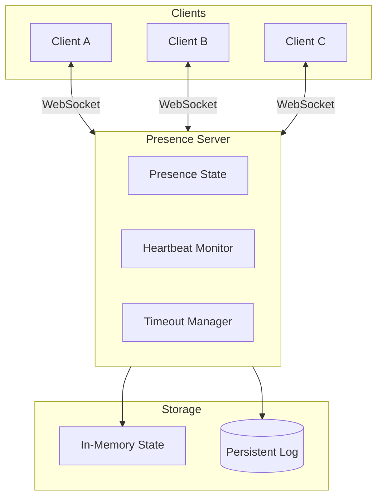

# Presence System Deep Dive

## Table of Contents

1. [Presence Fundamentals](#1-presence-fundamentals)
2. [Connection State Management](#2-connection-state-management)
3. [Heartbeat Mechanisms](#3-heartbeat-mechanisms)
4. [Timeout and Cleanup](#4-timeout-and-cleanup)
5. [Yjs Awareness Protocol](#5-yjs-awareness-protocol)
6. [Presence Patterns](#6-presence-patterns)
7. [Advanced Presence Features](#7-advanced-presence-features)

---

## 1. Presence Fundamentals

### 1.1 What is Presence?

**Presence** is the system that tracks:
- Who is currently connected
- Their current status (active, idle, away, offline)
- Their metadata (cursor position, current activity, device info)
- Their relationship to rooms/channels

```
┌─────────────────────────────────────────────────────────┐
│                  Presence System                         │
│                                                          │
│  ┌─────────────┐                                        │
│  │   Alice     │  status: "active"                      │
│  │  (online)   │  cursor: {x: 100, y: 200}              │
│  └─────────────┘  typing: true                          │
│                                                          │
│  ┌─────────────┐                                        │
│  │    Bob      │  status: "idle"                        │
│  │  (away)     │  cursor: {x: 50, y: 75}                │
│  └─────────────┘  typing: false                         │
│                                                          │
│  ┌─────────────┐                                        │
│  │  Charlie    │  status: "offline"                     │
│  │ (disconnected)│ lastSeen: 2026-03-27T10:30:00Z       │
│  └─────────────┘                                        │
│                                                          │
└─────────────────────────────────────────────────────────┘
```

### 1.2 Presence Use Cases

| Use Case | Presence Data | Update Frequency |
|----------|---------------|------------------|
| **Chat Applications** | Online status, typing indicator | Real-time |
| **Collaborative Editing** | Cursor position, selection | On change |
| **Multiplayer Games** | Player position, actions | 10-60 Hz |
| **Live Dashboards** | Viewer count, engagement | Periodic |
| **Video Conferencing** | Audio/video state, hand raise | On change |

### 1.3 Presence Architecture



---

## 2. Connection State Management

### 2.1 Connection State Structure

```typescript
interface UserState {
  // Identity
  userId: string;
  username: string;
  sessionId: string;

  // Presence status
  status: "connecting" | "active" | "idle" | "away" | "offline";
  lastActive: number;

  // Activity metadata
  cursor?: { x: number; y: number };
  selection?: { start: number; end: number };
  typing: boolean;
  currentRoom?: string;

  // Device info
  device: "desktop" | "mobile" | "tablet";
  userAgent?: string;

  // Custom fields
  color: string;
  avatar?: string;
}
```

### 2.2 Setting Connection State

```typescript
export class ChatServer extends Server {
  onConnect(connection: Connection, ctx: ConnectionContext) {
    // Extract user info from request
    const token = new URL(ctx.request.url).searchParams.get("token");
    const user = this.validateToken(token);

    // Initialize connection state
    connection.setState({
      userId: user.id,
      username: user.name,
      sessionId: crypto.randomUUID(),
      status: "active",
      lastActive: Date.now(),
      typing: false,
      device: this.detectDevice(ctx.request),
      color: this.getUserColor(user.id),
      userAgent: ctx.request.headers.get("User-Agent") || undefined
    });

    console.log(`User ${user.name} connected to room ${this.name}`);
  }
}
```

### 2.3 State Update Patterns

```typescript
// Pattern 1: Direct state replacement
connection.setState({
  userId: "123",
  status: "active",
  lastActive: Date.now()
});

// Pattern 2: State updater function
connection.setState((prev) => ({
  ...prev,
  lastActive: Date.now(),
  status: "active"
}));

// Pattern 3: Partial updates with spread
onMessage(connection, message) {
  const data = JSON.parse(message as string);

  if (data.type === "cursor_move") {
    connection.setState(prev => ({
      ...prev,
      cursor: data.cursor,
      lastActive: Date.now()
    }));
  }

  if (data.type === "typing_start") {
    connection.setState(prev => ({
      ...prev,
      typing: true,
      lastActive: Date.now()
    }));
  }

  if (data.type === "typing_stop") {
    connection.setState(prev => ({
      ...prev,
      typing: false
    }));
  }
}
```

### 2.4 State Size Limits

```typescript
// Connection state is stored in WebSocket attachments
// Cloudflare limit: 2KB per connection

// DO: Store minimal state
connection.setState({
  userId: "123",
  status: "active",
  cursor: { x: 100, y: 200 }
});

// DON'T: Store large objects
connection.setState({
  largeData: hugeArray,    // Will exceed limit!
  fullDocument: entireDoc  // Will exceed limit!
});

// Alternative: Store reference, fetch full data from storage
connection.setState({
  userId: "123",
  documentVersion: 42  // Reference, then fetch from SQL
});
```

### 2.5 State Persistence

```typescript
// State survives hibernation via WebSocket attachments
// But is lost when connection closes

// For persistent user data, use SQL storage
export class ChatServer extends Server {
  async onStart() {
    this.ctx.storage.sql.exec(`
      CREATE TABLE IF NOT EXISTS user_presence (
        user_id TEXT PRIMARY KEY,
        username TEXT,
        status TEXT,
        last_seen INTEGER,
        rooms_visited TEXT  -- JSON array
      )
    `);
  }

  onConnect(connection) {
    const state = connection.state as UserState;

    // Update persistent presence
    this.ctx.storage.sql.exec(
      `INSERT OR REPLACE INTO user_presence
       (user_id, username, status, last_seen)
       VALUES (?, ?, ?, ?)`,
      state.userId, state.username, "active", Date.now()
    );
  }

  onClose(connection) {
    const state = connection.state as UserState;

    // Mark as offline in persistent storage
    this.ctx.storage.sql.exec(
      `UPDATE user_presence SET status = ?, last_seen = ?
       WHERE user_id = ?`,
      "offline", Date.now(), state.userId
    );
  }
}
```

---

## 3. Heartbeat Mechanisms

### 3.1 Why Heartbeats?

Heartbeats solve:
- **Zombie connections**: TCP connections that appear open but are dead
- **Silent disconnects**: Clients that disappear without closing
- **Resource leaks**: Server resources held by dead connections

### 3.2 Server-Side Heartbeat

```typescript
export class ChatServer extends Server {
  private heartbeatTimeouts: Map<string, NodeJS.Timeout> = new Map();
  private readonly HEARTBEAT_INTERVAL = 30000;  // 30 seconds
  private readonly HEARTBEAT_TIMEOUT = 60000;   // 60 seconds

  onConnect(connection: Connection) {
    // Set initial timeout
    this.setHeartbeatTimeout(connection);
  }

  private setHeartbeatTimeout(connection: Connection) {
    const existing = this.heartbeatTimeouts.get(connection.id);
    if (existing) clearTimeout(existing);

    const timeout = setTimeout(() => {
      console.log(`Heartbeat timeout for ${connection.id}`);
      connection.close(4000, "Heartbeat timeout");
    }, this.HEARTBEAT_TIMEOUT);

    this.heartbeatTimeouts.set(connection.id, timeout);
  }

  onMessage(connection: Connection, message: WSMessage) {
    const data = JSON.parse(message as string);

    if (data.type === "heartbeat") {
      // Reset timeout on heartbeat
      this.setHeartbeatTimeout(connection);

      // Update lastActive in state
      connection.setState(prev => ({
        ...prev,
        lastActive: Date.now()
      }));

      // Respond with pong
      connection.send(JSON.stringify({ type: "pong", timestamp: Date.now() }));
    }
  }

  onClose(connection: Connection) {
    // Cleanup timeout
    const timeout = this.heartbeatTimeouts.get(connection.id);
    if (timeout) {
      clearTimeout(timeout);
      this.heartbeatTimeouts.delete(connection.id);
    }
  }
}
```

### 3.3 Client-Side Heartbeat

```typescript
// Client sends periodic heartbeats
class PresenceClient {
  private heartbeatInterval: ReturnType<typeof setInterval> | null = null;
  private readonly HEARTBEAT_INTERVAL = 25000;  // Slightly less than server timeout

  constructor(private socket: WebSocket) {}

  startHeartbeat() {
    this.heartbeatInterval = setInterval(() => {
      if (this.socket.readyState === WebSocket.OPEN) {
        this.socket.send(JSON.stringify({
          type: "heartbeat",
          timestamp: Date.now()
        }));
      }
    }, this.HEARTBEAT_INTERVAL);
  }

  stopHeartbeat() {
    if (this.heartbeatInterval) {
      clearInterval(this.heartbeatInterval);
      this.heartbeatInterval = null;
    }
  }

  cleanup() {
    this.stopHeartbeat();
    this.socket.close();
  }
}
```

### 3.4 Ping/Pong with WebSocket Protocol

```typescript
// Cloudflare Workers supports WebSocket ping/pong at protocol level
// This is more efficient than application-level heartbeats

export class ChatServer extends Server {
  onConnect(connection: Connection) {
    // Note: Direct ping/pong control is limited in Workers
    // Use application-level heartbeats instead
  }
}

// Client-side
socket.addEventListener("message", (event) => {
  if (event.data === "ping") {
    socket.send("pong");
  }
});
```

### 3.5 Adaptive Heartbeat

```typescript
// Adjust heartbeat frequency based on activity
export class ChatServer extends Server {
  private heartbeatIntervals: Map<string, number> = new Map();

  onConnect(connection: Connection) {
    this.heartbeatIntervals.set(connection.id, 30000);  // Start at 30s
  }

  onMessage(connection: Connection, message: WSMessage) {
    const state = connection.state as UserState;

    // Reduce heartbeat frequency for active users
    if (state.status === "active" || state.typing) {
      this.heartbeatIntervals.set(connection.id, 15000);  // 15s for active
    } else {
      this.heartbeatIntervals.set(connection.id, 60000);  // 60s for idle
    }
  }

  getHeartbeatInterval(connectionId: string): number {
    return this.heartbeatIntervals.get(connectionId) ?? 30000;
  }
}
```

---

## 4. Timeout and Cleanup

### 4.1 Connection Timeout States

```
┌─────────────────────────────────────────────────────────┐
│               Connection Timeout Flow                    │
│                                                          │
│  Connected ──> Active ──> Idle ──> Away ──> Timeout     │
│      │           │         │       │         │           │
│      │           │         │       │         │           │
│      └───────────┴─────────┴───────┴─────────┘           │
│                    Activity detected                      │
│                                                          │
│  Timing:                                                 │
│  - Active: Last activity < 30s ago                       │
│  - Idle: Last activity 30s - 5min ago                    │
│  - Away: Last activity 5min - 15min ago                  │
│  - Timeout: Last activity > 15min ago                    │
└─────────────────────────────────────────────────────────┘
```

### 4.2 Timeout Implementation

```typescript
interface ConnectionState {
  status: "active" | "idle" | "away" | "offline";
  lastActive: number;
}

export class ChatServer extends Server {
  private statusTimeouts: Map<string, NodeJS.Timeout[]> = new Map();

  onConnect(connection: Connection) {
    this.scheduleStatusTransitions(connection);
  }

  private scheduleStatusTransitions(connection: Connection) {
    // Clear existing timeouts
    const existing = this.statusTimeouts.get(connection.id);
    if (existing) existing.forEach(clearTimeout);

    const timeouts: NodeJS.Timeout[] = [];

    // Schedule idle transition (30 seconds)
    timeouts.push(setTimeout(() => {
      const state = connection.state as ConnectionState;
      if (state.status === "active") {
        connection.setState(prev => ({ ...prev, status: "idle" }));
        this.broadcastPresenceChange(connection, "idle");
      }
    }, 30000));

    // Schedule away transition (5 minutes)
    timeouts.push(setTimeout(() => {
      const state = connection.state as ConnectionState;
      if (state.status === "active" || state.status === "idle") {
        connection.setState(prev => ({ ...prev, status: "away" }));
        this.broadcastPresenceChange(connection, "away");
      }
    }, 5 * 60 * 1000));

    // Schedule timeout (15 minutes)
    timeouts.push(setTimeout(() => {
      const state = connection.state as ConnectionState;
      if (state.status !== "offline") {
        console.log(`Timing out connection ${connection.id}`);
        connection.close(4000, "Connection timeout");
      }
    }, 15 * 60 * 1000));

    this.statusTimeouts.set(connection.id, timeouts);
  }

  onMessage(connection: Connection, message: WSMessage) {
    // Reset all timeouts on activity
    connection.setState(prev => ({
      ...prev,
      status: "active",
      lastActive: Date.now()
    }));
    this.scheduleStatusTransitions(connection);
  }

  onClose(connection: Connection) {
    const timeouts = this.statusTimeouts.get(connection.id);
    if (timeouts) {
      timeouts.forEach(clearTimeout);
      this.statusTimeouts.delete(connection.id);
    }
  }
}
```

### 4.3 Cleanup on Disconnect

```typescript
export class ChatServer extends Server {
  async onClose(connection: Connection, code: number, reason: string) {
    const state = connection.state as UserState;

    // 1. Remove from connection tracking
    this.removeConnectionTracking(connection.id);

    // 2. Update persistent presence
    this.ctx.storage.sql.exec(
      `UPDATE user_presence SET status = 'offline', last_seen = ?
       WHERE user_id = ?`,
      Date.now(), state.userId
    );

    // 3. Clean up ephemeral state (cursor, typing)
    this.cleanupEphemeralState(state.userId);

    // 4. Notify other users
    this.broadcast(JSON.stringify({
      type: "user_left",
      userId: state.userId,
      username: state.username,
      reason: reason || "disconnected"
    }));

    // 5. Set alarm for room cleanup if empty
    if (this.getConnections().length === 0) {
      this.ctx.storage.setAlarm(Date.now() + 5 * 60 * 1000);
    }
  }

  private removeConnectionTracking(connectionId: string) {
    // Clean up any internal tracking structures
    // ...
  }

  private cleanupEphemeralState(userId: string) {
    // Clear cursor, typing indicators, etc.
    // These should be rebroadcast as "cleared" to other clients
    this.broadcast(JSON.stringify({
      type: "cursor_cleared",
      userId
    }));
    this.broadcast(JSON.stringify({
      type: "typing_stopped",
      userId
    }));
  }

  async onAlarm() {
    // Cleanup room after period of inactivity
    if (this.getConnections().length === 0) {
      // Save snapshot
      const snapshot = this.createSnapshot();
      await this.ctx.storage.put("snapshot", snapshot);

      console.log(`Room ${this.name} cleaned up`);
    }
  }
}
```

### 4.4 Graceful Shutdown

```typescript
export class ChatServer extends Server {
  async shutdown(message?: string) {
    // Notify all clients of impending shutdown
    this.broadcast(JSON.stringify({
      type: "server_shutdown",
      message: message || "Server is shutting down",
      reconnectAfter: 5000  // Suggest reconnection delay
    }));

    // Give clients time to save state
    await new Promise(resolve => setTimeout(resolve, 2000));

    // Close all connections gracefully
    for (const connection of this.getConnections()) {
      connection.close(1001, message || "Server shutdown");
    }

    // Save final state
    await this.saveState();
  }
}
```

---

## 5. Yjs Awareness Protocol

### 5.1 Awareness Overview

Yjs includes a built-in awareness protocol for ephemeral state:
- Cursor positions
- Selection ranges
- User metadata (name, color)
- Typing indicators

### 5.2 Setting Awareness State

```typescript
// Client-side
import * as awarenessProtocol from "y-protocols/awareness";

const awareness = new awarenessProtocol.Awareness(ydoc);

// Set local state
awareness.setLocalState({
  user: {
    id: "user-123",
    name: "Alice",
    color: "#ff0000"
  },
  cursor: { line: 5, column: 10 },
  selection: { start: 100, end: 150 }
});

// Update specific fields
awareness.setLocalStateField("cursor", { line: 6, column: 0 });
awareness.setLocalStateField("typing", true);

// Get local state
const localState = awareness.getLocalState();

// Get all states
const states = awareness.getStates();
for (const [clientId, state] of states.entries()) {
  console.log(`Client ${clientId}:`, state);
}
```

### 5.3 Awareness Events

```typescript
// Observe awareness changes
awareness.on("change", ({ added, updated, removed }) => {
  // New clients
  for (const clientId of added) {
    const state = awareness.getState(clientId);
    console.log(`Client ${clientId} connected:`, state);
    this.addRemoteCursor(clientId, state.cursor);
  }

  // Updated states
  for (const clientId of updated) {
    const state = awareness.getState(clientId);
    console.log(`Client ${clientId} updated:`, state);
    this.updateRemoteCursor(clientId, state.cursor);
  }

  // Removed clients
  for (const clientId of removed) {
    console.log(`Client ${clientId} disconnected`);
    this.removeRemoteCursor(clientId);
  }
});
```

### 5.4 Server-Side Awareness Handling

```typescript
// y-partyserver handles awareness automatically
// The awareness states are broadcast to all clients

export class DocServer extends YServer {
  onClose(connection: Connection) {
    // Awareness states are automatically cleaned up
    // The protocol removes the client's awareness on disconnect

    // You can access controlled awareness IDs via state
    const state = connection.state as YServerConnectionState | null;
    const controlledIds = state?.__ypsAwarenessIds ?? [];

    if (controlledIds.length > 0) {
      // Manually remove if needed
      awarenessProtocol.removeAwarenessStates(
        this.document.awareness,
        controlledIds,
        null  // null = internal change, broadcast to others
      );
    }
  }
}
```

### 5.5 Custom Awareness Data

```typescript
// Extended awareness for specific use cases
interface CustomAwarenessState {
  user: {
    id: string;
    name: string;
    avatar?: string;
  };
  cursor: {
    line: number;
    column: number;
  };
  selection?: {
    start: number;
    end: number;
  };
  typing: boolean;
  viewport?: {
    startLine: number;
    endLine: number;
  };
  focus: boolean;
}

// Set extended state
awareness.setLocalState<CustomAwarenessState>({
  user: { id: "123", name: "Alice" },
  cursor: { line: 10, column: 5 },
  typing: false,
  viewport: { startLine: 1, endLine: 50 },
  focus: document.hasFocus()
});

// Track focus
window.addEventListener("blur", () => {
  awareness.setLocalStateField("focus", false);
});

window.addEventListener("focus", () => {
  awareness.setLocalStateField("focus", true);
});
```

---

## 6. Presence Patterns

### 6.1 User List with Status

```typescript
export class ChatServer extends Server {
  private users: Map<string, UserState> = new Map();

  onConnect(connection: Connection) {
    const state = connection.state as UserState;
    this.users.set(state.userId, state);

    this.broadcast(JSON.stringify({
      type: "user_joined",
      user: this.toPublicUser(state)
    }));

    this.broadcastUserList();
  }

  onClose(connection: Connection) {
    const state = connection.state as UserState;
    this.users.delete(state.userId);

    this.broadcast(JSON.stringify({
      type: "user_left",
      userId: state.userId
    }));

    this.broadcastUserList();
  }

  private broadcastUserList() {
    const users = Array.from(this.users.values()).map(u => this.toPublicUser(u));
    this.broadcast(JSON.stringify({
      type: "user_list",
      users
    }));
  }

  private toPublicUser(state: UserState) {
    return {
      id: state.userId,
      name: state.username,
      status: state.status,
      color: state.color,
      avatar: state.avatar
    };
  }
}
```

### 6.2 Typing Indicators

```typescript
export class ChatServer extends Server {
  private typingUsers: Set<string> = new Set();
  private typingTimeouts: Map<string, NodeJS.Timeout> = new Map();

  onMessage(connection: Connection, message: WSMessage) {
    const data = JSON.parse(message as string);
    const state = connection.state as UserState;

    if (data.type === "typing") {
      // Add to typing set
      this.typingUsers.add(state.userId);

      // Broadcast typing indicator
      this.broadcast(JSON.stringify({
        type: "typing_indicator",
        userId: state.userId,
        username: state.username,
        isTyping: true
      }), [connection.id]);  // Exclude sender

      // Clear existing timeout
      const existing = this.typingTimeouts.get(state.userId);
      if (existing) clearTimeout(existing);

      // Auto-clear after 3 seconds
      const timeout = setTimeout(() => {
        this.clearTyping(state.userId);
      }, 3000);
      this.typingTimeouts.set(state.userId, timeout);
    }
  }

  onClose(connection: Connection) {
    const state = connection.state as UserState;
    this.clearTyping(state.userId);
  }

  private clearTyping(userId: string) {
    if (this.typingUsers.has(userId)) {
      this.typingUsers.delete(userId);

      const timeout = this.typingTimeouts.get(userId);
      if (timeout) {
        clearTimeout(timeout);
        this.typingTimeouts.delete(userId);
      }

      // Broadcast typing stopped
      this.broadcast(JSON.stringify({
        type: "typing_indicator",
        userId,
        isTyping: false
      }));
    }
  }
}
```

### 6.3 Cursor Tracking

```typescript
export class CollaborativeEditor extends YServer {
  onMessage(connection: Connection, message: WSMessage) {
    const data = JSON.parse(message as string);

    if (data.type === "cursor_update") {
      // Update awareness with new cursor position
      const awareness = this.document.awareness;
      const clientId = this.getClientId(connection);

      const currentState = awareness.getLocalState();
      awareness.setLocalState({
        ...currentState,
        cursor: data.cursor
      });

      // Awareness update is automatically broadcast
    }
  }
}

// Client-side: broadcast cursor on movement
editor.on("cursorActivity", () => {
  const cursor = editor.getCursor();
  provider.awareness.setLocalStateField("cursor", {
    line: cursor.line,
    ch: cursor.ch
  });
});
```

### 6.4 Room Presence

```typescript
export class MultiRoomServer extends Server {
  private roomPresence: Map<string, Set<string>> = new Map();

  onMessage(connection: Connection, message: WSMessage) {
    const data = JSON.parse(message as string);
    const state = connection.state as UserState;

    if (data.type === "join_room") {
      const roomId = data.roomId;

      // Leave previous room
      if (state.currentRoom) {
        this.leaveRoom(connection, state.currentRoom);
      }

      // Join new room
      this.joinRoom(connection, roomId);

      // Update state
      connection.setState(prev => ({
        ...prev,
        currentRoom: roomId
      }));
    }
  }

  private joinRoom(connection: Connection, roomId: string) {
    if (!this.roomPresence.has(roomId)) {
      this.roomPresence.set(roomId, new Set());
    }
    this.roomPresence.get(roomId)!.add(connection.id);

    // Notify room members
    this.broadcastToRoom(roomId, JSON.stringify({
      type: "user_joined_room",
      userId: (connection.state as UserState).userId,
      username: (connection.state as UserState).username
    }));
  }

  private leaveRoom(connection: Connection, roomId: string) {
    const room = this.roomPresence.get(roomId);
    if (room) {
      room.delete(connection.id);

      this.broadcastToRoom(roomId, JSON.stringify({
        type: "user_left_room",
        userId: (connection.state as UserState).userId
      }));

      if (room.size === 0) {
        this.roomPresence.delete(roomId);
      }
    }
  }

  private broadcastToRoom(roomId: string, message: string) {
    const roomMembers = this.roomPresence.get(roomId);
    if (!roomMembers) return;

    for (const connectionId of roomMembers) {
      const connection = this.getConnection(connectionId);
      if (connection) {
        connection.send(message);
      }
    }
  }
}
```

---

## 7. Advanced Presence Features

### 7.1 Presence Broadcast Optimization

```typescript
// Throttle presence updates to reduce bandwidth
export class OptimizedPresenceServer extends Server {
  private pendingUpdates: Map<string, UserState> = new Map();
  private broadcastScheduled = false;
  private readonly BROADCAST_INTERVAL = 100;  // 100ms

  onMessage(connection: Connection, message: WSMessage) {
    const data = JSON.parse(message as string);

    if (data.type === "cursor_move") {
      // Queue update instead of immediate broadcast
      this.pendingUpdates.set(connection.id, connection.state as UserState);

      if (!this.broadcastScheduled) {
        this.broadcastScheduled = true;
        setTimeout(() => this.flushPresenceUpdates(), this.BROADCAST_INTERVAL);
      }
    }
  }

  private flushPresenceUpdates() {
    const updates = Array.from(this.pendingUpdates.values()).map(state => ({
      userId: state.userId,
      cursor: state.cursor,
      typing: state.typing
    }));

    this.broadcast(JSON.stringify({
      type: "presence_batch",
      updates
    }));

    this.pendingUpdates.clear();
    this.broadcastScheduled = false;
  }
}
```

### 7.2 Presence with Backpressure

```typescript
// Handle high-frequency updates without overwhelming clients
export class BackpressureServer extends Server {
  private readonly MAX_PENDING = 100;
  private pendingPerClient: Map<string, Queue<PresenceUpdate>> = new Map();

  onMessage(connection: Connection, message: WSMessage) {
    const data = JSON.parse(message as string);

    if (data.type === "frequent_update") {
      const queue = this.pendingPerClient.get(connection.id) || new Queue();

      if (queue.size() >= this.MAX_PENDING) {
        // Drop oldest update if queue is full
        queue.dequeue();
      }

      queue.enqueue({
        userId: (connection.state as UserState).userId,
        data: data.payload,
        timestamp: Date.now()
      });

      this.pendingPerClient.set(connection.id, queue);
      this.processQueues();
    }
  }

  private async processQueues() {
    for (const [clientId, queue] of this.pendingPerClient.entries()) {
      while (queue.size() > 0) {
        const update = queue.dequeue();

        // Check if update is still relevant (not stale)
        if (Date.now() - update.timestamp > 1000) {
          continue;  // Skip stale updates
        }

        this.broadcast(JSON.stringify({
          type: "update",
          update
        }));
      }
    }
  }
}
```

### 7.3 Presence Queries

```typescript
export class QueryablePresenceServer extends Server {
  onConnect(connection: Connection) {
    // Tag connection for filtering
    // Tags are used with getConnections(tag)
  }

  getConnectionTags(connection: Connection): string[] {
    const state = connection.state as UserState;
    return [
      connection.id,
      `user:${state.userId}`,
      `status:${state.status}`,
      `room:${state.currentRoom || "default"}`
    ];
  }

  // Query methods
  getActiveUsers(): UserState[] {
    return Array.from(this.getConnections("status:active"))
      .map(c => c.state as UserState);
  }

  getUsersInRoom(roomId: string): UserState[] {
    return Array.from(this.getConnections(`room:${roomId}`))
      .map(c => c.state as UserState);
  }

  getUserConnections(userId: string): Connection[] {
    return Array.from(this.getConnections(`user:${userId}`));
  }

  // HTTP endpoint for presence queries
  async onRequest(request: Request): Promise<Response> {
    const url = new URL(request.url);

    if (url.pathname === "/api/presence" && request.method === "GET") {
      const roomId = url.searchParams.get("room");

      if (roomId) {
        return Response.json({
          users: this.getUsersInRoom(roomId)
        });
      }

      return Response.json({
        users: this.getActiveUsers()
      });
    }

    return new Response("Not Found", { status: 404 });
  }
}
```

### 7.4 Presence Persistence and History

```typescript
export class PersistentPresenceServer extends Server {
  async onStart() {
    this.ctx.storage.sql.exec(`
      CREATE TABLE IF NOT EXISTS presence_history (
        id INTEGER PRIMARY KEY AUTOINCREMENT,
        user_id TEXT,
        event_type TEXT,
        metadata TEXT,  -- JSON
        timestamp INTEGER
      )
    `);

    this.ctx.storage.sql.exec(`
      CREATE INDEX IF NOT EXISTS idx_presence_user
      ON presence_history(user_id, timestamp)
    `);
  }

  logPresenceEvent(userId: string, eventType: string, metadata: object) {
    this.ctx.storage.sql.exec(
      `INSERT INTO presence_history (user_id, event_type, metadata, timestamp)
       VALUES (?, ?, ?, ?)`,
      userId, eventType, JSON.stringify(metadata), Date.now()
    );
  }

  onConnect(connection: Connection) {
    const state = connection.state as UserState;
    this.logPresenceEvent(state.userId, "connect", {
      device: state.device,
      room: state.currentRoom
    });
  }

  onClose(connection: Connection) {
    const state = connection.state as UserState;
    this.logPresenceEvent(state.userId, "disconnect", {
      sessionDuration: Date.now() - state.lastActive
    });
  }

  // Get user's presence history
  getPresenceHistory(userId: string, limit: number = 100) {
    return this.ctx.storage.sql.exec(
      `SELECT * FROM presence_history
       WHERE user_id = ?
       ORDER BY timestamp DESC
       LIMIT ?`,
      userId, limit
    ).raw();
  }
}
```

---

## Document History

| Date | Change |
|------|--------|
| 2026-03-27 | Initial presence system deep dive created |

---

*This exploration is a living document. Revisit sections as concepts become clearer through implementation.*
