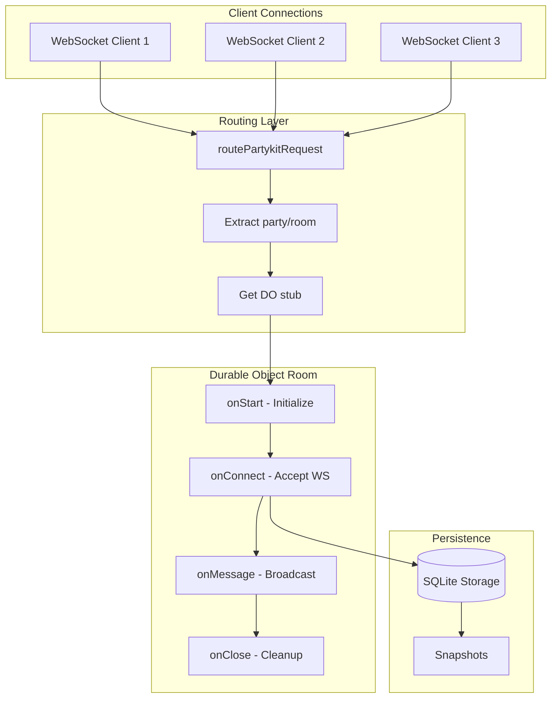

# PartyKit: Complete Exploration

## Overview

**PartyKit** (and its successor PartyServer) is a TypeScript framework for building real-time multiplayer applications on Cloudflare Workers. The core innovation is using Durable Objects as "rooms" - stateful, persistent servers that handle WebSocket connections and synchronize state between clients.

### Why This Exploration Exists

This is a **complete textbook** that takes you from zero multiplayer backend knowledge to understanding how to build and deploy production real-time applications with Rust/valtron replication.

### Key Characteristics

| Aspect | PartyKit/PartyServer |
|--------|---------------------|
| **Core Innovation** | Durable Objects as multiplayer rooms |
| **Dependencies** | Cloudflare Workers, Durable Objects |
| **Lines of Code** | ~2,000 (core partyserver) |
| **Purpose** | Real-time multiplayer orchestration |
| **Architecture** | Room-based WebSocket servers with lifecycle hooks |
| **Runtime** | Cloudflare Workers (edge) |
| **Rust Equivalent** | valtron executor + Durable Objects for ewe_platform |

---

## Complete Table of Contents

This exploration consists of multiple deep-dive documents. Read them in order for complete understanding:

### Part 1: Foundations
1. **[Zero to Multiplayer Engineer](00-zero-to-multiplayer-engineer.md)** - Start here if new to multiplayer
   - What are multiplayer backends?
   - WebSocket fundamentals
   - Room-based architecture
   - State synchronization patterns
   - Presence and heartbeat systems

### Part 2: Core Implementation
2. **[Room Management Deep Dive](01-room-management-deep-dive.md)**
   - Durable Objects as rooms
   - Party lifecycle (onStart, onConnect, onClose)
   - Connection management (hibernation vs in-memory)
   - Routing with routePartykitRequest
   - Naming and instance management

3. **[State Sync Deep Dive](02-state-sync-deep-dive.md)**
   - CRDT fundamentals (Yjs integration)
   - Operational transforms
   - Sync protocol (sync step 1/2, updates)
   - Awareness protocol for cursor presence
   - Snapshot and recovery

4. **[Presence System Deep Dive](03-presence-system-deep-dive.md)**
   - User presence tracking
   - Heartbeat mechanisms
   - Connection timeouts
   - Awareness states in Yjs
   - Connection tags and filtering

5. **[Storage Backend Deep Dive](04-storage-backend-deep-dive.md)**
   - Durable Objects storage API
   - SQL storage in Workers
   - Snapshots and persistence
   - Recovery from hibernation
   - onLoad/onSave patterns

### Part 3: Rust Replication
6. **[Rust Revision](rust-revision.md)**
   - Complete Rust translation
   - Durable Objects in Rust (workers-rs)
   - WebSocket handling without async
   - Valtron executor patterns
   - Code examples

### Part 4: Production
7. **[Production-Grade Implementation](production-grade.md)**
   - Performance optimizations
   - Memory management
   - Scaling with location hints
   - Monitoring and observability
   - Rate limiting and security

8. **[Valtron Integration](05-valtron-integration.md)**
   - Lambda deployment for multiplayer
   - HTTP API compatibility
   - No async/tokio patterns
   - Request/response handling
   - Production deployment

---

## Quick Reference: PartyServer Architecture

### High-Level Flow



### Component Summary

| Component | Lines | Purpose | Deep Dive |
|-----------|-------|---------|-----------|
| Server Core | 800 | Durable Object wrapper, lifecycle hooks | [Room Management](01-room-management-deep-dive.md) |
| Connection Mgr | 400 | Hibernation, in-memory tracking | [Room Management](01-room-management-deep-dive.md) |
| PartySocket | 300 | Reconnecting WebSocket client | [Zero to Multiplayer](00-zero-to-multiplayer-engineer.md) |
| Y-PartyServer | 550 | Yjs CRDT integration | [State Sync](02-state-sync-deep-dive.md) |
| PartySub | 200 | Pub/sub at scale | [Production-Grade](production-grade.md) |
| PartyWhen | 150 | Task scheduling with alarms | [Storage Backend](04-storage-backend-deep-dive.md) |
| PartySync | 150 | State synchronization | [State Sync](02-state-sync-deep-dive.md) |

---

## File Structure

```
partykit/
├── packages/
│   ├── partyserver/
│   │   ├── src/
│   │   │   ├── index.ts              # Server class, routePartykitRequest
│   │   │   ├── connection.ts         # Connection manager, hibernation
│   │   │   ├── types.ts              # Connection type definitions
│   │   │   └── tests/
│   │   └── README.md
│   │
│   ├── partysocket/
│   │   ├── src/
│   │   │   ├── ws.ts                 # ReconnectingWebSocket
│   │   │   ├── index.ts              # PartySocket class
│   │   │   ├── react.ts              # React hooks
│   │   │   └── tests/
│   │   └── README.md
│   │
│   ├── y-partyserver/
│   │   ├── src/
│   │   │   ├── server/
│   │   │   │   └── index.ts          # YServer, withYjs mixin
│   │   │   ├── provider/
│   │   │   │   └── index.ts          # Yjs provider for clients
│   │   │   └── tests/
│   │   └── README.md
│   │
│   ├── partysub/
│   │   ├── src/
│   │   │   ├── server/
│   │   │   │   ├── index.ts          # createPubSubServer
│   │   │   │   └── gen-ids.ts        # Location-based ID generation
│   │   │   └── client/
│   │   │       └── index.ts
│   │   └── README.md
│   │
│   ├── partysync/
│   │   ├── src/
│   │   │   ├── server/index.ts       # SyncServer class
│   │   │   ├── client/index.ts       # useSync hook
│   │   │   └── types.ts
│   │   └── README.md
│   │
│   ├── partywhen/
│   │   ├── src/
│   │   │   └── index.ts              # Scheduler with alarms
│   │   └── README.md
│   │
│   └── partytracks/                  # WebRTC video/audio
│       ├── src/
│       │   ├── client/
│       │   └── server/
│       └── README.md
│
├── fixtures/
│   ├── chat/                         # Basic chat example
│   ├── tldraw/                       # Collaborative drawing
│   ├── lexical-yjs/                  # Collaborative text editor
│   ├── tiptap-yjs/                   # Rich text editor
│   ├── video-echo/                   # WebRTC video
│   └── ...
│
├── docs/guides/
│   ├── multiplayer.md
│   ├── presence.md
│   ├── storage.md
│   └── ...
│
├── exploration.md                    # This file (index)
├── 00-zero-to-multiplayer-engineer.md    # START HERE: Multiplayer foundations
├── 01-room-management-deep-dive.md
├── 02-state-sync-deep-dive.md
├── 03-presence-system-deep-dive.md
├── 04-storage-backend-deep-dive.md
├── rust-revision.md                  # Rust translation
├── production-grade.md               # Production considerations
└── 05-valtron-integration.md         # Lambda deployment
```

---

## How to Use This Exploration

### For Complete Beginners (Zero Multiplayer Experience)

1. Start with **[00-zero-to-multiplayer-engineer.md](00-zero-to-multiplayer-engineer.md)**
2. Read each section carefully, work through examples
3. Continue through all deep dives in order
4. Implement along with the explanations
5. Finish with production-grade and valtron integration

**Time estimate:** 25-50 hours for complete understanding

### For Experienced TypeScript/Cloudflare Developers

1. Skim [00-zero-to-multiplayer-engineer.md](00-zero-to-multiplayer-engineer.md) for context
2. Deep dive into areas of interest (rooms, state sync, presence)
3. Review [rust-revision.md](rust-revision.md) for Rust translation patterns
4. Check [production-grade.md](production-grade.md) for deployment considerations

### For Multiplayer Practitioners

1. Review [partyserver core source](packages/partyserver/src/) directly
2. Use deep dives as reference for specific components
3. Compare with other frameworks (Liveblocks, Socket.IO, etc.)
4. Extract insights for educational content

---

## Running PartyServer

```bash
# Navigate to partykit directory
cd /path/to/partykit

# Install dependencies
npm install

# Run a fixture example
cd fixtures/chat
npm run dev

# In another terminal, connect with a client
# (browser at localhost:5173 or custom client)
```

### Example Server

```typescript
// server.ts
import { routePartykitRequest, Server } from "partyserver";

export class MyServer extends Server {
  onConnect(connection) {
    console.log("Connected", connection.id, "to server", this.name);
    this.broadcast(`User ${connection.id} joined`, [connection.id]);
  }

  onMessage(connection, message) {
    console.log("Message from", connection.id, ":", message);
    // Broadcast to all except sender
    this.broadcast(message, [connection.id]);
  }
}

export default {
  async fetch(request: Request, env: Env): Promise<Response> {
    return (
      (await routePartykitRequest(request, env)) ||
      new Response("Not Found", { status: 404 })
    );
  }
} satisfies ExportedHandler<Env>;
```

### wrangler.jsonc Configuration

```jsonc
{
  "name": "my-partyserver-app",
  "main": "server.ts",
  "durable_objects": {
    "bindings": [
      {
        "name": "MyServer",
        "class_name": "MyServer"
      }
    ]
  },
  "migrations": [
    {
      "tag": "v1",
      "new_sqlite_classes": ["MyServer"]
    }
  ]
}
```

### Example Client

```typescript
// client.ts
import PartySocket from "partysocket";

const socket = new PartySocket({
  host: "localhost:8787",
  party: "my-server",
  room: "my-room",
  id: "user-123"
});

socket.addEventListener("message", (event) => {
  console.log("Received:", event.data);
});

socket.send("Hello, room!");
```

---

## Key Insights

### 1. Durable Objects as Rooms

The core innovation is using Durable Objects as stateful "rooms":

```typescript
// Each room is a single Durable Object instance
// All clients connecting to the same room share state
const room = getServerByName(MyServerNamespace, "room-name");

// Inside the DO:
export class MyServer extends Server {
  // this.ctx.storage.sql - SQLite database
  // this.getConnections() - all connected clients
  // this.broadcast() - send to all clients
}
```

### 2. Hibernation for Scale

PartyServer supports Durable Object hibernation:

```typescript
export class MyServer extends Server {
  static options = { hibernate: true };

  // With hibernation:
  // - WebSockets persist without keeping DO active
  // - DO wakes on message/close events
  // - Connection state stored in WebSocket attachments
}
```

### 3. Connection Tags for Filtering

```typescript
export class MyServer extends Server {
  getConnectionTags(connection, context): string[] {
    return [`user:${connection.id}`, "verified"];
  }

  broadcastToVerified() {
    // Filter connections by tag
    for (const conn of this.getConnections("verified")) {
      conn.send("Verified only message");
    }
  }
}
```

### 4. Yjs for CRDT Sync

```typescript
import { YServer } from "y-partyserver";

export class DocServer extends YServer {
  async onLoad() {
    // Load Yjs document from external storage
    const update = await fetchExternal();
    Y.applyUpdate(this.document, update);
  }

  async onSave() {
    // Persist document state
    await saveExternal(Y.encodeStateAsUpdate(this.document));
  }
}
```

### 5. Valtron for Rust Replication

The Rust equivalent uses TaskIterator instead of async/await:

```rust
// TypeScript async
async fn on_message(&self, conn: Connection, msg: String) {
    self.broadcast(&msg, &[conn.id]).await;
}

// Rust valtron
struct BroadcastTask {
    message: String,
    exclude: Vec<String>,
}

impl TaskIterator for BroadcastTask {
    type Ready = Result<(), Error>;
    type Pending = ();
    type Spawner = NoSpawner;

    fn next(&mut self) -> Option<TaskStatus<Self::Ready, Self::Pending, Self::Spawner>> {
        // Broadcast logic without async
        Some(TaskStatus::Ready(Ok(())))
    }
}
```

---

## From PartyKit to Real Multiplayer Systems

| Aspect | PartyKit/PartyServer | Production Multiplayer Systems |
|--------|---------------------|-------------------------------|
| Rooms | Durable Objects | Redis rooms, custom servers |
| WebSockets | Native WS API | Socket.IO, ws, custom |
| State Sync | Yjs CRDTs | Custom CRDTs, OT, delta sync |
| Presence | Connection tags | Redis presence, heartbeat |
| Storage | DO SQLite | PostgreSQL, Redis, S3 |
| Scale | Auto-scaled DOs | Horizontal scaling, sharding |
| Persistence | onSave/onLoad | Event sourcing, snapshots |

**Key takeaway:** The core patterns (room-based routing, lifecycle hooks, broadcast messaging) scale to production with infrastructure changes, not algorithm changes.

---

## Your Path Forward

### To Build Multiplayer Skills

1. **Implement a basic chat server** (extend Server with onMessage)
2. **Add presence tracking** (use getConnectionTags, heartbeat)
3. **Integrate Yjs** (use YServer for CRDT sync)
4. **Add persistence** (implement onLoad/onSave)
5. **Translate to Rust** (workers-rs + valtron)
6. **Study the papers** (CRDTs, OT, consensus)

### Recommended Resources

- [Cloudflare Durable Objects Docs](https://developers.cloudflare.com/durable-objects/)
- [Yjs Documentation](https://docs.yjs.dev/)
- [Valtron README](/home/darkvoid/Boxxed/@dev/ewe_platform/backends/foundation_core/src/valtron/README.md)
- [workers-rs Documentation](https://github.com/cloudflare/workers-rs)

---

## Document History

| Date | Change |
|------|--------|
| 2026-03-27 | Initial partykit exploration created |
| 2026-03-27 | Deep dives 00-05 outlined |
| 2026-03-27 | Rust revision and production-grade planned |

---

*This exploration is a living document. Revisit sections as concepts become clearer through implementation.*
