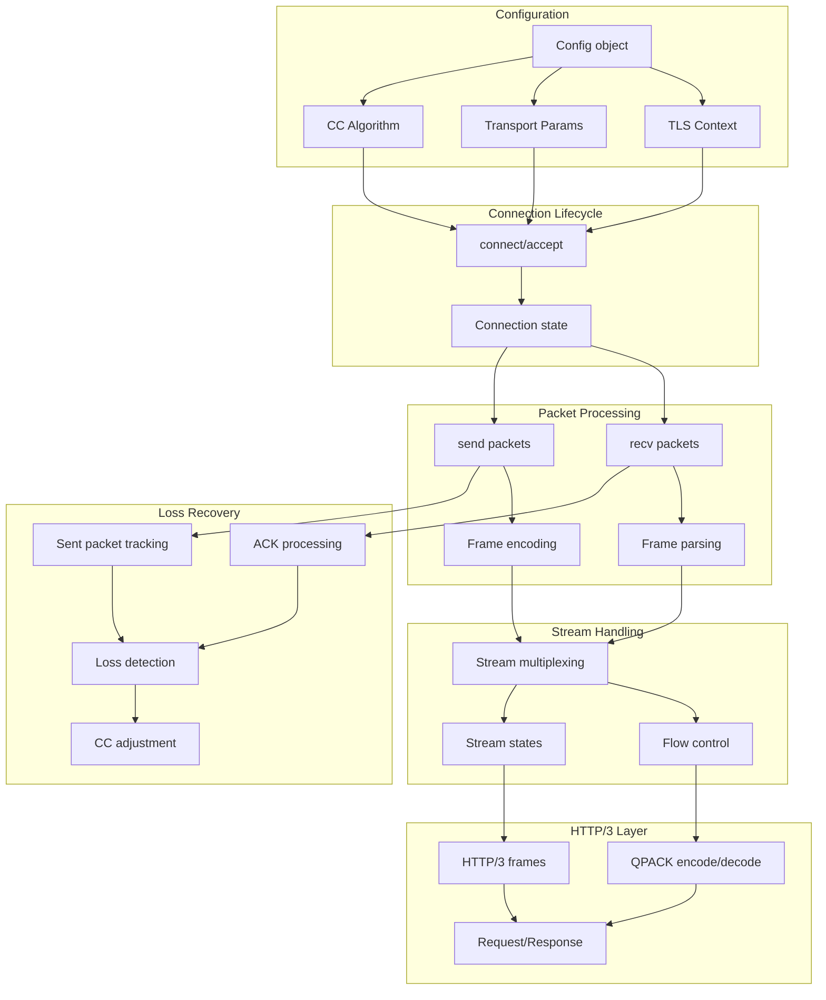

# quiche: Complete Exploration

## Overview

**quiche** is Cloudflare's production-grade implementation of the QUIC transport protocol and HTTP/3 as specified by the IETF. It provides a low-level API for processing QUIC packets and handling connection state, with the application responsible for providing I/O (sockets) and event loop with timers.

### Why This Exploration Exists

This is a **complete textbook** that takes you from zero QUIC knowledge to understanding how to build and deploy production QUIC/HTTP3 systems with Rust. It covers the protocol from first principles, deep implementation details, and replication patterns for ewe_platform.

### Key Characteristics

| Aspect | quiche |
|--------|--------|
| **Core Innovation** | Zero-copy QUIC with pluggable I/O model |
| **Dependencies** | BoringSSL (TLS), libc, slab, smallvec, intrusive-collections |
| **Lines of Code** | ~350k (core library), ~50k (HTTP/3), ~85k (recovery/CC) |
| **Purpose** | QUIC transport + HTTP/3 for Cloudflare edge network |
| **Architecture** | Connection-based state machine, event-driven I/O |
| **Runtime** | Bring-your-own I/O (no async runtime required) |
| **Rust Equivalent** | Native Rust - replicate patterns for ewe_platform |

---

## Complete Table of Contents

This exploration consists of multiple deep-dive documents. Read them in order for complete understanding:

### Part 1: Foundations
1. **[Zero to QUIC Engineer](00-zero-to-quic-engineer.md)** - Start here if new to QUIC
   - TCP limitations and head-of-line blocking
   - TLS handshake overhead
   - QUIC design principles
   - HTTP/3 motivation
   - Protocol comparison

### Part 2: Core Implementation
2. **[QUIC Protocol Deep Dive](01-quic-protocol-deep-dive.md)**
   - Connection IDs and migration
   - Stream multiplexing
   - Frame types and encoding
   - Packet number spaces
   - Flow control

3. **[HTTP/3 Implementation Deep Dive](02-http3-implementation-deep-dive.md)**
   - HTTP/3 over QUIC mapping
   - QPACK compression
   - Stream types and states
   - Request/response handling
   - Priorities (RFC 9218)

4. **[TLS Integration Deep Dive](03-tls-integration-deep-dive.md)**
   - TLS 1.3 handshake
   - 0-RTT and early data
   - Key schedule and derivation
   - Key rotation
   - BoringSSL integration

5. **[Congestion Control Deep Dive](04-congestion-control-deep-dive.md)**
   - Loss detection (RFC 9002)
   - Cubic congestion control
   - BBR2 (gcongestion)
   - Pacing and release timing
   - HyStart++ slow-start exit

### Part 3: Rust Implementation
6. **[Rust Revision](rust-revision.md)**
   - Zero-copy buffer design
   - Intrusive collections for performance
   - enum_dispatch for CC polymorphism
   - BufFactory abstraction
   - FFI boundaries

### Part 4: Production
7. **[Production-Grade Implementation](production-grade.md)**
   - Performance optimizations
   - Memory management
   - qlog integration
   - Monitoring and observability
   - Deployment patterns

8. **[Valtron Integration](05-valtron-integration.md)**
   - Lambda deployment for QUIC proxy
   - No async/tokio patterns
   - TaskIterator for QUIC events
   - UDP socket handling
   - Connection state serialization

---

## Quick Reference: quiche Architecture

### High-Level Flow



### Component Summary

| Component | Lines | Purpose | Deep Dive |
|-----------|-------|---------|-----------|
| Connection (lib.rs) | 9k | Core connection state, recv/send | [QUIC Protocol](01-quic-protocol-deep-dive.md) |
| HTTP/3 (h3/mod.rs) | 7.5k | HTTP/3 connection, QPACK | [HTTP/3 Deep Dive](02-http3-implementation-deep-dive.md) |
| Recovery (recovery/mod.rs) | 86k | Loss detection, CC dispatch | [Congestion Control](04-congestion-control-deep-dive.md) |
| Congestion (recovery/congestion/) | 35k | Cubic, Reno, HyStart++ | [Congestion Control](04-congestion-control-deep-dive.md) |
| GCongestion (recovery/gcongestion/) | 40k | BBR2 implementation | [Congestion Control](04-congestion-control-deep-dive.md) |
| Streams (stream/) | 37k | Stream state, flow control | [QUIC Protocol](01-quic-protocol-deep-dive.md) |
| TLS (tls/) | 35k | BoringSSL/OpenSSL wrapper | [TLS Integration](03-tls-integration-deep-dive.md) |
| Crypto (crypto/) | 20k | Packet protection, keys | [TLS Integration](03-tls-integration-deep-dive.md) |
| Packet (packet.rs) | 87k | Packet parsing/encoding | [QUIC Protocol](01-quic-protocol-deep-dive.md) |
| Frame (frame.rs) | 64k | Frame encode/decode | [QUIC Protocol](01-quic-protocol-deep-dive.md) |

---

## File Structure

```
quiche/
├── quiche/                         # Core library
│   ├── src/
│   │   ├── lib.rs                  # Connection struct, Config, connect()/accept()
│   │   ├── error.rs                # Error types, WireErrorCode
│   │   ├── packet.rs               # Packet parsing, ConnectionId, Header
│   │   ├── frame.rs                # QUIC frame encode/decode
│   │   ├── cid.rs                  # Connection ID management
│   │   ├── path.rs                 # Multi-path state, migration
│   │   ├── pmtud.rs                # Path MTU discovery
│   │   ├── transport_params.rs     # Transport parameter encode/decode
│   │   ├── flowcontrol.rs          # Connection-level flow control
│   │   ├── ranges.rs               # ACK range tracking
│   │   ├── range_buf.rs            # BufFactory/BufSplit for zero-copy
│   │   ├── buffers.rs              # Buffer utilities
│   │   ├── rand.rs                 # Random number generation
│   │   ├── minmax.rs               # Windowed min/max filter
│   │   ├── dgram.rs                # DATAGRAM frame support
│   │   │
│   │   ├── h3/
│   │   │   ├── mod.rs              # HTTP/3 connection
│   │   │   ├── stream.rs           # H3 stream state machine
│   │   │   ├── frame.rs            # H3 frame encode/decode
│   │   │   ├── ffi.rs              # C FFI for H3
│   │   │   └── qpack/
│   │   │       ├── mod.rs          # QPACK re-exports
│   │   │       ├── encoder.rs      # QPACK encoder
│   │   │       ├── decoder.rs      # QPACK decoder
│   │   │       └── static_table.rs # Static header table (RFC 9204)
│   │   │
│   │   ├── recovery/
│   │   │   ├── mod.rs              # Recovery enum, RecoveryOps trait
│   │   │   ├── bandwidth.rs        # Bandwidth newtype
│   │   │   ├── bytes_in_flight.rs  # Bytes-in-flight tracking
│   │   │   ├── rtt.rs              # RTT estimation
│   │   │   │
│   │   │   ├── congestion/         # Legacy CC (Reno, CUBIC)
│   │   │   │   ├── mod.rs          # CongestionControlOps vtable
│   │   │   │   ├── recovery.rs     # LegacyRecovery impl
│   │   │   │   ├── reno.rs         # Reno CC
│   │   │   │   ├── cubic.rs        # CUBIC CC
│   │   │   │   ├── delivery_rate.rs# Delivery rate sampling
│   │   │   │   ├── hystart.rs      # HyStart++ slow-start exit
│   │   │   │   └── prr.rs          # Proportional Rate Reduction
│   │   │   │
│   │   │   └── gcongestion/        # Next-gen CC (BBR2)
│   │   │       ├── mod.rs          # CongestionControl trait
│   │   │       ├── recovery.rs     # GRecovery impl
│   │   │       ├── bbr2.rs         # BBR2 implementation
│   │   │       ├── pacer.rs        # Token-bucket pacer
│   │   │       └── bbr2/           # BBR2 state machine
│   │   │           ├── mode.rs     # Mode enum
│   │   │           ├── startup.rs  # Startup mode
│   │   │           ├── drain.rs    # Drain mode
│   │   │           ├── probe_bw.rs # ProbeBW mode
│   │   │           └── probe_rtt.rs# ProbeRTT mode
│   │   │
│   │   ├── stream/
│   │   │   ├── mod.rs              # StreamMap, Stream state
│   │   │   ├── recv_buf.rs         # Receive buffer
│   │   │   └── send_buf.rs         # Send buffer
│   │   │
│   │   ├── tls/
│   │   │   ├── mod.rs              # TLS abstraction
│   │   │   ├── boringssl.rs        # BoringSSL backend
│   │   │   └── openssl_quictls.rs  # OpenSSL backend
│   │   │
│   │   ├── crypto/
│   │   │   ├── mod.rs              # Packet protection
│   │   │   ├── boringssl.rs        # BoringSSL crypto
│   │   │   └── openssl_quictls.rs  # OpenSSL crypto
│   │   │
│   │   ├── ffi.rs                  # C FFI (behind `ffi` feature)
│   │   ├── build.rs                # BoringSSL cmake build
│   │   ├── test_utils.rs           # Pipe struct for tests
│   │   └── tests.rs                # Integration tests
│   │
│   ├── include/
│   │   └── quiche.h                # C API header
│   │
│   ├── examples/
│   │   ├── client.rs               # QUIC client example
│   │   ├── server.rs               # QUIC server example
│   │   ├── http3-client.rs         # HTTP/3 client
│   │   ├── http3-server.rs         # HTTP/3 server
│   │   └── cert.crt, cert.key      # Self-signed certs for testing
│   │
│   └── Cargo.toml
│
├── tokio-quiche/                   # Tokio integration (separate crate)
├── h3i/                            # HTTP/3 integration testing
├── qlog/                           # qlog event types
├── qlog-dancer/                    # qlog analysis tool
├── apps/                           # Standalone applications
└── fuzz/                           # Fuzzing harnesses
```

---

## How to Use This Exploration

### For Complete Beginners (Zero QUIC Experience)

1. Start with **[00-zero-to-quic-engineer.md](00-zero-to-quic-engineer.md)**
2. Read each section carefully, work through examples
3. Continue through all deep dives in order
4. Implement along with the explanations
5. Finish with production-grade and valtron integration

**Time estimate:** 30-60 hours for complete understanding

### For Experienced Rust/Network Developers

1. Skim [00-zero-to-quic-engineer.md](00-zero-to-quic-engineer.md) for context
2. Deep dive into areas of interest (recovery, CC, HTTP/3)
3. Review [rust-revision.md](rust-revision.md) for Rust patterns
4. Check [production-grade.md](production-grade.md) for deployment

### For QUIC Protocol Researchers

1. Review [quiche source](quiche/src/) directly
2. Use deep dives as reference for specific components
3. Compare with other implementations (ngtcp2, msquic)
4. Extract insights for protocol optimization

---

## Running quiche

```bash
# Navigate to quiche directory
cd /path/to/quiche

# Build with examples
cargo build --examples

# Run the client
cargo run --bin quiche-client -- https://cloudflare-quic.com/

# Run the server (with self-signed cert)
cargo run --bin quiche-server -- \
    --cert quiche/examples/cert.crt \
    --key quiche/examples/cert.key
```

### Example: Basic Client

```rust
use quiche;

fn main() -> Result<(), quiche::Error> {
    // Create configuration
    let mut config = quiche::Config::new(quiche::PROTOCOL_VERSION)?;
    config.set_application_protos(&[b"h3"])?;
    config.set_initial_max_data(10_000_000);
    config.set_initial_max_streams_bidi(100);
    config.set_initial_max_streams_uni(100);
    config.verify_peer(false); // For testing only

    // Generate connection ID
    let scid = quiche::ConnectionId::from_ref(&[0xba; 16]);

    // Create client connection
    let peer = "127.0.0.1:443".parse().unwrap();
    let local = "0.0.0.0:0".parse().unwrap();
    let mut conn = quiche::connect(
        Some("quic.tech"),
        &scid,
        local,
        peer,
        &mut config,
    )?;

    // Drive handshake with send/recv loop...
    Ok(())
}
```

---

## Key Insights

### 1. Zero-Copy Design with BufFactory

quiche uses a `BufFactory` trait for zero-copy buffer creation:

```rust
pub trait BufFactory: Clone + Default + Send + Sync {
    fn new_box(&self, size: usize) -> Box<[u8]>;
}

pub struct DefaultBufFactory;
impl BufFactory for DefaultBufFactory {
    fn new_box(&self, size: usize) -> Box<[u8]> {
        vec![0u8; size].into_boxed_slice()
    }
}

// Connection is generic over BufFactory
pub struct Connection<F: BufFactory = DefaultBufFactory> {
    // ...
}
```

### 2. enum_dispatch for CC Polymorphism

Recovery uses enum_dispatch for zero-cost dispatch between CC algorithms:

```rust
#[enum_dispatch::enum_dispatch(RecoveryOps)]
pub(crate) enum Recovery {
    Legacy(LegacyRecovery),
    GCongestion(GRecovery),
}

pub trait RecoveryOps {
    fn on_packet_sent(&mut self, pkt: Sent, ...);
    fn on_ack_received(&mut self, ranges: &RangeSet, ...) -> Result<OnAckReceivedOutcome>;
    fn cwnd(&self) -> usize;
    // ... 40+ methods
}
```

### 3. Bring-Your-Own I/O Model

quiche doesn't require any async runtime:

```rust
// Application provides I/O
let (read, from) = socket.recv_from(&mut buf)?;
let recv_info = quiche::RecvInfo { from, to };
conn.recv(&mut buf[..read], recv_info)?;

// Generate outgoing packets
loop {
    let (write, send_info) = match conn.send(&mut out) {
        Ok(v) => v,
        Err(quiche::Error::Done) => break,
        Err(e) => return Err(e),
    };
    socket.send_to(&out[..write], send_info.to)?;
}
```

### 4. Stream Multiplexing without HOL Blocking

```rust
// Independent stream processing
for stream_id in conn.readable() {
    while let Ok((read, fin)) = conn.stream_recv(stream_id, &mut buf) {
        // Process stream data independently
    }
}
```

### 5. Pacing with ReleaseTime

```rust
pub struct ReleaseTime {
    time: Instant,
}

pub struct ReleaseDecision {
    time: Instant,
    bytes: usize,
}

// Pacing hints provided via SendInfo
pub struct SendInfo {
    pub to: SocketAddr,
    pub at: Instant,  // When to send packet
}
```

---

## From quiche to Real QUIC Systems

| Aspect | quiche | Production QUIC Systems |
|--------|--------|------------------------|
| I/O Model | Bring-your-own | Kernel UDP, io_uring, DPDK |
| CC Algorithms | Cubic, Reno, BBR2 | BBRv3, Copa, custom |
| TLS Backend | BoringSSL, OpenSSL | Custom, aws-lc-rs |
| Stream Limits | Configurable | Dynamic, adaptive |
| Logging | qlog | Custom telemetry |
| Scale | Single connection | Millions of connections |

**Key takeaway:** The core patterns (zero-copy buffers, enum_dispatch for CC, event-driven I/O) scale to production with infrastructure changes, not algorithm changes.

---

## Your Path Forward

### To Build QUIC Skills

1. **Implement basic QUIC client** using quiche API
2. **Add HTTP/3 support** with QPACK
3. **Experiment with CC algorithms** (modify cubic.rs or bbr2.rs)
4. **Build serverless QUIC proxy** with valtron
5. **Study the RFCs** (9000, 9001, 9002, 9114)

### Recommended Resources

- [RFC 9000 - QUIC: A UDP-Based Multiplexed Transport](https://www.rfc-editor.org/rfc/rfc9000.html)
- [RFC 9001 - Using TLS to Secure QUIC](https://www.rfc-editor.org/rfc/rfc9001.html)
- [RFC 9002 - QUIC Loss Detection](https://www.rfc-editor.org/rfc/rfc9002.html)
- [RFC 9114 - HTTP/3](https://www.rfc-editor.org/rfc/rfc9114.html)
- [RFC 9204 - QPACK](https://www.rfc-editor.org/rfc/rfc9204.html)
- [quiche Documentation](https://docs.quic.tech/quiche/)
- [Cloudflare QUIC Blog Post](https://blog.cloudflare.com/enjoy-a-slice-of-quic-and-rust/)

---

## Document History

| Date | Change |
|------|--------|
| 2026-03-27 | Initial exploration created |
| 2026-03-27 | Deep dives 00-05, rust-revision, production-grade outlined |

---

*This exploration is a living document. Revisit sections as concepts become clearer through implementation.*
