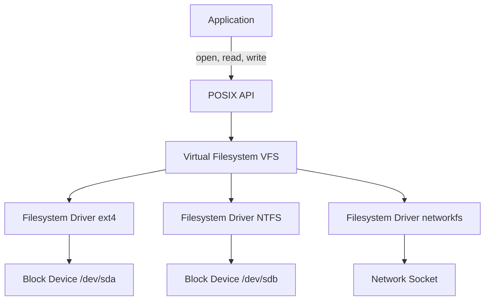
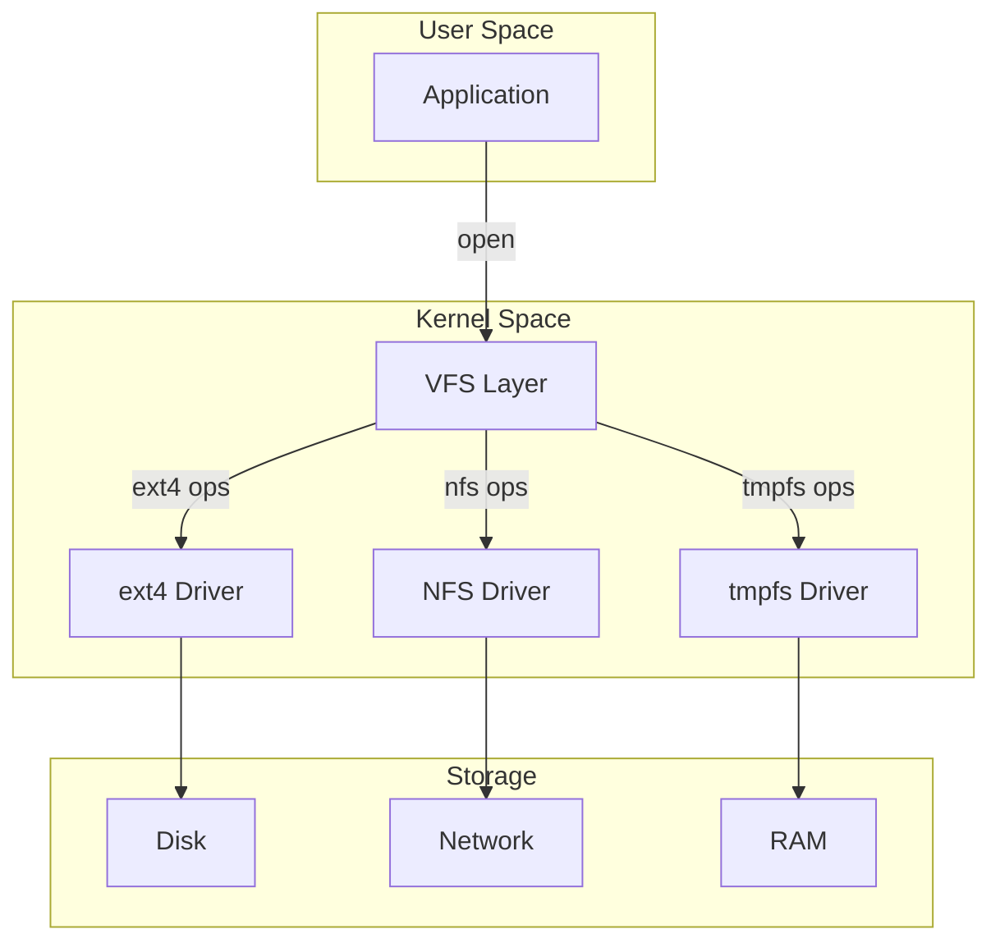
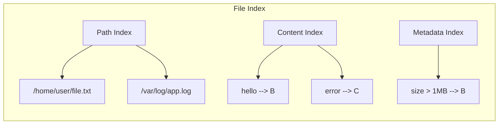

# Zero to Filesystem Engineer

## Introduction

This guide takes you from zero filesystem knowledge to understanding how to build production filesystem backends like telescope. We'll cover the fundamentals that underpin any storage system.

## Table of Contents

1. [What is a Filesystem?](#what-is-a-filesystem)
2. [Virtual Filesystem (VFS) Concepts](#virtual-filesystem-vfs-concepts)
3. [Block Storage Fundamentals](#block-storage-fundamentals)
4. [Mount Points and Drivers](#mount-points-and-drivers)
5. [File Operations (POSIX)](#file-operations-posix)
6. [File Indexing Basics](#file-indexing-basics)
7. [From Theory to telescope](#from-theory-to-telescope)

---

## What is a Filesystem?

### The Basic Concept

A **filesystem** is a method for storing, organizing, and retrieving data on a storage device. Think of it as a librarian for your data:

```
Raw Storage Device          Filesystem
+---------------+          +---------------+
| 0101010101... |  ---->   | /home/user/   |
| 1100110011... |  magic   |   document.txt|
| 0011001100... |          | /var/log/     |
+---------------+          +---------------+
   Raw bits                    Files
```

### Layers of Abstraction



### Key Terminology

| Term | Definition |
|------|------------|
| **File** | A named sequence of bytes with metadata |
| **Directory** | A file containing references to other files |
| **Inode** | Data structure storing file metadata (permissions, timestamps, block locations) |
| **Block** | Fixed-size unit of storage (typically 4KB) |
| **Path** | Location identifier (e.g., `/home/user/file.txt`) |
| **Mount Point** | Directory where a filesystem is attached |
| **Descriptor** | Integer handle for open files |

---

## Virtual Filesystem (VFS) Concepts

### What is VFS?

The **Virtual Filesystem** is an abstraction layer that provides a uniform interface to different filesystem types. It's why you can use `open()` on ext4, NFS, and tmpfs without changing your code.

### VFS Architecture



### VFS Operations

The VFS defines standard operations that all filesystems must implement:

```rust
// Simplified VFS operations trait
pub trait FileSystemOps {
    fn open(&self, path: &Path, flags: OpenFlags) -> Result<FileDescriptor>;
    fn read(&self, fd: FileDescriptor, buf: &mut [u8]) -> Result<usize>;
    fn write(&self, fd: FileDescriptor, buf: &[u8]) -> Result<usize>;
    fn close(&self, fd: FileDescriptor) -> Result<()>;
    fn stat(&self, path: &Path) -> Result<FileStat>;
    fn mkdir(&self, path: &Path, mode: Mode) -> Result<()>;
    fn unlink(&self, path: &Path) -> Result<()>;
    fn readdir(&self, fd: FileDescriptor) -> Result<Option<DirEntry>>;
}
```

### VFS in Practice

```c
// All these calls go through VFS:
int fd = open("/mnt/disk/file.txt", O_RDONLY);  // VFS -> ext4 -> disk
int fd2 = open("/tmp/file.txt", O_WRONLY);      // VFS -> tmpfs -> RAM
int fd3 = open("/nfs/share/file.txt", O_RDWR);  // VFS -> NFS -> network
```

---

## Block Storage Fundamentals

### What are Blocks?

Storage devices don't read individual bytes - they read **blocks** (fixed-size chunks). Common block sizes:

| Device Type | Typical Block Size |
|-------------|-------------------|
| Hard Disk (HDD) | 4KB - 512 bytes (legacy) |
| SSD | 4KB - 8KB |
| NVMe | 4KB - 16KB |

### Block Addressing

```
Block Layout on Disk:
+------+------+------+------+------+
| B000 | B001 | B002 | B003 | ...  |
+------+------+------+------+------+
   |      |      |
   |      |      +---> Block 2 contains file data
   |      +----------> Block 1 contains directory entries
   +-----------------> Block 0 contains superblock (filesystem metadata)
```

### Block Operations

```rust
pub trait BlockDevice {
    /// Read a block at the given sector
    fn read_block(&self, sector: u64, buffer: &mut [u8]) -> Result<()>;

    /// Write a block at the given sector
    fn write_block(&self, sector: u64, buffer: &[u8]) -> Result<()>;

    /// Get total number of sectors
    fn num_sectors(&self) -> u64;

    /// Get sector size in bytes
    fn sector_size(&self) -> usize;
}
```

### Block Allocation Strategies

1. **Contiguous Allocation**: File blocks are adjacent
   - Fast sequential reads
   - Prone to fragmentation

2. **Linked Allocation**: Each block points to the next
   - No fragmentation
   - Slow random access

3. **Indexed Allocation**: Index block contains all file block pointers
   - Good random access
   - Used by ext4, NTFS

```
Indexed Allocation (ext4 inode):
+------------------+
| Inode            |
| +--------------+ |
| | Direct[0]    |---+--> Block A
| | Direct[1]    |---+--> Block B
| | Direct[2]    |---+--> Block C
| | Indirect     |---+--> Index Block --> [Block D, Block E, ...]
| +--------------+ |
+------------------+
```

---

## Mount Points and Drivers

### What is Mounting?

**Mounting** attaches a filesystem to a directory (mount point) in the directory tree:

```
Before Mount:              After Mount:
/                          /
├── home/                  ├── home/
├── var/                   ├── var/
├── mnt/ (empty)           ├── mnt/
└── tmp/                   │   └── disk/  <-- Mount point
                           │       ├── file1.txt
                           │       └── data/
                           └── tmp/
```

### Mount Process

```rust
pub struct MountPoint {
    /// Path where filesystem is mounted
    pub path: PathBuf,
    /// The filesystem instance
    pub filesystem: Box<dyn FileSystem>,
    /// Mount options
    pub options: MountOptions,
}

pub fn mount(
    source: &str,      // e.g., "/dev/sda1" or "server:/export"
    target: &Path,     // e.g., "/mnt/data"
    fs_type: &str,     // e.g., "ext4", "nfs"
    options: MountOptions,
) -> Result<MountPoint> {
    // 1. Open block device or network connection
    // 2. Read superblock to validate filesystem
    // 3. Initialize filesystem driver
    // 4. Register with VFS
    Ok(MountPoint { ... })
}
```

### Filesystem Drivers

A **driver** implements the FileSystemOps trait for a specific filesystem type:

```rust
// Ext4 driver
pub struct Ext4FileSystem {
    device: Arc<dyn BlockDevice>,
    superblock: SuperBlock,
    block_group_descriptors: Vec<BlockGroup>,
}

impl FileSystemOps for Ext4FileSystem {
    fn open(&self, path: &Path, flags: OpenFlags) -> Result<FileDescriptor> {
        // Parse path, lookup inodes, return descriptor
    }

    fn read(&self, fd: FileDescriptor, buf: &mut [u8]) -> Result<usize> {
        // Get inode from fd, read blocks, copy to buffer
    }

    // ... implement all VFS operations
}
```

---

## File Operations (POSIX)

### Standard POSIX Operations

| Operation | Purpose | Returns |
|-----------|---------|---------|
| `open(path, flags)` | Open a file | File descriptor |
| `read(fd, buf)` | Read from file | Bytes read |
| `write(fd, buf)` | Write to file | Bytes written |
| `close(fd)` | Close file | Success/error |
| `stat(path)` | Get file metadata | stat struct |
| `fstat(fd)` | Get open file metadata | stat struct |
| `lseek(fd, offset, whence)` | Move file position | New offset |
| `mkdir(path)` | Create directory | Success/error |
| `unlink(path)` | Delete file | Success/error |
| `readdir(dir)` | Read directory | Directory entries |

### File Descriptor Lifecycle

```c
// 1. Open file
int fd = open("/home/user/file.txt", O_RDONLY);
if (fd < 0) { perror("open"); exit(1); }

// 2. Read content
char buffer[4096];
ssize_t bytes = read(fd, buffer, sizeof(buffer));
if (bytes < 0) { perror("read"); exit(1); }

// 3. Process data
printf("Read %zd bytes: %s\n", bytes, buffer);

// 4. Close when done
close(fd);
```

### Rust Equivalent

```rust
use std::fs::File;
use std::io::Read;

fn main() -> std::io::Result<()> {
    // Open file
    let mut file = File::open("/home/user/file.txt")?;

    // Read content
    let mut buffer = String::new();
    file.read_to_string(&mut buffer)?;

    // Process data
    println!("Read {} bytes: {}", buffer.len(), buffer);

    // File automatically closed when dropped
    Ok(())
}
```

---

## File Indexing Basics

### Why Index Files?

Indexing enables fast file discovery and search:

```
Without Index:              With Index:
Scan all files ----->       Lookup in index ----->
O(n)                        O(log n) or O(1)
```

### Index Components



### Simple Index Implementation

```rust
pub struct FileIndex {
    /// Map path to metadata
    entries: HashMap<PathBuf, FileEntry>,
    /// Inverted index for content search
    content_index: HashMap<String, Vec<PathBuf>>,
}

pub struct FileEntry {
    pub path: PathBuf,
    pub size: u64,
    pub modified: SystemTime,
    pub is_dir: bool,
    pub content_hash: Option<[u8; 32]>,
}

impl FileIndex {
    pub fn insert(&mut self, entry: FileEntry) {
        // Index by path
        self.entries.insert(entry.path.clone(), entry);

        // Update content index (simplified)
        // In practice, you'd tokenize and index content
    }

    pub fn search(&self, query: &str) -> Vec<&PathBuf> {
        self.content_index
            .get(query)
            .map(|paths| paths.iter().collect())
            .unwrap_or_default()
    }

    pub fn find_by_path(&self, path: &Path) -> Option<&FileEntry> {
        self.entries.get(path)
    }
}
```

### Incremental Indexing

```rust
pub struct IncrementalIndex {
    base_index: FileIndex,
    /// Pending changes not yet committed
    pending: Vec<IndexChange>,
    /// Last indexed timestamp per path
    last_indexed: HashMap<PathBuf, SystemTime>,
}

pub enum IndexChange {
    Added(PathBuf, FileEntry),
    Modified(PathBuf, FileEntry),
    Deleted(PathBuf),
}

impl IncrementalIndex {
    pub fn sync(&mut self, filesystem: &dyn FileSystem) -> Result<()> {
        // Walk filesystem
        // Compare with last_indexed
        // Generate pending changes
        // Commit in batches
        Ok(())
    }
}
```

---

## From Theory to telescope

### How telescope Uses Filesystem Concepts

Telescope doesn't implement a filesystem from scratch, but it heavily uses filesystem operations for test result storage:

```typescript
// TestRunner creates result directories
setupPaths(testID: string): void {
  this.paths['temporaryContext'] = './tmp/';
  this.paths['results'] = './results/' + testID;
  this.paths['filmstrip'] = this.paths.results + '/filmstrip';
  mkdirSync(this.paths['results'], { recursive: true });  // mkdir -p
}

// Writing result files
writeFileSync(
  this.paths['results'] + '/metrics.json',
  JSON.stringify(this.metrics),
  'utf8',
);

// Reading HAR file for enhancement
const harData: HarData = JSON.parse(
  readFileSync(this.paths['results'] + '/pageload.har', 'utf8'),
);

// Filmstrip frame extraction (ffmpeg writes to filesystem)
video.fnExtractFrameToJPG(paths['filmstrip'], { ... });

// Cleanup (unlink directories)
rmSync(this.paths['temporaryContext'], { recursive: true, force: true });
```

### telescope Result Structure

```
results/
└── 2026_03_28_14_30_00_abc123/   # Test ID (timestamp_uuid)
    ├── config.json                # Test configuration
    ├── console.json               # Console messages
    ├── metrics.json               # Performance metrics
    ├── resources.json             # Resource timing data
    ├── pageload.har               # HAR file (enhanced)
    ├── screenshot.png             # Final screenshot
    ├── video.webm                 # Page load video
    ├── index.html                 # HTML report (optional)
    └── filmstrip/                 # Filmstrip frames
        ├── frame_0001.jpg
        ├── frame_0002.jpg
        └── ...
```

### Rust Translation Considerations

When translating telescope's filesystem operations to Rust:

```rust
// TypeScript
mkdirSync(this.paths['results'], { recursive: true });

// Rust (std::fs)
std::fs::create_dir_all(&self.paths.results)?;

// TypeScript
writeFileSync(path, JSON.stringify(data), 'utf8');

// Rust (serde_json + std::fs)
let json = serde_json::to_string(&data)?;
std::fs::write(&path, json.as_bytes())?;

// TypeScript
const data = JSON.parse(readFileSync(path, 'utf8'));

// Rust
let content = std::fs::read_to_string(&path)?;
let data: DataType = serde_json::from_str(&content)?;

// TypeScript
rmSync(path, { recursive: true, force: true });

// Rust
std::fs::remove_dir_all(&path)?;  // Error if doesn't exist
// Or use:
std::fs::remove_dir_all(&path).ok();  // Ignore errors
```

---

## Exercises

### Exercise 1: Implement a Simple VFS

```rust
// Create a VFS that supports multiple "filesystems"
pub trait FileSystem {
    fn read(&self, path: &Path) -> Result<Vec<u8>>;
    fn write(&self, path: &Path, data: &[u8]) -> Result<()>;
    fn list(&self, path: &Path) -> Result<Vec<PathBuf>>;
}

// Implement for in-memory filesystem
pub struct MemoryFS {
    files: HashMap<PathBuf, Vec<u8>>,
}

// Implement for disk filesystem
pub struct DiskFS {
    root: PathBuf,
}
```

### Exercise 2: Build a File Indexer

```rust
// Index all files in a directory
pub fn index_directory(path: &Path) -> Result<FileIndex> {
    let mut index = FileIndex::new();

    for entry in walkdir::WalkDir::new(path) {
        let entry = entry?;
        let metadata = entry.metadata()?;

        index.insert(FileEntry {
            path: entry.path().to_path_buf(),
            size: metadata.len(),
            modified: metadata.modified()?,
            is_dir: metadata.is_dir(),
            content_hash: None,  // Bonus: compute SHA-256
        });
    }

    Ok(index)
}
```

### Exercise 3: Add Filesystem Operations to telescope

Extend the Rust telescope implementation with:

1. Async file writing for large results
2. Indexing of test results for quick lookup
3. Compression of old test results

---

## Summary

| Concept | Key Takeaway |
|---------|--------------|
| Filesystem | Method for storing/organizing/retrieving data |
| VFS | Abstraction layer for uniform filesystem interface |
| Blocks | Fixed-size storage units (typically 4KB) |
| Mount Points | Directories where filesystems attach |
| POSIX Ops | Standard file operations (open, read, write, close) |
| Indexing | Fast file discovery through data structures |

---

## Next Steps

Continue to [01-storage-backend-deep-dive.md](01-storage-backend-deep-dive.md) for deeper exploration of:
- Block storage implementation details
- Object storage patterns
- Caching strategies
- I/O scheduling
