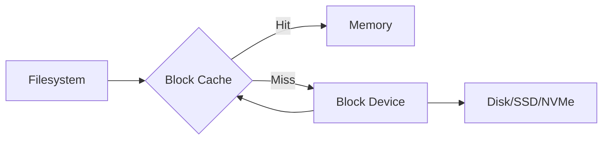
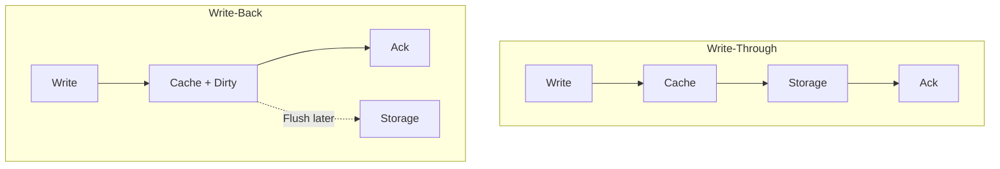

# Storage Backend Deep Dive

## Introduction

This deep dive explores storage backend implementations - the foundation of any filesystem system. We'll examine block storage, object storage, and caching patterns used in production systems like telescope.

## Table of Contents

1. [Block Storage Abstraction](#block-storage-abstraction)
2. [Object Storage Patterns](#object-storage-patterns)
3. [Caching Strategies](#caching-strategies)
4. [I/O Scheduling](#io-scheduling)
5. [Persistence Layers](#persistence-layers)
6. [telescope Storage Analysis](#telescope-storage-analysis)
7. [Rust Implementation](#rust-implementation)

---

## Block Storage Abstraction

### Block Device Interface

A block device provides raw storage access through fixed-size blocks:

```rust
/// Block device trait - the lowest level storage abstraction
pub trait BlockDevice: Send + Sync {
    /// Sector size in bytes (typically 512 or 4096)
    const SECTOR_SIZE: usize;

    /// Read sectors into buffer
    fn read_sectors(&self, sector: u64, buffer: &mut [u8]) -> Result<()>;

    /// Write sectors from buffer
    fn write_sectors(&self, sector: u64, buffer: &[u8]) -> Result<()>;

    /// Total number of sectors
    fn total_sectors(&self) -> u64;

    /// Flush write cache to persistent storage
    fn flush(&self) -> Result<()>;
}
```

### Block Device Implementations

```rust
// File-backed block device (useful for testing)
pub struct FileBackedDevice {
    file: Mutex<File>,
    sector_count: u64,
}

impl BlockDevice for FileBackedDevice {
    const SECTOR_SIZE: usize = 512;

    fn read_sectors(&self, sector: u64, buffer: &mut [u8]) -> Result<()> {
        let mut file = self.file.lock();
        file.seek(SeekFrom::Start(sector * Self::SECTOR_SIZE as u64))?;
        file.read_exact(buffer)?;
        Ok(())
    }

    fn write_sectors(&self, sector: u64, buffer: &[u8]) -> Result<()> {
        let mut file = self.file.lock();
        file.seek(SeekFrom::Start(sector * Self::SECTOR_SIZE as u64))?;
        file.write_all(buffer)?;
        Ok(())
    }
}

// RAM disk (for high-performance temporary storage)
pub struct RamDisk {
    data: Mutex<Vec<u8>>,
    sector_count: u64,
}

// NVMe device (using io_uring on Linux)
pub struct NvmeDevice {
    ring: io_uring::IoUring,
    namespace_id: u32,
}
```

### Block Cache

Accessing physical storage is slow. A block cache keeps frequently accessed blocks in memory:



```rust
pub struct BlockCache {
    /// LRU cache of blocks
    cache: Mutex<LruCache<u64, Box<[u8]>>>,
    /// Underlying block device
    device: Arc<dyn BlockDevice>,
    /// Dirty blocks pending write
    dirty: Mutex<HashSet<u64>>,
}

impl BlockCache {
    pub fn read_block(&self, block_num: u64) -> Result<Box<[u8]>> {
        let mut cache = self.cache.lock();

        // Check cache first
        if let Some(block) = cache.get(&block_num) {
            return Ok(block.clone());
        }

        // Read from device
        let mut buffer = vec![0; BlockDevice::SECTOR_SIZE];
        self.device.read_sectors(block_num, &mut buffer)?;

        // Add to cache
        cache.put(block_num, buffer.into_boxed_slice());

        Ok(cache.get(&block_num).unwrap().clone())
    }

    pub fn write_block(&self, block_num: u64, data: &[u8]) -> Result<()> {
        let mut cache = self.cache.lock();
        let mut dirty = self.dirty.lock();

        // Update cache
        cache.put(block_num, data.to_vec().into_boxed_slice());
        dirty.insert(block_num);

        Ok(())
    }

    pub fn flush(&self) -> Result<()> {
        let dirty = std::mem::take(&mut *self.dirty.lock());
        let cache = self.cache.lock();

        for block_num in dirty {
            if let Some(data) = cache.get(&block_num) {
                self.device.write_sectors(block_num, data)?;
            }
        }

        self.device.flush()
    }
}
```

---

## Object Storage Patterns

### Object Storage vs Block Storage

| Aspect | Block Storage | Object Storage |
|--------|--------------|----------------|
| Access Unit | Fixed-size blocks | Variable-size objects |
| Addressing | Block number | Key/ID |
| Operations | Read/write bytes | Put/get/delete object |
| Use Case | Filesystems, databases | Archives, media, backups |
| Examples | EBS, local disk | S3, R2, GCS |

### Object Storage Interface

```rust
/// Object storage trait
pub trait ObjectStore: Send + Sync {
    type Error: std::error::Error;

    /// Upload an object
    fn put(&self, key: &str, data: Bytes) -> impl Future<Output = Result<(), Self::Error>>;

    /// Download an object
    fn get(&self, key: &str) -> impl Future<Output = Result<Option<Bytes>, Self::Error>>;

    /// Delete an object
    fn delete(&self, key: &str) -> impl Future<Output = Result<(), Self::Error>>;

    /// List objects with prefix
    fn list(&self, prefix: &str) -> impl Future<Output = Result<Vec<String>, Self::Error>>;

    /// Get object metadata
    fn head(&self, key: &str) -> impl Future<Output = Result<Option<ObjectMeta>, Self::Error>>;
}

pub struct ObjectMeta {
    pub key: String,
    pub size: u64,
    pub last_modified: SystemTime,
    pub etag: String,
    pub content_type: Option<String>,
}
```

### S3-Compatible Implementation

```rust
pub struct S3Store {
    client: aws_sdk_s3::Client,
    bucket: String,
}

impl ObjectStore for S3Store {
    type Error = aws_sdk_s3::Error;

    async fn put(&self, key: &str, data: Bytes) -> Result<(), Self::Error> {
        self.client
            .put_object()
            .bucket(&self.bucket)
            .key(key)
            .body(data.into())
            .send()
            .await?;
        Ok(())
    }

    async fn get(&self, key: &str) -> Result<Option<Bytes>, Self::Error> {
        match self.client
            .get_object()
            .bucket(&self.bucket)
            .key(key)
            .send()
            .await
        {
            Ok(output) => {
                let body = output.body.collect().await?;
                Ok(Some(body.into_bytes()))
            }
            Err(aws_sdk_s3::Error::NotFound(_)) => Ok(None),
            Err(e) => Err(e),
        }
    }
}
```

### Multi-Level Storage Hierarchy

```rust
/// Tiered storage: hot (memory) -> warm (SSD) -> cold (object storage)
pub struct TieredStorage {
    hot: MemoryStore,
    warm: DiskStore,
    cold: ObjectStore,
    /// Thresholds for tier migration
    hot_size_limit: usize,
    warm_size_limit: usize,
}

impl TieredStorage {
    pub async fn get(&self, key: &str) -> Result<Bytes> {
        // Try hot tier first
        if let Some(data) = self.hot.get(key).await {
            return Ok(data);
        }

        // Try warm tier
        if let Some(data) = self.warm.get(key).await {
            self.hot.put(key, data.clone()).await;  // Promote to hot
            return Ok(data);
        }

        // Fetch from cold tier
        let data = self.cold.get(key).await?
            .ok_or(Error::NotFound)?;

        self.warm.put(key, data.clone()).await;  // Promote to warm
        Ok(data)
    }
}
```

---

## Caching Strategies

### Cache Eviction Policies

```rust
// LRU (Least Recently Used)
pub struct LruCache<K, V> {
    map: HashMap<K, ListNode<V>>,
    list: LinkedList<K>,
    capacity: usize,
}

// LFU (Least Frequently Used)
pub struct LfuCache<K, V> {
    map: HashMap<K, CacheEntry<V>>,
    freq_map: BTreeMap<usize, HashSet<K>>,
    capacity: usize,
}

// ARC (Adaptive Replacement Cache)
pub struct ArcCache<K, V> {
    p1: LruCache<K, V>,  // Recently used once
    p2: LruCache<K, V>,  // Recently used multiple times
    ghost: LruCache<K, ()>,  // Evicted from p1
    history: LruCache<K, ()>,  // Evicted from p2
    capacity: usize,
    target_size: usize,
}
```

### Write-Through vs Write-Back



```rust
// Write-through cache
pub struct WriteThroughCache {
    cache: Mutex<LruCache<u64, Vec<u8>>>,
    storage: Arc<dyn Storage>,
}

impl WriteThroughCache {
    pub async fn write(&self, key: u64, data: &[u8]) -> Result<()> {
        // Write to storage first
        self.storage.write(key, data).await?;

        // Then update cache
        self.cache.lock().put(key, data.to_vec());

        Ok(())
    }
}

// Write-back cache (with background flusher)
pub struct WriteBackCache {
    cache: Mutex<LruCache<u64, CacheEntry>>,
    storage: Arc<dyn Storage>,
    flush_queue: AsyncChannel<u64>,
}

struct CacheEntry {
    data: Vec<u8>,
    dirty: bool,
    last_accessed: Instant,
}

impl WriteBackCache {
    pub async fn write(&self, key: u64, data: &[u8]) -> Result<()> {
        let mut cache = self.cache.lock();

        cache.put(key, CacheEntry {
            data: data.to_vec(),
            dirty: true,
            last_accessed: Instant::now(),
        });

        // Queue for background flush
        self.flush_queue.send(key).await?;

        Ok(())  // Return immediately
    }

    async fn flusher_loop(&self) -> Result<()> {
        while let Ok(key) = self.flush_queue.recv().await {
            let mut cache = self.cache.lock();
            if let Some(entry) = cache.get_mut(&key) {
                if entry.dirty {
                    self.storage.write(key, &entry.data).await?;
                    entry.dirty = false;
                }
            }
        }
        Ok(())
    }
}
```

### telescope's Caching Pattern

Telescope uses filesystem caching implicitly through Node.js fs module:

```typescript
// telescope writes results to disk
writeFileSync(this.paths['results'] + '/metrics.json', data);

// OS page cache handles caching automatically
// For high-throughput scenarios, consider:
// 1. Write to temp file, then rename (atomic)
// 2. Batch writes for multiple files
// 3. Use async I/O for non-blocking writes
```

---

## I/O Scheduling

### I/O Scheduler Types

| Scheduler | Algorithm | Best For |
|-----------|-----------|----------|
| **noop** | FIFO | SSDs, NVMe |
| **deadline** | Deadline-based | Databases |
| **cfq** | Fair queuing | Desktop workloads |
| **kyber** | Token-based | Low-latency SSDs |
| **mq-deadline** | Per-queue deadline | Multi-queue NVMe |

### Custom I/O Scheduler

```rust
/// I/O request
pub struct IoRequest {
    pub op: IoOp,
    pub block: u64,
    pub data: Vec<u8>,
    pub priority: Priority,
    pub deadline: Instant,
}

pub enum IoOp {
    Read,
    Write,
}

pub enum Priority {
    High,
    Normal,
    Low,
    Idle,
}

/// Deadline-based I/O scheduler
pub struct DeadlineScheduler {
    /// Read queue (sorted by deadline)
    read_queue: BTreeMap<Instant, IoRequest>,
    /// Write queue (sorted by deadline)
    write_queue: BTreeMap<Instant, IoRequest>,
    /// Device for issuing I/O
    device: Arc<dyn BlockDevice>,
    /// Read starvation prevention
    read_batch: usize,
    write_batch: usize,
}

impl DeadlineScheduler {
    pub async fn submit(&mut self, request: IoRequest) -> Result<Vec<u8>> {
        let (tx, rx) = oneshot::channel();

        match request.op {
            IoOp::Read => self.read_queue.insert(request.deadline, (request, tx)),
            IoOp::Write => self.write_queue.insert(request.deadline, (request, tx)),
        }

        rx.await
    }

    pub async fn scheduler_loop(&mut self) -> Result<()> {
        loop {
            let now = Instant::now();

            // Check for expired requests
            while let Some((deadline, request)) = self.read_queue.first_entry() {
                if *deadline > now {
                    break;
                }
                self.process_request(request).await?;
            }

            // Batch writes for efficiency
            let mut writes_processed = 0;
            while writes_processed < self.write_batch {
                if let Some(entry) = self.write_queue.pop_first() {
                    self.process_request(entry.1).await?;
                    writes_processed += 1;
                } else {
                    break;
                }
            }

            // Yield to prevent starvation
            tokio::task::yield_now().await;
        }
    }
}
```

### Async I/O with io_uring (Linux)

```rust
use io_uring::{IoUring, opcode, types};

pub struct IoUringScheduler {
    ring: IoUring,
    pending: HashMap<u64, oneshot::Sender<Result<Vec<u8>>>>,
}

impl IoUringScheduler {
    pub fn new(size: usize) -> Result<Self> {
        Ok(Self {
            ring: IoUring::new(size as u32)?,
            pending: HashMap::new(),
        })
    }

    pub fn submit_read(&mut self, fd: i32, offset: u64, len: usize) -> Result<RecvFuture> {
        let buf = vec![0u8; len];
        let (tx, rx) = oneshot::channel();

        let io = opcode::Read::new(types::Fd(fd), buf.as_mut_ptr(), len as _)
            .offset(offset)
            .build()
            .user_data(self.next_id());

        unsafe {
            self.ring.submission().push(&io)?;
        }

        self.pending.insert(io.get_user_data(), tx);
        Ok(RecvFuture(rx))
    }

    pub fn poll(&mut self) -> Result<()> {
        self.ring.submit_and_wait(1)?;

        for cqe in self.ring.completion() {
            if let Some(tx) = self.pending.remove(&cqe.user_data()) {
                let result = if cqe.result() >= 0 {
                    Ok(cqe.result() as usize)
                } else {
                    Err(Error::Io(cqe.result()))
                };
                tx.send(result).ok();
            }
        }

        Ok(())
    }
}
```

---

## Persistence Layers

### Write-Ahead Log (WAL)

```rust
/// WAL for crash recovery
pub struct Wal {
    file: File,
    sequence: u64,
    sync_mode: SyncMode,
}

pub enum SyncMode {
    Full,      // fsync after every write
    Normal,    // fsync periodically
    Off,       // no fsync (unsafe)
}

impl Wal {
    pub fn append(&mut self, record: WalRecord) -> Result<u64> {
        let seq = self.sequence;
        self.sequence += 1;

        // Write record
        let mut buf = Vec::new();
        buf.extend_from_slice(&seq.to_le_bytes());
        buf.extend_from_slice(&(record.data.len() as u32).to_le_bytes());
        buf.extend_from_slice(&record.data);

        self.file.write_all(&buf)?;

        // Sync based on mode
        if matches!(self.sync_mode, SyncMode::Full) {
            self.file.sync_all()?;
        }

        Ok(seq)
    }

    pub fn replay(&mut self) -> Result<Vec<WalRecord>> {
        self.file.seek(SeekFrom::Start(0))?;

        let mut records = Vec::new();
        let mut buf = [0u8; 12];

        while self.file.read_exact(&mut buf).is_ok() {
            let seq = u64::from_le_bytes(buf[0..8].try_into().unwrap());
            let len = u32::from_le_bytes(buf[8..12].try_into().unwrap()) as usize;

            let mut data = vec![0u8; len];
            self.file.read_exact(&mut data)?;

            records.push(WalRecord { seq, data });
        }

        Ok(records)
    }
}
```

### Copy-on-Write (CoW)

```rust
/// CoW file storage
pub struct CowStorage {
    /// Current version
    active: Arc<Version>,
    /// Historical versions for snapshots
    snapshots: Mutex<HashMap<u64, Arc<Version>>>,
}

struct Version {
    sequence: u64,
    /// Map of block -> data
    blocks: RwLock<HashMap<u64, BlockData>>,
    /// Reference to parent version (for CoW)
    parent: Option<Arc<Version>>,
}

impl CowStorage {
    pub fn write_block(&self, block: u64, data: &[u8]) -> Result<()> {
        let active = self.active.clone();

        // Check if block exists in parent
        if let Some(parent) = &active.parent {
            if parent.blocks.read().contains_key(&block) {
                // Copy from parent first (CoW)
                let parent_data = parent.blocks.read().get(&block).cloned();
                active.blocks.write().insert(block, parent_data.unwrap());
            }
        }

        // Write new data
        active.blocks.write().insert(block, BlockData::new(data));

        Ok(())
    }

    pub fn snapshot(&self) -> u64 {
        let mut snapshots = self.snapshots.lock();
        let seq = self.active.sequence;
        snapshots.insert(seq, self.active.clone());
        seq
    }
}
```

---

## telescope Storage Analysis

### Current Storage Pattern

```typescript
// telescope's storage flow:
class TestRunner {
  setupPaths(testID: string): void {
    // 1. Create directory structure
    this.paths['results'] = './results/' + testID;
    this.paths['filmstrip'] = this.paths.results + '/filmstrip';
    mkdirSync(this.paths['results'], { recursive: true });
  }

  async postProcess(): Promise<void> {
    // 2. Write result files synchronously
    writeFileSync(
      this.paths['results'] + '/console.json',
      JSON.stringify(this.consoleMessages),
    );

    writeFileSync(
      this.paths['results'] + '/metrics.json',
      JSON.stringify(this.metrics),
    );

    // 3. Generate filmstrip (ffmpeg writes frames)
    await this.createFilmStrip();

    // 4. Optional: Zip results
    if (this.options.zip) {
      const zip = new AdmZip();
      zip.addLocalFolder(this.paths['results']);
      zip.writeZip(`./results/${this.TESTID}.zip`);
    }

    // 5. Optional: Upload to remote
    if (this.options.uploadUrl) {
      await fetch(this.options.uploadUrl, {
        method: 'POST',
        body: formDataWithZip,
      });
    }
  }
}
```

### Storage Optimization Opportunities

1. **Async File Writes**: Use Node.js `fs/promises` for non-blocking writes
2. **Streaming Uploads**: Stream zip directly to remote storage
3. **Compression**: Compress JSON files (metrics, console logs)
4. **Batching**: Batch multiple small writes

```typescript
// Optimized version
import { writeFile } from 'fs/promises';
import { createWriteStream } from 'fs';
import { pipeline } from 'stream/promises';

async function writeResultsOptimized(paths: TestPaths, data: Results) {
  // Parallel async writes
  await Promise.all([
    writeFile(paths.results + '/console.json', gzip(JSON.stringify(data.console))),
    writeFile(paths.results + '/metrics.json', gzip(JSON.stringify(data.metrics))),
    writeFile(paths.results + '/resources.json', JSON.stringify(data.resources)),
  ]);

  // Stream filmstrip frames
  for (const frame of data.filmstrip) {
    await writeFile(paths.filmstrip + `/frame_${frame.num}.jpg`, frame.data);
  }

  // Stream zip to remote
  const zipStream = createZipStream(paths.results);
  const uploadStream = createUploadStream(options.uploadUrl);
  await pipeline(zipStream, uploadStream);
}
```

---

## Rust Implementation

### Complete Storage Backend for Rust telescope

```rust
use std::path::{Path, PathBuf};
use std::sync::Arc;
use tokio::fs;
use tokio::io::AsyncWriteExt;
use serde::{Serialize, Deserialize};

/// Storage configuration
#[derive(Clone, Debug)]
pub struct StorageConfig {
    pub base_path: PathBuf,
    pub compression: CompressionType,
    pub async_writes: bool,
    pub max_concurrent_writes: usize,
}

#[derive(Clone, Copy, Debug)]
pub enum CompressionType {
    None,
    Gzip,
    Zstd,
}

/// Storage backend for test results
pub struct TestStorage {
    config: StorageConfig,
    /// Semaphore for limiting concurrent writes
    write_semaphore: Arc<tokio::sync::Semaphore>,
    /// Object store for remote uploads
    object_store: Option<Arc<dyn ObjectStore>>,
}

impl TestStorage {
    pub fn new(config: StorageConfig) -> Result<Self> {
        // Ensure base directory exists
        std::fs::create_dir_all(&config.base_path)?;

        Ok(Self {
            config,
            write_semaphore: Arc::new(tokio::sync::Semaphore::new(
                config.max_concurrent_writes,
            )),
            object_store: None,
        })
    }

    pub fn with_object_store(mut self, store: Arc<dyn ObjectStore>) -> Self {
        self.object_store = Some(store);
        self
    }

    /// Generate result path for test
    pub fn result_path(&self, test_id: &str) -> PathBuf {
        self.config.base_path.join(test_id)
    }

    /// Write a JSON file (with optional compression)
    pub async fn write_json<T: Serialize>(
        &self,
        path: &Path,
        data: &T,
    ) -> Result<()> {
        let _permit = self.write_semaphore.acquire().await?;

        let json = serde_json::to_vec(data)?;
        let compressed = match self.config.compression {
            CompressionType::None => json,
            CompressionType::Gzip => compress_gzip(&json)?,
            CompressionType::Zstd => compress_zstd(&json)?,
        };

        // Ensure parent directory exists
        if let Some(parent) = path.parent() {
            fs::create_dir_all(parent).await?;
        }

        // Write atomically (write to temp, then rename)
        let temp_path = path.with_extension(".tmp");
        let mut file = fs::File::create(&temp_path).await?;
        file.write_all(&compressed).await?;
        file.sync_all().await?;
        drop(file);

        fs::rename(&temp_path, path).await?;

        Ok(())
    }

    /// Read a JSON file (with auto-detection of compression)
    pub async fn read_json<T: for<'de> Deserialize<'de>>(
        &self,
        path: &Path,
    ) -> Result<T> {
        let content = fs::read(path).await?;

        // Detect compression from magic bytes
        let decompressed = match content.get(0..2) {
            Some(&[0x1f, 0x8b]) => decompress_gzip(&content)?,
            Some(&[0x28, 0xb5]) => decompress_zstd(&content)?,
            _ => content,
        };

        Ok(serde_json::from_slice(&decompressed)?)
    }

    /// Upload results to remote storage
    pub async fn upload_results(&self, test_id: &str) -> Result<()> {
        if let Some(store) = &self.object_store {
            let base_path = self.result_path(test_id);

            // Walk directory and upload all files
            let mut entries = fs::read_dir(&base_path).await?;
            while let Some(entry) = entries.next_entry().await? {
                let path = entry.path();
                if path.is_file() {
                    let key = format!("{}/{}", test_id, path.file_name().unwrap().to_str().unwrap());
                    let data = fs::read(&path).await?;
                    store.put(&key, data.into()).await?;
                }
            }
        }

        Ok(())
    }

    /// Delete old results (retention policy)
    pub async fn cleanup_old_results(&self, max_age: Duration) -> Result<usize> {
        let mut deleted = 0;
        let cutoff = SystemTime::now() - max_age;

        let mut entries = fs::read_dir(&self.config.base_path).await?;
        while let Some(entry) = entries.next_entry().await? {
            if let Ok(metadata) = entry.metadata().await {
                if let Ok(modified) = metadata.modified() {
                    if modified < cutoff {
                        fs::remove_dir_all(entry.path()).await?;
                        deleted += 1;
                    }
                }
            }
        }

        Ok(deleted)
    }
}

// Compression helpers
fn compress_gzip(data: &[u8]) -> Result<Vec<u8>> {
    use flate2::write::GzEncoder;
    use flate2::Compression;
    use std::io::Write;

    let mut encoder = GzEncoder::new(Vec::new(), Compression::default());
    encoder.write_all(data)?;
    Ok(encoder.finish()?)
}

fn compress_zstd(data: &[u8]) -> Result<Vec<u8>> {
    Ok(zstd::encode_all(data, 3)?)
}

fn decompress_gzip(data: &[u8]) -> Result<Vec<u8>> {
    use flate2::read::GzDecoder;
    use std::io::Read;

    let mut decoder = GzDecoder::new(data);
    let mut decoded = Vec::new();
    decoder.read_to_end(&mut decoded)?;
    Ok(decoded)
}

fn decompress_zstd(data: &[u8]) -> Result<Vec<u8>> {
    Ok(zstd::decode_all(data)?)
}
```

---

## Summary

| Topic | Key Points |
|-------|------------|
| Block Storage | Fixed-size blocks, sector operations, caching |
| Object Storage | Key-based access, S3-compatible, tiered storage |
| Caching | LRU/LFU/ARC policies, write-through vs write-back |
| I/O Scheduling | Deadline-based, io_uring, priority queues |
| Persistence | WAL for recovery, CoW for snapshots |
| telescope | Sync writes, opportunity for async optimization |

---

## Next Steps

Continue to [02-virtual-fs-deep-dive.md](02-virtual-fs-deep-dive.md) for exploration of:
- FUSE (Filesystem in Userspace)
- Virtual filesystem operations
- Mount point management
- Path resolution algorithms
