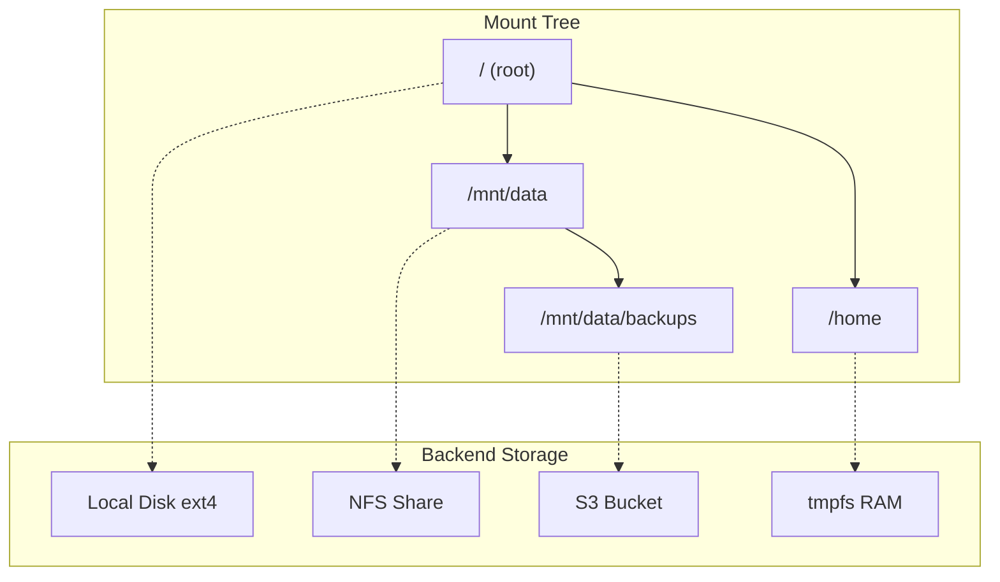

# Virtual Filesystem Deep Dive

## Introduction

This deep dive explores virtual filesystem implementations, focusing on FUSE (Filesystem in Userspace), VFS abstractions, and mount point management. These concepts are essential for building flexible storage systems like telescope.

## Table of Contents

1. [FUSE Fundamentals](#fuse-fundamentals)
2. [Virtual Filesystem Operations](#virtual-filesystem-operations)
3. [Mount Point Management](#mount-point-management)
4. [Path Resolution](#path-resolution)
5. [Permission Handling](#permission-handling)
6. [telescope VFS Patterns](#telescope-vfs-patterns)
7. [Rust Implementation](#rust-implementation)

---

## FUSE Fundamentals

### What is FUSE?

**FUSE (Filesystem in Userspace)** allows implementing filesystems in user space without kernel modifications. The kernel forwards filesystem operations to a user-space handler.

```mermaid
flowchart TB
    A[Application] -->|open, read, write| B[Kernel VFS]
    B -->|FUSE protocol| C[/dev/fuse]
    C --> D[FUSE Library]
    D --> E[User-space Filesystem]
    E --> F[Backend Storage]
    F --> E
    E --> D
    D --> C
    C --> B
    B --> A
```

### FUSE Architecture

```
+------------------+     +------------------+     +------------------+
|   Application    |     |   Kernel Space   |     |   User Space     |
+------------------+     +------------------+     +------------------+
| open("/mnt/f/x") | -->  |  VFS Layer       | -->  |  FUSE Daemon     |
| read(fd, buf)    |      |  FUSE Module     |      |  (your code)     |
| write(fd, data)  |      |  /dev/fuse       |      |  Backend: S3,    |
| close(fd)        |      |                  |      |  SSH, encrypted  |
+------------------+     +------------------+     +------------------+
```

### FUSE Operations

```rust
use fuser::{Filesystem, Request, FileAttr, FileType, FilesystemResult};

/// Implement this trait to create a FUSE filesystem
pub trait Filesystem {
    /// Look up a directory entry by name and get its attributes
    fn lookup(&mut self, req: &Request, parent: u64, name: &OsStr, reply: ReplyEntry);

    /// Get file attributes
    fn getattr(&mut self, req: &Request, ino: u64, reply: ReplyAttr);

    /// Open a file
    fn open(&mut self, req: &Request, ino: u64, flags: i32, reply: ReplyOpen);

    /// Read data from file
    fn read(
        &mut self,
        req: &Request,
        ino: u64,
        fh: u64,
        offset: i64,
        size: u32,
        flags: i32,
        lock: u64,
        reply: ReplyData,
    );

    /// Write data to file
    fn write(
        &mut self,
        req: &Request,
        ino: u64,
        fh: u64,
        offset: i64,
        data: &[u8],
        flags: i32,
        lock: u64,
        reply: ReplyWrite,
    );

    /// Create a file
    fn create(
        &mut self,
        req: &Request,
        parent: u64,
        name: &OsStr,
        mode: u32,
        umask: u32,
        flags: i32,
        reply: ReplyCreate,
    );

    /// Read directory
    fn readdir(&mut self, req: &Request, ino: u64, fh: u64, offset: i64, reply: ReplyDirectory);
}
```

### Simple FUSE Filesystem Example

```rust
use fuser::{Filesystem, Request, FileAttr, FileType, ReplyDirectory, ReplyEntry, ReplyAttr};
use std::ffi::OsStr;
use std::time::{Duration, SystemTime};

const TTL: Duration = Duration::from_secs(1);

struct HelloFs {
    root_attr: FileAttr,
    hello_attr: FileAttr,
    hello_content: String,
}

impl HelloFs {
    fn new() -> Self {
        let now = SystemTime::now();
        Self {
            root_attr: FileAttr {
                ino: 1,
                size: 4096,
                blocks: 8,
                atime: now,
                mtime: now,
                ctime: now,
                crtime: now,
                kind: FileType::Directory,
                perm: 0o755,
                nlink: 2,
                uid: unsafe { libc::getuid() },
                gid: unsafe { libc::getgid() },
                rdev: 0,
                flags: 0,
            },
            hello_attr: FileAttr {
                ino: 2,
                size: 13,
                blocks: 8,
                atime: now,
                mtime: now,
                ctime: now,
                crtime: now,
                kind: FileType::RegularFile,
                perm: 0o644,
                nlink: 1,
                uid: unsafe { libc::getuid() },
                gid: unsafe { libc::getgid() },
                rdev: 0,
                flags: 0,
            },
            hello_content: "Hello, FUSE!\n".to_string(),
        }
    }
}

impl Filesystem for HelloFs {
    fn lookup(&mut self, _req: &Request, parent: u64, name: &OsStr, reply: ReplyEntry) {
        if parent == 1 && name.to_str() == Some("hello.txt") {
            reply.entry(&TTL, &self.hello_attr, 0);
        } else {
            reply.error(libc::ENOENT);
        }
    }

    fn getattr(&mut self, _req: &Request, ino: u64, reply: ReplyAttr) {
        match ino {
            1 => reply.attr(&TTL, self.root_attr),
            2 => reply.attr(&TTL, self.hello_attr),
            _ => reply.error(libc::ENOENT),
        }
    }

    fn readdir(&mut self, _req: &Request, ino: u64, _fh: u64, offset: i64, mut reply: ReplyDirectory) {
        if ino != 1 {
            reply.error(libc::ENOTDIR);
            return;
        }

        let entries = vec![
            (1, FileType::Directory, "."),
            (1, FileType::Directory, ".."),
            (2, FileType::RegularFile, "hello.txt"),
        ];

        for (i, entry) in entries.into_iter().enumerate().skip(offset as usize) {
            if reply.add(entry.0, (i + 1) as i64, entry.1, entry.2) {
                break;
            }
        }

        reply.ok();
    }

    fn read(
        &mut self,
        _req: &Request,
        ino: u64,
        _fh: u64,
        offset: i64,
        size: u32,
        _flags: i32,
        _lock: u64,
        reply: ReplyData,
    ) {
        if ino != 2 {
            reply.error(libc::ENOENT);
            return;
        }

        let data = self.hello_content.as_bytes();
        let end = (offset as usize + size as usize).min(data.len());
        let start = offset as usize;

        if start < data.len() {
            reply.data(&data[start..end]);
        } else {
            reply.data(&[]);
        }
    }
}

fn main() {
    let fs = HelloFs::new();
    fuser::mount2(fs, "/mnt/hello", &[fuser::MountOption::RO, fuser::MountOption::FSName("hello".to_string())]);
}
```

### Running a FUSE Filesystem

```bash
# Mount the filesystem
./hello_fs /mnt/hello

# Interact with it
$ ls -la /mnt/hello/
total 1
drwxr-xr-x  1 user user    40 Jan  1 00:00 .
drwxr-xr-x 10 user user  4096 Jan  1 00:00 ..
-rw-r--r--  1 user user    13 Jan  1 00:00 hello.txt

$ cat /mnt/hello/hello.txt
Hello, FUSE!

# Unmount
fusermount -u /mnt/hello
```

---

## Virtual Filesystem Operations

### VFS Trait Design

```rust
use std::path::{Path, PathBuf};
use std::io::{Read, Write, Seek};
use std::time::SystemTime;

/// File metadata
#[derive(Debug, Clone)]
pub struct Metadata {
    pub path: PathBuf,
    pub size: u64,
    pub is_dir: bool,
    pub is_symlink: bool,
    pub created: Option<SystemTime>,
    pub modified: Option<SystemTime>,
    pub accessed: Option<SystemTime>,
    pub permissions: Option<Permissions>,
}

/// Permissions (simplified)
#[derive(Debug, Clone)]
pub struct Permissions {
    pub owner_read: bool,
    pub owner_write: bool,
    pub owner_execute: bool,
    pub group_read: bool,
    pub group_write: bool,
    pub group_execute: bool,
    pub other_read: bool,
    pub other_write: bool,
    pub other_execute: bool,
}

/// Virtual Filesystem trait
pub trait VirtualFilesystem: Send + Sync {
    type File: Read + Write + Seek + Send;
    type DirEntry: DirEntry;
    type Error: std::error::Error + From<std::io::Error>;

    /// Get metadata for a path
    fn metadata(&self, path: &Path) -> Result<Metadata, Self::Error>;

    /// Check if path exists
    fn exists(&self, path: &Path) -> bool;

    /// Open a file for reading/writing
    fn open(&self, path: &Path, mode: OpenMode) -> Result<Self::File, Self::Error>;

    /// Create a new file
    fn create(&self, path: &Path) -> Result<Self::File, Self::Error>;

    /// Read directory entries
    fn read_dir(&self, path: &Path) -> Result<ReadDir<Self::DirEntry>, Self::Error>;

    /// Create a directory
    fn create_dir(&self, path: &Path) -> Result<(), Self::Error>;

    /// Create directory and all parent directories
    fn create_dir_all(&self, path: &Path) -> Result<(), Self::Error>;

    /// Remove a file
    fn remove_file(&self, path: &Path) -> Result<(), Self::Error>;

    /// Remove a directory (must be empty)
    fn remove_dir(&self, path: &Path) -> Result<(), Self::Error>;

    /// Remove directory and all contents
    fn remove_dir_all(&self, path: &Path) -> Result<(), Self::Error>;

    /// Rename/move a file or directory
    fn rename(&self, from: &Path, to: &Path) -> Result<(), Self::Error>;

    /// Copy a file
    fn copy(&self, from: &Path, to: &Path) -> Result<u64, Self::Error>;
}

/// File open mode
#[derive(Debug, Clone, Copy)]
pub enum OpenMode {
    ReadOnly,
    WriteOnly,
    ReadWrite,
    Append,
}

/// Directory entry trait
pub trait DirEntry {
    fn path(&self) -> PathBuf;
    fn file_name(&self) -> OsString;
    fn metadata(&self) -> Result<Metadata, io::Error>;
    fn file_type(&self) -> Result<FileType, io::Error>;
}
```

### Memory Filesystem Implementation

```rust
use std::collections::HashMap;
use std::sync::{Arc, RwLock};

/// In-memory filesystem for testing
pub struct MemoryFS {
    root: Arc<RwLock<DirNode>>,
}

enum Node {
    File(FileNode),
    Directory(DirNode),
}

struct FileNode {
    data: Vec<u8>,
    metadata: Metadata,
}

struct DirNode {
    children: HashMap<String, Node>,
    metadata: Metadata,
}

impl VirtualFilesystem for MemoryFS {
    type File = MemoryFile;
    type DirEntry = MemoryDirEntry;
    type Error = FsError;

    fn metadata(&self, path: &Path) -> Result<Metadata, Self::Error> {
        let node = self.get_node(path)?;
        Ok(node.metadata())
    }

    fn open(&self, path: &Path, mode: OpenMode) -> Result<Self::File, Self::Error> {
        let node = self.get_node(path)?;

        match node {
            Node::File(file) => Ok(MemoryFile {
                data: file.data.clone(),
                position: 0,
                mode,
                path: path.to_path_buf(),
                fs: Arc::downgrade(&self.root),
            }),
            Node::Directory(_) => Err(FsError::IsADirectory),
        }
    }

    fn read_dir(&self, path: &Path) -> Result<ReadDir<MemoryDirEntry>, Self::Error> {
        let node = self.get_node(path)?;

        match node {
            Node::Directory(dir) => {
                let entries: Vec<MemoryDirEntry> = dir
                    .children
                    .iter()
                    .map(|(name, node)| MemoryDirEntry {
                        name: name.clone(),
                        node: node.clone(),
                        parent: path.to_path_buf(),
                    })
                    .collect();
                Ok(ReadDir::new(entries))
            }
            Node::File(_) => Err(FsError::NotADirectory),
        }
    }

    fn create(&self, path: &Path) -> Result<Self::File, Self::Error> {
        let (parent, name) = self.get_parent_and_name(path)?;

        let mut parent_node = parent.write().unwrap();
        if parent_node.children.contains_key(name) {
            return Err(FsError::AlreadyExists);
        }

        let now = SystemTime::now();
        let file_node = Node::File(FileNode {
            data: Vec::new(),
            metadata: Metadata {
                path: path.to_path_buf(),
                size: 0,
                is_dir: false,
                is_symlink: false,
                created: Some(now),
                modified: Some(now),
                accessed: Some(now),
                permissions: Some(Permissions::default()),
            },
        });

        parent_node.children.insert(name.clone(), file_node);

        self.open(path, OpenMode::ReadWrite)
    }

    fn create_dir_all(&self, path: &Path) -> Result<(), Self::Error> {
        let mut current = self.root.clone();
        let mut current_path = PathBuf::new();

        for component in path.components() {
            if let std::path::Component::Normal(name) = component {
                current_path.push(name);
                let name = name.to_string_lossy().to_string();

                let mut current_node = current.write().unwrap();
                match current_node.children.get_mut(&name) {
                    Some(Node::Directory(dir)) => {
                        drop(current_node);
                        current = Arc::new(RwLock::new(dir.clone()));
                    }
                    Some(Node::File(_)) => return Err(FsError::NotADirectory),
                    None => {
                        let now = SystemTime::now();
                        let dir = DirNode {
                            children: HashMap::new(),
                            metadata: Metadata {
                                path: current_path.clone(),
                                size: 0,
                                is_dir: true,
                                is_symlink: false,
                                created: Some(now),
                                modified: Some(now),
                                accessed: Some(now),
                                permissions: Some(Permissions::default()),
                            },
                        };
                        current_node.children.insert(name, Node::Directory(dir.clone()));
                        drop(current_node);
                        current = Arc::new(RwLock::new(dir));
                    }
                }
            }
        }

        Ok(())
    }
}
```

---

## Mount Point Management

### Mount Point Registry

```rust
use std::sync::Arc;
use std::path::{Path, PathBuf};

/// Mount point information
pub struct MountPoint {
    /// Path where filesystem is mounted
    pub path: PathBuf,
    /// The mounted filesystem
    pub filesystem: Arc<dyn VirtualFilesystem>,
    /// Mount options
    pub options: MountOptions,
    /// Parent mount (for nested mounts)
    pub parent: Option<Arc<MountPoint>>,
}

/// Mount options
#[derive(Debug, Clone)]
pub struct MountOptions {
    pub read_only: bool,
    pub no_exec: bool,
    pub no_dev: bool,
    pub no_suid: bool,
    pub synchronous: bool,
    pub async_writes: bool,
}

/// Mount point registry
pub struct MountRegistry {
    /// Tree of mount points
    mounts: RwLock<MountTree>,
}

struct MountTree {
    /// Children mount points
    children: BTreeMap<PathBuf, Arc<MountPoint>>,
}

impl MountRegistry {
    pub fn new() -> Self {
        Self {
            mounts: RwLock::new(MountTree {
                children: BTreeMap::new(),
            }),
        }
    }

    /// Mount a filesystem at the given path
    pub fn mount(
        &self,
        path: &Path,
        filesystem: Arc<dyn VirtualFilesystem>,
        options: MountOptions,
    ) -> Result<Arc<MountPoint>, MountError> {
        let mut tree = self.mounts.write().unwrap();

        // Check if path is already a mount point
        if tree.children.contains_key(path) {
            return Err(MountError::AlreadyMounted);
        }

        // Check if parent is mounted
        let parent = path.parent().ok_or(MountError::InvalidPath)?;
        if parent != Path::new("/") && !tree.children.contains_key(parent) {
            // Parent must be mounted first (or be root)
            return Err(MountError::ParentNotMounted);
        }

        let mount_point = Arc::new(MountPoint {
            path: path.to_path_buf(),
            filesystem,
            options,
            parent: None,  // Would need to resolve parent reference
        });

        tree.children.insert(path.to_path_buf(), mount_point.clone());

        Ok(mount_point)
    }

    /// Unmount a filesystem
    pub fn unmount(&self, path: &Path) -> Result<(), MountError> {
        let mut tree = self.mounts.write().unwrap();

        // Check if there are nested mounts (can't unmount if children exist)
        let has_children = tree.children.keys().any(|p| p.starts_with(path));
        if has_children {
            return Err(MountError::HasChildren);
        }

        tree.children.remove(path).ok_or(MountError::NotMounted)?;

        Ok(())
    }

    /// Resolve a path to the appropriate filesystem
    pub fn resolve(&self, path: &Path) -> ResolvedPath {
        let tree = self.mounts.read().unwrap();

        // Find the most specific mount point
        let mut best_mount: Option<&Arc<MountPoint>> = None;
        for (_, mount) in tree.children.iter() {
            if path.starts_with(&mount.path) {
                match &best_mount {
                    None => best_mount = Some(mount),
                    Some(current) => {
                        if mount.path.starts_with(&current.path) {
                            best_mount = Some(mount);
                        }
                    }
                }
            }
        }

        match best_mount {
            Some(mount) => {
                // Calculate relative path within mount
                let relative = path.strip_prefix(&mount.path).unwrap_or(path);
                ResolvedPath {
                    filesystem: mount.filesystem.clone(),
                    path: relative.to_path_buf(),
                    mount_point: mount.clone(),
                }
            }
            None => ResolvedPath::root(path),
        }
    }
}

/// Resolved path with associated filesystem
pub struct ResolvedPath {
    pub filesystem: Arc<dyn VirtualFilesystem>,
    pub path: PathBuf,
    pub mount_point: Arc<MountPoint>,
}
```

### Mount Point Visualization



---

## Path Resolution

### Path Resolution Algorithm

```rust
/// Resolve a path through the VFS layer
pub fn resolve_path(
    registry: &MountRegistry,
    path: &Path,
    follow_symlinks: bool,
) -> Result<ResolvedPath, PathError> {
    let path = normalize_path(path)?;

    // Start from root
    let mut current = registry.resolve(Path::new("/"));
    let mut components = path.components().peekable();

    // Skip root component
    if let Some(std::path::Component::RootDir) = components.peek() {
        components.next();
    }

    // Traverse path components
    while let Some(component) = components.next() {
        match component {
            std::path::Component::Normal(name) => {
                let metadata = current.filesystem.metadata(&current.path.join(name))?;

                if metadata.is_symlink && follow_symlinks {
                    // Read symlink target and resolve
                    let target = read_symlink(&current, name)?;
                    current = resolve_path(registry, &target, true)?;
                } else if metadata.is_dir {
                    current = registry.resolve(&current.path.join(name));
                } else {
                    // Last component can be file
                    if components.peek().is_some() {
                        return Err(PathError::NotADirectory);
                    }
                    current = registry.resolve(&current.path.join(name));
                }
            }
            std::path::Component::ParentDir => {
                // Handle ..
                if let Some(parent) = current.path.parent() {
                    current = registry.resolve(parent);
                }
            }
            std::path::Component::CurDir => {
                // Handle . - no-op
            }
            _ => {}
        }
    }

    Ok(current)
}

/// Normalize a path (resolve . and .., remove redundant separators)
pub fn normalize_path(path: &Path) -> Result<PathBuf, PathError> {
    let mut components = Vec::new();

    for component in path.components() {
        match component {
            std::path::Component::CurDir => continue,
            std::path::Component::ParentDir => {
                if components.last().map_or(false, |c: &std::path::Component| {
                    matches!(c, std::path::Component::Normal(_))
                }) {
                    components.pop();
                } else {
                    return Err(PathError::InvalidParent);
                }
            }
            _ => components.push(component),
        }
    }

    let mut result = PathBuf::new();
    for component in components {
        result.push(component);
    }

    Ok(result)
}
```

### Path Resolution Examples

```rust
// Example path resolution
let registry = MountRegistry::new();

// Mount S3 at /s3
registry.mount(
    Path::new("/s3"),
    Arc::new(S3Filesystem::new("my-bucket")),
    MountOptions::default(),
);

// Mount tmpfs at /tmp
registry.mount(
    Path::new("/tmp"),
    Arc::new(MemoryFS::new()),
    MountOptions { async_writes: true, ..Default::default() },
);

// Resolve paths
let resolved = registry.resolve(Path::new("/s3/data/file.txt"));
// -> filesystem: S3, path: "data/file.txt"

let resolved = registry.resolve(Path::new("/tmp/cache"));
// -> filesystem: MemoryFS, path: "cache"

let resolved = registry.resolve(Path::new("/home/user/file.txt"));
// -> filesystem: root (local disk), path: "home/user/file.txt"
```

---

## Permission Handling

### POSIX Permission Model

```rust
#[derive(Debug, Clone, Copy)]
pub struct PosixPermissions {
    /// File type bits
    pub file_type: FileType,
    /// Owner permissions
    pub owner: PermissionBits,
    /// Group permissions
    pub group: PermissionBits,
    /// Other permissions
    pub other: PermissionBits,
    /// SetUID bit
    pub setuid: bool,
    /// SetGID bit
    pub setgid: bool,
    /// Sticky bit
    pub sticky: bool,
}

#[derive(Debug, Clone, Copy)]
pub struct PermissionBits {
    pub read: bool,
    pub write: bool,
    pub execute: bool,
}

impl PosixPermissions {
    /// Check if user can read
    pub fn can_read(&self, uid: u32, gid: u32, file_owner: u32, file_group: u32) -> bool {
        if uid == 0 { return true; }  // Root can always read
        if uid == file_owner { return self.owner.read; }
        if gid == file_group { return self.group.read; }
        self.other.read
    }

    /// Check if user can write
    pub fn can_write(&self, uid: u32, gid: u32, file_owner: u32, file_group: u32) -> bool {
        if uid == 0 { return true; }  // Root can always write
        if uid == file_owner { return self.owner.write; }
        if gid == file_group { return self.group.write; }
        self.other.write
    }

    /// Check if user can execute
    pub fn can_execute(&self, uid: u32, gid: u32, file_owner: u32, file_group: u32) -> bool {
        if uid == 0 { return true; }  // Root can always execute
        if uid == file_owner { return self.owner.execute; }
        if gid == file_group { return self.group.execute; }
        self.other.execute
    }

    /// Create from octal (e.g., 0o755)
    pub fn from_octal(mut octal: u32) -> Self {
        let setuid = octal & 0o4000 != 0;
        let setgid = octal & 0o2000 != 0;
        let sticky = octal & 0o1000 != 0;
        octal &= 0o777;

        Self {
            file_type: FileType::RegularFile,
            owner: PermissionBits {
                read: octal & 0o400 != 0,
                write: octal & 0o200 != 0,
                execute: octal & 0o100 != 0,
            },
            group: PermissionBits {
                read: octal & 0o040 != 0,
                write: octal & 0o020 != 0,
                execute: octal & 0o010 != 0,
            },
            other: PermissionBits {
                read: octal & 0o004 != 0,
                write: octal & 0o002 != 0,
                execute: octal & 0o001 != 0,
            },
            setuid,
            setgid,
            sticky,
        }
    }

    /// Convert to octal
    pub fn to_octal(&self) -> u32 {
        let mut octal = 0;
        if self.owner.read { octal |= 0o400; }
        if self.owner.write { octal |= 0o200; }
        if self.owner.execute { octal |= 0o100; }
        if self.group.read { octal |= 0o040; }
        if self.group.write { octal |= 0o020; }
        if self.group.execute { octal |= 0o010; }
        if self.other.read { octal |= 0o004; }
        if self.other.write { octal |= 0o002; }
        if self.other.execute { octal |= 0o001; }
        if self.setuid { octal |= 0o4000; }
        if self.setgid { octal |= 0o2000; }
        if self.sticky { octal |= 0o1000; }
        octal
    }
}
```

### Access Control Lists (ACLs)

```rust
/// Extended ACL entry
#[derive(Debug, Clone)]
pub struct AclEntry {
    pub qualifier: AclQualifier,
    pub permissions: AclPermissions,
}

#[derive(Debug, Clone)]
pub enum AclQualifier {
    User(u32),      // Specific user UID
    Group(u32),     // Specific group GID
    NamedUser(String),
    NamedGroup(String),
    Mask,
    Other,
}

#[derive(Debug, Clone, Copy)]
pub struct AclPermissions {
    pub read: bool,
    pub write: bool,
    pub execute: bool,
}

/// ACL for a file
pub struct Acl {
    entries: Vec<AclEntry>,
    default: Option<Vec<AclEntry>>,  // For directories
}

impl Acl {
    /// Check if user has permission
    pub fn check_permission(
        &self,
        uid: u32,
        gid: u32,
        groups: &[u32],
        requested: AclPermissions,
        file_owner: u32,
        file_group: u32,
    ) -> bool {
        // Owner always uses owner permissions
        if uid == file_owner {
            return self.check_owner_permission(requested);
        }

        // Check named user entries
        for entry in &self.entries {
            if matches!(entry.qualifier, AclQualifier::User(u) if u == uid) {
                return entry.permissions.includes(requested);
            }
        }

        // Check group entries
        for entry in &self.entries {
            match &entry.qualifier {
                AclQualifier::Group(g) if *g == gid => {
                    return entry.permissions.includes(requested);
                }
                AclQualifier::NamedGroup(name) if groups.contains(&gid) => {
                    // Would need group name lookup
                    return entry.permissions.includes(requested);
                }
                _ => {}
            }
        }

        // Fall back to other
        self.entries
            .iter()
            .find(|e| matches!(e.qualifier, AclQualifier::Other))
            .map(|e| e.permissions.includes(requested))
            .unwrap_or(false)
    }
}
```

---

## telescope VFS Patterns

### Current telescope Storage Pattern

```typescript
// telescope uses direct filesystem operations
class TestRunner {
  setupPaths(testID: string): void {
    // Direct mkdir
    mkdirSync(this.paths['results'], { recursive: true });
    mkdirSync(this.paths['filmstrip'], { recursive: true });
  }

  async postProcess(): void {
    // Direct file writes
    writeFileSync(path, data);

    // FFmpeg writes frames directly to filesystem
    video.fnExtractFrameToJPG(paths['filmstrip'], {...});

    // Optional zip and upload
    if (this.options.zip) {
      zip.writeZip(outputZip);
    }
    if (this.options.uploadUrl) {
      fetch(uploadUrl, { method: 'POST', body: formData });
    }
  }
}
```

### VFS Abstraction for telescope

```typescript
// Abstract filesystem operations for flexibility
interface VirtualFileSystem {
  mkdir(path: string, options?: { recursive: boolean }): Promise<void>;
  writeFile(path: string, data: Buffer): Promise<void>;
  readFile(path: string): Promise<Buffer>;
  readdir(path: string): Promise<string[]>;
  stat(path: string): Promise<Stats>;
  rename(oldPath: string, newPath: string): Promise<void>;
  unlink(path: string): Promise<void>;
  rmdir(path: string, options?: { recursive: boolean }): Promise<void>;
  exists(path: string): Promise<boolean>;
}

// Implementation using Node.js fs
class NodeFs implements VirtualFileSystem {
  async mkdir(path: string, options?: { recursive: boolean }): Promise<void> {
    await fs.promises.mkdir(path, { recursive: options?.recursive ?? false });
  }

  async writeFile(path: string, data: Buffer): Promise<void> {
    await fs.promises.writeFile(path, data);
  }

  // ... implement other methods
}

// Implementation using S3
class S3Fs implements VirtualFileSystem {
  constructor(private s3: S3Client, private bucket: string) {}

  async mkdir(path: string): Promise<void> {
    // S3 doesn't have directories, create placeholder object
    await this.s3.putObject({
      Bucket: this.bucket,
      Key: path.endsWith('/') ? path : path + '/',
      Body: '',
    });
  }

  async writeFile(path: string, data: Buffer): Promise<void> {
    await this.s3.putObject({
      Bucket: this.bucket,
      Key: path,
      Body: data,
    });
  }

  // ... implement other methods
}

// telescope can now use any VFS implementation
class TestRunner {
  constructor(private fs: VirtualFileSystem) {}

  async setupPaths(testID: string): Promise<void> {
    await this.fs.mkdir(this.paths.results, { recursive: true });
    await this.fs.mkdir(this.paths.filmstrip, { recursive: true });
  }
}
```

---

## Rust Implementation

### Complete VFS Implementation for Rust telescope

```rust
use std::path::{Path, PathBuf};
use std::sync::Arc;
use tokio::fs;
use async_trait::async_trait;

/// Virtual filesystem trait for telescope storage
#[async_trait]
pub trait TestStorage: Send + Sync {
    async fn create_dir_all(&self, path: &Path) -> Result<(), StorageError>;
    async fn write(&self, path: &Path, data: &[u8]) -> Result<(), StorageError>;
    async fn read(&self, path: &Path) -> Result<Vec<u8>, StorageError>;
    async fn exists(&self, path: &Path) -> Result<bool, StorageError>;
    async fn remove_dir_all(&self, path: &Path) -> Result<(), StorageError>;
}

/// Local filesystem implementation
pub struct LocalFs {
    base_path: PathBuf,
}

impl LocalFs {
    pub fn new(base_path: PathBuf) -> Self {
        Self { base_path }
    }

    fn resolve(&self, path: &Path) -> PathBuf {
        self.base_path.join(path)
    }
}

#[async_trait]
impl TestStorage for LocalFs {
    async fn create_dir_all(&self, path: &Path) -> Result<(), StorageError> {
        let full_path = self.resolve(path);
        fs::create_dir_all(&full_path).await?;
        Ok(())
    }

    async fn write(&self, path: &Path, data: &[u8]) -> Result<(), StorageError> {
        let full_path = self.resolve(path);

        // Atomic write: write to temp, then rename
        let temp_path = full_path.with_extension(".tmp");
        fs::write(&temp_path, data).await?;
        fs::rename(&temp_path, &full_path).await?;

        Ok(())
    }

    async fn read(&self, path: &Path) -> Result<Vec<u8>, StorageError> {
        let full_path = self.resolve(path);
        Ok(fs::read(&full_path).await?)
    }

    async fn exists(&self, path: &Path) -> Result<bool, StorageError> {
        let full_path = self.resolve(path);
        Ok(fs::try_exists(&full_path).await?)
    }

    async fn remove_dir_all(&self, path: &Path) -> Result<(), StorageError> {
        let full_path = self.resolve(path);
        fs::remove_dir_all(&full_path).await?;
        Ok(())
    }
}

/// S3 implementation for remote storage
pub struct S3Fs {
    client: aws_sdk_s3::Client,
    bucket: String,
    prefix: String,
}

impl S3Fs {
    pub fn new(client: aws_sdk_s3::Client, bucket: String, prefix: String) -> Self {
        Self { client, bucket, prefix }
    }

    fn resolve(&self, path: &Path) -> String {
        format!("{}/{}", self.prefix, path.display())
    }
}

#[async_trait]
impl TestStorage for S3Fs {
    async fn create_dir_all(&self, path: &Path) -> Result<(), StorageError> {
        // S3 doesn't have directories, but we create a placeholder
        let key = format!("{}/", self.resolve(path));
        self.client
            .put_object()
            .bucket(&self.bucket)
            .key(&key)
            .send()
            .await?;
        Ok(())
    }

    async fn write(&self, path: &Path, data: &[u8]) -> Result<(), StorageError> {
        let key = self.resolve(path);
        self.client
            .put_object()
            .bucket(&self.bucket)
            .key(&key)
            .body(data.to_vec().into())
            .send()
            .await?;
        Ok(())
    }

    async fn read(&self, path: &Path) -> Result<Vec<u8>, StorageError> {
        let key = self.resolve(path);
        let output = self
            .client
            .get_object()
            .bucket(&self.bucket)
            .key(&key)
            .send()
            .await?;

        let body = output.body.collect().await?;
        Ok(body.into_bytes().to_vec())
    }

    async fn exists(&self, path: &Path) -> Result<bool, StorageError> {
        let key = self.resolve(path);

        match self
            .client
            .head_object()
            .bucket(&self.bucket)
            .key(&key)
            .send()
            .await
        {
            Ok(_) => Ok(true),
            Err(aws_sdk_s3::Error::NotFound(_)) => Ok(false),
            Err(e) => Err(e.into()),
        }
    }

    async fn remove_dir_all(&self, path: &Path) -> Result<(), StorageError> {
        let prefix = format!("{}/", self.resolve(path));

        // List all objects with prefix
        let mut continuation_token = None;
        loop {
            let mut list_req = self
                .client
                .list_objects_v2()
                .bucket(&self.bucket)
                .prefix(&prefix);

            if let Some(token) = continuation_token.take() {
                list_req = list_req.continuation_token(token);
            }

            let list = list_req.send().await?;

            // Delete objects
            if let Some(objects) = list.contents {
                let delete_keys: Vec<_> = objects
                    .into_iter()
                    .filter_map(|obj| obj.key.map(|k| aws_sdk_s3::model::ObjectIdentifier::builder().key(k).build()))
                    .collect::<Result<_, _>>()?;

                if !delete_keys.is_empty() {
                    self.client
                        .delete_objects()
                        .bucket(&self.bucket)
                        .delete(
                            aws_sdk_s3::model::Delete::builder()
                                .set_objects(Some(delete_keys))
                                .build()?,
                        )
                        .send()
                        .await?;
                }
            }

            if !list.is_truncated {
                break;
            }
            continuation_token = list.next_continuation_token;
        }

        Ok(())
    }
}

/// Hybrid storage: local cache + remote backend
pub struct HybridStorage {
    local: Arc<LocalFs>,
    remote: Arc<S3Fs>,
    cache_enabled: bool,
}

impl HybridStorage {
    pub fn new(local: Arc<LocalFs>, remote: Arc<S3Fs>) -> Self {
        Self {
            local,
            remote,
            cache_enabled: true,
        }
    }

    pub fn with_cache(mut self, enabled: bool) -> Self {
        self.cache_enabled = enabled;
        self
    }
}

#[async_trait]
impl TestStorage for HybridStorage {
    async fn create_dir_all(&self, path: &Path) -> Result<(), StorageError> {
        // Create in both local and remote
        self.local.create_dir_all(path).await?;
        self.remote.create_dir_all(path).await?;
        Ok(())
    }

    async fn write(&self, path: &Path, data: &[u8]) -> Result<(), StorageError> {
        // Write to local first (fast)
        self.local.write(path, data).await?;

        // Background sync to remote
        if self.cache_enabled {
            let local = self.local.clone();
            let remote = self.remote.clone();
            let path = path.to_path_buf();
            let data = data.to_vec();

            tokio::spawn(async move {
                if let Err(e) = remote.write(&path, &data).await {
                    tracing::error!("Failed to sync to remote: {}", e);
                }
            });
        }

        Ok(())
    }

    async fn read(&self, path: &Path) -> Result<Vec<u8>, StorageError> {
        // Try local first
        if self.cache_enabled {
            if let Ok(data) = self.local.read(path).await {
                return Ok(data);
            }
        }

        // Fall back to remote
        let data = self.remote.read(path).await?;

        // Cache locally
        if self.cache_enabled {
            let _ = self.local.write(path, &data).await;
        }

        Ok(data)
    }

    async fn exists(&self, path: &Path) -> Result<bool, StorageError> {
        if self.cache_enabled && self.local.exists(path).await? {
            return Ok(true);
        }
        self.remote.exists(path).await
    }

    async fn remove_dir_all(&self, path: &Path) -> Result<(), StorageError> {
        self.local.remove_dir_all(path).await?;
        self.remote.remove_dir_all(path).await?;
        Ok(())
    }
}
```

---

## Summary

| Topic | Key Points |
|-------|------------|
| FUSE | User-space filesystems, kernel forwarding |
| VFS Operations | Unified interface for different storage backends |
| Mount Points | Registry-based path resolution |
| Path Resolution | Tree traversal, symlink following |
| Permissions | POSIX model, ACLs for fine-grained access |
| telescope | Direct fs ops, opportunity for VFS abstraction |

---

## Next Steps

Continue to [03-indexing-search-deep-dive.md](03-indexing-search-deep-dive.md) for exploration of:
- File indexing strategies
- Metadata extraction
- Search algorithms
- Full-text search implementation
