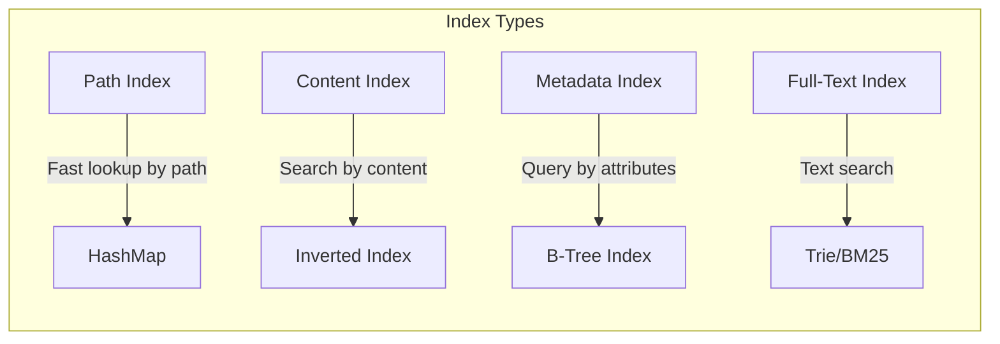

# Indexing and Search Deep Dive

## Introduction

This deep dive explores file indexing strategies, search algorithms, and metadata extraction techniques. We'll examine how to build efficient indexes for fast file discovery and search - essential for managing telescope test results at scale.

## Table of Contents

1. [File Indexing Strategies](#file-indexing-strategies)
2. [Metadata Extraction](#metadata-extraction)
3. [Search Algorithms](#search-algorithms)
4. [Full-Text Search](#full-text-search)
5. [Incremental Indexing](#incremental-indexing)
6. [telescope Index Analysis](#telescope-index-analysis)
7. [Rust Implementation](#rust-implementation)

---

## File Indexing Strategies

### Index Types

Different indexing strategies serve different use cases:



### Path Index

```rust
use std::collections::HashMap;
use std::path::{Path, PathBuf};
use std::sync::RwLock;

/// Simple path-based index
pub struct PathIndex {
    entries: RwLock<HashMap<PathBuf, IndexEntry>>,
}

#[derive(Debug, Clone)]
pub struct IndexEntry {
    pub path: PathBuf,
    pub size: u64,
    pub is_dir: bool,
    pub created: SystemTime,
    pub modified: SystemTime,
    pub content_hash: Option<[u8; 32]>,  // SHA-256
    pub parent: Option<PathBuf>,
    pub children: Vec<PathBuf>,
}

impl PathIndex {
    pub fn new() -> Self {
        Self {
            entries: RwLock::new(HashMap::new()),
        }
    }

    /// Insert or update an entry
    pub fn insert(&self, entry: IndexEntry) {
        let mut entries = self.entries.write().unwrap();

        // Update parent's children list
        if let Some(parent) = entry.parent.clone() {
            if let Some(parent_entry) = entries.get_mut(&parent) {
                if !parent_entry.children.contains(&entry.path) {
                    parent_entry.children.push(entry.path.clone());
                }
            }
        }

        entries.insert(entry.path.clone(), entry);
    }

    /// Get entry by path
    pub fn get(&self, path: &Path) -> Option<IndexEntry> {
        self.entries.read().unwrap().get(path).cloned()
    }

    /// List directory contents
    pub fn read_dir(&self, path: &Path) -> Vec<IndexEntry> {
        let entries = self.entries.read().unwrap();
        entries
            .get(path)
            .map(|entry| {
                entry
                    .children
                    .iter()
                    .filter_map(|child_path| entries.get(child_path).cloned())
                    .collect()
            })
            .unwrap_or_default()
    }

    /// Find all files matching a glob pattern
    pub fn glob(&self, pattern: &str) -> Vec<&IndexEntry> {
        let entries = self.entries.read().unwrap();
        let glob = glob::Pattern::new(pattern).ok();

        entries
            .values()
            .filter(|entry| {
                glob.as_ref()
                    .map(|g| g.matches(&entry.path.to_string_lossy()))
                    .unwrap_or(false)
            })
            .collect()
    }
}
```

### Content-Based Index (Inverted Index)

```rust
use std::collections::{HashMap, HashSet};

/// Inverted index for content search
pub struct ContentIndex {
    /// Map: term -> set of file paths containing term
    postings: RwLock<HashMap<String, HashSet<PathBuf>>>,
    /// Map: path -> set of terms in file (for deletion)
    file_terms: RwLock<HashMap<PathBuf, HashSet<String>>>,
}

impl ContentIndex {
    pub fn new() -> Self {
        Self {
            postings: RwLock::new(HashMap::new()),
            file_terms: RwLock::new(HashMap::new()),
        }
    }

    /// Index content from a file
    pub fn index_content(&self, path: &Path, content: &str) {
        // Tokenize content
        let terms = tokenize(content);

        // Add to postings list
        let mut postings = self.postings.write().unwrap();
        let mut file_terms = self.file_terms.write().unwrap();

        let mut term_set = HashSet::new();

        for term in terms {
            term_set.insert(term.clone());
            postings
                .entry(term)
                .or_insert_with(HashSet::new)
                .insert(path.to_path_buf());
        }

        // Remove old terms if file was previously indexed
        if let Some(old_terms) = file_terms.get(path) {
            for old_term in old_terms {
                if !term_set.contains(old_term) {
                    if let Some(paths) = postings.get_mut(old_term) {
                        paths.remove(path);
                    }
                }
            }
        }

        file_terms.insert(path.to_path_buf(), term_set);
    }

    /// Search for files containing a term
    pub fn search(&self, term: &str) -> HashSet<PathBuf> {
        self.postings
            .read()
            .unwrap()
            .get(term)
            .cloned()
            .unwrap_or_default()
    }

    /// Search for files containing all terms (AND)
    pub fn search_and(&self, terms: &[&str]) -> HashSet<PathBuf> {
        let postings = self.postings.read().unwrap();

        terms
            .iter()
            .filter_map(|term| postings.get(*term))
            .fold(None, |acc, set| {
                match acc {
                    None => Some(set.clone()),
                    Some(acc_set) => {
                        Some(acc_set.intersection(set).cloned().collect())
                    }
                }
            })
            .unwrap_or_default()
    }

    /// Search for files containing any term (OR)
    pub fn search_or(&self, terms: &[&str]) -> HashSet<PathBuf> {
        let postings = self.postings.read().unwrap();
        let mut result = HashSet::new();

        for term in terms {
            if let Some(paths) = postings.get(*term) {
                result.extend(paths);
            }
        }

        result
    }

    /// Remove file from index
    pub fn remove(&self, path: &Path) {
        let mut file_terms = self.file_terms.write().unwrap();
        let mut postings = self.postings.write().unwrap();

        if let Some(terms) = file_terms.remove(path) {
            for term in terms {
                if let Some(paths) = postings.get_mut(&term) {
                    paths.remove(path);
                    if paths.is_empty() {
                        postings.remove(&term);
                    }
                }
            }
        }
    }
}

/// Simple tokenizer (split on whitespace, lowercase)
fn tokenize(content: &str) -> Vec<String> {
    content
        .split_whitespace()
        .map(|s| s.to_lowercase())
        .collect()
}
```

### Metadata Index with B-Tree

```rust
use std::collections::BTreeMap;

/// Index for range queries on metadata
pub struct MetadataIndex {
    /// Index by size
    by_size: BTreeMap<u64, HashSet<PathBuf>>,
    /// Index by modified time
    by_modified: BTreeMap<SystemTime, HashSet<PathBuf>>,
    /// Index by file extension
    by_extension: HashMap<String, HashSet<PathBuf>>,
}

impl MetadataIndex {
    pub fn new() -> Self {
        Self {
            by_size: BTreeMap::new(),
            by_modified: BTreeMap::new(),
            by_extension: HashMap::new(),
        }
    }

    pub fn insert(&mut self, path: &Path, size: u64, modified: SystemTime) {
        // Index by size
        self.by_size
            .entry(size)
            .or_insert_with(HashSet::new)
            .insert(path.to_path_buf());

        // Index by modified time
        self.by_modified
            .entry(modified)
            .or_insert_with(HashSet::new)
            .insert(path.to_path_buf());

        // Index by extension
        if let Some(ext) = path.extension().and_then(|e| e.to_str()) {
            self.by_extension
                .entry(ext.to_lowercase())
                .or_insert_with(HashSet::new)
                .insert(path.to_path_buf());
        }
    }

    /// Find files by size range
    pub fn find_by_size_range(&self, min: u64, max: u64) -> HashSet<PathBuf> {
        let mut result = HashSet::new();

        for (size, paths) in self.by_size.range(min..=max) {
            result.extend(paths);
        }

        result
    }

    /// Find files modified after timestamp
    pub fn find_modified_after(&self, since: SystemTime) -> HashSet<PathBuf> {
        let mut result = HashSet::new();

        for (time, paths) in self.by_modified.range(since..)) {
            result.extend(paths);
        }

        result
    }

    /// Find files by extension
    pub fn find_by_extension(&self, ext: &str) -> Option<&HashSet<PathBuf>> {
        self.by_extension.get(&ext.to_lowercase())
    }
}
```

---

## Metadata Extraction

### File Metadata Structure

```rust
use std::time::{SystemTime, Duration};
use serde::{Serialize, Deserialize};

/// Comprehensive file metadata
#[derive(Debug, Clone, Serialize, Deserialize)]
pub struct FileMetadata {
    /// Absolute path
    pub path: PathBuf,

    /// Basic info
    pub size: u64,
    pub is_dir: bool,
    pub is_symlink: bool,
    pub is_file: bool,

    /// Timestamps
    pub created: Option<SystemTime>,
    pub modified: Option<SystemTime>,
    pub accessed: Option<SystemTime>,

    /// Permissions
    pub permissions: Option<Permissions>,
    pub owner: Option<u32>,
    pub group: Option<u32>,

    /// Content info
    pub content_type: Option<String>,  // MIME type
    pub content_hash: Option<ContentHash>,

    /// Extended attributes
    pub extended_attrs: HashMap<String, Vec<u8>>,
}

#[derive(Debug, Clone, Serialize, Deserialize)]
pub struct ContentHash {
    pub sha256: [u8; 32],
    pub md5: Option<[u8; 16]>,  // Optional for compatibility
}

/// Permissions (POSIX-style)
#[derive(Debug, Clone, Serialize, Deserialize)]
pub struct Permissions {
    pub mode: u32,  // Raw mode bits
    pub is_readonly: bool,
    pub owner_readable: bool,
    pub owner_writable: bool,
    pub owner_executable: bool,
}

impl FileMetadata {
    /// Extract metadata from filesystem
    pub fn from_path(path: &Path) -> Result<Self, MetadataError> {
        let metadata = std::fs::metadata(path)?;
        let symlink_metadata = std::fs::symlink_metadata(path)?;

        Ok(Self {
            path: path.to_path_buf(),
            size: metadata.len(),
            is_dir: metadata.is_dir(),
            is_symlink: symlink_metadata.file_type().is_symlink(),
            is_file: metadata.is_file(),
            created: metadata.created().ok(),
            modified: metadata.modified().ok(),
            accessed: symlink_metadata.accessed().ok(),
            permissions: Some(Permissions::from_metadata(&metadata)),
            owner: Some(metadata.uid()),
            group: Some(metadata.gid()),
            content_type: None,  // Would need content sniffing
            content_hash: None,  // Would need to read file
            extended_attrs: HashMap::new(),
        })
    }

    /// Compute content hash
    pub fn compute_hash(&mut self) -> Result<(), MetadataError> {
        if !self.is_file {
            return Ok(());
        }

        let mut file = std::fs::File::open(&self.path)?;
        let mut hasher = sha2::Sha256::new();
        std::io::copy(&mut file, &mut hasher)?;
        let hash = hasher.finish();

        self.content_hash = Some(ContentHash {
            sha256: hash,
            md5: None,
        });

        Ok(())
    }

    /// Detect content type from magic bytes
    pub fn detect_content_type(&mut self) -> Result<(), MetadataError> {
        if !self.is_file {
            return Ok(());
        }

        let mut file = std::fs::File::open(&self.path)?;
        let mut header = [0u8; 512];
        let bytes_read = file.read(&mut header)?;

        self.content_type = Some(infer::get(&header[..bytes_read])
            .map(|mime| mime.to_string())
            .unwrap_or_else(|| "application/octet-stream".to_string()));

        Ok(())
    }

    /// Check if file has changed
    pub fn has_changed(&self, other: &Self) -> bool {
        self.modified != other.modified
            || self.size != other.size
            || self.content_hash != other.content_hash
    }
}
```

### telescope-Specific Metadata

```rust
/// Metadata for telescope test results
#[derive(Debug, Clone, Serialize, Deserialize)]
pub struct TestResultMetadata {
    /// Test ID
    pub test_id: String,

    /// Test configuration
    pub config: TestConfig,

    /// Timing info
    pub started_at: SystemTime,
    pub completed_at: SystemTime,
    pub duration: Duration,

    /// Result files
    pub files: Vec<ResultFile>,

    /// Performance metrics summary
    pub metrics_summary: MetricsSummary,

    /// Success/failure status
    pub status: TestStatus,

    /// Error message (if failed)
    pub error: Option<String>,
}

#[derive(Debug, Clone, Serialize, Deserialize)]
pub struct ResultFile {
    pub name: String,
    pub path: PathBuf,
    pub size: u64,
    pub content_type: String,
    pub is_generated: bool,  // Generated during post-processing
}

#[derive(Debug, Clone, Serialize, Deserialize)]
pub struct MetricsSummary {
    pub navigation_timing: Option<NavigationTimingSummary>,
    pub paint_timing: Vec<PaintTimingSummary>,
    pub lcp: Option<f64>,  // Largest Contentful Paint (ms)
    pub cls: Option<f64>,  // Cumulative Layout Shift
    pub fid: Option<f64>,  // First Input Delay
}

#[derive(Debug, Clone, Serialize, Deserialize)]
pub enum TestStatus {
    Success,
    Failed,
    Timeout,
    Error,
}

/// Index entry for telescope results
pub struct TestResultIndexEntry {
    pub metadata: TestResultMetadata,
    pub indexed_at: SystemTime,
    pub tags: HashSet<String>,  // For categorization
}

impl TestResultIndexEntry {
    /// Create index entry from test result
    pub fn from_result(result: &TestResult, path: &Path) -> Result<Self, IndexError> {
        let mut entry = Self {
            metadata: extract_metadata(result)?,
            indexed_at: SystemTime::now(),
            tags: HashSet::new(),
        };

        // Auto-generate tags
        entry.tags.insert(format!("browser:{}", result.config.browser));
        entry.tags.insert(format!("url:{}", hash_url(&result.config.url)));

        if let Some(conn) = result.config.connection_type {
            entry.tags.insert(format!("network:{}", conn));
        }

        if result.metrics_summary.lcp.unwrap_or(0.0) > 2500.0 {
            entry.tags.insert("slow-lcp".to_string());
        }

        Ok(entry)
    }
}
```

---

## Search Algorithms

### Basic Search

```rust
/// Search query types
#[derive(Debug, Clone)]
pub enum SearchQuery {
    /// Simple text search
    Text(String),

    /// Field-specific search
    Field { field: String, value: String },

    /// Range query
    Range { field: String, min: Option<Value>, max: Option<Value> },

    /// Boolean combination
    And(Vec<SearchQuery>),
    Or(Vec<SearchQuery>),
    Not(Box<SearchQuery>),

    /// Glob pattern
    Glob(String),

    /// Regular expression
    Regex(regex::Regex),
}

/// Search result
#[derive(Debug, Clone)]
pub struct SearchResult {
    pub path: PathBuf,
    pub score: f64,
    pub highlights: Vec<Highlight>,
}

#[derive(Debug, Clone)]
pub struct Highlight {
    pub field: String,
    pub text: String,
    pub positions: Vec<std::ops::Range<usize>>,
}

/// Search engine
pub struct SearchEngine {
    index: Arc<ContentIndex>,
    path_index: Arc<PathIndex>,
    metadata_index: Arc<MetadataIndex>,
}

impl SearchEngine {
    pub fn search(&self, query: &SearchQuery, limit: usize) -> Vec<SearchResult> {
        match query {
            SearchQuery::Text(text) => self.search_text(text, limit),
            SearchQuery::Field { field, value } => self.search_field(field, value, limit),
            SearchQuery::Range { field, min, max } => self.search_range(field, min, max, limit),
            SearchQuery::And(queries) => self.search_and(queries, limit),
            SearchQuery::Or(queries) => self.search_or(queries, limit),
            SearchQuery::Not(query) => self.search_not(query, limit),
            SearchQuery::Glob(pattern) => self.search_glob(pattern, limit),
            SearchQuery::Regex(regex) => self.search_regex(regex, limit),
        }
    }

    fn search_text(&self, text: &str, limit: usize) -> Vec<SearchResult> {
        let terms = tokenize(text);
        let paths = self.index.search_or(&terms.iter().map(|s| s.as_str()).collect::<Vec<_>>());

        paths
            .into_iter()
            .map(|path| SearchResult {
                path,
                score: 1.0,  // Would compute relevance score
                highlights: vec![],
            })
            .take(limit)
            .collect()
    }

    fn search_glob(&self, pattern: &str, limit: usize) -> Vec<SearchResult> {
        self.path_index
            .glob(pattern)
            .into_iter()
            .map(|entry| SearchResult {
                path: entry.path.clone(),
                score: 1.0,
                highlights: vec![],
            })
            .take(limit)
            .collect()
    }

    fn search_and(&self, queries: &[SearchQuery], limit: usize) -> Vec<SearchResult> {
        // Start with all results, filter by each query
        let mut results: HashSet<PathBuf> = self
            .path_index
            .glob("*")
            .into_iter()
            .map(|e| e.path.clone())
            .collect();

        for query in queries {
            let matches: HashSet<PathBuf> = self
                .search(query, usize::MAX)
                .into_iter()
                .map(|r| r.path)
                .collect();

            results = results.intersection(&matches).cloned().collect();
        }

        results
            .into_iter()
            .map(|path| SearchResult {
                path,
                score: 1.0,
                highlights: vec![],
            })
            .take(limit)
            .collect()
    }

    fn search_or(&self, queries: &[SearchQuery], limit: usize) -> Vec<SearchResult> {
        let mut results: HashMap<PathBuf, f64> = HashMap::new();

        for query in queries {
            for result in self.search(query, usize::MAX) {
                *results.entry(result.path.clone()).or_insert(0.0) += result.score;
            }
        }

        let mut sorted: Vec<_> = results.into_iter().collect();
        sorted.sort_by(|a, b| b.1.partial_cmp(&a.1).unwrap());

        sorted
            .into_iter()
            .take(limit)
            .map(|(path, score)| SearchResult {
                path,
                score,
                highlights: vec![],
            })
            .collect()
    }
}
```

### BM25 Scoring for Full-Text Search

```rust
use std::f64::consts::LN2;

/// BM25 parameters
pub struct BM25Params {
    pub k1: f64,  // Term frequency saturation (typically 1.2-2.0)
    pub b: f64,   // Length normalization (typically 0.75)
}

impl Default for BM25Params {
    fn default() -> Self {
        Self { k1: 1.5, b: 0.75 }
    }
}

/// BM25 scorer
pub struct BM25Scorer {
    params: BM25Params,
    /// Total number of documents
    n_docs: usize,
    /// Document frequencies (term -> count of docs containing term)
    doc_freq: HashMap<String, usize>,
    /// Document lengths
    doc_lengths: HashMap<PathBuf, usize>,
    /// Average document length
    avg_doc_length: f64,
}

impl BM25Scorer {
    pub fn new(params: BM25Params) -> Self {
        Self {
            params,
            n_docs: 0,
            doc_freq: HashMap::new(),
            doc_lengths: HashMap::new(),
            avg_doc_length: 0.0,
        }
    }

    /// Update statistics from index
    pub fn update_stats(&mut self, index: &ContentIndex) {
        let postings = index.postings.read().unwrap();
        let file_terms = index.file_terms.read().unwrap();

        self.n_docs = file_terms.len();

        // Compute document frequencies
        self.doc_freq = postings
            .iter()
            .map(|(term, paths)| (term.clone(), paths.len()))
            .collect();

        // Compute average document length
        let total_length: usize = file_terms.values().map(|terms| terms.len()).sum();
        self.avg_doc_length = total_length as f64 / self.n_docs.max(1) as f64;
    }

    /// Compute BM25 score for a term in a document
    pub fn score(&self, term: &str, doc: &PathBuf, term_freq: usize) -> f64 {
        // Inverse document frequency
        let df = self.doc_freq.get(term).copied().unwrap_or(0) as f64;
        let idf = ((self.n_docs as f64 - df + 0.5) / (df + 0.5) + 1.0).ln();

        // Term frequency with saturation
        let doc_len = self.doc_lengths.get(doc).copied().unwrap_or(0) as f64;
        let norm = 1.0 - self.params.b + self.params.b * (doc_len / self.avg_doc_length.max(1.0));
        let tf = (term_freq as f64 * (self.params.k1 + 1.0))
            / (term_freq as f64 + self.params.k1 * norm);

        idf * tf
    }

    /// Score a document for a multi-term query
    pub fn score_document(&self, doc: &PathBuf, terms: &[&str]) -> f64 {
        let file_terms = self
            .doc_lengths
            .get(doc)
            .map(|_| HashSet::new())  // Would need term frequencies per doc
            .unwrap_or_default();

        terms
            .iter()
            .map(|term| {
                let tf = 1;  // Would get actual term frequency
                self.score(term, doc, tf)
            })
            .sum()
    }
}
```

---

## Full-Text Search

### Trie-Based Index

```rust
use std::collections::HashMap;

/// Trie node for prefix search
#[derive(Debug, Clone)]
pub struct TrieNode {
    children: HashMap<char, TrieNode>,
    /// Document IDs that contain word ending at this node
    doc_ids: HashSet<PathBuf>,
    /// Is this the end of a word?
    is_end: bool,
}

impl TrieNode {
    pub fn new() -> Self {
        Self {
            children: HashMap::new(),
            doc_ids: HashSet::new(),
            is_end: false,
        }
    }

    /// Insert a word
    pub fn insert(&mut self, word: &str, doc: &PathBuf) {
        let mut node = self;

        for ch in word.chars() {
            node = node.children.entry(ch).or_insert_with(TrieNode::new);
        }

        node.is_end = true;
        node.doc_ids.insert(doc.clone());
    }

    /// Search for prefix
    pub fn search_prefix(&self, prefix: &str) -> HashSet<PathBuf> {
        let mut node = self;

        for ch in prefix.chars() {
            match node.children.get(&ch) {
                Some(child) => node = child,
                None => return HashSet::new(),
            }
        }

        // Collect all doc_ids in subtree
        let mut result = node.doc_ids.clone();
        self.collect_all_docs(node, &mut result);
        result
    }

    fn collect_all_docs(&self, node: &TrieNode, result: &mut HashSet<PathBuf>) {
        result.extend(&node.doc_ids);
        for child in node.children.values() {
            self.collect_all_docs(child, result);
        }
    }

    /// Search for exact word
    pub fn search(&self, word: &str) -> Option<&HashSet<PathBuf>> {
        let mut node = self;

        for ch in word.chars() {
            match node.children.get(&ch) {
                Some(child) => node = child,
                None => return None,
            }
        }

        if node.is_end {
            Some(&node.doc_ids)
        } else {
            None
        }
    }
}

/// Full-text search index using trie
pub struct FullTextIndex {
    trie: RwLock<TrieNode>,
    /// Document content cache
    documents: RwLock<HashMap<PathBuf, String>>,
}

impl FullTextIndex {
    pub fn index_document(&self, path: &Path, content: &str) {
        // Store document
        self.documents
            .write()
            .unwrap()
            .insert(path.to_path_buf(), content.to_string());

        // Index each word
        let mut trie = self.trie.write().unwrap();
        for word in tokenize(content) {
            trie.insert(&word, path);
        }
    }

    /// Prefix search (autocomplete)
    pub fn prefix_search(&self, prefix: &str) -> Vec<PathBuf> {
        self.trie.read().unwrap().search_prefix(prefix).into_iter().collect()
    }

    /// Full-text search with ranking
    pub fn search(&self, query: &str) -> Vec<SearchResult> {
        let terms = tokenize(query);
        let trie = self.trie.read().unwrap();
        let documents = self.documents.read().unwrap();

        // Count term matches per document
        let mut doc_scores: HashMap<PathBuf, f64> = HashMap::new();

        for term in &terms {
            if let Some(doc_ids) = trie.search(term) {
                for doc in doc_ids {
                    *doc_scores.entry(doc.clone()).or_insert(0.0) += 1.0;
                }
            }
        }

        // Sort by score
        let mut results: Vec<_> = doc_scores.into_iter().collect();
        results.sort_by(|a, b| b.1.partial_cmp(&a.1).unwrap());

        results
            .into_iter()
            .map(|(path, score)| SearchResult {
                path,
                score,
                highlights: vec![],
            })
            .collect()
    }
}
```

---

## Incremental Indexing

### Watch-Based Indexing

```rust
use notify::{Event, EventKind, RecommendedWatcher, RecursiveMode, Watcher};

/// Incremental indexer with file watching
pub struct IncrementalIndexer {
    index: Arc<PathIndex>,
    watcher: RecommendedWatcher,
    watched_paths: HashSet<PathBuf>,
    tx: mpsc::Sender<Event>,
    rx: mpsc::Receiver<Event>,
}

impl IncrementalIndexer {
    pub fn new(index: Arc<PathIndex>) -> Result<Self, notify::Error> {
        let (tx, rx) = mpsc::channel();

        let watcher = RecommendedWatcher::new(
            move |event: Result<Event, notify::Error>| {
                if let Ok(event) = event {
                    tx.send(event).ok();
                }
            },
            notify::Config::default(),
        )?;

        Ok(Self {
            index,
            watcher,
            watched_paths: HashSet::new(),
            tx,
            rx,
        })
    }

    /// Watch a path for changes
    pub fn watch(&mut self, path: &Path, recursive: bool) -> Result<(), notify::Error> {
        let mode = if recursive {
            RecursiveMode::Recursive
        } else {
            RecursiveMode::NonRecursive
        };

        self.watcher.watch(path, mode)?;
        self.watched_paths.insert(path.to_path_buf());

        Ok(())
    }

    /// Run indexer event loop
    pub fn run(&mut self) -> Result<(), IndexerError> {
        loop {
            match self.rx.recv() {
                Ok(event) => self.handle_event(event)?,
                Err(_) => return Err(IndexerError::ChannelClosed),
            }
        }
    }

    fn handle_event(&mut self, event: Event) -> Result<(), IndexerError> {
        match event.kind {
            EventKind::Create(_) => {
                for path in event.paths {
                    self.index_file(&path)?;
                }
            }
            EventKind::Modify(_) => {
                for path in event.paths {
                    self.index_file(&path)?;
                }
            }
            EventKind::Remove(_) => {
                for path in event.paths {
                    self.remove_from_index(&path);
                }
            }
            _ => {}
        }

        Ok(())
    }

    fn index_file(&self, path: &Path) -> Result<(), IndexerError> {
        let metadata = FileMetadata::from_path(path)?;
        self.index.insert(IndexEntry::from_metadata(&metadata));
        Ok(())
    }

    fn remove_from_index(&self, path: &Path) {
        // Would need to implement removal in PathIndex
    }
}
```

### Batch Indexing with Checkpointing

```rust
use std::time::Duration;

/// Batch indexer with periodic checkpointing
pub struct BatchIndexer {
    index: Arc<PathIndex>,
    /// Pending updates
    pending: Vec<IndexUpdate>,
    /// Batch size before flush
    batch_size: usize,
    /// Checkpoint interval
    checkpoint_interval: Duration,
    last_checkpoint: Instant,
}

#[derive(Debug, Clone)]
pub enum IndexUpdate {
    Insert(PathBuf, IndexEntry),
    Delete(PathBuf),
}

impl BatchIndexer {
    pub fn new(index: Arc<PathIndex>, batch_size: usize, checkpoint_interval: Duration) -> Self {
        Self {
            index,
            pending: Vec::with_capacity(batch_size),
            batch_size,
            checkpoint_interval,
            last_checkpoint: Instant::now(),
        }
    }

    /// Queue an update
    pub fn queue(&mut self, update: IndexUpdate) -> Result<(), IndexerError> {
        self.pending.push(update);

        // Auto-flush if batch is full
        if self.pending.len() >= self.batch_size {
            self.flush()?;
        }

        // Auto-checkpoint if interval elapsed
        if self.last_checkpoint.elapsed() >= self.checkpoint_interval {
            self.checkpoint()?;
        }

        Ok(())
    }

    /// Flush pending updates to index
    pub fn flush(&mut self) -> Result<(), IndexerError> {
        for update in self.pending.drain(..) {
            match update {
                IndexUpdate::Insert(path, entry) => {
                    self.index.insert(entry);
                }
                IndexUpdate::Delete(path) => {
                    // Would need delete method on PathIndex
                }
            }
        }

        Ok(())
    }

    /// Save checkpoint to disk
    pub fn checkpoint(&mut self) -> Result<(), IndexerError> {
        // Serialize index to checkpoint file
        let checkpoint_data = self.serialize_index()?;
        std::fs::write(".index_checkpoint.bin", &checkpoint_data)?;
        self.last_checkpoint = Instant::now();

        Ok(())
    }

    fn serialize_index(&self) -> Result<Vec<u8>, IndexerError> {
        // Would serialize index state
        Ok(vec![])
    }

    /// Load from checkpoint
    pub fn restore_from_checkpoint(&mut self) -> Result<(), IndexerError> {
        if let Ok(data) = std::fs::read(".index_checkpoint.bin") {
            // Would deserialize and restore index
        }
        Ok(())
    }
}
```

---

## telescope Index Analysis

### Current telescope Result Storage

```typescript
// telescope stores results in flat directory structure
results/
├── 2026_03_28_14_30_00_abc123/
│   ├── config.json
│   ├── metrics.json
│   ├── console.json
│   └── ...
├── 2026_03_28_15_00_00_def456/
│   └── ...
└── index.html  # Simple list of results

// No indexing beyond the HTML list
// Finding specific results requires scanning all directories
```

### Adding Index to telescope

```typescript
// Add indexing to telescope
import { writeFileSync, readdirSync } from 'fs';
import { createHash } from 'crypto';

interface ResultIndex {
  version: number;
  entries: ResultIndexEntry[];
  lastUpdated: string;
}

interface ResultIndexEntry {
  testId: string;
  path: string;
  url: string;
  browser: string;
  timestamp: string;
  duration: number;
  status: 'success' | 'failed';
  metrics: {
    lcp?: number;
    cls?: number;
    ttfb?: number;
  };
}

class ResultIndexer {
  private indexPath: string = './results/index.json';
  private index: ResultIndex;

  constructor() {
    this.index = this.loadIndex();
  }

  private loadIndex(): ResultIndex {
    try {
      return JSON.parse(readFileSync(this.indexPath, 'utf-8'));
    } catch {
      return { version: 1, entries: [], lastUpdated: new Date().toISOString() };
    }
  }

  addResult(entry: ResultIndexEntry): void {
    // Check for duplicate
    const existingIndex = this.index.entries.findIndex(e => e.testId === entry.testId);
    if (existingIndex !== -1) {
      this.index.entries[existingIndex] = entry;  // Update
    } else {
      this.index.entries.push(entry);
    }

    // Sort by timestamp descending
    this.index.entries.sort((a, b) =>
      new Date(b.timestamp).getTime() - new Date(a.timestamp).getTime()
    );

    this.index.lastUpdated = new Date().toISOString();
    this.saveIndex();
  }

  search(query: {
    url?: string;
    browser?: string;
    status?: string;
    dateFrom?: string;
    dateTo?: string;
    slowLcp?: boolean;
  }): ResultIndexEntry[] {
    return this.index.entries.filter(entry => {
      if (query.url && !entry.url.includes(query.url)) return false;
      if (query.browser && entry.browser !== query.browser) return false;
      if (query.status && entry.status !== query.status) return false;
      if (query.dateFrom && entry.timestamp < query.dateFrom) return false;
      if (query.dateTo && entry.timestamp > query.dateTo) return false;
      if (query.slowLcp && (entry.metrics.lcp ?? 0) <= 2500) return false;
      return true;
    });
  }

  private saveIndex(): void {
    writeFileSync(this.indexPath, JSON.stringify(this.index, null, 2));
  }
}
```

---

## Rust Implementation

### Complete Index Implementation for Rust telescope

```rust
use std::path::{Path, PathBuf};
use std::sync::Arc;
use tokio::sync::RwLock;
use serde::{Serialize, Deserialize};
use dashmap::DashMap;

/// Combined index for telescope results
pub struct TestResultIndex {
    /// Path-based lookup
    by_path: DashMap<PathBuf, TestResultEntry>,
    /// URL-based lookup
    by_url: DashMap<String, Vec<PathBuf>>,
    /// Browser-based lookup
    by_browser: DashMap<String, Vec<PathBuf>>,
    /// Time-based index (timestamp -> path)
    by_time: BTreeMap<i64, PathBuf>,
    /// Full-text search index
    full_text: Arc<FullTextIndex>,
    /// Persisted index file
    index_path: PathBuf,
}

#[derive(Debug, Clone, Serialize, Deserialize)]
pub struct TestResultEntry {
    pub test_id: String,
    pub path: PathBuf,
    pub url: String,
    pub browser: String,
    pub timestamp: i64,  // Unix timestamp ms
    pub duration_ms: u64,
    pub status: TestStatus,
    pub metrics: TestMetrics,
    pub tags: Vec<String>,
}

#[derive(Debug, Clone, Serialize, Deserialize)]
pub enum TestStatus {
    Success,
    Failed,
    Timeout,
}

#[derive(Debug, Clone, Serialize, Deserialize)]
pub struct TestMetrics {
    pub lcp_ms: Option<f64>,
    pub cls: Option<f64>,
    pub ttfb_ms: Option<f64>,
    pub fcp_ms: Option<f64>,
}

impl TestResultIndex {
    pub fn new(index_path: PathBuf) -> Result<Self, IndexError> {
        let mut index = Self {
            by_path: DashMap::new(),
            by_url: DashMap::new(),
            by_browser: DashMap::new(),
            by_time: BTreeMap::new(),
            full_text: Arc::new(FullTextIndex::new()),
            index_path,
        };

        // Load existing index
        index.load()?;

        Ok(index)
    }

    /// Add a test result to the index
    pub fn add(&self, entry: TestResultEntry) {
        // Add to path index
        self.by_path.insert(entry.path.clone(), entry.clone());

        // Add to URL index
        self.by_url
            .entry(entry.url.clone())
            .or_insert_with(Vec::new)
            .push(entry.path.clone());

        // Add to browser index
        self.by_browser
            .entry(entry.browser.clone())
            .or_insert_with(Vec::new)
            .push(entry.path.clone());

        // Add to time index
        self.by_time.insert(entry.timestamp, entry.path.clone());

        // Add to full-text index
        let content = format!("{} {}", entry.url, entry.test_id);
        self.full_text.index_document(&entry.path, &content);
    }

    /// Get entry by path
    pub fn get_by_path(&self, path: &Path) -> Option<TestResultEntry> {
        self.by_path.get(path).map(|r| r.clone())
    }

    /// Get entries by URL
    pub fn get_by_url(&self, url: &str) -> Vec<TestResultEntry> {
        self.by_url
            .get(url)
            .map(|paths| {
                paths
                    .iter()
                    .filter_map(|p| self.by_path.get(p).map(|r| r.clone()))
                    .collect()
            })
            .unwrap_or_default()
    }

    /// Search with query
    pub fn search(&self, query: &SearchQuery) -> Vec<TestResultEntry> {
        match query {
            SearchQuery::UrlContains(substring) => {
                self.by_url
                    .iter()
                    .filter(|r| r.key().contains(substring))
                    .flat_map(|r| r.value().clone())
                    .filter_map(|p| self.by_path.get(&p).map(|e| e.clone()))
                    .collect()
            }
            SearchQuery::BrowserEquals(browser) => {
                self.by_browser
                    .get(browser)
                    .map(|paths| {
                        paths
                            .iter()
                            .filter_map(|p| self.by_path.get(p).map(|r| r.clone()))
                            .collect()
                    })
                    .unwrap_or_default()
            }
            SearchQuery::TimeRange { start, end } => {
                self.by_time
                    .range(start..=end)
                    .map(|(_, p)| self.by_path.get(p).map(|r| r.clone()))
                    .flatten()
                    .collect()
            }
            SearchQuery::TextSearch(text) => {
                let paths = self.full_text.search(text);
                paths
                    .into_iter()
                    .filter_map(|p| self.by_path.get(&p).map(|r| r.clone()))
                    .collect()
            }
            SearchQuery::SlowLcp { threshold_ms } => {
                self.by_path
                    .iter()
                    .filter(|r| {
                        r.value()
                            .metrics
                            .lcp_ms
                            .map(|lcp| lcp > *threshold_ms)
                            .unwrap_or(false)
                    })
                    .map(|r| r.clone())
                    .collect()
            }
        }
    }

    /// Save index to disk
    pub fn save(&self) -> Result<(), IndexError> {
        let entries: Vec<TestResultEntry> =
            self.by_path.iter().map(|r| r.clone()).collect();

        let index_data = IndexData {
            version: 1,
            entries,
            last_updated: chrono::Utc::now().timestamp_millis(),
        };

        let json = serde_json::to_string_pretty(&index_data)?;
        std::fs::write(&self.index_path, json)?;

        Ok(())
    }

    /// Load index from disk
    pub fn load(&mut self) -> Result<(), IndexError> {
        if !self.index_path.exists() {
            return Ok(());
        }

        let data = std::fs::read_to_string(&self.index_path)?;
        let index_data: IndexData = serde_json::from_str(&data)?;

        for entry in index_data.entries {
            self.add(entry);
        }

        Ok(())
    }

    /// Remove old entries (retention policy)
    pub fn remove_old(&self, max_age_days: u32) -> Result<usize, IndexError> {
        let cutoff = chrono::Utc::now().timestamp_millis()
            - (max_age_days as i64 * 24 * 60 * 60 * 1000);

        let mut removed = 0;
        let mut to_remove = Vec::new();

        for entry in self.by_path.iter() {
            if entry.timestamp < cutoff {
                to_remove.push(entry.path.clone());
            }
        }

        for path in to_remove {
            if let Some(entry) = self.by_path.remove(&path) {
                // Remove from secondary indexes
                if let Some(urls) = self.by_url.get_mut(&entry.url) {
                    urls.retain(|p| p != &path);
                }
                if let Some(browsers) = self.by_browser.get_mut(&entry.browser) {
                    browsers.retain(|p| p != &path);
                }
                self.by_time.remove(&entry.timestamp);
                removed += 1;
            }
        }

        Ok(removed)
    }
}

#[derive(Debug, Clone, Serialize, Deserialize)]
struct IndexData {
    version: u32,
    entries: Vec<TestResultEntry>,
    last_updated: i64,
}

/// Search query types
#[derive(Debug, Clone)]
pub enum SearchQuery {
    UrlContains(String),
    BrowserEquals(String),
    TimeRange { start: i64, end: i64 },
    TextSearch(String),
    SlowLcp { threshold_ms: f64 },
}
```

---

## Summary

| Topic | Key Points |
|-------|------------|
| Index Types | Path, content, metadata, full-text indexes |
| Metadata Extraction | File stats, content hashes, MIME types |
| Search Algorithms | Boolean search, BM25 scoring, glob patterns |
| Full-Text Search | Trie-based prefix search, inverted indexes |
| Incremental Indexing | Watch-based, batch indexing with checkpointing |
| telescope | Currently no index, opportunity for search capabilities |

---

## Next Steps

Continue to [04-sync-replication-deep-dive.md](04-sync-replication-deep-dive.md) for exploration of:
- Sync protocols
- Conflict resolution strategies
- Delta synchronization
- Replication patterns
