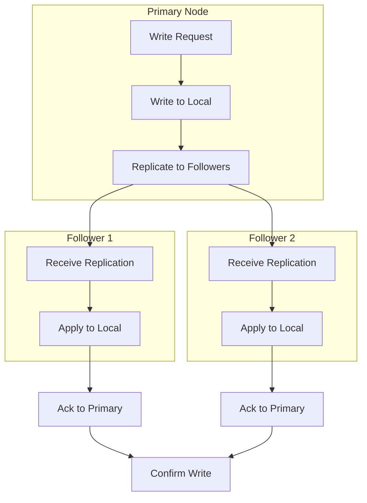
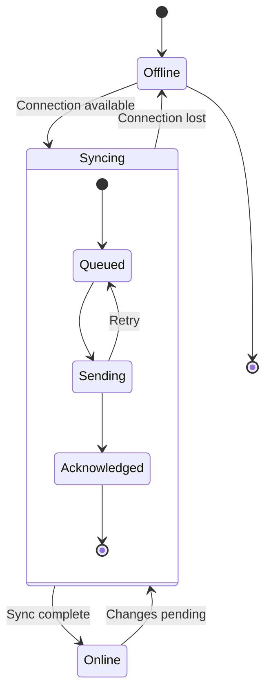

# Sync and Replication Deep Dive

## Introduction

This deep dive explores synchronization protocols, conflict resolution strategies, and replication patterns. These concepts are essential for distributed storage systems and enabling telescope to sync test results across multiple locations.

## Table of Contents

1. [Sync Protocols](#sync-protocols)
2. [Conflict Resolution](#conflict-resolution)
3. [Delta Synchronization](#delta-synchronization)
4. [Replication Strategies](#replication-strategies)
5. [Offline-First Patterns](#offline-first-patterns)
6. [telescope Sync Analysis](#telescope-sync-analysis)
7. [Rust Implementation](#rust-implementation)

---

## Sync Protocols

### Two-Phase Commit Protocol

```rust
use std::collections::HashMap;

/// Two-phase commit for distributed sync
pub struct TwoPhaseCommit {
    /// Pending transactions
    pending: HashMap<TransactionId, Transaction>,
    /// Participants in the commit
    participants: Vec<SyncNode>,
}

#[derive(Debug, Clone, Copy, PartialEq, Eq, Hash)]
pub struct TransactionId(u64);

#[derive(Debug, Clone)]
pub struct Transaction {
    pub id: TransactionId,
    pub operations: Vec<SyncOperation>,
    pub state: TransactionState,
}

#[derive(Debug, Clone, PartialEq)]
pub enum TransactionState {
    Pending,
    Prepared,
    Committed,
    Aborted,
}

#[derive(Debug, Clone)]
pub enum SyncOperation {
    Create { path: PathBuf, content: Vec<u8> },
    Update { path: PathBuf, content: Vec<u8>, version: u64 },
    Delete { path: PathBuf, version: u64 },
}

impl TwoPhaseCommit {
    pub fn new(participants: Vec<SyncNode>) -> Self {
        Self {
            pending: HashMap::new(),
            participants,
        }
    }

    /// Phase 1: Prepare
    pub async fn prepare(&mut self, tx: Transaction) -> Result<bool, SyncError> {
        let tx_id = tx.id;

        // Send prepare request to all participants
        let mut prepare_futures = Vec::new();
        for participant in &self.participants {
            prepare_futures.push(participant.prepare(tx.clone()));
        }

        // Wait for all prepare responses
        let results = futures::future::join_all(prepare_futures).await;

        // Check if all participants voted yes
        let all_prepared = results.iter().all(|r| r.is_ok());

        if all_prepared {
            self.pending.insert(tx_id, tx);
            Ok(true)
        } else {
            // Abort if any participant failed
            self.abort(tx_id).await?;
            Ok(false)
        }
    }

    /// Phase 2: Commit
    pub async fn commit(&mut self, tx_id: TransactionId) -> Result<(), SyncError> {
        let tx = self.pending.remove(&tx_id).ok_or(SyncError::UnknownTransaction)?;

        // Send commit to all participants
        let mut commit_futures = Vec::new();
        for participant in &self.participants {
            commit_futures.push(participant.commit(tx_id));
        }

        futures::future::join_all(commit_futures).await;

        // Mark as committed
        Ok(())
    }

    /// Abort transaction
    pub async fn abort(&mut self, tx_id: TransactionId) -> Result<(), SyncError> {
        self.pending.remove(&tx_id);

        // Send abort to all participants
        for participant in &self.participants {
            participant.abort(tx_id).await?;
        }

        Ok(())
    }
}
```

### Vector Clock Synchronization

```rust
use std::collections::HashMap;

/// Vector clock for causality tracking
#[derive(Debug, Clone, PartialEq, Eq)]
pub struct VectorClock {
    clocks: HashMap<NodeId, u64>,
}

impl VectorClock {
    pub fn new() -> Self {
        Self {
            clocks: HashMap::new(),
        }
    }

    /// Increment clock for a node
    pub fn increment(&mut self, node_id: NodeId) {
        *self.clocks.entry(node_id).or_insert(0) += 1;
    }

    /// Merge with another vector clock
    pub fn merge(&mut self, other: &VectorClock) {
        for (node_id, time) in &other.clocks {
            let entry = self.clocks.entry(*node_id).or_insert(0);
            *entry = (*entry).max(*time);
        }
    }

    /// Compare two vector clocks
    pub fn compare(&self, other: &VectorClock) -> ClockOrdering {
        let mut less = false;
        let mut greater = false;

        // Check all clocks in self
        for (node_id, time) in &self.clocks {
            let other_time = other.clocks.get(node_id).copied().unwrap_or(0);
            if time < &other_time {
                less = true;
            } else if time > &other_time {
                greater = true;
            }
        }

        // Check all clocks in other
        for (node_id, time) in &other.clocks {
            let self_time = self.clocks.get(node_id).copied().unwrap_or(0);
            if &self_time < time {
                less = true;
            } else if &self_time > time {
                greater = true;
            }
        }

        match (less, greater) {
            (true, false) => ClockOrdering::Before,
            (false, true) => ClockOrdering::After,
            (false, false) => ClockOrdering::Equal,
            (true, true) => ClockOrdering::Concurrent,
        }
    }
}

#[derive(Debug, Clone, Copy, PartialEq, Eq)]
pub enum ClockOrdering {
    Before,
    After,
    Equal,
    Concurrent,
}

/// Sync message with vector clock
#[derive(Debug, Clone)]
pub struct SyncMessage {
    pub node_id: NodeId,
    pub clock: VectorClock,
    pub operations: Vec<SyncOperation>,
}
```

### CRDT-Based Synchronization

```rust
use std::collections::BTreeMap;

/// G-Counter (Grow-only Counter) CRDT
#[derive(Debug, Clone)]
pub struct GCounter {
    counts: HashMap<NodeId, u64>,
}

impl GCounter {
    pub fn new() -> Self {
        Self {
            counts: HashMap::new(),
        }
    }

    pub fn increment(&mut self, node_id: NodeId, amount: u64) {
        *self.counts.entry(node_id).or_insert(0) += amount;
    }

    pub fn value(&self) -> u64 {
        self.counts.values().sum()
    }

    pub fn merge(&mut self, other: &GCounter) {
        for (node_id, count) in &other.counts {
            let entry = self.counts.entry(*node_id).or_insert(0);
            *entry = (*entry).max(*count);
        }
    }
}

/// PN-Counter (Positive-Negative Counter) CRDT
#[derive(Debug, Clone)]
pub struct PNCounter {
    positive: GCounter,
    negative: GCounter,
}

impl PNCounter {
    pub fn new() -> Self {
        Self {
            positive: GCounter::new(),
            negative: GCounter::new(),
        }
    }

    pub fn increment(&mut self, node_id: NodeId, amount: u64) {
        self.positive.increment(node_id, amount);
    }

    pub fn decrement(&mut self, node_id: NodeId, amount: u64) {
        self.negative.increment(node_id, amount);
    }

    pub fn value(&self) -> i64 {
        self.positive.value() as i64 - self.negative.value() as i64
    }

    pub fn merge(&mut self, other: &PNCounter) {
        self.positive.merge(&other.positive);
        self.negative.merge(&other.negative);
    }
}

/// LWW-Register (Last-Writer-Wins Register) CRDT
#[derive(Debug, Clone)]
pub struct LwwRegister<T> {
    timestamp: u64,
    value: Option<T>,
    node_id: NodeId,
}

impl<T: Clone> LwwRegister<T> {
    pub fn new(node_id: NodeId) -> Self {
        Self {
            timestamp: 0,
            value: None,
            node_id,
        }
    }

    pub fn set(&mut self, value: T, timestamp: u64) {
        if timestamp > self.timestamp {
            self.timestamp = timestamp;
            self.value = Some(value);
            self.node_id = self.node_id;  // Track writer
        }
    }

    pub fn get(&self) -> Option<&T> {
        self.value.as_ref()
    }

    pub fn merge(&mut self, other: &Self) {
        if other.timestamp > self.timestamp {
            self.timestamp = other.timestamp;
            self.value = other.value.clone();
            self.node_id = other.node_id;
        } else if other.timestamp == self.timestamp && other.node_id > self.node_id {
            // Tie-breaker: higher node_id wins
            self.value = other.value.clone();
            self.node_id = other.node_id;
        }
    }
}

/// OR-Set (Observed-Remove Set) CRDT
#[derive(Debug, Clone)]
pub struct OrSet<T> {
    elements: HashMap<T, Vec<(NodeId, u64)>>,
    tombstones: HashMap<T, Vec<(NodeId, u64)>>,
}

impl<T: Clone + Eq + Hash> OrSet<T> {
    pub fn new() -> Self {
        Self {
            elements: HashMap::new(),
            tombstones: HashMap::new(),
        }
    }

    pub fn add(&mut self, element: T, node_id: NodeId, timestamp: u64) {
        self.elements
            .entry(element)
            .or_insert_with(Vec::new)
            .push((node_id, timestamp));
    }

    pub fn remove(&mut self, element: &T) {
        if let Some(tags) = self.elements.get(element) {
            let tombstones = self.tombstones.entry(element.clone()).or_insert_with(Vec::new);
            tombstones.extend(tags);
            self.elements.remove(element);
        }
    }

    pub fn contains(&self, element: &T) -> bool {
        self.elements.contains_key(element)
    }

    pub fn merge(&mut self, other: &Self) {
        // Merge elements
        for (element, tags) in &other.elements {
            let my_tags = self.elements.entry(element.clone()).or_insert_with(Vec::new);
            my_tags.extend(tags);
        }

        // Apply tombstones
        for (element, tombstone_tags) in &other.tombstones {
            if let Some(my_tags) = self.elements.get_mut(element) {
                my_tags.retain(|tag| !tombstone_tags.contains(tag));
            }
            let my_tombstones = self.tombstones.entry(element.clone()).or_insert_with(Vec::new);
            my_tombstones.extend(tombstone_tags);
        }
    }
}
```

---

## Conflict Resolution

### Conflict Detection

```rust
use std::time::SystemTime;

/// Conflict detection strategies
pub trait ConflictDetector: Send + Sync {
    fn detect_conflicts(&self, local: &FileState, remote: &FileState) -> Vec<Conflict>;
}

#[derive(Debug, Clone)]
pub struct FileState {
    pub path: PathBuf,
    pub content_hash: [u8; 32],
    pub size: u64,
    pub modified: SystemTime,
    pub version: u64,
}

#[derive(Debug, Clone)]
pub struct Conflict {
    pub path: PathBuf,
    pub local_state: FileState,
    pub remote_state: FileState,
    pub conflict_type: ConflictType,
}

#[derive(Debug, Clone, PartialEq)]
pub enum ConflictType {
    /// Both sides modified the file
    ModifiedBoth,
    /// One side modified, other deleted
    ModifiedVsDeleted,
    /// Both sides created different content
    CreatedBoth,
    /// Permission conflict
    Permissions,
}

/// Version vector-based conflict detector
pub struct VersionVectorDetector;

impl ConflictDetector for VersionVectorDetector {
    fn detect_conflicts(&self, local: &FileState, remote: &FileState) -> Vec<Conflict> {
        let mut conflicts = Vec::new();

        if local.path != remote.path {
            return conflicts;
        }

        // Same content, no conflict
        if local.content_hash == remote.content_hash {
            return conflicts;
        }

        // Both modified (different content)
        if local.version > 0 && remote.version > 0 {
            conflicts.push(Conflict {
                path: local.path.clone(),
                local_state: local.clone(),
                remote_state: remote.clone(),
                conflict_type: ConflictType::ModifiedBoth,
            });
        }

        conflicts
    }
}

/// Timestamp-based conflict detector (LWW)
pub struct TimestampDetector;

impl ConflictDetector for TimestampDetector {
    fn detect_conflicts(&self, local: &FileState, remote: &FileState) -> Vec<Conflict> {
        let mut conflicts = Vec::new();

        if local.path != remote.path {
            return conflicts;
        }

        if local.content_hash == remote.content_hash {
            return conflicts;
        }

        // Different modification times = potential conflict
        if local.modified != remote.modified {
            conflicts.push(Conflict {
                path: local.path.clone(),
                local_state: local.clone(),
                remote_state: remote.clone(),
                conflict_type: ConflictType::ModifiedBoth,
            });
        }

        conflicts
    }
}
```

### Conflict Resolution Strategies

```rust
/// Conflict resolution strategies
pub trait ConflictResolver: Send + Sync {
    fn resolve(&self, conflict: &Conflict) -> Resolution;
}

#[derive(Debug, Clone)]
pub struct Resolution {
    pub winner: Winner,
    pub merged_content: Option<Vec<u8>>,
    pub action: ResolutionAction,
}

#[derive(Debug, Clone, Copy, PartialEq)]
pub enum Winner {
    Local,
    Remote,
    Merged,
}

#[derive(Debug, Clone, PartialEq)]
pub enum ResolutionAction {
    KeepLocal,
    KeepRemote,
    Merge,
    Duplicate,  // Create conflict copy
    Manual,     // Require user intervention
}

/// Last-Writer-Wins resolver
pub struct LwwResolver;

impl ConflictResolver for LwwResolver {
    fn resolve(&self, conflict: &Conflict) -> Resolution {
        let winner = if conflict.local_state.modified >= conflict.remote_state.modified {
            Winner::Local
        } else {
            Winner::Remote
        };

        Resolution {
            winner,
            merged_content: None,
            action: ResolutionAction::KeepLocal,
        }
    }
}

/// Larger-file-wins resolver (prefer complete data)
pub struct LargerFileResolver;

impl ConflictResolver for LargerFileResolver {
    fn resolve(&self, conflict: &Conflict) -> Resolution {
        let winner = if conflict.local_state.size >= conflict.remote_state.size {
            Winner::Local
        } else {
            Winner::Remote
        };

        Resolution {
            winner,
            merged_content: None,
            action: if winner == Winner::Local {
                ResolutionAction::KeepLocal
            } else {
                ResolutionAction::KeepRemote
            },
        }
    }
}

/// Manual resolver (flag for user review)
pub struct ManualResolver;

impl ConflictResolver for ManualResolver {
    fn resolve(&self, conflict: &Conflict) -> Resolution {
        Resolution {
            winner: Winner::Local,  // Placeholder
            merged_content: None,
            action: ResolutionAction::Manual,
        }
    }
}

/// Merge resolver for text files
pub struct TextMergeResolver;

impl ConflictResolver for TextMergeResolver {
    fn resolve(&self, conflict: &Conflict) -> Resolution {
        use similar::{ChangeTag, TextDiff};

        let local_content = std::fs::read_to_string(&conflict.local_state.path).unwrap_or_default();
        let remote_content = std::fs::read_to_string(&conflict.remote_state.path).unwrap_or_default();

        let diff = TextDiff::from_lines(&local_content, &remote_content);

        let mut merged = String::new();
        let mut has_conflicts = false;

        for change in diff.iter_all_changes() {
            match change.tag() {
                ChangeTag::Equal => {
                    merged.push_str(change.value());
                }
                ChangeTag::Insert => {
                    merged.push_str(&format!("<<<<<<< LOCAL\n{}=======\n", change.value()));
                    has_conflicts = true;
                }
                ChangeTag::Delete => {
                    merged.push_str(&format!(">>>>>>> REMOTE\n"));
                    has_conflicts = true;
                }
            }
        }

        Resolution {
            winner: if has_conflicts { Winner::Local } else { Winner::Merged },
            merged_content: Some(merged.into_bytes()),
            action: if has_conflicts {
                ResolutionAction::Manual
            } else {
                ResolutionAction::Merge
            },
        }
    }
}

/// Three-way merge resolver (with common ancestor)
pub struct ThreeWayMergeResolver;

impl ConflictResolver for ThreeWayMergeResolver {
    fn resolve(&self, conflict: &Conflict) -> Resolution {
        // Would need access to common ancestor (base version)
        // For now, fall back to LWW
        LwwResolver.resolve(conflict)
    }
}
```

---

## Delta Synchronization

### Rsync-like Delta Algorithm

```rust
use std::collections::HashMap;

/// Block checksum for delta computation
#[derive(Debug, Clone, Copy, PartialEq, Eq, Hash)]
pub struct BlockChecksum {
    /// Weak rolling checksum (Adler-32)
    pub rolling: u32,
    /// Strong checksum (MD5/SHA-1 first 8 bytes)
    pub strong: u128,
}

/// Delta sync engine
pub struct DeltaSync {
    /// Block size for chunking
    block_size: usize,
}

impl DeltaSync {
    pub fn new(block_size: usize) -> Self {
        Self { block_size }
    }

    /// Compute checksums for reference file
    pub fn compute_checksums(&self, data: &[u8]) -> Vec<(u64, BlockChecksum)> {
        let mut checksums = Vec::new();
        let mut offset = 0;

        while offset < data.len() {
            let end = (offset + self.block_size).min(data.len());
            let block = &data[offset..end];

            let rolling = adler32(block);
            let strong = md5_first_128(block);

            checksums.push((offset, BlockChecksum { rolling, strong }));
            offset += self.block_size;
        }

        checksums
    }

    /// Find matching blocks and generate delta
    pub fn compute_delta(&self, checksums: &[(u64, BlockChecksum)], new_data: &[u8]) -> Delta {
        let mut delta = Delta::new();
        let mut src_offset = 0;

        // Rolling checksum search
        let mut window_rolling = adler32(&new_data[0..self.block_size.min(new_data.len())]);

        while src_offset < new_data.len() {
            let window_end = (src_offset + self.block_size).min(new_data.len());
            let window = &new_data[src_offset..window_end];

            // Search for matching checksum
            let mut found_match = false;
            for (ref_offset, checksum) in checksums {
                if checksum.rolling == window_rolling {
                    // Verify with strong checksum
                    let strong = md5_first_128(window);
                    if checksum.strong == strong {
                        // Found match - emit copy command
                        delta.add_copy(*ref_offset, window_end - src_offset);
                        found_match = true;
                        break;
                    }
                }
            }

            if !found_match {
                // No match - emit literal byte
                delta.add_literal(new_data[src_offset]);
            }

            // Update rolling checksum for next position
            if src_offset + self.block_size < new_data.len() {
                window_rolling = update_rolling_checksum(
                    window_rolling,
                    new_data[src_offset],
                    new_data[src_offset + self.block_size],
                );
            }

            src_offset += 1;
        }

        delta
    }

    /// Apply delta to reconstruct file
    pub fn apply_delta(&self, source: &[u8], delta: &Delta) -> Vec<u8> {
        let mut result = Vec::new();

        for command in &delta.commands {
            match command {
                DeltaCommand::Copy { offset, length } => {
                    result.extend_from_slice(&source[*offset..*offset + *length]);
                }
                DeltaCommand::Literal(data) => {
                    result.extend_from_slice(data);
                }
            }
        }

        result
    }
}

#[derive(Debug, Clone)]
pub struct Delta {
    commands: Vec<DeltaCommand>,
}

impl Delta {
    fn new() -> Self {
        Self { commands: Vec::new() }
    }

    fn add_copy(&mut self, offset: u64, length: usize) {
        self.commands.push(DeltaCommand::Copy { offset, length });
    }

    fn add_literal(&mut self, byte: u8) {
        if let Some(DeltaCommand::Literal(ref mut data)) = self.commands.last_mut() {
            data.push(byte);
        } else {
            self.commands.push(DeltaCommand::Literal(vec![byte]));
        }
    }
}

#[derive(Debug, Clone)]
pub enum DeltaCommand {
    Copy { offset: u64, length: usize },
    Literal(Vec<u8>),
}

// Rolling checksum helpers
fn adler32(data: &[u8]) -> u32 {
    let mut a = 1u32;
    let mut b = 0u32;

    for byte in data {
        a = a.wrapping_add(*byte as u32);
        b = b.wrapping_add(a);
    }

    (b << 16) | a
}

fn update_rolling_checksum(checksum: u32, old_byte: u8, new_byte: u8) -> u32 {
    let block_size = 4096;  // Should be parameter
    let a = checksum & 0xFFFF;
    let b = checksum >> 16;

    let new_a = a.wrapping_sub(old_byte as u32).wrapping_add(new_byte as u32);
    let new_b = b.wrapping_sub((old_byte as u32) * (block_size as u32)).wrapping_add(new_a);

    (new_b << 16) | (new_a & 0xFFFF)
}

fn md5_first_128(data: &[u8]) -> u128 {
    use md5::{Digest, Md5};
    let mut hasher = Md5::new();
    hasher.update(data);
    let result = hasher.finalize();
    u128::from_le_bytes(result[0..16].try_into().unwrap())
}
```

### Operational Transform (OT)

```rust
/// Operation for text editing
#[derive(Debug, Clone)]
pub enum Operation {
    /// Insert text at position
    Insert { position: usize, text: String },
    /// Delete text at position
    Delete { position: usize, length: usize },
    /// Retain (skip) characters
    Retain { length: usize },
}

/// Operational transform engine
pub struct OT;

impl OT {
    /// Transform operation op1 against op2
    pub fn transform(op1: &Operation, op2: &Operation) -> (Operation, Operation) {
        match (op1, op2) {
            // Insert vs Insert
            (Operation::Insert { position: p1, text: t1 }, Operation::Insert { position: p2, text: t2 }) => {
                if p1 <= p2 {
                    (op1.clone(), Operation::Insert { position: p2 + t1.len(), text: t2.clone() })
                } else {
                    (Operation::Insert { position: p1 + t2.len(), text: t1.clone() }, op2.clone())
                }
            }

            // Insert vs Delete
            (Operation::Insert { position: p1, text: t1 }, Operation::Delete { position: p2, length: l2 }) => {
                if p1 <= p2 {
                    (op1.clone(), op2.clone())
                } else if p1 >= p2 + l2 {
                    (op1.clone(), op2.clone())
                } else {
                    (Operation::Insert { position: p2, text: t1.clone() }, op2.clone())
                }
            }

            // Delete vs Insert
            (Operation::Delete { position: p1, length: l1 }, Operation::Insert { position: p2, text: t2 }) => {
                if p2 <= p1 {
                    (Operation::Delete { position: p1 + t2.len(), length: *l1 }, op2.clone())
                } else if p2 >= p1 + l1 {
                    (op1.clone(), op2.clone())
                } else {
                    (op1.clone(), Operation::Insert { position: p1, text: t2.clone() })
                }
            }

            // Delete vs Delete
            (Operation::Delete { position: p1, length: l1 }, Operation::Delete { position: p2, length: l2 }) => {
                if p1 == p2 && l1 == l2 {
                    // Same delete - no-op for both
                    (Operation::Retain { length: 0 }, Operation::Retain { length: 0 })
                } else if p1 >= p2 + l2 {
                    (op1.clone(), op2.clone())
                } else if p2 >= p1 + l1 {
                    (op1.clone(), op2.clone())
                } else {
                    // Overlapping deletes - complex case
                    // Simplified: first delete wins
                    (op1.clone(), Operation::Retain { length: 0 })
                }
            }

            _ => (op1.clone(), op2.clone()),
        }
    }

    /// Apply operation to document
    pub fn apply(doc: &str, op: &Operation) -> String {
        let mut result = String::new();
        let chars: Vec<char> = doc.chars().collect();
        let mut pos = 0;

        match op {
            Operation::Insert { position, text } => {
                for (i, ch) in chars.iter().enumerate() {
                    if i == *position {
                        result.push_str(text);
                    }
                    result.push(*ch);
                }
                if *position >= chars.len() {
                    result.push_str(text);
                }
            }
            Operation::Delete { position, length } => {
                for (i, ch) in chars.iter().enumerate() {
                    if i < *position || i >= *position + *length {
                        result.push(*ch);
                    }
                }
            }
            Operation::Retain { .. } => {
                result = doc.to_string();
            }
        }

        result
    }
}
```

---

## Replication Strategies

### Leader-Follower Replication



```rust
/// Leader-follower replication
pub struct LeaderFollowerReplicator {
    /// Node ID
    node_id: NodeId,
    /// Is this node the leader?
    is_leader: bool,
    /// Followers (if leader)
    followers: Vec<SyncNode>,
    /// Leader (if follower)
    leader: Option<SyncNode>,
    /// Write concern level
    write_concern: WriteConcern,
}

#[derive(Debug, Clone, Copy)]
pub enum WriteConcern {
    /// Write to leader only (fastest, risk of data loss)
    One,
    /// Wait for majority acknowledgment
    Majority,
    /// Wait for all followers
    All,
}

impl LeaderFollowerReplicator {
    pub fn new(node_id: NodeId, is_leader: bool) -> Self {
        Self {
            node_id,
            is_leader,
            followers: Vec::new(),
            leader: None,
            write_concern: WriteConcern::Majority,
        }
    }

    /// Write data (leader only)
    pub async fn write(&self, data: &SyncOperation) -> Result<(), SyncError> {
        if !self.is_leader {
            return Err(SyncError::NotLeader);
        }

        // Write to local storage first
        self.write_local(data).await?;

        // Replicate to followers
        let required_acks = match self.write_concern {
            WriteConcern::One => 0,
            WriteConcern::Majority => self.followers.len() / 2 + 1,
            WriteConcern::All => self.followers.len(),
        };

        let mut acks = 0;
        for follower in &self.followers {
            match follower.replicate(data.clone()).await {
                Ok(_) => acks += 1,
                Err(e) => tracing::warn!("Failed to replicate to follower: {}", e),
            }

            if acks >= required_acks {
                return Ok(());
            }
        }

        if acks < required_acks {
            return Err(SyncError::InsufficientAcks);
        }

        Ok(())
    }

    /// Read data
    pub async fn read(&self, path: &Path) -> Result<Vec<u8>, SyncError> {
        // Reads can be served from any replica
        self.read_local(path).await
    }
}
```

### Multi-Master Replication

```rust
/// Multi-master replication with conflict detection
pub struct MultiMasterReplicator {
    node_id: NodeId,
    peers: Vec<SyncNode>,
    conflict_resolver: Arc<dyn ConflictResolver>,
}

impl MultiMasterReplicator {
    pub fn new(node_id: NodeId, conflict_resolver: Arc<dyn ConflictResolver>) -> Self {
        Self {
            node_id,
            peers: Vec::new(),
            conflict_resolver,
        }
    }

    /// Write to local and propagate to peers
    pub async fn write(&self, data: &SyncOperation) -> Result<(), SyncError> {
        // Write locally first
        self.write_local(data).await?;

        // Propagate asynchronously (don't wait for acks)
        for peer in &self.peers {
            let data_clone = data.clone();
            tokio::spawn(async move {
                if let Err(e) = peer.sync(data_clone).await {
                    tracing::warn!("Failed to sync to peer: {}", e);
                }
            });
        }

        Ok(())
    }

    /// Receive sync from peer
    pub async fn receive_sync(&self, data: &SyncOperation) -> Result<(), SyncError> {
        // Check for conflicts
        let local_state = self.get_local_state(&data.path()).await?;

        if let Some(local) = local_state {
            let conflicts = self.conflict_resolver.detect_conflicts(&local, &data.to_state());

            if !conflicts.is_empty() {
                // Resolve conflicts
                for conflict in conflicts {
                    let resolution = self.conflict_resolver.resolve(&conflict);
                    self.apply_resolution(&resolution).await?;
                }
            } else {
                // No conflict, apply data
                self.apply_sync(data).await?;
            }
        } else {
            // No local version, apply directly
            self.apply_sync(data).await?;
        }

        Ok(())
    }
}
```

### Eventual Consistency Model

```rust
/// Eventual consistency state
pub struct EventualConsistency {
    /// Current state
    state: Arc<RwLock<State>>,
    /// Pending operations
    pending: Arc<RwLock<Vec<PendingOp>>>,
    /// Anti-entropy worker
    anti_entropy: AntiEntropyWorker,
}

struct State {
    data: HashMap<PathBuf, VersionedValue>,
    vector_clock: VectorClock,
}

#[derive(Debug, Clone)]
pub struct VersionedValue {
    pub value: Vec<u8>,
    pub version: VectorClock,
    pub last_modified: SystemTime,
}

struct PendingOp {
    operation: SyncOperation,
    timestamp: SystemTime,
    retry_count: u32,
}

impl EventualConsistency {
    pub fn new(node_id: NodeId) -> Self {
        let mut state = State {
            data: HashMap::new(),
            vector_clock: VectorClock::new(),
        };
        state.vector_clock.increment(node_id);

        Self {
            state: Arc::new(RwLock::new(state)),
            pending: Arc::new(RwLock::new(Vec::new())),
            anti_entropy: AntiEntropyWorker::new(),
        }
    }

    /// Write with eventual consistency
    pub async fn write(&self, path: &Path, value: &[u8]) -> Result<(), SyncError> {
        let mut state = self.state.write().await;

        // Increment vector clock
        state.vector_clock.increment(self.node_id);

        // Update value
        state.data.insert(
            path.to_path_buf(),
            VersionedValue {
                value: value.to_vec(),
                version: state.vector_clock.clone(),
                last_modified: SystemTime::now(),
            },
        );

        // Queue for replication
        let op = PendingOp {
            operation: SyncOperation::Update {
                path: path.to_path_buf(),
                content: value.to_vec(),
                version: 0,  // Would use vector clock
            },
            timestamp: SystemTime::now(),
            retry_count: 0,
        };

        self.pending.write().await.push(op);

        Ok(())
    }

    /// Read with eventual consistency
    pub async fn read(&self, path: &Path) -> Result<Option<Vec<u8>>, SyncError> {
        let state = self.state.read().await;
        Ok(state.data.get(path).map(|v| v.value.clone()))
    }

    /// Run anti-entropy (background)
    pub async fn run_anti_entropy(&self, peers: &[SyncNode]) {
        self.anti_entropy.run(peers, self.state.clone(), self.pending.clone()).await;
    }
}

/// Anti-entropy worker for eventual consistency
struct AntiEntropyWorker;

impl AntiEntropyWorker {
    async fn run(
        &self,
        peers: &[SyncNode],
        state: Arc<RwLock<State>>,
        pending: Arc<RwLock<Vec<PendingOp>>>,
    ) {
        loop {
            // Exchange state with peers
            for peer in peers {
                if let Err(e) = self.sync_with_peer(peer, &state, &pending).await {
                    tracing::warn!("Anti-entropy sync failed: {}", e);
                }
            }

            // Wait before next round
            tokio::time::sleep(Duration::from_secs(30)).await;
        }
    }

    async fn sync_with_peer(
        &self,
        peer: &SyncNode,
        state: &Arc<RwLock<State>>,
        pending: &Arc<RwLock<Vec<PendingOp>>>,
    ) -> Result<(), SyncError> {
        // Get our state
        let our_state = state.read().await;

        // Send vector clock to peer
        let their_state = peer.get_state_summary(&our_state.vector_clock).await?;

        // Find missing/different entries
        for (path, their_version) in their_state.entries {
            if let Some(our_version) = our_state.data.get(&path) {
                match our_version.version.compare(&their_version) {
                    ClockOrdering::Before => {
                        // Their version is newer, fetch it
                        let data = peer.get_data(&path).await?;
                        // Apply to our state
                    }
                    ClockOrdering::After => {
                        // Our version is newer, send to peer
                        peer.send_data(&path, &our_version.value).await?;
                    }
                    ClockOrdering::Concurrent => {
                        // Conflict - resolve
                        // Would invoke conflict resolver
                    }
                    _ => {}
                }
            } else {
                // We don't have this entry, fetch it
                let data = peer.get_data(&path).await?;
                // Add to our state
            }
        }

        Ok(())
    }
}
```

---

## Offline-First Patterns

### Offline Queue

```rust
use std::collections::VecDeque;

/// Queue for offline operations
pub struct OfflineQueue {
    /// Pending operations
    queue: VecDeque<QueuedOperation>,
    /// Persistence path
    persist_path: PathBuf,
}

#[derive(Debug, Clone, Serialize, Deserialize)]
pub struct QueuedOperation {
    pub id: Uuid,
    pub operation: SyncOperation,
    pub created_at: SystemTime,
    pub retry_count: u32,
    pub last_retry: Option<SystemTime>,
}

impl OfflineQueue {
    pub fn new(persist_path: PathBuf) -> Result<Self, IoError> {
        let mut queue = Self {
            queue: VecDeque::new(),
            persist_path,
        };

        // Load persisted operations
        queue.load()?;

        Ok(queue)
    }

    /// Add operation to queue
    pub fn enqueue(&mut self, operation: SyncOperation) {
        self.queue.push_back(QueuedOperation {
            id: Uuid::new_v4(),
            operation,
            created_at: SystemTime::now(),
            retry_count: 0,
            last_retry: None,
        });

        self.persist().ok();
    }

    /// Get next operation to sync
    pub fn next(&mut self) -> Option<&QueuedOperation> {
        self.queue.front()
    }

    /// Mark operation as completed
    pub fn complete(&mut self, id: Uuid) {
        self.queue.retain(|op| op.id != id);
        self.persist().ok();
    }

    /// Mark operation for retry
    pub fn retry(&mut self, id: Uuid) -> Option<&QueuedOperation> {
        if let Some(op) = self.queue.iter_mut().find(|o| o.id == id) {
            op.retry_count += 1;
            op.last_retry = Some(SystemTime::now());
            self.persist().ok();
        }
        self.queue.iter().find(|o| o.id == id)
    }

    /// Persist queue to disk
    fn persist(&self) -> Result<(), IoError> {
        let data = serde_json::to_vec_pretty(&self.queue)?;
        std::fs::write(&self.persist_path, data)?;
        Ok(())
    }

    /// Load queue from disk
    fn load(&mut self) -> Result<(), IoError> {
        if self.persist_path.exists() {
            let data = std::fs::read_to_string(&self.persist_path)?;
            self.queue = serde_json::from_str(&data)?;
        }
        Ok(())
    }
}
```

### Sync State Machine



```rust
/// Sync state machine
pub struct SyncStateMachine {
    state: SyncState,
    queue: OfflineQueue,
}

#[derive(Debug, Clone, PartialEq)]
pub enum SyncState {
    Offline,
    Syncing { progress: u32, total: u32 },
    Online,
    Error { message: String },
}

impl SyncStateMachine {
    pub fn new(queue: OfflineQueue) -> Self {
        Self {
            state: SyncState::Offline,
            queue,
        }
    }

    /// Process state transition
    pub async fn transition(&mut self, event: SyncEvent) {
        match event {
            SyncEvent::ConnectionAvailable => {
                self.state = SyncState::Syncing { progress: 0, total: 0 };
                self.sync_pending().await;
            }
            SyncEvent::ConnectionLost => {
                self.state = SyncState::Offline;
            }
            SyncEvent::SyncProgress { progress, total } => {
                self.state = SyncState::Syncing { progress, total };
            }
            SyncEvent::SyncComplete => {
                self.state = SyncState::Online;
            }
            SyncEvent::Error { message } => {
                self.state = SyncState::Error { message };
            }
        }
    }

    async fn sync_pending(&mut self) {
        while let Some(op) = self.queue.next().cloned() {
            // Emit progress
            // ...

            // Attempt sync
            match self.send_operation(&op).await {
                Ok(_) => {
                    self.queue.complete(op.id);
                }
                Err(e) => {
                    if op.retry_count < MAX_RETRIES {
                        self.queue.retry(op.id);
                    } else {
                        // Give up, emit error
                        self.transition(SyncEvent::Error {
                            message: format!("Failed after {} retries: {}", MAX_RETRIES, e),
                        }).await;
                        return;
                    }
                }
            }
        }

        self.transition(SyncEvent::SyncComplete).await;
    }
}

#[derive(Debug, Clone)]
pub enum SyncEvent {
    ConnectionAvailable,
    ConnectionLost,
    SyncProgress { progress: u32, total: u32 },
    SyncComplete,
    Error { message: String },
}
```

---

## telescope Sync Analysis

### Current telescope Storage (No Sync)

```typescript
// telescope currently writes locally only
async function postProcess() {
  // Write to local filesystem
  writeFileSync(resultsPath + '/metrics.json', data);

  // Optional: Upload once to remote URL
  if (options.uploadUrl) {
    await fetch(options.uploadUrl, {
      method: 'POST',
      body: zipData,
    });
  }
}

// No sync, no conflict resolution, no offline support
```

### Adding Sync to telescope

```typescript
// Proposed sync architecture for telescope
interface SyncConfig {
  localPath: string;
  remoteUrl: string;
  syncInterval: number;  // ms
  conflictResolution: 'lww' | 'local' | 'remote' | 'manual';
}

class TelescopeSync {
  private config: SyncConfig;
  private queue: OfflineQueue;
  private state: SyncState = 'offline';

  async queueResult(result: TestResult) {
    // Add to offline queue
    await this.queue.enqueue({
      type: 'create_result',
      data: result,
    });

    // Trigger sync if online
    if (this.state === 'online') {
      this.sync();
    }
  }

  async sync() {
    this.state = 'syncing';

    while (true) {
      const op = await this.queue.next();
      if (!op) break;

      try {
        await this.sendToRemote(op);
        await this.queue.complete(op.id);
      } catch (error) {
        await this.queue.retry(op.id);
        if (op.retry_count >= MAX_RETRIES) {
          throw error;
        }
      }
    }

    this.state = 'online';
  }
}
```

---

## Rust Implementation

### Complete Sync Implementation for Rust telescope

```rust
use std::path::{Path, PathBuf};
use std::sync::Arc;
use tokio::sync::RwLock;

/// Sync configuration for telescope results
#[derive(Debug, Clone)]
pub struct SyncConfig {
    pub local_path: PathBuf,
    pub remote_url: String,
    pub sync_interval: Duration,
    pub conflict_resolution: ConflictResolution,
    pub write_concern: WriteConcern,
}

#[derive(Debug, Clone, Copy)]
pub enum ConflictResolution {
    LastWriterWins,
    PreferLocal,
    PreferRemote,
    Manual,
}

/// Sync manager for telescope results
pub struct ResultSync {
    config: SyncConfig,
    /// Local storage
    local: Arc<TestStorage>,
    /// Remote client
    remote: Arc<RemoteClient>,
    /// Offline queue
    queue: Arc<RwLock<OfflineQueue>>,
    /// Current sync state
    state: Arc<RwLock<SyncState>>,
    /// Vector clock for this node
    vector_clock: Arc<RwLock<VectorClock>>,
}

#[derive(Debug, Clone)]
pub struct SyncState {
    pub status: SyncStatus,
    pub last_sync: Option<SystemTime>,
    pub pending_count: usize,
    pub error: Option<String>,
}

#[derive(Debug, Clone, Copy, PartialEq)]
pub enum SyncStatus {
    Offline,
    Syncing,
    Online,
    Error,
}

impl ResultSync {
    pub fn new(config: SyncConfig, local: Arc<TestStorage>, remote: Arc<RemoteClient>) -> Self {
        let node_id = generate_node_id();

        Self {
            config,
            local,
            remote,
            queue: Arc::new(RwLock::new(OfflineQueue::new(
                config.local_path.join(".sync_queue.json"),
            ))),
            state: Arc::new(RwLock::new(SyncState {
                status: SyncStatus::Offline,
                last_sync: None,
                pending_count: 0,
                error: None,
            })),
            vector_clock: Arc::new(RwLock::new(VectorClock::with_node(node_id))),
        }
    }

    /// Add a test result (with sync)
    pub async fn add_result(&self, result: TestResultEntry) -> Result<(), SyncError> {
        // Write to local storage
        self.local.write_result(&result).await?;

        // Queue for remote sync
        let op = SyncOperation::Create {
            path: result.path.clone(),
            content: serde_json::to_vec(&result)?,
        };

        self.queue.write().await.enqueue(op);

        // Trigger background sync
        self.trigger_sync();

        Ok(())
    }

    /// Sync pending operations to remote
    pub async fn sync(&self) -> Result<(), SyncError> {
        // Update state
        {
            let mut state = self.state.write().await;
            state.status = SyncStatus::Syncing;
        }

        let mut queue = self.queue.write().await;
        let mut synced = 0;
        let total = queue.len();

        while let Some(op) = queue.next().cloned() {
            match self.execute_operation(&op).await {
                Ok(_) => {
                    queue.complete(op.id);
                    synced += 1;
                }
                Err(e) => {
                    if op.retry_count < MAX_RETRIES {
                        queue.retry(op.id);
                    } else {
                        // Max retries exceeded
                        let mut state = self.state.write().await;
                        state.status = SyncStatus::Error;
                        state.error = Some(format!("Sync failed for op {}: {}", op.id, e));
                        return Err(e);
                    }
                }
            }

            // Update progress
            {
                let mut state = self.state.write().await;
                state.pending_count = queue.len();
            }
        }

        // Sync complete
        {
            let mut state = self.state.write().await;
            state.status = SyncStatus::Online;
            state.last_sync = Some(SystemTime::now());
            state.error = None;
        }

        Ok(())
    }

    async fn execute_operation(&self, op: &QueuedOperation) -> Result<(), SyncError> {
        match &op.operation {
            SyncOperation::Create { path, content } => {
                self.remote.upload(path, content).await?;
            }
            SyncOperation::Update { path, content, .. } => {
                self.remote.upload(path, content).await?;
            }
            SyncOperation::Delete { path, .. } => {
                self.remote.delete(path).await?;
            }
        }

        Ok(())
    }

    fn trigger_sync(&self) {
        let sync = self.clone();
        tokio::spawn(async move {
            if let Err(e) = sync.sync().await {
                tracing::error!("Sync failed: {}", e);
            }
        });
    }

    /// Download remote changes
    pub async fn pull(&self) -> Result<(), SyncError> {
        let remote_entries = self.remote.list().await?;
        let mut vector_clock = self.vector_clock.write().await;

        for remote_entry in remote_entries {
            // Check if we have local version
            let local_entry = self.local.get_result(&remote_entry.path).await?;

            if let Some(local) = local_entry {
                // Compare versions
                match local.version.compare(&remote_entry.version) {
                    ClockOrdering::Before => {
                        // Remote is newer, download
                        let content = self.remote.download(&remote_entry.path).await?;
                        self.local.write(&remote_entry.path, &content).await?;
                    }
                    ClockOrdering::Concurrent => {
                        // Conflict - resolve based on config
                        match self.config.conflict_resolution {
                            ConflictResolution::LastWriterWins => {
                                if remote_entry.timestamp > local.timestamp {
                                    let content = self.remote.download(&remote_entry.path).await?;
                                    self.local.write(&remote_entry.path, &content).await?;
                                }
                            }
                            ConflictResolution::PreferRemote => {
                                let content = self.remote.download(&remote_entry.path).await?;
                                self.local.write(&remote_entry.path, &content).await?;
                            }
                            ConflictResolution::PreferLocal => {
                                // Keep local, upload to remote
                                let content = self.local.read(&local.path).await?;
                                self.remote.upload(&local.path, &content).await?;
                            }
                            ConflictResolution::Manual => {
                                // Create conflict copy
                                let conflict_path = local.path.with_extension("conflict");
                                let remote_content = self.remote.download(&remote_entry.path).await?;
                                self.local.write(&conflict_path, &remote_content).await?;
                            }
                        }
                    }
                    _ => {
                        // Local is newer or equal, no action needed
                    }
                }
            } else {
                // No local version, download
                let content = self.remote.download(&remote_entry.path).await?;
                self.local.write(&remote_entry.path, &content).await?;
            }

            // Merge vector clocks
            vector_clock.merge(&remote_entry.version);
        }

        Ok(())
    }
}

/// Remote sync client
pub struct RemoteClient {
    http_client: reqwest::Client,
    base_url: String,
}

impl RemoteClient {
    pub async fn upload(&self, path: &Path, content: &[u8]) -> Result<(), SyncError> {
        let url = format!("{}/{}", self.base_url, path.display());

        self.http_client
            .put(&url)
            .body(content.to_vec())
            .send()
            .await?
            .error_for_status()?;

        Ok(())
    }

    pub async fn download(&self, path: &Path) -> Result<Vec<u8>, SyncError> {
        let url = format!("{}/{}", self.base_url, path.display());

        let response = self.http_client.get(&url).send().await?;
        Ok(response.bytes().await?.to_vec())
    }

    pub async fn delete(&self, path: &Path) -> Result<(), SyncError> {
        let url = format!("{}/{}", self.base_url, path.display());

        self.http_client
            .delete(&url)
            .send()
            .await?
            .error_for_status()?;

        Ok(())
    }

    pub async fn list(&self) -> Result<Vec<RemoteEntry>, SyncError> {
        let url = format!("{}/_list", self.base_url);

        let response = self.http_client.get(&url).send().await?;
        Ok(response.json().await?)
    }
}

#[derive(Debug, Clone, Serialize, Deserialize)]
pub struct RemoteEntry {
    pub path: PathBuf,
    pub version: VectorClock,
    pub timestamp: i64,
    pub size: u64,
}
```

---

## Summary

| Topic | Key Points |
|-------|------------|
| Sync Protocols | Two-phase commit, vector clocks, CRDTs |
| Conflict Resolution | LWW, manual, merge strategies |
| Delta Sync | Rsync-like algorithms, operational transforms |
| Replication | Leader-follower, multi-master, eventual consistency |
| Offline-First | Offline queues, sync state machines |
| telescope | Currently no sync, opportunity for distributed storage |

---

## Next Steps

Continue to [rust-revision.md](rust-revision.md) for complete Rust translation or [05-valtron-integration.md](05-valtron-integration.md) for Valtron Lambda deployment patterns.
