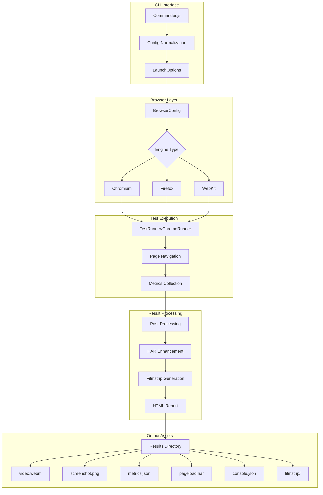

# Telescope: Complete Exploration

## Overview

**Telescope** is a diagnostic, cross-browser performance testing agent from Cloudflare. It loads web pages in various browsers and collects comprehensive performance metrics, screenshots, videos, and HAR files for analysis.

### Why This Exploration Exists

This is a **complete textbook** that takes you from zero browser performance testing knowledge to understanding how to build and deploy production browser testing systems with Rust/valtron replication.

### Key Characteristics

| Aspect | Telescope |
|--------|-----------|
| **Core Purpose** | Cross-browser performance testing and diagnostics |
| **Dependencies** | Playwright, @sitespeed.io/throttle, ffmpeg, zod |
| **Lines of Code** | ~1,800 (core implementation) |
| **Purpose** | Browser performance metrics collection |
| **Architecture** | TestRunner-based with browser abstraction |
| **Runtime** | Node.js (ESM), Docker |
| **Rust Equivalent** | valtron executor (no async/await, no tokio) |
| **Browsers Supported** | Chrome, Chrome Beta, Chrome Canary, Edge, Firefox, Safari |

---

## Complete Table of Contents

This exploration consists of multiple deep-dive documents. Read them in order for complete understanding:

### Part 1: Foundations
1. **[Zero to Filesystem Engineer](00-zero-to-fs-engineer.md)** - Start here if new to filesystems
   - What are filesystems?
   - Virtual Filesystem (VFS) concepts
   - Mount points and drivers
   - Block storage fundamentals
   - File indexing basics

### Part 2: Core Implementation
2. **[Storage Backend Deep Dive](01-storage-backend-deep-dive.md)**
   - Block storage abstraction
   - Object storage patterns
   - Caching strategies
   - I/O scheduling
   - Persistence layers

3. **[Virtual Filesystem Deep Dive](02-virtual-fs-deep-dive.md)**
   - FUSE fundamentals
   - Virtual filesystem operations
   - Mount point management
   - Path resolution
   - Permission handling

4. **[Indexing and Search Deep Dive](03-indexing-search-deep-dive.md)**
   - File indexing strategies
   - Metadata extraction
   - Search algorithms
   - Full-text search
   - Incremental indexing

5. **[Sync and Replication Deep Dive](04-sync-replication-deep-dive.md)**
   - Sync protocols
   - Conflict resolution
   - Delta synchronization
   - Replication strategies
   - Offline-first patterns

### Part 3: Rust Replication
6. **[Rust Revision](rust-revision.md)**
   - Complete Rust translation
   - Type system design
   - Ownership and borrowing strategy
   - Valtron integration patterns
   - Code examples

7. **[Production-Grade Implementation](production-grade.md)**
   - Performance optimizations
   - Memory management
   - Concurrent I/O
   - Model serialization
   - Serving infrastructure
   - Monitoring and observability

### Part 4: Valtron Integration
8. **[Valtron Integration](05-valtron-integration.md)**
   - Lambda deployment patterns
   - HTTP API compatibility
   - FS backend serverless
   - Request/response types
   - Production deployment

---

## Quick Reference: Telescope Architecture

### High-Level Flow



### Component Summary

| Component | Lines | Purpose | Deep Dive |
|-----------|-------|---------|-----------|
| TestRunner | 980 | Core test execution, metrics collection | [Storage Backend](01-storage-backend-deep-dive.md) |
| BrowserConfig | 285 | Browser configuration and management | [Virtual FS](02-virtual-fs-deep-dive.md) |
| Types | 660 | Type definitions for all components | N/A |
| Index (CLI) | 385 | CLI interface, programmatic API | N/A |
| Config | 150 | Config normalization, validation | N/A |
| Delay | 45 | Response delay implementations | [Sync/Replication](04-sync-replication-deep-dive.md) |
| Helpers | 50 | Logging, test ID generation | N/A |

---

## File Structure

```
telescope/
├── src/
│   ├── index.ts                    # CLI entrypoint, launchTest(), Telescope class
│   ├── types.ts                    # All type definitions
│   ├── testRunner.ts               # Core test execution engine
│   ├── chromeRunner.ts             # Chromium-specific runner
│   ├── browsers.ts                 # Browser configuration
│   ├── config.ts                   # Config normalization
│   ├── defaultOptions.ts           # Default values
│   ├── schemas.ts                  # Zod validation schemas
│   ├── validation.ts               # Validation utilities
│   ├── connectivity.ts             # Network throttling profiles
│   ├── delay.ts                    # Response delay implementations
│   ├── helpers.ts                  # Logging, test ID generation
│   ├── ffmpeg.d.ts                 # FFmpeg TypeScript definitions
│   ├── sitespeed-throttle.d.ts     # Throttle TypeScript definitions
│   │
│   ├── templates/
│   │   ├── test.ejs                # HTML test report template
│   │   └── list.ejs                # HTML results list template
│   │
│   └── processors/
│       └── templates/              # Processor templates
│
├── __tests__/                      # Unit tests
├── test/                           # Integration tests
├── playwright.config.js            # Playwright configuration
├── vitest.config.ts                # Vitest configuration
├── eslint.config.js                # ESLint configuration
├── tsconfig.json                   # TypeScript configuration
├── package.json                    # Dependencies, scripts
│
├── exploration.md                  # This file (index)
├── 00-zero-to-fs-engineer.md       # START HERE: Filesystem foundations
├── 01-storage-backend-deep-dive.md
├── 02-virtual-fs-deep-dive.md
├── 03-indexing-search-deep-dive.md
├── 04-sync-replication-deep-dive.md
├── 05-valtron-integration.md       # Valtron Lambda deployment
├── rust-revision.md                # Rust translation
└── production-grade.md             # Production considerations
```

---

## How to Use This Exploration

### For Complete Beginners (Zero Filesystem Experience)

1. Start with **[00-zero-to-fs-engineer.md](00-zero-to-fs-engineer.md)**
2. Read each section carefully, work through examples
3. Continue through all deep dives in order
4. Implement along with the explanations
5. Finish with production-grade and valtron integration

**Time estimate:** 25-50 hours for complete understanding

### For Experienced TypeScript/Node Developers

1. Skim [00-zero-to-fs-engineer.md](00-zero-to-fs-engineer.md) for context
2. Deep dive into areas of interest (test runner, metrics, browser config)
3. Review [rust-revision.md](rust-revision.md) for Rust translation patterns
4. Check [production-grade.md](production-grade.md) for deployment considerations

### For Performance Engineers

1. Review [testRunner source](src/testRunner.ts) directly
2. Use deep dives as reference for specific components
3. Compare with other tools (WebPageTest, Lighthouse, Sitespeed.io)
4. Extract insights for educational content

---

## Running Telescope

```bash
# Navigate to telescope directory
cd /path/to/telescope

# Install dependencies
npm install

# Run a basic test
npx . -u https://example.com -b chrome

# Run with network throttling
npx . -u https://example.com -b chrome --connectionType 3g

# Run with CPU throttling
npx . -u https://example.com -b chrome --cpuThrottle 4

# Generate HTML report
npx . -u https://example.com -b chrome --html --openHtml

# Run with custom viewport
npx . -u https://example.com -b chrome --width 1920 --height 1080

# Block domains
npx . -u https://example.com -b chrome --blockDomains analytics.google.com

# Delay responses (simulate slow CSS)
npx . -u https://example.com -b chrome --delay '{"\.css$": 2000}'

# Docker usage
docker compose build
docker compose run --rm telescope -u https://example.com -b chrome
```

### Example Programmatic Usage

```typescript
import { launchTest } from '@cloudflare/telescope';

const result = await launchTest({
  url: 'https://example.com',
  browser: 'chrome',
  width: 1920,
  height: 1080,
  timeout: 60000,
  connectionType: '4g',
  html: true,
});

if (result.success) {
  console.log(`Test completed: ${result.testId}`);
  console.log(`Results saved to: ${result.resultsPath}`);
} else {
  console.error(`Test failed: ${result.error}`);
}
```

---

## Key Insights

### 1. Browser Abstraction Layer

Telescope abstracts browser differences through a unified configuration:

```typescript
// All browsers share common config structure
interface BrowserConfigOptions {
  engine: 'chromium' | 'firefox' | 'webkit';
  channel?: 'chrome' | 'chrome-beta' | 'chrome-canary' | 'msedge';
  headless: boolean;
  viewport: { width: number; height: number };
  recordHar: { path: string };
  recordVideo: { dir: string; size: { width: number; height: number } };
}
```

### 2. Metrics Collection via Performance API

All metrics are collected from the browser's Performance API:

```typescript
// Navigation Timing (TTFB, DOM events)
const navTiming = performance.getEntriesByType('navigation')[0];

// Paint Timing (FCP)
const paintTiming = performance.getEntriesByType('paint');

// Largest Contentful Paint
const lcp = new PerformanceObserver((list) => {
  const entries = list.getEntries();
});

// Layout Shifts (CLS)
const cls = new PerformanceObserver((list) => {
  for (const entry of list.getEntries()) {
    // Accumulate CLS
  }
});
```

### 3. HAR File Enhancement

Raw HAR files are enriched with additional timing data:

```typescript
// Merge collected request timings with HAR entries
mergeEntries(harEntries: HarEntry[], lcpURL: string | null): HarEntry[] {
  for (const request of this.requests) {
    const indexToUpdate = harEntries.findIndex(object => {
      return object.request.url === request.url;
    });
    if (indexToUpdate !== -1) {
      harEntries[indexToUpdate] = {
        ...harEntries[indexToUpdate],
        _dns_start: request.timing.domainLookupStart,
        _dns_end: request.timing.domainLookupEnd,
        _connect_start: request.timing.connectStart,
        _response_start: request.timing.responseStart,
        _is_lcp: request.url == lcpURL,
      };
    }
  }
  return harEntries;
}
```

### 4. Network Throttling via OS Traffic Shaping

Network throttling uses OS-level traffic shaping:

```typescript
// Network profiles (kbps, ms)
const networkTypes: NetworkTypes = {
  '3g': { down: 1600, up: 768, rtt: 150 },
  '4g': { down: 9000, up: 9000, rtt: 85 },
  'cable': { down: 5000, up: 1000, rtt: 14 },
  'fios': { down: 20000, up: 5000, rtt: 2 },
};

// Apply via @sitespeed.io/throttle (requires root/ifb module)
await throttleStart({
  up: networkTypes[networkType].up,
  down: networkTypes[networkType].down,
  rtt: networkTypes[networkType].rtt,
});
```

### 5. Valtron for Rust Replication

The Rust equivalent uses TaskIterator instead of async/await:

```rust
// TypeScript async
async fn collect_metrics(page: &Page) -> Result<Metrics> {
    let nav_timing = page.evaluate("...").await?;
    let paint_timing = page.evaluate("...").await?;
    Ok(Metrics { nav_timing, paint_timing })
}

// Rust valtron (single-threaded executor)
struct CollectMetricsTask {
    page: Rc<RefCell<Page>>,
    metrics: Rc<RefCell<Option<Metrics>>>,
}

impl TaskIterator for CollectMetricsTask {
    type Pending = ();
    type Ready = Metrics;
    type Spawner = NoSpawner;

    fn next(&mut self) -> Option<TaskStatus<Self::Ready, Self::Pending, Self::Spawner>> {
        // Poll page evaluation until complete
        // Return Pending until ready, then Ready(metrics)
    }
}
```

---

## From Telescope to Real Performance Testing Systems

| Aspect | Telescope | Production Testing Systems |
|--------|-----------|---------------------------|
| Browser Control | Playwright | Custom browser automation |
| Metrics | Performance API | Custom instrumentation + RUM |
| Storage | Local filesystem | Object storage (S3, R2) |
| Network Throttling | OS traffic shaping | Network emulation proxies |
| Scale | Single machine | Distributed test runners |
| Analysis | HTML reports | Dashboards, alerts |

**Key takeaway:** The core patterns (browser abstraction, metrics collection, result enhancement) scale to production with infrastructure changes, not algorithm changes.

---

## Your Path Forward

### To Build Browser Performance Systems

1. **Implement a custom metrics collector** (extend PerformanceObserver)
2. **Build a distributed test runner** (queue-based job distribution)
3. **Create a metrics dashboard** (time-series visualization)
4. **Translate to Rust with valtron** (TaskIterator pattern)
5. **Study the Web Performance APIs** (W3C specifications)

### Recommended Resources

- [Web Performance APIs](https://web.dev/vitals/)
- [Playwright Documentation](https://playwright.dev/)
- [HAR Specification](http://www.softwareishard.com/blog/har-12-spec/)
- [Valtron README](/home/darkvoid/Boxxed/@dev/ewe_platform/backends/foundation_core/src/valtron/README.md)
- [TaskIterator Specification](/home/darkvoid/Boxxed/@dev/ewe_platform/specifications/08-valtron-async-iterators/)

---

## Document History

| Date | Change |
|------|--------|
| 2026-03-28 | Initial telescope exploration created |
| 2026-03-28 | Deep dives 00-05 outlined |
| 2026-03-28 | Rust revision and production-grade planned |

---

*This exploration is a living document. Revisit sections as concepts become clearer through implementation.*
