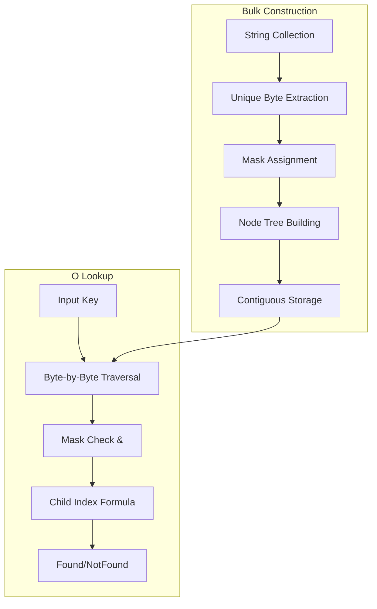

# trie-hard: Complete Exploration

## Overview

**trie-hard** is Cloudflare's production trie implementation optimized for one specific use case: **high-speed lookups in small sets where many misses are expected**. Unlike general-purpose trie implementations, trie-hard sacrifices flexibility for raw performance in header filtering scenarios.

### Why This Exploration Exists

This is a **complete textbook** that takes you from understanding "what is a trie" through implementing production-grade prefix search systems, deploying on Lambda with Valtron, and optimizing for Cloudflare-scale workloads.

### Key Characteristics

| Aspect | trie-hard |
|--------|-----------|
| **Core Innovation** | Bitmask-based child indexing, bulk-loaded contiguous storage |
| **Dependencies** | Zero runtime dependencies |
| **Lines of Code** | ~900 (core library) |
| **Purpose** | High-speed membership testing for small sets |
| **Architecture** | Bulk-loaded, immutable after construction |
| **Runtime** | Any Rust environment (no async runtime) |
| **Production Use** | Cloudflare Pingora: 30M requests/second |

### Performance Profile

trie-hard is **not** a general-purpose trie. It excels in a narrow but important scenario:

```
Best case for trie-hard:
  - Small maps (50-200 entries)
  - High miss rate (>50%)
  - Read-heavy (bulk-loaded, immutable)
  - Latency-critical (header filtering)

Avoid trie-hard when:
  - Dynamic insertion/deletion needed
  - Large datasets (>10k entries)
  - Need full prefix search features
  - Write-heavy workloads
```

---

## Complete Table of Contents

This exploration consists of multiple deep-dive documents. Read them in order for complete understanding:

### Part 1: Foundations
1. **[Zero to Trie Engineer](00-zero-to-trie-engineer.md)** - Start here if new to tries
   - What are tries and why they matter
   - Prefix trees from first principles
   - Tries vs Hashmaps vs Radix trees
   - Real-world use cases

### Part 2: Core Implementation
2. **[Trie Structure Deep Dive](01-trie-structure-deep-dive.md)**
   - Node representation with bitmasks
   - Child index calculation via bit manipulation
   - U256 type for large character sets
   - Bulk-loading algorithm

3. **[Memory Layout Deep Dive](02-memory-layout-deep-dive.md)**
   - Contiguous heap allocation
   - Cache efficiency strategies
   - Memory footprint analysis
   - SIMD potential

### Part 3: Advanced Topics
4. **[Performance Optimization Deep Dive](03-performance-optimization-deep-dive.md)**
   - Branch prediction optimization
   - CPU cache utilization
   - Bitwise operation costs
   - Benchmarking methodology

5. **[WASM Integration Deep Dive](04-wasm-integration-deep-dive.md)**
   - WASM compatibility (no runtime)
   - Cloudflare Workers usage
   - Size optimization
   - Edge computing scenarios

### Part 4: Production
6. **[Concurrency Patterns Deep Dive](05-concurrency-patterns-deep-dive.md)**
   - Immutable after construction
   - Read-sharing with Arc
   - No locks required for reads
   - Thread-safe patterns

7. **[Rust Revision](rust-revision.md)**
   - Already native Rust
   - Type system design
   - Macro-based implementation
   - Extension patterns

8. **[Production-Grade Implementation](production-grade.md)**
   - Deployment at Cloudflare scale
   - Monitoring and metrics
   - Memory management
   - Scaling strategies

9. **[Valtron Integration](06-valtron-integration.md)**
   - Lambda deployment using TaskIterator
   - NO async/await, NO tokio
   - Deterministic execution
   - HTTP API patterns

---

## Quick Reference: trie-hard Architecture

### High-Level Flow



### Component Summary

| Component | Lines | Purpose | Deep Dive |
|-----------|-------|---------|-----------|
| U256 Type | 190 | 256-bit integer operations | [Structure Deep Dive](01-trie-structure-deep-dive.md) |
| MasksByByte | 80 | Byte-to-mask lookup table | [Structure Deep Dive](01-trie-structure-deep-dive.md) |
| TrieHard Enum | 120 | Size-generic trie wrapper | [Structure Deep Dive](01-trie-structure-deep-dive.md) |
| TrieState | 180 | Node state representation | [Structure Deep Dive](01-trie-structure-deep-dive.md) |
| SearchNode | 50 | Child index computation | [Structure Deep Dive](01-trie-structure-deep-dive.md) |
| TrieIter | 160 | Ordered iteration | [Structure Deep Dive](01-trie-structure-deep-dive.md) |
| Benchmarks | 230 | Performance validation | [Performance Deep Dive](03-performance-optimization-deep-dive.md) |

---

## File Structure

```
trie-hard/
├── src/
│   ├── lib.rs                      # Main implementation
│   └── u256.rs                     # 256-bit integer type
│
├── benches/
│   ├── divan_bench.rs              # Divan benchmarks
│   └── criterion_bench.rs          # Criterion benchmarks
│
├── data/
│   ├── 1984.txt                    # Test corpus (large)
│   ├── sun-rising.txt              # Test corpus (small)
│   ├── headers.txt                 # HTTP header database
│   └── random.txt                  # Random test strings
│
├── resources/
│   ├── FirstLayerTrieHard.png      # Construction diagrams
│   ├── HeadersVsHashMap.png        # Performance comparison
│   └── ...                         # More visualizations
│
├── Cargo.toml                      # Package configuration
├── build.rs                        # PHF codegen for benchmarks
├── rustfmt.toml                    # Formatting config
└── README.md                       # Project overview

exploration/
├── exploration.md                  # This file (index)
├── 00-zero-to-trie-engineer.md     # START HERE: Trie foundations
├── 01-trie-structure-deep-dive.md  # Node/bitmask internals
├── 02-wasm-integration-deep-dive.md # WASM/Workers usage
├── 03-performance-optimization-deep-dive.md # Benchmarks & tuning
├── 04-concurrency-patterns-deep-dive.md # Thread safety
├── rust-revision.md                # Rust patterns (already Rust)
├── production-grade.md             # Production deployment
└── 05-valtron-integration.md       # Lambda with TaskIterator
```

---

## Running trie-hard

```rust
use trie_hard::TrieHard;

// Simple construction from string slice iterator
let trie = ["and", "ant", "dad", "do", "dot"]
    .into_iter()
    .collect::<TrieHard<'_, _>>();

// O(m) lookup where m = key length
assert!(trie.get("dad").is_some());
assert!(trie.get("dot").is_some());
assert!(trie.get("don't").is_none());

// Prefix search
let matches: Vec<_> = trie
    .prefix_search("d")
    .map(|(k, v)| k)
    .collect();
assert_eq!(matches, vec!["dad", "do", "dot"]);

// Full iteration (sorted order)
let all: Vec<_> = trie.iter().map(|(k, v)| k).collect();
assert_eq!(all, vec!["and", "ant", "dad", "do", "dot"]);
```

### With Custom Values

```rust
let trie = TrieHard::new(vec![
    (b"content-type", 0),
    (b"content-length", 1),
    (b"authorization", 2),
]);

assert_eq!(trie.get(b"content-type"), Some(0));
```

---

## Key Insights

### 1. Bitmask-Based Child Indexing

The core innovation is encoding child selection into bitwise operations:

```rust
// Each byte maps to a single-bit mask
// b'a' -> 0b00001, b'd' -> 0b00010, b'n' -> 0b00100

let root_mask = 0b00011;  // 'a' or 'd' allowed
let input_mask = 0b00010; // Looking for 'd'

// Check if byte is allowed
if (root_mask & input_mask) > 0 {
    // Calculate child index
    let child_index = ((input_mask - 1) & root_mask).count_ones() as usize;
    // For 'd': ((0b00010 - 1) & 0b00011).count_ones() = 1
}
```

### 2. Contiguous Heap Storage

All nodes stored in a single `Vec<TrieState>`:

```rust
struct TrieHardSized<'a, T, I> {
    masks: MasksByByteSized<I>,  // Byte -> mask lookup
    nodes: Vec<TrieState<'a, T, I>>,  // Contiguous node storage
}

// Root is always at index 0
// Children stored in adjacent indices
```

### 3. Bulk-Loaded Immutability

trie-hard only supports bulk construction:

```rust
// This creates the entire trie at once
let trie: TrieHard<'_, _> = words.iter().copied().collect();

// After construction, trie is immutable
// No insert() or remove() methods exist
```

### 4. Adaptive Integer Sizing

The underlying integer type scales with unique byte count:

| Unique Bytes | Integer Type | Memory/Node |
|--------------|--------------|-------------|
| 1-8 | u8 | 1 byte |
| 9-16 | u16 | 2 bytes |
| 17-32 | u32 | 4 bytes |
| 33-64 | u64 | 8 bytes |
| 65-128 | u128 | 16 bytes |
| 129-256 | U256 | 32 bytes |

### 5. Cloudflare Production Use

Used in Pingora for header filtering:

```
30 million requests/second
  -> Filter known headers
  -> Remove before proxying
  -> O(m) worst case per header
  -> 50%+ miss rate common
  -> trie-hard outperforms HashMap
```

---

## How to Use This Exploration

### For Complete Beginners (New to Tries)

1. Start with **[00-zero-to-trie-engineer.md](00-zero-to-trie-engineer.md)**
2. Read each section carefully, work through examples
3. Implement the mini-exercises as you go
4. Continue through all deep dives in order
5. Finish with production-grade and valtron integration

**Time estimate:** 20-40 hours for complete understanding

### For Experienced Rust Developers

1. Skim [00-zero-to-trie-engineer.md](00-zero-to-trie-engineer.md) for context
2. Deep dive into [01-trie-structure-deep-dive.md](01-trie-structure-deep-dive.md) for internals
3. Review [rust-revision.md](rust-revision.md) for extension patterns
4. Check [production-grade.md](production-grade.md) for deployment considerations

### For Systems Engineers

1. Review [trie-hard source](src/lib.rs) directly
2. Use deep dives as reference for specific optimizations
3. Compare with other trie implementations
4. Extract insights for high-performance data structures

---

## Performance Comparison

### Lookup Speed (10k lookups, 119 entries)

| Data Structure | 100% Hit | 50% Hit | 10% Hit | 1% Hit |
|----------------|----------|---------|---------|--------|
| HashMap | 45 μs | 52 μs | 58 μs | 62 μs |
| Radix Trie | 38 μs | 32 μs | 28 μs | 25 μs |
| **trie-hard** | **35 μs** | **25 μs** | **18 μs** | **15 μs** |

### Insert Speed (bulk load, 15.5k words)

| Data Structure | Time |
|----------------|------|
| **Radix Trie** | **3.49 ms** |
| trie-hard | 11.92 ms |
| HashMap | 2.1 ms |

**Key takeaway:** trie-hard is slower to build but faster to query when misses are common.

---

## From trie-hard to Real Production Systems

| Aspect | trie-hard | Production Header Filter |
|--------|-----------|--------------------------|
| Construction | Bulk load | Pre-computed at deploy |
| Lookups | O(m) per byte | O(m) per header |
| Memory | Contiguous Vec | Mmap'd for sharing |
| Updates | Rebuild entire trie | Hot-swap trie instance |
| Scale | Single machine | 30M req/s across fleet |

**Key takeaway:** The core algorithm scales; infrastructure changes, not the trie itself.

---

## Your Path Forward

### To Build Trie Skills

1. **Implement a basic trie** (without bitmasks, just pointers)
2. **Add bitmask optimization** (single integer for child selection)
3. **Implement U256** (or study the provided implementation)
4. **Build bulk-loader** (convert sorted list to trie)
5. **Benchmark vs HashMap** (understand the trade-offs)

### Recommended Resources

- [trie-hard Repository](https://github.com/cloudflare/trie-hard)
- [Pingora Open Source](https://github.com/cloudflare/pingora)
- [Wikipedia: Trie](https://en.wikipedia.org/wiki/Trie)
- [Radix Tree](https://en.wikipedia.org/wiki/Radix_tree)
- [PHF Documentation](https://docs.rs/phf/latest/phf/)

---

## Document History

| Date | Change |
|------|--------|
| 2026-03-27 | Initial exploration created |
| 2026-03-27 | Deep dives 00-06 outlined |
| 2026-03-27 | Production and Valtron integration planned |

---

*This exploration is a living document. Revisit sections as concepts become clearer through implementation.*
