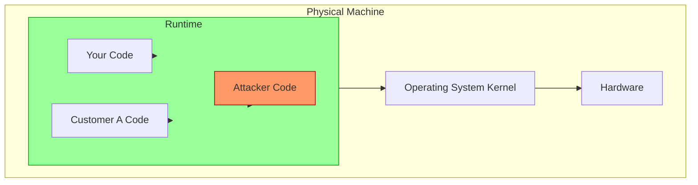
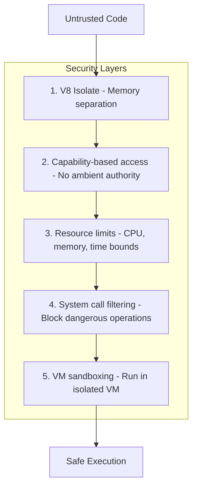
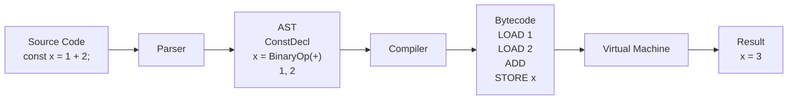
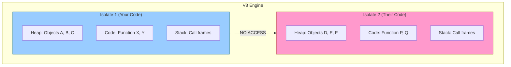
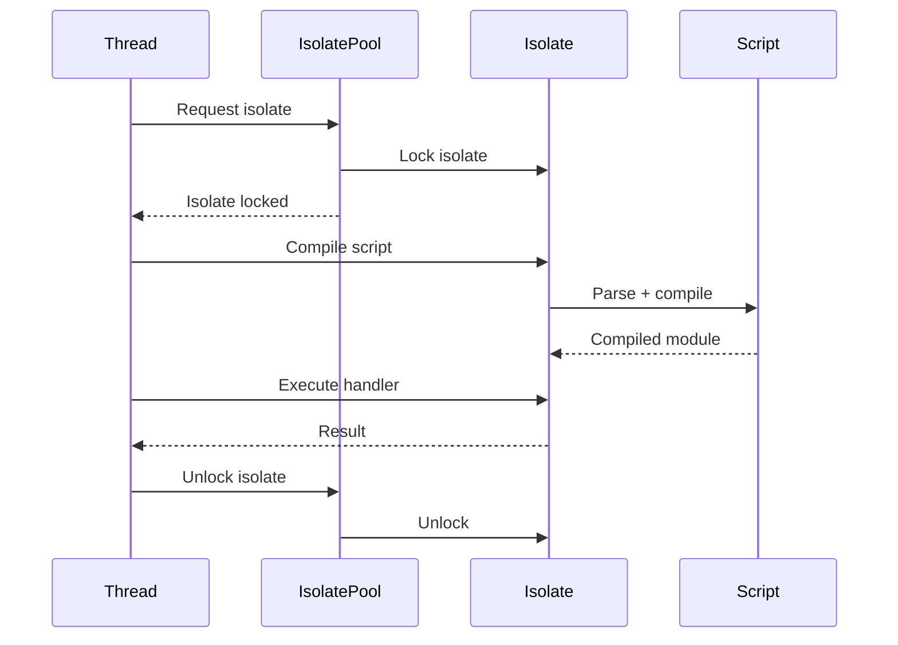
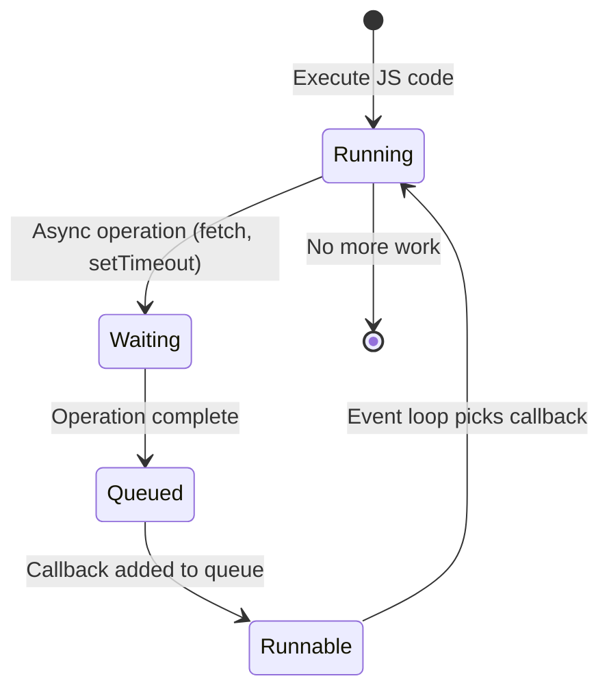
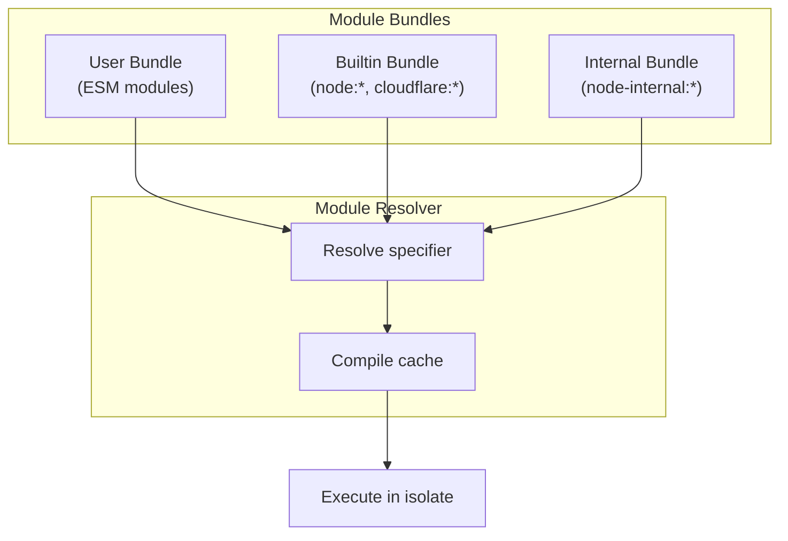
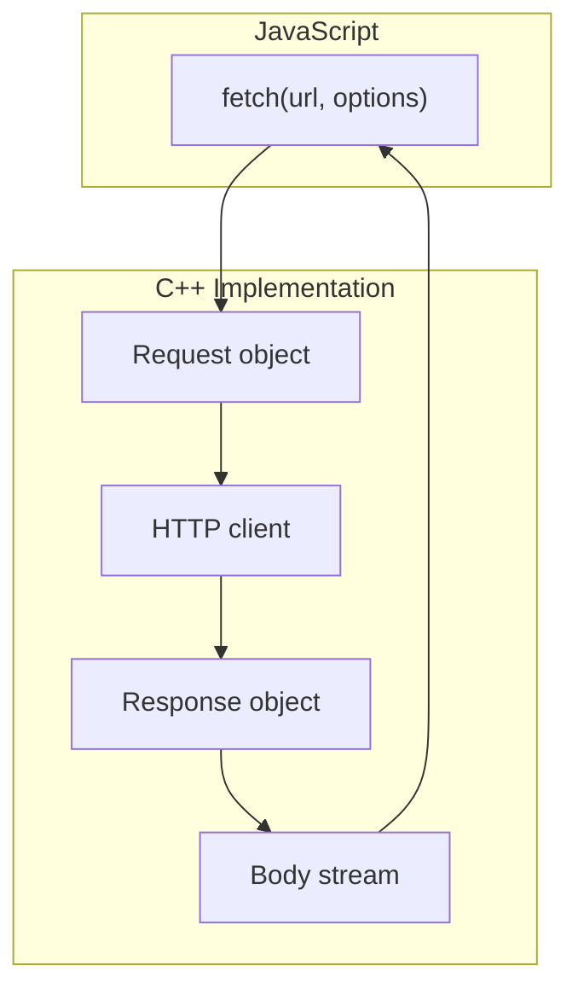
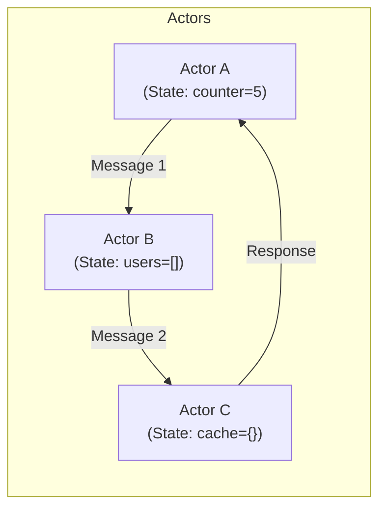
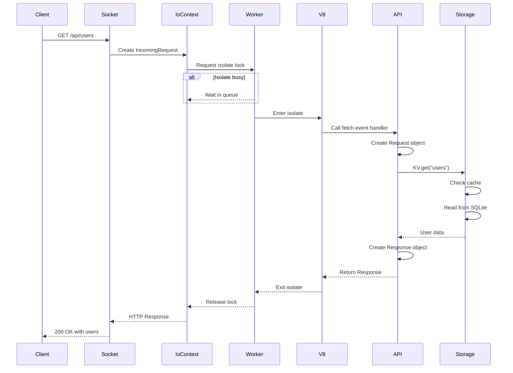

# Zero to Runtime Engineer: Understanding workerd

**Created:** 2026-03-27

**Prerequisites:** None. This document assumes no prior knowledge of JavaScript runtimes, V8, or systems programming.

**Goal:** Take you from zero knowledge to understanding how Cloudflare's workerd runtime works at a fundamental level.

---

## Table of Contents

1. [What is a Runtime?](#what-is-a-runtime)
2. [The Problem: Running Untrusted Code](#the-problem-running-untrusted-code)
3. [JavaScript Engines Explained](#javascript-engines-explained)
4. [Isolation: The Key to Multi-Tenancy](#isolation-the-key-to-multi-tenancy)
5. [The Event Loop: How Async Works](#the-event-loop-how-async-works)
6. [Modules: Loading and Executing Code](#modules-loading-and-executing-code)
7. [Web APIs: Fetch, Streams, and More](#web-apis-fetch-streams-and-more)
8. [The Actor Model: Stateful Serverless](#the-actor-model-stateful-serverless)
9. [From C++ to JavaScript: The Binding Layer](#from-c-to-javascript-the-binding-layer)
10. [Putting It All Together](#putting-it-all-together)

---

## What is a Runtime?

### The Fundamental Problem

JavaScript, as defined by the ECMAScript specification, is just a language. It defines:
- Syntax (how to write `if` statements, functions, classes)
- Types (strings, numbers, objects, arrays)
- Semantics (what `x + y` means)

But it **does not define**:
- How to read a file from disk
- How to make an HTTP request
- How to set a timeout
- How to write to a database

These are **runtime APIs** - they're provided by the environment running JavaScript.

### Runtime Examples

| Runtime | Environment | APIs Provided |
|---------|-------------|---------------|
| **Browser** | Chrome, Firefox, Safari | `fetch()`, `localStorage`, `DOM`, `Canvas` |
| **Node.js** | Server-side JavaScript | `fs`, `http`, `net`, `child_process` |
| **workerd** | Cloudflare Workers | `fetch()`, `DurableObject`, `KV`, `R2` |
| **Deno** | Modern server runtime | `Deno.readFile()`, `Deno.serve()` |

### workerd's Unique Position

workerd is designed for **serverless edge computing**:
- **Multi-tenant**: Thousands of customers' code runs on the same machine
- **Isolated**: Customer A's code cannot access Customer B's data
- **Fast**: Cold starts in milliseconds, requests in microseconds
- **Standard-based**: Uses Web APIs (Fetch, Streams) instead of Node.js APIs

---

## The Problem: Running Untrusted Code

### The Security Challenge

Imagine you're Cloudflare. You want to run code written by:
- Your employees (trusted)
- Your customers (partially trusted)
- Random people on the internet (untrusted)

All on the **same physical machines**.

This is a **massive security challenge**:



### Attack Vectors

1. **Memory access**: Can the code read another tenant's memory?
2. **Filesystem access**: Can it read `/etc/passwd`?
3. **Network access**: Can it connect to your internal database?
4. **CPU exhaustion**: Can it consume 100% CPU forever?
5. **Memory exhaustion**: Can it allocate all RAM?

### The Solution: Defense in Depth

workerd uses multiple layers of security:



**Important:** workerd alone is **not enough** for untrusted code. Cloudflare runs it inside additional sandboxes (VMs, seccomp, etc.).

---

## JavaScript Engines Explained

### What Does a JavaScript Engine Do?

A JavaScript engine:
1. **Parses** source code into an Abstract Syntax Tree (AST)
2. **Compiles** AST into bytecode or machine code
3. **Executes** the code
4. **Manages memory** via garbage collection



### Major JavaScript Engines

| Engine | Used By | Written In |
|--------|---------|------------|
| **V8** | Chrome, Node.js, workerd | C++ |
| **SpiderMonkey** | Firefox | C++, Rust |
| **JavaScriptCore** | Safari, iOS | C++ |
| **QuickJS** | Lightweight embeddings | C |

### V8: The Engine Inside workerd

V8 is Google's JavaScript engine. Key features:

1. **Just-In-Time (JIT) Compilation**
   - **Ignition**: Interpreter (fast startup)
   - **TurboFan**: Optimizing compiler (fast execution)
   - **Maglev**: Mid-tier compiler (balance)
   - **Sparkplug**: Baseline compiler

2. **Garbage Collection**
   - **Orinoco**: Parallel, incremental GC
   - **Generational**: Young/old object separation

3. **Isolates**
   - Completely independent VM instances
   - No shared state between isolates



---

## Isolation: The Key to Multi-Tenancy

### What is a V8 Isolate?

A V8 **isolate** is:
- A **complete VM instance** with its own heap
- **Thread-local**: Only one thread can execute in an isolate at a time
- **Memory-isolated**: Cannot access another isolate's memory
- **Independently garbage-collected**: Each isolate has its own GC

### Isolate Lifecycle in workerd



### Memory Layout

```
┌─────────────────────────────────────────────────────────┐
│                    Physical Memory                       │
├─────────────────────────────────────────────────────────┤
│  ┌─────────────────┐  ┌─────────────────┐               │
│  │   Isolate 1     │  │   Isolate 2     │               │
│  │  ┌───────────┐  │  │  ┌───────────┐  │               │
│  │  │   Heap    │  │  │  │   Heap    │  │               │
│  │  │  (Your    │  │  │  │  (Their   │  │               │
│  │  │  Objects) │  │  │  │  Objects) │  │               │
│  │  └───────────┘  │  │  └───────────┘  │               │
│  │  ┌───────────┐  │  │  ┌───────────┐  │               │
│  │  │  Stack    │  │  │  │  Stack    │  │               │
│  │  └───────────┘  │  │  └───────────┘  │               │
│  └─────────────────┘  └─────────────────┘               │
└─────────────────────────────────────────────────────────┘
```

### The Lock Pattern

In workerd, isolates use a **lock pattern**:

```cpp
// Simplified pseudocode
class Worker {
  Isolate* isolate;
  Mutex mutex;

  void handleRequest() {
    // 1. Acquire lock (wait if another thread holds it)
    Lock lock(isolate);

    // 2. Enter isolate scope
    Isolate::Scope isolateScope(isolate);

    // 3. Handle try-catch
    TryCatch tryCatch(isolate);

    // 4. Execute JavaScript
    Local<Function> handler = getHandler();
    handler->Call(...);
  }
};
```

---

## The Event Loop: How Async Works

### The Fundamental Problem

JavaScript is **single-threaded**. But servers need to:
- Handle thousands of concurrent connections
- Wait for network I/O without blocking
- Execute timers and scheduled tasks

The solution: **The Event Loop**

### How the Event Loop Works



### The Queue Model

```
┌──────────────────────────────────────────┐
│           Event Loop                      │
│                                           │
│  ┌─────────────┐                         │
│  │    Call      │                         │
│  │    Stack     │  ← Synchronous code     │
│  └─────────────┘                         │
│                                           │
│  ┌─────────────┐  ┌─────────────────┐    │
│  │   Micro     │  │    Macro        │    │
│  │   Tasks     │  │    Tasks        │    │
│  │  (Promises) │  │  (setTimeout,   │    │
│  │             │  │   I/O)          │    │
│  └─────────────┘  └─────────────────┘    │
│                                           │
└──────────────────────────────────────────┘
```

### KJ Async vs JavaScript Promises

workerd uses **KJ promises** (C++) internally, which bridge to JavaScript promises:

| KJ Promise | JavaScript Promise |
|------------|-------------------|
| `kj::Promise<T>` | `Promise<T>` |
| `kj::TaskSet` | Event queue |
| `kj::WaitScope` | Awaiting context |
| `co_await` | `await` |

**Bridge pattern:**

```cpp
// C++ KJ promise
kj::Promise<int> fetchData() {
  auto response = co_await httpClient.get(url);
  auto body = co_await response->readAll();
  co_return body.size();
}

// Exposed to JavaScript as
jsg::Promise<int> fetchData(jsg::Lock& js) {
  return js.wait(fetchDataAsync());
}
```

---

## Modules: Loading and Executing Code

### The Module Problem

In a serverless runtime, you need to:
1. Load user code (ESM modules)
2. Resolve imports (`import x from "./y"`)
3. Execute in the correct order
4. Cache compiled modules

### workerd's Module System



### Module Types

| Type | Specifier | Use Case |
|------|-----------|----------|
| **Bundle** | `./module.js` | User code |
| **Builtin** | `node:fs`, `cloudflare:kv` | Runtime APIs |
| **Internal** | `node-internal:utils` | Internal utilities |

### Resolution Algorithm

```
1. Receive import specifier (e.g., "node:fs")
2. Check module kind:
   - BUNDLE → Look in user bundle
   - BUILTIN → Look in builtin registry
   - INTERNAL → Look in internal registry
3. If found, check compile cache
4. If cached, return compiled module
5. If not cached:
   a. Parse source code
   b. Compile to V8 bytecode
   c. Cache result
   d. Return compiled module
6. If not found, throw ReferenceError
```

---

## Web APIs: Fetch, Streams, and More

### Why Web APIs?

workerd uses **Web Platform APIs** instead of Node.js APIs:

| Task | Node.js API | Web API |
|------|-------------|---------|
| HTTP Request | `http.get()` | `fetch()` |
| Reading data | `stream.Readable` | `ReadableStream` |
| Text encoding | `Buffer.toString()` | `TextDecoder` |
| Crypto | `crypto.createHash()` | `crypto.subtle.digest()` |

**Benefits:**
- **Standard**: Same APIs work in browsers, Cloudflare, Deno, Bun
- **Portable**: Code runs anywhere
- **Modern**: Designed for async from the start

### The Fetch API Implementation



**Simplified implementation:**

```cpp
// api/http.c++ - Simplified
jsg::Promise<jsg::Ref<Response>> fetch(
    jsg::Lock& js,
    jsg::Ref<Request> request
) {
  // 1. Create HTTP client
  auto client = ioContext.getHttpClient();

  // 2. Send request (returns kj::Promise)
  auto responsePromise = client->sendRequest(request);

  // 3. Wrap in JavaScript promise
  return js.wait(responsePromise.then([](response) {
    // 4. Create Response object
    return jsg::alloc<Response>(response);
  }));
}
```

### Streams: The Most Complex API

Streams are **hard** because they involve:
- Backpressure (slow reader, fast writer)
- Multiple implementations (internal vs standard)
- Byte streams vs value streams
- Tee-ing (splitting one stream into two)

**Stream types:**

```
┌─────────────────────────────────────────┐
│          ReadableStream                  │
│  ┌─────────────────┐                    │
│  │  Internal       │  ← kj::AsyncInputStream │
│  │  (byte-only)    │                    │
│  └─────────────────┘                    │
│  ┌─────────────────┐                    │
│  │  Standard       │  ← WHATWG spec     │
│  │  (any value)    │                    │
│  └─────────────────┘                    │
└─────────────────────────────────────────┘
```

---

## The Actor Model: Stateful Serverless

### The Stateless Problem

Traditional serverless is **stateless**:
- Function runs, returns, forgets everything
- No memory between invocations
- Can't maintain connections or caches

**Durable Objects** solve this with the **actor model**.

### What is the Actor Model?

The actor model is a concurrency model where:
- **Actors** are independent units of computation
- Each actor has **state**
- Actors communicate via **messages**
- Each actor processes one message at a time



### Durable Objects in workerd

```
┌─────────────────────────────────────────────────┐
│          Durable Object Instance                 │
│                                                   │
│  ┌─────────────────────────────────────────┐    │
│  │          Input Gate                      │    │
│  │  (Ensures sequential processing)         │    │
│  └─────────────────────────────────────────┘    │
│                          │                       │
│                          v                       │
│  ┌─────────────────────────────────────────┐    │
│  │       Request Handler                    │    │
│  │  (JavaScript code)                       │    │
│  └─────────────────────────────────────────┘    │
│                          │                       │
│                          v                       │
│  ┌─────────────────────────────────────────┐    │
│  │       Actor Cache                        │    │
│  │  (LRU cache + SQLite backend)            │    │
│  └─────────────────────────────────────────┘    │
│                                                   │
└─────────────────────────────────────────────────┘
```

### Actor Storage

```cpp
// Simplified actor storage access
class DurableObjectStorage {
  ActorCache* cache;

  kj::Promise<kj::Maybe<Value>> get(Key key) {
    // 1. Check cache first
    if (auto cached = cache->get(key)) {
      co_return cached;
    }

    // 2. Read from SQLite
    auto fromDisk = co_await db->query("SELECT value FROM kv WHERE key = ?", key);

    // 3. Add to cache
    cache->put(key, fromDisk);

    co_return fromDisk;
  }
};
```

---

## From C++ to JavaScript: The Binding Layer

### The FFI Challenge

How do you expose C++ objects to JavaScript?

**Requirements:**
- Automatic type conversion
- Garbage collection integration
- Error handling (C++ exceptions → JS errors)
- Property access (getters, setters)

### JSG: JavaScript Glue

workerd uses **JSG macros** to define bindings:

```cpp
// Define a class visible to JavaScript
class MyAPI: public jsg::Object {
 public:
  // Method exposed to JS
  int add(int a, int b) {
    return a + b;
  }

  // Property exposed to JS
  kj::String getName() {
    return "MyAPI"_kjc;
  }

  // JSG macro defines the binding
  JSG_RESOURCE_TYPE(MyAPI) {
    JSG_METHOD(add);
    JSG_READONLY_PROTOTYPE_PROPERTY(name, getName);
  }
};
```

**This generates:**
- JavaScript wrapper class
- Type converters
- Garbage collection hooks
- Property descriptors

### Type Conversion Table

| C++ Type | JavaScript Type | Conversion |
|----------|-----------------|------------|
| `kj::String` | `string` | UTF-8 ↔ UTF-16 |
| `int` | `number` | Direct |
| `kj::Array<byte>` | `Uint8Array` | Zero-copy buffer |
| `jsg::Promise<T>` | `Promise` | Bridge KJ↔JS promises |
| `jsg::Ref<T>` | Object | Wrapped C++ object |
| `kj::Maybe<T>` | `T | null` | Optional value |

---

## Putting It All Together

### Full Request Flow

Let's trace a complete request through workerd:



### Memory Hierarchy

```
┌─────────────────────────────────────────┐
│         Physical Machine                 │
│                                          │
│  ┌────────────────────────────────────┐ │
│  │      Virtual Machine (sandbox)     │ │
│  │                                     │ │
│  │  ┌──────────────────────────────┐  │ │
│  │  │       workerd process         │  │ │
│  │  │                               │  │ │
│  │  │  ┌────────────────────────┐   │  │ │
│  │  │  │    Isolate 1           │   │  │ │
│  │  │  │  ┌──────────────────┐  │   │  │ │
│  │  │  │  │  V8 Heap         │  │   │  │ │
│  │  │  │  │  (JS objects)    │  │   │  │ │
│  │  │  │  └──────────────────┘  │   │  │ │
│  │  │  │  ┌──────────────────┐  │   │  │ │
│  │  │  │  │  C++ Objects     │  │   │  │ │
│  │  │  │  │  (IoContext,     │  │   │  │ │
│  │  │  │  │   ActorCache)    │  │   │  │ │
│  │  │  │  └──────────────────┘  │   │  │ │
│  │  │  └────────────────────────┘   │  │ │
│  │  │                               │  │ │
│  │  │  ┌────────────────────────┐   │  │ │
│  │  │  │    Isolate 2           │   │  │ │
│  │  │  │  ...                   │   │  │ │
│  │  │  └────────────────────────┘   │  │ │
│  │  │                               │  │ │
│  │  └───────────────────────────────┘  │ │
│  │                                     │ │
│  └─────────────────────────────────────┘ │
└─────────────────────────────────────────┘
```

### Key Takeaways

1. **Isolates provide memory isolation** - Each worker runs in its own V8 isolate
2. **Capability-based security** - No ambient authority, only explicit bindings
3. **Event-driven architecture** - KJ async bridges to JavaScript promises
4. **Actor model for state** - Durable Objects provide stateful serverless
5. **Web API compatibility** - Standard APIs for portability
6. **Layered security** - workerd + VM sandboxing + seccomp + more

---

## Next Steps

Now that you understand the basics, dive deeper:

1. **[Isolate Architecture](01-isolate-architecture-deep-dive.md)** - V8 internals, memory model
2. **[Actor Model](02-actor-model-deep-dive.md)** - Durable Objects, caching, SQLite
3. **[WASM Runtime](03-wasm-runtime-deep-dive.md)** - WebAssembly module loading
4. **[Web API Compatibility](04-web-api-compatibility-deep-dive.md)** - Fetch, Streams implementation
5. **[Cap'n Proto RPC](05-capnp-rpc-deep-dive.md)** - Serialization and RPC
6. **[Event Loop & Async](06-event-loop-async-deep-dive.md)** - KJ async model
7. **[Rust Revision](rust-revision.md)** - How to reimplement in Rust
