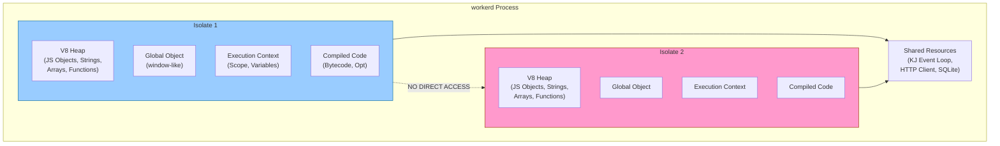
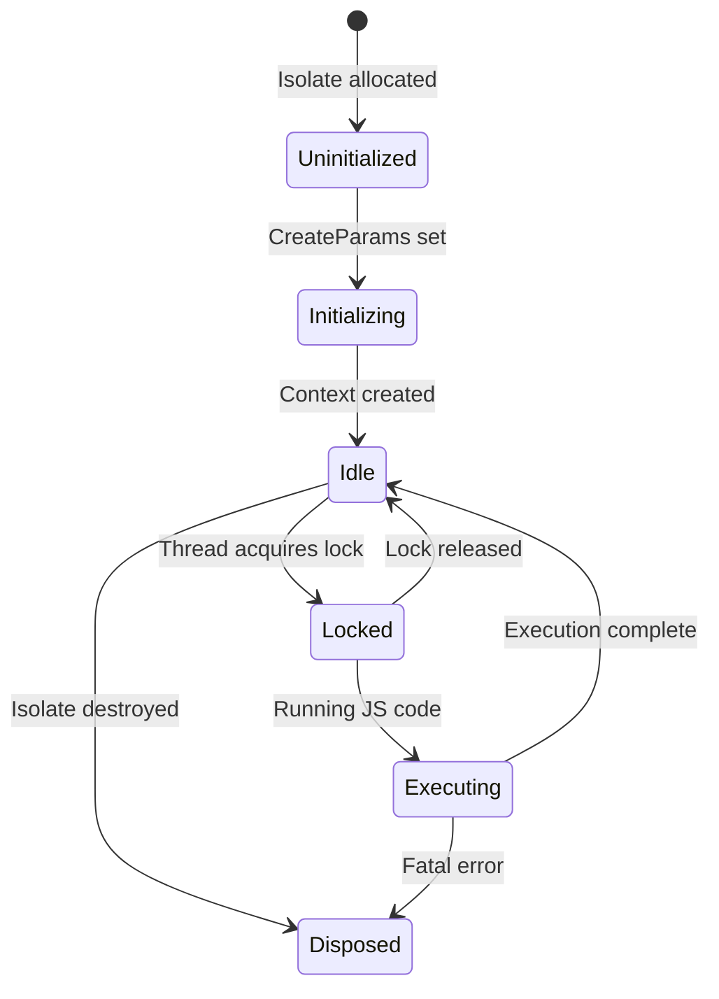
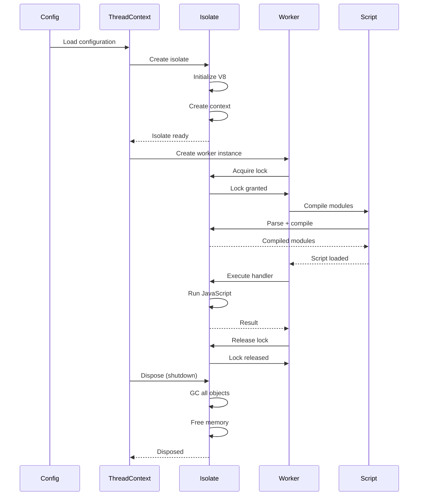
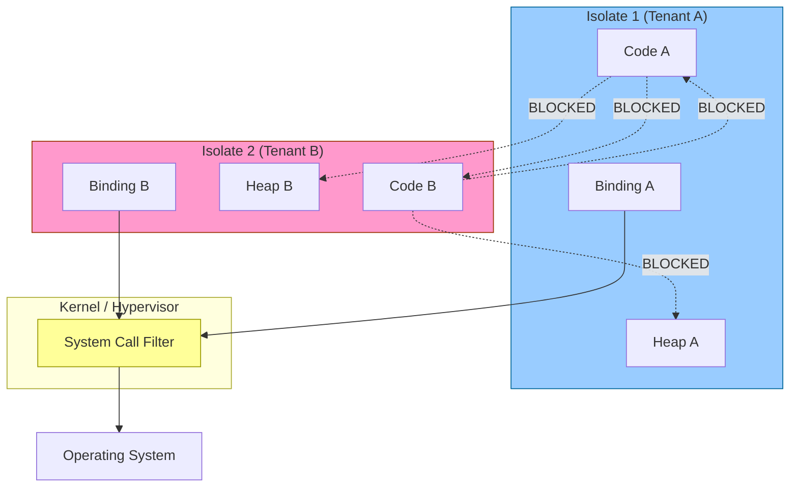
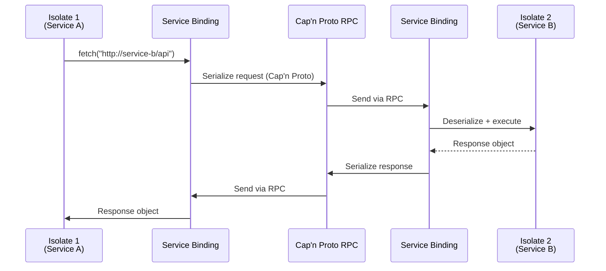

# Isolate Architecture Deep Dive

**Created:** 2026-03-27

**Related:** [Zero to Runtime Engineer](00-zero-to-runtime-engineer.md), [Worker Lifecycle](../src/workerd/io/worker.h)

---

## Table of Contents

1. [Executive Summary](#executive-summary)
2. [V8 Isolate Fundamentals](#v8-isolate-fundamentals)
3. [Isolate Lifecycle in workerd](#isolate-lifecycle-in-workerd)
4. [Memory Model and GC](#memory-model-and-gc)
5. [Thread Safety and Locking](#thread-safety-and-locking)
6. [Security Boundaries](#security-boundaries)
7. [Isolate-to-Isolate Communication](#isolate-to-isolate-communication)
8. [Resource Limits and Enforcement](#resource-limits-and-enforcement)
9. [Implementation Details](#implementation-details)
10. [Rust Translation Guide](#rust-translation-guide)

---

## Executive Summary

A **V8 Isolate** is the fundamental isolation primitive in workerd. Each isolate is:

- A **complete virtual machine** with its own heap, stack, and execution context
- **Thread-local** - only one thread can execute code in an isolate at a time
- **Memory-isolated** - cannot access another isolate's memory directly
- **Independently garbage-collected** - each isolate has its own GC cycles
- **Capability-gated** - external resource access requires explicit bindings

### Isolate Architecture Diagram



---

## V8 Isolate Fundamentals

### What is an Isolate?

From V8's perspective, an isolate is:

```cpp
// V8's isolate.h (simplified)
class Isolate {
  // Memory management
  Heap heap_;                    // Garbage-collected heap
  MemoryAllocator allocator_;    // Low-level memory allocation

  // Execution state
  TopLevelState toplevel_;       // Global execution context
  ThreadLocalTop thread_data_;   // Thread-local stack data

  // Compilation
  Builtins builtins_;            // Built-in functions
  TypeFeedbackDatabase tfd_;     // Optimization feedback

  // Garbage collection
  HeapCollector collector_;      // GC implementation
  StrongRootPointers roots_;     // GC root pointers

  // Thread management
  Mutex mutex_;                  // Isolate lock
  ThreadId thread_id_;           // Owning thread
};
```

### Isolate Creation in workerd

```cpp
// worker.c++ - Simplified isolate creation
Worker::Isolate::Isolate(
    kj::Own<IsolateLimitEnforcer> limitEnforcer,
    CompatibilityFlags::Reader compatFlags
) : limitEnforcer(kj::mv(limitEnforcer)) {

  // 1. Create V8 isolate with configuration
  v8::Isolate::CreateParams createParams;
  createParams.array_buffer_allocator = v8::ArrayBuffer::Allocator::NewDefaultAllocator();
  createParams.snapshot_blob = getSnapshotBlob();  // Pre-compiled builtins

  // 2. Set up memory limits
  createParams.max_old_space_size = getHeapLimit();

  // 3. Create the isolate
  isolate_ = v8::Isolate::New(createParams);

  // 4. Enter isolate scope
  v8::Locker locker(isolate_);
  v8::Isolate::Scope isolateScope(isolate_);

  // 5. Create global context
  v8::Local<v8::ObjectTemplate> global = v8::ObjectTemplate::New(isolate_);
  installBuiltins(global);

  v8::Local<v8::Context> context =
      v8::Context::New(isolate_, nullptr, global);

  // 6. Store C++ pointer in context for retrieval
  context->SetEmbedderData(
      JSG_CONTEXT_INDEX,
      v8::External::New(isolate_, this)
  );
}
```

### Isolate States



---

## Isolate Lifecycle in workerd

### Full Lifecycle Flow



### Worker::Isolate Class Structure

```cpp
// worker.h - Core isolate wrapper
class Worker::Isolate final: public kj::AtomicRefcounted {
 public:
  // V8 isolate pointer
  v8::Isolate* isolate();

  // JSG context for bindings
  jsg::JsContext& getContext();

  // Module registry
  ModuleRegistry& getModuleRegistry();

  // Compatibility flags
  CompatibilityFlags::Reader getCompatibilityFlags();

  // Limit enforcement
  IsolateLimitEnforcer& getLimitEnforcer();

  // GC tracking
  void visitForGc(jsg::GcVisitor& visitor);

 private:
  // The actual V8 isolate
  v8::Global<v8::Isolate> isolate_;

  // JSG context (bindings, type registry)
  jsg::JsContext context_;

  // Compiled modules
  ModuleRegistry modules_;

  // Memory/CPU limits
  kj::Own<IsolateLimitEnforcer> limitEnforcer_;

  // Observer for metrics
  IsolateObserver observer_;
};
```

---

## Memory Model and GC

### V8 Heap Layout

```
┌─────────────────────────────────────────────────────────┐
│                    V8 Heap                               │
├─────────────────────────────────────────────────────────┤
│  New Space (Young Generation)                           │
│  ┌──────────────┐  ┌──────────────┐                    │
│  │   From       │  │     To       │  ← Scavenge GC     │
│  │  (collect)   │  │  (survive)   │                    │
│  └──────────────┘  └──────────────┘                    │
├─────────────────────────────────────────────────────────┤
│  Old Space (Old Generation)                            │
│  ┌──────────────────────────────────────────────────┐  │
│  │           Mark-Sweep / Mark-Compact              │  │
│  │    (long-lived objects, collected less often)    │  │
│  └──────────────────────────────────────────────────┘  │
├─────────────────────────────────────────────────────────┤
│  Large Object Space                                     │
│  ┌──────────────────────────────────────────────────┐  │
│  │  Arrays > 1MB, Strings > 8KB (collected rarely)  │  │
│  └──────────────────────────────────────────────────┘  │
└─────────────────────────────────────────────────────────┘
```

### GC Integration with C++

workerd objects that hold V8 references **must** participate in GC:

```cpp
// Wrappable.h - Base class for JS-exposed objects
class Wrappable: public kj::AtomicRefcounted {
 public:
  // Called when GC visits this object
  virtual void visitForGc(jsg::GcVisitor& visitor) {
    // Visit all jsg::Ref<T> members
    visitor.visit(myRefPtr);
    visitor.visit(myV8Ref);
  }

  // Called when JS wrapper is created
  virtual void attachWrapper(v8::Local<v8::Object> wrapper);

  // Called when wrapper is detached
  virtual void detachWrapper();

 private:
  // Weak callback: called when JS object is collected
  static void weakCallback(
      const v8::WeakCallbackInfo<Wrappable>& data
  );
};
```

### jsg::Ref<T> Memory Tracking

```cpp
// jsg/ref.h - Smart pointer for JS-exposed objects
template <typename T>
class Ref {
 public:
  // Holds strong reference to C++ object
  // Automatically visited during GC
  kj::Own<T> ptr_;

  // When dereferenced, returns JS wrapper
  v8::Local<v8::Object> getWrapper(jsg::Lock& js);

  // GC visitor visits this
  void visitForGc(jsg::GcVisitor& visitor) {
    visitor.visit(ptr_);
  }
};

// Usage in a resource class
class MyAPI: public jsg::Object {
  jsg::Ref<ReadableStream> stream_;  // GC-tracked
  jsg::V8Ref<v8::Function> callback_; // Also GC-tracked

  void visitForGc(jsg::GcVisitor& visitor) override {
    visitor.visit(stream_);
    visitor.visit(callback_);
  }
};
```

### Memory Limits

```cpp
// limit-enforcer.h - Enforces isolate memory limits
class IsolateLimitEnforcer {
 public:
  // Get current heap size
  virtual size_t getHeapSize() = 0;

  // Get maximum allowed heap size
  virtual size_t getHeapLimit() = 0;

  // Check if allocation would exceed limit
  virtual bool checkHeapLimit(size_t additionalBytes);

  // Called before large allocations
  virtual void trackAllocation(size_t bytes);

  // Called on deallocation
  virtual void trackDeallocation(size_t bytes);
};

// Implementation for actors
class ActorLimitEnforcer: public IsolateLimitEnforcer {
  size_t heapLimit_;
  size_t currentUsage_;

  bool checkHeapLimit(size_t additionalBytes) override {
    return currentUsage_ + additionalBytes <= heapLimit_;
  }
};
```

---

## Thread Safety and Locking

### The Lock Pattern

V8 isolates are **thread-local**: only one thread can execute in an isolate at a time.

```cpp
// v8::Locker - RAII lock for isolate
{
  v8::Locker locker(isolate);  // Acquire lock

  // Only this thread can execute in isolate now
  v8::Isolate::Scope isolateScope(isolate);
  v8::HandleScope handleScope(isolate);

  // Execute JavaScript
  Local<Function> handler = getHandler();
  handler->Call(context, receiver, argc, argv);

}  // Lock automatically released
```

### AsyncLock: Fair Lock Acquisition

workerd implements **fair locking** to prevent starvation:

```cpp
// worker.h - AsyncLock for fair isolate access
class Worker::AsyncLock {
  // When destroyed, releases the async lock
  // but NOT the regular Worker::Lock
};

class Worker {
 public:
  // Get in queue for async lock
  kj::Promise<AsyncLock> takeAsyncLock();

  // Regular lock (must be acquired AFTER AsyncLock)
  class Lock {
    // Holds isolate while in scope
  };
};

// Usage pattern
kj::Promise<void> handleRequest() {
  // 1. Get in queue for fair access
  auto asyncLock = co_await worker->takeAsyncLock();

  // 2. Now acquire actual isolate lock
  auto lock = worker->getLock();

  // 3. Execute in lock scope
  co_await runInLockScope([&]() {
    // JavaScript execution here
  });
}
```

### Lock Ordering

```
┌────────────────────────────────────────┐
│           Lock Acquisition              │
│                                        │
│  1. AsyncLock (fair queue)             │
│         ↓                               │
│  2. Worker::Lock (isolate lock)        │
│         ↓                               │
│  3. HandleScope (V8 handles)           │
│         ↓                               │
│  4. TryCatch (error handling)          │
│         ↓                               │
│  5. Execute JavaScript                 │
└────────────────────────────────────────┘
```

### Deadlock Prevention

workerd prevents deadlocks through:

1. **Lock ordering** - Always acquire locks in the same order
2. **No nested locks** - Don't acquire isolate lock while holding another
3. **Scope-based** - All locks are RAII, released when scope exits
4. **Timeout detection** - Limits detect infinite loops

---

## Security Boundaries

### Isolate as Security Boundary



### Capability-Based Bindings

Workders cannot access resources without explicit **bindings**:

```capnp
# workerd.capnp - Capability-based bindings
struct Worker {
  bindings :List(Binding);
}

struct Binding {
  name @0 :Text;  # JavaScript binding name

  union {
    # Service binding (RPC to another service)
    service @1 :ServiceDesignator;

    # KV namespace
    kvNamespace @2 :KVNamespace;

    # R2 bucket
    r2Bucket @3 :R2Bucket;

    # D1 database
    d1Database @4 :D1Database;

    # Secret value
    secret @5 :Text;

    # JSON data
    json @6 :Dynamic;
  }
}
```

### Ambient Authority Prevention

```cpp
// worker.c++ - No ambient HTTP access
class WorkerGlobalScope: public jsg::Object {
 public:
  // fetch() requires an explicit binding
  jsg::Promise<jsg::Ref<Response>> fetch(
      jsg::Lock& js,
      jsg::Ref<Request> request
  ) {
    // Must get HttpClient from binding
    auto& binding = getServiceBinding("OUTBOUND");
    auto client = binding.getHttpClient();

    // Cannot create arbitrary HTTP clients
    return client->sendRequest(request);
  }
};
```

---

## Isolate-to-Isolate Communication

### Service Bindings (RPC)

Isolates communicate via **Cap'n Proto RPC**:



### RPC Serialization

```cpp
// worker-rpc.c++ - RPC serialization
class Fetcher {
 public:
  // Called when fetch() is invoked
  kj::Promise<jsg::Ref<Response>> fetch(
      jsg::Lock& js,
      jsg::Ref<Request> request,
      FetcherOptions options
  ) {
    // 1. Serialize request to Cap'n Proto
    capnp::MallocMessageBuilder builder;
    auto rpcRequest = builder.initRoot<RpcRequest>();
    serializeRequest(rpcRequest, request, options);

    // 2. Send via RPC
    auto rpcResponse = co_await capability->call(rpcRequest);

    // 3. Deserialize response
    co_return deserializeResponse(js, rpcResponse);
  }
};
```

---

## Resource Limits and Enforcement

### Limit Categories

| Category | Limit | Enforcement |
|----------|-------|-------------|
| **Memory** | 128MB (free), 2GB (paid) | Hard limit → exception |
| **CPU** | 50ms (free), 30s (paid) | Wall-clock time check |
| **Wall Time** | 15s total | Timeout exception |
| **Subrequests** | 50 per request | Counter → exception |
| **Heap Objects** | ~1M objects | GC pressure + limit |

### CPU Time Tracking

```cpp
// worker.c++ - CPU time tracking
class Worker::Isolate {
  kj::Timer& timer;
  kj::Date cpuStartTime;
  kj::Duration cpuTimeBudget;

  void checkCpuTime() {
    auto now = timer.now();
    auto elapsed = now - cpuStartTime;

    if (elapsed > cpuTimeBudget) {
      // Throw CPU time exceeded exception
      throwJsException("CPU time exceeded limit");
    }
  }
};

// Called periodically during execution
void isolate->RequestInterrupt(
    [](v8::Isolate* isolate, void* data) {
      static_cast<Isolate*>(data)->checkCpuTime();
    }
);
```

### Memory Limit Enforcement

```cpp
// memory.c++ - Heap limit callback
void OOMErrorHandler(const char* location, bool is_heap_oom) {
  // V8 calls this when allocation fails
  if (is_heap_oom) {
    // Throw JavaScript exception
    throwJsException("Heap memory limit exceeded");
  } else {
    // Fatal error
    abort();
  }
}

// Set up heap limit callback
isolate->SetOOMErrorHandler(OOMErrorHandler);
```

---

## Implementation Details

### Context Embedder Data Slots

V8 contexts have **embedder data slots** for C++ pointers:

```cpp
// jsg/jsg.h - Embedder data indices
enum {
  // Slot 0: Reserved by V8
  EMBEDDER_DATA_RESERVED = 0,

  // Slot 1: Global object wrapper
  EMBEDDER_DATA_GLOBAL_WRAPPER = 1,

  // Slot 2: Module registry
  EMBEDDER_DATA_MODULE_REGISTRY = 2,

  // Slot 3: Extended context wrapper
  EMBEDDER_DATA_EXTENDED_CONTEXT = 3,

  // Slot 4: Virtual file system
  EMBEDDER_DATA_VIRTUAL_FILE_SYSTEM = 4,

  // Slot 5: Rust realm pointer
  EMBEDDER_DATA_RUST_REALM = 5,

  EMBEDDER_DATA_SLOT_COUNT
};

// Setting/getting embedder data
context->SetEmbedderData(EMBEDDER_DATA_MODULE_REGISTRY,
    v8::External::New(isolate, moduleRegistry));

auto data = context->GetEmbedderData(EMBEDDER_DATA_MODULE_REGISTRY);
auto registry = reinterpret_cast<ModuleRegistry*>(
    data.As<v8::External>()->Value()
);
```

### Wrapper Caching

To avoid recreating JS wrappers, workerd caches them:

```cpp
// wrappable.c++ - Wrapper caching
class Wrappable {
  v8::Global<v8::Object> wrapper_;

  v8::Local<v8::Object> getWrapper(jsg::Lock& js) {
    if (wrapper_.IsEmpty()) {
      // Create new wrapper
      auto template = getTemplate(js);
      auto newWrapper = template->GetFunction(js.v8Isolate)
          ->NewInstance(js.v8Context, 0, nullptr).ToLocalChecked();

      // Store C++ pointer in internal field
      newWrapper->SetInternalField(0,
          v8::External::New(js.v8Isolate, this));

      // Cache wrapper
      wrapper_.Reset(js.v8Isolate, newWrapper);
    }

    return wrapper_.Get(js.v8Isolate);
  }
};
```

---

## Rust Translation Guide

### Rust Isolate Structure

```rust
// workerd-isolate/src/isolate.rs

use std::cell::RefCell;
use std::rc::Rc;
use rquickjs::{Context, Runtime, Function, Value};

pub struct Isolate {
    // QuickJS runtime (one per process)
    runtime: Runtime,

    // Context (one per isolate)
    context: Context,

    // Module registry
    modules: ModuleRegistry,

    // Memory limits
    limits: IsolateLimits,

    // GC tracking
    gc_handles: GcHandleStore,
}

pub struct IsolateGuard<'a> {
    ctx: &'a Context,
    _guard: RuntimeGuard<'a>,
}

impl Isolate {
    pub fn new(limits: IsolateLimits) -> Self {
        let runtime = Runtime::new().unwrap();
        let context = Context::full(&runtime).unwrap();

        Self {
            runtime,
            context,
            modules: ModuleRegistry::new(),
            limits,
            gc_handles: GcHandleStore::new(),
        }
    }

    pub fn enter(&self) -> IsolateGuard {
        IsolateGuard {
            ctx: &self.context,
            _guard: RuntimeGuard::new(&self.runtime),
        }
    }

    pub fn execute<F, R>(&self, f: F) -> Result<R, JsError>
    where
        F: FnOnce(&Context) -> Result<R, rquickjs::Error>,
    {
        let _guard = self.enter();
        self.context.with(|ctx| f(&ctx).map_err(JsError::from))
    }
}
```

### GC Handle Management

```rust
// workerd-isolate/src/gc.rs

use std::cell::RefCell;
use rquickjs::{Persistent, Value, Ctx};

pub struct GcHandleStore {
    handles: RefCell<Vec<GcHandle>>,
}

enum GcHandle {
    Value(Persistent<Value>),
    Object(Persistent<rquickjs::Object>),
    Function(Persistent<Function>),
}

impl GcHandleStore {
    pub fn new() -> Self {
        Self {
            handles: RefCell::new(Vec::new()),
        }
    }

    pub fn store(&self, ctx: &Ctx, value: Value) -> GcToken {
        let persistent = Persistent::new(ctx, value);
        let token = GcToken(self.handles.borrow().len());
        self.handles.borrow_mut()
            .push(GcHandle::Value(persistent));
        token
    }

    pub fn get(&self, ctx: &Ctx, token: GcToken) -> Option<Value> {
        match &self.handles.borrow()[token.0] {
            GcHandle::Value(p) => Some(p.get(ctx)),
            _ => None,
        }
    }

    pub fn remove(&self, token: GcToken) {
        self.handles.borrow_mut()
            .swap_remove(token.0);
    }
}
```

### Lock Pattern in Rust

```rust
// workerd-isolate/src/lock.rs

use std::sync::{Arc, Mutex};
use tokio::sync::Semaphore;

pub struct IsolateLock {
    // Semaphore for fair async locking
    semaphore: Arc<Semaphore>,

    // Mutex for actual isolate access
    mutex: Arc<Mutex<()>>,
}

pub struct LockedIsolate<'a> {
    _permit: tokio::sync::SemaphorePermit<'a>,
    _guard: std::sync::MutexGuard<'a, ()>,
}

impl IsolateLock {
    pub fn new() -> Self {
        Self {
            semaphore: Arc::new(Semaphore::new(1)),
            mutex: Arc::new(Mutex::new(())),
        }
    }

    pub async fn acquire(&self) -> LockedIsolate {
        // 1. Acquire semaphore permit (fair queue)
        let permit = self.semaphore.acquire().await.unwrap();

        // 2. Acquire mutex
        let guard = self.mutex.lock().unwrap();

        LockedIsolate {
            _permit: permit,
            _guard: guard,
        }
    }
}
```

### Key Challenges for Rust

1. **QuickJS vs V8**: QuickJS is simpler but lacks V8's performance
2. **GC Integration**: Rust's ownership model conflicts with GC
3. **Async Bridging**: KJ promises vs Tokio futures
4. **Memory Tracking**: Manual tracking without V8's heap hooks

---

## References

- [V8 Isolate Documentation](https://v8.dev/docs/isolates)
- [worker.h](../../src/workerd/io/worker.h) - Worker implementation
- [jsg/resource.h](../../src/workerd/jsg/resource.h) - Resource type bindings
- [jsg/memory.h](../../src/workerd/jsg/memory.h) - Memory management
