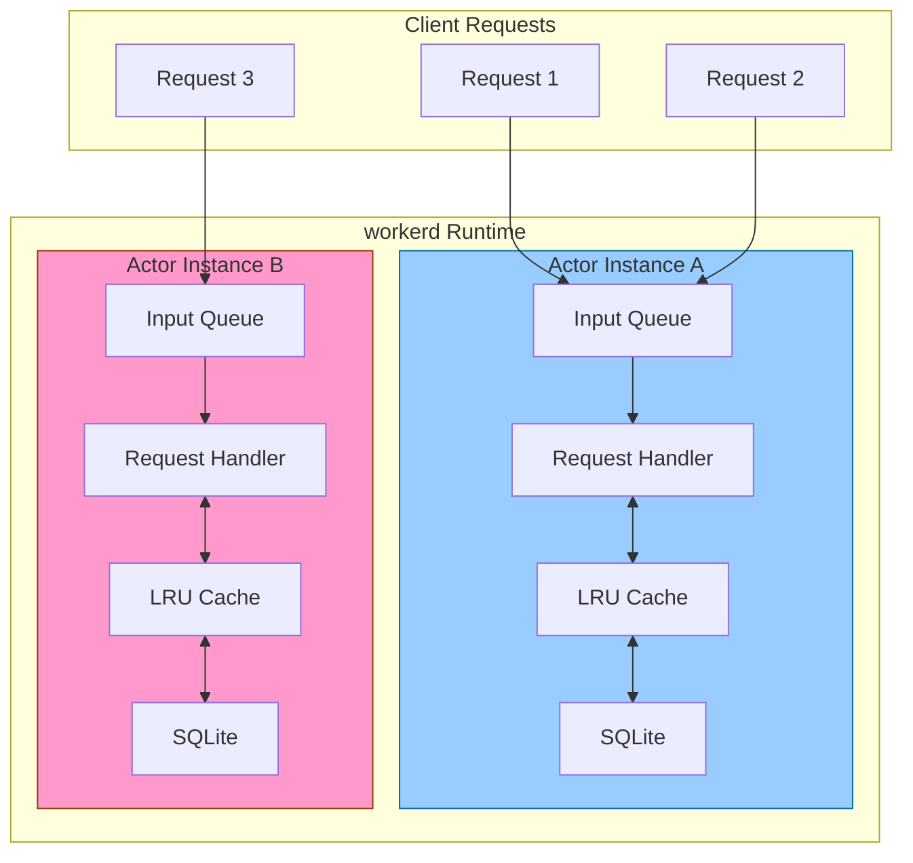
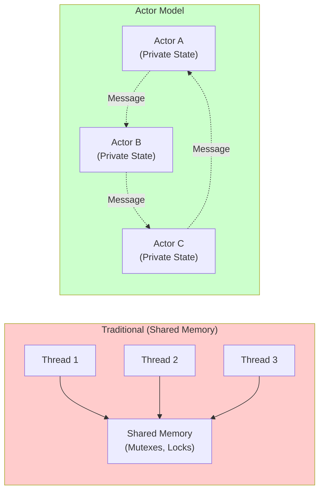
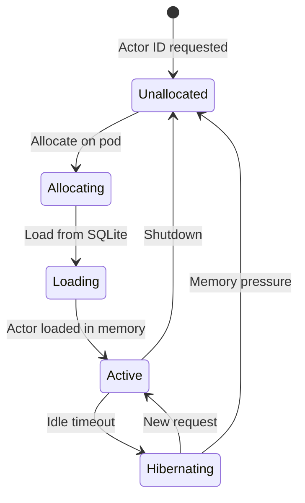
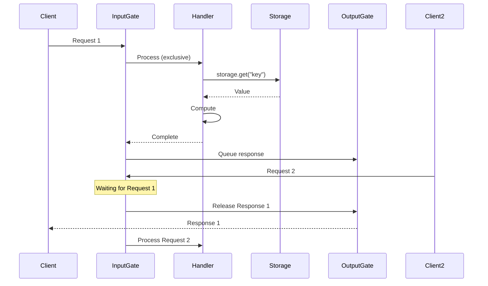
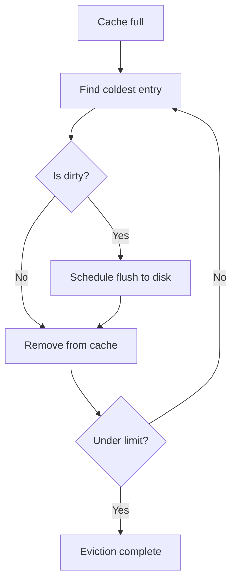
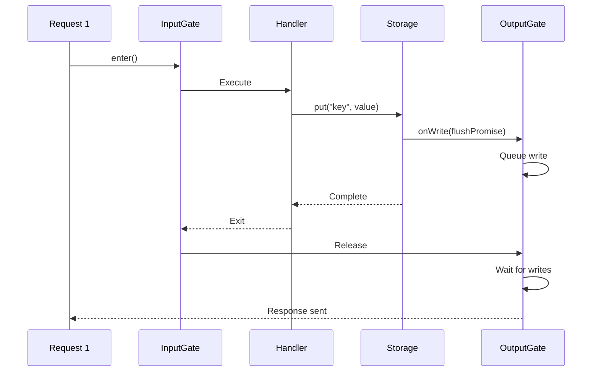
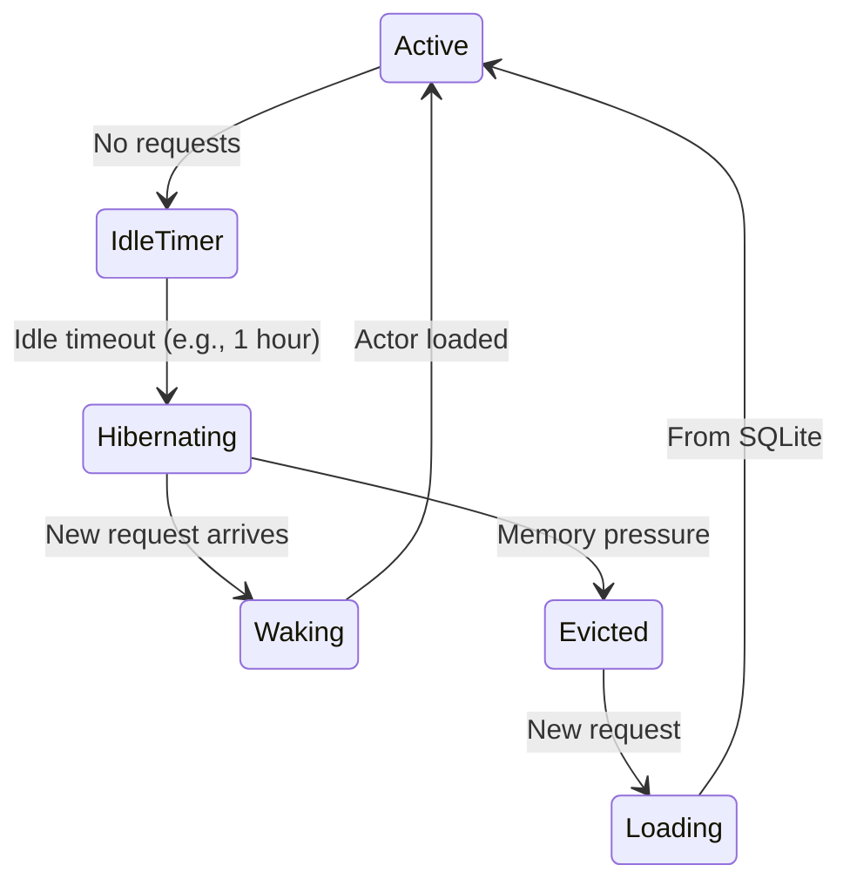
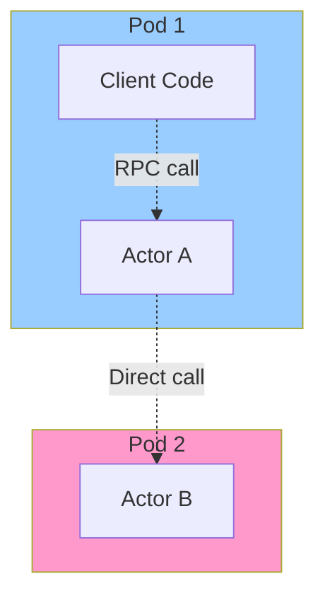

# Actor Model Deep Dive: Durable Objects and Stateful Serverless

**Created:** 2026-03-27

**Related:** [io/actor-cache.c++](../../src/workerd/io/actor-cache.c++), [io/actor-sqlite.c++](../../src/workerd/io/actor-sqlite.c++)

---

## Table of Contents

1. [Executive Summary](#executive-summary)
2. [The Actor Model Explained](#the-actor-model-explained)
3. [Durable Objects Architecture](#durable-objects-architecture)
4. [Actor Storage System](#actor-storage-system)
5. [Caching and LRU Eviction](#caching-and-lru-eviction)
6. [Input/Output Gates](#inputoutput-gates)
7. [Hibernation and Waking](#hibernation-and-waking)
8. [RPC and Colocation](#rpc-and-colocation)
9. [SQLite Integration](#sqlite-integration)
10. [Rust Translation Guide](#rust-translation-guide)

---

## Executive Summary

**Durable Objects** are Cloudflare's implementation of the **actor model** - a concurrency pattern that enables stateful serverless computing.

### Key Properties

| Property | Description |
|----------|-------------|
| **Single-threaded** | One request processed at a time per actor |
| **Persistent state** | SQLite-backed storage survives restarts |
| **Location transparent** | Actors addressed by ID, not location |
| **Colocated execution** | Code runs where data lives |
| **Automatic caching** | LRU cache minimizes disk I/O |
| **Hibernatable** | Idle actors unloaded from memory |

### Actor System Diagram



---

## The Actor Model Explained

### What is the Actor Model?

The actor model is a **mathematical model of concurrent computation** where:

1. **Actors** are the fundamental unit of computation
2. Each actor has **private state**
3. Actors communicate via **asynchronous messages**
4. Each actor processes **one message at a time**
5. Actors can **create other actors**

### Actor Model vs Traditional Concurrency



### Benefits for Serverless

| Challenge | Traditional | Actor Model |
|-----------|-------------|-------------|
| **State management** | External database | Built-in storage |
| **Concurrency** | Locks, race conditions | Sequential processing |
| **Scaling** | Manual sharding | Automatic distribution |
| **Consistency** | Eventually consistent | Strongly consistent |

---

## Durable Objects Architecture

### Actor Lifecycle



### Actor Instance Structure

```cpp
// actor.h - Core actor structure
class Worker::Actor final {
 public:
  // Actor identification
  const ActorId& getId();

  // Input gate (sequential processing)
  InputGate& getInputGate();

  // Output gate (ordered responses)
  OutputGate& getOutputGate();

  // Storage interface
  ActorCacheInterface& getStorage();

  // Hibernation manager
  HibernationManager& getHibernationManager();

 private:
  // Unique actor identifier
  ActorId id_;

  // Ensures sequential request processing
  InputGate inputGate_;

  // Ensures ordered output
  OutputGate outputGate_;

  // LRU cache + SQLite backend
  kj::Own<ActorCacheInterface> storage_;

  // Handles hibernation
  kj::Maybe<HibernationManager> hibernationManager_;
};
```

### Request Processing Flow



---

## Actor Storage System

### Storage Architecture

```
┌─────────────────────────────────────────────────────┐
│              Actor Storage Stack                     │
├─────────────────────────────────────────────────────┤
│  JavaScript API                                      │
│  await storage.get("key")                           │
├─────────────────────────────────────────────────────┤
│  ActorCacheInterface                                 │
│  (Abstract storage interface)                        │
├─────────────────────────────────────────────────────┤
│  ActorCache                                          │
│  (LRU cache, transaction support)                    │
├─────────────────────────────────────────────────────┤
│  ActorSqlite                                         │
│  (SQLite backend with custom VFS)                    │
├─────────────────────────────────────────────────────┤
│  SQLite Database                                     │
│  (One file per actor namespace)                      │
└─────────────────────────────────────────────────────┘
```

### Key-Value Operations

```cpp
// actor-cache.h - Storage interface
class ActorCacheOps {
 public:
  // Read operations
  virtual kj::OneOf<kj::Maybe<Value>, kj::Promise<kj::Maybe<Value>>>
  get(Key key, ReadOptions options) = 0;

  virtual kj::OneOf<GetResultList, kj::Promise<GetResultList>>
  list(Key begin, kj::Maybe<Key> end,
       kj::Maybe<uint> limit, ReadOptions options) = 0;

  // Write operations
  virtual kj::Maybe<kj::Promise<void>>
  put(Key key, Value value, WriteOptions options) = 0;

  virtual kj::OneOf<bool, kj::Promise<bool>>
  delete_(Key key, WriteOptions options) = 0;

  // Alarm operations
  virtual kj::Maybe<kj::Promise<void>>
  setAlarm(kj::Maybe<kj::Date> newTime, WriteOptions options) = 0;
};
```

### Transaction Support

```cpp
// actor-cache.c++ - Transaction implementation
class ActorCache::Transaction final: public ActorCacheOps {
 public:
  // Batch operations
  void put(Key key, Value value);
  void delete_(Key key);

  // Read with snapshot isolation
  kj::Maybe<Value> get(Key key);

  // Commit all changes
  kj::Maybe<kj::Promise<void>> commit(WriteOptions options);

 private:
  // Write buffer (applied on commit)
  kj::HashMap<Key, kj::Maybe<Value>> writes_;

  // Snapshot for reads
  kj::HashMap<Key, Value> snapshot_;
};
```

---

## Caching and LRU Eviction

### Cache Structure

```
┌──────────────────────────────────────────────────────┐
│              ActorCache LRU Structure                 │
├──────────────────────────────────────────────────────┤
│  Hot Cache (Recently accessed)                        │
│  ┌─────────┐ ┌─────────┐ ┌─────────┐                │
│  │ Key: A  │ │ Key: B  │ │ Key: C  │  ← Most recent │
│  │ Value:… │ │ Value:… │ │ Value:… │                │
│  └─────────┘ └─────────┘ └─────────┘                │
├──────────────────────────────────────────────────────┤
│  Cold Cache (Less frequently accessed)                │
│  ┌─────────┐ ┌─────────┐ ┌─────────┐                │
│  │ Key: X  │ │ Key: Y  │ │ Key: Z  │  ← Least recent│
│  │ Value:… │ │ Value:… │ │ Value:… │                │
│  └─────────┘ └─────────┘ └─────────┘                │
├──────────────────────────────────────────────────────┤
│  Dirty Entries (Pending flush to disk)                │
│  ┌─────────┐ ┌─────────┐                             │
│  │ Key: A* │ │ Key: Y* │  (* = modified)             │
│  └─────────┘ └─────────┘                             │
└──────────────────────────────────────────────────────┘
```

### LRU Implementation

```cpp
// actor-cache.c++ - LRU cache management
class ActorCache::SharedLru final {
 public:
  // Total cache size limit
  static constexpr size_t MAX_CACHE_BYTES = 256 * 1024 * 1024;

  // Access entry (moves to front of LRU list)
  void touch(Entry* entry);

  // Add new entry
  void add(kj::Own<Entry> entry);

  // Evict entries until under limit
  void evictUntilUnderLimit();

 private:
  // Total cached bytes
  size_t totalBytes_ = 0;

  // Doubly-linked list for O(1) LRU operations
  kj::List<Entry, &Entry::link> list_;

  // Lookup by key
  kj::HashMap<Key, Entry*> entries_;
};

// Entry structure
struct Entry {
  Key key;
  Value value;
  bool isDirty;  // Needs flush to disk

  // LRU links
  kj::ListLink<Entry> link;
};
```

### Eviction Policy



---

## Input/Output Gates

### Purpose of Gates

**Gates** ensure:
1. **Sequential processing** - One request at a time
2. **Ordered output** - Responses sent in order
3. **Durability** - Writes flushed before acknowledging

### Input Gate

```cpp
// io-gate.h - Input gate implementation
class InputGate final {
 public:
  // Called when request starts processing
  void enter();

  // Called when request completes
  void exit();

  // Check if currently processing
  bool isProcessing();

  // Wait for current request to complete
  kj::Promise<void> waitForCurrent();

 private:
  // Current request count (0 or 1)
  uint processingCount_ = 0;

  // Queue of waiting requests
  kj::Vector<kj::Own<Waiter>> waiters_;
};
```

### Output Gate

```cpp
// io-gate.h - Output gate implementation
class OutputGate final {
 public:
  // Called before sending response
  kj::Promise<void> wait();

  // Called when write starts
  kj::Promise<void> onWrite(kj::Promise<void> write);

  // Break the gate (force release)
  void break_();

 private:
  // Pending writes
  kj::Vector<kj::Promise<void>> pendingWrites_;

  // Broken state
  kj::Maybe<kj::Exception> broken_;
};
```

### Gate Interaction



---

## Hibernation and Waking

### Hibernation Lifecycle



### Hibernation Manager

```cpp
// hibernation-manager.h
class HibernationManager final {
 public:
  // Called when actor becomes idle
  void onIdle();

  // Called when new request arrives
  void onWakeup();

  // Check if actor should hibernate
  bool shouldHibernate();

  // Get hibernation state
  kj::Maybe<HibernationState> getState();

 private:
  // Last request time
  kj::Date lastRequestTime_;

  // Idle timeout
  kj::Duration idleTimeout_;

  // Hibernation timer
  kj::Maybe<kj::Promise<void>> hibernationTimer_;
};
```

### WebSocket Hibernation

```cpp
// hibernatable-web-socket.h
class HibernatableWebSocket final {
 public:
  // WebSocket can survive actor hibernation
  // State is serialized to SQLite

  // Called before hibernation
  void prepareForHibernation();

  // Called after waking
  void restoreFromHibernation();

  // Get stored state
  kj::Array<byte> getSerializedState();

 private:
  // WebSocket state to preserve
  kj::String url_;
  kj::String protocol_;
  kj::Maybe<kj::String> extensions_;
};
```

---

## RPC and Colocation

### Service Binding RPC



### Colocation Optimization

When actors are **colocated** on the same pod:

1. **Direct function calls** instead of RPC
2. **Zero-copy data transfer**
3. **Shared LRU cache**
4. **Reduced latency**

```cpp
// worker-rpc.c++ - Colocated call optimization
class ColocatedFetcher: public Fetcher {
  // Direct reference to local actor
  Worker::Actor& localActor;

  kj::Promise<jsg::Ref<Response>> fetch(
      jsg::Lock& js,
      jsg::Ref<Request> request
  ) override {
    // Direct call - no RPC serialization
    auto& ioContext = localActor.getIoContext();
    co_await ioContext.runInCtx([&]() {
      return handleRequest(request);
    });
  }
};
```

---

## SQLite Integration

### Custom VFS (Virtual File System)

```cpp
// actor-sqlite.c++ - KJ-backed SQLite VFS
class SqliteDatabase::Vfs {
 public:
  // Create VFS for KJ filesystem
  static Vfs create(kj::fs::Directory& dir);

  // SQLite calls these for file I/O
  static int xOpen(sqlite3_vfs*, const char* zName,
                   sqlite3_file*, int flags, int* pOutFlags);
  static int xRead(sqlite3_file*, void*, int iAmt, i64 iOfst);
  static int xWrite(sqlite3_file*, const void*, int iAmt, i64 iOfst);
};
```

### Database Schema

```sql
-- Actor storage schema
CREATE TABLE kv (
  key TEXT PRIMARY KEY,
  value BLOB NOT NULL
);

-- Alarm storage
CREATE TABLE alarm (
  id INTEGER PRIMARY KEY CHECK (id = 1),
  scheduledTime INTEGER NOT NULL
);

-- WAL checkpoint tracking
CREATE TABLE _cf_checkpoints (
  walVersion INTEGER PRIMARY KEY,
  checkpointSeq INTEGER NOT NULL
);
```

### Write-Ahead Logging

```
┌─────────────────────────────────────────────────────┐
│           SQLite WAL Mode                            │
├─────────────────────────────────────────────────────┤
│  DB File (kv.sqlite)                                 │
│  ┌─────────────────────────────────────────────┐    │
│  │ Committed data (read-only during WAL)       │    │
│  └─────────────────────────────────────────────┘    │
├─────────────────────────────────────────────────────┤
│  WAL File (kv.sqlite-wal)                           │
│  ┌─────────────────────────────────────────────┐    │
│  │ Uncommitted writes                          │    │
│  │ [Tx1: PUT A=1] [Tx2: PUT B=2] [checkpoint]  │    │
│  └─────────────────────────────────────────────┘    │
├─────────────────────────────────────────────────────┤
│  SHM File (kv.sqlite-shm)                           │
│  ┌─────────────────────────────────────────────┐    │
│  │ Shared memory for WAL indexing              │    │
│  └─────────────────────────────────────────────┘    │
└─────────────────────────────────────────────────────┘
```

---

## Rust Translation Guide

### Actor Structure in Rust

```rust
// workerd-actor/src/actor.rs

use std::collections::{HashMap, VecDeque};
use std::sync::Arc;
use tokio::sync::{Mutex, Semaphore};
use rusqlite::{Connection, params};

pub struct Actor {
    // Unique identifier
    id: ActorId,

    // Input gate (sequential processing)
    input_gate: InputGate,

    // Output gate (ordered responses)
    output_gate: OutputGate,

    // LRU cache
    cache: ActorCache,

    // SQLite connection
    db: Arc<Mutex<Connection>>,
}

pub struct ActorId {
    namespace: String,
    unique_id: String,
}

impl Actor {
    pub fn new(id: ActorId, db_path: &str) -> Result<Self, Error> {
        let conn = Connection::open(db_path)?;
        Self::with_connection(id, conn)
    }

    pub fn with_connection(id: ActorId, conn: Connection) -> Result<Self, Error> {
        Ok(Self {
            id,
            input_gate: InputGate::new(),
            output_gate: OutputGate::new(),
            cache: ActorCache::new(256 * 1024 * 1024), // 256MB
            db: Arc::new(Mutex::new(conn)),
        })
    }

    pub async fn handle_request<F, R>(&self, f: F) -> Result<R, Error>
    where
        F: FnOnce() -> Result<R, Error>,
    {
        // 1. Acquire input gate (exclusive access)
        let _guard = self.input_gate.enter().await?;

        // 2. Execute handler
        let result = f()?;

        // 3. Wait for output gate (all writes flushed)
        self.output_gate.wait().await?;

        Ok(result)
    }
}
```

### LRU Cache in Rust

```rust
// workerd-actor/src/cache.rs

use std::collections::HashMap;
use linked_hash_map::LinkedHashMap;

pub struct ActorCache {
    // LRU-ordered map
    map: LinkedHashMap<String, CacheEntry>,

    // Current size in bytes
    size_bytes: usize,

    // Maximum size
    max_size_bytes: usize,
}

struct CacheEntry {
    value: Vec<u8>,
    is_dirty: bool,
}

impl ActorCache {
    pub fn new(max_size_bytes: usize) -> Self {
        Self {
            map: LinkedHashMap::new(),
            size_bytes: 0,
            max_size_bytes,
        }
    }

    pub fn get(&mut self, key: &str) -> Option<&[u8]> {
        // Touch entry (move to front of LRU)
        self.map.get_refresh(key).map(|e| e.value.as_slice())
    }

    pub fn put(&mut self, key: String, value: Vec<u8>) {
        let size = value.len();

        // Evict if needed
        while self.size_bytes + size > self.max_size_bytes {
            self.evict_coldest();
        }

        // Add to cache
        if let Some(old) = self.map.insert(key, CacheEntry {
            value,
            is_dirty: true,
        }) {
            self.size_bytes -= old.value.len();
        }
        self.size_bytes += size;
    }

    fn evict_coldest(&mut self) {
        if let Some((_, entry)) = self.map.pop_back() {
            self.size_bytes -= entry.value.len();
            // Schedule flush to disk if dirty
            if entry.is_dirty {
                // ... flush logic
            }
        }
    }
}
```

### Input Gate in Rust

```rust
// workerd-actor/src/gate.rs

use tokio::sync::{Mutex, Semaphore};

pub struct InputGate {
    // Semaphore for exclusive access
    semaphore: Semaphore,

    // Current processing state
    processing: Mutex<bool>,
}

impl InputGate {
    pub fn new() -> Self {
        Self {
            semaphore: Semaphore::new(1),
            processing: Mutex::new(false),
        }
    }

    pub async fn enter(&self) -> Result<InputGateGuard, Error> {
        // Acquire semaphore permit
        let _permit = self.semaphore.acquire().await
            .map_err(|_| Error::GateClosed)?;

        // Mark as processing
        *self.processing.lock().await = true;

        Ok(InputGateGuard {
            processing: self.processing.clone(),
        })
    }
}

pub struct InputGateGuard {
    processing: Arc<Mutex<bool>>,
}

impl Drop for InputGateGuard {
    fn drop(&mut self) {
        // Mark as not processing when guard dropped
        std::mem::take(&mut *self.processing.try_lock().unwrap());
    }
}
```

### Key Challenges for Rust

1. **SQLite Concurrency**: rusqlite's Connection is not Send
2. **LRU Efficiency**: linked_hash_map has overhead vs custom implementation
3. **Gate Semantics**: Tokio's Semaphore vs custom gate logic
4. **Hibernation**: Manual state serialization required

---

## References

- [Actor Model (Wikipedia)](https://en.wikipedia.org/wiki/Actor_model)
- [actor-cache.c++](../../src/workerd/io/actor-cache.c++)
- [actor-sqlite.c++](../../src/workerd/io/actor-sqlite.c++)
- [io-gate.c++](../../src/workerd/io/io-gate.c++)
