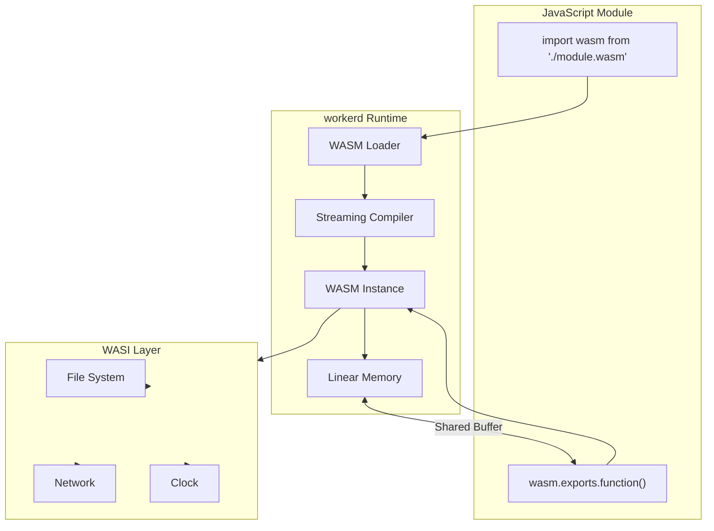
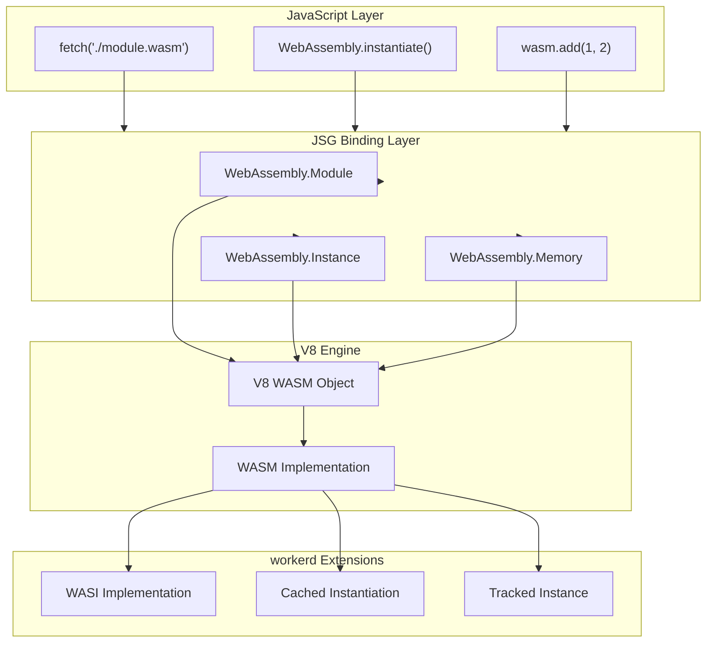
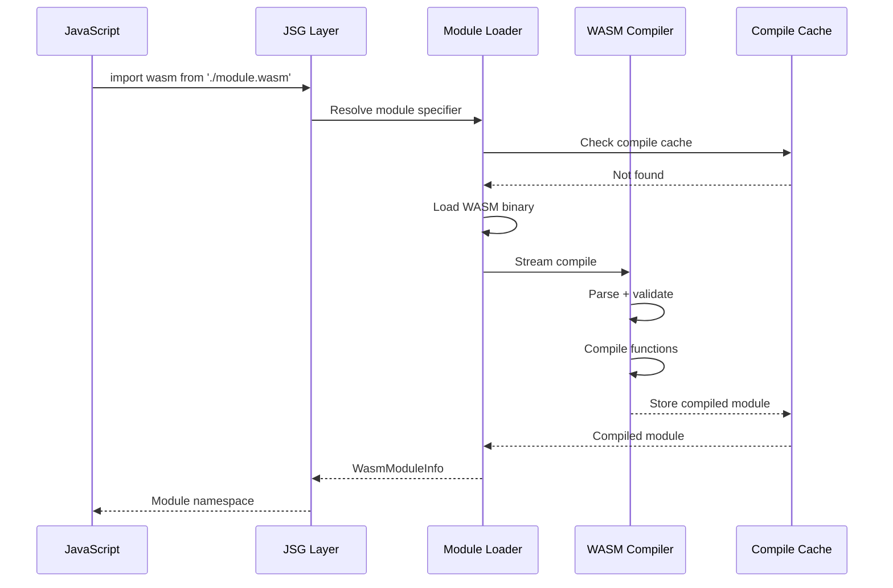
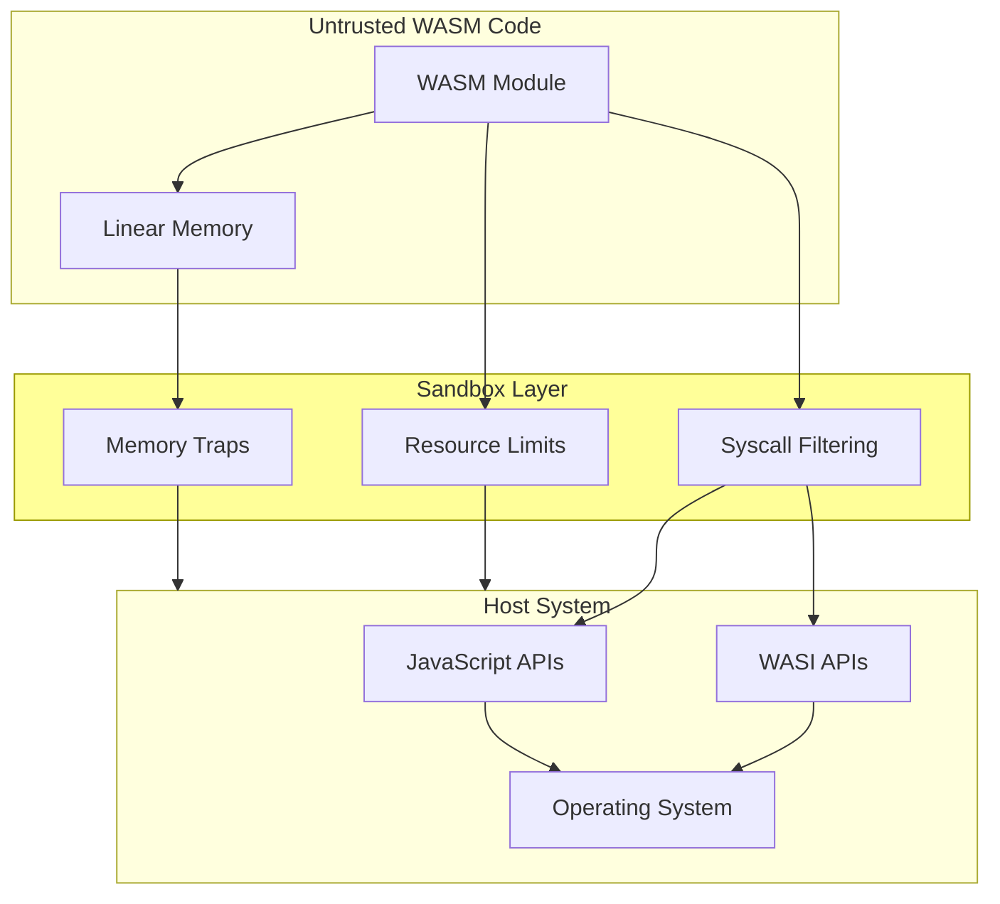

# WASM Runtime Deep Dive

**Created:** 2026-03-27

**Related:** [io/wasm/](../../src/workerd/io/wasm/), [api/basics.c++](../../src/workerd/api/basics.c++)

---

## Table of Contents

1. [Executive Summary](#executive-summary)
2. [WASM Fundamentals](#wasm-fundamentals)
3. [WASM in workerd Architecture](#wasm-in-workerd-architecture)
4. [Module Loading and Compilation](#module-loading-and-compilation)
5. [WASI Integration](#wasi-integration)
6. [JavaScript-WASM Interop](#javascript-wasm-interop)
7. [Memory Management](#memory-management)
8. [Instantiation and Caching](#instantiation-and-caching)
9. [Security and Sandboxing](#security-and-sandboxing)
10. [Rust Translation Guide](#rust-translation-guide)

---

## Executive Summary

**WebAssembly (WASM)** in workerd enables running compiled code (Rust, C++, Go, etc.) alongside JavaScript in the same isolate.

### Key Capabilities

| Capability | Description |
|------------|-------------|
| **Module Loading** | ESM imports of `.wasm` files |
| **Instantiation** | Fast module instantiation with caching |
| **Memory Sharing** | Shared linear memory with JavaScript |
| **WASI APIs** | System interface compatibility |
| **JS Interop** | Bidirectional function calls |
| **Streaming** | Streaming compilation and instantiation |

### WASM Integration Diagram



---

## WASM Fundamentals

### What is WebAssembly?

WebAssembly is a **binary instruction format** for a stack-based virtual machine:

- **Portable**: Runs on any platform with a WASM runtime
- **Fast**: Near-native performance with JIT/AOT compilation
- **Safe**: Sandboxed memory and execution
- **Language-agnostic**: Compile from Rust, C++, Go, etc.

### WASM Module Structure

```
┌─────────────────────────────────────────────────────┐
│              WASM Module (.wasm)                     │
├─────────────────────────────────────────────────────┤
│  Header                                              │
│  ┌──────────────────────────────────────────────┐  │
│  │ Magic: 0x00 0x61 0x73 0x6D ("\0asm")         │  │
│  │ Version: 0x01 0x00 0x00 0x00 (version 1)     │  │
│  └──────────────────────────────────────────────┘  │
├─────────────────────────────────────────────────────┤
│  Sections                                            │
│  ┌──────────────────────────────────────────────┐  │
│  │ Type Section     - Function signatures       │  │
│  │ Import Section   - Imported functions/mem    │  │
│  │ Function Section - Function indices          │  │
│  │ Memory Section   - Linear memory definition  │  │
│  │ Export Section   - Exported functions        │  │
│  │ Start Section    - Start function             │  │
│  │ Code Section     - Function bodies            │  │
│  │ Data Section     - Initial memory data        │  │
│  └──────────────────────────────────────────────┘  │
└─────────────────────────────────────────────────────┘
```

### Text Format (WAT)

```wat
(module
  ;; Import a function from JavaScript
  (import "env" "log" (func $log (param i32)))

  ;; Export a function
  (func (export "add") (param $a i32) (param $b i32) (result i32)
    local.get $a
    local.get $b
    i32.add
  )

  ;; Export memory
  (memory (export "memory") 1)

  ;; Data section (initial memory contents)
  (data (i32.const 0) "Hello, WASM!")
)
```

---

## WASM in workerd Architecture

### Integration Points



### V8 WASM Integration

workerd uses **V8's built-in WASM** implementation:

```cpp
// jsg/modules-new.c++ - WASM module handling
class WasmModuleInfo: public ModuleInfo {
 public:
  // Compile WASM module
  static kj::Own<WasmModuleInfo> compile(
      jsg::Lock& js,
      kj::Array<const kj::byte> wasmBytes
  );

  // Get compiled V8 module
  v8::WasmModuleObject* getV8Module();

  // Instantiate module
  kj::Promise<jsg::Ref<WasmInstance>> instantiate(
      jsg::Lock& js,
      kj::HashMap<kj::String, v8::Local<v8::Value>> imports
  );

 private:
  // Compiled V8 WASM module object
  v8::Global<v8::WasmModuleObject> module_;

  // WASM binary (for caching)
  kj::Array<const kj::byte> bytes_;
};
```

---

## Module Loading and Compilation

### Loading Flow



### Streaming Compilation

```cpp
// modules-new.c++ - WASM streaming compilation
kj::Promise<kj::Own<WasmModuleInfo>> WasmModuleInfo::compileStreaming(
    jsg::Lock& js,
    kj::AsyncInputStream& wasmStream
) {
  // 1. Read and validate WASM header
  auto header = co_await wasmStream.readExactSize(8);
  KJ_REQUIRE(header.size() == 8, "Invalid WASM header");

  // 2. Stream rest of module
  auto bytes = co_await wasmStream.readAll();

  // 3. Compile with V8
  v8::WasmModuleObject::CompiledWasmModule compiled;
  co_await js.runInAsyncScope([&]() {
    compiled = v8::WasmModuleObject::CompileStreaming(
        js.v8Isolate,
        v8::MemorySpan<const uint8_t>(bytes.begin(), bytes.size())
    );
  });

  // 4. Create module info
  co_return kj::Own<WasmModuleInfo>(new WasmModuleInfo(
      compiled.ToModuleObject(js.v8Isolate),
      kj::mv(bytes)
  ));
}
```

### Compile Cache

```cpp
// compile-cache.h - WASM compilation cache
class CompileCache {
 public:
  // Get cached compiled module
  kj::Maybe<kj::Own<WasmModuleInfo>> get(kj::StringPtr key);

  // Store compiled module
  void put(kj::String key, kj::Own<WasmModuleInfo> module);

 private:
  // In-memory cache
  kj::HashMap<kj::String, kj::Own<WasmModuleInfo>> cache_;

  // Cache size limit
  static constexpr size_t MAX_CACHE_BYTES = 64 * 1024 * 1024;
};
```

---

## WASI Integration

### WASI Overview

**WASI (WebAssembly System Interface)** provides system APIs:

| WASI Module | APIs |
|-------------|------|
| `wasi_snapshot_preview1` | File I/O, clock, random |
| `wasi:io` (preview2) | Streams, polling |
| `wasi:filesystem` | Directory operations |
| `wasi:sockets` | Network sockets |

### workerd WASI Implementation

```cpp
// wasm/tracked-wasm-instance.h - WASI integration
class TrackedWasmInstance: public jsg::Object {
 public:
  // Create WASI imports
  static kj::HashMap<kj::String, v8::Local<v8::Value>>
  createWasiImports(jsg::Lock& js, WASIOptions options);

  // WASI preview1 imports
  static void proc_exit(jsg::Lock& js, int32_t code);
  static int32_t fd_read(jsg::Lock& js, int32_t fd,
                         kj::Array<wasi::Ciovec> iovs);
  static int32_t fd_write(jsg::Lock& js, int32_t fd,
                          kj::Array<wasi::Ciovec> iovs);

  // WASI preview2 (component model)
  // ... future implementation

 private:
  // WASI context (file descriptors, etc.)
  WASIContext wasiContext_;
};
```

### File Descriptor Mapping

```cpp
// wasm/tracked-wasm-instance.c++
class WASIContext {
 public:
  // Standard file descriptors
  static constexpr int32_t STDIN_FD = 0;
  static constexpr int32_t STDOUT_FD = 1;
  static constexpr int32_t STDERR_FD = 2;

  // Map WASM FD to KJ streams
  kj::Maybe<kj::Own<kj::AsyncInputStream>> getInputStream(int32_t fd);
  kj::Maybe<kj::Own<kj::AsyncOutputStream>> getOutputStream(int32_t fd);

  // Preopen directories
  void addPreopen(kj::String guestPath,
                  kj::Own<kj::Directory> hostDir);

 private:
  // Open file descriptors
  kj::HashMap<int32_t, kj::Own<FileDescriptor>> fds_;

  // Preopened directories
  kj::HashMap<kj::String, kj::Own<kj::Directory>> preopens_;

  // Next FD
  int32_t nextFd_ = 3;
};
```

---

## JavaScript-WASM Interop

### Import/Export Binding

```cpp
// jsg/modules-new.c++ - WASM import/export binding
class WasmInstance: public jsg::Object {
 public:
  // Get exported functions/values
  jsg::Dict<jsg::Value> getExports(jsg::Lock& js);

  // Create import object from JS
  static v8::Local<v8::Object> createImportObject(
      jsg::Lock& js,
      kj::HashMap<kj::String, kj::HashMap<kj::String, jsg::Value>> imports
  );

 private:
  // V8 instance
  v8::Global<v8::WasmInstanceObject> instance_;

  // Exports cache
  kj::Maybe<jsg::Dict<jsg::Value>> exportsCache_;

  // Memory reference
  kj::Maybe<jsg::Ref<WasmMemory>> memory_;
};
```

### Type Conversion

| WASM Type | JavaScript Type | C++ Type |
|-----------|-----------------|----------|
| `i32` | `number` | `int32_t` |
| `i64` | `bigint` | `int64_t` |
| `f32` | `number` | `float` |
| `f64` | `number` | `double` |
| `externref` | `object` | `v8::Local<v8::Value>` |
| `funcref` | `Function` | `v8::Local<v8::Function>` |

### Memory Access

```javascript
// JavaScript side
const wasm = await WebAssembly.instantiate(bytes, imports);

// Access exported memory
const memory = wasm.exports.memory;
const view = new Uint8Array(memory.buffer);

// Read/write memory
view[0] = 65;  // 'A'
const char = view[0];  // 65

// Call function that uses memory
const result = wasm.exports.process(0, 10);  // Process bytes 0-9
```

```cpp
// C++ side - Memory access
class WasmMemory: public jsg::Object {
 public:
  // Get buffer
  jsg::Ref<js::ArrayBuffer> getBuffer(jsg::Lock& js);

  // Grow memory
  uint32_t grow(uint32_t pages);

  // Access raw bytes
  kj::ArrayPtr<kj::byte> getBytes();

 private:
  // V8 memory object
  v8::Global<v8::WasmMemoryObject> memory_;

  // Current size in pages
  uint32_t currentPageCount_;
};
```

---

## Memory Management

### Linear Memory Layout

```
┌─────────────────────────────────────────────────────────┐
│              WASM Linear Memory                          │
│  (Size: 64KB initial, grows in 64KB pages to 4GB)       │
├─────────────────────────────────────────────────────────┤
│  Fixed Locations                                         │
│  ┌─────────────────┐                                    │
│0 │  Global Pointer  │  ← __wasm_memory_base             │
│  ├─────────────────┤                                    │
│4 │  Stack Pointer   │  ← __stack_pointer                │
│  ├─────────────────┤                                    │
│8 │  Heap Base       │  ← __heap_base (start of malloc)  │
│  ├─────────────────┤                                    │
│12│  Heap End        │  ← __heap_end                     │
│  └─────────────────┘                                    │
├─────────────────────────────────────────────────────────┤
│  Dynamic Allocation                                      │
│  ┌─────────────────────────────────────────────────┐    │
│  │  Stack (grows down)                             │    │
│  │  ↓                                              │    │
│  │                                                 │    │
│  │  ↑                                              │    │
│  │  Heap (grows up)                                │    │
│  └─────────────────────────────────────────────────┘    │
└─────────────────────────────────────────────────────────┘
```

### Memory Tracking

```cpp
// wasm/tracked-wasm-instance.c++ - Memory limit enforcement
class TrackedWasmInstance {
 public:
  void trackMemoryUsage() {
    auto currentPages = memory_->get()->Size();
    auto currentBytes = currentPages * WASM_PAGE_SIZE;

    if (currentBytes > memoryLimit_) {
      // Throw memory limit exceeded
      throwJsException("WASM memory limit exceeded");
    }
  }

 private:
  // Memory limit for this instance
  size_t memoryLimit_ = 128 * 1024 * 1024;  // 128MB

  // Current memory usage
  size_t currentUsage_ = 0;

  static constexpr size_t WASM_PAGE_SIZE = 64 * 1024;
};
```

### Shared Memory (Threads)

```cpp
// jsg/buffersource.h - Shared array buffer for threads
class SharedArrayBuffer: public jsg::Object {
 public:
  // Create shared buffer
  static jsg::Ref<SharedArrayBuffer> allocate(
      jsg::Lock& js,
      size_t bytes
  );

  // Get backing store (thread-safe)
  v8::Local<v8::SharedArrayBuffer> getShared(jsg::Lock& js);

 private:
  // V8 shared array buffer
  v8::Global<v8::SharedArrayBuffer> buffer_;
};

// Note: workerd does not currently support WASM threads
// SharedArrayBuffer is available but not connected to WASM
```

---

## Instantiation and Caching

### Fast Instantiation

```cpp
// modules-new.c++ - Cached instantiation
kj::Promise<jsg::Ref<WasmInstance>> WasmModuleInfo::instantiate(
    jsg::Lock& js,
    kj::HashMap<kj::String, v8::Local<v8::Value>> imports
) {
  // 1. Check instantiation cache
  if (auto cached = instantiationCache_.get()) {
    co_return cached;
  }

  // 2. Create import object
  auto importObj = createImportObject(js, imports);

  // 3. Instantiate module
  v8::Local<v8::WasmInstanceObject> instance;
  co_await js.runInAsyncScope([&]() {
    instance = v8::WasmInstanceObject::New(
        js.v8Isolate,
        module_.Get(js.v8Isolate),
        importObj
    );
  });

  // 4. Wrap instance
  auto wrapped = jsg::alloc<WasmInstance>(kj::mv(instance));

  // 5. Cache for reuse
  instantiationCache_ = wrapped.addRef();

  co_return wrapped;
}
```

### Module Caching Strategy

```
┌─────────────────────────────────────────────────────────┐
│           WASM Caching Hierarchy                         │
├─────────────────────────────────────────────────────────┤
│  Process-Level Cache                                    │
│  ┌─────────────────────────────────────────────────┐    │
│  │  CompiledModule { bytes, v8Module }             │    │
│  └─────────────────────────────────────────────────┘    │
├─────────────────────────────────────────────────────────┤
│  Isolate-Level Cache                                    │
│  ┌─────────────────────────────────────────────────┐    │
│  │  InstantiatedInstance { module, imports }       │    │
│  └─────────────────────────────────────────────────┘    │
├─────────────────────────────────────────────────────────┤
│  Request-Level Cache                                    │
│  ┌─────────────────────────────────────────────────┐    │
│  │  ActiveInstances (current request only)         │    │
│  └─────────────────────────────────────────────────┘    │
└─────────────────────────────────────────────────────────┘
```

---

## Security and Sandboxing

### WASM Security Model



### Trap Handling

```cpp
// wasm/tracked-wasm-instance.c++ - WASM trap handling
void TrackedWasmInstance::handleTrap(
    jsg::Lock& js,
    v8::WasmTrapInfo trapInfo
) {
  switch (trapInfo.type) {
    case v8::WasmTrapInfo::kOutOfBounds:
      throwJsException("WASM: Out of bounds memory access");
    case v8::WasmTrapInfo::kUnreachable:
      throwJsException("WASM: Unreachable instruction executed");
    case v8::WasmTrapInfo::kDivisionByZero:
      throwJsException("WASM: Division by zero");
    case v8::WasmTrapInfo::kIntegerOverflow:
      throwJsException("WASM: Integer overflow");
    default:
      throwJsException("WASM: Unknown trap");
  }
}
```

### Resource Limits

```cpp
// limit-enforcer.h - WASM-specific limits
class WasmLimitEnforcer: public IsolateLimitEnforcer {
 public:
  // Maximum WASM memory per instance
  static constexpr size_t MAX_WASM_MEMORY = 128 * 1024 * 1024;

  // Maximum WASM table size
  static constexpr size_t MAX_WASM_TABLE = 10000;

  // Maximum stack depth
  static constexpr size_t MAX_WASM_STACK = 1000;

  // Check if instantiation is allowed
  bool checkModuleSize(size_t bytes) {
    return bytes <= MAX_MODULE_SIZE;
  }

  // Track memory growth
  void onMemoryGrow(size_t newPages) {
    currentMemoryPages_ += newPages;
    if (currentMemoryPages_ > MAX_WASM_MEMORY / WASM_PAGE_SIZE) {
      throwJsException("WASM memory limit exceeded");
    }
  }
};
```

---

## Rust Translation Guide

### WASM Runtime in Rust

```rust
// workerd-wasm/src/runtime.rs

use wasmtime::{
    Engine, Module, Store, Instance, Extern,
    Memory, Func, Config, Trap,
};
use std::sync::Arc;

pub struct WasmRuntime {
    engine: Engine,
    modules: ModuleCache,
}

pub struct WasmInstance {
    store: Store<InstanceState>,
    instance: Instance,
    memory: Option<Memory>,
}

struct InstanceState {
    // WASI context
    wasi: WASIContext,

    // Memory limit
    memory_limit: usize,

    // Current memory usage
    current_memory: usize,
}

impl WasmRuntime {
    pub fn new() -> Result<Self, Error> {
        let mut config = Config::new();
        config.wasm_reference_types(true);
        config.wasm_simd(true);
        config.consume_fuel(true);  // CPU limiting

        let engine = Engine::new(&config)?;

        Ok(Self {
            engine,
            modules: ModuleCache::new(),
        })
    }

    pub fn compile(&mut self, wasm_bytes: &[u8]) -> Result<Arc<Module>, Error> {
        // Check cache first
        if let Some(cached) = self.modules.get(wasm_bytes) {
            return Ok(cached);
        }

        // Compile module
        let module = Module::from_binary(&self.engine, wasm_bytes)?;
        let module = Arc::new(module);

        // Cache compiled module
        self.modules.insert(wasm_bytes, module.clone());

        Ok(module)
    }

    pub fn instantiate(
        &self,
        module: &Module,
        imports: &[(&str, &str, Extern)],
    ) -> Result<WasmInstance, Error> {
        let state = InstanceState {
            wasi: WASIContext::new(),
            memory_limit: 128 * 1024 * 1024,
            current_memory: 0,
        };

        let mut store = Store::new(&self.engine, state);

        // Set up memory growth limiter
        store.limiter(|state| {
            struct Limiter(usize);
            impl wasmtime::ResourceLimiter for Limiter {
                fn memory_growing(&mut self, current: usize, desired: usize, max: Option<usize>) -> bool {
                    desired <= self.0
                }
            }
            Limiter(state.memory_limit)
        });

        // Create imports
        let import_funcs: Vec<Extern> = imports.iter().map(|(_, _, e)| e.clone()).collect();

        let instance = Instance::new(&mut store, module, &import_funcs)?;

        // Get exported memory
        let memory = instance.get_memory(&store, "memory");

        Ok(WasmInstance {
            store,
            instance,
            memory,
        })
    }
}
```

### WASI in Rust

```rust
// workerd-wasm/src/wasi.rs

use wasi_common::{WasiCtx, WasiCtxBuilder, pipe::ReadPipe};
use std::sync::Arc;

pub struct WASIContext {
    ctx: WasiCtx,
}

impl WASIContext {
    pub fn new() -> Self {
        let ctx = WasiCtxBuilder::new()
            .stdin(Box::new(ReadPipe::new(vec![])))
            .stdout(Box::new(std::io::stdout()))
            .stderr(Box::new(std::io::stderr()))
            .build();

        Self { ctx }
    }

    pub fn add_preopen(&mut self, guest_path: &str, host_dir: &std::path::Path) {
        // Add preopened directory
        let dir = wasi_common::cap_std::fs::Dir::open_ambient_dir(
            host_dir,
            wasi_common::cap_std::ambient_authority()
        ).unwrap();

        self.ctx.push_preopened_dir(dir, guest_path);
    }
}

// Link WASI to Wasmtime
pub fn create_wasi_imports(
    engine: &wasmtime::Engine,
    ctx: WASIContext,
) -> wasmtime::Linker<wasmtime::Store<WASIContext>> {
    let mut linker = wasmtime::Linker::new(engine);
    wasi_common::sync::add_to_linker(&mut linker, |state| &mut state.ctx).unwrap();
    linker
}
```

### Key Differences: V8 vs Wasmtime

| Aspect | V8 WASM | Wasmtime |
|--------|---------|----------|
| **Integration** | Built into V8 | Separate crate |
| **JS Interop** | Native | Manual via wasm-bindgen |
| **Performance** | JIT compiled | Can use Cranelift/AOT |
| **WASI** | Custom impl | wasi-common crate |
| **Memory** | V8-managed | Rust-managed |

---

## References

- [WebAssembly Specification](https://webassembly.github.io/spec/)
- [WASI Documentation](https://github.com/WebAssembly/WASI)
- [V8 WASM](https://v8.dev/docs/webassembly)
- [Wasmtime Book](https://docs.wasmtime.dev/)
- [tracked-wasm-instance.h](../../src/workerd/io/wasm/tracked-wasm-instance.h)
