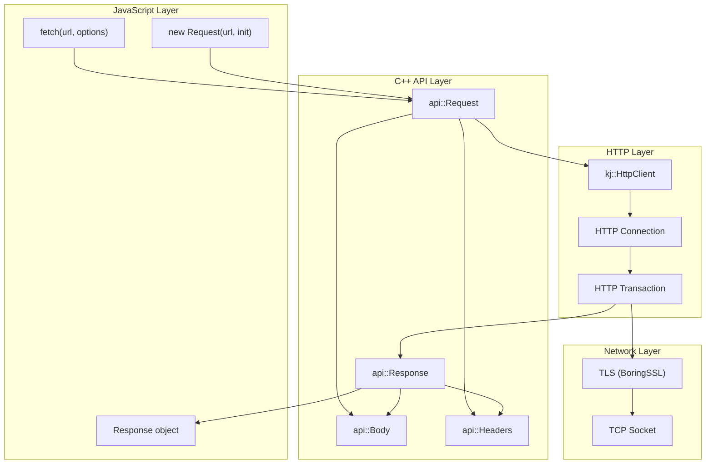

# Web API Compatibility Deep Dive: Fetch, Streams, Request/Response

**Created:** 2026-03-27

**Related:** [api/http.c++](../../src/workerd/api/http.c++), [api/basics.c++](../../src/workerd/api/basics.c++), [api/streams/](../../src/workerd/api/streams/)

---

## Table of Contents

1. [Executive Summary](#executive-summary)
2. [Web Standards in workerd](#web-standards-in-workerd)
3. [Fetch API Implementation](#fetch-api-implementation)
4. [Request/Response Objects](#requestresponse-objects)
5. [Headers Implementation](#headers-implementation)
6. [Body and Streams Integration](#body-and-streams-integration)
7. [HTTP Client Architecture](#http-client-architecture)
8. [Redirect and Authentication](#redirect-and-authentication)
9. [Rust Translation Guide](#rust-translation-guide)

---

## Executive Summary

workerd implements **Web Platform APIs** for HTTP operations instead of Node.js-style APIs. This provides portability across browsers, Cloudflare Workers, Deno, and Bun.

### Key APIs Implemented

| API | Specification | Status |
|-----|---------------|--------|
| `fetch()` | Fetch Living Standard | Full |
| `Request` | Fetch Living Standard | Full |
| `Response` | Fetch Living Standard | Full |
| `Headers` | Fetch Living Standard | Full |
| `ReadableStream` | Streams Living Standard | Full |
| `WritableStream` | Streams Living Standard | Full |
| `FormData` | Fetch Living Standard | Full |
| `URL` | URL Living Standard | Full |

### Fetch Architecture Diagram



---

## Web Standards in workerd

### Why Web APIs?

| Aspect | Node.js APIs | Web APIs |
|--------|--------------|----------|
| **Portability** | Node.js only | Browser, Deno, Bun, Workers |
| **Async Model** | Callbacks → Promises | Promise-first |
| **Streaming** | Stream classes | Streams standard |
| **Type Safety** | Dynamic | TypeScript definitions |
| **Standardization** | Implementation-specific | W3C/WHATWG standard |

### Compatibility Dates

workerd uses **compatibility dates** to manage API evolution:

```capnp
# compatibility-date.capnp
struct CompatibilityFlags {
  # Enable new behavior after date
  fetchResponseCloneBody: Bool @100;  # 2023-03-01
  headersHasGetter: Bool @101;        # 2023-04-01
}

# Usage in C++
if (flags.getHeadersHasGetter()) {
  JSG_METHOD(get);
}
```

---

## Fetch API Implementation

### JavaScript API

```javascript
// Basic fetch
const response = await fetch('https://api.example.com/users', {
  method: 'POST',
  headers: { 'Content-Type': 'application/json' },
  body: JSON.stringify({ name: 'John' }),
});

const data = await response.json();
```

### C++ Implementation

```cpp
// api/http.c++ - fetch() implementation
jsg::Promise<jsg::Ref<Response>> fetch(
    jsg::Lock& js,
    jsg::Variant<jsg::Ref<Request>, kj::String> requestOrUrl,
    kj::Maybe<RequestInitializerDict> init
) {
  // 1. Construct Request object
  auto request = co_await Request::create(
      js, kj::mv(requestOrUrl), kj::mv(init));

  // 2. Get HTTP client from context
  auto& ioContext = IoContext::current();
  auto& httpClient = ioContext.getHttpClient(request->getUrl());

  // 3. Send request
  auto responsePromise = httpClient->sendRequest(
      kj::mv(request->getInternalRequest()));

  // 4. Wrap in Response object
  co_return co_await Response::fromInternal(
      js, kj::mv(responsePromise));
}
```

### HTTP Client Selection

```cpp
// io/io-channels.h - Client selection
class IoChannelFactory {
 public:
  // Get HTTP client for URL
  kj::Own<kj::HttpClient> getHttpClient(kj::StringPtr url);

  // Get HTTP client for service binding
  kj::Own<kj::HttpClient> getHttpClient(
      kj::StringPtr serviceName,
      kj::Maybe<kj::HttpClient::ServiceSpec> spec
  );

 private:
  // Public internet client
  kj::Own<kj::HttpClient> publicClient_;

  // Service binding clients
  kj::HashMap<kj::String, kj::Own<kj::HttpClient>> serviceClients_;
};
```

---

## Request/Response Objects

### Request Class Structure

```cpp
// api/http.h - Request class
class Request: public jsg::Object {
 public:
  // Constructor
  static jsg::Ref<Request> constructor(
      jsg::Lock& js,
      jsg::Variant<jsg::Ref<Request>, kj::String> input,
      kj::Maybe<RequestInitializerDict> init
  );

  // Properties
  kj::StringPtr getMethod();
  kj::String getUrl();
  jsg::Ref<Headers> getHeaders();
  kj::Maybe<jsg::Ref<Body>> getBody();

  // Clone request
  jsg::Ref<Request> clone(jsg::Lock& js);

  // Internal KJ request
  kj::HttpClient::Request& getInternalRequest();

 private:
  // HTTP method
  kj::HttpMethod method_;

  // Request URL
  kj::String url_;

  // Headers
  jsg::Ref<Headers> headers_;

  // Body (optional)
  kj::Maybe<Body> body_;

  // Internal KJ request for HTTP client
  kj::Own<kj::HttpClient::Request> internalRequest_;
};
```

### Response Class Structure

```cpp
// api/http.h - Response class
class Response: public jsg::Object {
 public:
  // Constructor
  static jsg::Ref<Response> constructor(
      jsg::Lock& js,
      kj::Maybe<jsg::Ref<Body>> body,
      kj::Maybe<ResponseInitializerDict> init
  );

  // Static redirect responses
  static jsg::Ref<Response> redirect(jsg::Lock& js,
                                      kj::String url,
                                      kj::Maybe<uint16_t> statusCode);
  static jsg::Ref<Response> json_(jsg::Lock& js,
                                   jsg::Value data,
                                   kj::Maybe<ResponseInitializerDict> init);

  // Properties
  uint getStatus();
  kj::String getStatusText();
  jsg::Ref<Headers> getHeaders();
  kj::Maybe<jsg::Ref<Body>> getBody();
  bool getOk();
  bool getRedirected();
  kj::String getUrl();

  // Clone response
  jsg::Ref<Response> clone(jsg::Lock& js);

 private:
  // Status code
  uint statusCode_;

  // Status text
  kj::String statusText_;

  // Headers
  jsg::Ref<Headers> headers_;

  // Body
  kj::Maybe<Body> body_;

  // Redirect chain
  kj::Vector<kj::String> redirectChain_;
};
```

---

## Headers Implementation

### Header Storage

```cpp
// api/headers.h - Headers class
class Headers: public jsg::Object {
 public:
  // Get header value
  kj::Maybe<kj::StringPtr> get(kj::StringPtr name);

  // Set header
  void set(kj::StringPtr name, kj::StringPtr value);

  // Append header
  void append(kj::StringPtr name, kj::StringPtr value);

  // Delete header
  void delete_(kj::StringPtr name);

  // Check if header exists
  bool has(kj::StringPtr name);

  // Iterate
  void forEach(jsg::Lock& js,
               jsg::Function<void(kj::StringPtr, kj::StringPtr, jsg::Ref<Headers>)>,
               kj::Maybe<jsg::Value>);

 private:
  // Header storage - uses kj::Vector for iteration order
  kj::Vector<kj::Tuple<kj::String, kj::String>> headers_;

  // Guard for immutable headers
  Guard guard_ = Guard::NONE;

  enum class Guard {
    NONE,           // Mutable
    IMMUTABLE,      // Frozen
    REQUEST,        // Request guard
    RESPONSE,       // Response guard
    REQUEST_NO_CORS // CORS guard
  };
};
```

### Header Normalization

```cpp
// api/headers.c++ - Header name normalization
kj::String Headers::normalizeName(kj::StringPtr name) {
  // HTTP headers are case-insensitive
  // Normalize to lowercase for consistent lookup
  auto result = kj::str(name);
  for (auto& c : result) {
    c = kj::toLowerAscii(c);
  }
  return result;
}

// Forbidden header names (cannot be set by JavaScript)
static const kj::StringPtr FORBIDDEN_HEADERS[] = {
  "accept-charset"_kjp,
  "accept-encoding"_kjp,
  "access-control-request-headers"_kjp,
  "access-control-request-method"_kjp,
  "connection"_kjp,
  "content-length"_kjp,
  "cookie"_kjp,
  "cookie2"_kjp,
  "date"_kjp,
  "dnt"_kjp,
  "expect"_kjp,
  "host"_kjp,
  "keep-alive"_kjp,
  "origin"_kjp,
  "referer"_kjp,
  "te"_kjp,
  "trailer"_kjp,
  "transfer-encoding"_kjp,
  "upgrade"_kjp,
  "via"_kjp,
};
```

---

## Body and Streams Integration

### Body Class

```cpp
// api/http.h - Body mixin
class Body: public jsg::Object {
 public:
  // Body source types
  using Initializer = kj::OneOf<
      jsg::Ref<ReadableStream>,
      kj::String,
      kj::Array<byte>,
      jsg::Ref<Blob>,
      jsg::Ref<FormData>,
      jsg::Ref<URLSearchParams>
  >;

  // Read body as different types
  jsg::Promise<jsg::BufferSource> arrayBuffer(jsg::Lock& js);
  jsg::Promise<kj::String> text(jsg::Lock& js);
  jsg::Promise<jsg::Value> json(jsg::Lock& js);
  jsg::Promise<jsg::Ref<FormData>> formData(jsg::Lock& js);
  jsg::Promise<jsg::Ref<Blob>> blob(jsg::Lock& js);

  // Properties
  kj::Maybe<jsg::Ref<ReadableStream>> getBody();
  bool getBodyUsed();

  // Extract body from initializer
  static ExtractedBody extractBody(
      jsg::Lock& js,
      Initializer init
  );

 private:
  // Body implementation
  struct Impl {
    jsg::Ref<ReadableStream> stream;
    kj::Maybe<Buffer> buffer;  // For rewindable bodies
  };

  Impl impl_;
  kj::Maybe<kj::String> contentType_;
};
```

### Body Extraction

```cpp
// api/http.c++ - Body extraction algorithm
Body::ExtractedBody Body::extractBody(
    jsg::Lock& js,
    Initializer init
) {
  KJ_SWITCH_ONEOF(init) {
    KJ_CASE_ONEOF(stream, jsg::Ref<ReadableStream>) {
      // Stream: use directly
      co_return ExtractedBody(kj::mv(stream));
    }
    KJ_CASE_ONEOF(string, kj::String) {
      // String: convert to UTF-8 bytes
      auto bytes = string.asBytes();
      auto stream = createByteStream(kj::mv(bytes));
      co_return ExtractedBody(
          kj::mv(stream),
          Buffer(kj::mv(string)),
          "text/plain;charset=UTF-8"_kjc
      );
    }
    KJ_CASE_ONEOF(array, kj::Array<byte>) {
      // ArrayBuffer: use directly
      auto stream = createByteStream(kj::mv(array));
      co_return ExtractedBody(kj::mv(stream));
    }
    KJ_CASE_ONEOF(formData, jsg::Ref<FormData>) {
      // FormData: serialize to multipart/form-data
      auto [stream, boundary] = formData->serialize();
      auto contentType = kj::str(
          "multipart/form-data; boundary=", boundary
      );
      co_return ExtractedBody(
          kj::mv(stream),
          kj::none,
          kj::mv(contentType)
      );
    }
    // ... other cases
  }
}
```

---

## HTTP Client Architecture

### KJ HTTP Client

```cpp
// kj/compat/http.h - KJ HTTP client interface
class HttpClient {
 public:
  // HTTP methods
  enum class Method {
    GET, POST, PUT, DELETE, PATCH,
    HEAD, OPTIONS, CONNECT, TRACE
  };

  // Send HTTP request
  virtual kj::Promise<kj::Own<kj::HttpClient::Response>> sendRequest(
      kj::Own<kj::HttpClient::Request> request
  ) = 0;

  // Start HTTP connection
  virtual kj::Own<kj::HttpClient::Connection> startConnection(
      kj::StringPtr host,
      uint port,
      kj::Maybe<kj::TlsOptions> tlsOptions
  ) = 0;
};
```

### Connection Pooling

```cpp
// io/io-channels.c++ - HTTP connection pool
class HttpClientPool {
 public:
  // Get connection for host
  kj::Promise<kj::Own<kj::HttpClient::Connection>> getConnection(
      kj::StringPtr host,
      uint port,
      bool useTls
  );

  // Return connection to pool
  void returnConnection(
      kj::StringPtr host,
      kj::Own<kj::HttpClient::Connection> connection
  );

 private:
  // Pool per host
  kj::HashMap<kj::String, ConnectionPool> pools_;

  // Max connections per host
  static constexpr size_t MAX_CONNECTIONS_PER_HOST = 6;

  // Connection idle timeout
  static constexpr kj::Duration IDLE_TIMEOUT = 30 * kj::SECONDS;
};
```

### TLS Implementation

```cpp
// kj/compat/tls.c++ - TLS using BoringSSL
class TlsClient: public kj::HttpClient {
 public:
  static kj::Own<TlsClient> create(
      kj::Own<kj::NetworkWrapper> network,
      kj::StringPtr hostname,
      kj::Maybe<kj::Own<kj::TlsAuthentication>> auth
  );

  // Wrap network connection in TLS
  kj::Promise<kj::Own<kj::AsyncIoStream>> connect();

 private:
  // BoringSSL context
  kj::Own<SSL_CTX> sslContext_;

  // Hostname for SNI
  kj::String hostname_;

  // Certificate verification
  kj::Maybe<kj::Own<kj::TlsAuthentication>> auth_;
};
```

---

## Redirect and Authentication

### Redirect Handling

```cpp
// api/http.c++ - Redirect handling
kj::Promise<jsg::Ref<Response>> HttpClient::sendWithRedirects(
    jsg::Lock& js,
    jsg::Ref<Request> request,
    RedirectMode redirectMode,
    uint redirectCount
) {
  // Check redirect limit
  if (redirectCount > MAX_REDIRECTS) {
    throwJsException("Too many redirects");
  }

  // Send request
  auto response = co_await sendRequest(request);

  // Check if redirect
  if (isRedirectStatus(response->statusCode)) {
    KJ_SWITCH_ONEOF(redirectMode) {
      KJ_CASE_ONEOF(REDIRECT_MODE_ERROR) {
        throwJsException("Redirect not allowed");
      }
      KJ_CASE_ONEOF(REDIRECT_MODE_MANUAL) {
        // Return opaque redirect response
        co_return Response::opaqueRedirect(kj::mv(response));
      }
      KJ_CASE_ONEOF(REDIRECT_MODE_FOLLOW) {
        // Get redirect location
        auto location = response->headers->get("Location");
        KJ_REQUIRE(location != kj::none, "Redirect without Location");

        // Construct new request
        auto newUrl = resolveUrl(request->url, KJ_ASSERT_NONNULL(location));
        auto newRequest = co_await Request::constructor(
            js, newUrl, RequestInitializerDict {
              .method = getRedirectMethod(request->method, response->statusCode),
              .headers = getRedirectHeaders(request->headers),
              .body = getRedirectBody(request->body, response->statusCode),
            }
        );

        // Follow redirect
        co_await sendWithRedirects(js, newRequest, redirectMode, redirectCount + 1);
      }
    }
  }

  co_return response;
}
```

---

## Rust Translation Guide

### HTTP Types in Rust

```rust
// workerd-http/src/lib.rs

use bytes::Bytes;
use http::{Request, Response, HeaderMap, Method, StatusCode};
use hyper::{Client, Body};
use tokio::io::{AsyncRead, AsyncWrite};

pub struct FetchOptions {
    pub method: Method,
    pub headers: HeaderMap,
    pub body: Option<Bytes>,
    pub redirect: RedirectPolicy,
}

pub enum RedirectPolicy {
    Follow,
    Manual,
    Error,
}

pub async fn fetch(url: &str, options: FetchOptions) -> Result<Response<Bytes>, Error> {
    let client = Client::new();

    let mut req = Request::builder()
        .method(options.method)
        .uri(url);

    for (key, value) in options.headers {
        req = req.header(key, value);
    }

    let body = options.body.map(Body::from);
    let req = req.body(body.unwrap_or(Body::empty()))?;

    let response = client.request(req).await?;

    // Handle redirects
    match options.redirect {
        RedirectPolicy::Follow => follow_redirect(response).await,
        RedirectPolicy::Manual => Ok(to_manual_redirect(response)),
        RedirectPolicy::Error => {
            if response.status().is_redirection() {
                Err(Error::RedirectNotAllowed)
            } else {
                Ok(response)
            }
        }
    }
}
```

### Headers in Rust

```rust
// workerd-http/src/headers.rs

use std::collections::HashMap;

pub struct Headers {
    // Use Vec to preserve insertion order
    headers: Vec<(String, String)>,
    guard: HeaderGuard,
}

enum HeaderGuard {
    None,
    Immutable,
    Request,
    Response,
    RequestNoCors,
}

impl Headers {
    pub fn new() -> Self {
        Self {
            headers: Vec::new(),
            guard: HeaderGuard::None,
        }
    }

    pub fn get(&self, name: &str) -> Option<&str> {
        let name = name.to_lowercase();
        self.headers.iter()
            .find(|(k, _)| k.to_lowercase() == name)
            .map(|(_, v)| v.as_str())
    }

    pub fn set(&mut self, name: &str, value: &str) -> Result<(), Error> {
        self.check_guard()?;
        self.delete(name);
        self.headers.push((name.to_string(), value.to_string()));
        Ok(())
    }

    pub fn append(&mut self, name: &str, value: &str) -> Result<(), Error> {
        self.check_guard()?;
        self.headers.push((name.to_string(), value.to_string()));
        Ok(())
    }

    pub fn delete(&mut self, name: &str) {
        let name = name.to_lowercase();
        self.headers.retain(|(k, _)| k.to_lowercase() != name);
    }

    fn check_guard(&self) -> Result<(), Error> {
        match self.guard {
            HeaderGuard::Immutable => Err(Error::HeadersImmutable),
            _ => Ok(()),
        }
    }
}
```

### Key Rust Dependencies

| C++ Component | Rust Crate |
|---------------|------------|
| HTTP client | `hyper`, `reqwest` |
| TLS | `tokio-native-tls`, `rustls` |
| Headers | `http::HeaderMap` |
| Body/Streams | `tokio::io`, `bytes` |
| URL parsing | `url` crate |

---

## References

- [Fetch Standard](https://fetch.spec.whatwg.org/)
- [Streams Standard](https://streams.spec.whatwg.org/)
- [MDN Fetch API](https://developer.mozilla.org/en-US/docs/Web/API/Fetch_API)
- [http.c++](../../src/workerd/api/http.c++)
- [basics.c++](../../src/workerd/api/basics.c++)
