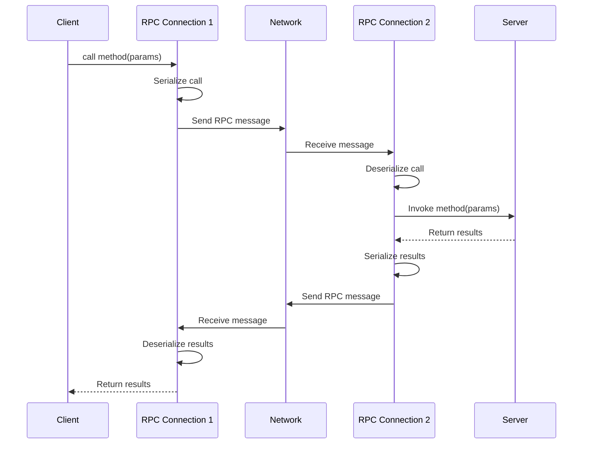
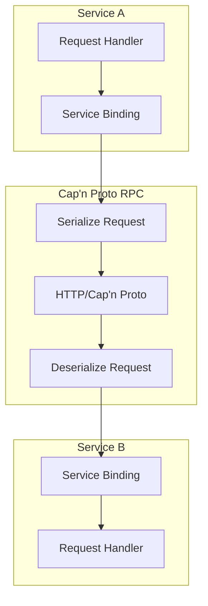

# Cap'n Proto RPC Deep Dive

**Created:** 2026-03-27

**Related:** [Cap'n Proto](https://capnproto.org/), [src/workerd/server/workerd.capnp](../../src/workerd/server/workerd.capnp)

---

## Table of Contents

1. [Executive Summary](#executive-summary)
2. [Cap'n Proto Fundamentals](#capnproto-fundamentals)
3. [Serialization Format](#serialization-format)
4. [RPC Protocol](#rpc-protocol)
5. [workerd Configuration Schema](#workerd-configuration-schema)
6. [Service Binding RPC](#service-binding-rpc)
7. [Actor Storage RPC](#actor-storage-rpc)
8. [Performance Characteristics](#performance-characteristics)
9. [Rust Translation Guide](#rust-translation-guide)

---

## Executive Summary

**Cap'n Proto** is a serialization format and RPC protocol that is **zero-copy** and **schema-evolution safe**. workerd uses it for:

1. **Configuration files** (.capnp schema)
2. **RPC between services** (service bindings)
3. **Actor storage protocol** (Durable Objects)
4. **HTTP over Cap'n Proto** (internal optimization)

### Cap'n Proto vs Alternatives

| Feature | Cap'n Proto | Protocol Buffers | JSON |
|---------|-------------|------------------|------|
| **Parsing** | Zero-copy | Copy required | Parse + allocate |
| **Speed** | ~100GB/s | ~1GB/s | ~0.1GB/s |
| **Schema evolution** | Full support | Full support | None |
| **RPC built-in** | Yes | No | No |
| **Binary size** | Compact | Compact | Verbose |

---

## Cap'n Proto Fundamentals

### Schema Definition

```capnp
# Example: worker service definition
@0xe6afd26682091c01;

interface Worker {
  # Handle HTTP request
  handleRequest @0 (request :Request) -> (response :Response);

  # Handle WebSocket connection
  handleWebSocket @1 (ws :WebSocket) -> stream (event :WebSocketEvent);
}

struct Request {
  method @0 :Text;
  url @1 :Text;
  headers @2 :List(Header);
  body @3 :Data;
}

struct Response {
  statusCode @0 :UInt16;
  headers @1 :List(Header);
  body @2 :Data;
}

struct Header {
  name @0 :Text;
  value @1 :Text;
}
```

### Generated Code

```cpp
// Generated by capnp compiler
// worker.capnp.h

namespace workerd {

class Request {
 public:
  // Accessors
  kj::StringPtr getMethod();
  kj::StringPtr getUrl();
  kj::Vector<Header> getHeaders();
  kj::ArrayPtr<const kj::byte> getBody();

  // Setters
  void setMethod(kj::StringPtr value);
  void setUrl(kj::StringPtr value);
  // ...

  // Builder/Reader pattern
  class Builder { /* ... */ };
  class Reader { /* ... */ };
};

}
```

---

## Serialization Format

### Message Layout

```
┌─────────────────────────────────────────────────────────┐
│            Cap'n Proto Message                           │
├─────────────────────────────────────────────────────────┤
│  Segment 0 (32 bytes)                                    │
│  ┌─────────────────────────────────────────────────┐    │
│  │  Struct Data (inline)                           │    │
│  │  [Pointer][Pointer][UInt64][Text Ptr]...        │    │
│  └─────────────────────────────────────────────────┘    │
├─────────────────────────────────────────────────────────┤
│  Segment 1 (variable)                                    │
│  ┌─────────────────────────────────────────────────┐    │
│  │  Variable-length data (Text, Data, List)        │    │
│  │  "POST\0\0\0\0"...                              │    │
│  └─────────────────────────────────────────────────┘    │
├─────────────────────────────────────────────────────────┤
│  Segment 2 (variable)                                    │
│  ┌─────────────────────────────────────────────────┐    │
│  │  More variable-length data                       │    │
│  │  "/api/users\0\0"...                            │    │
│  └─────────────────────────────────────────────────┘    │
└─────────────────────────────────────────────────────────┘
```

### Pointer Types

```
┌─────────────────────────────────────────┐
│         Cap'n Proto Pointer (64 bits)    │
├─────────────────────────────────────────┤
│  Type (2 bits) | Reserved (2) | Offset  │
│  00 = Struct   | 00           | 8 bytes │
│  01 = List     |              |         │
│  10 = Far      |              |         │
│  11 = Other    |              |         │
└─────────────────────────────────────────┘
```

---

## RPC Protocol

### RPC Message Types

```capnp
# rpc.capnp - RPC message schema
enum MessageType {
  undefined @0;
  call @1;         # Method call
  return_ @2;      # Method return
  finish @3;       # Call completed
  resolve @4;      # Promise resolved
  release @5;      # Release capability
  disembargo @6;   # Lift embargo
  # ... more types
}

struct RPCMessage {
  type @0 :MessageType;

  union {
    call :group {
      target @10 :Capability;
      methodId @11 :UInt32;
      params @12 :Capability;
    }

    return_ :group {
      results @20 :Capability;
      exception @21 :Text;
    }
  }
}
```

### RPC Call Flow



---

## workerd Configuration Schema

### Main Config Structure

```capnp
# workerd/server/workerd.capnp
@0xe6afd26682091c01;

struct Config {
  services @0 :List(Service);
  sockets @1 :List(Socket);
  v8Flags @2 :List(Text);
  extensions @3 :List(Extension);
  logging @6 :LoggingOptions;
}

struct Service {
  name @0 :Text;

  union {
    worker @2 :Worker;
    network @3 :Network;
    external @4 :ExternalServer;
    disk @5 :DiskDirectory;
  }
}

struct Worker {
  modules @0 :List(Module);
  compatibilityDate @1 :Text;
  compatibilityFlags @2 :List(Text);
  bindings @3 :List(Binding);
  durableObjectNamespaces @4 :List(DurableObjectNamespace);
}

struct Binding {
  name @0 :Text;

  union {
    service @1 :ServiceDesignator;
    kvNamespace @2 :KVNamespace;
    r2Bucket @3 :R2Bucket;
    d1Database @4 :D1Database;
    secret @5 :Text;
    json @6 :Dynamic;
  }
}
```

### Example Configuration

```capnp
using Workerd = import "/workerd/workerd.capnp";

const config :Workerd.Config = (
  services = [
    # Main application service
    (name = "main", worker = (
      modules = [(
        name = "index.js",
        esModule = embed "index.js"
      )],
      compatibilityDate = "2024-01-01",
      bindings = [
        (name = "API", service = "api"),
        (name = "KV", kvNamespace = "my-kv"),
        (name = "SECRET", secret = "my-secret-value"),
      ],
      durableObjectNamespaces = [
        (className = "MyActor", uniqueKey = "my-actor"),
      ],
    )),

    # Backend API service
    (name = "api", worker = (
      modules = [(
        name = "api.js",
        esModule = embed "api.js"
      )],
    )),
  ],

  sockets = [
    (name = "http", address = "*:8080", http = (), service = "main"),
  ],
);
```

---

## Service Binding RPC

### Service-to-Service Communication



### Fetcher Implementation

```cpp
// api/worker-rpc.c++ - Service binding RPC
class Fetcher: public jsg::Object {
 public:
  // fetch() via RPC
  jsg::Promise<jsg::Ref<Response>> fetch(
      jsg::Lock& js,
      kj::OneOf<kj::String, jsg::Ref<Request>> requestOrUrl,
      kj::Maybe<RequestInitializerDict> init
  ) {
    // 1. Create RPC request
    capnp::MallocMessageBuilder builder;
    auto rpcRequest = builder.initRoot<RpcRequest>();
    serializeRequest(rpcRequest, requestOrUrl, init);

    // 2. Send via Cap'n Proto RPC
    auto rpcResponse = co_await capability_->call(rpcRequest);

    // 3. Deserialize response
    co_return deserializeResponse(js, rpcResponse);
  }

 private:
  // RPC capability
  capnp::Capability::Client capability_;
};
```

### HTTP over Cap'n Proto

```cpp
// kj/compat/capnp-http.c++ - HTTP over Cap'n Proto
class HttpOverCapnpFactory {
 public:
  // Wrap RPC as HTTP client
  kj::Own<kj::HttpClient> wrapAsHttpClient(
      capnp::Capability::Client capability
  );

  // Wrap RPC as HTTP server
  kj::Own<kj::HttpServer> wrapAsHttpServer(
      capnp::Capability::Client capability
  );

 private:
  // Serialize HTTP request to Cap'n Proto
  void serializeHttpRequest(
      capnp::MallocMessageBuilder& builder,
      kj::HttpClient::Request& request
  );

  // Deserialize HTTP response from Cap'n Proto
  kj::Own<kj::HttpClient::Response> deserializeHttpResponse(
      capnp::FlatArrayMessageReader& reader
  );
};
```

---

## Actor Storage RPC

### Storage Interface

```capnp
# io/actor-storage.capnp
@0x9e1e4dbf2d29b5e3;

interface ActorStorage {
  # Get value by key
  get @0 (key :Text) -> (value :Data);

  # Put key-value pair
  put @1 (key :Text, value :Data) -> ();

  # Delete key
  delete @2 (key :Text) -> ();

  # List keys with prefix
  list @3 (prefix :Text, limit :UInt32) -> (keys :List(Text));

  # Get alarm time
  getAlarm @4 () -> (time :UInt64);

  # Set alarm
  setAlarm @5 (time :UInt64) -> ();
}
```

### RPC Storage Client

```cpp
// io/actor-cache.c++ - RPC storage client
class RemoteActorCache: public ActorCacheInterface {
 public:
  kj::Promise<kj::Maybe<Value>> get(Key key, ReadOptions options) override {
    // 1. Check local cache first
    if (auto cached = localCache_.get(key)) {
      co_return cached;
    }

    // 2. RPC call to storage
    auto response = co_await storage_->get(key);
    auto value = response.getValue();

    // 3. Update local cache
    localCache_.put(key, value);

    co_return value;
  }

  kj::Promise<void> put(Key key, Value value, WriteOptions options) override {
    // 1. Update local cache
    localCache_.put(key, value);

    // 2. RPC call to storage
    co_await storage_->put(key, value);

    // 3. Mark as dirty for flush
    dirtyKeys_.add(key);
  }

 private:
  // Local LRU cache
  ActorCache::SharedLru localCache_;

  // RPC storage client
  ActorStorage::Client storage_;

  // Keys pending flush
  kj::HashSet<Key> dirtyKeys_;
};
```

---

## Performance Characteristics

### Zero-Copy Advantage

```
Traditional serialization:
1. Copy to buffer
2. Serialize (parse)
3. Send over network
4. Receive
5. Deserialize (parse)
6. Copy from buffer

Cap'n Proto:
1. Cast pointer (no copy)
2. Send over network
3. Receive
4. Cast pointer (no copy)
```

### Benchmark Comparison

| Operation | Cap'n Proto | Protobuf | JSON |
|-----------|-------------|----------|------|
| Serialize 1KB | 0.5 µs | 5 µs | 50 µs |
| Deserialize 1KB | 0.5 µs | 5 µs | 50 µs |
| RPC roundtrip | 10 µs | 20 µs | 100 µs |

### Memory Efficiency

```
┌──────────────────────────────────────────────────────┐
│          Memory Usage Comparison (1MB message)        │
├──────────────────────────────────────────────────────┤
│  Cap'n Proto                                         │
│  ┌────────────────────────────────────────────────┐ │
│  │ 1MB (message) + 64 bytes (segment table)       │ │
│  └────────────────────────────────────────────────┘ │
│  Total: ~1MB                                        │
├──────────────────────────────────────────────────────┤
│  Protocol Buffers                                    │
│  ┌────────────────────────────────────────────────┐ │
│  │ 1MB (serialized) + 1MB (parsed objects)        │ │
│  └────────────────────────────────────────────────┘ │
│  Total: ~2MB                                        │
├──────────────────────────────────────────────────────┤
│  JSON                                                │
│  ┌────────────────────────────────────────────────┐ │
│  │ 1.5MB (JSON text) + 2MB (parsed objects)       │ │
│  └────────────────────────────────────────────────┘ │
│  Total: ~3.5MB                                      │
└──────────────────────────────────────────────────────┘
```

---

## Rust Translation Guide

### Cap'n Proto in Rust

```rust
// workerd-rpc/src/lib.rs

use capnp::message::{Builder, ReaderOptions, MessageBuilder};
use capnp::serialize::{read_message, write_message};
use std::io::{Read, Write};

// Generated by capnpc crate
pub mod worker_capnp {
    include!(concat!(env!("OUT_DIR"), "/worker_capnp.rs"));
}

use worker_capnp::{Request, Response, Header};

pub struct RpcClient {
    stream: tokio::net::TcpStream,
}

impl RpcClient {
    pub async fn call(&mut self, request: Request::Builder) -> Result<Response, Error> {
        // Build message
        let mut message = Builder::new_default();

        {
            let mut req = message.init_root::<Request::Builder>();
            req.set_method("POST");
            req.set_url("/api");
            // ...
        }

        // Send message
        write_message(&mut self.stream, &message)?;

        // Read response
        let response_msg = read_message(&mut self.stream, ReaderOptions::new())?;
        let response = response_msg.get_root::<Response::Reader>()?;

        Ok(Response::from_reader(response))
    }
}
```

### Schema Compilation

```rust
// build.rs - Compile Cap'n Proto schemas
fn main() {
    capnpc::CompilerCommand::new()
        .src_prefix("schema")
        .file("schema/worker.capnp")
        .file("schema/rpc.capnp")
        .run()
        .expect("capnp compiler");
}
```

### RPC Server in Rust

```rust
// workerd-rpc/src/server.rs

use capnp::capability::Capability;
use capnp_rpc::{rpc_twoparty_capnp, twoparty, RpcSystem};
use futures::FutureExt;

pub struct WorkerImpl {
    // Handler implementation
}

impl worker_capnp::Worker for WorkerImpl {
    fn handle_request(
        &mut self,
        request: worker_capnp::Request,
        _params: ::capnp::private::capability::Params,
    ) -> ::capnp::capability::Promise<worker_capnp::response::Results> {
        // Handle request
        let method = request.get_method()?;
        let url = request.get_url()?;

        // Process...

        // Return response
        Ok(response)
    }
}

pub fn start_rpc_server(
    stream: tokio::net::TcpStream,
) -> RpcSystem<twoparty::VatNetwork<rpc_twoparty_capnp::Side>> {
    let worker = capnp_rpc::new_capability(WorkerImpl::new());

    let network = twoparty::VatNetwork::new(
        stream,
        rpc_twoparty_capnp::Side::Server,
        Default::default(),
    );

    RpcSystem::new(network, Some(worker.client))
}
```

### Key Rust Dependencies

| C++ Component | Rust Crate |
|---------------|------------|
| Cap'n Proto | `capnp`, `capnpc` |
| RPC | `capnp-rpc` |
| Async I/O | `tokio`, `futures` |
| Schema gen | `capnpc` (build.rs) |

---

## References

- [Cap'n Proto Documentation](https://capnproto.org/)
- [Cap'n Proto Rust](https://github.com/capnproto/capnproto-rust)
- [workerd.capnp](../../src/workerd/server/workerd.capnp)
- [Cap'n Proto Encoding Specification](https://capnproto.org/encoding.html)
