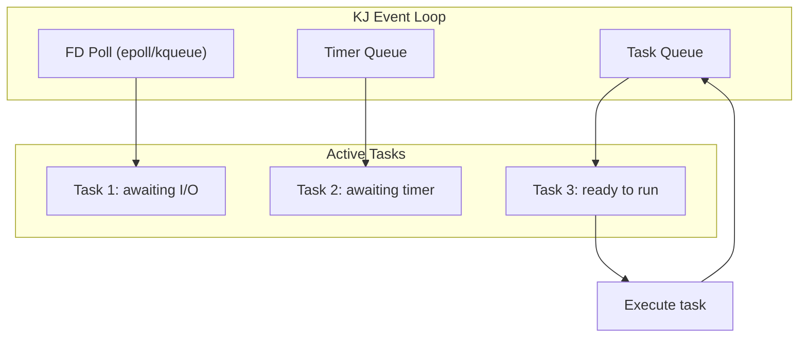

# Event Loop and Async Deep Dive: KJ Promise Model

**Created:** 2026-03-27

**Related:** [KJ Framework](https://github.com/capnproto/capnproto/tree/master/kj), [kj/async.h](../../external/capnp-cpp/kj/async.h)

---

## Table of Contents

1. [Executive Summary](#executive-summary)
2. [KJ Async Fundamentals](#kj-async-fundamentals)
3. [Promise Model](#promise-model)
4. [Event Loop Architecture](#event-loop-architecture)
5. [Coroutines and co_await](#coroutines-and-co-await)
6. [Bridging to JavaScript Promises](#bridging-to-javascript-promises)
7. [Task Management](#task-management)
8. [I/O Abstractions](#io-abstractions)
9. [Error Handling](#error-handling)
10. [Rust Translation Guide](#rust-translation-guide)

---

## Executive Summary

workerd uses the **KJ async model** from the Cap'n Proto project - a coroutine-based async model similar to C++20 coroutines but designed before the standard.

### KJ Async vs Alternatives

| Feature | KJ Promises | C++20 Coroutines | Rust async/await | JavaScript async |
|---------|-------------|------------------|------------------|------------------|
| **Syntax** | `co_await` | `co_await` | `.await` | `await` |
| **Runtime** | kj::EventLoop | Custom | Tokio/async-std | Event loop |
| **Cancellation** | Built-in | Manual | Drop-based | AbortController |
| **Exception safety** | Yes | Yes | Panic/Result | try/catch |

### Event Loop Flow



---

## KJ Async Fundamentals

### Core Types

```cpp
// kj/async.h - Core async types

// Promise<T> - asynchronous result
template <typename T>
class Promise {
 public:
  // Chain promises
  template <typename Func>
  auto then(Func&& func);

  // Wait for result (blocking)
  T wait(WaitScope& waitScope);

  // Split promise for multiple consumers
  ForkedPromise<T> fork();
};

// Task - fire-and-forget async operation
class Task {
 public:
  // Check if complete
  bool isFinished();

  // Wait for completion
  void wait(WaitScope& waitScope);
};

// WaitScope - context for waiting
class WaitScope {
  // Used to poll promises
};
```

### Basic Usage

```cpp
// Example: Async HTTP request
kj::Promise<kj::String> fetchData(kj::HttpClient& client) {
  // 1. Send request
  auto response = co_await client.sendRequest("GET", "/api/data");

  // 2. Read body
  auto body = co_await response->readAllText();

  // 3. Return result
  co_return body;
}

// Example: Parallel requests
kj::Promise<std::tuple<kj::String, kj::String>> fetchParallel(
    kj::HttpClient& client
) {
  // Join two promises
  auto [data1, data2] = co_await kj::joinPromises(
    fetchData(client),
    fetchData(client)
  );

  co_return std::make_tuple(data1, data2);
}
```

---

## Promise Model

### Promise States

```
┌─────────────────────────────────────────────────────┐
│            KJ Promise State Machine                  │
├─────────────────────────────────────────────────────┤
│  Pending                                             │
│  ┌─────────────────────────────────────────────┐    │
│  │ Waiting for async operation to complete     │    │
│  └─────────────────────────────────────────────┘    │
│       |                                               │
│       | Operation completes                          │
│       v                                               │
│  Fulfilled                                             │
│  ┌─────────────────────────────────────────────┐    │
│  │ Contains result value T                     │    │
│  └─────────────────────────────────────────────┘    │
│       |                                               │
│       | Operation failed                             │
│       v                                               │
│  Rejected                                              │
│  ┌─────────────────────────────────────────────┐    │
│  │ Contains exception                          │    │
│  └─────────────────────────────────────────────┘    │
└─────────────────────────────────────────────────────┘
```

### Promise Transformations

```cpp
// then() - transform result
template <typename T, typename Func>
auto Promise<T>::then(Func&& func) {
  return Promise<decltype(func(T()))>(
      [this, func = kj::mv(func)]() mutable {
        return func(co_await this->promise);
      }
  );
}

// attach() - run cleanup after promise
template <typename T, typename CleanupFunc>
Promise<T> Promise<T>::attach(CleanupFunc&& cleanup) {
  return kj::defer(kj::mv(cleanup))
      .then([this]() mutable {
        return co_await *this;
      });
}

// exclusiveJoin() - race two promises
template <typename T>
Promise<T> exclusiveJoin(Promise<T> left, Promise<T> right) {
  return Promise<T>([left = kj::mv(left), right = kj::mv(right)]() mutable {
    KJ_IF_MAYBE(result, left.poll()) {
      co_return kj::mv(*result);
    }
    KJ_IF_MAYBE(result, right.poll()) {
      co_return kj::mv(*result);
    }
    // Neither ready, wait for either
    co_return co_await kj::joinPromisesFailFast(left, right);
  });
}
```

---

## Event Loop Architecture

### Event Loop Implementation

```cpp
// kj/async-inl.h - Event loop internals

class EventLoop {
 public:
  // Run until all tasks complete
  void run();

  // Poll for I/O
  bool poll();

  // Schedule timer
  Timer Promise<void> atTime(kj::Date time);

  // Get current time
  Date now();

 private:
  // Ready queue (tasks ready to run)
  kj::Vector<Task*> readyQueue_;

  // Timer queue (sorted by time)
  kj::Tree<kj::TimerNode> timerQueue_;

  // I/O wait list
  kj::HashMap<int, kj::WaitFdState> fdWaiters_;

  // Platform-specific poller
  kj::Own<Poller> poller_;  // epoll/kqueue/IOCP
};
```

### I/O Polling

```cpp
// kj/async-io.c++ - I/O polling

#if __linux__
// Linux: epoll
class EpollPoller: public Poller {
  int epollFd_;

  bool poll() override {
    struct epoll_event events[MAX_EVENTS];
    int count = epoll_wait(epollFd_, events, MAX_EVENTS, timeout);

    for (int i = 0; i < count; i++) {
      int fd = events[i].data.fd;
      auto& waiter = fdWaiters_[fd];

      if (events[i].events & EPOLLIN) {
        waiter.readReady = true;
      }
      if (events[i].events & EPOLLOUT) {
        waiter.writeReady = true;
      }

      // Wake waiting tasks
      waiter.fulfiller->fulfill();
    }

    return count > 0;
  }
};

#elif __APPLE__
// macOS: kqueue
class KqueuePoller: public Poller {
  int kq_;
  // ... kqueue implementation
};
#endif
```

---

## Coroutines and co_await

### Coroutine Implementation

```cpp
// kj/async-inl.h - Coroutine support

// Promise<T> is awaitable
template <typename T>
class Promise<T>: public kj::Awaitable<Promise<T>> {
 public:
  // Called by co_await
  auto operator co_await() {
    return Awaiter{this};
  }

  class Awaiter {
   public:
    bool await_ready() {
      return promise_->isReady();
    }

    void await_suspend(std::coroutine_handle<> handle) {
      // Register callback when promise resolves
      promise_->onReady([handle]() {
        handle.resume();
      });
    }

    T await_resume() {
      return promise_->get();
    }
  };
};
```

### Async Lambda Pattern

```cpp
// Common pattern in workerd
kj::Promise<void> handleRequest() {
  // Capture context, return promise
  return KJ_COROUTINE([&]() -> kj::Promise<void> {
    // Async code here
    auto data = co_await fetchData();
    co_await processData(data);
  }());
}

// Using kj::defer for cleanup
kj::Promise<void> withCleanup() {
  auto resource = co_await acquireResource();

  return kj::defer([resource = kj::mv(resource)]() {
    // Cleanup runs when promise is destroyed
    resource->release();
  }).then([]() {
    co_return;
  });
}
```

---

## Bridging to JavaScript Promises

### KJ ↔ JS Promise Bridge

```cpp
// jsg/promise.c++ - Promise bridging

class jsg::Promise<T> {
 public:
  // Convert KJ promise to JS promise
  static jsg::Promise<T> fromKj(
      Lock& js,
      kj::Promise<T> kjPromise
  ) {
    auto [resolver, promise] = PromiseResolver<T>::create(js);

    // When KJ promise resolves, resolve JS promise
    kjPromise.then(
        [resolver = resolver.addRef()](T&& value) mutable {
          resolver->resolve(js, kj::mv(value));
        },
        [resolver = resolver.addRef()](kj::Exception&& err) mutable {
          resolver->reject(js, kj::mv(err));
        }
    );

    return promise;
  }

  // Convert JS promise to KJ promise
  static kj::Promise<T> toKj(
      Lock& js,
      jsg::Promise<T> jsPromise
  ) {
    // Similar reverse conversion
  }
};
```

### IoContext Integration

```cpp
// io/io-context.c++ - Running KJ code in JS context

class IoContext {
 public:
  // Run KJ async code in IoContext
  template <typename Func>
  auto runInCtx(Func&& func) {
    // Enter isolate lock
    auto lock = worker_->getLock();

    // Run function, return promise
    return func();
  }

  // Wait for JS promise from KJ code
  template <typename T>
  T wait(jsg::Promise<T> jsPromise) {
    // Convert to KJ promise
    auto kjPromise = jsg::Promise<T>::toKj(jsPromise);

    // Wait on event loop
    return kjPromise.wait(waitScope_);
  }
};
```

---

## Task Management

### TaskSet - Collection of Tasks

```cpp
// kj/async.h - TaskSet

class TaskSet: public kj::Task {
 public:
  // ErrorHandler for task failures
  class ErrorHandler {
   public:
    virtual void taskFailed(kj::Exception&& exception) = 0;
  };

  // Create task set
  TaskSet(ErrorHandler& errorHandler);

  // Add task
  void add(kj::Promise<void>&& promise);

  // Check if empty
  bool isEmpty();

  // Poll for completion
  kj::Maybe<kj::Exception> pollFinished();

 private:
  // Active tasks
  kj::List<Task, &Task::link> tasks_;

  // Error handler
  ErrorHandler& errorHandler_;
};

// Usage in workerd
class RequestTracker: public TaskSet::ErrorHandler {
  TaskSet tasks_;

  void trackTask(kj::Promise<void> task) {
    tasks_.add(kj::mv(task));
  }

  void taskFailed(kj::Exception&& exception) override {
    // Log failed task
    KJ_LOG(ERROR, "Task failed", exception);
  }
};
```

### Cancellation

```cpp
// kj/async.h - Cancellation

class CancellationScope {
 public:
  // Cancel all operations in scope
  ~CancellationScope();

  // Detach from scope (won't be cancelled)
  void detach();
};

// Usage
kj::Promise<void> withTimeout(
    kj::Promise<void> operation,
    kj::Duration timeout
) {
  return kj::exclusiveJoin(
    operation,
    timer.afterDelay(timeout).then([]() {
      throw KJ_EXCEPTION(FAILED, "Operation timed out");
    })
  );
}
```

---

## I/O Abstractions

### AsyncInputStream

```cpp
// kj/async-io.h - Async stream interface

class AsyncInputStream {
 public:
  // Read up to buffer size bytes
  virtual Promise<size_t> tryRead(void* buffer, size_t minBytes, size_t maxBytes) = 0;

  // Read exactly expected bytes
  Promise<void> read(void* buffer, size_t bytes);

  // Read all remaining data
  Promise<kj::Array<byte>> readAllBytes();
  Promise<kj::String> readAllText();

  // Pump to output stream
  Promise<void> pumpTo(AsyncOutputStream& output);
};

class AsyncOutputStream {
 public:
  // Write data
  virtual Promise<void> write(const void* buffer, size_t size) = 0;

  // Write multiple buffers (gather write)
  virtual Promise<void> write(ArrayPtr<const ArrayPtr<const byte>> pieces) = 0;
};
```

### Network I/O

```cpp
// kj/async-io.c++ - Network abstraction

class NetworkAddress {
 public:
  // Connect to address
  virtual Promise<kj::Own<kj::AsyncIoStream>> connect() = 0;

  // Listen for connections
  virtual kj::Own<kj::ConnectionReceiver> listen() = 0;
};

class ConnectionReceiver {
 public:
  // Accept next connection
  virtual Promise<kj::Own<kj::AsyncIoStream>> accept() = 0;
};

// HTTP client using network
class HttpClientImpl: public HttpClient {
  kj::Own<NetworkAddress> address_;

  Promise<kj::Own<Response>> sendRequest(Method method, kj::StringPtr url) override {
    // 1. Connect
    auto connection = co_await address_->connect();

    // 2. Send HTTP request
    co_await connection->write(formatRequest(method, url));

    // 3. Read response
    auto response = co_await parseResponse(*connection);

    co_return kj::mv(response);
  }
};
```

---

## Error Handling

### Exception Handling

```cpp
// kj/exception.h - Exception model

class Exception {
 public:
  // Exception type
  enum class Type {
    FAILED,          // Generic failure
    OVERLOADED,      // Resource exhausted
    UNIMPLEMENTED,   // Not implemented
    DISCONNECTED,    // Connection lost
    FAILED precondition,  // Precondition failed
  };

  // Create exception
  static Exception failed(
      Type type,
      const char* file,
      int line,
      kj::StringPtr description
  );

  // Get stack trace
  kj::StringPtr getStackTrace() const;

 private:
  Type type_;
  kj::String description_;
  kj::Vector<void*> stackTrace_;
};

// Throwing and catching
#define KJ_FAIL_ASSERT(...) \
  throw KJ_EXCEPTION(FAILED, __VA_ARGS__)

#define KJ_IF_MAYBE(var, maybeExpr) \
  if (auto var = maybeExpr)  // Similar to if-let
```

### Try-catch in coroutines

```cpp
// Exception handling in coroutines
kj::Promise<void> safeOperation() {
  try {
    auto result = co_await riskyOperation();
    co_return result;
  } catch (kj::Exception& e) {
    KJ_LOG(ERROR, "Operation failed", e);
    throw;  // Re-throw
  }
}

// Try-catch helper
template <typename T>
kj::Promise<kj::Maybe<T>> tryCatch(kj::Promise<T> promise) {
  try {
    co_return co_await promise;
  } catch (kj::Exception&) {
    co_return kj::none;
  }
}
```

---

## Rust Translation Guide

### Tokio as KJ Replacement

```rust
// workerd-core/src/async.rs

use tokio::sync::{oneshot, Mutex};
use std::future::Future;
use std::pin::Pin;
use std::task::{Context, Poll};

// KJ Promise<T> equivalent
pub struct Promise<T> {
    inner: Pin<Box<dyn Future<Output = Result<T, Error>> + Send>>,
}

impl<T> Promise<T> {
    // then() - chain promise
    pub fn then<U, F>(self, f: F) -> Promise<U>
    where
        F: FnOnce(T) -> Promise<U> + Send + 'static,
        U: Send + 'static,
    {
        Promise {
            inner: Box::pin(async move {
                let value = self.inner.await?;
                f(value).inner.await
            }),
        }
    }

    // join_promises - parallel execution
    pub async fn join_all<I>(promises: I) -> Vec<Result<T, Error>>
    where
        I: IntoIterator<Item = Promise<T>>,
    {
        futures::future::join_all(
            promises.into_iter().map(|p| p.inner)
        ).await
    }
}

// TaskSet equivalent
pub struct TaskSet {
    handles: Mutex<Vec<tokio::task::JoinHandle<()>>>,
}

impl TaskSet {
    pub fn new() -> Self {
        Self {
            handles: Mutex::new(Vec::new()),
        }
    }

    pub async fn add<F>(&self, future: F)
    where
        F: Future<Output = ()> + Send + 'static,
    {
        let handle = tokio::spawn(future);
        self.handles.lock().await.push(handle);
    }
}
```

### Async I/O in Rust

```rust
// workerd-core/src/io.rs

use tokio::io::{AsyncRead, AsyncWrite, AsyncReadExt, AsyncWriteExt};
use tokio::net::{TcpStream, TcpListener};

// AsyncInputStream equivalent
pub trait AsyncInputStream: AsyncRead + Unpin + Send {
    async fn read_exact_or_eof(&mut self, buf: &mut [u8]) -> Result<usize, Error>;

    async fn read_to_end(&mut self) -> Result<Vec<u8>, Error> {
        let mut buf = Vec::new();
        self.read_to_end(&mut buf).await?;
        Ok(buf)
    }
}

// AsyncOutputStream equivalent
pub trait AsyncOutputStream: AsyncWrite + Unpin + Send {
    async fn write_all_buf(&mut self, buf: &[u8]) -> Result<(), Error>;
}

impl AsyncInputStream for tokio::net::TcpStream {}
impl AsyncOutputStream for tokio::net::TcpStream {}

// Network abstraction
pub trait NetworkAddress: Send + Sync {
    fn connect(&self) -> Pin<Box<dyn Future<Output = Result<Box<dyn AsyncInputStream + AsyncOutputStream>, Error>> + Send>>;
    fn listen(&self) -> Result<Box<dyn ConnectionReceiver>, Error>;
}
```

### Key Differences: KJ vs Tokio

| Aspect | KJ | Tokio |
|--------|-----|-------|
| **Runtime** | Single-threaded event loop | Multi-threaded runtime |
| **Cancellation** | CancellationScope | Drop + AbortHandle |
| **Error handling** | Exceptions | Result<T, E> |
| **I/O** | kj::AsyncInputStream | tokio::io traits |
| **Timers** | kj::Timer | tokio::time |

---

## References

- [KJ Async Tour](https://github.com/capnproto/capnproto/blob/master/kjdoc/async-tour.md)
- [C++ Coroutines](https://en.cppreference.com/w/cpp/language/coroutines)
- [Tokio Documentation](https://tokio.rs/)
- [kj/async.h](../../external/capnp-cpp/kj/async.h)
