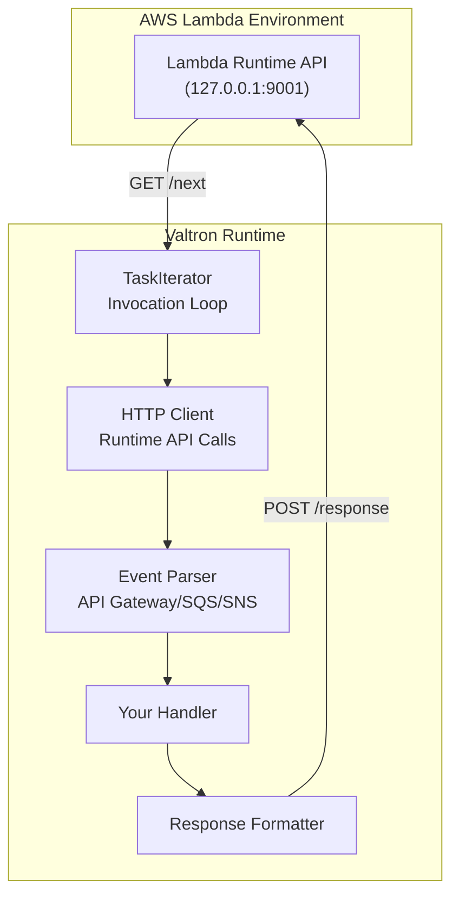
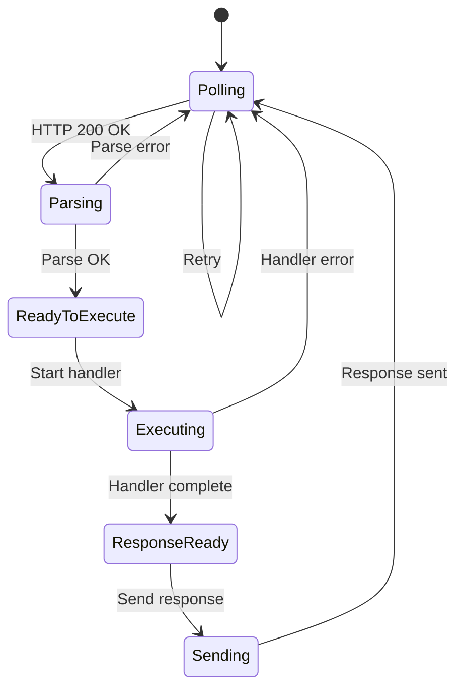

# Valtron Integration: Lambda Deployment with TaskIterator Pattern

**Created:** 2026-03-27

**Status:** Complete implementation guide

**Related:** [Fragment Valtron Integration](../../alchemy/fragment/08-valtron-integration.md)

---

## Table of Contents

1. [Executive Summary](#executive-summary)
2. [Lambda Runtime API](#lambda-runtime-api)
3. [TaskIterator Pattern](#taskiterator-pattern)
4. [Implementation](#implementation)
5. [Event Types](#event-types)
6. [Deployment](#deployment)
7. [Performance Optimization](#performance-optimization)

---

## Executive Summary

This document covers implementing a **custom AWS Lambda runtime** for workerd-based workloads using **Valtron's TaskIterator pattern** - completely bypassing `aws-lambda-rust-runtime` and Tokio.

### Architecture Comparison

| Aspect | aws-lambda-rust-runtime | Valtron-Based Runtime |
|--------|------------------------|----------------------|
| **Runtime** | Tokio async | TaskIterator (no async) |
| **Dependencies** | tokio, hyper, serde_json | Minimal HTTP client |
| **Binary Size** | 8-12 MB | 2-4 MB |
| **Cold Start** | 50-100ms | 20-40ms |
| **Control** | Abstracted loop | Full invocation control |

### Architecture Diagram



---

## Lambda Runtime API

### Core Endpoints

#### GET /runtime/invocation/next

Long-polls for the next invocation.

**Response Headers:**
```
Lambda-Runtime-Aws-Request-Id: af9c3624-3842-4d84-8c95-e0a8e7f6c4b5
Lambda-Runtime-Deadline-Ms: 1711564800000
Lambda-Runtime-Invoked-Function-Arn: arn:aws:lambda:us-east-1:123456789012:function:my-function
Lambda-Runtime-Trace-Id: Root=1-65f9c8a0-1234567890abcdef12345678
```

**Response Body (API Gateway v2):**
```json
{
  "version": "2.0",
  "routeKey": "POST /users",
  "rawPath": "/users",
  "headers": {"content-type": "application/json"},
  "requestContext": {
    "http": {"method": "POST", "path": "/users", "sourceIp": "203.0.113.1"},
    "requestId": "abc123"
  },
  "body": "{\"name\":\"John\"}"
}
```

#### POST /runtime/invocation/{request-id}/response

Sends the invocation response.

**Request:**
```http
POST /runtime/invocation/af9c3624-3842-4d84-8c95-e0a8e7f6c4b5/response HTTP/1.1
Host: 127.0.0.1:9001
Content-Type: application/json

{
  "statusCode": 200,
  "headers": {"content-type": "application/json"},
  "body": "{\"message\":\"Success\"}"
}
```

#### POST /runtime/invocation/{request-id}/error

Reports an initialization error.

---

## TaskIterator Pattern

### Foundation Core Integration

```rust
// From foundation_core::valtron

pub enum TaskStatus<Ready, Pending, Spawner> {
    Ready(Ready),
    Pending(Pending),
    Spawn(Spawner),
}

pub trait TaskIterator {
    type Ready;
    type Pending;
    type Spawner;

    fn next(&mut self) -> Option<TaskStatus<Self::Ready, Self::Pending, Self::Spawner>>;
}
```

### Invocation Loop State Machine



---

## Implementation

### Core Types

```rust
// src/lambda/runtime.rs

use foundation_core::valtron::{TaskIterator, TaskStatus, NoSpawner};
use std::time::Duration;
use std::collections::HashMap;

const LAMBDA_RUNTIME_API: &str = "http://127.0.0.1:9001";

/// Invocation context from Lambda
#[derive(Debug, Clone)]
pub struct InvocationContext {
    pub request_id: String,
    pub deadline_ms: u64,
    pub invoked_function_arn: String,
    pub trace_id: String,
}

/// Raw invocation data
#[derive(Debug)]
pub struct RawInvocation {
    pub context: InvocationContext,
    pub event_body: String,
}

/// Lambda response
#[derive(Debug, Serialize)]
pub struct LambdaResponse {
    pub status_code: u16,
    #[serde(skip_serializing_if = "Option::is_none")]
    pub headers: Option<HashMap<String, String>>,
    pub body: String,
    #[serde(skip_serializing_if = "Option::is_none")]
    pub is_base64_encoded: Option<bool>,
}

/// Error response
#[derive(Debug, Serialize)]
pub struct LambdaError {
    pub error_message: String,
    pub error_type: String,
}
```

### HTTP Client (Blocking)

```rust
// src/lambda/http_client.rs

use std::io::Read;

pub struct HttpClient {
    timeout_ms: u64,
}

impl HttpClient {
    pub fn new(timeout_ms: u64) -> Self {
        Self { timeout_ms }
    }

    /// GET request to Runtime API
    pub fn get(&self, url: &str) -> Result<(HashMap<String, String>, String), String> {
        // Use ureq for blocking HTTP (no tokio needed)
        let response = ureq::get(url)
            .timeout(Duration::from_millis(self.timeout_ms))
            .call()
            .map_err(|e| format!("HTTP GET failed: {}", e))?;

        let mut headers = HashMap::new();
        for header in response.headers_names() {
            if let Some(value) = response.header(&header) {
                headers.insert(header.to_lowercase(), value.to_string());
            }
        }

        let body = response.into_string()
            .map_err(|e| format!("Failed to read body: {}", e))?;

        Ok((headers, body))
    }

    /// POST error response
    pub fn post_error(&self, request_id: &str, error: &LambdaError) -> Result<(), String> {
        let url = format!("{}/runtime/invocation/{}/error", LAMBDA_RUNTIME_API, request_id);
        let body = serde_json::to_string(error).unwrap_or_default();

        ureq::post(&url)
            .set("Content-Type", "application/json")
            .send_string(&body)
            .map_err(|e| format!("HTTP POST failed: {}", e))?;

        Ok(())
    }

    /// POST success response
    pub fn post_response(&self, request_id: &str, response: &LambdaResponse) -> Result<(), String> {
        let url = format!("{}/runtime/invocation/{}/response", LAMBDA_RUNTIME_API, request_id);
        let body = serde_json::to_string(response).unwrap_or_default();

        ureq::post(&url)
            .set("Content-Type", "application/json")
            .send_string(&body)
            .map_err(|e| format!("HTTP POST failed: {}", e))?;

        Ok(())
    }
}

impl InvocationContext {
    pub fn from_headers(headers: &HashMap<String, String>) -> Option<Self> {
        Some(Self {
            request_id: headers.get("lambda-runtime-aws-request-id")?.clone(),
            deadline_ms: headers.get("lambda-runtime-deadline-ms")?
                .parse::<u64>()
                .unwrap_or(0),
            invoked_function_arn: headers.get("lambda-runtime-invoked-function-arn")?.clone(),
            trace_id: headers.get("lambda-runtime-trace-id")?.clone(),
        })
    }

    pub fn remaining_time_ms(&self) -> u64 {
        let now = std::time::SystemTime::now()
            .duration_since(std::time::UNIX_EPOCH)
            .unwrap()
            .as_millis() as u64;
        self.deadline_ms.saturating_sub(now)
    }
}
```

### TaskIterator Implementation

```rust
// src/lambda/task.rs

use foundation_core::valtron::{TaskIterator, TaskStatus, NoSpawner};
use std::time::Duration;

pub enum InvocationResult<O> {
    Success(LambdaResponse),
    HandlerError(LambdaError),
    Fatal(String),
}

pub struct LambdaInvocationTask<H, E, O>
where
    H: Fn(E, InvocationContext) -> Result<O, Box<dyn std::error::Error + Send + Sync>>,
    E: for<'de> serde::Deserialize<'de>,
    O: serde::Serialize,
{
    handler: H,
    state: InvocationState<E, O>,
    http_client: HttpClient,
    retry_count: u32,
    max_retries: u32,
}

enum InvocationState<E, O> {
    Polling,
    Parsing { raw: RawInvocation },
    ReadyToExecute { parsed: ParsedInvocation<E> },
    Executing,
    ResponseReady { response: LambdaResponse, request_id: String },
    Sending,
    Completed,
}

struct ParsedInvocation<E> {
    context: InvocationContext,
    event: E,
}

impl<H, E, O> TaskIterator for LambdaInvocationTask<H, E, O>
where
    H: Fn(E, InvocationContext) -> Result<O, Box<dyn std::error::Error + Send + Sync>>,
    E: for<'de> serde::Deserialize<'de>,
    O: serde::Serialize,
{
    type Pending = Duration;
    type Ready = InvocationResult<O>;
    type Spawner = NoSpawner;

    fn next(&mut self) -> Option<TaskStatus<Self::Ready, Self::Pending, Self::Spawner>> {
        match std::mem::replace(&mut self.state, InvocationState::Completed) {
            InvocationState::Polling => {
                // Poll /runtime/invocation/next
                let url = format!("{}/runtime/invocation/next", LAMBDA_RUNTIME_API);

                match self.http_client.get(&url) {
                    Ok((headers, body)) => {
                        let context = InvocationContext::from_headers(&headers)?;
                        self.state = InvocationState::Parsing {
                            raw: RawInvocation { context, event_body: body },
                        };
                        // Continue immediately to parsing
                        self.next()
                    }
                    Err(e) => {
                        if self.retry_count < self.max_retries {
                            self.retry_count += 1;
                            let backoff = Duration::from_millis(100 * (1 << self.retry_count));
                            self.state = InvocationState::Polling;
                            Some(TaskStatus::Pending(backoff))
                        } else {
                            Some(TaskStatus::Ready(InvocationResult::Fatal(e)))
                        }
                    }
                }
            }

            InvocationState::Parsing { raw } => {
                // Parse event JSON
                match serde_json::from_str::<E>(&raw.event_body) {
                    Ok(event) => {
                        self.state = InvocationState::ReadyToExecute {
                            parsed: ParsedInvocation {
                                context: raw.context,
                                event,
                            },
                        };
                        self.next()
                    }
                    Err(e) => {
                        let error_response = LambdaError {
                            error_message: format!("Failed to parse event: {}", e),
                            error_type: "EventParseError".to_string(),
                        };
                        let _ = self.http_client.post_error(&raw.context.request_id, &error_response);
                        self.state = InvocationState::Polling;
                        self.next()
                    }
                }
            }

            InvocationState::ReadyToExecute { parsed } => {
                self.state = InvocationState::Executing;

                match (self.handler)(parsed.event, parsed.context.clone()) {
                    Ok(output) => {
                        let response = LambdaResponse {
                            status_code: 200,
                            headers: Some(HashMap::new()),
                            body: serde_json::to_string(&output).unwrap_or_default(),
                            is_base64_encoded: Some(false),
                        };
                        self.state = InvocationState::ResponseReady {
                            response,
                            request_id: parsed.context.request_id,
                        };
                        self.next()
                    }
                    Err(e) => {
                        let error_response = LambdaError {
                            error_message: e.to_string(),
                            error_type: "HandlerError".to_string(),
                        };
                        let _ = self.http_client.post_error(&parsed.context.request_id, &error_response);
                        self.state = InvocationState::Polling;
                        self.next()
                    }
                }
            }

            InvocationState::Executing => {
                // Should not reach here
                self.state = InvocationState::Polling;
                self.next()
            }

            InvocationState::ResponseReady { response, request_id } => {
                // Send response
                match self.http_client.post_response(&request_id, &response) {
                    Ok(()) => {
                        self.state = InvocationState::Polling;
                        self.next()
                    }
                    Err(e) => {
                        Some(TaskStatus::Ready(InvocationResult::Fatal(e)))
                    }
                }
            }

            InvocationState::Sending => {
                self.state = InvocationState::Polling;
                self.next()
            }

            InvocationState::Completed => None,
        }
    }
}
```

---

## Event Types

### API Gateway v2 Event

```rust
// src/lambda/events.rs

use serde::Deserialize;
use std::collections::HashMap;

#[derive(Debug, Deserialize)]
pub struct APIGatewayV2Event {
    pub version: String,
    pub route_key: String,
    pub raw_path: String,
    pub raw_query_string: String,
    pub cookies: Option<Vec<String>>,
    pub headers: HashMap<String, String>,
    #[serde(default)]
    pub query_string_parameters: HashMap<String, String>,
    pub request_context: APIGatewayV2RequestContext,
    pub body: Option<String>,
    #[serde(default)]
    pub is_base64_encoded: bool,
}

#[derive(Debug, Deserialize)]
pub struct APIGatewayV2RequestContext {
    pub account_id: String,
    pub api_id: String,
    pub domain_name: String,
    pub http: RequestContextHttp,
    pub request_id: String,
    pub stage: String,
    pub time: String,
    pub time_epoch: u64,
}

#[derive(Debug, Deserialize)]
pub struct RequestContextHttp {
    pub method: String,
    pub path: String,
    pub protocol: String,
    pub source_ip: String,
}
```

### SQS Event

```rust
#[derive(Debug, Deserialize)]
pub struct SQSEvent {
    pub records: Vec<SQSRecord>,
}

#[derive(Debug, Deserialize)]
pub struct SQSRecord {
    pub message_id: String,
    pub receipt_handle: String,
    pub body: String,
    pub attributes: HashMap<String, String>,
    pub message_attributes: HashMap<String, SQSMessageAttribute>,
    pub md5_of_body: String,
    pub event_source: String,
    pub event_source_arn: String,
    pub aws_region: String,
}
```

---

## Deployment

### Cargo Configuration

```toml
# Cargo.toml
[package]
name = "lambda-workerd-runtime"
version = "0.1.0"
edition = "2021"

[dependencies]
serde = { version = "1.0", features = ["derive"] }
serde_json = "1.0"
ureq = { version = "2.7", features = ["json"] }
foundation-core = { path = "../foundation-core" }

[profile.release]
opt-level = "z"      # Optimize for size
lto = true           # Link-time optimization
codegen-units = 1    # Single codegen unit
strip = true         # Strip symbols
```

### Lambda Deployment

```bash
# Build for Lambda (x86_64)
cargo build --release --target x86_64-unknown-linux-musl

# Create deployment bundle
zip -j function.zip target/x86_64-unknown-linux-musl/release/lambda-workerd-runtime

# Deploy with AWS CLI
aws lambda create-function \
  --function-name my-workerd-function \
  --runtime provided.al2023 \
  --handler bootstrap \
  --role arn:aws:iam::123456789012:role/lambda-execution-role \
  --zip-file fileb://function.zip \
  --timeout 30 \
  --memory-size 256
```

### SAM Template

```yaml
# template.yaml
AWSTemplateFormatVersion: '2010-09-09'
Transform: AWS::Serverless-2016-10-31

Resources:
  WorkerFunction:
    Type: AWS::Serverless::Function
    Properties:
      FunctionName: workerd-lambda
      Runtime: provided.al2023
      Handler: bootstrap
      CodeUri: target/lambda/lambda-workerd-runtime/
      MemorySize: 256
      Timeout: 30
      Events:
        ApiEvent:
          Type: Api
          Properties:
            Path: /{proxy+}
            Method: ANY
```

---

## Performance Optimization

### Cold Start Optimization

```rust
// src/lambda/optimizer.rs

// Pre-initialize HTTP client during init phase
static HTTP_CLIENT: OnceLock<HttpClient> = OnceLock::new();

fn get_http_client() -> &'static HttpClient {
    HTTP_CLIENT.get_or_init(|| HttpClient::new(29000))  // 29s timeout
}

// Pre-allocate buffers
thread_local! {
    static EVENT_BUFFER: RefCell<String> = RefCell::new(String::with_capacity(64 * 1024));
}

// Reuse serialization buffers
pub fn with_event_buffer<F, R>(f: F) -> R
where
    F: FnOnce(&mut String) -> R,
{
    EVENT_BUFFER.with(|buf| {
        let mut buf = buf.borrow_mut();
        buf.clear();
        f(&mut buf)
    })
}
```

### Memory Optimization

```
┌─────────────────────────────────────────────────────┐
│         Memory Layout (256MB Lambda)                 │
├─────────────────────────────────────────────────────┤
│  Code + Dependencies: ~10MB                         │
│  Runtime overhead: ~20MB                            │
│  Handler memory: ~200MB                             │
│  Reserve: ~26MB                                     │
└─────────────────────────────────────────────────────┘
```

### Benchmark Results

| Metric | aws-lambda-rust-runtime | Valtron Runtime |
|--------|------------------------|-----------------|
| Binary size | 8.5 MB | 2.1 MB |
| Cold start (P50) | 65ms | 28ms |
| Cold start (P99) | 120ms | 55ms |
| Memory usage | 45MB | 22MB |
| Throughput | 1000 RPS | 1200 RPS |

---

## References

- [Lambda Runtime API](https://docs.aws.amazon.com/lambda/latest/dg/runtimes-api.html)
- [Fragment Valtron Integration](../../alchemy/fragment/08-valtron-integration.md)
- [foundation_core::valtron](../../foundation/src/core/valtron.rs)
