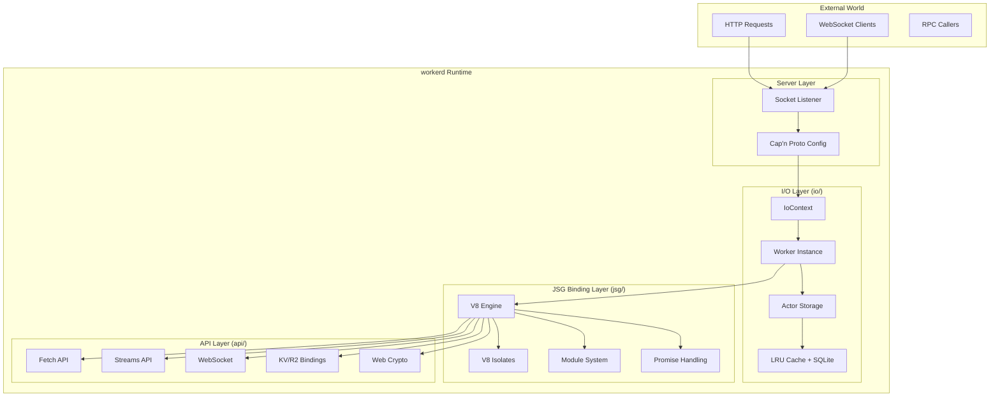
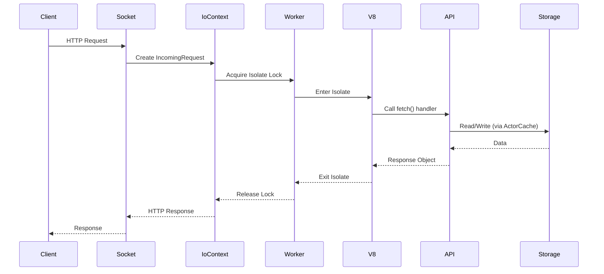
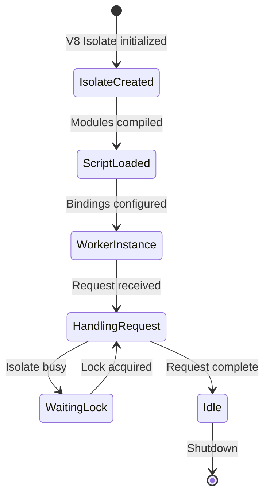
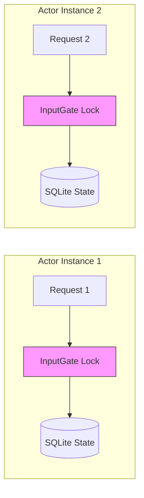

# workerd: Cloudflare's JavaScript/Wasm Runtime

**Source:** `/home/darkvoid/Boxxed/@formulas/src.rust/src.cloudflare/workerd/`

**Created:** 2026-03-27

**Status:** Complete architecture overview

---

## Table of Contents

1. [Executive Summary](#executive-summary)
2. [Architecture Overview](#architecture-overview)
3. [Core Components](#core-components)
4. [System Design Principles](#system-design-principles)
5. [Key Technical Decisions](#key-technical-decisions)
6. [Rust Translation Strategy](#rust-translation-strategy)
7. [Directory Structure](#directory-structure)

---

## Executive Summary

**workerd** (pronounced "worker-dee") is Cloudflare's open-source JavaScript/WebAssembly server runtime that powers [Cloudflare Workers](https://workers.dev). It represents one of the most sophisticated production JavaScript runtimes, featuring:

- **V8-based JavaScript execution** with multi-tenant isolation
- **WebAssembly module support** for polyglot workloads
- **Actor model implementation** enabling Durable Objects (stateful serverless)
- **Capability-based security** via Cap'n Proto RPC
- **Web API compatibility** (Fetch, Streams, Service Worker APIs)
- **Nanoservices architecture** for composable deployment

### Key Metrics

| Metric | Value |
|--------|-------|
| Primary Language | C++23 (with KJ framework) |
| JavaScript Engine | V8 (Chromium fork with patches) |
| Build System | Bazel |
| Lines of Code | ~500,000+ (src/workerd/) |
| Test Coverage | wd_test, kj_test, WPT, Node.js compat |
| Serialization | Cap'n Proto (binary RPC) |
| Database | SQLite (embedded, custom VFS) |

---

## Architecture Overview

### High-Level System Diagram



### Request Flow Architecture



---

## Core Components

### 1. Server Layer (`src/workerd/server/`)

The server layer handles configuration parsing, socket management, and service routing.

**Key Files:**
- `server.c++` (63KB) - Main server implementation
- `workerd.capnp` (63KB) - Configuration schema (Cap'n Proto)
- `workerd.c++` - Binary entry point and CLI

**Configuration Model:**

```capnp
struct Config {
  services :List(Service);    # Named services
  sockets :List(Socket);      # Listen addresses
  v8Flags :List(Text);        # V8 configuration
  logging :LoggingOptions;    # Log format
}

struct Service {
  name :Text;
  worker :Worker;             # JavaScript/Wasm worker
  network :Network;           # Outbound network access
  external :ExternalServer;   # Proxy to external service
}
```

### 2. I/O Layer (`src/workerd/io/`)

The I/O layer manages worker lifecycle, isolate scheduling, actor storage, and request tracking.

**Key Classes:**

| Class | Size | Purpose |
|-------|------|---------|
| `Worker` | worker.c++ (197KB) | Isolate + Script instance management |
| `IoContext` | io-context.c++ (59KB) | Per-request/actor I/O context |
| `ActorCache` | actor-cache.c++ (140KB) | LRU caching for Durable Objects |
| `ActorSqlite` | actor-sqlite.c++ (48KB) | SQLite-backed actor storage |
| `InputGate`/`OutputGate` | io-gate.c++ (11KB) | I/O ordering guarantees |

**Worker Lifecycle:**



### 3. JSG Binding Layer (`src/workerd/jsg/`)

JSG (JavaScript Glue) is the magic template library that auto-generates FFI bindings between C++ and V8.

**Key Features:**

- **Macro-based bindings** (`JSG_RESOURCE_TYPE`, `JSG_METHOD`, `JSG_PROTOTYPE_PROPERTY`)
- **Automatic type marshaling** between C++ and JavaScript
- **Garbage collection integration** via `visitForGc()`
- **Promise handling** across KJ/JS event loops
- **Module system** with ESM/CommonJS support

**Type Mapping:**

| C++ Type | JavaScript Type |
|----------|-----------------|
| `kj::String` | `string` |
| `kj::Array<byte>` | `Uint8Array` |
| `jsg::Promise<T>` | `Promise` |
| `jsg::Ref<T>` | Resource wrapper |
| `kj::Maybe<T>` | `null` or `T` |
| `kj::OneOf<T...>` | Union type |

### 4. API Layer (`src/workerd/api/`)

Implements the public JavaScript APIs: Fetch, Streams, WebSocket, Crypto, KV, R2, etc.

**API Categories:**

| Category | Files | Description |
|----------|-------|-------------|
| HTTP | `http.c++` (105KB), `basics.c++` (43KB) | Request, Response, Headers, Body |
| Streams | `streams/` (800KB+) | WHATWG + Internal streams |
| Storage | `kv.c++`, `r2-bucket.c++`, `sql.c++` | KV, R2, D1 Database |
| Network | `web-socket.c++`, `sockets.c++` | WebSocket, TCP sockets |
| Encoding | `encoding.c++`, `form-data.c++` | TextEncoder, FormData |
| Crypto | `crypto/` | Web Crypto API |
| Node.js | `node/` | Node.js compatibility layer |

---

## System Design Principles

### 1. Isolate-Based Multi-Tenancy

Each worker script runs in a V8 **isolate** - a completely isolated VM instance with:
- Separate heap and garbage collection
- Independent event queues
- No shared state between isolates

```cpp
// worker.h - Isolate management
class Worker::Isolate {
  v8::Isolate* isolate;
  kj::Own<v8::Locker> locker;
  jsg::JsContext context;
  // ...
};
```

### 2. Capability-Based Security

All resource access is through **capabilities** - unforgeable references passed via configuration:

```capnp
struct Worker {
  bindings :List(Binding);
}

struct Binding {
  name :Text;        # JavaScript binding name
  service :Service;  # Capability target
}
```

### 3. Actor Model for State

Durable Objects implement the actor model:
- **Single-threaded** - one request at a time per actor
- **Persistent state** - SQLite-backed storage
- **Location transparency** - actors addressed by ID



### 4. Nanoservices Architecture

Services can call other services with **function-call performance**:
- No network overhead for same-process calls
- Homogeneous deployment (all services on all machines)
- Capability-based composition

---

## Key Technical Decisions

### Why KJ Framework?

workerd uses the **KJ** C++ framework (from Cap'n Proto) instead of STL:

| KJ Type | STL Equivalent | Why KJ |
|---------|----------------|--------|
| `kj::String` | `std::string` | Move-only, clearer ownership |
| `kj::Array<T>` | `std::vector<T>` | Fixed-size, no reallocation |
| `kj::Own<T>` | `std::unique_ptr<T>` | Custom disposers |
| `kj::Promise<T>` | `std::future<T>` | Async-first design |
| `kj::Maybe<T>` | `std::optional<T>` | Null-handling semantics |

### Why Cap'n Proto?

- **Zero-copy serialization** - no parsing overhead
- **Schema evolution** - backward/forward compatible
- **RPC framework** - built-in distributed object support
- **Language bindings** - C++, Rust, Go, etc.

### Why SQLite for Actors?

- **Embedded** - no external database dependency
- **ACID transactions** - durable by default
- **Fine-grained locking** - compatible with actor model
- **Custom VFS** - integrates with KJ filesystem abstraction

---

## Rust Translation Strategy

### Crate Structure

A Rust reimplementation would require:

```
workerd-rust/
├── workerd-core/          # Core runtime types
├── workerd-jsg/           # JavaScript bindings (rquickjs)
├── workerd-isolate/       # V8/rquickjs isolation
├── workerd-actor/         # Durable Objects
├── workerd-api/           # Web API implementations
├── workerd-rpc/           # Cap'n Proto RPC (capnp-rust)
├── workerd-streams/       # Streams implementation
├── workerd-http/          # HTTP/Fetch implementation
└── workerd-server/        # Server binary
```

### Key Rust Dependencies

| C++ Component | Rust Equivalent |
|---------------|-----------------|
| V8 Engine | `rquickjs` or `deno_core` |
| WebAssembly | `wasmtime` |
| KJ Framework | Standard library + `tokio` |
| Cap'n Proto | `capnp` + `capnpc` |
| SQLite | `rusqlite` |
| KJ Promises | `tokio::sync` or futures |

### Challenges

1. **V8 Integration** - V8's C++ API is complex; rquickjs uses QuickJS
2. **Async Model** - KJ async != Tokio async
3. **Memory Model** - GC integration with Rust ownership
4. **Performance** - Zero-copy patterns harder in Rust

---

## Directory Structure

```
src/workerd/
├── api/                    # JavaScript API implementations
│   ├── streams/           # WHATWG Streams (800KB+)
│   ├── node/              # Node.js compatibility
│   ├── crypto/            # Web Crypto
│   ├── basics.c++         # Request, Response, Headers
│   ├── http.c++           # Fetch API
│   ├── web-socket.c++     # WebSocket
│   ├── kv.c++             # KV storage
│   └── r2-*.c++           # R2 object storage
│
├── io/                     # I/O subsystem
│   ├── worker.c++         # Worker instance lifecycle
│   ├── io-context.c++     # Per-request context
│   ├── actor-cache.c++    # Actor LRU cache (140KB)
│   ├── actor-sqlite.c++   # SQLite actor storage
│   ├── io-gate.c++        # I/O ordering
│   └── compatibility-date.capnp  # Feature flags
│
├── jsg/                    # JavaScript Glue layer
│   ├── jsg.h              # Core binding macros (144KB)
│   ├── resource.h         # Resource type handling
│   ├── modules-new.c++    # Module system
│   ├── promise.c++        # Promise handling
│   ├── memory.h           # GC memory tracking
│   └── README.md          # JSG reference
│
├── server/                 # Server implementation
│   ├── server.c++         # Main server (63KB)
│   ├── workerd.capnp      # Config schema
│   └── workerd.c++        # Binary entry point
│
├── util/                   # Utilities
│   ├── sqlite.c++         # SQLite wrapper (94KB)
│   ├── uuid.c++           # UUID generation
│   ├── state-machine.h    # State machine DSL
│   └── autogate.h         # Feature gates
│
└── tests/                  # Test fixtures
```

---

## Related Documents

- [Zero to Runtime Engineer](00-zero-to-runtime-engineer.md) - First principles introduction
- [Isolate Architecture](01-isolate-architecture-deep-dive.md) - V8 isolates and security
- [Actor Model](02-actor-model-deep-dive.md) - Durable Objects deep dive
- [WASM Runtime](03-wasm-runtime-deep-dive.md) - WebAssembly integration
- [Web API Compatibility](04-web-api-compatibility-deep-dive.md) - Fetch, Streams implementation
- [Cap'n Proto RPC](05-capnp-rpc-deep-dive.md) - RPC serialization
- [Event Loop & Async](06-event-loop-async-deep-dive.md) - KJ async model
- [Rust Revision](rust-revision.md) - Complete Rust translation guide
- [Production Grade](production-grade.md) - Deployment and scaling
- [Valtron Integration](07-valtron-integration.md) - Lambda deployment

---

## References

- [Official workerd Repository](https://github.com/cloudflare/workerd)
- [Cloudflare Workers Documentation](https://developers.cloudflare.com/workers/)
- [KJ Framework Documentation](https://capnproto.org/kjdoc/tour.html)
- [Cap'n Proto Specification](https://capnproto.org/encoding.html)
- [V8 Engine Internals](https://v8.dev/docs)
