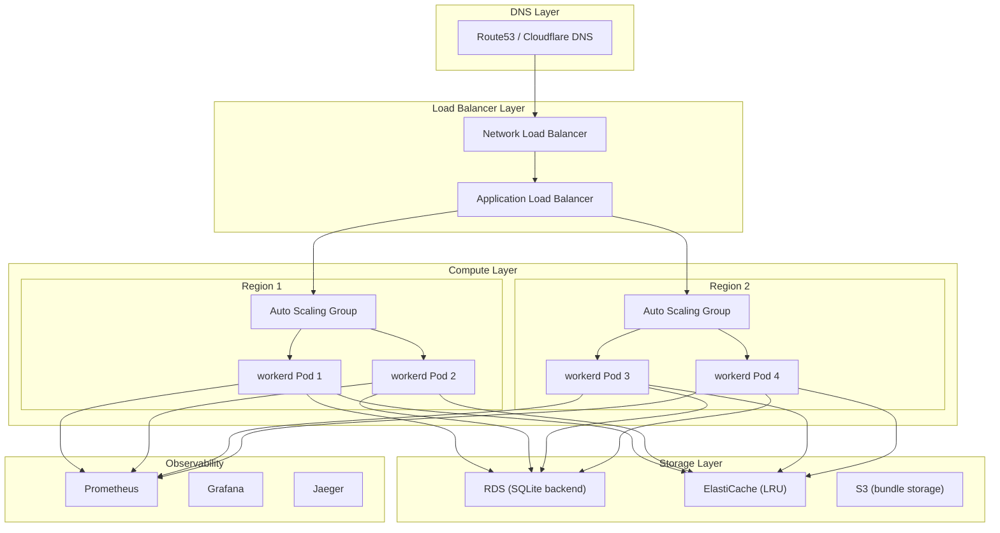
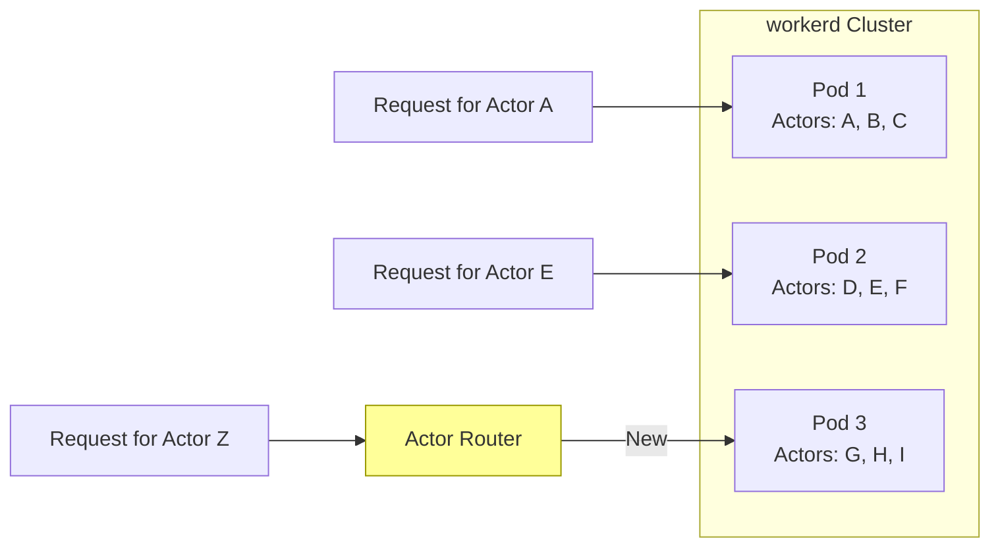

# Production-Grade Deployment: Scaling, Monitoring, and Operations

**Created:** 2026-03-27

**Status:** Production deployment guide

---

## Table of Contents

1. [Executive Summary](#executive-summary)
2. [Deployment Architecture](#deployment-architecture)
3. [Scaling Strategies](#scaling-strategies)
4. [Monitoring and Observability](#monitoring-and-observability)
5. [Security Hardening](#security-hardening)
6. [Disaster Recovery](#disaster-recovery)
7. [Performance Tuning](#performance-tuning)
8. [Operational Runbooks](#operational-runbooks)

---

## Executive Summary

Running workerd in production requires careful attention to:

- **High availability** - Multi-region deployment
- **Auto-scaling** - Handle traffic spikes
- **Observability** - Metrics, logs, traces
- **Security** - Sandboxing, network policies
- **Resource management** - CPU, memory, limits

---

## Deployment Architecture

### Reference Architecture



### Kubernetes Deployment

```yaml
# deployment.yaml
apiVersion: apps/v1
kind: Deployment
metadata:
  name: workerd
  namespace: production
spec:
  replicas: 10
  selector:
    matchLabels:
      app: workerd
  template:
    metadata:
      labels:
        app: workerd
      annotations:
        prometheus.io/scrape: "true"
        prometheus.io/port: "9090"
    spec:
      affinity:
        podAntiAffinity:
          requiredDuringSchedulingIgnoredDuringExecution:
          - labelSelector:
              matchExpressions:
              - key: app
                operator: In
                values:
                - workerd
            topologyKey: "kubernetes.io/hostname"
      containers:
      - name: workerd
        image: workerd:latest
        ports:
        - containerPort: 8080
          name: http
        - containerPort: 9090
          name: metrics
        resources:
          requests:
            cpu: "500m"
            memory: "512Mi"
          limits:
            cpu: "2000m"
            memory: "2Gi"
        env:
        - name: WORKERD_CONFIG
          value: "/etc/workerd/config.capnp"
        - name: RUST_LOG
          value: "info,workerd=debug"
        volumeMounts:
        - name: config
          mountPath: /etc/workerd
        - name: bundles
          mountPath: /var/workerd/bundles
        livenessProbe:
          httpGet:
            path: /health
            port: 8080
          initialDelaySeconds: 10
          periodSeconds: 10
        readinessProbe:
          httpGet:
            path: /ready
            port: 8080
          initialDelaySeconds: 5
          periodSeconds: 5
      volumes:
      - name: config
        configMap:
          name: workerd-config
      - name: bundles
        persistentVolumeClaim:
          claimName: workerd-bundles
---
apiVersion: autoscaling/v2
kind: HorizontalPodAutoscaler
metadata:
  name: workerd-hpa
spec:
  scaleTargetRef:
    apiVersion: apps/v1
    kind: Deployment
    name: workerd
  minReplicas: 10
  maxReplicas: 100
  metrics:
  - type: Resource
    resource:
      name: cpu
      target:
        type: Utilization
        averageUtilization: 70
  - type: Resource
    resource:
      name: memory
      target:
        type: Utilization
        averageUtilization: 80
```

---

## Scaling Strategies

### Horizontal Scaling

```
┌─────────────────────────────────────────────────────┐
│           Horizontal Scaling Pattern                 │
├─────────────────────────────────────────────────────┤
│  Traffic Increase → HPA detects → Add Pods          │
│  Traffic Decrease → HPA detects → Remove Pods       │
└─────────────────────────────────────────────────────┘

Scaling Triggers:
- CPU utilization > 70%
- Memory utilization > 80%
- Request queue depth > 100
- P99 latency > 100ms
```

### Actor Distribution



### Cache Sharding

```rust
// workerd-util/src/cache_shard.rs

use std::collections::HashMap;
use std::hash::{Hash, Hasher};
use std::sync::Arc;
use tokio::sync::RwLock;

pub struct ShardedCache<K, V> {
    shards: Vec<Arc<RwLock<HashMap<K, V>>>>,
    shard_count: usize,
}

impl<K: Hash + Eq, V> ShardedCache<K, V> {
    pub fn new(shard_count: usize) -> Self {
        let shards = (0..shard_count)
            .map(|_| Arc::new(RwLock::new(HashMap::new())))
            .collect();

        Self { shards, shard_count }
    }

    fn get_shard(&self, key: &K) -> &Arc<RwLock<HashMap<K, V>>> {
        let hash = {
            let mut hasher = std::collections::hash_map::DefaultHasher::new();
            key.hash(&mut hasher);
            hasher.finish() as usize
        };
        &self.shards[hash % self.shard_count]
    }

    pub async fn get(&self, key: &K) -> Option<V>
    where
        V: Clone,
    {
        let shard = self.get_shard(key);
        shard.read().await.get(key).cloned()
    }

    pub async fn insert(&self, key: K, value: V) {
        let shard = self.get_shard(&key);
        shard.write().await.insert(key, value);
    }
}
```

---

## Monitoring and Observability

### Metrics Collection

```rust
// workerd-util/src/metrics.rs

use prometheus::{
    register_counter, register_histogram, register_gauge,
    Counter, Histogram, Gauge,
};

pub struct WorkerMetrics {
    requests_total: Counter,
    request_duration: Histogram,
    active_isolates: Gauge,
    memory_usage: Gauge,
    actor_count: Gauge,
}

impl WorkerMetrics {
    pub fn new() -> Self {
        Self {
            requests_total: register_counter!(
                "workerd_requests_total",
                "Total number of requests"
            ).unwrap(),
            request_duration: register_histogram!(
                "workerd_request_duration_seconds",
                "Request duration in seconds",
                vec![0.001, 0.005, 0.01, 0.025, 0.05, 0.1, 0.25, 0.5, 1.0]
            ).unwrap(),
            active_isolates: register_gauge!(
                "workerd_active_isolates",
                "Number of active isolates"
            ).unwrap(),
            memory_usage: register_gauge!(
                "workerd_memory_usage_bytes",
                "Memory usage in bytes"
            ).unwrap(),
            actor_count: register_gauge!(
                "workerd_actor_count",
                "Number of active actors"
            ).unwrap(),
        }
    }

    pub fn record_request(&self, duration: f64) {
        self.requests_total.inc();
        self.request_duration.observe(duration);
    }
}
```

### Grafana Dashboard

```json
{
  "dashboard": {
    "title": "workerd Production",
    "panels": [
      {
        "title": "Request Rate",
        "targets": [{
          "expr": "rate(workerd_requests_total[5m])"
        }]
      },
      {
        "title": "P99 Latency",
        "targets": [{
          "expr": "histogram_quantile(0.99, rate(workerd_request_duration_seconds_bucket[5m]))"
        }]
      },
      {
        "title": "Memory Usage",
        "targets": [{
          "expr": "workerd_memory_usage_bytes"
        }]
      },
      {
        "title": "Active Actors",
        "targets": [{
          "expr": "workerd_actor_count"
        }]
      }
    ]
  }
}
```

### Distributed Tracing

```rust
// workerd-util/src/tracing.rs

use tracing::{instrument, Span};
use tracing_opentelemetry::OpenTelemetrySpanExt;

#[instrument(name = "handle_request", skip_all, fields(
    request_id = %request.id,
    method = %request.method,
    path = %request.path
))]
pub async fn handle_request(request: Request) -> Result<Response, Error> {
    // Add custom attributes
    Span::current().record("user_id", &request.user_id);

    // Process request
    let response = process_request(request).await?;

    // Record response
    Span::current().record("status", &response.status);

    Ok(response)
}

// Jaeger/Zipkin exporter
pub fn init_tracing() {
    let tracer = opentelemetry_jaeger::new_agent_pipeline()
        .with_service_name("workerd")
        .install_simple()
        .unwrap();

    let telemetry = tracing_opentelemetry::layer().with_tracer(tracer);

    tracing_subscriber::registry()
        .with(telemetry)
        .with(tracing_subscriber::fmt::layer())
        .init();
}
```

---

## Security Hardening

### Sandboxing

```yaml
# Pod security context
securityContext:
  runAsNonRoot: true
  runAsUser: 1000
  runAsGroup: 1000
  fsGroup: 1000
  capabilities:
    drop:
    - ALL
  readOnlyRootFilesystem: true
  seccompProfile:
    type: RuntimeDefault
```

### Network Policies

```yaml
# network-policy.yaml
apiVersion: networking.k8s.io/v1
kind: NetworkPolicy
metadata:
  name: workerd-network-policy
spec:
  podSelector:
    matchLabels:
      app: workerd
  policyTypes:
  - Ingress
  - Egress
  ingress:
  - from:
    - namespaceSelector:
        matchLabels:
          name: ingress
    ports:
    - protocol: TCP
      port: 8080
  egress:
  - to:
    - namespaceSelector:
        matchLabels:
          name: database
    ports:
    - protocol: TCP
      port: 5432
  - to:
    - namespaceSelector:
        matchLabels:
          name: external
    ports:
    - protocol: TCP
      port: 443
```

### Resource Limits

```yaml
# Limit ranges
apiVersion: v1
kind: LimitRange
metadata:
  name: workerd-limits
spec:
  limits:
  - type: Container
    default:
      cpu: "1000m"
      memory: "1Gi"
    defaultRequest:
      cpu: "500m"
      memory: "512Mi"
    max:
      cpu: "4000m"
      memory: "4Gi"
    min:
      cpu: "100m"
      memory: "128Mi"
```

---

## Disaster Recovery

### Backup Strategy

```rust
// workerd-util/src/backup.rs

use rusqlite::Connection;
use std::fs::File;
use std::io::Write;

pub async fn backup_database(conn: &Connection, s3_path: &str) -> Result<(), Error> {
    // 1. Create backup
    let backup_data = conn.backup(None, None)?;

    // 2. Compress
    let compressed = compress(&backup_data)?;

    // 3. Upload to S3
    upload_to_s3(&compressed, s3_path).await?;

    // 4. Verify backup
    verify_backup(s3_path).await?;

    Ok(())
}

pub async fn restore_database(s3_path: &str, dest_path: &str) -> Result<(), Error> {
    // 1. Download from S3
    let compressed = download_from_s3(s3_path).await?;

    // 2. Decompress
    let backup_data = decompress(&compressed)?;

    // 3. Restore
    Connection::backup_from_memory(&backup_data, dest_path)?;

    Ok(())
}
```

### Failover Strategy

```
Primary Region (us-east-1)
├── 10 workerd pods
├── RDS Primary
└── ElastiCache Primary
    │
    │ Replication
    ↓
Secondary Region (us-west-2)
├── 5 workerd pods (warm standby)
├── RDS Replica (read-only)
└── ElastiCache Replica

Failover Triggers:
- Primary region unavailable
- Error rate > 50%
- P99 latency > 5s

Failover Steps:
1. DNS switch to secondary
2. Promote RDS replica
3. Scale up secondary pods
4. Invalidate cache
5. Notify on-call
```

---

## Performance Tuning

### V8 Flags

```capnp
# workerd.capnp
v8Flags = [
  "--max-old-space-size=2048",   # Heap limit
  "--max-semi-space-size=64",    # Young generation
  "--always-compact",            # Aggressive GC
  "--turbo-inlining",            # JIT inlining
  "--trace-gc",                  # GC tracing (debug)
];
```

### Connection Pooling

```rust
// workerd-http/src/pool.rs

use deadpool::managed::{Manager, Pool};
use hyper::client::HttpConnector;
use hyper::Client;

pub struct HttpClientManager;

impl Manager for HttpClientManager {
    type Type = Client<HttpConnector>;
    type Error = hyper::Error;

    async fn create(&self) -> Result<Self::Type, Self::Error> {
        Ok(Client::new())
    }

    async fn recycle(&self, conn: &mut Self::Type) -> deadpool::managed::RecycleResult<Self::Error> {
        Ok(())
    }
}

pub fn create_pool(max_size: usize) -> Pool<HttpClientManager> {
    Pool::builder(HttpClientManager)
        .max_size(max_size)
        .build()
        .unwrap()
}
```

---

## Operational Runbooks

### Incident Response

```markdown
# Incident: High Error Rate

## Detection
- Alert: `rate(workerd_errors_total[5m]) > 0.1`
- Severity: P1

## Immediate Actions
1. Check Grafana dashboard
2. Review recent deployments
3. Check error logs

## Diagnosis
```bash
# Check pod status
kubectl get pods -l app=workerd

# View logs
kubectl logs -l app=workerd --tail=100

# Check metrics
curl http://workerd:9090/metrics
```

## Resolution
1. If bad deploy: rollback
2. If resource exhaustion: scale up
3. If external dependency: failover

## Post-Incident
1. Write post-mortem
2. Add monitoring gap
3. Update runbook
```

### Scaling Runbook

```markdown
# Runbook: Traffic Spike Response

## Automatic Scaling
- HPA triggers at 70% CPU
- Scale up cooldown: 3 minutes
- Scale down cooldown: 5 minutes

## Manual Scaling
```bash
# Immediate scale
kubectl scale deployment workerd --replicas=50

# Update HPA max
kubectl patch hpa workerd -p '{"spec":{"maxReplicas":200}}'
```

## Cache Warmup
```bash
# Preload common actors
for actor in $(cat popular_actors.txt); do
  curl -s "http://workerd/actor/$actor" > /dev/null
done
```
```

---

## References

- [Kubernetes Production Patterns](https://kubernetes.io/docs/concepts/)
- [Prometheus Best Practices](https://prometheus.io/docs/practices/)
- [OpenTelemetry Documentation](https://opentelemetry.io/docs/)
