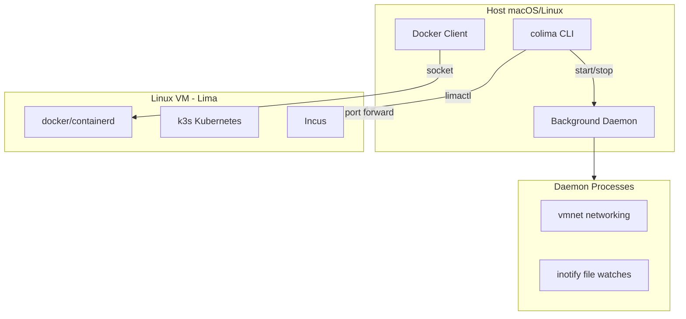

# Colima: Complete Exploration

## Overview

**Colima** (Containers on Lima) is a container runtime solution for macOS (and Linux) that provides Docker Desktop alternatives with minimal setup. It leverages Lima (Linux Machines) to run containers in lightweight VMs with automatic port forwarding, volume mounts, and support for multiple container runtimes.

### Why This Exploration Exists

This is a **complete textbook** that takes you from zero container knowledge to understanding how to build and deploy production container runtimes with Rust replication for ewe_platform.

### Key Characteristics

| Aspect | Colima |
|--------|--------|
| **Core Innovation** | Lima-based VM orchestration with multiple runtime support |
| **Dependencies** | Lima, QEMU/vz, Docker/containerd/incus, k3s (optional) |
| **Lines of Code** | ~15,000 (core Colima, excluding Lima) |
| **Purpose** | Container runtime orchestration on macOS/Linux |
| **Architecture** | VM management, runtime provisioning, daemon processes |
| **Runtime** | QEMU, Apple Virtualization Framework (vz), Krunkit |
| **Rust Equivalent** | ewe_platform container backend (TaskIterator pattern) |

---

## Complete Table of Contents

This exploration consists of multiple deep-dive documents. Read them in order for complete understanding:

### Part 1: Foundations
1. **[Zero to Container Engineer](00-zero-to-container-engineer.md)** - Start here if new to containers
   - What are containers?
   - Containers vs VMs
   - Linux namespaces and cgroups
   - Container runtime fundamentals
   - OCI specifications

### Part 2: Core Implementation
2. **[VM Management Deep Dive](01-vm-management-deep-dive.md)**
   - Lima integration architecture
   - VM lifecycle management
   - QEMU vs vz vs krunkit
   - Disk management
   - SSH and host communication

3. **[Runtime Integration Deep Dive](02-runtime-integration-deep-dive.md)**
   - Docker runtime provisioning
   - Containerd and nerdctl
   - Incus containers and VMs
   - Kubernetes (k3s) integration
   - Runtime switching

4. **[Volume Mounting Deep Dive](03-volume-mounting-deep-dive.md)**
   - 9p, virtiofs, sshfs drivers
   - Mount configuration
   - Inotify propagation
   - Writable mounts
   - Performance considerations

5. **[Networking Deep Dive](04-networking-deep-dive.md)**
   - NAT and slirp networking
   - Port forwarding (SSH, gRPC)
   - vmnet and bridged mode
   - Network address assignment
   - DNS configuration

### Part 3: Rust Replication
6. **[Rust Revision](rust-revision.md)**
   - Complete Rust translation
   - Type system design
   - Ownership and borrowing strategy
   - TaskIterator for async operations
   - Code examples

### Part 4: Production
7. **[Production-Grade](production-grade.md)**
   - Performance optimizations
   - Resource management
   - Multi-instance support
   - Monitoring and logging
   - Security considerations

8. **[Valtron Integration](05-valtron-integration.md)**
   - Lambda deployment patterns
   - Container orchestration at scale
   - No async/await patterns
   - Production deployment

---

## Quick Reference: Colima Architecture

### High-Level Flow



### Component Summary

| Component | Lines | Purpose | Deep Dive |
|-----------|-------|---------|-----------|
| App Layer | 700 | Start/Stop/SSH/Status commands | [VM Management](01-vm-management-deep-dive.md) |
| CLI | 650 | Command parsing, flags, config | [Runtime Integration](02-runtime-integration-deep-dive.md) |
| Lima VM | 400 | VM lifecycle, disk, network | [VM Management](01-vm-management-deep-dive.md) |
| Docker Runtime | 200 | Docker provisioning | [Runtime Integration](02-runtime-integration-deep-dive.md) |
| Containerd Runtime | 200 | Containerd provisioning | [Runtime Integration](02-runtime-integration-deep-dive.md) |
| Incus Runtime | 450 | Incus provisioning | [Runtime Integration](02-runtime-integration-deep-dive.md) |
| Daemon | 150 | Background process manager | [Networking](04-networking-deep-dive.md) |
| vmnet | 170 | Network daemon | [Networking](04-networking-deep-dive.md) |
| inotify | 200 | File event propagation | [Volume Mounting](03-volume-mounting-deep-dive.md) |

---

## File Structure

```
colima/
├── cmd/
│   ├── colima/main.go           # Entry point
│   ├── start.go                 # start command
│   ├── stop.go                  # stop command
│   ├── delete.go                # delete command
│   ├── ssh.go                   # ssh command
│   ├── status.go                # status command
│   ├── kubernetes.go            # kubernetes commands
│   ├── nerdctl.go               # nerdctl alias
│   └── daemon/
│       ├── daemon.go            # daemon start/stop/status
│       └── cmd.go               # daemon command handling
│
├── app/
│   └── app.go                   # Main App interface implementation
│
├── config/
│   ├── config.go                # Config struct and defaults
│   ├── profile.go               # Profile management
│   ├── files.go                 # File paths
│   └── configmanager/
│       └── configmanager.go     # Config load/save
│
├── environment/
│   ├── environment.go           # Host/Guest interfaces
│   ├── host/host.go             # Host environment
│   ├── guest/
│   │   └── systemctl/
│   │       └── systemctl.go     # Guest systemd operations
│   │
│   ├── vm/
│   │   └── lima/
│   │       ├── lima.go          # Lima VM implementation
│   │       ├── network.go       # Network configuration
│   │       ├── disk.go          # Disk management
│   │       ├── daemon.go        # Daemon integration
│   │       └── limaconfig/
│   │           └── config.go    # Lima config types
│   │
│   └── container/
│       ├── container.go         # Container runtime interface
│       ├── docker/
│       │   ├── docker.go        # Docker runtime
│       │   ├── daemon.go        # Docker daemon config
│       │   └── context.go       # Docker context management
│       ├── containerd/
│       │   └── containerd.go    # Containerd runtime
│       ├── incus/
│       │   └── incus.go         # Incus runtime
│       └── kubernetes/
│           └── kubernetes.go    # Kubernetes (k3s) runtime
│
├── daemon/
│   ├── daemon.go                # Daemon manager
│   └── process/
│       ├── process.go           # Process interface
│       ├── vmnet/
│       │   └── vmnet.go         # vmnet networking process
│       └── inotify/
│           └── inotify.go       # inotify file events
│
├── store/
│   └── store.go                 # Persistent state store
│
├── util/
│   ├── osutil/                  # OS utilities
│   ├── yamlutil/                # YAML utilities
│   └── terminal/                # Terminal utilities
│
└── embedded/
    ├── defaults/                # Default configs
    └── images/                  # Disk images
```

---

## Key Insights

### 1. VM-Based Isolation

Colima uses Lima to create lightweight Linux VMs, providing better isolation than Docker Desktop's hypervisor approach:

```go
// Lima VM creation
func (l *limaVM) Start(ctx context.Context, conf config.Config) error {
    l.limaConf, err = newConf(ctx, conf)
    yamlutil.WriteYAML(l.limaConf, confFile)
    l.host.Run(limactl, "start", "--tty=false", confFile)
}
```

### 2. Multiple Runtime Support

Colima abstracts container runtimes behind a common interface:

```go
type Container interface {
    Provision(ctx context.Context) error
    Start(ctx context.Context) error
    Stop(ctx context.Context, force bool) error
    Running(ctx context.Context) bool
    Teardown(ctx context.Context) error
}
```

### 3. Daemon Processes

Background processes handle networking and file events:

```go
// Daemon manager starts processes
func (l processManager) Start(ctx context.Context, conf config.Config) error {
    if conf.Network.Address {
        args = append(args, "--vmnet")
    }
    if conf.MountINotify {
        args = append(args, "--inotify")
    }
    host.RunQuiet(args...)
}
```

### 4. Port Forwarding

Automatic port forwarding via SSH or gRPC:

```go
// Port forwards configured in Lima config
type PortForward struct {
    GuestIP      net.IP
    GuestPort    int
    HostIP       net.IP
    HostPort     int
    Proto        string  // tcp, udp
}
```

### 5. Volume Mounts

Multiple mount types for different VM backends:

| VM Type | Default Mount | Alternatives |
|---------|--------------|--------------|
| QEMU | sshfs | 9p, virtiofs |
| vz (Apple) | virtiofs | - |
| krunkit | virtiofs | - |

---

## How Colima Compares to Docker Desktop

| Feature | Colima | Docker Desktop |
|---------|--------|----------------|
| **VM Backend** | Lima (QEMU/vz) | HyperKit/Hyper-V/WSL2 |
| **License** | MIT (Open Source) | Proprietary |
| **Runtimes** | Docker, containerd, incus | Docker, Kubernetes |
| **Networking** | NAT, bridged, vmnet | NAT, host |
| **Volume Mounts** | 9p, virtiofs, sshfs | virtiofs, 9p |
| **Resource Usage** | Configurable, minimal | Higher overhead |
| **Multiple Instances** | Yes (profiles) | Limited |
| **Linux Support** | Yes | WSL2 only |

---

## From Colima to ewe_platform Container Runtime

### TypeScript/Go Pattern -> Rust TaskIterator

```go
// Go: VM Start
func (l *limaVM) Start(ctx context.Context, conf config.Config) error {
    if err := l.guest.Start(ctx, conf); err != nil {
        return err
    }
    // provision runtimes
    for _, cont := range containers {
        cont.Provision(ctx)
        cont.Start(ctx)
    }
}
```

```rust
// Rust: TaskIterator pattern
struct StartContainerTask {
    vm: Arc<VmHandle>,
    runtime: ContainerRuntime,
}

impl TaskIterator for StartContainerTask {
    type Ready = Result<ContainerState, ContainerError>;
    type Pending = VmWaitState;

    fn next(&mut self) -> Option<TaskStatus<Self::Ready, Self::Pending, NoSpawner>> {
        match self.vm.poll_status() {
            Ok(VmStatus::Running) => {
                self.runtime.provision()?;
                Some(TaskStatus::Ready(self.runtime.start()))
            }
            Ok(VmStatus::Starting) => {
                Some(TaskStatus::Pending(VmWaitState::new(self.vm.clone())))
            }
            Err(e) => Some(TaskStatus::Ready(Err(e))),
        }
    }
}
```

---

## Your Path Forward

### To Build Container Runtime Skills

1. **Understand container fundamentals** (namespaces, cgroups)
2. **Study Lima integration** (VM management)
3. **Implement runtime provisioning** (Docker/containerd)
4. **Add networking** (port forwarding, NAT)
5. **Translate to Rust** (TaskIterator pattern)

### Recommended Resources

- [Lima Documentation](https://github.com/lima-vm/lima)
- [OCI Specifications](https://github.com/opencontainers/specs)
- [Docker Architecture](https://docs.docker.com/get-started/overview/)
- [TaskIterator Specification](/home/darkvoid/Boxxed/@dev/ewe_platform/specifications/08-valtron-async-iterators/)

---

## Document History

| Date | Change |
|------|--------|
| 2026-03-27 | Initial exploration created |
| 2026-03-27 | Deep dives 00-05 outlined |
| 2026-03-27 | Rust revision and production-grade planned |

---

*This exploration is a living document. Revisit sections as concepts become clearer through implementation.*
