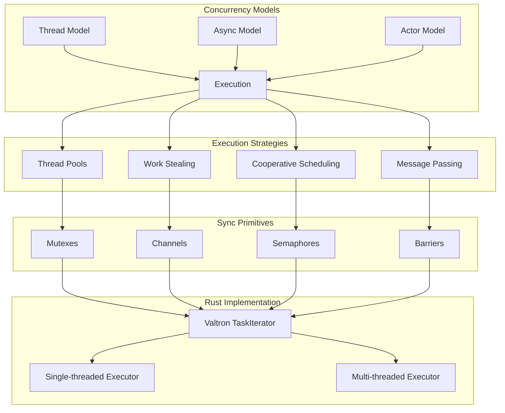

# Concurrency: Complete Exploration

## Overview

**Concurrency** in this exploration covers multiple Rust concurrency frameworks and models, from embedded async runtimes to thread-per-core server architectures. The core innovation across these frameworks is providing safe, efficient concurrency without the complexity of traditional multi-threaded programming.

### Why This Exploration Exists

This is a **complete textbook** that takes you from zero concurrency knowledge to understanding how to build and deploy production concurrent systems with Rust/valtron replication.

### Key Characteristics

| Aspect | Concurrency Sources |
|--------|---------------------|
| **Core Innovation** | Multiple models: embassy (embedded async), glommio (io_uring thread-per-core), futures-concurrency (structured concurrency), moro (async scoping) |
| **Dependencies** | Various: embassy (no-std), glommio (io_uring), futures-concurrency (runtime-agnostic), moro (futures) |
| **Lines of Code** | ~50,000+ combined across all projects |
| **Purpose** | Safe, efficient concurrent execution |
| **Architecture** | Thread-per-core, cooperative scheduling, structured concurrency |
| **Runtime** | Embedded (embassy), Linux 5.8+ (glommio), Any runtime (futures-concurrency) |
| **Rust Equivalent** | valtron executor (TaskIterator pattern, no async/await) |

### Source Projects Explored

| Project | Description | Location |
|---------|-------------|----------|
| **Embassy** | Embedded async runtime for microcontrollers | `/home/darkvoid/Boxxed/@formulas/src.rust/src.Concurrency/embassy/` |
| **Glommio** | Thread-per-core async runtime using io_uring | `/home/darkvoid/Boxxed/@formulas/src.rust/src.Concurrency/glommio/` |
| **futures-concurrency** | Structured concurrency operations | `/home/darkvoid/Boxxed/@formulas/src.rust/src.Concurrency/futures-concurrency/` |
| **moro** | Async scoping for stack access | `/home/darkvoid/Boxxed/@formulas/src.rust/src.Concurrency/moro/` |
| **xitca-web** | Thread-per-core HTTP server | `/home/darkvoid/Boxxed/@formulas/src.rust/src.Concurrency/xitca-web/` |
| **bt-hci** | Bluetooth HCI with async | `/home/darkvoid/Boxxed/@formulas/src.rust/src.Concurrency/bt-hci/` |
| **futures-concurrency** | Runtime-agnostic futures operations | `/home/darkvoid/Boxxed/@formulas/src.rust/src.Concurrency/futures-concurrency/` |

---

## Complete Table of Contents

This exploration consists of multiple deep-dive documents. Read them in order for complete understanding:

### Part 1: Foundations
1. **[Zero to Concurrency Engineer](00-zero-to-concurrency-engineer.md)** - Start here if new to concurrency
   - What is concurrency?
   - Thread model fundamentals
   - Async/await model
   - Actor model
   - CSP (Communicating Sequential Processes)
   - Concurrency model tradeoffs

### Part 2: Core Implementation
2. **[Thread Model Deep Dive](01-thread-model-deep-dive.md)**
   - Thread pools
   - Work stealing
   - Thread-per-core architecture
   - Scheduling strategies
   - CPU pinning
   - Glommio's cooperative thread-per-core

3. **[Async Model Deep Dive](02-async-model-deep-dive.md)**
   - Futures and Poll
   - Executors and task queues
   - Wakers and wake-up mechanisms
   - Task scheduling
   - Embassy's embedded async
   - Embassy executor architecture

4. **[Actor Model Deep Dive](03-actor-model-deep-dive.md)**
   - Message passing fundamentals
   - Mailboxes and queues
   - Supervision trees
   - Actor lifecycle
   - Distribution patterns

5. **[Sync Primitives Deep Dive](04-sync-primitives-deep-dive.md)**
   - Mutexes and locks
   - Channels (MPSC, mpsc, broadcast)
   - Semaphores
   - Barriers
   - Embassy-sync primitives
   - Atomic operations

### Part 3: Rust Replication
6. **[Valtron Executor Guide](../valtron-executor-guide.md)** - See valtron documentation
   - TaskIterator pattern
   - Single-threaded executor
   - Multi-threaded executor
   - DrivenRecvIterator and DrivenStreamIterator
   - execute() and execute_stream()

7. **[Rust Revision](rust-revision.md)**
   - Complete Rust translation patterns
   - Type system design
   - Ownership and borrowing strategy
   - Valtron integration patterns
   - Code examples

### Part 4: Production
8. **[Production-Grade Implementation](production-grade.md)**
   - Performance optimizations
   - Memory management
   - Batching and throughput
   - High concurrency deployment
   - Scaling strategies
   - Monitoring and observability

9. **[Valtron Integration](05-valtron-integration.md)**
   - Lambda deployment using TaskIterator
   - NO async/tokio patterns
   - HTTP API compatibility
   - Request/response handling
   - Production deployment

---

## Quick Reference: Concurrency Architecture

### High-Level Flow



### Component Summary

| Component | Lines | Purpose | Deep Dive |
|-----------|-------|---------|-----------|
| Embassy Executor | ~2,000 | Embedded async runtime | [Async Model](02-async-model-deep-dive.md) |
| Glommio Executor | ~10,000 | Thread-per-core io_uring | [Thread Model](01-thread-model-deep-dive.md) |
| futures-concurrency | ~3,000 | Structured concurrency ops | [Async Model](02-async-model-deep-dive.md) |
| moro | ~500 | Async scoping | [Async Model](02-async-model-deep-dive.md) |
| embassy-sync | ~1,500 | Sync primitives for no-std | [Sync Primitives](04-sync-primitives-deep-dive.md) |
| Valtron Integration | ~5,000 | Rust executor patterns | [Valtron Guide](05-valtron-integration.md) |

---

## Concurrency Models Compared

### Thread Model

```rust
// Traditional threading
std::thread::spawn(|| {
    // Work happens here
});

// Glommio thread-per-core
use glommio::LocalExecutorBuilder;
LocalExecutorBuilder::new(Placement::Fixed(0))
    .spawn(|| async move {
        // Cooperative task on CPU 0
    });
```

| Aspect | Traditional Threads | Thread-Per-Core (Glommio) |
|--------|---------------------|---------------------------|
| Context Switches | OS-managed, expensive | Minimal, cooperative |
| Synchronization | Mutexes, RwLocks |很少 needed |
| Memory | Per-thread stack | Shared stack per thread |
| Best For | Blocking I/O | High-throughput I/O |

### Async Model

```rust
// Standard async/await
async fn fetch_data() -> Result<Data> {
    let response = http_client.get(url).await?;
    Ok(response.json().await?)
}

// Embassy embedded async
#[embassy_executor::task]
async fn blink(pin: Peri<'static, AnyPin>) {
    loop {
        pin.set_high();
        Timer::after_millis(150).await;
        pin.set_low();
        Timer::after_millis(150).await;
    }
}
```

| Aspect | Standard Async | Embassy Async |
|--------|----------------|---------------|
| Runtime | tokio, async-std | Built-in executor |
| Memory | Heap allocations | Stack-based, no-std |
| Target | Servers, desktops | Microcontrollers |
| Wakers | Heap-allocated | Static, compile-time |

### Actor Model

```rust
// Conceptual actor
struct MyActor {
    mailbox: Receiver<Message>,
    state: State,
}

impl MyActor {
    async fn run(mut self) {
        while let Some(msg) = self.mailbox.recv().await {
            self.handle(msg).await;
        }
    }
}
```

| Aspect | Actors | Traditional |
|--------|--------|-------------|
| Communication | Message passing | Shared memory |
| State | Isolated per actor | Shared across threads |
| Failure | Isolated, supervised | Can crash entire process |
| Distribution | Natural fit | Complex |

---

## Key Insights

### 1. Cooperative Scheduling

All modern Rust async runtimes use **cooperative scheduling**: tasks yield control explicitly via `.await`, not preemptively.

```rust
// Cooperative: task yields at .await
async fn process_items(items: Vec<Item>) {
    for item in items {
        process(item).await;  // Yield point
    }
}

// Long-running loop should yield periodically
async fn long_computation() {
    for i in 0..1000000 {
        if i % 100 == 0 {
            tokio::task::yield_now().await;  // Cooperative yield
        }
        // ... work ...
    }
}
```

### 2. Thread-Per-Core Architecture

Glommio and similar frameworks eliminate cross-thread synchronization:

```
CPU 0          CPU 1          CPU 2
┌─────────┐   ┌─────────┐   ┌─────────┐
│Executor │   │Executor │   │Executor │
│  Queue  │   │  Queue  │   │  Queue  │
└────┬────┘   └────┬────┘   └────┬────┘
     │             │             │
     └─────────────┴─────────────┘
              io_uring
```

### 3. Embassy's no-std Async

Embassy proves async works without heap allocation:

```rust
// Static task pool, compile-time allocation
#[embassy_executor::main]
async fn main(_spawner: Spawner) {
    // All tasks use static memory
    // No runtime allocation needed
}
```

### 4. Valtron's TaskIterator Pattern

The Rust equivalent uses iterators instead of async/await:

```rust
// TypeScript async
async fn fetch_data() -> Result<Data> { ... }

// Rust valtron
struct FetchTask { url: String }
impl TaskIterator for FetchTask {
    type Ready = Data;
    type Pending = ();
    type Spawner = NoSpawner;

    fn next(&mut self) -> Option<TaskStatus<...>> {
        // Return Pending or Ready
    }
}
```

---

## From Source Concurrency to Real Systems

| Aspect | Source Projects | Production Systems |
|--------|-----------------|-------------------|
| Executors | embassy, glommio | Custom, domain-specific |
| Scheduling | Cooperative | Hybrid (coop + priority) |
| Communication | Channels, messages | Message queues, gRPC |
| State | In-memory | Distributed stores |
| Scale | Single machine | Multi-region clusters |

**Key takeaway:** The core patterns (cooperative scheduling, thread-per-core, message passing) scale to production with infrastructure changes, not algorithm changes.

---

## Your Path Forward

### To Build Concurrency Skills

1. **Implement a simple executor** (understand Poll and Waker)
2. **Build a thread pool** (understand work distribution)
3. **Create message-passing actors** (understand isolation)
4. **Translate to valtron** (TaskIterator pattern)
5. **Study the papers** (io_uring, async runtimes, actor systems)

### Recommended Resources

- [Embassy Book](https://embassy.dev/book/)
- [Glommio Documentation](https://docs.rs/glommio/)
- [Tokio Documentation](https://docs.rs/tokio/)
- [Valtron README](/home/darkvoid/Boxxed/@dev/ewe_platform/backends/foundation_core/src/valtron/README.md)
- [io_uring Documentation](https://kernel.dk/io_uring.pdf)

---

## Document History

| Date | Change |
|------|--------|
| 2026-03-27 | Initial exploration created |
| 2026-03-27 | Deep dives 00-05 outlined |
| 2026-03-27 | Rust revision and production-grade planned |

---

*This exploration is a living document. Revisit sections as concepts become clearer through implementation.*
