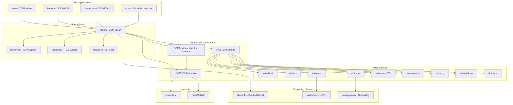

# Containers libkrun Exploration

## Project Overview

This exploration covers the libkrun ecosystem - a collection of projects centered around lightweight virtualization using KVM (Linux) and HVF (macOS). The primary components are:

- **libkrun**: A dynamic library that provides a simple C API for running processes in partially isolated KVM/HVF environments
- **krunvm**: CLI utility for creating microVMs from OCI images
- **krunkit**: Tool to launch configurable VMs using libkrun (macOS focused)
- **crun**: OCI container runtime with libkrun integration for krun mode
- **libkrunfw**: Library bundling a Linux kernel as a dynamic library for libkrun

The ecosystem enables running container workloads in lightweight VMs with near-container startup times and VM-level isolation.

## Architecture



## Directory Structure

The exploration source is located at `/home/darkvoid/Boxxed/@formulas/src.rust/src.Containers/` containing:

### Main Projects (src.containers/)

```
src.containers/
├── libkrun/           # Core VMM library (Rust + C API)
├── krunvm/            # OCI-based microVM CLI
├── krunkit/           # macOS VM launcher
├── crun/              # OCI runtime with krun support
├── libkrunfw/         # Bundled kernel library
├── cloud-hypervisor/  # Alternative VMM (Rust-based)
├── firecracker/       # AWS microVMM (Rust-based)
├── rust-vmm/          # Rust VMM crates ecosystem
└── [80+ other container/VM projects]
```

### Related Ecosystem Directories

```
src.cloud-hypervisor/   # Cloud Hypervisor VMM and dependencies
src.firecracker/        # Firecracker microVMM and SDKs
src.rust-vmm/           # Rust VMM foundational crates
src.weave-ignite/       # Ignite Firecracker manager
```

## Key Components

### 1. libkrun (Core Library)

**Purpose**: Enable other projects to gain KVM/HVF-based process isolation with minimal complexity.

**Key Features**:
- Self-sufficient VMM (no external VMM dependency)
- Minimal footprint (RAM, CPU, boot time)
- Simple C API despite Rust implementation
- Multiple variants for different security levels

**Variants**:
| Variant | Purpose |
|---------|---------|
| libkrun | Generic, all Virtualization-capable systems |
| libkrun-sev | AMD SEV/SEV-ES/SEV-SNP memory encryption |
| libkrun-tdx | Intel TDX memory encryption |
| libkrun-efi | EFI boot with OVMF (macOS) |

### 2. libkrunfw (Firmware Library)

Bundles a Linux kernel into a dynamic library that libkrun can directly map into guest memory without additional processing.

**Key Design**:
- Kernel configured with `CONFIG_NR_CPUS=8` (memory optimization)
- Supports both Linux and macOS builds
- GPL-2.0 licensed (kernel), LGPL-2.1 (library code)

### 3. krunvm (OCI MicroVM CLI)

Creates microVMs directly from OCI container images.

**Features**:
- Zero disk image maintenance
- Zero network configuration
- Fast boot times
- Volume mapping support
- Port exposure support

### 4. krunkit (macOS VM Tool)

Launches configurable VMs on macOS using libkrun-efi.

**Use Cases**:
- GPU-accelerated VMs via Venus (Mesa3D)
- Native context for 4k page games
- Lightweight development environments

### 5. crun (OCI Runtime)

Lightweight OCI container runtime written in C with libkrun integration.

**Performance**:
- ~50% faster than runc (1.69s vs 3.34s for 100 containers)
- Lower memory footprint (can run in 512k vs runc's 4M minimum)

## Networking Architecture

libkrun provides two mutually exclusive networking approaches:

### 1. virtio-vsock + TSI (Transparent Socket Impersonation)

Novel technique allowing VM network connectivity without a virtual interface.

**How it works**:
- VMM acts as proxy for AF_INET, AF_INET6, AF_UNIX sockets
- Supports both outgoing and incoming connections
- Automatically enabled when no virtio-net is configured

**Limitations**:
- Requires custom kernel (libkrunfw)
- Limited to SOCK_DGRAM and SOCK_STREAM
- No guest listening on SOCK_DGRAM
- AF_UNIX requires absolute paths

### 2. virtio-net + Userspace Proxy

Traditional virtual NIC with userspace networking proxy.

**Backends**:
- **passt**: User-space NAT with port forwarding
- **gvproxy**: gvisor-tap-vsock for advanced networking
- **tap**: Direct tap device (Linux)

**API Functions**:
```c
krun_add_net_unixstream()  // passt, socket_vmnet
krun_add_net_unixdgram()   // gvproxy, vmnet-helper
krun_add_net_tap()         // Linux tap devices
```

## Security Model

**Core Principle**: Guest and VMM share the same security context.

**Recommendations**:
- Run VMM in isolated context (namespaces on Linux)
- Apply network restrictions to VMM (affects guest)
- Use mount point isolation with virtio-fs
- Apply resource controls for filesystem limits

**Device-Specific Considerations**:

| Device | Security Concern | Mitigation |
|--------|-----------------|------------|
| virtio-fs | No filesystem isolation | Use mount namespaces |
| virtio-vsock+TSI | Full network proxy | Apply network policies to VMM |
| virtio-block | Raw file access | Restrict file permissions |

## API Overview

The libkrun C API is defined in `include/libkrun.h`:

### Core Functions
```c
// Context management
int32_t krun_create_ctx();
int32_t krun_free_ctx(uint32_t ctx_id);

// VM configuration
int32_t krun_set_vm_config(uint32_t ctx_id, uint8_t num_vcpus, uint32_t ram_mib);
int32_t krun_set_root(uint32_t ctx_id, const char *root_path);
int32_t krun_add_disk(uint32_t ctx_id, const char *block_id,
                      const char *disk_path, bool read_only);

// Execution
int32_t krun_set_exec(uint32_t ctx_id, const char *exec_path,
                      const char *const argv[], const char *const envp[]);
int32_t krun_start_enter(uint32_t ctx_id);
```

### Device Configuration
```c
// Networking
int32_t krun_add_net_unixstream(uint32_t ctx_id, ...);
int32_t krun_add_net_unixgram(uint32_t ctx_id, ...);

// Storage
int32_t krun_add_virtiofs(uint32_t ctx_id, const char *tag, const char *path);

// GPU
int32_t krun_set_gpu_options(uint32_t ctx_id, uint32_t virgl_flags);

// Console
int32_t krun_add_virtio_console_default(uint32_t ctx_id, ...);
```

## Use Cases

### 1. Container Isolation (crun)
- Adding VM-based isolation to container workloads
- Confidential computing with SEV/TDX variants

### 2. GPU-Accelerated VMs (krunkit/muvm)
- Running games requiring 4k pages on macOS
- GPU passthrough via Venus (Mesa3D)

### 3. OCI-based MicroVMs (krunvm)
- Development environments from container images
- Ephemeral VM workloads
- CI/CD runners

### 4. Serverless Workloads
- Fast startup for function-as-a-service
- Multi-tenant isolation

## Build System

### Linux (Generic)
```bash
# libkrun requirements
- libkrunfw
- Rust toolchain
- glibc-static
- patchelf

# Build with features
make BLK=1 NET=1 SND=1 GPU=1
sudo make install
```

### macOS (EFI)
```bash
# Requirements
- Rust toolchain
- macOS 14+
- lld, xz (Homebrew)

make EFI=1
sudo make install
```

### Build Features
| Flag | Feature | Dependencies |
|------|---------|--------------|
| BLK=1 | virtio-block | - |
| NET=1 | virtio-net | - |
| SND=1 | virtio-snd | - |
| GPU=1 | virtio-gpu | virglrenderer-devel |
| SEV=1 | AMD SEV | openssl-devel |
| TDX=1 | Intel TDX | openssl-devel |
| EFI=1 | EFI boot | macOS only |

## Related Projects in Ecosystem

### Firecracker (src.containers/firecracker/)

AWS's microVMM for serverless:
- 4000+ microVMs per host capability
- Rust-based, seccomp-hardened
- Used by AWS Lambda and Fargate
- See [Firecracker README](../../src.containers/firecracker/README.md)

### Cloud Hypervisor (src.containers/cloud-hypervisor/)

Rust-based VMM for cloud workloads:
- KVM and MSHV (Windows) support
- x86-64, AArch64, RISC-V 64
- Part of the rust-vmm ecosystem

### rust-vmm (src.rust-vmm/)

Foundational Rust VMM crates shared across projects:
- **vm-memory**: Guest memory management
- **vhost**: vhost protocol implementation
- **virtio-queue**: Virtio queue management
- **kvm-ioctls**: KVM ioctl wrappers
- **seccompiler**: seccomp filter compiler
- **vmm-sys-util**: VMM system utilities
- And 30+ more crates

Location: `src.rust-vmm/` contains 30+ sub-projects

### Weave Ignite (src.weave-ignite/)

Firecracker with Docker-like UX:
- GitOps management
- OCI image-based VMs
- Kubernetes integration

## Key Design Decisions

1. **Embedded Kernel**: libkrunfw bundles kernel as library for zero-copy guest loading
2. **TSI Networking**: Novel socket proxying avoids virtual NIC complexity
3. **C API**: Rust implementation with C ABI for broad language interoperability
4. **Multiple Variants**: Separate libraries for SEV/TDX/EFI to minimize dependencies
5. **Minimal Device Emulation**: Only essential virtio devices for target workloads

## Deep Dive Documents

- [libkrun Deep Dive](libkrun-deep-dive.md) - Core library architecture and API
- [libkrunfw Deep Dive](libkrunfw-deep-dive.md) - Bundled kernel library
- [krunvm Deep Dive](krunvm-deep-dive.md) - OCI-based microVM CLI
- [krunkit Deep Dive](krunkit-deep-dive.md) - macOS VM launcher with GPU support
- [crun Deep Dive](crun-deep-dive.md) - OCI runtime with libkrun integration
- [Rust Container VM Builder](rust-container-vm-builder.md) - Comprehensive Rust guide

## Rust Development Guides

- [Rust libkrun Guide](rust-libkrun-guide.md) - Basic Rust integration examples
- [Rust Container VM Builder](rust-container-vm-builder.md) - Complete guide for building container VMs

## References

- [libkrun GitHub](https://github.com/containers/libkrun)
- [libkrun Matrix Channel](https://matrix.to/#/#libkrun:matrix.org)
- [crun Documentation](crun.1.md)
- [Firecracker Specification](../src.firecracker/firecracker/SPECIFICATION.md)
