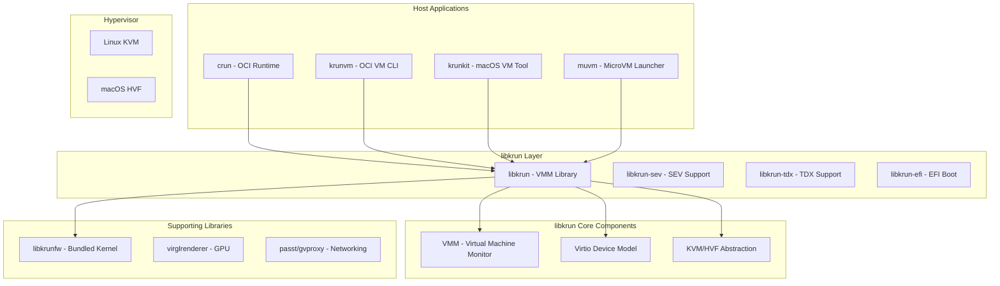

# Primary libkrun Ecosystem Exploration

## Overview

This exploration covers the primary libkrun ecosystem - a collection of projects centered around lightweight virtualization using KVM (Linux) and HVF (macOS). The ecosystem enables running container workloads in lightweight VMs with near-container startup times and VM-level isolation.

## Ecosystem Components



## Core Projects

### 1. libkrun (Core VMM Library)

**Location:** `src.containers/libkrun/`

**Purpose:** Dynamic library providing a simple C API for running processes in partially isolated KVM/HVF environments.

**Key Features:**
- Self-sufficient VMM (no external VMM dependency)
- Minimal footprint (RAM, CPU, boot time)
- Simple C API despite Rust implementation
- Multiple variants for different security levels

**Variants:**
| Variant | Library | Use Case |
|---------|---------|----------|
| Generic | libkrun.so | Standard KVM/HVF |
| SEV | libkrun-sev.so | AMD SEV/SEV-ES/SEV-SNP |
| TDX | libkrun-tdx.so | Intel TDX |
| EFI | libkrun-efi.so | macOS UEFI boot |

**Deep Dive:** [libkrun-deep-dive.md](libkrun-deep-dive.md)

### 2. libkrunfw (Firmware/Kernel Library)

**Location:** `src.containers/libkrunfw/`

**Purpose:** Bundles a Linux kernel into a dynamic library that libkrun can directly map into guest memory.

**Key Design:**
- Kernel configured with `CONFIG_NR_CPUS=8` (memory optimization)
- Zero-copy guest kernel loading
- Supports both Linux and macOS builds
- GPL-2.0 licensed (kernel), LGPL-2.1 (library code)

**Deep Dive:** [libkrunfw-deep-dive.md](libkrunfw-deep-dive.md)

### 3. krunvm (OCI MicroVM CLI)

**Location:** `src.containers/krunvm/`

**Purpose:** CLI utility for creating microVMs directly from OCI container images.

**Features:**
- Zero disk image maintenance
- Zero network configuration
- Fast boot times (~125ms)
- Volume mapping support
- Port exposure support

**Platforms:**
- Linux x86_64 (KVM)
- Linux AArch64 (KVM)
- macOS ARM64 (Hypervisor.framework)

**Deep Dive:** [krunvm-deep-dive.md](krunvm-deep-dive.md)

### 4. krunkit (macOS VM Tool)

**Location:** `src.containers/krunkit/`

**Purpose:** Launch configurable VMs on macOS using libkrun-efi.

**Key Features:**
- EFI boot with OVMF/EDK2
- GPU acceleration (Venus/Mesa3D, native context)
- virtio-fs volume sharing
- Port forwarding

**Use Cases:**
- GPU-accelerated VMs
- Running games requiring 4k pages on macOS
- Lightweight development environments

**Deep Dive:** [krunkit-deep-dive.md](krunkit-deep-dive.md)

### 5. crun (OCI Runtime)

**Location:** `src.containers/crun/`

**Purpose:** Lightweight OCI container runtime written in C with libkrun integration.

**Performance:**
- ~50% faster than runc (1.69s vs 3.34s for 100 containers)
- Lower memory footprint (512k vs 4M minimum)

**krun Mode:**
```bash
# Run container with VM isolation
crun --runtime=krun run my-container
```

**Deep Dive:** [crun-deep-dive.md](crun-deep-dive.md)

## Supporting Projects

### Networking

| Project | Location | Purpose |
|---------|----------|---------|
| passt | External | User-space NAT networking |
| gvproxy | `gvisor-tap-vsock/` | gVisor tap+vsock proxy |
| netavark | `src.containers/netavark/` | Container network stack |

### Storage

| Project | Location | Purpose |
|---------|----------|---------|
| buildah | `src.containers/buildah/` | OCI image builder |
| composefs | `composefs-rs/` | Verifiable filesystem |
| fuse-overlayfs | `src.containers/fuse-overlayfs/` | FUSE overlay filesystem |

### VMM Ecosystem

| Project | Location | Purpose |
|---------|----------|---------|
| Firecracker | `src.containers/firecracker/` | AWS microVMM |
| Cloud Hypervisor | `src.containers/cloud-hypervisor/` | Rust VMM for cloud |
| rust-vmm | `src.rust-vmm/` | Rust VMM crates |

## Architecture Deep Dive

### Boot Flow

```
1. Application (crun/krunvm) creates libkrun context
2. libkrun initializes VMM components
3. libkrunfw.so is loaded (kernel mapped into memory)
4. Guest memory is allocated and kernel injected
5. virtio devices are initialized
6. vCPU starts execution at kernel entry point
7. Kernel boots with init process
8. Application binary executes in guest
```

### Memory Layout

```
Guest Physical Memory:
0x00000000 - 0x0009FFFF  | Real Mode / BIOS
0x000A0000 - 0x000FFFFF | Reserved (VGA, etc.)
0x00100000 - 0xXXXXXXXX | Kernel (from libkrunfw)
0xXXXXXXXX - 0xFFFFFFFF | RAM for guest
```

### Device Model

libkrun implements minimal virtio devices:

| Device | Purpose | Variants |
|--------|---------|----------|
| virtio-block | Block storage | All |
| virtio-fs | Filesystem sharing | All |
| virtio-net | Network interfaces | All |
| virtio-vsock | VM-host sockets + TSI | All |
| virtio-console | Serial console I/O | All |
| virtio-gpu | Graphics acceleration | GPU builds |
| virtio-snd | Audio | SND builds |
| virtio-balloon | Memory management | All |
| virtio-rng | Random numbers | All |

## Security Model

### Core Principle

**Guest and VMM share the same security context.**

### Recommendations

1. **Run VMM in isolated context:**
   - Use namespaces on Linux
   - Apply UID/GID restrictions

2. **Device-Specific Mitigations:**

| Device | Concern | Mitigation |
|--------|---------|------------|
| virtio-fs | No filesystem isolation | Use mount namespaces |
| virtio-vsock+TSI | Full network proxy | Apply network policies |
| virtio-block | Raw file access | Restrict file permissions |

3. **Confidential Computing:**
   - Use libkrun-sev for AMD SEV
   - Use libkrun-tdx for Intel TDX

## Build System

### Linux Build (libkrun)

```bash
# Dependencies
# - libkrunfw (provides libkrunfw.so)
# - Rust toolchain
# - glibc-static
# - patchelf

# Build with features
make BLK=1 NET=1 SND=1 GPU=1
sudo make install
```

### Feature Flags

| Flag | Feature | Dependencies |
|------|---------|--------------|
| `BLK=1` | virtio-block | - |
| `NET=1` | virtio-net | - |
| `SND=1` | virtio-snd | - |
| `GPU=1` | virtio-gpu | virglrenderer-devel |
| `SEV=1` | AMD SEV | openssl-devel |
| `TDX=1` | Intel TDX | openssl-devel |
| `EFI=1` | EFI boot | macOS only |

## Networking Architecture

libkrun provides two mutually exclusive networking approaches:

### 1. virtio-vsock + TSI (Transparent Socket Impersonation)

Novel technique allowing VM network connectivity without a virtual interface.

**How it works:**
- VMM acts as proxy for AF_INET, AF_INET6, AF_UNIX sockets
- Supports both outgoing and incoming connections
- Automatically enabled when no virtio-net is configured

**Limitations:**
- Requires custom kernel (libkrunfw)
- Limited to SOCK_DGRAM and SOCK_STREAM
- No guest listening on SOCK_DGRAM

### 2. virtio-net + Userspace Proxy

Traditional virtual NIC with userspace networking proxy.

**Backends:**
- **passt**: User-space NAT with port forwarding
- **gvproxy**: gvisor-tap-vsock for advanced networking
- **tap**: Direct tap device (Linux)

## Use Cases

### 1. Container Isolation (crun)

Adding VM-based isolation to container workloads:

```bash
podman run --runtime /usr/bin/crun:krun my-image
```

### 2. GPU-Accelerated VMs (krunkit/muvm)

Running games or GPU workloads:

```bash
krunkit run \
    --firmware OVMF.fd \
    --disk ubuntu.raw \
    --gpu \
    --gpu-flags native-context
```

### 3. OCI-based MicroVMs (krunvm)

Development environments from container images:

```bash
krunvm run ubuntu:22.04 \
    --cpus 4 \
    --memory 4096 \
    -v ~/code:/code \
    -p 3000:3000
```

### 4. Serverless Workloads

Fast startup for function-as-a-service:
- Multi-tenant isolation
- Sub-second cold starts

### 5. Confidential Computing

Using SEV/TDX variants for memory encryption:
- Protected workloads
- Cloud security

## Related Ecosystem

### Firecracker

AWS's microVMM for serverless:
- 4000+ microVMs per host capability
- Rust-based, seccomp-hardened
- Location: `src.containers/firecracker/`

### Cloud Hypervisor

Rust-based VMM for cloud workloads:
- KVM and MSHV (Windows) support
- x86-64, AArch64, RISC-V 64
- Location: `src.containers/cloud-hypervisor/`

### rust-vmm

Foundational Rust VMM crates:
- Shared by Firecracker, Cloud Hypervisor, libkrun
- Modular components: vm-memory, vhost, virtio
- Location: `src.rust-vmm/`

### Weave Ignite

Firecracker with Docker-like UX:
- GitOps management
- OCI image-based VMs
- Location: `src.weave-ignite/`

## Key Design Decisions

1. **Embedded Kernel:** libkrunfw bundles kernel as library for zero-copy guest loading

2. **TSI Networking:** Novel socket proxying avoids virtual NIC complexity

3. **C API:** Rust implementation with C ABI for broad language interoperability

4. **Multiple Variants:** Separate libraries for SEV/TDX/EFI to minimize dependencies

5. **Minimal Device Emulation:** Only essential virtio devices for target workloads

6. **Shared Security Context:** Guest and VMM share context - isolation via namespaces

## Rust Development

For Rust developers, the ecosystem provides:

- **libkrun-sys:** FFI bindings for libkrun C API
- **Rust Implementation:** Core VMM written in Rust
- **rust-vmm Crates:** Reusable VMM components

**Getting Started:**
- See [rust-libkrun-guide.md](rust-libkrun-guide.md) for basic integration
- See [rust-container-vm-builder.md](rust-container-vm-builder.md) for comprehensive guide

## References

- [libkrun GitHub](https://github.com/containers/libkrun)
- [libkrun Matrix Channel](https://matrix.to/#/#libkrun:matrix.org)
- [OCI Runtime Specification](https://github.com/opencontainers/runtime-spec)
- [OCI Image Specification](https://github.com/opencontainers/image-spec)
