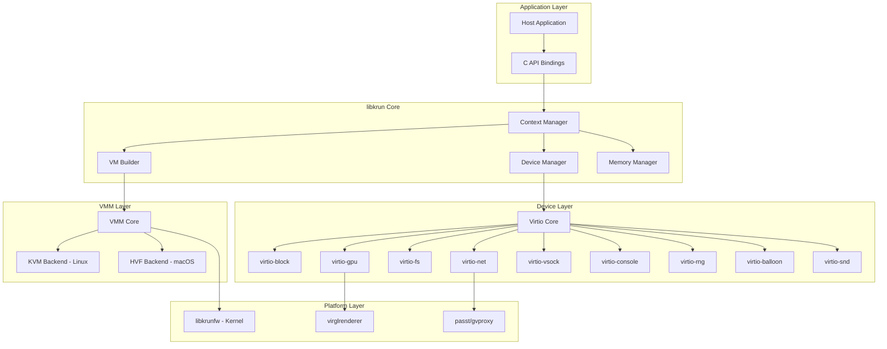
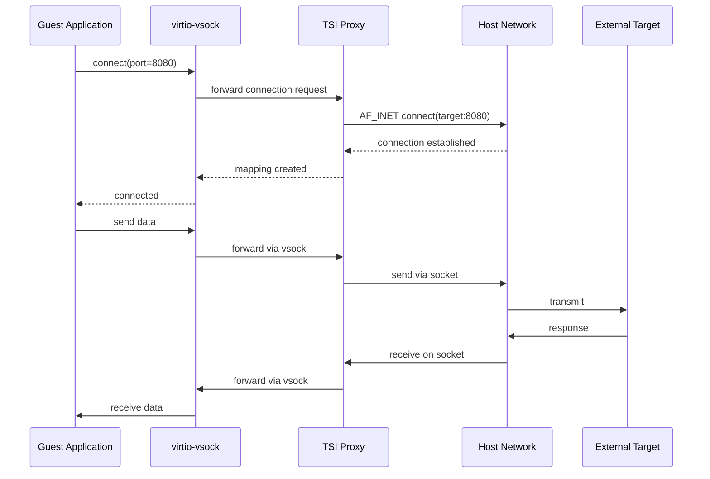

# libkrun Primary Architecture Deep Dive

## Overview

libkrun is a self-sufficient Virtual Machine Monitor (VMM) library that provides a simple C API for running processes in partially isolated KVM (Linux) or HVF (macOS) environments. Unlike traditional VMMs, libkrun is designed to be embedded into other applications rather than run as a standalone process.

## Core Architecture



## Memory Model

```
┌─────────────────────────────────────────────────────────────┐
│                    Guest Physical Memory                     │
│  ┌─────────────┬─────────────┬─────────────┬─────────────┐  │
│  │   Kernel    │   Initramfs │    Rootfs   │   Device    │  │
│  │  (libkrunfw)│   (cpio)    │   (ext4)    │    MMIO     │  │
│  │  0x000000   │  0x0100000  │  0x0200000  │  0xF000000  │  │
│  └─────────────┴─────────────┴─────────────┴─────────────┘  │
└─────────────────────────────────────────────────────────────┘
                            │
                            │ mmap() / guest_mem
                            ▼
┌─────────────────────────────────────────────────────────────┐
│                    Host Virtual Memory                       │
│  ┌─────────────────────────────────────────────────────────┐│
│  │              libkrunfw.so (mapped kernel)               ││
│  └─────────────────────────────────────────────────────────┘│
│  ┌─────────────────────────────────────────────────────────┐│
│  │              Disk image (mapped on-demand)              ││
│  └─────────────────────────────────────────────────────────┘│
└─────────────────────────────────────────────────────────────┘
```

## Context Lifecycle

```rust
// Simplified context lifecycle
pub struct KrunContext {
    ctx_id: u32,
    state: ContextState,

    // VM Configuration
    num_vcpus: u8,
    ram_size: u32,  // in MiB

    // Boot Configuration
    kernel: Option<KernelConfig>,
    initramfs: Option<InitramfsConfig>,
    cmdline: String,

    // Devices
    devices: Vec<VirtioDevice>,

    // Execution
    exec_path: String,
    argv: Vec<String>,
    envp: Vec<String>,
}

enum ContextState {
    Created,
    Configured,
    Running,
    Exited,
}
```

## Device Model

### virtio-vsock and TSI (Transparent Socket Impersonation)

The most innovative feature of libkrun is TSI - a novel networking approach:



### TSI Port Mapping

```rust
pub struct TsiMapping {
    guest_port: u16,
    host_port: u16,
    protocol: TsiProtocol,
}

pub enum TsiProtocol {
    Tcp,
    Udp,
    Unix,
}

// Port mappings are configured at VM creation:
// krun_add_net_unixstream() with port mapping struct
```

## KVM vs HVF Backends

### Linux KVM Backend

```rust
// Simplified KVM backend structure
pub struct KvmBackend {
    kvm_fd: RawFd,      // /dev/kvm file descriptor
    vm_fd: RawFd,       // VM file descriptor
    vcpus: Vec<VcpuFd>, // Per-vCPU file descriptors

    // Memory slots
    mem_slots: Vec<MemorySlot>,

    // IRQ routing
    irq_routing: IrqRouteTable,
}

impl KvmBackend {
    pub fn create_vm(&mut self, ram_size: u32) -> Result<()> {
        // Create VM via KVM_CREATE_VM ioctl
        self.vm_fd = ioctl(self.kvm_fd, KVM_CREATE_VM)?;

        // Create memory slot for RAM
        self.setup_memory(ram_size)?;

        // Setup IRQ routing
        self.setup_irq_routing()?;

        Ok(())
    }

    pub fn create_vcpu(&mut self, cpu_id: u8) -> Result<()> {
        let vcpu_fd = ioctl(self.vm_fd, KVM_CREATE_VCPU, cpu_id)?;

        // Setup vCPU registers
        self.setup_vcpu_registers(&vcpu_fd)?;

        self.vcpus.push(VcpuFd { fd: vcpu_fd });

        Ok(())
    }
}
```

### macOS HVF Backend

```rust
// Simplified HVF backend structure
pub struct HvfBackend {
    hvf_fd: RawFd,      // HVF context
    vm_fd: RawFd,       // VM file descriptor
    vcpus: Vec<HvfVcpu>,

    // Memory regions
    mem_regions: Vec<HvfMemoryRegion>,

    // Exit handling
    exit_handler: Box<dyn ExitHandler>,
}

impl HvfBackend {
    pub fn run_vcpu(&mut self, cpu_id: u8) -> Result<()> {
        loop {
            // Run vCPU until exit
            let exit = hvf_run_vcpu(self.vcpus[cpu_id].fd)?;

            // Handle VM exit
            match exit.reason {
                HvfExitReason::MmioRead(addr, size) => {
                    self.handle_mmio_read(addr, size)?;
                }
                HvfExitReason::MmioWrite(addr, size, data) => {
                    self.handle_mmio_write(addr, size, data)?;
                }
                HvfExitReason::IoRead(port, size) => {
                    self.handle_io_read(port, size)?;
                }
                HvfExitReason::IoWrite(port, size, data) => {
                    self.handle_io_write(port, size, data)?;
                }
                HvfExitReason::Hlt => {
                    // HLT instruction - halt vCPU
                    break;
                }
                _ => {}
            }
        }

        Ok(())
    }
}
```

## Variant Architecture

### libkrun-sev (AMD SEV)

```
┌─────────────────────────────────────────────────────────────┐
│                    SEV Encrypted VM                          │
│  ┌─────────────────────────────────────────────────────────┐│
│  │              Guest Memory (Encrypted)                   ││
│  │  ┌─────────┐  ┌─────────┐  ┌─────────────────────────┐ ││
│  │  │ Kernel  │  │ Initrd  │  │ Application Workload    │ ││
│  │  └─────────┘  └─────────┘  └─────────────────────────┘ ││
│  └─────────────────────────────────────────────────────────┘│
│                           │                                   │
│                    SEV Encryption                             │
│                    (AES-XTS 128)                              │
└───────────────────────────┼───────────────────────────────────┘
                            │
                            ▼
┌─────────────────────────────────────────────────────────────┐
│                    AMD SEV Firmware                          │
│  ┌─────────────────────────────────────────────────────────┐│
│  │              Platform Security Processor                ││
│  │  ┌─────────────┐  ┌─────────────┐  ┌─────────────────┐ ││
│  │  │ Key Derive  │  │ Encryption  │  │ Attestation     │ ││
│  │  └─────────────┘  └─────────────┘  └─────────────────┘ ││
│  └─────────────────────────────────────────────────────────┘│
└─────────────────────────────────────────────────────────────┘
```

### libkrun-tdx (Intel TDX)

```
┌─────────────────────────────────────────────────────────────┐
│                    TDX Private VM                            │
│  ┌─────────────────────────────────────────────────────────┐│
│  │              Private Memory (Encrypted)                 ││
│  │  ┌─────────┐  ┌─────────┐  ┌─────────────────────────┐ ││
│  │  │ Kernel  │  │ Initrd  │  │ Application Workload    │ ││
│  │  └─────────┘  └─────────┘  └─────────────────────────┘ ││
│  └─────────────────────────────────────────────────────────┘│
│                           │                                   │
│                   TDX Encryption                              │
│                   (AES-XTS 256)                               │
└───────────────────────────┼───────────────────────────────────┘
                            │
                            ▼
┌─────────────────────────────────────────────────────────────┐
│                    Intel TDX Module                          │
│  ┌─────────────────────────────────────────────────────────┐│
│  │              Trust Domain Protection                    ││
│  │  ┌─────────────┐  ┌─────────────┐  ┌─────────────────┐ ││
│  │  │ Key Mgmt    │  │ EPT Violation│  │ Attestation     │ ││
│  │  │             │  │ Handling     │  │                 │ ││
│  │  └─────────────┘  └─────────────┘  └─────────────────┘ ││
│  └─────────────────────────────────────────────────────────┘│
└─────────────────────────────────────────────────────────────┘
```

### libkrun-efi (macOS EFI Boot)

```
┌─────────────────────────────────────────────────────────────┐
│                    macOS HVF + EFI                           │
│  ┌─────────────────────────────────────────────────────────┐│
│  │              OVMF (Open Virtual Firmware)               ││
│  │  ┌─────────────┐  ┌─────────────┐  ┌─────────────────┐ ││
│  │  │ SEC Phase   │  │ PEI Phase   │  │ DXE Phase       │ ││
│  │  └─────────────┘  └─────────────┘  └─────────────────┘ ││
│  └─────────────────────────────────────────────────────────┘│
│  ┌─────────────────────────────────────────────────────────┐│
│  │              Linux Kernel (EFI Stub)                    ││
│  └─────────────────────────────────────────────────────────┘│
│  ┌─────────────────────────────────────────────────────────┐│
│  │              Initramfs + Rootfs                         ││
│  └─────────────────────────────────────────────────────────┘│
└─────────────────────────────────────────────────────────────┘
```

## API Reference

### Context Management

```c
// Create a new KVM context
// Returns: context ID on success, negative on error
int32_t krun_create_ctx(void);

// Free a KVM context
// Returns: 0 on success, negative on error
int32_t krun_free_ctx(uint32_t ctx_id);
```

### VM Configuration

```c
// Set VM configuration
// ctx_id: context ID
// num_vcpus: number of virtual CPUs
// ram_mib: RAM size in MiB
int32_t krun_set_vm_config(uint32_t ctx_id, uint8_t num_vcpus, uint32_t ram_mib);

// Set root filesystem path
// root_path: path to rootfs directory or disk image
int32_t krun_set_root(uint32_t ctx_id, const char *root_path);

// Add additional disk
// block_id: identifier for the disk
// disk_path: path to disk image
// read_only: whether disk is read-only
int32_t krun_add_disk(uint32_t ctx_id, const char *block_id,
                      const char *disk_path, bool read_only);
```

### Execution

```c
// Set executable and arguments
int32_t krun_set_exec(uint32_t ctx_id, const char *exec_path,
                      const char *const argv[], const char *const envp[]);

// Enter VM and start execution
// Blocks until VM exits
int32_t krun_start_enter(uint32_t ctx_id);
```

### Device Configuration

```c
// Add virtio-fs shared directory
int32_t krun_add_virtiofs(uint32_t ctx_id, const char *tag, const char *path);

// Set GPU options for virglrenderer
int32_t krun_set_gpu_options(uint32_t ctx_id, uint32_t virgl_flags);

// Add console device
int32_t krun_add_virtio_console_default(uint32_t ctx_id, ...);

// Add network via passt
int32_t krun_add_net_unixstream(uint32_t ctx_id, int sock_fd, int net_fd);

// Add network via gvproxy
int32_t krun_add_net_unixgram(uint32_t ctx_id, int sock_fd, int net_fd);
```

## Performance Characteristics

### Boot Time Breakdown

```
┌─────────────────────────────────────────────────────────────┐
│                    Boot Time (typical)                       │
├─────────────────────────────────────────────────────────────┤
│  libkrun initialization:        ~10ms                       │
│  Kernel decompression:          ~50ms                       │
│  Kernel initialization:         ~100ms                      │
│  Initramfs loading:             ~20ms                       │
│  Userspace init:                ~50ms                       │
├─────────────────────────────────────────────────────────────┤
│  Total to userspace:            ~230ms                      │
│  (vs ~2-5s for traditional VM)                              │
└─────────────────────────────────────────────────────────────┘
```

### Memory Footprint

```
┌─────────────────────────────────────────────────────────────┐
│                    Memory Usage                              │
├─────────────────────────────────────────────────────────────┤
│  VMM overhead:                  ~20MB                       │
│  Kernel (libkrunfw):            ~8MB                        │
│  Guest OS minimum:              ~50MB                       │
│  Application dependent:         variable                    │
├─────────────────────────────────────────────────────────────┤
│  Minimum viable VM:             ~80MB                       │
│  (vs ~128MB+ for traditional VM)                            │
└─────────────────────────────────────────────────────────────┘
```

## Security Considerations

### Attack Surface

```
┌─────────────────────────────────────────────────────────────┐
│                    Security Boundaries                       │
├─────────────────────────────────────────────────────────────┤
│  Host Application │ libkrun │ Guest                         │
│  ─────────────────┼─────────┼─────                          │
│                   │         │                               │
│  Same security    │  TSI    │  No network isolation         │
│  context          │  proxy  │  by default                   │
│                   │         │                               │
├─────────────────────────────────────────────────────────────┤
│  Recommendations:                                             │
│  - Run VMM in isolated namespace (Linux)                     │
│  - Apply network restrictions to VMM                         │
│  - Use mount point isolation with virtio-fs                  │
│  - Apply resource limits to VMM process                      │
└─────────────────────────────────────────────────────────────┘
```

### Device Security Matrix

| Device | Risk Level | Mitigation |
|--------|------------|------------|
| virtio-fs | High | Use mount namespaces, restrict paths |
| virtio-vsock+TSI | Medium | Apply network policies to VMM |
| virtio-block | Medium | Restrict file permissions |
| virtio-net | Low | Use passt (user-mode networking) |
| virtio-gpu | Low | virglrenderer sandboxing |

## Integration Patterns

### Embedded in Container Runtime (crun)

```c
// crun's libkrun integration pattern
static int libkrun_create_container(libcrun_container_t *container,
                                    libcrun_error_t *err)
{
    // Create libkrun context
    int32_t ctx = krun_create_ctx();

    // Configure VM based on container spec
    krun_set_vm_config(ctx, container->container_def->process->user->uid,
                       container->container_def->linux->resources->memory->limit);

    // Set rootfs from OCI bundle
    krun_set_root(ctx, container->container_def->root->path);

    // Set command from OCI spec
    krun_set_exec(ctx,
                  container->container_def->process->args[0],
                  container->container_def->process->args,
                  container->container_def->process->env);

    // Start VM (blocks until exit)
    return krun_start_enter(ctx);
}
```

### Standalone CLI (krunvm)

```rust
// krunvm's main execution flow
fn main() -> Result<()> {
    let matches = cli().get_matches();

    // Parse OCI image reference
    let image_ref = matches.get_one::<String>("image").unwrap();

    // Pull and extract image layers
    let rootfs = pull_oci_image(image_ref)?;

    // Create libkrun context
    let ctx = KrunContext::create()?;

    // Configure VM
    ctx.set_vm_config(2, 1024)?;  // 2 vCPUs, 1GiB
    ctx.set_root(&rootfs)?;

    // Set command
    ctx.set_exec("/bin/sh", &[], &[])?;

    // Run VM
    ctx.enter()?;

    Ok(())
}
```

## References

- [libkrun GitHub Repository](https://github.com/containers/libkrun)
- [libkrun API Header](../../src.containers/libkrun/include/libkrun.h)
- [KVM Documentation](https://www.kernel.org/doc/html/latest/virt/kvm/api.html)
- [HVF Documentation](https://developer.apple.com/documentation/hypervisor)
