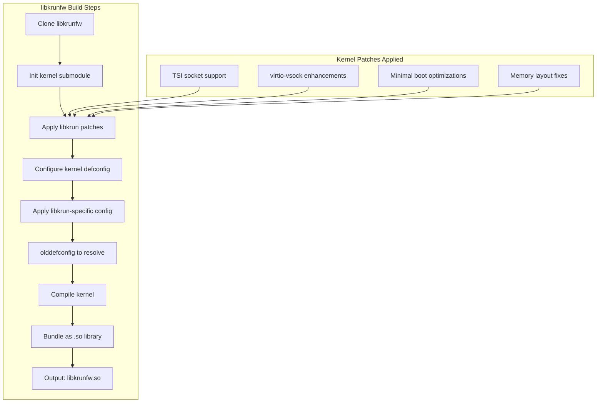
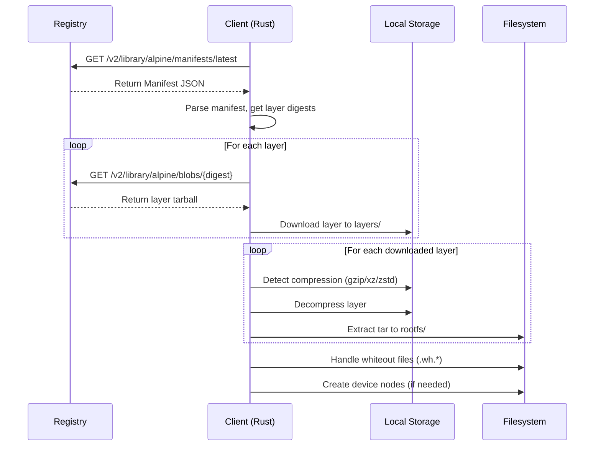

# libkrun: Root Filesystem and Kernel Creation

A comprehensive exploration of creating root filesystems and kernels for libkrun-based microVMs.

## Overview

Building a bootable libkrun VM requires three core components:

```
┌─────────────────────────────────────────────────────────────┐
│                    Boot Components Stack                     │
├─────────────────────────────────────────────────────────────┤
│                                                              │
│  ┌────────────────────────────────────────────────────────┐ │
│  │  1. KERNEL (libkrunfw)                                 │ │
│  │     • Bundled Linux kernel as dynamic library          │ │
│  │     • CONFIG_NR_CPUS=8 for memory optimization         │ │
│  │     •virtio drivers built-in                            │ │
│  │     • TSI networking support                           │ │
│  └────────────────────────────────────────────────────────┘ │
│                              │                                │
│                              ▼                                │
│  ┌────────────────────────────────────────────────────────┐ │
│  │  2. INITRAMFS (Optional)                               │ │
│  │     • Early userspace initramfs                        │ │
│  │     • Contains init process                            │ │
│  │     • Handles rootfs switch for complex boots          │ │
│  └────────────────────────────────────────────────────────┘ │
│                              │                                │
│                              ▼                                │
│  ┌────────────────────────────────────────────────────────┐ │
│  │  3. ROOT FILESYSTEM                                    │ │
│  │     • From OCI image layers (most common)              │ │
│  │     • Custom-built minimal rootfs                      │ │
│  │     • ext4 disk image or virtio-fs directory           │ │
│  └────────────────────────────────────────────────────────┘ │
│                                                              │
└─────────────────────────────────────────────────────────────┘
```

## Part 1: Kernel Building with libkrunfw

### What is libkrunfw?

libkrunfw is a companion library that bundles a Linux kernel into a dynamically loadable library. Instead of loading a kernel binary from disk, libkrun can directly map libkrunfw.so into guest memory.

```
┌─────────────────────────────────────────────────────────────┐
│                    libkrunfw Architecture                    │
├─────────────────────────────────────────────────────────────┤
│                                                              │
│  Source: containers/libkrunfw                                │
│                                                              │
│  ┌─────────────────┐    ┌─────────────────────────────────┐ │
│  │  Linux Kernel   │    │  libkrunfw Build System         │ │
│  │  (vanilla +     │    │  • Bundles kernel as .so        │ │
│  │   patches)      │    │  • Handles architecture diff    │ │
│  │                 │    │  • SEV/TDX variants             │ │
│  │  Patches:       │    │                                 │ │
│  │  • TSI support  │    │  Output:                        │ │
│  │  • virtio opts  │    │  • libkrunfw.so (generic)       │ │
│  │  • minimal config│   │  • libkrunfw-sev.so             │ │
│  └─────────────────┘    │  • libkrunfw-tdx.so             │ │
│                         │  • libkrunfw-efi.so (macOS)     │ │
│                         └─────────────────────────────────┘ │
│                                                              │
└─────────────────────────────────────────────────────────────┘
```

### libkrunfw Kernel Configuration

The kernel is configured with specific options for libkrun use cases:

```kconfig
# Essential libkrunfw options
CONFIG_NR_CPUS=8                    # Memory optimization
CONFIG_NO_HZ_IDLE=y                 # Power saving
CONFIG_HIGH_RES_TIMERS=y            # Timer precision

# Virtio drivers (built-in, not modules)
CONFIG_VIRTIO=y
CONFIG_VIRTIO_PCI=y
CONFIG_VIRTIO_BLK=y
CONFIG_VIRTIO_NET=y
CONFIG_VIRTIO_FS=y
CONFIG_VIRTIO_CONSOLE=y
CONFIG_VIRTIO_BALLOON=y
CONFIG_VIRTIO_RNG=y
CONFIG_VIRTIO_VSOCK=y

# Filesystem support
CONFIG_9P_FS=y
CONFIG_NET_9P=y
CONFIG_NET_9P_VIRTIO=y
CONFIG_EXT4_FS=y
CONFIG_TMPFS=y
CONFIG_PROC_FS=y
CONFIG_SYSFS=y

# Security
CONFIG_SECURITY=y
CONFIG_SECURITY_SELINUX=y
CONFIG_SECCOMP=y

# Architecture-specific (x86_64)
CONFIG_X86_LOCAL_APIC=y
CONFIG_X86_IO_APIC=y
CONFIG_PCI_MSI=y
CONFIG_HYPERVISOR_GUEST=y
CONFIG_PARAVIRT=y

# TSI Networking (custom patches)
CONFIG_VIRTIO_VSOCKETS=y
CONFIG_VIRTIO_VSOCKETS_TSI=y  # libkrun-specific
```

### Building libkrunfw

```bash
# Clone the repository
git clone https://github.com/containers/libkrunfw
cd libkrunfw

# Initialize submodules (includes Linux kernel source)
git submodule update --init

# Generic build (x86_64)
make

# SEV variant (AMD SEV encryption)
make SEV=1

# TDX variant (Intel TDX encryption)
make TDX=1

# Install
sudo make install
```

### libkrunfw Build Process



### Building Custom Kernel (Without libkrunfw)

For advanced use cases, you may want to build a standalone kernel:

```bash
# Download kernel source
wget https://cdn.kernel.org/pub/linux/kernel/v6.x/linux-6.6.tar.xz
tar -xf linux-6.6.tar.xz
cd linux-6.6

# Apply libkrun patches (if needed for TSI)
git apply /path/to/libkrun-patches/tsi-support.patch

# Configure kernel
make defconfig

# Apply libkrun-specific options
scripts/config --file .config \
    --set-str CONFIG_NR_CPUS 8 \
    --enable CONFIG_VIRTIO \
    --enable CONFIG_VIRTIO_PCI \
    --enable CONFIG_VIRTIO_BLK \
    --enable CONFIG_VIRTIO_NET \
    --enable CONFIG_VIRTIO_FS \
    --enable CONFIG_VIRTIO_CONSOLE \
    --enable CONFIG_VIRTIO_VSOCKETS \
    --enable CONFIG_9P_FS \
    --enable CONFIG_NET_9P \
    --enable CONFIG_NET_9P_VIRTIO

# Resolve conflicts
make olddefconfig

# Build kernel
make -j$(nproc)

# Output: arch/x86/boot/bzImage
```

### Kernel Boot Parameters

libkrun passes specific boot parameters to the kernel:

```
console=hvc0                    # virtio-console for output
earlyprintk=console             # Early boot messages
random.trust_cpu=on             # Use CPU RNG
pci=off                         # No PCI enumeration (optional)
```

Custom parameters can be added via the kernel command line.

## Part 2: Root Filesystem Creation

### Approach 1: OCI Image-Based RootFS (Recommended)

The most common and practical approach is extracting the rootfs from OCI container images.

#### OCI Image Structure

```
OCI Image (e.g., alpine:latest)
│
├── Manifest (JSON)
│   ├── schemaVersion
│   ├── mediaType
│   ├── config (reference to config blob)
│   └── layers [array of layer descriptors]
│
├── Config (JSON)
│   ├── architecture
│   ├── os
│   ├── config:
│   │   ├── Env [...]
│   │   ├── Cmd [...]
│   │   └── Entrypoint [...]
│   └── rootfs:
│       └── diff_ids [...]
│
└── Layers [tarballs]
    ├── layer1.tar.gz (base system)
    ├── layer2.tar.gz (additional packages)
    └── layer3.tar.gz (application)
```

#### OCI Image Extraction Process



#### Layer Extraction Code Example

```rust
use std::fs::File;
use std::io::{Read, Write};
use flate2::read::GzDecoder;
use tar::Archive;

fn extract_oci_layer(
    layer_data: &[u8],
    rootfs_dir: &Path,
) -> io::Result<()> {
    // Detect compression from magic bytes
    let decoder: Box<dyn Read> = match layer_data.get(0..6) {
        Some([0x1f, 0x8b, _, _, _, _]) => {
            // Gzip
            Box::new(GzDecoder::new(layer_data))
        }
        Some([0xfd, 0x37, 0x7a, 0x58, 0x5a, 0x00]) => {
            // XZ
            Box::new(xz2::read::XzDecoder::new(layer_data))
        }
        Some([0x28, 0xb5, 0x2f, 0xfd, _, _]) => {
            // Zstd
            Box::new(zstd::stream::read::Decoder::new(layer_data)?)
        }
        _ => Box::new(layer_data),  // Uncompressed
    };

    let mut archive = Archive::new(decoder);

    for entry_result in archive.entries()? {
        let mut entry = entry_result?;
        let path = entry.path()?.to_path_buf();
        let entry_type = entry.header().entry_type();

        let target_path = rootfs_dir.join(path.strip_prefix("/").unwrap_or(&path));

        match entry_type {
            tar::EntryType::Regular => {
                if let Some(parent) = target_path.parent() {
                    std::fs::create_dir_all(parent)?;
                }
                let mut file = File::create(&target_path)?;
                std::io::copy(&mut entry, &mut file)?;
            }
            tar::EntryType::Directory => {
                std::fs::create_dir_all(&target_path)?;
            }
            tar::EntryType::Symlink => {
                if let Ok(link_name) = entry.link_name() {
                    std::os::unix::fs::symlink(link_name, &target_path)?;
                }
            }
            tar::EntryType::Link => {
                if let Ok(link_name) = entry.link_name() {
                    let link_target = rootfs_dir.join(link_name);
                    std::os::unix::fs::hard_link(link_target, &target_path)?;
                }
            }
            // Skip device nodes, FIFOs for most use cases
            _ => {}
        }
    }

    Ok(())
}
```

#### Handling OCI Whiteout Files

OCI images use special files to mark deletions:

```rust
fn handle_whiteout(entry_path: &Path, rootfs_dir: &Path) -> io::Result<()> {
    let file_name = entry_path.file_name().unwrap();
    let file_name_str = file_name.to_string_lossy();

    if file_name_str.starts_with(".wh.") {
        // Whiteout file - remove the corresponding file
        let target_name = file_name_str.strip_prefix(".wh.").unwrap();
        let target_path = entry_path.parent().unwrap().join(target_name);

        if target_path.exists() {
            if target_path.is_dir() {
                std::fs::remove_dir_all(&target_path)?;
            } else {
                std::fs::remove_file(&target_path)?;
            }
        }

        // Also handle opaque whiteouts (.wh..opq)
        if target_name == ".opq" {
            // Remove all contents of the directory
            let dir_path = entry_path.parent().unwrap().parent().unwrap();
            for entry in std::fs::read_dir(dir_path)? {
                let entry = entry?;
                let path = entry.path();
                if path.is_dir() {
                    std::fs::remove_dir_all(path)?;
                } else {
                    std::fs::remove_file(path)?;
                }
            }
        }
    }

    Ok(())
}
```

### Approach 2: Minimal Custom RootFS

For specialized use cases, build a minimal rootfs from scratch.

#### Minimal RootFS Structure

```
minimal_rootfs/
├── bin/
│   ├── busybox -> symlink to busybox binary
│   ├── sh -> symlink to busybox
│   ├── ls -> symlink to busybox
│   ├── cat -> symlink to busybox
│   └── ... (other applets)
├── sbin/
│   ├── init -> symlink to busybox
│   └── halt -> symlink to busybox
├── lib/
│   └── (shared libraries if needed)
├── lib64/
│   └── ld-linux-x86-64.so.2 (if using glibc)
├── etc/
│   ├── profile (environment setup)
│   └── init.d/
│       └── rcS (boot script)
├── proc/ (empty, mounted at boot)
├── sys/ (empty, mounted at boot)
├── dev/ (empty, populated by devtmpfs)
├── run/ (empty, tmpfs mount point)
├── tmp/ (empty)
├── var/
│   ├── log/
│   └── run/
├── home/
├── root/
└── init (main init script)
```

#### Init Script for Minimal RootFS

```sh
#!/bin/sh
# /init - Main init script for minimal rootfs

# Mount essential filesystems
mount -t proc proc /proc -o nosuid,nodev,noexec
mount -t sysfs sysfs /sys -o nosuid,nodev,noexec
mount -t devtmpfs devtmpfs /dev -o nosuid
mount -t tmpfs tmpfs /run -o nosuid,nodev,mode=755

# Set hostname
hostname libkrun-vm

# Set up loopback interface (if networking)
ip link set lo up

# Load console for output
setsid cttyhack setuidgid 1000 sh </dev/console >/dev/console 2>&1 || \
    exec /bin/sh </dev/console >/dev/console 2>&1

# Fallback
exec /bin/sh
```

#### /etc/profile

```sh
export PATH=/usr/local/sbin:/usr/local/bin:/usr/sbin:/usr/bin:/sbin:/bin
export HOME=/root
export TERM=xterm
export PS1='\u@\h:\w\$ '
```

### Approach 3: Buildroot for Custom RootFS

Buildroot provides a more complete solution for custom rootfs:

```bash
# Clone buildroot
git clone https://github.com/buildroot/buildroot
cd buildroot

# Configure for minimal VM
make menuconfig

# Key settings:
# Target options:
#   Target Architecture -> x86_64
#   Target Build Variant -> musl (for smaller size)
#
# System configuration:
#   Root filesystem type -> ext4
#   Root filesystem size -> 64 MB
#   Run a getty (login prompt) after boot -> unchecked
#
# Target packages:
#   Select busybox
#   Select any additional tools needed

# Build
make

# Output: output/images/rootfs.ext4
```

## Part 3: Initramfs Generation

### What is Initramfs?

Initramfs is an early userspace that boots before the real rootfs. It's used for:

1. Loading drivers needed for the real rootfs
2. Handling encrypted rootfs
3. Complex boot scenarios

### Creating Initramfs from Directory

```bash
# Using find + cpio + gzip (most compatible)
cd /path/to/rootfs
find . -print0 | cpio --null -o --format=newc | gzip -9 > ../initramfs.cpio.gz

# Using mkinitcpio (Arch Linux)
mkinitcpio -c /path/to/mkinitcpio.conf -k /path/to/vmlinuz -g ../initramfs.img

# Using dracut (RHEL/Fedora)
dracut --force ../initramfs.img $(uname -r)
```

### Minimal Initramfs with Just Init

```rust
use std::fs::{self, File};
use std::io::Write;
use std::process::Command;

fn create_minimal_initramfs(output_path: &Path) -> io::Result<()> {
    // Create temporary directory
    let temp_dir = std::env::temp_dir().join("minimal-initramfs");
    fs::create_dir_all(&temp_dir)?;

    // Create directory structure
    let dirs = ["bin", "proc", "sys", "dev", "etc", "root"];
    for dir in dirs {
        fs::create_dir_all(temp_dir.join(dir))?;
    }

    // Create init script
    let init_path = temp_dir.join("init");
    let mut file = File::create(&init_path)?;

    writeln!(file, "#!/bin/sh")?;
    writeln!(file, "mount -t proc proc /proc")?;
    writeln!(file, "mount -t sysfs sysfs /sys")?;
    writeln!(file, "mount -t devtmpfs devtmpfs /dev")?;
    writeln!(file, "exec /bin/sh")?;

    fs::set_permissions(&init_path, fs::Permissions::from_mode(0o755))?;

    // Copy busybox if available
    if let Ok(output) = Command::new("which").arg("busybox").output() {
        if let Ok(busybox_path) = String::from_utf8(output.stdout) {
            let target = temp_dir.join("bin/busybox");
            fs::copy(busybox_path.trim(), &target)?;

            // Create applet symlinks
            for applet in ["sh", "mount", "cat", "ls"] {
                let _ = std::os::unix::fs::symlink(
                    "busybox",
                    temp_dir.join(format!("bin/{}", applet))
                );
            }
        }
    }

    // Create initramfs
    let status = Command::new("find")
        .arg(".")
        .arg("-print0")
        .current_dir(&temp_dir)
        .stdout(std::process::Stdio::piped())
        .spawn()?
        .and_then(|find| {
            let find_stdout = find.stdout.unwrap();
            Command::new("cpio")
                .arg("--null")
                .arg("-o")
                .arg("--format=newc")
                .stdin(find_stdout)
                .stdout(File::create(output_path)?)
                .spawn()
        })?
        .wait()?;

    if !status.success() {
        return Err(io::Error::new(
            io::ErrorKind::Other,
            "initramfs creation failed"
        ));
    }

    // Compress with gzip
    let status = Command::new("gzip")
        .arg("-9")
        .arg("-f")
        .arg(output_path)
        .status()?;

    if !status.success() {
        return Err(io::Error::new(
            io::ErrorKind::Other,
            "gzip compression failed"
        ));
    }

    // Cleanup
    let _ = fs::remove_dir_all(&temp_dir);

    Ok(())
}
```

## Part 4: Disk Image Creation

### Raw ext4 Disk Image

```bash
# Create empty disk image
dd if=/dev/zero of=disk.raw bs=1M count=2048  # 2GB

# Format as ext4
mkfs.ext4 -F -L rootfs disk.raw

# Mount using loop device (requires root)
sudo mkdir -p /mnt/rootfs
sudo mount -o loop disk.raw /mnt/rootfs

# Copy files
sudo cp -a /path/to/rootfs/. /mnt/rootfs/

# Unmount
sudo umount /mnt/rootfs
```

### Using FUSE (No Root Required)

```bash
# Install fuse2fs
sudo apt install fuse2fs  # Debian/Ubuntu
sudo dnf install fuse2fs  # RHEL/Fedora

# Create and format
dd if=/dev/zero of=disk.raw bs=1M count=2048
mkfs.ext4 -F -L rootfs disk.raw

# Mount with FUSE
mkdir -p /tmp/mnt
fuse2fs disk.raw /tmp/mnt

# Copy files
cp -a /path/to/rootfs/. /tmp/mnt/

# Unmount
fusermount -u /tmp/mnt
```

### Using debugfs (Alternative)

```bash
# Create disk image
dd if=/dev/zero of=disk.raw bs=1M count=2048

# Format
mkfs.ext4 -F -L rootfs disk.raw

# Copy files using debugfs (no mounting needed)
debugfs -w disk.raw <<EOF
cd /
rdump /path/to/rootfs /
quit
EOF
```

### QCow2 Disk Image (With QEMU)

```bash
# Create qcow2 image
qemu-img create -f qcow2 disk.qcow2 2G

# Format inside
modprobe nbd max_part=8
qemu-nbd --connect=/dev/nbd0 disk.qcow2
mkfs.ext4 -F -L rootfs /dev/nbd0

# Mount and copy
mkdir -p /tmp/mnt
mount /dev/nbd0 /tmp/mnt
cp -a /path/to/rootfs/. /tmp/mnt/

# Cleanup
umount /tmp/mnt
qemu-nbd --disconnect /dev/nbd0
rmmod nbd
```

## Part 5: Complete Build Pipeline

### End-to-End Pipeline

```mermaid
graph LR
    subgraph "Input"
        A[OCI Image Reference]
        B[VM Configuration]
    end

    subgraph "Stage 1: RootFS"
        C[Pull OCI Image]
        D[Extract Layers]
        E[Handle Whiteouts]
        F[Apply Config]
    end

    subgraph "Stage 2: Kernel"
        G[libkrunfw or Custom]
        H[Apply Patches]
        I[Configure]
        J[Compile]
    end

    subgraph "Stage 3: Disk"
        K[Create ext4/qcow2]
        L[Copy RootFS]
        M[Add Kernel (optional)]
    end

    subgraph "Output"
        N[Bootable Disk Image]
        O[Kernel (libkrunfw.so)]
        P[Initramfs (optional)]
    end

    A --> C --> D --> E --> F --> K
    B --> K
    G --> H --> I --> J --> O
    F --> L --> M --> N
```

### Pipeline Configuration (Rust)

```rust
pub struct VmImagePipeline {
    workdir: PathBuf,
    output_dir: PathBuf,
}

pub struct VmImagePipelineConfig {
    pub source: ImageSource,
    pub kernel_config: LibkrunfwConfig,
    pub disk_size_mb: u32,
    pub format: DiskFormat,
}

pub enum ImageSource {
    Oci(String),          // "alpine:latest"
    Minimal(MinimalConfig),
    Existing(PathBuf),
}

pub enum DiskFormat {
    Raw,
    QCow2,
    WithKernel,  // Bundles kernel into disk
}

impl VmImagePipeline {
    pub fn new(workdir: impl AsRef<Path>) -> io::Result<Self> {
        let workdir = workdir.as_ref().to_path_buf();
        let output_dir = workdir.join("output");
        fs::create_dir_all(&output_dir)?;

        Ok(Self { workdir, output_dir })
    }

    pub async fn build(&self, config: &VmImagePipelineConfig) -> Result<VmImageOutput, Box<dyn Error>> {
        // Step 1: Build rootfs
        let rootfs = self.build_rootfs(&config.source).await?;

        // Step 2: Build kernel
        let kernel = self.build_kernel(&config.kernel_config)?;

        // Step 3: Create initramfs (optional)
        let initramfs = self.create_initramfs(&rootfs)?;

        // Step 4: Create disk image
        let disk_image = self.create_disk_image(&rootfs, config)?;

        Ok(VmImageOutput {
            rootfs,
            kernel,
            initramfs,
            disk_image,
        })
    }
}
```

## Part 6: SEV/TDX Confidential Kernels

### AMD SEV Kernel Configuration

```kconfig
# AMD SEV-specific options
CONFIG_AMD_MEM_ENCRYPT=y
CONFIG_AMD_MEM_ENCRYPT_ACTIVE_BY_DEFAULT=y
CONFIG_IOMMU_DEFAULT_PASSTHROUGH=y
CONFIG_SWIOTLB=y

# Required for SEV
CONFIG_KVM_GUEST=y
CONFIG_PARAVIRT=y
CONFIG_PARAVIRT_XXL=y
```

### Intel TDX Kernel Configuration

```kconfig
# Intel TDX-specific options
CONFIG_INTEL_TDX_GUEST=y
CONFIG_X86_TDX=y

# Required for TDX
CONFIG_KVM_GUEST=y
CONFIG_PARAVIRT=y
```

### Building SEV Variant

```bash
cd libkrunfw

# Build SEV variant
make SEV=1

# Output: libkrunfw-sev.so
```

### Building TDX Variant

```bash
cd libkrunfw

# Build TDX variant
make TDX=1

# Output: libkrunfw-tdx.so
```

## Part 7: AArch64 (ARM64) Support

### AArch64 Kernel Configuration

```kconfig
# ARM64 base
CONFIG_ARM64=y
CONFIG_ARCH_VIRT=y

# Virtio (MMIO transport for ARM)
CONFIG_VIRTIO=y
CONFIG_VIRTIO_MMIO=y
CONFIG_VIRTIO_BLK=y
CONFIG_VIRTIO_NET=y
CONFIG_VIRTIO_CONSOLE=y

# GIC interrupt controller
CONFIG_ARM_GIC=y
CONFIG_ARM_GIC_V3=y

# PSCI (power management)
CONFIG_ARM_PSCI=y
```

### Building AArch64 Kernel

```bash
cd libkrunfw

# Cross-compile for AArch64
export CROSS_COMPILE=aarch64-linux-gnu-
export ARCH=arm64

make

# Output: libkrunfw-aarch64.so
```

## Quick Reference

### File Locations

| Component | Path |
|-----------|------|
| libkrunfw source | `/home/darkvoid/Boxxed/@formulas/src.rust/src.Containers/src.containers/libkrunfw/` |
| libkrunfw output | `libkrunfw.so`, `libkrunfw-sev.so`, `libkrunfw-tdx.so` |
| Kernel config | `libkrunfw/linux/.config` |
| Kernel image | `libkrunfw/linux/arch/x86/boot/bzImage` |

### Common Commands

```bash
# Pull and extract OCI image
skopeo copy docker://alpine:latest dir:./alpine-rootfs

# Create ext4 disk
mkfs.ext4 -F -L rootfs disk.raw 2048

# Copy files to ext4 without mounting
debugfs -w disk.raw -R "cd /; rdump ./rootfs /"

# Create initramfs
find . -print0 | cpio --null -o --format=newc | gzip -9 > initramfs.cpio.gz
```

## References

- [libkrunfw Repository](https://github.com/containers/libkrunfw)
- [OCI Image Specification](https://github.com/opencontainers/image-spec)
- [Linux Kernel Documentation](https://www.kernel.org/doc/html/latest/)
- [Buildroot Documentation](https://buildroot.org/docs/manual/)
- [AMD SEV Documentation](https://www.amd.com/en/developer/sev.html)
- [Intel TDX Documentation](https://www.intel.com/content/www/us/en/developer/tools/trust-domain-extensions/documentation.html)
