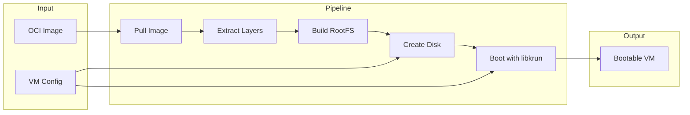

# Rust libkrun: Container Image to Bootable VM

A comprehensive Rust guide for building bootable VM images from OCI container images using libkrun.

## Overview

This guide covers the complete pipeline for transforming container images into bootable libkrun VMs:



## Project Structure

```
libkrun-rust/
├── Cargo.toml
├── src/
│   ├── main.rs              # CLI entry point
│   ├── lib.rs               # Library exports
│   │
│   ├── oci/                 # OCI image handling
│   │   ├── mod.rs
│   │   ├── manifest.rs      # Image manifest parsing
│   │   ├── pull.rs          # Image pulling
│   │   └── auth.rs          # Registry authentication
│   │
│   ├── rootfs/              # Root filesystem handling
│   │   ├── mod.rs
│   │   ├── oci_builder.rs   # RootFS from OCI
│   │   ├── minimal.rs       # Minimal RootFS
│   │   └── ext4.rs          # ext4 disk image creation
│   │
│   ├── kernel/              # Kernel handling
│   │   ├── mod.rs
│   │   ├── libkrunfw.rs     # libkrunfw kernel
│   │   └── initramfs.rs     # Initramfs generation
│   │
│   ├── vm/                  # VM configuration
│   │   ├── mod.rs
│   │   ├── config.rs        # VM configuration
│   │   └── builder.rs       # VM builder
│   │
│   ├── libkrun/             # libkrun bindings
│   │   ├── mod.rs
│   │   ├── ffi.rs           # FFI bindings
│   │   └── context.rs       # Context management
│   │
│   └── disk/                # Disk image handling
│       ├── mod.rs
│       ├── raw.rs           # Raw disk images
│       └── qcow2.rs         # QCow2 disk images
│
└── examples/
    ├── simple_vm.rs         # Simple VM from OCI image
    ├── custom_disk.rs       # Custom disk configuration
    └── gpu_vm.rs            # GPU-accelerated VM
```

## Dependencies (Cargo.toml)

```toml
[package]
name = "libkrun-rust"
version = "0.1.0"
edition = "2021"

[dependencies]
# Async runtime
tokio = { version = "1", features = ["full"] }

# HTTP client
reqwest = { version = "0.11", features = ["json", "stream"] }

# Serialization
serde = { version = "1", features = ["derive"] }
serde_json = "1"

# OCI spec types
oci-spec = { version = "0.6", features = ["image"] }

# Compression
flate2 = "1"
xz2 = "0.1"
zstd = "0.13"

# Archive handling
tar = "0.4"

# ext4 filesystem
ext4-view = "0.2"
# Or for creation, use e2fsprogs FFI or block-device crate
block-device = "0.1"

# Error handling
thiserror = "1"
anyhow = "1"

# Logging
tracing = "0.1"
tracing-subscriber = { version = "0.3", features = ["env-filter"] }

# Path handling
path-clean = "1"
tempfile = "3"

# CLI
clap = { version = "4", features = ["derive"] }

# UUID for disk identifiers
uuid = { version = "1", features = ["v4"] }
```

## Module Implementation

### OCI Module (src/oci/mod.rs)

```rust
use reqwest::Client;
use oci_spec::image::{ImageManifest, ImageConfiguration, Descriptor};
use serde::Deserialize;
use thiserror::Error;

mod manifest;
mod pull;
mod auth;

pub use manifest::*;
pub use pull::*;
pub use auth::*;

#[derive(Error, Debug)]
pub enum OciError {
    #[error("Registry error: {0}")]
    Registry(String),

    #[error("Authentication error: {0}")]
    Auth(String),

    #[error("IO error: {0}")]
    Io(#[from] std::io::Error),

    #[error("OCI spec error: {0}")]
    OciSpec(#[from] oci_spec::error::Error),

    #[error("JSON error: {0}")]
    Json(#[from] serde_json::Error),
}

pub type Result<T> = std::result::Result<T, OciError>;

/// Parsed OCI image reference
#[derive(Debug, Clone)]
pub struct ImageReference {
    pub registry: String,
    pub repository: String,
    pub reference: String,  // tag or digest
}

impl ImageReference {
    /// Parse an OCI image reference
    ///
    /// Examples:
    /// - "alpine:latest" -> docker.io/library/alpine:latest
    /// - "ghcr.io/user/repo:tag" -> ghcr.io/user/repo:tag
    /// - "registry@sha256:..." -> registry/digest
    pub fn parse(image_ref: &str) -> Result<Self> {
        // Handle digest references
        if image_ref.contains('@') {
            let parts: Vec<&str> = image_ref.split('@').collect();
            let name = parts[0];
            let digest = parts[1];

            let (registry, repository) = Self::parse_name(name);

            return Ok(Self {
                registry,
                repository,
                reference: digest.to_string(),
            });
        }

        // Handle tag references
        let (name, tag) = match image_ref.split_once(':') {
            Some((n, t)) => (n, t.to_string()),
            None => (image_ref, "latest".to_string()),
        };

        let (registry, repository) = Self::parse_name(name);

        Ok(Self {
            registry,
            repository,
            reference: tag,
        })
    }

    fn parse_name(name: &str) -> (String, String) {
        // Check if name includes registry
        if name.contains('/') && (name.contains('.') || name.contains(':')) {
            // Has registry (e.g., "ghcr.io/user/repo")
            let mut parts = name.splitn(2, '/');
            (
                parts.next().unwrap().to_string(),
                parts.next().unwrap().to_string(),
            )
        } else if !name.contains('/') {
            // Simple name (e.g., "alpine") -> docker.io/library/alpine
            ("docker.io".to_string(), format!("library/{}", name))
        } else {
            // User/repo without registry (e.g., "user/repo") -> docker.io/user/repo
            ("docker.io".to_string(), name.to_string())
        }
    }

    /// Full path for registry API calls
    pub fn manifest_url(&self) -> String {
        format!(
            "https://{}/v2/{}/manifests/{}",
            self.registry, self.repository, self.reference
        )
    }

    /// Blob URL for a given digest
    pub fn blob_url(&self, digest: &str) -> String {
        format!(
            "https://{}/v2/{}/blobs/{}",
            self.registry, self.repository, digest
        )
    }
}

#[cfg(test)]
mod tests {
    use super::*;

    #[test]
    fn test_parse_simple_name() {
        let img_ref = ImageReference::parse("alpine:latest").unwrap();
        assert_eq!(img_ref.registry, "docker.io");
        assert_eq!(img_ref.repository, "library/alpine");
        assert_eq!(img_ref.reference, "latest");
    }

    #[test]
    fn test_parse_with_registry() {
        let img_ref = ImageReference::parse("ghcr.io/user/repo:tag").unwrap();
        assert_eq!(img_ref.registry, "ghcr.io");
        assert_eq!(img_ref.repository, "user/repo");
        assert_eq!(img_ref.reference, "tag");
    }

    #[test]
    fn test_parse_digest() {
        let img_ref = ImageReference::parse(
            "alpine@sha256:abcd1234"
        ).unwrap();
        assert_eq!(img_ref.registry, "docker.io");
        assert_eq!(img_ref.repository, "library/alpine");
        assert_eq!(img_ref.reference, "sha256:abcd1234");
    }
}
```

### OCI Pull Module (src/oci/pull.rs)

```rust
use super::{ImageReference, OciError, Result};
use oci_spec::image::{ImageManifest, ImageConfiguration, Descriptor};
use reqwest::Client;
use std::path::{Path, PathBuf};
use std::fs::{self, File};
use std::io::{Write, Read};
use flate2::read::GzDecoder;
use xz2::read::XzDecoder;
use zstd::stream::read::Decoder as ZstdDecoder;
use tar::Archive;
use tracing::{info, debug, warn};

/// OCI image puller
pub struct ImagePuller {
    client: Client,
    workdir: PathBuf,
    layers_dir: PathBuf,
    rootfs_dir: PathBuf,
}

impl ImagePuller {
    pub fn new(workdir: impl AsRef<Path>) -> std::result::Result<Self, std::io::Error> {
        let workdir = workdir.as_ref().to_path_buf();
        let layers_dir = workdir.join("layers");
        let rootfs_dir = workdir.join("rootfs");

        fs::create_dir_all(&layers_dir)?;
        fs::create_dir_all(&rootfs_dir)?;

        Ok(Self {
            client: Client::builder()
                .timeout(std::time::Duration::from_secs(300))
                .build()
                .unwrap(),
            workdir,
            layers_dir,
            rootfs_dir,
        })
    }

    /// Pull an OCI image and extract rootfs
    pub async fn pull(&self, image_ref: &str) -> Result<PathBuf> {
        let image_ref = ImageReference::parse(image_ref)?;

        info!("Pulling image: {}", image_ref.manifest_url());

        // Fetch manifest
        let manifest = self.fetch_manifest(&image_ref).await?;

        // Fetch config
        let config = self.fetch_config(&image_ref, &manifest).await?;

        // Download and extract layers
        self.extract_layers(&image_ref, &manifest).await?;

        info!(
            "RootFS extracted to: {:?}",
            self.rootfs_dir
        );

        Ok(self.rootfs_dir.clone())
    }

    async fn fetch_manifest(
        &self,
        image_ref: &ImageReference,
    ) -> Result<ImageManifest> {
        let response = self.client
            .get(&image_ref.manifest_url())
            .header(
                "Accept",
                "application/vnd.oci.image.manifest.v1+json,application/vnd.docker.distribution.manifest.v2+json"
            )
            .send()
            .await
            .map_err(|e| OciError::Registry(e.to_string()))?;

        if !response.status().is_success() {
            return Err(OciError::Registry(format!(
                "Registry returned {}: {}",
                response.status(),
                response.text().await.unwrap_or_default()
            )));
        }

        let manifest: ImageManifest = response
            .json()
            .await
            .map_err(|e| OciError::Json(e))?;

        Ok(manifest)
    }

    async fn fetch_config(
        &self,
        image_ref: &ImageReference,
        manifest: &ImageManifest,
    ) -> Result<ImageConfiguration> {
        let config_digest = manifest.config().digest();
        let config_url = image_ref.blob_url(config_digest);

        let response = self.client
            .get(&config_url)
            .send()
            .await
            .map_err(|e| OciError::Registry(e.to_string()))?;

        let bytes = response
            .bytes()
            .await
            .map_err(|e| OciError::Registry(e.to_string()))?;

        let config: ImageConfiguration = serde_json::from_slice(&bytes)
            .map_err(|e| OciError::Json(e))?;

        Ok(config)
    }

    async fn extract_layers(
        &self,
        image_ref: &ImageReference,
        manifest: &ImageManifest,
    ) -> Result<()> {
        let layers = manifest.layers();

        for (i, layer) in layers.iter().enumerate() {
            info!("Extracting layer {}/{}", i + 1, layers.len());

            let layer_data = self.download_layer(image_ref, layer).await?;
            self.extract_layer_data(&layer_data)?;
        }

        Ok(())
    }

    async fn download_layer(
        &self,
        image_ref: &ImageReference,
        descriptor: &Descriptor,
    ) -> Result<Vec<u8>> {
        let blob_url = image_ref.blob_url(descriptor.digest());

        let response = self.client
            .get(&blob_url)
            .send()
            .await
            .map_err(|e| OciError::Registry(e.to_string()))?;

        let bytes = response
            .bytes()
            .await
            .map_err(|e| OciError::Registry(e.to_string()))?;

        Ok(bytes.to_vec())
    }

    fn extract_layer_data(&self, data: &[u8]) -> Result<()> {
        // Detect compression from magic bytes
        let decoder: Box<dyn Read> = match data.get(0..6) {
            Some([0x1f, 0x8b, _, _, _, _]) => {
                // Gzip magic bytes
                Box::new(GzDecoder::new(data))
            }
            Some([0xfd, 0x37, 0x7a, 0x58, 0x5a, 0x00]) => {
                // XZ magic bytes
                Box::new(XzDecoder::new(data))
            }
            Some([0x28, 0xb5, 0x2f, 0xfd, _, _]) => {
                // Zstd magic bytes
                Box::new(ZstdDecoder::new(data).map_err(|e| OciError::Io(e))?)
            }
            _ => Box::new(data),  // Uncompressed (rare)
        };

        let mut archive = Archive::new(decoder);

        for entry_result in archive.entries().map_err(|e| OciError::Io(e))? {
            let mut entry = entry_result.map_err(|e| OciError::Io(e))?;
            let path = entry.path().map_err(|e| OciError::Io(e))?.to_path_buf();
            let entry_type = entry.header().entry_type();

            // Handle various path formats
            let target_path = self.clean_path(&path);

            match entry_type {
                tar::EntryType::Regular => {
                    self.write_regular_file(&target_path, &mut entry)?;
                }
                tar::EntryType::Directory => {
                    fs::create_dir_all(&target_path)?;
                }
                tar::EntryType::Symlink => {
                    if let Ok(link_name) = entry.link_name() {
                        self.create_symlink(&target_path, &link_name)?;
                    }
                }
                tar::EntryType::Link => {
                    if let Ok(link_name) = entry.link_name() {
                        let link_target = self.rootfs_dir.join(link_name);
                        let _ = fs::remove_file(&target_path);
                        std::os::unix::fs::hard_link(link_target, &target_path)?;
                    }
                }
                tar::EntryType::Char | tar::EntryType::Block => {
                    // Skip device nodes - not needed for most use cases
                    debug!("Skipping device node: {:?}", path);
                }
                tar::EntryType::Fifo => {
                    // Skip FIFOs
                    debug!("Skipping FIFO: {:?}", path);
                }
                _ => {
                    debug!("Skipping unknown entry type: {:?}", path);
                }
            }
        }

        Ok(())
    }

    fn clean_path(&self, path: &Path) -> PathBuf {
        // Remove leading slashes and handle various path formats
        let path_str = path.to_string_lossy();
        let clean_str = path_str.trim_start_matches('/');

        // Handle "./" prefix
        let clean_str = clean_str.strip_prefix("./").unwrap_or(clean_str);

        self.rootfs_dir.join(clean_str)
    }

    fn write_regular_file(
        &self,
        path: &Path,
        entry: &mut tar::Entry<&dyn Read>,
    ) -> Result<()> {
        if let Some(parent) = path.parent() {
            fs::create_dir_all(parent)?;
        }

        let mut file = File::create(path)?;
        std::io::copy(entry, &mut file)?;

        Ok(())
    }

    fn create_symlink(
        &self,
        path: &Path,
        link_name: &Path,
    ) -> Result<()> {
        if let Some(parent) = path.parent() {
            fs::create_dir_all(parent)?;
        }

        let _ = fs::remove_file(path);  // Remove existing file/link
        std::os::unix::fs::symlink(link_name, path)?;

        Ok(())
    }
}
```

### RootFS Module (src/rootfs/mod.rs)

```rust
mod oci_builder;
mod minimal;
mod ext4;

pub use oci_builder::*;
pub use minimal::*;
pub use ext4::*;

use std::path::{Path, PathBuf};
use thiserror::Error;

#[derive(Error, Debug)]
pub enum RootFsError {
    #[error("IO error: {0}")]
    Io(#[from] std::io::Error),

    #[error("OCI error: {0}")]
    Oci(#[from] crate::oci::OciError),

    #[error("Disk creation error: {0}")]
    Disk(String),
}

pub type Result<T> = std::result::Result<T, RootFsError>;

/// Root filesystem configuration
#[derive(Debug, Clone)]
pub enum RootFsSource {
    /// Build from OCI image
    Oci(String),

    /// Build minimal rootfs
    Minimal(MinimalRootFsConfig),

    /// Use existing directory
    Existing(PathBuf),
}

/// Root filesystem output format
#[derive(Debug, Clone)]
pub enum RootFsFormat {
    /// Directory (for virtio-fs)
    Directory,

    /// Raw ext4 image
    RawExt4 { size_mb: u32 },

    /// QCow2 image
    Qcow2 { size_mb: u32 },
}

/// Built root filesystem
pub struct RootFs {
    pub path: PathBuf,
    pub format: RootFsFormat,
    pub size_bytes: u64,
}

impl RootFs {
    pub fn builder(source: RootFsSource) -> RootFsBuilder {
        RootFsBuilder::new(source)
    }
}

/// Builder for root filesystems
pub struct RootFsBuilder {
    source: RootFsSource,
    format: RootFsFormat,
    workdir: Option<PathBuf>,
}

impl RootFsBuilder {
    pub fn new(source: RootFsSource) -> Self {
        Self {
            source,
            format: RootFsFormat::Directory,
            workdir: None,
        }
    }

    pub fn format(mut self, format: RootFsFormat) -> Self {
        self.format = format;
        self
    }

    pub fn workdir(mut self, workdir: impl AsRef<Path>) -> Self {
        self.workdir = Some(workdir.as_ref().to_path_buf());
        self
    }

    pub async fn build(self) -> Result<RootFs> {
        let workdir = self.workdir.unwrap_or_else(|| {
            std::env::temp_dir().join(format!("libkrun-rootfs-{}", uuid::Uuid::new_v4()))
        });

        match self.source {
            RootFsSource::Oci(image_ref) => {
                let puller = ImagePuller::new(&workdir)?;
                let rootfs_path = puller.pull(&image_ref).await?;

                self.convert_format(rootfs_path, &workdir).await
            }
            RootFsSource::Minimal(config) => {
                let builder = MinimalRootFsBuilder::new(&workdir);
                let rootfs_path = builder.build(&config)?;

                self.convert_format(rootfs_path, &workdir).await
            }
            RootFsSource::Existing(path) => {
                self.convert_format(path, &workdir).await
            }
        }
    }

    async fn convert_format(
        &self,
        rootfs_dir: PathBuf,
        workdir: &Path,
    ) -> Result<RootFs> {
        match self.format {
            RootFsFormat::Directory => {
                // Already a directory
                let size = calculate_dir_size(&rootfs_dir)?;

                Ok(RootFs {
                    path: rootfs_dir,
                    format: self.format.clone(),
                    size_bytes: size,
                })
            }
            RootFsFormat::RawExt4 { size_mb } => {
                let output = workdir.join("rootfs.raw");
                create_ext4_image(&rootfs_dir, &output, size_mb)?;

                Ok(RootFs {
                    path: output,
                    format: self.format.clone(),
                    size_bytes: size_mb as u64 * 1024 * 1024,
                })
            }
            RootFsFormat::Qcow2 { size_mb } => {
                let output = workdir.join("rootfs.qcow2");
                create_qcow2_image(&rootfs_dir, &output, size_mb)?;

                Ok(RootFs {
                    path: output,
                    format: self.format.clone(),
                    size_bytes: size_mb as u64 * 1024 * 1024,
                })
            }
        }
    }
}

fn calculate_dir_size(dir: &Path) -> Result<u64> {
    let mut total = 0u64;

    for entry in walkdir::WalkDir::new(dir) {
        let entry = entry.map_err(|e| RootFsError::Io(e))?;
        if let Ok(metadata) = entry.metadata() {
            if metadata.is_file() {
                total += metadata.len();
            }
        }
    }

    Ok(total)
}
```

### Disk Image Module (src/disk/mod.rs)

```rust
mod raw;
mod qcow2;

pub use raw::*;
pub use qcow2::*;

use std::path::{Path, PathBuf};
use std::fs::{self, File};
use std::io::{Write, Seek};
use thiserror::Error;

#[derive(Error, Debug)]
pub enum DiskError {
    #[error("IO error: {0}")]
    Io(#[from] std::io::Error),

    #[error("ext4 error: {0}")]
    Ext4(String),

    #[error("qcow2 error: {0}")]
    Qcow2(String),
}

pub type Result<T> = std::result::Result<T, DiskError>;

/// Disk image format
#[derive(Debug, Clone)]
pub enum DiskFormat {
    Raw,
    QCow2,
}

/// Disk image configuration
#[derive(Debug, Clone)]
pub struct DiskConfig {
    pub format: DiskFormat,
    pub size_mb: u32,
    pub label: Option<String>,
}

impl Default for DiskConfig {
    fn default() -> Self {
        Self {
            format: DiskFormat::Raw,
            size_mb: 2048,  // 2GB default
            label: None,
        }
    }
}

/// Create disk image from directory
pub fn create_disk_image(
    source_dir: &Path,
    output_path: &Path,
    config: &DiskConfig,
) -> Result<PathBuf> {
    match config.format {
        DiskFormat::Raw => {
            create_raw_ext4(source_dir, output_path, config.size_mb)
        }
        DiskFormat::QCow2 => {
            create_qcow2_ext4(source_dir, output_path, config.size_mb)
        }
    }
}

/// Create a raw ext4 disk image
pub fn create_raw_ext4(
    source_dir: &Path,
    output_path: &Path,
    size_mb: u32,
) -> Result<PathBuf> {
    tracing::info!("Creating raw ext4 disk: {} MB", size_mb);

    // Ensure output directory exists
    if let Some(parent) = output_path.parent() {
        fs::create_dir_all(parent)?;
    }

    // Create empty disk image
    let mut file = File::create(output_path)?;
    let size_bytes = size_mb as u64 * 1024 * 1024;
    file.set_len(size_bytes)?;
    drop(file);

    // Format as ext4 using e2fsprogs
    let status = std::process::Command::new("mkfs.ext4")
        .arg("-F")  // Force
        .arg("-L")
        .arg("rootfs")
        .arg(output_path)
        .arg(format!("{}", size_mb))
        .status()
        .map_err(|e| DiskError::Io(e))?;

    if !status.success() {
        return Err(DiskError::Ext4(
            format!("mkfs.ext4 failed with status: {}", status)
        ));
    }

    // Mount and copy files (requires root or FUSE)
    copy_to_ext4(source_dir, output_path)?;

    tracing::info!("Created raw ext4 disk at: {:?}", output_path);

    Ok(output_path.to_path_buf())
}

/// Copy files to ext4 image without mounting (using debugfs)
fn copy_to_ext4(source_dir: &Path, disk_image: &Path) -> Result<()> {
    // Use debugfs to copy files without mounting
    let status = std::process::Command::new("debugfs")
        .arg("-w")  // Write mode
        .arg(disk_image)
        .arg("-R")
        .arg(format!("cd /; rdump {} /", source_dir.display()))
        .status()
        .map_err(|e| DiskError::Io(e))?;

    if !status.success() {
        // debugfs might not be available, fall back to FUSE mount
        copy_to_ext4_fuse(source_dir, disk_image)?;
    }

    Ok(())
}

/// Copy files to ext4 image using FUSE mount
fn copy_to_ext4_fuse(source_dir: &Path, disk_image: &Path) -> Result<()> {
    use tempfile::TempDir;

    let mount_dir = TempDir::new()?;

    // Mount the image
    let mount_status = std::process::Command::new("fuse2fs")
        .arg(disk_image)
        .arg(mount_dir.path())
        .status()
        .map_err(|e| DiskError::Io(e))?;

    if !mount_status.success() {
        return Err(DiskError::Ext4(
            "fuse2fs mount failed".to_string()
        ));
    }

    // Copy files
    let copy_status = std::process::Command::new("cp")
        .arg("-a")
        .arg(format!("{}/.", source_dir.display()))
        .arg(mount_dir.path())
        .status()
        .map_err(|e| DiskError::Io(e))?;

    // Unmount
    let _ = std::process::Command::new("fusermount")
        .arg("-u")
        .arg(mount_dir.path())
        .status();

    if !copy_status.success() {
        return Err(DiskError::Ext4(
            "Failed to copy files".to_string()
        ));
    }

    Ok(())
}
```

### VM Configuration Module (src/vm/config.rs)

```rust
use std::path::PathBuf;

/// VM configuration
#[derive(Debug, Clone)]
pub struct VmConfig {
    /// Number of vCPUs
    pub num_vcpus: u8,

    /// RAM size in MiB
    pub ram_mib: u32,

    /// Root filesystem path
    pub rootfs: PathBuf,

    /// Additional disk images
    pub disks: Vec<DiskAttachment>,

    /// virtio-fs shared directories
    pub shared_dirs: Vec<SharedDir>,

    /// Network configuration
    pub network: NetworkConfig,

    /// GPU configuration
    pub gpu: Option<GpuConfig>,

    /// Command to execute
    pub command: Vec<String>,

    /// Environment variables
    pub env: Vec<(String, String)>,
}

impl Default for VmConfig {
    fn default() -> Self {
        Self {
            num_vcpus: 2,
            ram_mib: 1024,
            rootfs: PathBuf::from("./rootfs"),
            disks: vec![],
            shared_dirs: vec![],
            network: NetworkConfig::default(),
            gpu: None,
            command: vec!["/bin/sh".to_string()],
            env: vec![],
        }
    }
}

/// Disk attachment
#[derive(Debug, Clone)]
pub struct DiskAttachment {
    pub path: PathBuf,
    pub read_only: bool,
    pub block_id: String,
}

/// Shared directory for virtio-fs
#[derive(Debug, Clone)]
pub struct SharedDir {
    pub host_path: PathBuf,
    pub mount_tag: String,
}

/// Network configuration
#[derive(Debug, Clone)]
pub enum NetworkConfig {
    /// No network
    None,

    /// Use TSI (virtio-vsock based)
    Tsi {
        port_mappings: Vec<PortMapping>,
    },

    /// Use passt (user-mode networking)
    Passt {
        port_mappings: Vec<PortMapping>,
    },

    /// Use gvproxy
    GvProxy {
        socket_path: PathBuf,
    },
}

impl Default for NetworkConfig {
    fn default() -> Self {
        Self::None
    }
}

/// Port mapping
#[derive(Debug, Clone)]
pub struct PortMapping {
    pub host_port: u16,
    pub guest_port: u16,
    pub protocol: PortProtocol,
}

#[derive(Debug, Clone)]
pub enum PortProtocol {
    Tcp,
    Udp,
}

/// GPU configuration
#[derive(Debug, Clone)]
pub struct GpuConfig {
    /// virglrenderer flags
    pub virgl_flags: u32,

    /// Enable Venus (Android GPU)
    pub enable_venus: bool,
}

impl VmConfig {
    /// Create a minimal VM config
    pub fn minimal(rootfs: PathBuf) -> Self {
        Self {
            num_vcpus: 1,
            ram_mib: 256,
            rootfs,
            ..Default::default()
        }
    }

    /// Create a typical VM config
    pub fn typical(rootfs: PathBuf) -> Self {
        Self {
            num_vcpus: 2,
            ram_mib: 1024,
            rootfs,
            network: NetworkConfig::Tsi {
                port_mappings: vec![
                    PortMapping {
                        host_port: 8080,
                        guest_port: 80,
                        protocol: PortProtocol::Tcp,
                    },
                ],
            },
            ..Default::default()
        }
    }

    /// Create a GPU-accelerated VM config
    pub fn with_gpu(mut self, flags: u32) -> Self {
        self.gpu = Some(GpuConfig {
            virgl_flags: flags,
            enable_venus: true,
        });
        self
    }
}
```

### Main Entry Point (src/main.rs)

```rust
use clap::{Parser, Subcommand};
use libkrun_rust::{
    oci::ImagePuller,
    rootfs::{RootFs, RootFsSource, RootFsFormat, RootFsBuilder},
    vm::{VmConfig, VmBuilder},
    libkrun::KrunContext,
};
use std::path::PathBuf;
use tracing::{info, error};
use tracing_subscriber::EnvFilter;

#[derive(Parser)]
#[command(name = "libkrun-rust")]
#[command(about = "Run OCI images as libkrun VMs")]
struct Cli {
    #[command(subcommand)]
    command: Commands,

    /// Working directory
    #[arg(short, long, default_value = ".")]
    workdir: PathBuf,

    /// Enable verbose logging
    #[arg(short, long)]
    verbose: bool,
}

#[derive(Subcommand)]
enum Commands {
    /// Pull and extract an OCI image
    Pull {
        /// OCI image reference (e.g., alpine:latest)
        image: String,
    },

    /// Build a rootfs from an OCI image
    Build {
        /// OCI image reference
        image: String,

        /// Output format (directory, raw, qcow2)
        #[arg(short, long, default_value = "directory")]
        format: String,

        /// Disk size in MB (for raw/qcow2)
        #[arg(short, long, default_value = "2048")]
        size: u32,
    },

    /// Run an OCI image as a VM
    Run {
        /// OCI image reference
        image: String,

        /// Number of vCPUs
        #[arg(short, long, default_value = "2")]
        cpus: u8,

        /// RAM size in MiB
        #[arg(short, long, default_value = "1024")]
        memory: u32,

        /// Command to run (overrides image CMD)
        command: Option<Vec<String>>,
    },

    /// Run a VM from an existing rootfs
    Vm {
        /// Path to rootfs
        rootfs: PathBuf,

        /// Number of vCPUs
        #[arg(short, long, default_value = "2")]
        cpus: u8,

        /// RAM size in MiB
        #[arg(short, long, default_value = "1024")]
        memory: u32,

        /// Command to run
        command: Option<Vec<String>>,
    },
}

#[tokio::main]
async fn main() -> anyhow::Result<()> {
    let cli = Cli::parse();

    // Setup logging
    let filter = if cli.verbose {
        "debug"
    } else {
        "info"
    };

    tracing_subscriber::fmt()
        .with_env_filter(EnvFilter::new(filter))
        .init();

    match cli.command {
        Commands::Pull { image } => {
            cmd_pull(&cli.workdir, &image).await?;
        }
        Commands::Build { image, format, size } => {
            cmd_build(&cli.workdir, &image, &format, size).await?;
        }
        Commands::Run { image, cpus, memory, command } => {
            cmd_run(&cli.workdir, &image, cpus, memory, command).await?;
        }
        Commands::Vm { rootfs, cpus, memory, command } => {
            cmd_vm(&cli.workdir, &rootfs, cpus, memory, command)?;
        }
    }

    Ok(())
}

async fn cmd_pull(workdir: &Path, image: &str) -> anyhow::Result<()> {
    info!("Pulling image: {}", image);

    let puller = ImagePuller::new(workdir)?;
    let rootfs_path = puller.pull(image).await?;

    println!("RootFS extracted to: {:?}", rootfs_path);

    Ok(())
}

async fn cmd_build(
    workdir: &Path,
    image: &str,
    format: &str,
    size: u32,
) -> anyhow::Result<()> {
    info!("Building rootfs from {} (format: {})", image, format);

    let format = match format {
        "directory" => RootFsFormat::Directory,
        "raw" => RootFsFormat::RawExt4 { size_mb: size },
        "qcow2" => RootFsFormat::Qcow2 { size_mb: size },
        _ => anyhow::bail!("Unknown format: {}", format),
    };

    let rootfs = RootFs::builder(RootFsSource::Oci(image.to_string()))
        .format(format)
        .workdir(workdir)
        .build()
        .await?;

    println!("RootFS built at: {:?}", rootfs.path);
    println!("Size: {} bytes", rootfs.size_bytes);

    Ok(())
}

async fn cmd_run(
    workdir: &Path,
    image: &str,
    cpus: u8,
    memory: u32,
    command: Option<Vec<String>>,
) -> anyhow::Result<()> {
    info!("Running {} as VM ({} vCPUs, {} MiB RAM)", image, cpus, memory);

    // Build rootfs from image
    let rootfs = RootFs::builder(RootFsSource::Oci(image.to_string()))
        .workdir(workdir)
        .build()
        .await?;

    info!("RootFS ready at: {:?}", rootfs.path);

    // Create VM configuration
    let mut vm_config = VmConfig::minimal(rootfs.path);
    vm_config.num_vcpus = cpus;
    vm_config.ram_mib = memory;

    if let Some(cmd) = command {
        vm_config.command = cmd;
    }

    // Create and run VM
    let ctx = KrunContext::create()?;
    ctx.configure(&vm_config)?;

    println!("Starting VM...");
    ctx.enter()?;

    Ok(())
}

fn cmd_vm(
    workdir: &Path,
    rootfs: &Path,
    cpus: u8,
    memory: u32,
    command: Option<Vec<String>>,
) -> anyhow::Result<()> {
    info!("Running VM from rootfs: {:?}", rootfs);

    let mut vm_config = VmConfig::minimal(rootfs.to_path_buf());
    vm_config.num_vcpus = cpus;
    vm_config.ram_mib = memory;

    if let Some(cmd) = command {
        vm_config.command = cmd;
    }

    let ctx = KrunContext::create()?;
    ctx.configure(&vm_config)?;

    println!("Starting VM...");
    ctx.enter()?;

    Ok(())
}
```

## Example Usage

### Pull an OCI Image

```bash
# Pull Alpine Linux
cargo run -- pull alpine:latest

# Pull from GitHub Container Registry
cargo run -- pull ghcr.io/containers/libkrun-demo:latest
```

### Build a RootFS

```bash
# Build directory-based rootfs
cargo run -- build alpine:latest

# Build raw ext4 disk image (4GB)
cargo run -- build alpine:latest --format raw --size 4096

# Build QCow2 disk image
cargo run -- build alpine:latest --format qcow2 --size 2048
```

### Run an OCI Image as VM

```bash
# Run with defaults (2 vCPUs, 1GiB RAM)
cargo run -- run alpine:latest

# Run with custom resources
cargo run -- run alpine:latest --cpus 4 --memory 2048

# Run with custom command
cargo run -- run alpine:latest -- /bin/sh -c "echo Hello from libkrun VM"
```

### Run VM from Existing RootFS

```bash
cargo run -- vm ./rootfs --cpus 2 --memory 1024
```

## References

- [OCI Image Specification](https://github.com/opencontainers/image-spec)
- [libkrun API](../../src.containers/libkrun/include/libkrun.h)
- [ext4 Documentation](https://www.kernel.org/doc/html/latest/filesystems/ext4/index.html)
