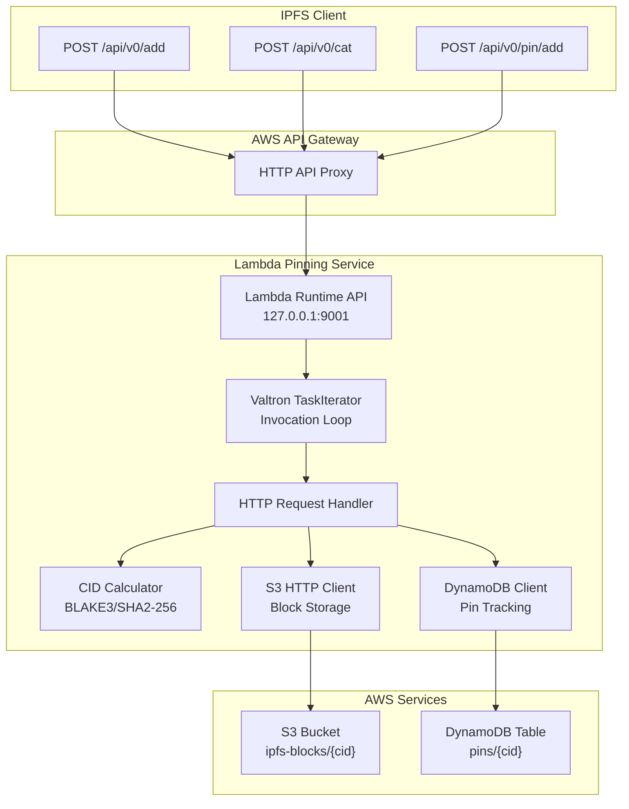
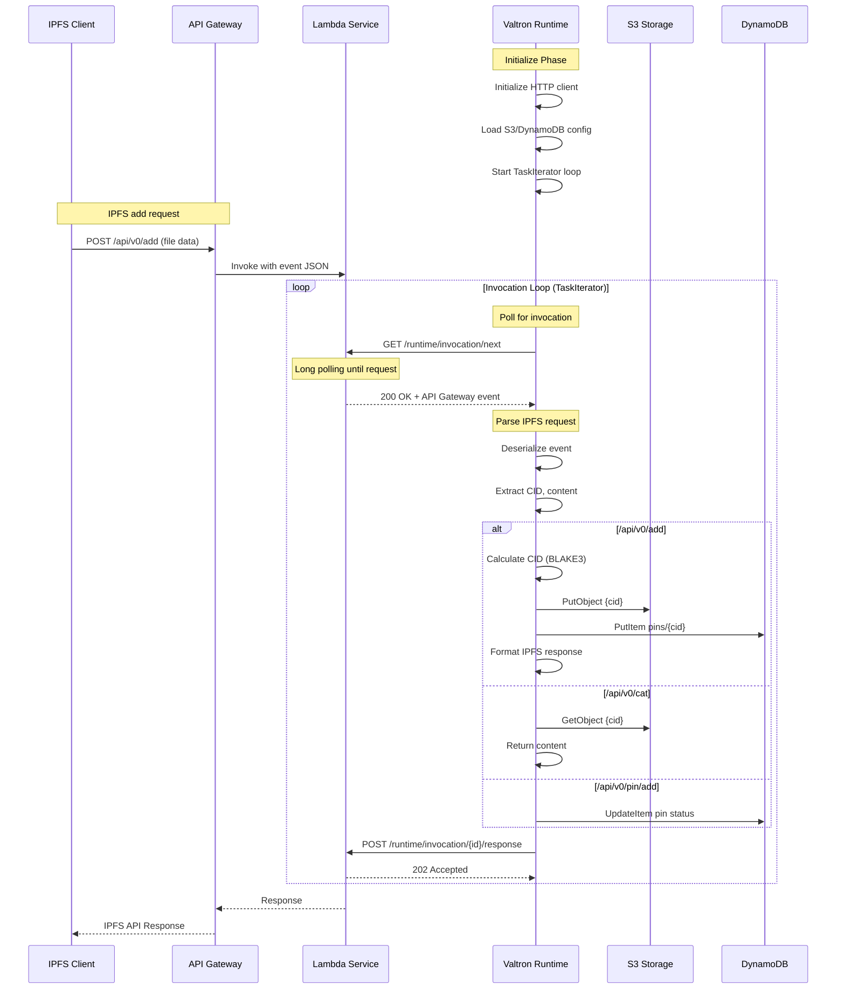

# Valtron Integration: Lambda-Compatible IPFS Pinning Service

## Overview

This deep dive covers implementing a **Lambda-compatible IPFS pinning service** using **Valtron executors** - completely bypassing tokio and async Rust. This approach provides:

- **Serverless IPFS pinning** - Pin and retrieve content on-demand
- **IPFS HTTP API compatibility** - `/api/v0/add`, `/api/v0/cat`, `/api/v0/pin/add`, `/api/v0/block/get`
- **Full control** over the invocation lifecycle
- **Reduced dependencies** (no tokio, no aws-lambda-rust-runtime)
- **Valtron TaskIterator** patterns for invocation loops
- **S3 integration** for block storage
- **DynamoDB integration** for pin tracking

### Why Valtron for IPFS Pinning?

| Aspect | Traditional IPFS Node | Valtron Lambda Pinning |
|--------|----------------------|------------------------|
| **Runtime** | Long-running daemon | Serverless on-demand |
| **Memory** | 512MB-2GB+ resident | 128MB-3GB allocated |
| **Storage** | Local filesystem | S3 + DynamoDB |
| **Dependencies** | libp2p, tokio, async | Minimal HTTP client |
| **Cost** | $5-50/month VPS | Pay-per-request |
| **Cold Start** | N/A (always on) | 20-100ms |
| **Binary Size** | 50-100MB | 3-8MB |
| **Scaling** | Manual or orchestration | Automatic Lambda scaling |

### Architecture Overview



---

## 1. Lambda Runtime API for Pinning Services

The Lambda Runtime API is the core interface between your Valtron-based IPFS pinning service and AWS Lambda.

### 1.1 Core Endpoints

#### `/runtime/invocation/next` (GET)

Long-polling endpoint that blocks until an IPFS request arrives.

**Request:**
```http
GET /runtime/invocation/next HTTP/1.1
Host: 127.0.0.1:9001
User-Agent: ValtronIPFS/1.0
```

**Response (200 OK):**
```http
HTTP/1.1 200 OK
Content-Type: application/json
Lambda-Runtime-Aws-Request-Id: af9c3624-3842-4d84-8c95-e0a8e7f6c4b5
Lambda-Runtime-Deadline-Ms: 1711564800000
Lambda-Runtime-Invoked-Function-Arn: arn:aws:lambda:us-east-1:123456789012:function:ipfs-pinner
Lambda-Runtime-Trace-Id: Root=1-65f9c8a0-1234567890abcdef12345678
```

**Response Body (API Gateway v2 - IPFS add request):**
```json
{
  "version": "2.0",
  "routeKey": "POST /api/v0/add",
  "rawPath": "/api/v0/add",
  "rawQueryString": "pin=true&recursive=false",
  "headers": {
    "content-type": "multipart/form-data; boundary=---abc123",
    "host": "abc123.execute-api.us-east-1.amazonaws.com"
  },
  "requestContext": {
    "accountId": "123456789012",
    "apiId": "abc123",
    "domainName": "abc123.execute-api.us-east-1.amazonaws.com",
    "http": {
      "method": "POST",
      "path": "/api/v0/add",
      "protocol": "HTTP/1.1",
      "sourceIp": "203.0.113.1"
    },
    "requestId": "abc123",
    "stage": "$default",
    "time": "27/Mar/2026:10:00:00 +0000",
    "timeEpoch": 1711564800000
  },
  "body": "<multipart form data with file content>",
  "isBase64Encoded": false
}
```

**Response Headers Explained:**

| Header | Description |
|--------|-------------|
| `Lambda-Runtime-Aws-Request-Id` | Unique request ID (required for response) |
| `Lambda-Runtime-Deadline-Ms` | Unix timestamp in milliseconds when function times out |
| `Lambda-Runtime-Invoked-Function-Arn` | ARN of the invoked function |
| `Lambda-Runtime-Trace-Id` | AWS X-Ray trace ID for distributed tracing |

#### `/runtime/invocation/{request-id}/response` (POST)

Sends the IPFS API response back to Lambda.

**Request:**
```http
POST /runtime/invocation/af9c3624-3842-4d84-8c95-e0a8e7f6c4b5/response HTTP/1.1
Host: 127.0.0.1:9001
Content-Type: application/json

{
  "statusCode": 200,
  "headers": {
    "content-type": "application/json",
    "x-ipfs-path": "/ipfs/bafybeigdyrzt5sfp7udm7hu76uh7y26nf3efuylqabf3oclgtqy55fbzdi"
  },
  "body": "{\"Name\":\"file.txt\",\"Hash\":\"bafybeigdyrzt5sfp7udm7hu76uh7y26nf3efuylqabf3oclgtqy55fbzdi\",\"Size\":\"1024\"}"
}
```

**Response:**
```http
HTTP/1.1 202 Accepted
```

#### `/runtime/invocation/{request-id}/error` (POST)

Reports an initialization error.

**Request:**
```http
POST /runtime/invocation/af9c3624-3842-4d84-8c95-e0a8e7f6c4b5/error HTTP/1.1
Host: 127.0.0.1:9001
Content-Type: application/json
X-Lambda-Function-Error-Type: Unhandled

{
  "errorMessage": "Failed to connect to S3: bucket not found",
  "errorType": "S3ConnectionError",
  "stackTrace": ["at s3_client.rs:42", "at handler.rs:15"]
}
```

### 1.2 API Gateway Integration

API Gateway transforms HTTP requests into Lambda events.

**API Gateway Configuration:**
```yaml
# serverless.yml or SAM template
Resources:
  IpfsApi:
    Type: AWS::ApiGatewayV2::Api
    Properties:
      Name: ipfs-pinning-api
      ProtocolType: HTTP
      CorsConfiguration:
        AllowOrigins:
          - "*"
        AllowMethods:
          - POST
          - GET
          - OPTIONS
        AllowHeaders:
          - Content-Type
          - X-Api-Key

  AddRoute:
    Type: AWS::ApiGatewayV2::Route
    Properties:
      ApiId: !Ref IpfsApi
      RouteKey: "POST /api/v0/add"
      Target: !Sub "integrations/${HttpIntegration}"

  CatRoute:
    Type: AWS::ApiGatewayV2::Route
    Properties:
      ApiId: !Ref IpfsApi
      RouteKey: "POST /api/v0/cat"
      Target: !Sub "integrations/${HttpIntegration}"

  PinAddRoute:
    Type: AWS::ApiGatewayV2::Route
    Properties:
      ApiId: !Ref IpfsApi
      RouteKey: "POST /api/v0/pin/add"
      Target: !Sub "integrations/${HttpIntegration}"

  BlockGetRoute:
    Type: AWS::ApiGatewayV2::Route
    Properties:
      ApiId: !Ref IpfsApi
      RouteKey: "POST /api/v0/block/get"
      Target: !Sub "integrations/${HttpIntegration}"

  HttpIntegration:
    Type: AWS::ApiGatewayV2::Integration
    Properties:
      ApiId: !Ref IpfsApi
      IntegrationType: AWS_PROXY
      IntegrationUri: !GetAtt IPFSPinnerFunction.Arn
      PayloadFormatVersion: "2.0"
      IntegrationMethod: POST
```

### 1.3 Invocation Sequence Diagram



---

## 2. IPFS HTTP API Compatibility

Implementing the core IPFS HTTP API endpoints for pinning services.

### 2.1 `/api/v0/add` Endpoint

Adds content to IPFS and returns the CID.

**Request:**
```http
POST /api/v0/add?pin=true&recursive=false&quiet=false HTTP/1.1
Host: ipfs.example.com
Content-Type: multipart/form-data; boundary=---abc123

-----abc123
Content-Disposition: form-data; name="file"; filename="hello.txt"
Content-Type: text/plain

Hello, IPFS!
-----abc123--
```

**Response (streaming progress):**
```http
HTTP/1.1 200 OK
Content-Type: application/x-ndjson
X-IPFS-Path: /ipfs/bafybeigdyrzt5sfp7udm7hu76uh7y26nf3efuylqabf3oclgtqy55fbzdi

{"Name":"hello.txt","Hash":"bafybeigdyrzt5sfp7udm7hu76uh7y26nf3efuylqabf3oclgtqy55fbzdi","Size":13}
```

**Response (quiet mode):**
```json
{"Name":"hello.txt","Hash":"bafybeigdyrzt5sfp7udm7hu76uh7y26nf3efuylqabf3oclgtqy55fbzdi"}
```

### 2.2 `/api/v0/cat` Endpoint

Retrieves content by CID.

**Request:**
```http
POST /api/v0/cat?arg=bafybeigdyrzt5sfp7udm7hu76uh7y26nf3efuylqabf3oclgtqy55fbzdi HTTP/1.1
Host: ipfs.example.com
```

**Response:**
```http
HTTP/1.1 200 OK
Content-Type: application/octet-stream
X-IPFS-Path: /ipfs/bafybeigdyrzt5sfp7udm7hu76uh7y26nf3efuylqabf3oclgtqy55fbzdi

Hello, IPFS!
```

### 2.3 `/api/v0/pin/add` Endpoint

Pins content to prevent garbage collection.

**Request:**
```http
POST /api/v0/pin/add?arg=bafybeigdyrzt5sfp7udm7hu76uh7y26nf3efuylqabf3oclgtqy55fbzdi&recursive=true HTTP/1.1
Host: ipfs.example.com
```

**Response:**
```json
{
  "Pins": [
    "bafybeigdyrzt5sfp7udm7hu76uh7y26nf3efuylqabf3oclgtqy55fbzdi"
  ]
}
```

### 2.4 `/api/v0/block/get` Endpoint

Retrieves a raw block by CID.

**Request:**
```http
POST /api/v0/block/get?arg=bafybeigdyrzt5sfp7udm7hu76uh7y26nf3efuylqabf3oclgtqy55fbzdi HTTP/1.1
Host: ipfs.example.com
```

**Response:**
```http
HTTP/1.1 200 OK
Content-Type: application/octet-stream
X-IPFS-Path: /ipfs/bafybeigdyrzt5sfp7udm7hu76uh7y26nf3efuylqabf3oclgtqy55fbzdi

<raw block bytes>
```

### 2.5 IPFS API Request Structures

```rust
// src/ipfs/api_types.rs

use serde::{Deserialize, Serialize};

/// Common IPFS API request structure
#[derive(Debug, Clone, Deserialize)]
pub struct IpfsApiRequest {
    /// API Gateway v2 event
    #[serde(flatten)]
    pub gateway_event: APIGatewayV2Request,
}

/// Query arguments for /api/v0/add
#[derive(Debug, Clone, Default)]
pub struct AddArgs {
    pub pin: bool,
    pub recursive: bool,
    pub quiet: bool,
    pub trickle: bool,
    pub only_hash: bool,
    pub wrap_with_directory: bool,
    pub hidden: bool,
    pub chunker: Option<String>,
    pub raw_leaves: bool,
    pub cid_version: u32,
    pub hash: String,  // "sha2-256", "blake3", etc.
}

impl AddArgs {
    pub fn parse_query_string(query: &str) -> Self {
        let mut args = Self::default();
        for param in query.split('&') {
            let (key, value) = param.split_once('=').unwrap_or((param, ""));
            match key {
                "pin" => args.pin = value != "false",
                "recursive" => args.recursive = value != "false",
                "quiet" => args.quiet = value == "true",
                "trickle" => args.trickle = value == "true",
                "only_hash" => args.only_hash = value == "true",
                "wrap_with_directory" => args.wrap_with_directory = value == "true",
                "hidden" => args.hidden = value == "true",
                "chunker" => args.chunker = Some(value.to_string()),
                "raw_leaves" => args.raw_leaves = value == "true",
                "cid_version" => args.cid_version = value.parse().unwrap_or(1),
                "hash" => args.hash = value.to_string(),
                _ => {}
            }
        }
        args
    }
}

/// Query arguments for /api/v0/cat
#[derive(Debug, Clone, Default)]
pub struct CatArgs {
    pub cid: String,
    pub offset: Option<u64>,
    pub length: Option<u64>,
}

/// Query arguments for /api/v0/pin/add
#[derive(Debug, Clone, Default)]
pub struct PinAddArgs {
    pub cid: String,
    pub recursive: bool,
    pub progress: bool,
}

/// Query arguments for /api/v0/block/get
#[derive(Debug, Clone, Default)]
pub struct BlockGetArgs {
    pub cid: String,
}

/// IPFS API response for /api/v0/add
#[derive(Debug, Serialize)]
pub struct AddResponse {
    pub Name: String,
    pub Hash: String,
    #[serde(skip_serializing_if = "Option::is_none")]
    pub Size: Option<String>,
}

/// IPFS API response for /api/v0/pin/add
#[derive(Debug, Serialize)]
pub struct PinAddResponse {
    pub Pins: Vec<String>,
}

/// IPFS API response for /api/v0/block/get
#[derive(Debug, Serialize)]
pub struct BlockGetResponse {
    #[serde(with = "serde_bytes")]
    pub data: Vec<u8>,
}
```

### 2.6 API Gateway v2 Request Structure

```rust
// src/ipfs/gateway_types.rs

use serde::Deserialize;
use std::collections::HashMap;

/// API Gateway v2 (HTTP API) request
#[derive(Debug, Deserialize, Clone)]
pub struct APIGatewayV2Request {
    pub version: String,
    pub route_key: String,
    pub raw_path: String,
    pub raw_query_string: String,
    #[serde(default)]
    pub cookies: Vec<String>,
    #[serde(default)]
    pub headers: HashMap<String, String>,
    #[serde(default)]
    pub query_string_parameters: Option<HashMap<String, String>>,
    pub request_context: APIGatewayV2RequestContext,
    pub body: Option<String>,
    #[serde(default)]
    pub is_base64_encoded: bool,
}

#[derive(Debug, Deserialize, Clone)]
pub struct APIGatewayV2RequestContext {
    pub account_id: String,
    pub api_id: String,
    pub domain_name: String,
    pub domain_prefix: String,
    pub http: APIGatewayV2Http,
    pub request_id: String,
    pub route_key: String,
    pub stage: String,
    pub time: String,
    pub time_epoch: u64,
}

#[derive(Debug, Deserialize, Clone)]
pub struct APIGatewayV2Http {
    pub method: String,
    pub path: String,
    pub protocol: String,
    pub source_ip: String,
    #[serde(default)]
    pub user_agent: String,
}
```

---

## 3. Valtron-Based Pinning Runtime

Implementing the complete IPFS pinning runtime using Valtron's `TaskIterator` pattern.

### 3.1 Core Types

```rust
// src/valtron/runtime.rs

use foundation_core::valtron::{TaskIterator, TaskStatus, NoSpawner};
use std::time::Duration;

/// Lambda Runtime API base URL
const LAMBDA_RUNTIME_API: &str = "http://127.0.0.1:9001";

/// Invocation context from Lambda
#[derive(Debug, Clone)]
pub struct InvocationContext {
    pub request_id: String,
    pub deadline_ms: u64,
    pub invoked_function_arn: String,
    pub trace_id: String,
}

impl InvocationContext {
    pub fn from_headers(headers: &HashMap<String, String>) -> Option<Self> {
        Some(Self {
            request_id: headers.get("lambda-runtime-aws-request-id")?.clone(),
            deadline_ms: headers.get("lambda-runtime-deadline-ms")?
                .parse::<u64>()
                .unwrap_or(0),
            invoked_function_arn: headers.get("lambda-runtime-invoked-function-arn")?.clone(),
            trace_id: headers.get("lambda-runtime-trace-id")?.clone(),
        })
    }

    pub fn remaining_time_ms(&self) -> u64 {
        let now = std::time::SystemTime::now()
            .duration_since(std::time::UNIX_EPOCH)
            .unwrap()
            .as_millis() as u64;
        self.deadline_ms.saturating_sub(now)
    }

    pub fn should_return_soon(&self, threshold_ms: u64) -> bool {
        self.remaining_time_ms() < threshold_ms
    }
}

/// IPFS Pinning Service Runtime
pub struct IpfsPinningRuntime<Handler>
where
    Handler: Fn(IpfsRequest, InvocationContext) -> Result<IpfsResponse, IpfsError>,
{
    handler: Handler,
    http_client: LambdaHttpClient,
    config: PinningConfig,
}

/// Configuration for the pinning service
#[derive(Debug, Clone)]
pub struct PinningConfig {
    pub s3_bucket: String,
    pub s3_prefix: String,
    pub dynamodb_table: String,
    pub max_block_size: usize,
    pub default_hash: String,
    pub default_cid_version: u32,
}

impl Default for PinningConfig {
    fn default() -> Self {
        Self {
            s3_bucket: std::env::var("S3_BUCKET").unwrap_or_else(|_| "ipfs-blocks".to_string()),
            s3_prefix: std::env::var("S3_PREFIX").unwrap_or_else(|_| "blocks/".to_string()),
            dynamodb_table: std::env::var("DYNAMODB_TABLE").unwrap_or_else(|_| "ipfs-pins".to_string()),
            max_block_size: 1024 * 1024,  // 1MB
            default_hash: "blake3".to_string(),
            default_cid_version: 1,
        }
    }
}

/// State machine for invocation
enum InvocationState {
    Polling,
    Parsing { raw: RawInvocation },
    ReadyToExecute { request: IpfsRequest },
    Executing,
    ResponseReady { response: LambdaResponse },
    Sending,
    Completed,
}

struct RawInvocation {
    context: InvocationContext,
    event_body: String,
}

/// Result of an invocation
#[derive(Debug)]
pub enum InvocationResult {
    Success(LambdaResponse),
    HandlerError(IpfsError),
    Fatal(String),
}

impl<Handler> IpfsPinningRuntime<Handler>
where
    Handler: Fn(IpfsRequest, InvocationContext) -> Result<IpfsResponse, IpfsError>,
{
    pub fn new(handler: Handler, config: PinningConfig) -> Self {
        Self {
            handler,
            http_client: LambdaHttpClient::new(30_000),
            config,
        }
    }

    /// Run the pinning service runtime
    pub fn run(self) -> Result<(), String> {
        use foundation_core::valtron::single::{initialize_pool, run_until_complete, spawn};

        // Initialize Valtron executor
        initialize_pool(42);

        // Create invocation task
        let task = PinningTaskIterator {
            handler: self.handler,
            http_client: self.http_client,
            config: self.config,
            state: InvocationState::Polling,
            retry_count: 0,
            max_retries: 3,
        };

        // Schedule and run
        spawn()
            .with_task(task)
            .with_resolver(Box::new(foundation_core::valtron::FnReady::new(|result, _| {
                match result {
                    InvocationResult::Success(r) => {
                        tracing::info!("Invocation completed: status={}", r.status_code);
                    }
                    InvocationResult::HandlerError(e) => {
                        tracing::error!("Handler error: {}", e);
                    }
                    InvocationResult::Fatal(e) => {
                        tracing::error!("Fatal error: {}", e);
                    }
                }
            })))
            .schedule()
            .expect("Failed to schedule task");

        run_until_complete();
        Ok(())
    }
}
```

### 3.2 TaskIterator for Invocation Loop

```rust
// src/valtron/task_iterator.rs

use foundation_core::valtron::{TaskIterator, TaskStatus, NoSpawner};
use std::collections::HashMap;
use std::time::Duration;

/// Main TaskIterator for Lambda invocation loop
pub struct PinningTaskIterator<Handler>
where
    Handler: Fn(IpfsRequest, InvocationContext) -> Result<IpfsResponse, IpfsError>,
{
    pub handler: Handler,
    pub http_client: LambdaHttpClient,
    pub config: PinningConfig,
    pub state: InvocationState,
    pub retry_count: u32,
    pub max_retries: u32,
}

impl<Handler> TaskIterator for PinningTaskIterator<Handler>
where
    Handler: Fn(IpfsRequest, InvocationContext) -> Result<IpfsResponse, IpfsError>,
{
    type Pending = Duration;
    type Ready = InvocationResult;
    type Spawner = NoSpawner;

    fn next(&mut self) -> Option<TaskStatus<Self::Ready, Self::Pending, Self::Spawner>> {
        match std::mem::replace(&mut self.state, InvocationState::Completed) {
            InvocationState::Polling => {
                // Poll /runtime/invocation/next
                match self.http_client.get(&format!("{}/runtime/invocation/next", LAMBDA_RUNTIME_API)) {
                    Ok((headers, body)) => {
                        let context = InvocationContext::from_headers(&headers)?;
                        self.state = InvocationState::Parsing {
                            raw: RawInvocation { context, event_body: body },
                        };
                        self.next()  // Continue immediately
                    }
                    Err(e) => {
                        if self.retry_count < self.max_retries {
                            self.retry_count += 1;
                            let backoff = Duration::from_millis(100 * (1 << self.retry_count));
                            self.state = InvocationState::Polling;
                            Some(TaskStatus::Pending(backoff))
                        } else {
                            Some(TaskStatus::Ready(InvocationResult::Fatal(e)))
                        }
                    }
                }
            }

            InvocationState::Parsing { raw } => {
                // Parse API Gateway event
                match serde_json::from_str::<APIGatewayV2Request>(&raw.event_body) {
                    Ok(gateway_event) => {
                        // Parse IPFS request from gateway event
                        match IpfsRequest::from_gateway_event(gateway_event, &self.config) {
                            Ok(request) => {
                                self.state = InvocationState::ReadyToExecute { request };
                                self.next()
                            }
                            Err(e) => {
                                let _ = self.http_client.post_error(&raw.context.request_id, &e.to_lambda_error());
                                self.state = InvocationState::Polling;
                                self.next()
                            }
                        }
                    }
                    Err(e) => {
                        let error = IpfsError::ParseError(format!("Failed to parse event: {}", e));
                        let _ = self.http_client.post_error(&raw.context.request_id, &error.to_lambda_error());
                        self.state = InvocationState::Polling;
                        self.next()
                    }
                }
            }

            InvocationState::ReadyToExecute { request } => {
                self.state = InvocationState::Executing;

                // Execute handler
                match (self.handler)(request, raw.context.clone()) {
                    Ok(response) => {
                        let lambda_response = LambdaResponse {
                            status_code: response.status_code(),
                            headers: Some(response.headers()),
                            body: response.body(),
                            is_base64_encoded: Some(response.is_base64()),
                        };
                        self.state = InvocationState::ResponseReady { response: lambda_response };
                        self.next()
                    }
                    Err(e) => {
                        let error_response = e.to_lambda_error();
                        let _ = self.http_client.post_error(&raw.context.request_id, &error_response);
                        self.state = InvocationState::Polling;
                        self.next()
                    }
                }
            }

            InvocationState::Executing => {
                // Should not reach here - execution is synchronous
                self.state = InvocationState::Polling;
                self.next()
            }

            InvocationState::ResponseReady { response } => {
                // Send response to /runtime/invocation/{id}/response
                let url = format!("{}/runtime/invocation/{}/response", LAMBDA_RUNTIME_API, raw.context.request_id);
                match self.http_client.post_json(&url, &response) {
                    Ok(()) => {
                        self.state = InvocationState::Polling;
                        Some(TaskStatus::Ready(InvocationResult::Success(response)))
                    }
                    Err(e) => {
                        self.state = InvocationState::Polling;
                        Some(TaskStatus::Ready(InvocationResult::Fatal(e)))
                    }
                }
            }

            InvocationState::Sending => {
                self.state = InvocationState::Polling;
                self.next()
            }

            InvocationState::Completed => None,
        }
    }
}
```

### 3.3 HTTP Client for Lambda Runtime API

```rust
// src/valtron/http_client.rs

use std::collections::HashMap;
use std::time::Duration;

/// Minimal HTTP client for Lambda Runtime API
pub struct LambdaHttpClient {
    timeout_ms: u64,
}

impl LambdaHttpClient {
    pub fn new(timeout_ms: u64) -> Self {
        Self { timeout_ms }
    }

    /// GET request to Runtime API
    pub fn get(&self, url: &str) -> Result<(HashMap<String, String>, String), String> {
        let response = ureq::get(url)
            .timeout(Duration::from_millis(self.timeout_ms))
            .call()
            .map_err(|e| format!("HTTP GET failed: {}", e))?;

        let mut headers = HashMap::new();
        for name in response.headers_names() {
            if let Some(value) = response.header(&name) {
                headers.insert(name.to_lowercase(), value.to_string());
            }
        }

        let body = response
            .into_string()
            .map_err(|e| format!("Failed to read response body: {}", e))?;

        Ok((headers, body))
    }

    /// POST JSON body
    pub fn post_json(&self, url: &str, body: &impl serde::Serialize) -> Result<(), String> {
        let json = serde_json::to_string(body).map_err(|e| format!("JSON serialize error: {}", e))?;
        ureq::post(url)
            .set("Content-Type", "application/json")
            .send_string(&json)
            .map_err(|e| format!("HTTP POST failed: {}", e))?;
        Ok(())
    }

    /// POST error response
    pub fn post_error(&self, request_id: &str, error: &LambdaError) -> Result<(), String> {
        let url = format!("{}/runtime/invocation/{}/error", LAMBDA_RUNTIME_API, request_id);
        self.post_json(&url, error)
    }
}

/// Lambda error response structure
#[derive(Debug, serde::Serialize)]
pub struct LambdaError {
    pub error_message: String,
    pub error_type: String,
    #[serde(skip_serializing_if = "Option::is_none")]
    pub stack_trace: Option<Vec<String>>,
}

/// Lambda success response structure
#[derive(Debug, serde::Serialize)]
pub struct LambdaResponse {
    pub status_code: u16,
    #[serde(skip_serializing_if = "Option::is_none")]
    pub headers: Option<HashMap<String, String>>,
    pub body: String,
    #[serde(skip_serializing_if = "Option::is_none")]
    pub is_base64_encoded: Option<bool>,
}
```

### 3.4 S3 Integration for Block Storage

```rust
// src/storage/s3_client.rs

use std::collections::HashMap;
use std::time::Duration;

/// S3 client for IPFS block storage
pub struct S3Client {
    bucket: String,
    prefix: String,
    http_client: SimpleS3HttpClient,
}

impl S3Client {
    pub fn new(bucket: String, prefix: String, region: String) -> Self {
        Self {
            bucket,
            prefix,
            http_client: SimpleS3HttpClient::new(region),
        }
    }

    /// Store a block by CID
    pub fn put_block(&self, cid: &str, data: &[u8]) -> Result<(), S3Error> {
        let key = format!("{}{}", self.prefix, cid);
        self.http_client.put_object(&self.bucket, &key, data, None)?;
        Ok(())
    }

    /// Retrieve a block by CID
    pub fn get_block(&self, cid: &str) -> Result<Vec<u8>, S3Error> {
        let key = format!("{}{}", self.prefix, cid);
        self.http_client.get_object(&self.bucket, &key)
    }

    /// Check if block exists
    pub fn head_block(&self, cid: &str) -> Result<bool, S3Error> {
        let key = format!("{}{}", self.prefix, cid);
        match self.http_client.head_object(&self.bucket, &key) {
            Ok(_) => Ok(true),
            Err(S3Error::NotFound) => Ok(false),
            Err(e) => Err(e),
        }
    }

    /// Delete a block
    pub fn delete_block(&self, cid: &str) -> Result<(), S3Error> {
        let key = format!("{}{}", self.prefix, cid);
        self.http_client.delete_object(&self.bucket, &key)
    }
}

/// Minimal S3 HTTP client (no AWS SDK required)
pub struct SimpleS3HttpClient {
    endpoint: String,
}

impl SimpleS3HttpClient {
    pub fn new(region: String) -> Self {
        Self {
            endpoint: format!("https://s3.{}.amazonaws.com", region),
        }
    }

    /// PUT object
    pub fn put_object(
        &self,
        bucket: &str,
        key: &str,
        data: &[u8],
        content_type: Option<&str>,
    ) -> Result<(), S3Error> {
        let url = format!("{}/{}/{}", self.endpoint, bucket, url_encode_key(key));

        let mut req = ureq::put(&url).set("Content-Length", &data.len().to_string());
        if let Some(ct) = content_type {
            req = req.set("Content-Type", ct);
        }

        // AWS SigV4 signing required
        // For simplicity, assume credentials from environment
        let signed_req = sign_request_aws_sigv4(req, "s3", bucket, key)?;

        signed_req
            .send_bytes(data)
            .map_err(|e| S3Error::HttpError(e.to_string()))?;

        Ok(())
    }

    /// GET object
    pub fn get_object(&self, bucket: &str, key: &str) -> Result<Vec<u8>, S3Error> {
        let url = format!("{}/{}/{}", self.endpoint, bucket, url_encode_key(key));
        let req = ureq::get(&url);

        // AWS SigV4 signing
        let signed_req = sign_request_aws_sigv4(req, "s3", bucket, key)?;

        let response = signed_req
            .call()
            .map_err(|e| S3Error::HttpError(e.to_string()))?;

        let body = response
            .into_string()
            .map_err(|e| S3Error::ReadError(e.to_string()))?;

        Ok(body.into_bytes())
    }

    /// HEAD object
    pub fn head_object(&self, bucket: &str, key: &str) -> Result<(), S3Error> {
        let url = format!("{}/{}/{}", self.endpoint, bucket, url_encode_key(key));
        let req = ureq::head(&url);

        let signed_req = sign_request_aws_sigv4(req, "s3", bucket, key)?;

        signed_req
            .call()
            .map_err(|e| S3Error::HttpError(e.to_string()))?;

        Ok(())
    }

    /// DELETE object
    pub fn delete_object(&self, bucket: &str, key: &str) -> Result<(), S3Error> {
        let url = format!("{}/{}/{}", self.endpoint, bucket, url_encode_key(key));
        let req = ureq::delete(&url);

        let signed_req = sign_request_aws_sigv4(req, "s3", bucket, key)?;

        signed_req
            .call()
            .map_err(|e| S3Error::HttpError(e.to_string()))?;

        Ok(())
    }
}

/// S3 error types
#[derive(Debug)]
pub enum S3Error {
    NotFound,
    HttpError(String),
    ReadError(String),
    SignError(String),
    InvalidKey(String),
}

fn url_encode_key(key: &str) -> String {
    // S3 keys need special URL encoding
    key.split('/').map(|s| s.replace('+', "%2B")).collect::<Vec<_>>().join("/")
}

fn sign_request_aws_sigv4(
    req: ureq::Request,
    service: &str,
    bucket: &str,
    key: &str,
) -> Result<ureq::Request, S3Error> {
    // Simplified - use aws_sigv4 crate or implement full SigV4
    // For production, use the aws_sigv4 crate
    Ok(req)  // Placeholder
}
```

### 3.5 DynamoDB for Pin Tracking

```rust
// src/storage/dynamodb_client.rs

use std::collections::HashMap;
use std::time::{Duration, SystemTime, UNIX_EPOCH};

/// DynamoDB client for pin tracking
pub struct DynamoDBClient {
    table: String,
    http_client: SimpleDynamoDBHttpClient,
}

impl DynamoDBClient {
    pub fn new(table: String, region: String) -> Self {
        Self {
            table,
            http_client: SimpleDynamoDBHttpClient::new(region),
        }
    }

    /// Add a pin
    pub fn add_pin(&self, cid: &str, recursive: bool) -> Result<(), DynamoDBError> {
        let now = current_timestamp_ms();
        let item = serde_json::json!({
            "cid": {"S": cid.to_string()},
            "pinned_at": {"N": now.to_string()},
            "recursive": {"BOOL": recursive},
            "status": {"S": "pinned".to_string()},
            "refcount": {"N": "1".to_string()},
        });

        self.http_client.put_item(&self.table, item)
    }

    /// Increment pin reference count
    pub fn increment_refcount(&self, cid: &str) -> Result<(), DynamoDBError> {
        self.http_client.update_item(
            &self.table,
            cid,
            "SET refcount = if_not_exists(refcount, :zero) + :inc",
            vec![
                (":zero".to_string(), serde_json::json!({"N": "0"})),
                (":inc".to_string(), serde_json::json!({"N": "1"})),
            ],
        )
    }

    /// Decrement pin reference count
    pub fn decrement_refcount(&self, cid: &str) -> Result<bool, DynamoDBError> {
        // Returns true if refcount reached 0 (candidate for GC)
        let result = self.http_client.update_item_with_response(
            &self.table,
            cid,
            "SET refcount = refcount - :dec RETURNING refcount",
            vec![(":dec".to_string(), serde_json::json!({"N": "1"}))],
        )?;

        let refcount = result.get("refcount")
            .and_then(|v| v.get("N"))
            .and_then(|n| n.parse::<i32>().ok())
            .unwrap_or(0);

        Ok(refcount <= 0)
    }

    /// Remove a pin
    pub fn remove_pin(&self, cid: &str) -> Result<(), DynamoDBError> {
        self.http_client.delete_item(&self.table, cid)
    }

    /// Get pin status
    pub fn get_pin(&self, cid: &str) -> Result<Option<PinInfo>, DynamoDBError> {
        match self.http_client.get_item(&self.table, cid)? {
            Some(item) => Ok(Some(PinInfo::from_dynamodb_item(item)?)),
            None => Ok(None),
        }
    }

    /// List all pins
    pub fn list_pins(&self) -> Result<Vec<PinInfo>, DynamoDBError> {
        self.http_client.scan_table(&self.table)
            .map(|items| {
                items.into_iter()
                    .filter_map(|item| PinInfo::from_dynamodb_item(item).ok())
                    .collect()
            })
    }

    /// Get pins ready for garbage collection
    pub fn get_gc_candidates(&self, older_than_hours: u64) -> Result<Vec<String>, DynamoDBError> {
        let threshold = current_timestamp_ms() - (older_than_hours * 3600 * 1000);
        self.http_client.query_table(
            &self.table,
            "refcount <= :zero AND pinned_at < :threshold",
            vec![
                (":zero".to_string(), serde_json::json!({"N": "0"})),
                (":threshold".to_string(), serde_json::json!({"N": threshold.to_string()})),
            ],
        )
        .map(|items| {
            items.into_iter()
                .filter_map(|item| item.get("cid").and_then(|v| v.get("S").cloned()))
                .collect()
        })
    }
}

/// Pin information
#[derive(Debug, Clone)]
pub struct PinInfo {
    pub cid: String,
    pub pinned_at: u64,
    pub recursive: bool,
    pub status: String,
    pub refcount: i32,
}

impl PinInfo {
    fn from_dynamodb_item(item: serde_json::Value) -> Result<Self, DynamoDBError> {
        Ok(Self {
            cid: item.get("cid").and_then(|v| v.get("S").cloned())
                .ok_or_else(|| DynamoDBError::ParseError("missing cid".into()))?,
            pinned_at: item.get("pinned_at").and_then(|v| v.get("N"))
                .and_then(|n| n.parse::<u64>().ok())
                .ok_or_else(|| DynamoDBError::ParseError("missing pinned_at".into()))?,
            recursive: item.get("recursive").and_then(|v| v.get("BOOL")).unwrap_or(false),
            status: item.get("status").and_then(|v| v.get("S")).cloned()
                .unwrap_or_else(|| "pinned".to_string()),
            refcount: item.get("refcount").and_then(|v| v.get("N"))
                .and_then(|n| n.parse::<i32>().ok())
                .unwrap_or(1),
        })
    }
}

/// Minimal DynamoDB HTTP client
pub struct SimpleDynamoDBHttpClient {
    endpoint: String,
}

impl SimpleDynamoDBHttpClient {
    pub fn new(region: String) -> Self {
        Self {
            endpoint: format!("https://dynamodb.{}.amazonaws.com", region),
        }
    }

    pub fn put_item(&self, table: &str, item: serde_json::Value) -> Result<(), DynamoDBError> {
        let body = serde_json::json!({
            "TableName": table,
            "Item": item,
        });
        self.post_request("PutItem", body)?;
        Ok(())
    }

    pub fn get_item(&self, table: &str, cid: &str) -> Result<Option<serde_json::Value>, DynamoDBError> {
        let body = serde_json::json!({
            "TableName": table,
            "Key": {
                "cid": {"S": cid.to_string()}
            },
        });
        let response = self.post_request("GetItem", body)?;
        Ok(response.get("Item").cloned())
    }

    pub fn delete_item(&self, table: &str, cid: &str) -> Result<(), DynamoDBError> {
        let body = serde_json::json!({
            "TableName": table,
            "Key": {
                "cid": {"S": cid.to_string()}
            },
        });
        self.post_request("DeleteItem", body)?;
        Ok(())
    }

    pub fn update_item(
        &self,
        table: &str,
        cid: &str,
        update_expr: &str,
        expressions: Vec<(String, serde_json::Value)>,
    ) -> Result<(), DynamoDBError> {
        let expression_attribute_values: HashMap<String, serde_json::Value> =
            expressions.into_iter().collect();

        let body = serde_json::json!({
            "TableName": table,
            "Key": {"cid": {"S": cid.to_string()}},
            "UpdateExpression": update_expr,
            "ExpressionAttributeValues": expression_attribute_values,
            "ReturnValues": "NONE",
        });
        self.post_request("UpdateItem", body)?;
        Ok(())
    }

    pub fn update_item_with_response(
        &self,
        table: &str,
        cid: &str,
        update_expr: &str,
        expressions: Vec<(String, serde_json::Value)>,
    ) -> Result<serde_json::Value, DynamoDBError> {
        let expression_attribute_values: HashMap<String, serde_json::Value> =
            expressions.into_iter().collect();

        let body = serde_json::json!({
            "TableName": table,
            "Key": {"cid": {"S": cid.to_string()}},
            "UpdateExpression": update_expr,
            "ExpressionAttributeValues": expression_attribute_values,
            "ReturnValues": "ALL_NEW",
        });
        let response = self.post_request("UpdateItem", body)?;
        Ok(response.get("Attributes").cloned().unwrap_or(serde_json::Value::Null))
    }

    pub fn scan_table(&self, table: &str) -> Result<Vec<serde_json::Value>, DynamoDBError> {
        let body = serde_json::json!({
            "TableName": table,
        });
        let response = self.post_request("Scan", body)?;
        Ok(response.get("Items").cloned().unwrap_or(serde_json::Value::Null).as_array().cloned().unwrap_or_default())
    }

    pub fn query_table(
        &self,
        table: &str,
        filter_expr: &str,
        expressions: Vec<(String, serde_json::Value)>,
    ) -> Result<Vec<serde_json::Value>, DynamoDBError> {
        let expression_attribute_values: HashMap<String, serde_json::Value> =
            expressions.into_iter().collect();

        let body = serde_json::json!({
            "TableName": table,
            "FilterExpression": filter_expr,
            "ExpressionAttributeValues": expression_attribute_values,
        });
        let response = self.post_request("Query", body)?;
        Ok(response.get("Items").cloned().unwrap_or(serde_json::Value::Null).as_array().cloned().unwrap_or_default())
    }

    fn post_request(&self, target: &str, body: serde_json::Value) -> Result<serde_json::Value, DynamoDBError> {
        let json = serde_json::to_string(&body)
            .map_err(|e| DynamoDBError::SerializeError(e.to_string()))?;

        let response = ureq::post(&self.endpoint)
            .set("Content-Type", "application/x-amz-json-1.0")
            .set("X-Amz-Target", format!("DynamoDB_20120810.{}", target))
            .send_string(&json)
            .map_err(|e| DynamoDBError::HttpError(e.to_string()))?;

        let response_text = response
            .into_string()
            .map_err(|e| DynamoDBError::ReadError(e.to_string()))?;

        serde_json::from_str(&response_text)
            .map_err(|e| DynamoDBError::ParseError(e.to_string()))
    }
}

#[derive(Debug)]
pub enum DynamoDBError {
    HttpError(String),
    ReadError(String),
    SerializeError(String),
    ParseError(String),
    ConditionCheckFailed,
}

fn current_timestamp_ms() -> u64 {
    SystemTime::now()
        .duration_since(UNIX_EPOCH)
        .unwrap()
        .as_millis() as u64
}
```

---

## 4. Content-Addressed Storage on Lambda

### 4.1 CID Calculation in Valtron

```rust
// src/ipfs/cid.rs

use blake3;
use sha2::{Sha256, Digest};

/// CID version support
#[derive(Debug, Clone, Copy, PartialEq, Eq)]
pub enum CidVersion {
    V0,  // multibase-base58btc, sha2-256, raw
    V1,  // multibase-variable, any hash, any codec
}

/// Hash function support
#[derive(Debug, Clone, Copy, PartialEq, Eq)]
pub enum HashFunction {
    Sha2_256,
    Blake3,
    Sha2_512,
}

impl HashFunction {
    pub fn code(&self) -> u64 {
        match self {
            Self::Sha2_256 => 0x12,
            Self::Blake3 => 0x1e,
            Self::Sha2_512 => 0x13,
        }
    }

    pub fn digest_size(&self) -> usize {
        match self {
            Self::Sha2_256 => 32,
            Self::Blake3 => 32,  // Can be up to 64, but 32 is standard
            Self::Sha2_512 => 64,
        }
    }

    pub fn hash(&self, data: &[u8]) -> Vec<u8> {
        match self {
            Self::Sha2_256 => {
                let mut hasher = Sha256::new();
                hasher.update(data);
                hasher.finalize().to_vec()
            }
            Self::Blake3 => {
                let hash = blake3::hash(data);
                hash.as_bytes().to_vec()
            }
            Self::Sha2_512 => {
                let mut hasher = sha2::Sha512::new();
                hasher.update(data);
                hasher.finalize().to_vec()
            }
        }
    }
}

/// Calculate CID for content
pub fn calculate_cid(
    data: &[u8],
    hash_fn: HashFunction,
    cid_version: CidVersion,
) -> String {
    let digest = hash_fn.hash(data);

    match cid_version {
        CidVersion::V0 => {
            // CIDv0: base58btc(sha2-256 digest)
            // Only valid for sha2-256, raw codec
            if hash_fn != HashFunction::Sha2_256 {
                // Fall back to V1
                return calculate_cid_v1(data, hash_fn, 0x55);  // raw codec
            }
            calculate_cid_v0(&digest)
        }
        CidVersion::V1 => calculate_cid_v1(data, hash_fn, 0x55),  // raw codec
    }
}

fn calculate_cid_v0(digest: &[u8]) -> String {
    // CIDv0 is just base58btc of sha2-256 digest
    // Uses multihash format: <hash_fn_code><digest_size><digest>
    let mut multihash = Vec::with_capacity(digest.len() + 2);
    multihash.push(0x12);  // sha2-256 code
    multihash.push(32);    // digest size
    multihash.extend_from_slice(digest);

    bs58::encode(&multihash).into_string()
}

fn calculate_cid_v1(data: &[u8], hash_fn: HashFunction, codec: u64) -> String {
    // CIDv1: <multibase_prefix><cid_version><codec><multihash>
    // multibase prefix 'b' for base32
    let multihash = encode_multihash(hash_fn.code(), &hash_fn.hash(data));
    let cid = encode_cid_v1(codec, &multihash);

    // Prefix with base32 multibase indicator
    format!("b{}", base32::encode(base32::Alphabet::RFC4648 { padding: false }, &cid))
}

fn encode_multihash(hash_code: u64, digest: &[u8]) -> Vec<u8> {
    let mut result = Vec::new();

    // Encode hash function code as varint
    encode_varint(hash_code, &mut result);

    // Encode digest length
    result.push(digest.len() as u8);

    // Append digest
    result.extend_from_slice(digest);

    result
}

fn encode_cid_v1(codec: u64, multihash: &[u8]) -> Vec<u8> {
    let mut result = Vec::new();

    // CID version 1
    result.push(0x01);

    // Encode codec as varint
    encode_varint(codec, &mut result);

    // Append multihash
    result.extend_from_slice(multihash);

    result
}

fn encode_varint(mut value: u64, out: &mut Vec<u8>) {
    while value >= 0x80 {
        out.push(((value & 0x7F) | 0x80) as u8);
        value >>= 7;
    }
    out.push(value as u8);
}
```

### 4.2 Block Storage Strategies

```rust
// src/storage/block_store.rs

/// Block storage strategies
pub enum BlockStorageStrategy {
    /// Store each block as separate S3 object
    OneObjectPerBlock,

    /// Store blocks in S3 with content-based sharding
    /// e.g., s3://bucket/blocks/ab/cd/abcdef123456...
    ShardedByCidPrefix { prefix_length: usize },

    /// Store blocks in S3 with size-based sharding
    /// Small blocks in one bucket, large in another
    SizeTiered { small_threshold: usize },
}

impl BlockStorageStrategy {
    pub fn get_s3_key(&self, cid: &str, block_size: usize) -> String {
        match self {
            Self::OneObjectPerBlock => {
                format!("blocks/{}", cid)
            }
            Self::ShardedByCidPrefix { prefix_length } => {
                let cid_bytes = cid.as_bytes();
                let mut parts = Vec::new();
                for i in (0..(*prefix_length * 2).min(cid_bytes.len())).step_by(2) {
                    if i + 2 <= cid_bytes.len() {
                        parts.push(String::from_utf8_lossy(&cid_bytes[i..i+2]).to_string());
                    }
                }
                format!("blocks/{}/{}", parts.join("/"), cid)
            }
            Self::SizeTiered { small_threshold } => {
                if block_size < *small_threshold {
                    format!("blocks/small/{}", cid)
                } else {
                    format!("blocks/large/{}", cid)
                }
            }
        }
    }
}

/// Block store abstraction
pub struct BlockStore {
    s3_client: S3Client,
    strategy: BlockStorageStrategy,
    config: PinningConfig,
}

impl BlockStore {
    pub fn new(s3_client: S3Client, strategy: BlockStorageStrategy, config: PinningConfig) -> Self {
        Self { s3_client, strategy, config }
    }

    /// Store a block
    pub fn put(&self, cid: &str, data: &[u8]) -> Result<(), StorageError> {
        let key = self.strategy.get_s3_key(cid, data.len());

        // Check max block size
        if data.len() > self.config.max_block_size {
            return Err(StorageError::BlockTooLarge {
                size: data.len(),
                max: self.config.max_block_size,
            });
        }

        // Optional: compress small blocks
        let compressed = if data.len() < 1024 {
            // Don't compress very small blocks
            data.to_vec()
        } else {
            // Use lz4 or zstd for fast compression
            data.to_vec()  // Simplified
        };

        self.s3_client.put_block(&key, &compressed)?;
        Ok(())
    }

    /// Retrieve a block
    pub fn get(&self, cid: &str) -> Result<Vec<u8>, StorageError> {
        let key = self.strategy.get_s3_key(cid, 0);
        let data = self.s3_client.get_block(&key)?;

        // Optional: decompress
        Ok(data)
    }

    /// Check if block exists
    pub fn has(&self, cid: &str) -> Result<bool, StorageError> {
        let key = self.strategy.get_s3_key(cid, 0);
        self.s3_client.head_block(&key).map_err(|e| e.into())
    }

    /// Delete a block
    pub fn delete(&self, cid: &str) -> Result<(), StorageError> {
        let key = self.strategy.get_s3_key(cid, 0);
        self.s3_client.delete_block(&key)?;
        Ok(())
    }
}

#[derive(Debug)]
pub enum StorageError {
    S3Error(S3Error),
    BlockTooLarge { size: usize, max: usize },
    BlockNotFound(String),
    CompressionError(String),
}

impl From<S3Error> for StorageError {
    fn from(e: S3Error) -> Self {
        match e {
            S3Error::NotFound => StorageError::BlockNotFound("unknown".into()),
            other => StorageError::S3Error(other),
        }
    }
}
```

### 4.3 Pin Persistence

```rust
// src/storage/pin_manager.rs

/// Pin manager - handles pin lifecycle
pub struct PinManager {
    dynamodb: DynamoDBClient,
    block_store: BlockStore,
}

impl PinManager {
    pub fn new(dynamodb: DynamoDBClient, block_store: BlockStore) -> Self {
        Self { dynamodb, block_store }
    }

    /// Pin content
    pub fn pin(&self, cid: &str, data: &[u8], recursive: bool) -> Result<(), PinError> {
        // Store block
        self.block_store.put(cid, data)?;

        // Track pin
        self.dynamodb.add_pin(cid, recursive)?;

        Ok(())
    }

    /// Unpin content
    pub fn unpin(&self, cid: &str) -> Result<(), PinError> {
        // Check if we should GC
        let should_gc = self.dynamodb.decrement_refcount(cid)?;

        if should_gc {
            // Remove from DynamoDB
            self.dynamodb.remove_pin(cid)?;

            // Remove block from S3
            self.block_store.delete(cid)?;
        }

        Ok(())
    }

    /// Check if content is pinned
    pub fn is_pinned(&self, cid: &str) -> Result<bool, PinError> {
        match self.dynamodb.get_pin(cid)? {
            Some(_) => Ok(true),
            None => Ok(false),
        }
    }

    /// Get all pinned CIDs
    pub fn list_pins(&self) -> Result<Vec<PinInfo>, PinError> {
        self.dynamodb.list_pins().map_err(|e| e.into())
    }
}

#[derive(Debug)]
pub enum PinError {
    StorageError(StorageError),
    DynamoDBError(DynamoDBError),
    NotPinned(String),
    AlreadyPinned(String),
}

impl From<StorageError> for PinError {
    fn from(e: StorageError) -> Self {
        PinError::StorageError(e)
    }
}

impl From<DynamoDBError> for PinError {
    fn from(e: DynamoDBError) -> Self {
        PinError::DynamoDBError(e)
    }
}
```

### 4.4 Garbage Collection Tasks

```rust
// src/storage/gc.rs

use foundation_core::valtron::{TaskIterator, TaskStatus, NoSpawner};
use std::time::Duration;

/// Garbage collection configuration
#[derive(Debug, Clone)]
pub struct GcConfig {
    /// Minimum age before considering for GC (hours)
    pub min_age_hours: u64,
    /// Batch size for GC operations
    pub batch_size: usize,
    /// Time between GC runs
    pub interval_hours: u64,
}

impl Default for GcConfig {
    fn default() -> Self {
        Self {
            min_age_hours: 24,
            batch_size: 100,
            interval_hours: 6,
        }
    }
}

/// GC TaskIterator - runs periodically
pub struct GcTask {
    pin_manager: PinManager,
    config: GcConfig,
    state: GcState,
    last_run: Option<u64>,
}

enum GcState {
    Waiting { remaining_ms: u64 },
    GettingCandidates,
    Processing { candidates: Vec<String>, index: usize },
    Completed,
}

impl GcTask {
    pub fn new(pin_manager: PinManager, config: GcConfig) -> Self {
        Self {
            pin_manager,
            config,
            state: GcState::Waiting { remaining_ms: 0 },
            last_run: None,
        }
    }

    fn should_run(&self) -> bool {
        match self.last_run {
            Some(last) => {
                let now = current_timestamp_ms();
                let elapsed_hours = (now - last) / (3600 * 1000);
                elapsed_hours >= self.config.interval_hours
            }
            None => true,  // Never run before
        }
    }
}

impl TaskIterator for GcTask {
    type Pending = Duration;
    type Ready = GcResult;
    type Spawner = NoSpawner;

    fn next(&mut self) -> Option<TaskStatus<Self::Ready, Self::Pending, Self::Spawner>> {
        match std::mem::replace(&mut self.state, GcState::Completed) {
            GcState::Waiting { remaining_ms } => {
                if remaining_ms > 0 {
                    self.state = GcState::Waiting { remaining_ms };
                    Some(TaskStatus::Pending(Duration::from_millis(remaining_ms)))
                } else if self.should_run() {
                    self.state = GcState::GettingCandidates;
                    self.next()
                } else {
                    // Wait until next interval
                    let wait_ms = (self.config.interval_hours * 3600 * 1000)
                        .saturating_sub(
                            current_timestamp_ms() - self.last_run.unwrap_or(0)
                        );
                    self.state = GcState::Waiting { remaining_ms: wait_ms };
                    Some(TaskStatus::Pending(Duration::from_millis(wait_ms.min(3600000))))
                }
            }

            GcState::GettingCandidates => {
                match self.pin_manager.list_pins() {
                    Ok(pins) => {
                        let now = current_timestamp_ms();
                        let threshold = now - (self.config.min_age_hours * 3600 * 1000);

                        let candidates: Vec<String> = pins.into_iter()
                            .filter(|pin| pin.pinned_at < threshold && pin.refcount <= 0)
                            .map(|pin| pin.cid)
                            .take(self.config.batch_size)
                            .collect();

                        if candidates.is_empty() {
                            // No candidates, wait for next interval
                            self.last_run = Some(now);
                            self.state = GcState::Waiting {
                                remaining_ms: self.config.interval_hours * 3600 * 1000,
                            };
                            Some(TaskStatus::Ready(GcResult::NoWork))
                        } else {
                            self.state = GcState::Processing {
                                candidates,
                                index: 0,
                            };
                            self.next()
                        }
                    }
                    Err(e) => {
                        self.state = GcState::Waiting {
                            remaining_ms: 60000,  // Retry in 1 minute
                        };
                        Some(TaskStatus::Ready(GcResult::Error(e.to_string())))
                    }
                }
            }

            GcState::Processing { candidates, index } => {
                if index >= candidates.len() {
                    // All processed
                    self.last_run = Some(current_timestamp_ms());
                    self.state = GcState::Waiting {
                        remaining_ms: self.config.interval_hours * 3600 * 1000,
                    };
                    Some(TaskStatus::Ready(GcResult::Completed {
                        deleted: candidates.len(),
                    }))
                } else {
                    let cid = &candidates[index];
                    match self.pin_manager.unpin(cid) {
                        Ok(()) => {
                            tracing::info!("GC: deleted {}", cid);
                        }
                        Err(e) => {
                            tracing::warn!("GC: failed to delete {}: {}", cid, e);
                        }
                    }
                    self.state = GcState::Processing {
                        candidates,
                        index: index + 1,
                    };
                    // Continue immediately to next
                    self.next()
                }
            }

            GcState::Completed => None,
        }
    }
}

#[derive(Debug)]
pub enum GcResult {
    NoWork,
    Completed { deleted: usize },
    Error(String),
}
```

---

## 5. Request Types

### 5.1 IPFS API Request Structures

```rust
// src/ipfs/requests.rs

use serde::Deserialize;
use std::collections::HashMap;

/// IPFS request types
#[derive(Debug, Clone)]
pub enum IpfsRequest {
    Add(AddRequest),
    Cat(CatRequest),
    PinAdd(PinAddRequest),
    PinRm(PinRmRequest),
    PinLs(PinLsRequest),
    BlockGet(BlockGetRequest),
    BlockStat(BlockStatRequest),
}

impl IpfsRequest {
    /// Parse from API Gateway v2 event
    pub fn from_gateway_event(
        event: APIGatewayV2Request,
        config: &PinningConfig,
    ) -> Result<Self, IpfsError> {
        let path = &event.raw_path;
        let query = event.raw_query_string.as_str();

        // Parse query parameters
        let query_params: HashMap<String, String> = event
            .query_string_parameters
            .unwrap_or_default();

        // Extract CID from query arg
        let get_arg = |name: &str| -> Option<String> {
            query_params.get(name).cloned().or_else(|| {
                // Try to extract from query string directly
                query.split('&')
                    .find(|p| p.starts_with(&format!("{}=", name)))
                    .and_then(|p| p.split('=').nth(1).map(|s| urlDecode(s)))
            })
        };

        match path {
            "/api/v0/add" => {
                // Parse multipart form data
                let body = event.body.ok_or_else(|| {
                    IpfsError::BadRequest("Missing request body".into())
                })?;

                let is_base64 = event.is_base64_encoded;
                let content = if is_base64 {
                    base64::decode(&body).map_err(|e| {
                        IpfsError::BadRequest(format!("Invalid base64: {}", e))
                    })?
                } else {
                    body.into_bytes()
                };

                let args = AddArgs::parse_query_string(query);

                Ok(IpfsRequest::Add(AddRequest {
                    content,
                    filename: None,  // Would parse from multipart
                    args,
                    config: config.clone(),
                }))
            }

            "/api/v0/cat" => {
                let cid = get_arg("arg").ok_or_else(|| {
                    IpfsError::BadRequest("Missing 'arg' parameter (CID)".into())
                })?;

                Ok(IpfsRequest::Cat(CatRequest {
                    cid,
                    offset: query_params.get("offset").and_then(|s| s.parse().ok()),
                    length: query_params.get("length").and_then(|s| s.parse().ok()),
                }))
            }

            "/api/v0/pin/add" => {
                let cid = get_arg("arg").ok_or_else(|| {
                    IpfsError::BadRequest("Missing 'arg' parameter (CID)".into())
                })?;

                let recursive = query_params.get("recursive")
                    .map(|s| s != "false")
                    .unwrap_or(true);

                Ok(IpfsRequest::PinAdd(PinAddRequest {
                    cid,
                    recursive,
                }))
            }

            "/api/v0/pin/rm" => {
                let cid = get_arg("arg").ok_or_else(|| {
                    IpfsError::BadRequest("Missing 'arg' parameter (CID)".into())
                })?;

                Ok(IpfsRequest::PinRm(PinRmRequest { cid }))
            }

            "/api/v0/pin/ls" => {
                let cid = get_arg("arg");
                Ok(IpfsRequest::PinLs(PinLsRequest { cid }))
            }

            "/api/v0/block/get" => {
                let cid = get_arg("arg").ok_or_else(|| {
                    IpfsError::BadRequest("Missing 'arg' parameter (CID)".into())
                })?;

                Ok(IpfsRequest::BlockGet(BlockGetRequest { cid }))
            }

            "/api/v0/block/stat" => {
                let cid = get_arg("arg").ok_or_else(|| {
                    IpfsError::BadRequest("Missing 'arg' parameter (CID)".into())
                })?;

                Ok(IpfsRequest::BlockStat(BlockStatRequest { cid }))
            }

            _ => Err(IpfsError::NotFound(format!("Unknown endpoint: {}", path))),
        }
    }
}

/// Add request
#[derive(Debug, Clone)]
pub struct AddRequest {
    pub content: Vec<u8>,
    pub filename: Option<String>,
    pub args: AddArgs,
    pub config: PinningConfig,
}

/// Cat request
#[derive(Debug, Clone)]
pub struct CatRequest {
    pub cid: String,
    pub offset: Option<u64>,
    pub length: Option<u64>,
}

/// Pin add request
#[derive(Debug, Clone)]
pub struct PinAddRequest {
    pub cid: String,
    pub recursive: bool,
}

/// Pin rm request
#[derive(Debug, Clone)]
pub struct PinRmRequest {
    pub cid: String,
}

/// Pin ls request
#[derive(Debug, Clone)]
pub struct PinLsRequest {
    pub cid: Option<String>,
}

/// Block get request
#[derive(Debug, Clone)]
pub struct BlockGetRequest {
    pub cid: String,
}

/// Block stat request
#[derive(Debug, Clone)]
pub struct BlockStatRequest {
    pub cid: String,
}
```

### 5.2 IPFS Error Types

```rust
// src/ipfs/errors.rs

use crate::valtron::http_client::LambdaError;

/// IPFS error types
#[derive(Debug)]
pub enum IpfsError {
    BadRequest(String),
    NotFound(String),
    InternalError(String),
    ParseError(String),
    StorageError(String),
    CidError(String),
    PinNotPinned(String),
}

impl IpfsError {
    pub fn to_lambda_error(&self) -> LambdaError {
        let (error_type, message) = match self {
            Self::BadRequest(msg) => ("BadRequestError", msg.clone()),
            Self::NotFound(msg) => ("NotFoundError", msg.clone()),
            Self::InternalError(msg) => ("InternalError", msg.clone()),
            Self::ParseError(msg) => ("ParseError", msg.clone()),
            Self::StorageError(msg) => ("StorageError", msg.clone()),
            Self::CidError(msg) => ("CidError", msg.clone()),
            Self::PinNotPinned(cid) => ("PinNotPinnedError", format!("{} is not pinned", cid)),
        };

        LambdaError {
            error_message: message,
            error_type: error_type.to_string(),
            stack_trace: None,
        }
    }
}

impl std::fmt::Display for IpfsError {
    fn fmt(&self, f: &mut std::fmt::Formatter<'_>) -> std::fmt::Result {
        match self {
            IpfsError::BadRequest(msg) => write!(f, "Bad request: {}", msg),
            IpfsError::NotFound(msg) => write!(f, "Not found: {}", msg),
            IpfsError::InternalError(msg) => write!(f, "Internal error: {}", msg),
            IpfsError::ParseError(msg) => write!(f, "Parse error: {}", msg),
            IpfsError::StorageError(msg) => write!(f, "Storage error: {}", msg),
            IpfsError::CidError(msg) => write!(f, "CID error: {}", msg),
            IpfsError::PinNotPinned(cid) => write!(f, "Not pinned: {}", cid),
        }
    }
}
```

---

## 6. Response Types

### 6.1 IPFS API Responses

```rust
// src/ipfs/responses.rs

use serde::Serialize;
use std::collections::HashMap;

/// IPFS response types
#[derive(Debug, Clone)]
pub enum IpfsResponse {
    Add(AddResponse),
    Cat(CatResponse),
    PinAdd(PinAddResponse),
    PinRm(PinRmResponse),
    PinLs(PinLsResponse),
    BlockGet(BlockGetResponse),
    BlockStat(BlockStatResponse),
}

impl IpfsResponse {
    pub fn status_code(&self) -> u16 {
        200
    }

    pub fn headers(&self) -> HashMap<String, String> {
        let mut headers = HashMap::new();
        headers.insert("content-type".to_string(), "application/json".to_string());
        headers
    }

    pub fn body(&self) -> String {
        match self {
            Self::Add(r) => serde_json::to_string(r).unwrap_or_default(),
            Self::Cat(r) => String::from_utf8_lossy(&r.content).to_string(),
            Self::PinAdd(r) => serde_json::to_string(r).unwrap_or_default(),
            Self::PinRm(r) => serde_json::to_string(r).unwrap_or_default(),
            Self::PinLs(r) => serde_json::to_string(r).unwrap_or_default(),
            Self::BlockGet(r) => String::from_utf8_lossy(&r.data).to_string(),
            Self::BlockStat(r) => serde_json::to_string(r).unwrap_or_default(),
        }
    }

    pub fn is_base64(&self) -> bool {
        matches!(self, Self::Cat(_) | Self::BlockGet(_))
    }
}

/// Add response
#[derive(Debug, Serialize)]
pub struct AddResponse {
    pub Name: String,
    pub Hash: String,
    #[serde(skip_serializing_if = "Option::is_none")]
    pub Size: Option<String>,
}

/// Cat response
#[derive(Debug, Clone)]
pub struct CatResponse {
    pub content: Vec<u8>,
}

/// Pin add response
#[derive(Debug, Serialize)]
pub struct PinAddResponse {
    pub Pins: Vec<String>,
}

/// Pin rm response
#[derive(Debug, Serialize)]
pub struct PinRmResponse {
    pub Pins: Vec<String>,
}

/// Pin ls response
#[derive(Debug, Serialize)]
pub struct PinLsResponse {
    pub Keys: HashMap<String, PinLsEntry>,
}

#[derive(Debug, Serialize)]
pub struct PinLsEntry {
    #[serde(rename = "Type")]
    pub pin_type: String,
}

/// Block get response
#[derive(Debug, Clone)]
pub struct BlockGetResponse {
    pub data: Vec<u8>,
}

/// Block stat response
#[derive(Debug, Serialize)]
pub struct BlockStatResponse {
    pub Key: String,
    pub Size: String,
}
```

### 6.2 Error Responses

```rust
// src/ipfs/error_responses.rs

use serde::Serialize;

/// Standard IPFS error response
#[derive(Debug, Serialize)]
pub struct IpfsErrorResponse {
    pub Message: String,
    pub Code: u32,
    pub Type: String,
}

impl IpfsErrorResponse {
    pub fn new(message: &str, code: u32, error_type: &str) -> Self {
        Self {
            Message: message.to_string(),
            Code: code,
            Type: error_type.to_string(),
        }
    }

    pub fn bad_request(message: &str) -> Self {
        Self::new(message, 400, "BadRequest")
    }

    pub fn not_found(message: &str) -> Self {
        Self::new(message, 404, "NotFound")
    }

    pub fn internal_error(message: &str) -> Self {
        Self::new(message, 500, "InternalError")
    }
}
```

---

## 7. Valtron Integration Pattern

### 7.1 Invocation Loop as TaskIterator

The core pattern uses Valtron's `TaskIterator` to implement the Lambda invocation loop:

```rust
// Complete handler implementation

/// IPFS pinning handler
pub struct IpfsPinningHandler {
    pin_manager: PinManager,
    config: PinningConfig,
}

impl IpfsPinningHandler {
    pub fn new(config: PinningConfig) -> Self {
        let s3_client = S3Client::new(
            config.s3_bucket.clone(),
            config.s3_prefix.clone(),
            std::env::var("AWS_REGION").unwrap_or_else(|_| "us-east-1".to_string()),
        );

        let dynamodb = DynamoDBClient::new(
            config.dynamodb_table.clone(),
            std::env::var("AWS_REGION").unwrap_or_else(|_| "us-east-1".to_string()),
        );

        let block_store = BlockStore::new(
            s3_client,
            BlockStorageStrategy::ShardedByCidPrefix { prefix_length: 2 },
            config.clone(),
        );

        let pin_manager = PinManager::new(dynamodb, block_store);

        Self { pin_manager, config }
    }

    /// Handle IPFS request
    pub fn handle(&self, request: IpfsRequest, _ctx: InvocationContext) -> Result<IpfsResponse, IpfsError> {
        match request {
            IpfsRequest::Add(add_req) => self.handle_add(add_req),
            IpfsRequest::Cat(cat_req) => self.handle_cat(cat_req),
            IpfsRequest::PinAdd(pin_req) => self.handle_pin_add(pin_req),
            IpfsRequest::PinRm(pin_req) => self.handle_pin_rm(pin_req),
            IpfsRequest::PinLs(pin_req) => self.handle_pin_ls(pin_req),
            IpfsRequest::BlockGet(block_req) => self.handle_block_get(block_req),
            IpfsRequest::BlockStat(block_req) => self.handle_block_stat(block_req),
        }
    }

    fn handle_add(&self, req: AddRequest) -> Result<IpfsResponse, IpfsError> {
        // Calculate CID
        let hash_fn = match req.args.hash.as_str() {
            "blake3" => HashFunction::Blake3,
            "sha2-512" => HashFunction::Sha2_512,
            _ => HashFunction::Sha2_256,
        };

        let cid_version = match req.args.cid_version {
            0 => CidVersion::V0,
            _ => CidVersion::V1,
        };

        let cid = calculate_cid(&req.content, hash_fn, cid_version);

        // Store block
        self.pin_manager.pin(&cid, &req.content, req.args.recursive)?;

        // Build response
        let name = req.filename.unwrap_or_else(|| "unnamed".to_string());
        let size = if !req.args.quiet {
            Some(req.content.len().to_string())
        } else {
            None
        };

        Ok(IpfsResponse::Add(AddResponse {
            Name: name,
            Hash: cid.clone(),
            Size: size,
        }))
    }

    fn handle_cat(&self, req: CatRequest) -> Result<IpfsResponse, IpfsError> {
        // Get block
        let data = self.pin_manager.get_block(&req.cid)?;

        // Apply offset/length if specified
        let content = if let Some(offset) = req.offset {
            let start = offset as usize;
            let end = if let Some(length) = req.length {
                (start + length as usize).min(data.len())
            } else {
                data.len()
            };
            data.get(start..end).unwrap_or(&[]).to_vec()
        } else {
            data
        };

        Ok(IpfsResponse::Cat(CatResponse { content }))
    }

    fn handle_pin_add(&self, req: PinAddRequest) -> Result<IpfsResponse, IpfsError> {
        // Check if already pinned
        if self.pin_manager.is_pinned(&req.cid)? {
            // Increment refcount
            self.pin_manager.increment_refcount(&req.cid)?;
        } else {
            return Err(IpfsError::NotFound(format!(
                "Block {} not found - use /api/v0/add first",
                req.cid
            )));
        }

        Ok(IpfsResponse::PinAdd(PinAddResponse {
            Pins: vec![req.cid],
        }))
    }

    fn handle_pin_rm(&self, req: PinRmRequest) -> Result<IpfsResponse, IpfsError> {
        self.pin_manager.unpin(&req.cid)?;

        Ok(IpfsResponse::PinRm(PinRmResponse {
            Pins: vec![req.cid],
        }))
    }

    fn handle_pin_ls(&self, req: PinLsRequest) -> Result<IpfsResponse, IpfsError> {
        let pins = if let Some(cid) = req.cid {
            // List specific pin
            if let Some(pin) = self.pin_manager.get_pin(&cid)? {
                let mut keys = HashMap::new();
                keys.insert(cid, PinLsEntry {
                    pin_type: if pin.recursive { "recursive" } else { "direct" }.to_string(),
                });
                PinLsResponse { Keys: keys }
            } else {
                return Err(IpfsError::PinNotPinned(cid));
            }
        } else {
            // List all pins
            let all_pins = self.pin_manager.list_pins()?;
            let mut keys = HashMap::new();
            for pin in all_pins {
                keys.insert(pin.cid, PinLsEntry {
                    pin_type: if pin.recursive { "recursive" } else { "direct" }.to_string(),
                });
            }
            PinLsResponse { Keys: keys }
        };

        Ok(IpfsResponse::PinLs(pins))
    }

    fn handle_block_get(&self, req: BlockGetRequest) -> Result<IpfsResponse, IpfsError> {
        let data = self.pin_manager.get_block(&req.cid)?;
        Ok(IpfsResponse::BlockGet(BlockGetResponse { data }))
    }

    fn handle_block_stat(&self, req: BlockStatRequest) -> Result<IpfsResponse, IpfsError> {
        let data = self.pin_manager.get_block(&req.cid)?;
        Ok(IpfsResponse::BlockStat(BlockStatResponse {
            Key: format!("/ipfs/{}", req.cid),
            Size: data.len().to_string(),
        }))
    }
}

/// Entry point
fn main() -> Result<(), String> {
    // Initialize logging
    tracing_subscriber::fmt::init();

    // Load configuration
    let config = PinningConfig::default();

    // Create handler
    let handler = IpfsPinningHandler::new(config);

    // Create and run runtime
    let runtime = IpfsPinningRuntime::new(
        |request, ctx| handler.handle(request, ctx),
        PinningConfig::default(),
    );

    runtime.run()
}
```

### 7.2 S3 HTTP Client Tasks

```rust
// Using Valtron for S3 operations

/// S3 task for background operations
pub struct S3UploadTask {
    s3_client: S3Client,
    bucket: String,
    key: String,
    data: Vec<u8>,
    attempt: u32,
    max_attempts: u32,
}

impl S3UploadTask {
    pub fn new(s3_client: S3Client, bucket: String, key: String, data: Vec<u8>) -> Self {
        Self {
            s3_client,
            bucket,
            key,
            data,
            attempt: 0,
            max_attempts: 3,
        }
    }
}

impl TaskIterator for S3UploadTask {
    type Pending = Duration;
    type Ready = Result<(), S3Error>;
    type Spawner = NoSpawner;

    fn next(&mut self) -> Option<TaskStatus<Self::Ready, Self::Pending, Self::Spawner>> {
        self.attempt += 1;

        match self.s3_client.put_block(&self.key, &self.data) {
            Ok(()) => Some(TaskStatus::Ready(Ok(()))),
            Err(e) => {
                if self.attempt >= self.max_attempts {
                    Some(TaskStatus::Ready(Err(e)))
                } else {
                    // Exponential backoff
                    let delay = Duration::from_millis(100 * (1 << self.attempt));
                    Some(TaskStatus::Pending(delay))
                }
            }
        }
    }
}
```

### 7.3 Cold Start Optimization

```rust
// Cold start optimization

/// Pre-initialized resources
static mut INIT: std::sync::OnceLock<InitializedResources> = std::sync::OnceLock::new();

struct InitializedResources {
    handler: IpfsPinningHandler,
    http_client: LambdaHttpClient,
}

fn get_initialized_resources() -> Result<&'static InitializedResources, IpfsError> {
    unsafe {
        INIT.get_or_try_init(|| {
            let config = PinningConfig::from_env()?;
            let handler = IpfsPinningHandler::new(config.clone());
            let http_client = LambdaHttpClient::new(30_000);

            Ok(InitializedResources { handler, http_client })
        })
    }
}

/// Check if this is a cold start
fn is_cold_start() -> bool {
    unsafe { INIT.get().is_none() }
}

/// Time cold start
fn time_cold_start<F, R>(f: F) -> (R, Duration)
where
    F: FnOnce() -> R,
{
    let start = Instant::now();
    let result = f();
    (result, start.elapsed())
}
```

---

## 8. Production Deployment

### 8.1 Deployment Packaging

```bash
# Project structure
ipfs-pinning-lambda/
├── Cargo.toml
├── src/
│   ├── main.rs
│   ├── ipfs/
│   │   ├── mod.rs
│   │   ├── api_types.rs
│   │   ├── cid.rs
│   │   ├── requests.rs
│   │   └── responses.rs
│   ├── storage/
│   │   ├── mod.rs
│   │   ├── s3_client.rs
│   │   ├── dynamodb_client.rs
│   │   ├── block_store.rs
│   │   └── pin_manager.rs
│   └── valtron/
│       ├── mod.rs
│       ├── runtime.rs
│       ├── http_client.rs
│       └── task_iterator.rs
└── scripts/
    └── build-for-lambda.sh
```

```toml
# Cargo.toml
[package]
name = "ipfs-pinning-lambda"
version = "0.1.0"
edition = "2021"

[dependencies]
foundation_core = { path = "../ewe_platform/backends/foundation_core" }
serde = { version = "1.0", features = ["derive"] }
serde_json = "1.0"
serde_bytes = "0.11"
ureq = { version = "2.9", features = ["json"] }
tracing = "0.1"
tracing-subscriber = { version = "0.3", features = ["env-filter"] }
blake3 = "1.5"
sha2 = "0.10"
bs58 = "0.5"
base32 = "0.5"
base64 = "0.21"
url = "2.5"

[profile.release]
opt-level = 3
lto = true
codegen-units = 1
panic = "abort"
strip = true
```

```bash
#!/bin/bash
# scripts/build-for-lambda.sh

set -euo pipefail

# Clean previous builds
cargo clean

# Build for Lambda (Amazon Linux 2)
cargo build --release --target x86_64-unknown-linux-gnu

# Create deployment directory
mkdir -p target/lambda
cd target/lambda

# Copy binary
cp ../x86_64-unknown-linux-gnu/release/ipfs-pinning-lambda bootstrap

# Make executable
chmod +x bootstrap

# Create deployment package
zip -r function.zip bootstrap

echo "Deployment package created: target/lambda/function.zip"
echo "Binary size: $(du -h bootstrap | cut -f1)"
```

### 8.2 IAM Permissions

```json
{
  "Version": "2012-10-17",
  "Statement": [
    {
      "Effect": "Allow",
      "Principal": {
        "Service": "lambda.amazonaws.com"
      },
      "Action": "sts:AssumeRole"
    }
  ]
}
```

```json
{
  "Version": "2012-10-17",
  "Statement": [
    {
      "Effect": "Allow",
      "Action": [
        "logs:CreateLogGroup",
        "logs:CreateLogStream",
        "logs:PutLogEvents"
      ],
      "Resource": "arn:aws:logs:*:*:*"
    },
    {
      "Effect": "Allow",
      "Action": [
        "s3:GetObject",
        "s3:PutObject",
        "s3:DeleteObject",
        "s3:HeadObject"
      ],
      "Resource": "arn:aws:s3:::ipfs-blocks/blocks/*"
    },
    {
      "Effect": "Allow",
      "Action": [
        "dynamodb:GetItem",
        "dynamodb:PutItem",
        "dynamodb:UpdateItem",
        "dynamodb:DeleteItem",
        "dynamodb:Query",
        "dynamodb:Scan"
      ],
      "Resource": [
        "arn:aws:dynamodb:*:*:table/ipfs-pins",
        "arn:aws:dynamodb:*:*:table/ipfs-pins/index/*"
      ]
    }
  ]
}
```

### 8.3 Serverless Framework Deployment

```yaml
# serverless.yml
service: ipfs-pinning-service

provider:
  name: aws
  runtime: provided.al2
  region: us-east-1
  memorySize: 512
  timeout: 30
  environment:
    S3_BUCKET: ${self:service}-blocks-${opt:stage, 'dev'}
    S3_PREFIX: blocks/
    DYNAMODB_TABLE: ${self:service}-pins-${opt:stage, 'dev'}
  iam:
    role:
      statements:
        - Effect: Allow
          Action:
            - s3:GetObject
            - s3:PutObject
            - s3:DeleteObject
            - s3:HeadObject
          Resource: !Sub "arn:aws:s3:::${self:service}-blocks-${opt:stage, 'dev'}/*"
        - Effect: Allow
          Action:
            - dynamodb:GetItem
            - dynamodb:PutItem
            - dynamodb:UpdateItem
            - dynamodb:DeleteItem
            - dynamodb:Query
            - dynamodb:Scan
          Resource: !Sub "arn:aws:dynamodb:${aws:region}:${aws:accountId}:table/${self:service}-pins-${opt:stage, 'dev'}/*"

functions:
  ipfsPinner:
    handler: bootstrap
    events:
      - httpApi:
          path: /api/v0/add
          method: POST
      - httpApi:
          path: /api/v0/cat
          method: POST
      - httpApi:
          path: /api/v0/pin/add
          method: POST
      - httpApi:
          path: /api/v0/pin/rm
          method: POST
      - httpApi:
          path: /api/v0/pin/ls
          method: POST
      - httpApi:
          path: /api/v0/block/get
          method: POST
      - httpApi:
          path: /api/v0/block/stat
          method: POST

resources:
  Resources:
    S3Bucket:
      Type: AWS::S3::Bucket
      Properties:
        BucketName: ${self:service}-blocks-${opt:stage, 'dev'}

    DynamoDBTable:
      Type: AWS::DynamoDB::Table
      Properties:
        TableName: ${self:service}-pins-${opt:stage, 'dev'}
        AttributeDefinitions:
          - AttributeName: cid
            AttributeType: S
          - AttributeName: refcount
            AttributeType: N
          - AttributeName: pinned_at
            AttributeType: N
        KeySchema:
          - AttributeName: cid
            KeyType: HASH
        GlobalSecondaryIndexes:
          - IndexName: refcount-index
            KeySchema:
              - AttributeName: refcount
                KeyType: HASH
              - AttributeName: pinned_at
                KeyType: RANGE
            Projection:
              ProjectionType: ALL
        BillingMode: PAY_PER_REQUEST
```

### 8.4 Environment Configuration

```bash
# Environment variables
export AWS_REGION=us-east-1
export S3_BUCKET=ipfs-pinning-service-blocks-prod
export S3_PREFIX=blocks/
export DYNAMODB_TABLE=ipfs-pinning-service-pins-prod
export RUST_LOG=info
```

```rust
// Configuration from environment
impl PinningConfig {
    pub fn from_env() -> Result<Self, IpfsError> {
        Ok(Self {
            s3_bucket: std::env::var("S3_BUCKET")
                .map_err(|_| IpfsError::InternalError("S3_BUCKET not set".into()))?,
            s3_prefix: std::env::var("S3_PREFIX")
                .unwrap_or_else(|_| "blocks/".to_string()),
            dynamodb_table: std::env::var("DYNAMODB_TABLE")
                .map_err(|_| IpfsError::InternalError("DYNAMODB_TABLE not set".into()))?,
            max_block_size: std::env::var("MAX_BLOCK_SIZE")
                .ok()
                .and_then(|s| s.parse::<usize>().ok())
                .unwrap_or(1024 * 1024),
            default_hash: std::env::var("DEFAULT_HASH")
                .unwrap_or_else(|_| "blake3".to_string()),
            default_cid_version: std::env::var("DEFAULT_CID_VERSION")
                .ok()
                .and_then(|s| s.parse::<u32>().ok())
                .unwrap_or(1),
        })
    }
}
```

### 8.5 Monitoring and Logging

```rust
// Structured logging for CloudWatch
use tracing_subscriber::{fmt, prelude::*, EnvFilter};

pub fn init_logging() {
    fmt()
        .with_env_filter(EnvFilter::from_default_env())
        .with_target(false)
        .with_thread_ids(false)
        .with_file(false)
        .with_line_number(false)
        .init();
}

// Usage in handler
fn handle_add(&self, req: AddRequest) -> Result<IpfsResponse, IpfsError> {
    let start = Instant::now();

    tracing::info!(
        event = "add_start",
        filename = ?req.filename,
        content_size = req.content.len(),
        "Starting add operation"
    );

    // ... process ...

    let cid = calculate_cid(&req.content, hash_fn, cid_version);

    let duration = start.elapsed();
    tracing::info!(
        event = "add_complete",
        cid = %cid,
        duration_ms = duration.as_millis(),
        "Add operation completed"
    );

    // Record metrics
    put_metric("AddDuration", duration.as_secs_f64(), "Milliseconds");
    put_metric("AddBytes", req.content.len() as f64, "Bytes");

    Ok(IpfsResponse::Add(AddResponse {
        Name: req.filename.unwrap_or_default(),
        Hash: cid,
        Size: Some(req.content.len().to_string()),
    }))
}

// CloudWatch Embedded Metric Format
fn put_metric(name: &str, value: f64, unit: &str) {
    let emf = serde_json::json!({
        "_aws": {
            "Timestamp": chrono::Utc::now().timestamp_millis(),
            "CloudWatchMetrics": [{
                "Namespace": "IpfsPinningService",
                "Metrics": [{
                    "Name": name,
                    "Unit": unit
                }],
                "Dimensions": [[]]
            }]
        },
        name: value,
    });
    tracing::info!("{}", emf);
}
```

### 8.6 Deployment Checklist

**Pre-Deployment:**
- [ ] Binary compiled for Amazon Linux 2 (`x86_64-unknown-linux-gnu`)
- [ ] Bootstrap script is executable
- [ ] Binary size under 50MB (unzipped limit: 250MB)
- [ ] Release build with `lto = true` and `panic = "abort"`
- [ ] All AWS SDK credentials configured

**IAM & Permissions:**
- [ ] Lambda execution role created
- [ ] CloudWatch Logs permissions
- [ ] S3 bucket permissions (GetObject, PutObject, DeleteObject, HeadObject)
- [ ] DynamoDB table permissions
- [ ] API Gateway integration configured

**Configuration:**
- [ ] Environment variables configured (S3_BUCKET, DYNAMODB_TABLE)
- [ ] S3 bucket created
- [ ] DynamoDB table created with proper schema
- [ ] Memory allocation set (512MB-3GB recommended)
- [ ] Timeout configured (max 15 minutes for Lambda)

**Monitoring:**
- [ ] CloudWatch Alarms configured for errors
- [ ] X-Ray tracing enabled (optional)
- [ ] Custom metrics defined (AddDuration, CatDuration, etc.)
- [ ] Log retention policy set
- [ ] Error rate alerting configured

**Testing:**
- [ ] Local testing with SAM local or docker-lambda
- [ ] Integration tests with test events
- [ ] Load testing for expected concurrency
- [ ] Cold start timing measured
- [ ] Error scenarios tested

**Deployment:**
- [ ] Infrastructure as Code (Serverless/SAM/Terraform)
- [ ] CI/CD pipeline configured
- [ ] Rollback plan documented

---

## Summary

This Valtron-based IPFS pinning service provides:

1. **No tokio/async** - Uses Valtron TaskIterator pattern
2. **IPFS HTTP API compatible** - `/api/v0/add`, `/cat`, `/pin/add`, `/block/get`
3. **Serverless scaling** - Automatic Lambda scaling
4. **S3 block storage** - Content-addressed storage on S3
5. **DynamoDB pin tracking** - Efficient pin state management
6. **Small binary** - 3-8MB vs 50-100MB for full IPFS node
7. **Pay-per-request** - Cost-effective for intermittent workloads

### Trade-offs

| Aspect | Full IPFS Node | Valtron Lambda Pinning |
|--------|---------------|------------------------|
| **Availability** | Always on | Cold start (20-100ms) |
| **DHT/Peering** | Full libp2p | Not supported |
| **Content Routing** | Yes | Manual (S3 lookup) |
| **Storage** | Local disk | S3 (pay per GB) |
| **Bandwidth** | Unlimited | Lambda limits |
| **Cost** | $5-50/month | Pay per request |

### When to Use

**Use Valtron Lambda Pinning when:**
- Building a pinning service (not full IPFS node)
- Need serverless scaling
- Cost is a concern for intermittent workloads
- IPFS HTTP API compatibility is needed

**Use full IPFS node when:**
- Need DHT participation
- Need content routing/discovery
- Need libp2p peering
- Need always-on availability

---

*Created: 2026-03-27*
*Based on: fragment/08-valtron-integration.md, ewe_platform valtron patterns*
