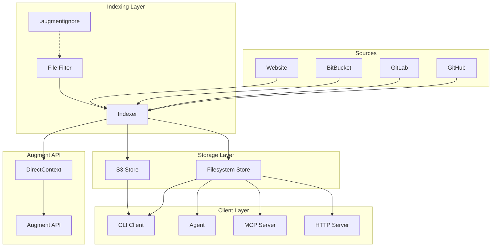
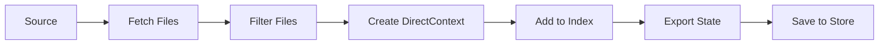
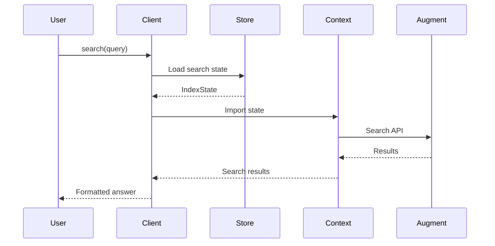
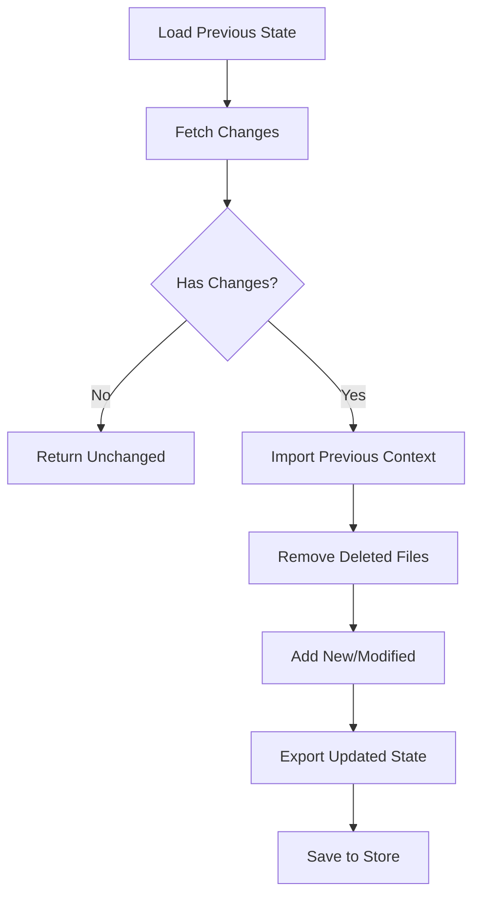

# Project Exploration: context-connectors

## Overview

Context Connectors is an open-source library built on Augment's Context Engine SDK that makes diverse sources searchable across AI agents and applications. It provides a unified interface for indexing code, documentation, runbooks, schemas, and configs from multiple sources (GitHub, GitLab, BitBucket, websites) and exposes them through various clients (CLI, MCP server, programmatic API).

The library enables AI agents to search and retrieve relevant context from indexed repositories, improving their ability to understand and work with specific codebases.

## Repository

- **Location:** `/home/darkvoid/Boxxed/@formulas/src.augmentcode/context-connectors`
- **Remote:** git@github.com:augmentcode/context-connectors
- **Primary Language:** TypeScript
- **License:** MIT

## Directory Structure

```
context-connectors/
├── src/
│   ├── index.ts                          # Main exports
│   ├── bin/
│   │   ├── index.ts                      # CLI entry point
│   │   ├── cmd-index.ts                  # Index command
│   │   ├── cmd-search.ts                 # Search command
│   │   ├── cmd-agent.ts                  # Agent command
│   │   ├── cmd-mcp.ts                    # MCP server command
│   │   └── cmd-local.ts                  # Local commands
│   ├── core/
│   │   ├── indexer.ts                    # Main indexing logic
│   │   ├── file-filter.ts                # File filtering logic
│   │   ├── types.ts                      # Core type definitions
│   │   ├── utils.ts                      # Utility functions
│   │   └── *.test.ts                     # Core tests
│   ├── clients/
│   │   ├── index.ts                      # Client exports
│   │   ├── search-client.ts              # Search API client
│   │   ├── mcp-server.ts                 # MCP server implementation
│   │   ├── mcp-http-server.ts            # HTTP MCP server
│   │   ├── cli-agent.ts                  # CLI agent implementation
│   │   ├── multi-index-runner.ts         # Multi-index agent
│   │   ├── tool-descriptions.ts          # MCP tool definitions
│   │   └── *.test.ts                     # Client tests
│   ├── sources/
│   │   ├── index.ts                      # Source exports
│   │   ├── types.ts                      # Source type definitions
│   │   ├── github.ts                     # GitHub source
│   │   ├── gitlab.ts                     # GitLab source
│   │   ├── bitbucket.ts                  # BitBucket source
│   │   ├── website.ts                    # Website crawler
│   │   └── *.test.ts                     # Source tests
│   ├── integrations/
│   │   ├── index.ts                      # Integration exports
│   │   ├── github-webhook.ts             # GitHub webhook handler
│   │   ├── github-webhook-vercel.ts      # Vercel integration
│   │   ├── github-webhook-express.ts     # Express integration
│   │   └── *.test.ts                     # Integration tests
│   └── stores/
│       ├── index.ts                      # Store exports
│       ├── filesystem.ts                 # Filesystem store
│       ├── s3.ts                         # S3 store
│       └── types.ts                      # Store type definitions
├── package.json                          # Dependencies
├── package-lock.json                     # Lock file
├── tsconfig.json                         # TypeScript config
├── biome.jsonc                           # Biome lint config
├── README.md                             # Documentation
├── LICENSE                               # MIT License
├── .gitignore                            # Git ignore
└── .github/
    └── workflows/
        ├── ci.yml                        # CI pipeline
        ├── publish.yml                   # NPM publish
        └── docs-update-bot.yml           # Docs update automation
```

## Architecture

### High-Level Diagram



### Component Breakdown

#### Indexer (`src/core/indexer.ts`)

**Location:** `src/core/indexer.ts`

**Purpose:** Main orchestrator for indexing operations

**Key Responsibilities:**
- Full indexing (first run or forced)
- Incremental indexing (only changed files)
- DirectContext creation and management
- Progress reporting

**Key Methods:**
```typescript
class Indexer {
  // Main entry point - automatically chooses full or incremental
  async index(source: Source, store: IndexStore, key: string): Promise<IndexResult>

  // Full re-index
  private async fullIndex(...): Promise<IndexResult>

  // Incremental update
  private async incrementalIndex(...): Promise<IndexResult>

  // Add files with progress
  private async addToIndex(context: DirectContext, files: FileEntry[]): Promise<IndexingResult>
}
```

**Indexing Flow:**
```typescript
// 1. Load previous state
const previousState = await store.loadState(key)

// 2. If no state, do full index
if (!previousState) {
  return this.fullIndex(...)
}

// 3. Try incremental
const changes = await source.fetchChanges(previousState.source)
if (changes === null) {
  return this.fullIndex(...)  // Fallback
}

// 4. Apply incremental changes
return this.incrementalIndex(...)
```

#### Sources

All sources implement a common interface:

```typescript
interface Source {
  // Fetch all files for initial index
  fetchAll(): Promise<FileEntry[]>

  // Fetch changes since a previous state
  fetchChanges(previous: SourceState): Promise<FileChanges | null>

  // Get source metadata
  getMetadata(): Promise<SourceMetadata>
}
```

**GitHub Source (`src/sources/github.ts`):**
- Uses Octokit REST API
- Fetches repository contents
- Tracks commits for incremental updates
- Respects `.gitignore`

**GitLab Source (`src/sources/gitlab.ts`):**
- Uses GitLab API v4
- Supports self-hosted instances
- Handles branches, tags, commits

**BitBucket Source (`src/sources/bitbucket.ts`):**
- Supports Cloud and Server/Data Center
- Custom base URL for self-hosted

**Website Source (`src/sources/website.ts`):**
- Crawls static HTML content
- Link-based discovery
- Configurable depth and page limits
- **Limitation:** No JavaScript-rendered content support

#### Stores

**Filesystem Store (`src/stores/filesystem.ts`):**
```typescript
class FilesystemStore {
  constructor(config: { basePath?: string })

  async save(key: string, fullState: IndexState, searchState: IndexStateSearchOnly): Promise<void>
  async loadState(key: string): Promise<IndexState | null>
  async loadSearchState(key: string): Promise<IndexStateSearchOnly | null>
  async delete(key: string): Promise<void>
}
```

**S3 Store (`src/stores/s3.ts`):**
```typescript
class S3Store {
  constructor(config: { bucket: string, endpoint?: string })

  async save(key: string, fullState: IndexState, searchState: IndexStateSearchOnly): Promise<void>
  async loadState(key: string): Promise<IndexState | null>
  async loadSearchState(key: string): Promise<IndexStateSearchOnly | null>
  async delete(key: string): Promise<void>
}
```

#### Search Client (`src/clients/search-client.ts`)

**Purpose:** Query indexed content

**Key Methods:**
```typescript
class SearchClient {
  // Must call before search()
  async initialize(): Promise<void>

  // Search the index
  async search(query: string, options?: SearchOptions): Promise<SearchResult>

  // Get metadata
  getMetadata(): IndexMetadata
}
```

**Important:** Must call `await client.initialize()` before `search()` or it will throw "Client not initialized" error.

#### MCP Server (`src/clients/mcp-server.ts`)

**Purpose:** Expose search via Model Context Protocol

**Tools Exposed:**
- `search`: Search the index
- `list_files`: List files in index
- `read_file`: Read file content

**Usage:**
```typescript
await runMCPServer({
  store: new FilesystemStore(),
  indexName: "my-project",
})
```

#### MCP HTTP Server (`src/clients/mcp-http-server.ts`)

**Purpose:** Remote MCP server over HTTP

**Features:**
- Streamable HTTP transport
- CORS support
- API key authentication
- Graceful shutdown

**Usage:**
```typescript
const server = await runMCPHttpServer({
  store: new FilesystemStore(),
  indexName: "my-project",
  port: 3000,
  host: "0.0.0.0",
  cors: "*",
  apiKey: process.env.MCP_API_KEY,
})
```

## Entry Points

### CLI Commands

#### Index Command
```bash
# GitHub
npx context-connectors index github \
  --owner myorg --repo myrepo \
  -i my-project

# GitLab
npx context-connectors index gitlab \
  --project group/project \
  -i my-project

# BitBucket
npx context-connectors index bitbucket \
  --workspace myworkspace --repo myrepo \
  -i my-project

# Website
npx context-connectors index website \
  --url https://docs.example.com \
  -i my-docs
```

#### Search Command
```bash
# AI-generated answer
npx context-connectors search "authentication logic" -i my-project

# Raw search results
npx context-connectors search "API routes" -i my-project --raw
```

#### Agent Command
```bash
npx context-connectors agent -i my-project --provider openai
```

#### MCP Commands
```bash
# Stdio (Claude Desktop)
npx context-connectors mcp stdio -i my-project

# HTTP server
npx context-connectors mcp http \
  -i my-project \
  --port 8080 \
  --cors "*"
```

## Data Flow

### Indexing Flow



### Search Flow



### Incremental Index Flow



## External Dependencies

| Dependency | Version | Purpose |
|------------|---------|---------|
| @augmentcode/auggie-sdk | Latest | DirectContext API |
| @modelcontextprotocol/sdk | Latest | MCP protocol |
| @octokit/rest | Latest | GitHub API |
| @aws-sdk/client-s3 | Latest | S3 storage |
| express | Latest | HTTP server |
| commander | Latest | CLI framework |

## Configuration

### Environment Variables

| Variable | Description | Required For |
|----------|-------------|--------------|
| `AUGMENT_API_TOKEN` | Augment API token | All operations |
| `AUGMENT_API_URL` | Augment API URL | All operations |
| `GITHUB_TOKEN` | GitHub token | GitHub source |
| `GITLAB_TOKEN` | GitLab token | GitLab source |
| `BITBUCKET_TOKEN` | BitBucket token | BitBucket source |
| `AWS_ACCESS_KEY_ID` | AWS access key | S3 store |
| `AWS_SECRET_ACCESS_KEY` | AWS secret key | S3 store |
| `CC_S3_BUCKET` | S3 bucket name | S3 store |
| `CC_S3_ENDPOINT` | Custom S3 endpoint | S3-compatible storage |
| `CC_S3_FORCE_PATH_STYLE` | Path-style URLs | MinIO, etc. |
| `MCP_API_KEY` | MCP server auth | MCP HTTP server |
| `CONTEXT_CONNECTORS_STORE_PATH` | Custom store path | Optional |

### Default Storage Location

Indexes are stored in `~/.augment/context-connectors/` by default, aligning with other Augment CLI state:
- `~/.augment/session.json` - Authentication
- `~/.augment/settings.json` - Settings
- `~/.augment/rules/` - User rules
- `~/.augment/commands/` - Custom commands

## Filtering

Files are filtered based on:

1. **`.augmentignore`** - Custom patterns (highest priority)
2. **Built-in filters** - Binary files, large files, generated code, secrets
3. **`.gitignore`** - Git ignore patterns

**`.augmentignore` Example:**
```
# Ignore test fixtures
tests/fixtures/

# Ignore generated docs
docs/api/

# Ignore specific files
config.local.json
```

**Important:** The `.augmentignore` file must be in the **source root directory** (the path passed to the add command).

## Testing

```bash
# Run all tests
npm test

# Run specific test file
npm test -- src/core/indexer.test.ts

# Run with coverage
npm test -- --coverage
```

## Key Insights

1. **Incremental Indexing:** The indexer smartly detects changes and only re-indexes what changed, saving time and API calls.

2. **DirectContext Abstraction:** Built on Augment's DirectContext SDK, which handles the actual embedding and search.

3. **Multiple Storage Options:** Supports both filesystem (local development) and S3 (production) storage.

4. **MCP Integration:** Native Model Context Protocol support enables seamless integration with Claude Desktop and other MCP clients.

5. **Security Awareness:** The MCP HTTP server documentation clearly warns about HTTP without TLS and provides multiple secure deployment options.

6. **Webhook Automation:** GitHub webhook integration enables automatic re-indexing on every push.

## Security Considerations

### MCP HTTP Server

**Warning:** The MCP server uses HTTP without TLS by default.

**Recommended Deployments:**
1. **Localhost only** - Safe for development
2. **TLS reverse proxy** - Caddy or nginx with Let's Encrypt
3. **SSH tunneling** - For ad-hoc remote access
4. **Network isolation** - Private VPC with firewall rules

**Always use API key authentication:**
```bash
openssl rand -base64 32  # Generate secure key
export MCP_API_KEY="your-secure-random-key"
```

## GitHub Actions Integration

### Auto-Index on Push

```yaml
name: Index Repository

on:
  push:
    branches: [main]

jobs:
  index:
    runs-on: ubuntu-latest
    steps:
      - uses: actions/checkout@v4
      - uses: actions/setup-node@v4

      - name: Index repository
        run: |
          npx context-connectors index github \
            --owner ${{ github.repository_owner }} \
            --repo ${{ github.event.repository.name }} \
            --ref ${{ github.sha }} \
            -i ${{ github.ref_name }}
        env:
          GITHUB_TOKEN: ${{ secrets.GITHUB_TOKEN }}
          AUGMENT_API_TOKEN: ${{ secrets.AUGMENT_API_TOKEN }}
          AUGMENT_API_URL: ${{ secrets.AUGMENT_API_URL }}
```

### Webhook Integration

**Vercel/Next.js:**
```typescript
// app/api/webhook/route.ts
import { createVercelHandler } from "@augmentcode/context-connectors/integrations/vercel";

export const POST = createVercelHandler({
  store: new S3Store({ bucket: process.env.INDEX_BUCKET! }),
  secret: process.env.GITHUB_WEBHOOK_SECRET!,
  shouldIndex: (event) => event.ref === "refs/heads/main",
})
```

## Open Questions

1. How does DirectContext handle token limits for very large repositories?
2. What is the rate limiting strategy for the Augment API?
3. How are embedding updates handled when file content changes?
4. What is the maximum index size supported?

## Related Projects

- **auggie:** Augment's agentic coding CLI
- **augment-agent:** GitHub Action for AI-powered PR reviews
- **auggie-sdk:** Python SDK for DirectContext
