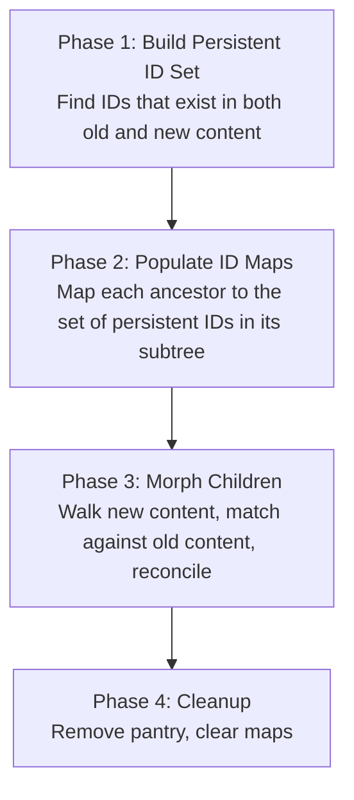
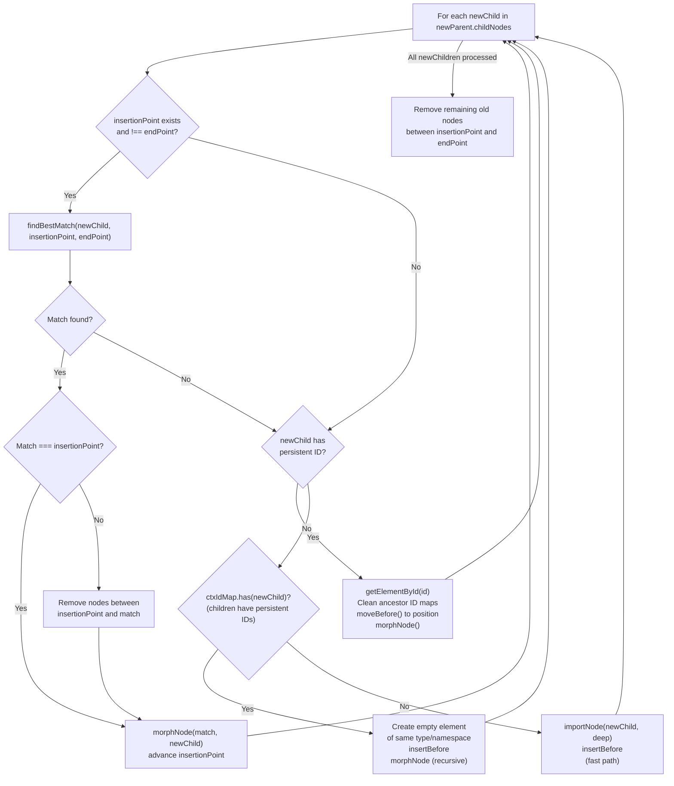
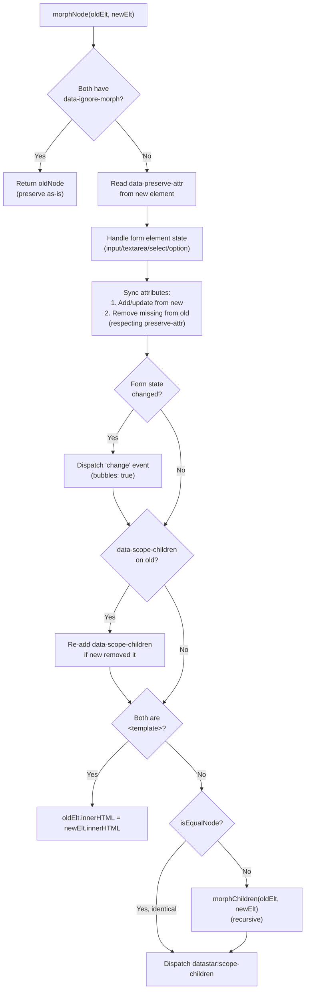

# Deep Dive: The DOM Morphing Algorithm

Datastar includes a complete DOM morphing algorithm built directly into the `patchElements` watcher plugin. It's a single-file, ~710-line implementation that handles HTML parsing, element matching, node reconciliation, and state preservation. It draws inspiration from [morphdom](https://github.com/patrick-steele-idem/morphdom) and [idiomorph](https://github.com/bigskysoftware/idiomorph), but is custom-written with Datastar-specific features like the pantry pattern and `data-preserve-attr` support.

This document walks through the algorithm from the moment a server sends HTML to the moment the DOM is updated.

---

## 1. Entry: From SSE Event to `morph()`

### 1.1 The Watcher Receives HTML

When the server sends:
```
event: datastar-patch-elements
data: elements <div id="counter"><span>42</span></div>
```

The `patchElements` watcher receives the parsed arguments:
```typescript
{ selector: '', mode: 'outer', namespace: 'html', elements: '<div id="counter">...' }
```

### 1.2 HTML Parsing

The raw HTML string is parsed into a `DocumentFragment` via `DOMParser`:

```typescript
// patchElements.ts:100-105
const newDocument = new DOMParser().parseFromString(
  hasHtml || hasHead || hasBody
    ? elements
    : `<body><template>${wrappedEls}</template></body>`,
  'text/html',
)
```

The `<template>` wrapper is critical — without it, `DOMParser` normalizes HTML according to browser rules (auto-closing tags, moving elements, etc.). Wrapping in `<template>` preserves the content as-is because `<template>` content is an inert `DocumentFragment`.

**Namespace handling:** SVG and MathML elements need their correct namespace to render properly. When `namespace: 'svg'`, elements are wrapped in `<svg>...</svg>` before parsing, then the SVG wrapper is unwrapped:

```typescript
// patchElements.ts:94-98
const wrapperTag = namespace === 'svg' ? 'svg' : namespace === 'mathml' ? 'math' : ''
const wrappedEls = wrapperTag ? `<${wrapperTag}>${elements}</${wrapperTag}>` : elements
```

**Full-document detection:** SVGs are stripped before checking for `<html>`, `<head>`, `<body>` tags (since SVGs can contain arbitrary XML that might false-positive these checks). When a full document or document-level element is detected, it's parsed directly without template wrapping.

### 1.3 Target Resolution

**Without selector (outer/replace mode):** Each child element in the parsed content is matched to a target by ID:

```typescript
// patchElements.ts:134-155
if (!selector && (mode === 'outer' || mode === 'replace')) {
  for (const child of newContent.children) {
    let target: Element
    if (child instanceof HTMLHtmlElement)      target = document.documentElement
    else if (child instanceof HTMLBodyElement)  target = document.body
    else if (child instanceof HTMLHeadElement)  target = document.head
    else                                        target = document.getElementById(child.id)!
    applyToTargets(mode, child, [target], consume)
  }
}
```

This is why the SDK spec requires elements in `outer` mode to have IDs — they're the addressing mechanism.

**With selector:** Standard `querySelectorAll`:
```typescript
const targets = document.querySelectorAll(selector)
```

### 1.4 Mode Dispatch

```typescript
// patchElements.ts:216-253
switch (mode) {
  case 'remove':    target.remove()
  case 'outer':     morph(target, newContent, 'outer')    // ← full morphing
  case 'inner':     morph(target, newContent, 'inner')    // ← full morphing
  case 'replace':   target.replaceWith(newContent)        // ← no morphing (destroys state)
  case 'prepend':   target.prepend(newContent)            // ← no morphing (additive)
  case 'append':    target.append(newContent)             // ← no morphing (additive)
  case 'before':    target.before(newContent)             // ← no morphing (additive)
  case 'after':     target.after(newContent)              // ← no morphing (additive)
}
```

Only `outer` and `inner` modes use the morphing algorithm. The other modes either destroy/remove or simply append — they don't need reconciliation.

The `consume` flag controls whether the element is moved (consumed from the fragment) or cloned for each target when a selector matches multiple elements.

---

## 2. The Morphing Algorithm

### 2.1 Overview

The morph has four phases:



### 2.2 Phase 1: Persistent ID Set (`morph()` lines 285-317)

The algorithm first computes which IDs are "persistent" — they exist in both old and new content with the same tag name.

```typescript
// Step 1: Collect all IDs from old content
const oldIdElements = oldElt.querySelectorAll('[id]')
for (const { id, tagName } of oldIdElements) {
  if (oldIdTagNameMap.has(id)) duplicateIds.add(id)   // duplicate in old → exclude
  else oldIdTagNameMap.set(id, tagName)
}

// Step 2: Find intersection with new content
const newIdElements = normalizedElt.querySelectorAll('[id]')
for (const { id, tagName } of newIdElements) {
  if (ctxPersistentIds.has(id)) duplicateIds.add(id)  // duplicate in new → exclude
  else if (oldIdTagNameMap.get(id) === tagName) {
    ctxPersistentIds.add(id)                           // same ID + same tag → persistent
  }
}

// Step 3: Remove duplicates from persistent set
for (const id of duplicateIds) ctxPersistentIds.delete(id)
```

**Why tag name matters:** An ID that maps to a `<div>` in old content and a `<span>` in new content can't be morphed — the element type changed. Excluding it from the persistent set means the old element will be removed and the new one created fresh.

**Why duplicates are excluded:** Duplicate IDs are technically invalid HTML but occur in practice. The algorithm can't reason about which duplicate is "the right one," so it treats all copies as non-persistent.

### 2.3 Phase 2: ID Map Population (`populateIdMapWithTree()`)

For each persistent ID, the algorithm walks up the ancestor chain and annotates each ancestor with the persistent IDs in its subtree:

```typescript
// patchElements.ts:689-708
const populateIdMapWithTree = (root, elements) => {
  for (const elt of elements) {
    if (ctxPersistentIds.has(elt.id)) {
      let current = elt
      while (current && current !== root) {
        let idSet = ctxIdMap.get(current)
        if (!idSet) {
          idSet = new Set()
          ctxIdMap.set(current, idSet)
        }
        idSet.add(elt.id)
        current = current.parentElement
      }
    }
  }
}
```

This produces a `Map<Node, Set<string>>` where each node maps to the set of persistent IDs contained anywhere in its subtree.

**Example:**
```html
<!-- Old DOM -->
<ul>                    ← idSet: {"item-1", "item-2", "item-3"}
  <li id="item-1">     ← idSet: {"item-1"}
  <li id="item-2">     ← idSet: {"item-2"}
  <li id="item-3">     ← idSet: {"item-3"}
</ul>

<!-- New content -->
<ul>                    ← idSet: {"item-2", "item-1"}
  <li id="item-2">     ← idSet: {"item-2"}
  <li id="item-1">     ← idSet: {"item-1"}
</ul>
```

This map is what makes the algorithm smarter than a naive positional diff — it can detect that `item-2` moved up and `item-3` was removed, rather than treating every position as changed.

### 2.4 Phase 3: The Core — `morphChildren()`

This is the main reconciliation loop. It walks the new content's children left to right, and for each new child, tries to find the best matching old child.



#### Case 1: Match Found in Scan Range

`findBestMatch()` scans forward from `insertionPoint` looking for a match. If found, any nodes between `insertionPoint` and the match are removed (they don't exist in new content), then the match is morphed in place.

#### Case 2: Persistent ID Element Not in Scan Range

If `newChild` has a persistent ID but wasn't found by the forward scan, it might be elsewhere in the document (or in the pantry). The algorithm uses `getElementById()` to find it, cleans it from ancestor ID maps (to prevent the ancestors from being pantried instead of removed), then uses `moveBefore()` to relocate it.

```typescript
// patchElements.ts:380-399
const movedChild = document.getElementById(newChild.id) as Element

// Clean ancestor ID maps
let current = movedChild
while ((current = current.parentNode as Element)) {
  const idSet = ctxIdMap.get(current)
  if (idSet) {
    idSet.delete(newChild.id)
    if (!idSet.size) ctxIdMap.delete(current)
  }
}

moveBefore(oldParent, movedChild, insertionPoint)
morphNode(movedChild, newChild)
```

#### Case 3: New Element with Persistent ID Children

If the new element doesn't itself have a persistent ID but its subtree contains elements with persistent IDs, a dummy element of the same type is created and then morphed against the new content. This recursively applies the matching algorithm, which will eventually find and move the persistent children.

```typescript
// patchElements.ts:408-415
const newEmptyChild = document.createElement(tagName)
oldParent.insertBefore(newEmptyChild, insertionPoint)
morphNode(newEmptyChild, newChild)  // ← recursive morph fills the empty shell
```

#### Case 4: Pure New Element (Fast Path)

If neither the element nor any of its descendants have persistent IDs, there's no state to preserve. The element is deep-cloned and inserted directly — no morphing needed.

```typescript
// patchElements.ts:418-420
const newClonedChild = document.importNode(newChild, true)
oldParent.insertBefore(newClonedChild, insertionPoint)
```

`importNode` is used instead of `cloneNode` to avoid mutating `newParent` (since `appendChild` would move the node).

### 2.5 The Matching Algorithm: `findBestMatch()`

The scanner uses a priority system:

```
Priority 1 (highest): ID Set Match
  - Both old and new nodes are soft-match compatible (same type + tag + compatible ID)
  - AND their subtree ID sets overlap (they share a persistent ID)
  → Return immediately

Priority 2: Soft Match (fallback)
  - Same nodeType + tagName
  - Old node has no ID, or old ID matches new ID
  - Old node has no pending ID set matches (not reserved for a future ID match)
  → Saved as bestMatch, returned if no ID set match found

Not a match:
  - Different nodeType or tagName
  - Old node has an ID that differs from new node's ID
```

**Anti-churn protection:** When scanning, the algorithm also checks if upcoming new siblings would soft-match the current old node. If 2+ future siblings would match, it blocks the current soft match to prevent unnecessary DOM churn when an element is prepended to a list:

```typescript
// patchElements.ts:493-505
if (bestMatch === null && nextSibling && isSoftMatch(cursor, nextSibling)) {
  siblingSoftMatchCount++
  nextSibling = nextSibling.nextSibling
  if (siblingSoftMatchCount >= 2) {
    bestMatch = undefined  // block soft matching for this node
  }
}
```

**Example of anti-churn:**
```html
<!-- Old -->              <!-- New -->
<li>Item A</li>          <li>NEW ITEM</li>      ← no match (insert new)
<li>Item B</li>          <li>Item A</li>         ← soft match with old Item A
<li>Item C</li>          <li>Item B</li>         ← soft match with old Item B
                         <li>Item C</li>         ← soft match with old Item C
```

Without anti-churn: `NEW ITEM` would soft-match `Item A`, causing A→B→C to all cascade and morph.
With anti-churn: The algorithm sees that the next 2 siblings (`Item A`, `Item B`) soft-match future old nodes, so it skips the soft match and instead inserts `NEW ITEM` as a new node. A, B, C stay in place.

**Displacement limit:** The scan also tracks how many persistent IDs would be "displaced" (skipped over) to reach a potential match. If the displacement exceeds the new node's own ID count, the search is aborted:

```typescript
// patchElements.ts:486-491
displaceMatchCount += ctxIdMap.get(cursor)?.size || 0
if (displaceMatchCount > nodeMatchCount) break
```

This prevents the algorithm from scanning the entire sibling list looking for a match that would require rearranging too many elements.

### 2.6 `isSoftMatch()` — The Compatibility Check

```typescript
const isSoftMatch = (oldNode: Node, newNode: Node): boolean =>
  oldNode.nodeType === newNode.nodeType &&           // same type (element, text, comment)
  (oldNode as Element).tagName === (newNode as Element).tagName &&  // same tag
  (!(oldNode as Element).id ||                       // old has no ID...
    (oldNode as Element).id === (newNode as Element).id)  // ...or IDs match
```

The asymmetry is intentional: an old node with no ID can match a new node with an ID (the new ID will be added during morphing). But an old node with a *different* ID is never soft-matched — it would lose its identity.

---

## 3. The Pantry Pattern

### 3.1 The Problem

During morphing, old nodes that don't match may need to be removed. But some of those "removed" nodes contain persistent IDs that will be needed later (e.g., when `morphChildren` processes a later new child that references that ID).

If we `removeChild()` immediately, the element is gone from the DOM and `getElementById()` won't find it.

### 3.2 The Solution

```typescript
const ctxPantry = document.createElement('div')
ctxPantry.hidden = true

const removeNode = (node: Node): void => {
  ctxIdMap.has(node)
    ? moveBefore(ctxPantry, node, null)   // park it in the pantry
    : node.parentNode?.removeChild(node)   // actually remove it
}
```

The pantry is a hidden `<div>` temporarily inserted after `<body>`:
```typescript
document.body.insertAdjacentElement('afterend', ctxPantry)
```

Nodes moved to the pantry are still in the document, so `getElementById()` will find them. After morphing completes, the pantry is removed:
```typescript
ctxPantry.remove()
```

### 3.3 Why After `<body>` and Not Inside?

If the pantry were inside `<body>`, the MutationObserver would fire for nodes being moved in/out of it, potentially triggering attribute processing and cleanup hooks. Placing it after `<body>` (as a sibling of `<body>`, child of `<html>`) keeps it in the document tree for `getElementById` purposes but outside the observed subtree.

### 3.4 Ancestor ID Map Cleanup

When a node is moved from the "future" (a later position in old content) to an earlier position via `getElementById`, its ancestors' ID maps must be cleaned up:

```typescript
let current = movedChild
while ((current = current.parentNode as Element)) {
  const idSet = ctxIdMap.get(current)
  if (idSet) {
    idSet.delete(newChild.id)
    if (!idSet.size) ctxIdMap.delete(current)
  }
}
```

Without this, the erstwhile ancestors would still appear to contain persistent IDs and would be pantried instead of removed, preventing their removal hooks (MutationObserver callbacks, cleanup functions) from firing.

---

## 4. Node Morphing: `morphNode()`

Once two nodes are matched, `morphNode()` synchronizes the old node to match the new one without destroying the old DOM node:

### 4.1 Element Nodes (nodeType === 1)



### 4.2 Text and Comment Nodes (nodeType === 3 or 8)

Simply update `nodeValue` if different:
```typescript
if (oldNode.nodeValue !== newNode.nodeValue) {
  oldNode.nodeValue = newNode.nodeValue
}
```

### 4.3 The `isEqualNode` Optimization

Before recursing into children, the algorithm checks `oldElt.isEqualNode(newElt)`. If the elements are structurally identical (same attributes, same children, same text), the entire subtree is skipped. This is a significant optimization for large DOMs where only a small region changed.

---

## 5. The `moveBefore` API

```typescript
const moveBefore: (parentNode: Node, node: Node, after: Node | null) => void =
  removeNode.call.bind(ctxPantry.moveBefore ?? ctxPantry.insertBefore)
```

`moveBefore()` is a proposed DOM API (currently behind flags in Chromium) that moves an element without destroying and recreating it. Unlike `insertBefore` (which triggers disconnect/reconnect lifecycle), `moveBefore` preserves:
- Iframe content and navigation state
- CSS animations and transitions mid-flight
- Web component connected/disconnected callback suppression
- `<video>`/`<audio>` playback state

The implementation uses `call.bind()` as a one-time feature detection: if `ctxPantry.moveBefore` exists, bind to it; otherwise fall back to `ctxPantry.insertBefore`.

---

## 6. Script Handling

### 6.1 The Problem

When HTML containing `<script>` tags is morphed into the DOM via `innerHTML`, `setAttribute`, or morph algorithms, the scripts don't execute. The browser only runs scripts that are freshly created and inserted via `createElement` + `appendChild`.

### 6.2 The Solution

```typescript
const scripts = new WeakSet<HTMLScriptElement>()
for (const script of document.querySelectorAll('script')) {
  scripts.add(script)  // pre-populate with existing scripts
}

const execute = (target: Element): void => {
  const elScripts = target instanceof HTMLScriptElement
    ? [target]
    : target.querySelectorAll('script')
  for (const old of elScripts) {
    if (!scripts.has(old)) {
      const script = document.createElement('script')
      for (const { name, value } of old.attributes) {
        script.setAttribute(name, value)
      }
      script.text = old.text
      old.replaceWith(script)       // swap in the fresh script → executes
      scripts.add(script)           // track it so it won't re-execute
    }
  }
}
```

The `WeakSet` tracks every script that has already been processed. On morph, any new script elements are replaced with fresh clones (which triggers execution), and then tracked. The `WeakSet` ensures that if the same region is morphed again, already-executed scripts aren't re-run.

### 6.3 Server-Side `ExecuteScript()`

The SDK's `ExecuteScript()` method is implemented as a `PatchElements` event that appends a `<script>` tag to the body. Auto-removal is handled by attaching `data-effect="el.remove()"` to the script tag — the Datastar effect system runs and the script element removes itself from the DOM after execution.

---

## 7. Patch Modes In Detail

### 7.1 `outer` (default)

Morphs the entire target element, including its tag, attributes, and children. The target element itself is preserved (same DOM node), but synchronized to match the new content.

```
Old: <div id="x" class="old"><span>old</span></div>
New: <div id="x" class="new"><span>new</span></div>
Result: Same <div> node, class changed, <span> text morphed
```

`morphChildren` receives `(parent, normalizedElt, oldElt, oldElt.nextSibling)` — it morphs within the parent's children, using the old element as the insertion point and its next sibling as the endpoint.

### 7.2 `inner`

Morphs only the children of the target element, leaving the target's own tag and attributes untouched.

```
Old: <div id="x" class="keep-this"><span>old</span></div>
New: <span>new</span><p>extra</p>
Result: <div id="x" class="keep-this"><span>new</span><p>extra</p></div>
```

`morphChildren` receives `(oldElt, normalizedElt, null, null)` — it morphs all children of the old element.

### 7.3 `replace`

Completely destroys the old element and replaces it with the new content. No morphing, no state preservation. Uses `target.replaceWith(newContent)`.

### 7.4 `prepend` / `append` / `before` / `after`

Additive modes that don't touch existing content. They insert the new content at the specified position using the corresponding DOM methods. Cloning is used when the selector matches multiple targets (so each target gets its own copy).

### 7.5 `remove`

Removes the target element(s) from the DOM. No new content is needed:

```
event: datastar-patch-elements
data: selector #notification-42
data: mode remove
```

---

## 8. View Transitions Integration

When `useViewTransition: true` is set and the browser supports the View Transitions API:

```typescript
if (supportsViewTransitions && args2.useViewTransition) {
  document.startViewTransition(() => onPatchElements(ctx, args2))
} else {
  onPatchElements(ctx, args2)
}
```

`document.startViewTransition()` captures a screenshot of the current state, then runs the callback (which performs the morph), then animates between the old screenshot and the new DOM state. This enables smooth cross-fade, slide, and other transition effects on server-driven updates with zero client-side animation code.

The `supportsViewTransitions` check is a simple feature detection:
```typescript
export const supportsViewTransitions = !!document.startViewTransition
```

---

## 9. The `data-ignore-morph` Escape Hatch

Elements annotated with `data-ignore-morph` (or its aliased form) are completely skipped during morphing:

```typescript
const aliasedIgnoreMorph = aliasify('ignore-morph')
const aliasedIgnoreMorphAttr = `[${aliasedIgnoreMorph}]`

// In morph():
if (
  oldElt.hasAttribute(aliasedIgnoreMorph) && newElt.hasAttribute(aliasedIgnoreMorph)
) return  // skip

// Also skip if any ancestor has it:
if (oldElt.parentElement?.closest(aliasedIgnoreMorphAttr)) return
```

Both old and new elements must carry the attribute — this prevents accidental preservation when the server intentionally wants to replace content.

Use cases:
- Third-party widgets (maps, rich text editors) that manage their own DOM
- Video players or canvases that would lose state on morph
- Elements with complex internal state not captured by attributes

---

## 10. The `data-scope-children` Feature

When an element has `data-scope-children`, the morph algorithm preserves this marker even if the incoming markup doesn't carry it:

```typescript
const shouldScopeChildren = oldElt.hasAttribute('data-scope-children')
// ... after morphing ...
if (shouldScopeChildren && !oldElt.hasAttribute('data-scope-children')) {
  oldElt.setAttribute('data-scope-children', '')
}
```

After morphing, a non-bubbling custom event is dispatched:
```typescript
oldElt.dispatchEvent(new CustomEvent('datastar:scope-children', { bubbles: false }))
```

This allows parent components to react to child content changes without the event propagating up and triggering unrelated handlers.

---

## 11. Module-Level State

The morphing algorithm uses module-level (singleton) data structures, reused across calls:

```typescript
const ctxIdMap = new Map<Node, Set<string>>()     // node → persistent IDs in subtree
const ctxPersistentIds = new Set<string>()          // IDs in both old and new
const oldIdTagNameMap = new Map<string, string>()   // ID → tagName (temp, cleared per call)
const duplicateIds = new Set<string>()              // IDs appearing >1 time
const ctxPantry = document.createElement('div')     // hidden parking lot
```

These are cleared at the start of each `morph()` call. Using module-level state avoids allocation churn — these structures would otherwise be created and GC'd on every morph operation. This is a deliberate performance optimization: Datastar expects frequent morphing (every SSE event), so reducing GC pressure matters.

---

## 12. Algorithmic Complexity

| Operation | Complexity | Notes |
|-----------|-----------|-------|
| Persistent ID computation | O(n) | Two querySelectorAll + set intersection |
| ID map population | O(n × d) | n = persistent IDs, d = tree depth |
| `morphChildren` | O(n × m) worst case | n = new children, m = old children (forward scan) |
| `findBestMatch` | O(m) per call | Forward scan with early termination |
| `morphNode` | O(a) | a = number of attributes |
| Overall `morph()` | O(n × m + a) | Dominated by child matching |

In practice, the algorithm is fast because:
1. ID set matches terminate the search immediately
2. Soft matches without IDs return immediately when the new node has no IDs
3. The displacement limit bounds the forward scan
4. `isEqualNode` skips unchanged subtrees entirely
5. The fast path (clone + insert) avoids recursion for new elements without persistent IDs
