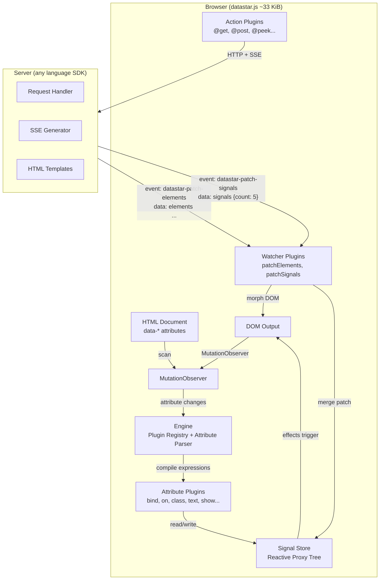
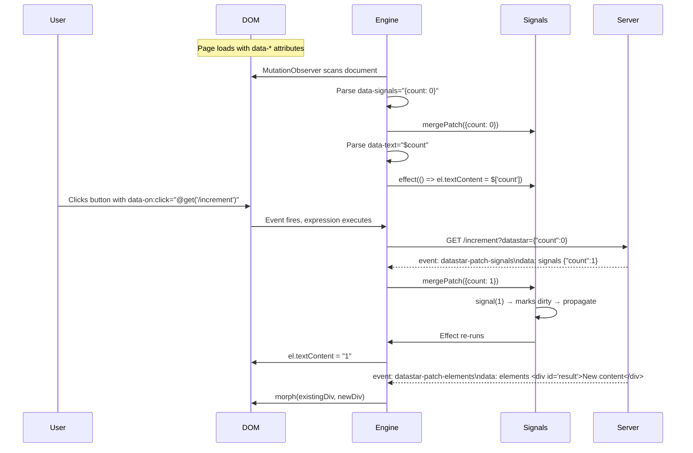

# Project Exploration: Datastar

## Overview

Datastar is a lightweight (~11 KiB minified), hypermedia-driven UI framework that uses declarative `data-*` HTML attributes to build reactive web applications. It follows the "Hypermedia On Whatever you'd Like" (HOWL) philosophy — the server owns the state and pushes UI updates to the browser via Server-Sent Events (SSE). The browser side is a thin reactive runtime that processes `data-*` attributes on the DOM.

Unlike traditional SPA frameworks (React, Vue, Svelte) that move state and rendering to the client, Datastar keeps application logic on the server. The browser acts as a reactive rendering surface. The server sends HTML fragments and signal patches over SSE; the browser's reactive engine morphs the DOM and updates signal values in response. This is a fundamentally different architecture from virtual-DOM diffing — there is no component tree, no client-side routing, no build step required for the HTML.

The project provides a TypeScript browser library (the reactive engine + plugins) and server-side SDKs in 10+ languages (Go, Rust, Python, TypeScript, .NET, PHP, Ruby, Java, Clojure, Haskell) that implement the SSE event protocol.

## Repository

- **Location:** `/home/darkvoid/Boxxed/@formulas/src.UIFrameworks/src.starfederation/datastar`
- **Remote:** `git@github.com:starfederation/datastar.git`
- **Primary Language:** TypeScript (browser), Go (reference SDK)
- **License:** MIT

## Directory Structure

```
datastar/
├── README.md                     # Project overview and CDN links
├── CHANGELOG.md                  # Links to GitHub releases
├── CONTRIBUTING.md               # Contribution guidelines (PRs to develop branch)
├── LICENSE.md                    # MIT license
├── biome.json                    # Biome linter/formatter config
├── Taskfile.yml                  # Build task definitions (pnpm build)
├── library/                      # Browser-side TypeScript library
│   ├── tsconfig.json             # TS config: ES2021 target, ESNext modules, path aliases
│   └── src/
│       ├── globals.d.ts          # Type declarations
│       ├── engine/               # Core reactive engine
│       │   ├── consts.ts         # Event name constants, prefix strings
│       │   ├── types.ts          # Core type definitions
│       │   ├── signals.ts        # Reactive signal system (alien-signals inspired)
│       │   └── engine.ts         # Plugin registry, attribute parsing, MutationObserver
│       ├── plugins/
│       │   ├── actions/          # Action plugins (@get, @post, @peek, etc.)
│       │   │   ├── fetch.ts      # HTTP/SSE fetch actions (get/post/put/patch/delete)
│       │   │   ├── peek.ts       # Read signals without subscribing
│       │   │   ├── setAll.ts     # Bulk signal setter
│       │   │   └── toggleAll.ts  # Bulk boolean toggle
│       │   ├── attributes/       # Attribute plugins (data-* processors)
│       │   │   ├── attr.ts       # data-attr: set HTML attributes reactively
│       │   │   ├── bind.ts       # data-bind: two-way form binding
│       │   │   ├── class.ts      # data-class: conditional CSS classes
│       │   │   ├── computed.ts   # data-computed: derived signal values
│       │   │   ├── effect.ts     # data-effect: reactive side effects
│       │   │   ├── indicator.ts  # data-indicator: fetch state tracking
│       │   │   ├── init.ts       # data-init: run on element mount
│       │   │   ├── jsonSignals.ts # data-json-signals: debug signal output
│       │   │   ├── on.ts         # data-on: event listeners with modifiers
│       │   │   ├── onIntersect.ts # data-on-intersect: IntersectionObserver
│       │   │   ├── onInterval.ts # data-on-interval: setInterval wrapper
│       │   │   ├── onSignalPatch.ts # data-on-signal-patch: react to signal changes
│       │   │   ├── ref.ts        # data-ref: element references as signals
│       │   │   ├── show.ts       # data-show: display toggle
│       │   │   ├── signals.ts    # data-signals: initialize signals from HTML
│       │   │   ├── style.ts      # data-style: reactive inline styles
│       │   │   └── text.ts       # data-text: reactive text content
│       │   └── watchers/         # Watcher plugins (SSE event handlers)
│       │       ├── patchElements.ts  # DOM morphing from server HTML
│       │       └── patchSignals.ts   # Signal patching from server JSON
│       ├── utils/                # Utility functions
│       │   ├── dom.ts            # isHTMLOrSVG type guard
│       │   ├── math.ts           # clamp, lerp, fit
│       │   ├── paths.ts          # isPojo, pathToObj, updateLeaves
│       │   ├── polyfills.ts      # hasOwn polyfill
│       │   ├── tags.ts           # tagToMs, tagHas, tagFirst
│       │   ├── text.ts           # Case conversion, JSON parsing, aliasing
│       │   ├── timing.ts         # delay, throttle, debounce
│       │   └── view-transitions.ts # View Transitions API wrapper
│       └── bundles/              # Entry point bundles
│           ├── datastar-core.ts  # Core API only (signals, computed, effect)
│           ├── datastar.ts       # Full bundle with all plugins
│           └── datastar-aliased.ts # Full bundle with CSS selector aliasing
├── bundles/                      # Pre-built JS output
│   ├── datastar-core.js          # ~10 KiB core
│   ├── datastar.js               # ~33 KiB full
│   └── datastar-aliased.js       # ~33 KiB aliased
├── sdk/                          # Server-side SDK specification
│   ├── ADR.md                    # Architecture Decision Record (the protocol spec)
│   ├── README.md                 # SDK directory index
│   ├── datastar-sdk-config-v1.json    # SDK config (defaults, enums)
│   ├── datastar-sdk-config-v1.schema.json # JSON Schema for config
│   ├── tests/                    # Go-based conformance test suite
│   └── {go,rust,python,...}/     # SDK stubs (moved to separate repos)
└── tools/                        # IDE extensions
    ├── intellij-plugin/          # IntelliJ/WebStorm attribute completion
    └── vscode-extension/         # VS Code attribute completion
```

## Architecture

### High-Level Diagram



### Component Breakdown

#### Core Engine (`library/src/engine/engine.ts`)

- **Location:** `library/src/engine/engine.ts`
- **Purpose:** Central orchestrator. Registers plugins, parses `data-*` attributes, compiles expressions, manages cleanup lifecycle.
- **Key mechanisms:**
  - Three plugin registries: `actionPlugins`, `attributePlugins`, `watcherPlugins`
  - `MutationObserver` on `document.documentElement` watching subtree, childList, attributes
  - `parseAttributeKey()` parses `data-{plugin}:{key}__{mod1}.{tag1}__{mod2}` format
  - `genRx()` compiles attribute value expressions into JavaScript functions with signal binding
  - Cleanup tracking via `removals` Map: Element → attrKey → cleanupName → fn

#### Reactive Signal System (`library/src/engine/signals.ts`)

- **Location:** `library/src/engine/signals.ts`
- **Purpose:** Fine-grained reactive state management with automatic dependency tracking
- **Dependencies:** None (self-contained reactivity primitives)
- **Dependents:** Every plugin reads/writes signals through the `root` store

#### Fetch Action (`library/src/plugins/actions/fetch.ts`)

- **Location:** `library/src/plugins/actions/fetch.ts`
- **Purpose:** HTTP requests with SSE stream parsing, retry logic, abort handling
- **Dependencies:** Engine (action registration), Signals (payload filtering)
- **Dependents:** All server communication flows through this

#### DOM Morpher (`library/src/plugins/watchers/patchElements.ts`)

- **Location:** `library/src/plugins/watchers/patchElements.ts`
- **Purpose:** Receives HTML from server, morphs it into existing DOM preserving state
- **Dependencies:** Engine (watcher registration)
- **Key feature:** ID-based matching algorithm that preserves input focus, form state, scroll position

#### Signal Patcher (`library/src/plugins/watchers/patchSignals.ts`)

- **Location:** `library/src/plugins/watchers/patchSignals.ts`
- **Purpose:** Receives JSON from server, merges into reactive signal store
- **Dependencies:** Engine (watcher registration), Signals (`mergePatch`)

## Entry Points

### Browser Initialization

- **File:** `library/src/bundles/datastar.ts`
- **Description:** Importing the bundle registers all plugins; the engine auto-starts
- **Flow:**
  1. Each plugin file calls `attribute()`, `action()`, or `watcher()` at module scope
  2. `attribute()` queues plugins and schedules `setTimeout(() => applyQueued())`
  3. `applyQueued()` scans entire DOM for `data-*` attributes
  4. `MutationObserver` starts watching for future DOM/attribute changes
  5. No explicit `.init()` call needed — just include the `<script>` tag

### Server SSE Response

- **File:** SDK implementations (e.g., Go, Rust, Python)
- **Description:** Server receives HTTP request, returns `text/event-stream` response
- **Flow:**
  1. Browser calls `@get('/api/counter')` (fetch action)
  2. Server handler opens SSE stream with proper headers
  3. Server sends events like `PatchElements()` or `PatchSignals()`
  4. Browser's fetch action parses SSE stream, dispatches to watchers
  5. Watchers morph DOM or merge signal patches

## Data Flow

See [Rendering & Signals Deep Dive](./rendering-signals-deep-dive.md) for the complete reactive pipeline and SSE protocol details.



## External Dependencies

| Dependency | Version | Purpose |
|------------|---------|---------|
| Biome | (dev) | Linting and formatting |
| pnpm | (dev) | Package management |
| Taskfile | (dev) | Build orchestration |

The browser library has **zero runtime dependencies**. The reactive system, SSE parser, and DOM morpher are all implemented from scratch.

## Configuration

### TypeScript (`library/tsconfig.json`)
- Target: ES2021
- Module: ESNext with bundler resolution
- Path aliases: `@engine`, `@plugins`, `@utils`, `@pro`
- Strict mode enabled

### Build (`Taskfile.yml`)
- `task library` → `pnpm i && pnpm build` in `library/` directory
- Sources: `**/*.ts`, `**/*.js`, `**/*.json`
- Generates: `dist/**/*`

### SDK Config (`sdk/datastar-sdk-config-v1.json`)
- Default SSE retry: 1000ms
- Default element patch mode: `outer`
- Default view transitions: disabled
- Signal data key: `datastar` (query param for GET, body key for POST)

## Testing

- **SDK conformance tests:** `sdk/tests/` — Go-based test runner that validates SSE output
- **Golden file tests:** `sdk/tests/golden/{get,post}/*/input.json` + `output.txt`
- **Test runner CLI:** `go run github.com/starfederation/datastar/sdk/tests/cmd/datastar-sdk-tests@latest`
- Tests cover: element patching (all 8 modes), signal patching, script execution, multiline content, multiple events, signal reading from request body

## Key Insights

- **Zero client-side build step**: Include a `<script>` tag and write `data-*` attributes. No JSX, no compilation, no virtual DOM.
- **Server-driven architecture**: The server is the source of truth. It sends HTML and JSON over SSE. The browser is a thin reactive rendering surface.
- **The signal system is alien-signals**: The reactive core uses a doubly-linked-list dependency graph with bitflag-based dirty tracking — the same approach as the `alien-signals` library. It's highly optimized for fine-grained updates.
- **Deep reactivity via Proxy**: The `root` signal store wraps nested objects in ES6 Proxies that auto-create signals for new properties. Setting `root.user.name = "Alice"` automatically creates reactive signals at each level.
- **Built-in DOM morphing**: The `patchElements` watcher includes a full morphing algorithm (inspired by idiomorph/morphdom) that does ID-based matching, preserves form state, handles `<template>` elements, and supports the `moveBefore` API.
- **SSE, not WebSockets**: Deliberate architectural choice. SSE is simpler, works over HTTP/2 multiplexing, supports automatic reconnection, and is sufficient for server→client push.
- **Plugin architecture is dead simple**: An attribute plugin is `{ name, apply(ctx) }`. An action is `{ name, apply(ctx, ...args) }`. A watcher is `{ name, apply(ctx, args) }`. Everything registers at module scope.
- **Expression compilation**: `$count` becomes `$['count']`, `@get(url)` becomes `__action("get", evt, url)`. Expressions are compiled once into `Function()` constructors and cached.

## Open Questions

- The morph algorithm doesn't currently handle Shadow DOM roots properly (TODO comment in engine.ts about per-root MutationObservers)
- View Transitions API integration is present but marked as still maturing
- The `data-scope-children` feature for scoped reactivity appears to be relatively new
- Performance characteristics under very large DOM trees with many reactive bindings aren't documented
