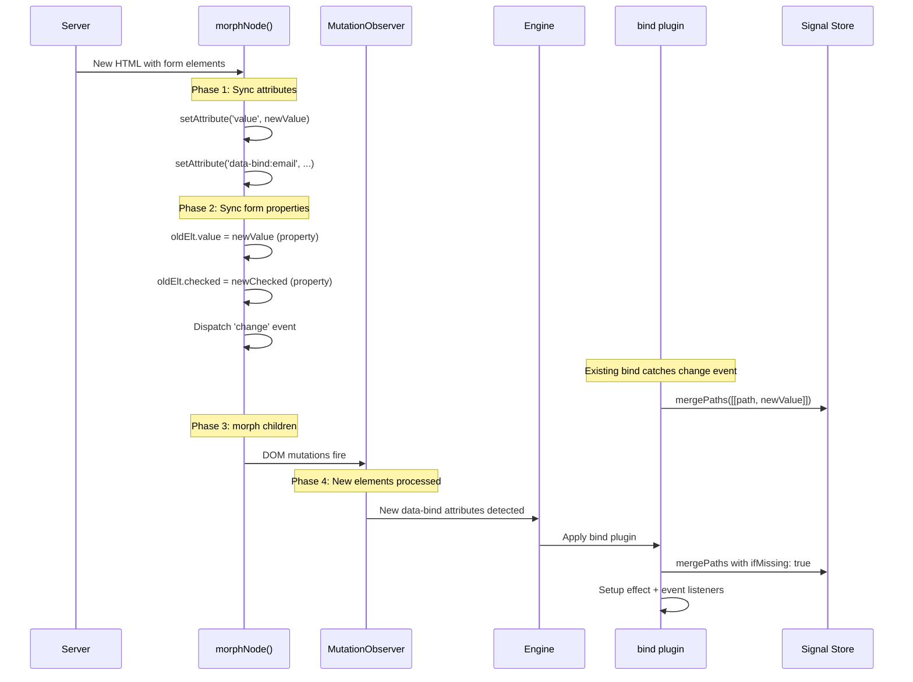

# Deep Dive: Form State Preservation

Form state is the most fragile part of any DOM manipulation. Users type into inputs, check boxes, select options, upload files — and all of that state exists only as live DOM properties, not as HTML attributes. A naive `innerHTML` replacement destroys it all. Datastar solves this at two levels: the **morph algorithm** preserves form state during server-driven DOM updates, and the **bind plugin** provides reactive two-way binding between form elements and the signal store.

---

## 1. The Attribute vs. Property Problem

HTML attributes and DOM properties are different things, and this distinction is the root of all form preservation complexity.

```html
<input type="text" value="initial">
```

When the page loads:
- `el.getAttribute('value')` → `"initial"` (the HTML attribute, reflects the markup)
- `el.value` → `"initial"` (the DOM property, reflects the current state)

After the user types "hello":
- `el.getAttribute('value')` → `"initial"` (unchanged — attributes don't track user input)
- `el.value` → `"hello"` (updated — this is the live state)

For checkboxes, the split is between `checked` attribute and `checked` property. For `<select>`, it's the `selected` attribute on `<option>` elements vs. the `selectedIndex` property.

This means any DOM update strategy must sync **properties** (not just attributes) when morphing form elements.

---

## 2. Form State Preservation in `morphNode()`

The form state handling in `morphNode()` (patchElements.ts:564-631) has an explicit comment acknowledging its sensitivity:

```typescript
// The following logic for handling inputs, textareas, and options is finnicky.
// Only change with extreme caution and lots of testing!
// --
//  many bothans died to bring us this information:
//  https://github.com/patrick-steele-idem/morphdom/blob/master/src/specialElHandlers.js
//  https://github.com/choojs/nanomorph/blob/master/lib/morph.js#L113
// --
```

This references two earlier DOM morphing libraries whose authors discovered the edge cases through painful experience. Datastar inherits and refines their solutions.

### 2.1 The `data-preserve-attr` Mechanism

Before any form state handling, the algorithm reads the `data-preserve-attr` attribute from the **new** element:

```typescript
const preserveAttrs = (
  (newNode as HTMLElement).getAttribute(aliasedPreserveAttr) ?? ''
).split(' ')
```

This is a space-separated list of attribute names that should NOT be updated during morphing. If `value` is in this list, the input's value won't be overwritten by the server — the user's current input is preserved.

```html
<!-- Server sends this -->
<input id="search" data-preserve-attr="value" value="server-default">
```

Even though the server sends `value="server-default"`, the morph won't overwrite whatever the user has typed because `value` is in the preserve list.

### 2.2 `HTMLInputElement` Handling

```typescript
if (
  oldElt instanceof HTMLInputElement &&
  newElt instanceof HTMLInputElement &&
  newElt.type !== 'file'    // file inputs are read-only, never sync
) {
  // Value sync
  const newValue = newElt.getAttribute('value')
  if (
    oldElt.getAttribute('value') !== newValue &&
    !preserveAttrs.includes('value')
  ) {
    oldElt.value = newValue ?? ''      // set the PROPERTY, not the attribute
    shouldDispatchChangeEvent = true
  }

  // Checked state sync
  shouldDispatchChangeEvent =
    updateElementProp(oldElt, newElt, 'checked') || shouldDispatchChangeEvent

  // Disabled state sync
  updateElementProp(oldElt, newElt, 'disabled')
}
```

**Critical detail — attribute-to-property bridge:** The value sync reads from `getAttribute('value')` (the new HTML attribute) but writes to `oldElt.value` (the old DOM property). This is correct because:
1. The server sends HTML with `value="..."` attributes
2. The DOMParser creates elements where `.getAttribute('value')` reflects what the server sent
3. Setting `.value` on the old element updates the live property that the user sees
4. If the server's attribute matches the old attribute, nothing happens (preserving user edits)

**File inputs are excluded** (`newElt.type !== 'file'`) because file inputs are read-only — their value can only be set by user interaction, never programmatically. Attempting to set `.value` on a file input throws a security error in most browsers.

### 2.3 The `updateElementProp` Helper

```typescript
const updateElementProp = (
  oldElt: Element,
  newElt: Element,
  name: string,
): boolean => {
  const newEltHasAttr = newElt.hasAttribute(name)
  if (
    oldElt.hasAttribute(name) !== newEltHasAttr &&
    !preserveAttrs.includes(name)
  ) {
    oldElt[name] = newEltHasAttr   // set boolean PROPERTY from attribute presence
    return true
  }
  return false
}
```

This function bridges HTML attributes to DOM boolean properties. For `checked`:
- If new element has `checked` attribute and old doesn't → set `oldElt.checked = true`
- If new element doesn't have `checked` and old does → set `oldElt.checked = false`
- If both agree → do nothing (preserves any user toggle that hasn't been reflected in attributes)

The pattern leverages the fact that boolean HTML attributes are present/absent (not true/false):
```html
<input type="checkbox" checked>    <!-- checked attribute present → .checked = true -->
<input type="checkbox">            <!-- checked attribute absent → .checked = false -->
```

### 2.4 `HTMLTextAreaElement` Handling

```typescript
else if (
  oldElt instanceof HTMLTextAreaElement &&
  newElt instanceof HTMLTextAreaElement
) {
  const newValue = newElt.value
  if (oldElt.defaultValue !== newValue) {
    oldElt.value = newValue
    shouldDispatchChangeEvent = true
  }
}
```

Textareas are special because their "attribute value" is their text content, not a `value` attribute:
```html
<textarea>This is the default value</textarea>
```

The comparison uses `defaultValue` (which corresponds to the text content in markup) rather than `value` (which reflects what the user has typed). This means the morph only overwrites user input when the **server's default** actually changed.

### 2.5 `HTMLOptionElement` Handling

```typescript
else if (
  oldElt instanceof HTMLOptionElement &&
  newElt instanceof HTMLOptionElement
) {
  shouldDispatchChangeEvent =
    updateElementProp(oldElt, newElt, 'selected') || shouldDispatchChangeEvent
}
```

For `<option>` elements inside `<select>`, the `selected` attribute/property is synced using the same boolean attribute-to-property bridge. The `selected` HTML attribute marks the default selection; the `.selected` property reflects the current state.

### 2.6 Change Event Dispatch

```typescript
if (shouldDispatchChangeEvent) {
  const dispatchElt =
    oldElt instanceof HTMLOptionElement ? oldElt.closest('select') : oldElt
  dispatchElt?.dispatchEvent(new Event('change', { bubbles: true }))
}
```

When any form state is modified by the morph, a synthetic `change` event is dispatched. This ensures that:
1. `data-on:change` handlers fire
2. `data-bind` listeners pick up the change and update signals
3. Third-party form libraries that listen for `change` events stay in sync

For `<option>` elements, the event is dispatched on the parent `<select>` (via `closest('select')`), because that's where `change` listeners are typically attached.

**The event bubbles** (`bubbles: true`) so that event delegation patterns work — a `data-on:change` on a parent form element will catch changes to any child input.

---

## 3. Attribute Synchronization

After form-specific handling, all attributes are synchronized:

### 3.1 Add/Update Attributes

```typescript
for (const { name, value } of newElt.attributes) {
  if (
    oldElt.getAttribute(name) !== value &&
    !preserveAttrs.includes(name)
  ) {
    oldElt.setAttribute(name, value)
  }
}
```

This iterates the new element's attributes and sets any that differ. The `preserveAttrs` check prevents overwriting attributes the server explicitly marked for preservation.

### 3.2 Remove Stale Attributes

```typescript
for (const { name } of Array.from(oldElt.attributes)) {
  if (!newElt.hasAttribute(name) && !preserveAttrs.includes(name)) {
    oldElt.removeAttribute(name)
  }
}
```

Attributes on the old element that don't exist on the new element are removed. `Array.from()` creates a static copy of the attribute list because removing attributes during iteration would cause the live `NamedNodeMap` to skip entries.

---

## 4. Two-Way Data Binding: The `bind` Plugin

The `bind` plugin (`library/src/plugins/attributes/bind.ts`) creates a reactive connection between a form element and a signal in the store. It handles the full spectrum of HTML form elements.

### 4.1 Architecture

```mermaid
flowchart LR
    subgraph "Signal Store"
        S["signal: 'email'<br/>value: 'user@example.com'"]
    end

    subgraph "DOM"
        Input["<input data-bind:email>"]
    end

    S -->|"effect(() => set(getPath('email')))"| Input
    Input -->|"'input'/'change' event → syncSignal()"| S

    style S fill:#e8f4f8
    style Input fill:#f8e8e8
```



Two connections:
1. **Signal → DOM:** An `effect()` that reads the signal and calls the element-specific `set()` function
2. **DOM → Signal:** Event listeners on `input` and `change` that read the element and call `mergePaths()`

### 4.2 Element-Specific Getters and Setters

The plugin defines `get` and `set` functions that are specialized per element type:

#### Text/Search/Email/URL/Password Inputs (default)

```typescript
let get = (el: any, type: string) =>
  type === 'number' ? +el.value : el.value

let set = (value: any) => {
  (el as HTMLInputElement).value = `${value}`
}
```

The `type` parameter refers to the signal's current type (`typeof initialValue`), not the input type. If the signal was initialized as a number, the getter coerces the string input value to a number.

#### Range and Number Inputs

```typescript
case 'range':
case 'number':
  get = (el, type) => type === 'string' ? el.value : +el.value
```

Inverted from the default: these inputs produce numbers by default, but return strings if the signal was initialized as a string.

#### Checkbox Inputs

```typescript
case 'checkbox':
  get = (el: HTMLInputElement, type: string) => {
    if (el.value !== 'on') {
      // checkbox has an explicit value attribute
      if (type === 'boolean') return el.checked
      else return el.checked ? el.value : ''
    } else {
      // default checkbox (value="on")
      if (type === 'string') return el.checked ? el.value : ''
      else return el.checked
    }
  }
  set = (value: string | boolean) => {
    el.checked = typeof value === 'string' ? value === el.value : value
  }
```

This handles four combinations:
| Signal type | Checkbox has `value="..."` | Getter returns |
|------------|---------------------------|----------------|
| boolean | yes | `el.checked` |
| string | yes | `el.checked ? el.value : ''` |
| boolean | no (default "on") | `el.checked` |
| string | no (default "on") | `el.checked ? 'on' : ''` |

The setter reverses the logic: if the signal is a string, it compares against the element's value attribute to determine checked state. If boolean, it sets checked directly.

#### Radio Buttons

```typescript
case 'radio':
  if (!el.getAttribute('name')?.length) {
    el.setAttribute('name', signalName)  // auto-set name from signal
  }
  get = (el, type) =>
    el.checked ? (type === 'number' ? +el.value : el.value) : empty
  set = (value) => {
    el.checked = value === (typeof value === 'number' ? +el.value : el.value)
  }
```

The `empty` sentinel (a Symbol) prevents unchecked radio buttons from writing to the signal — only the checked button in the group writes its value.

**Auto-naming:** Radio buttons need a `name` attribute to form a group. If none is set, the plugin automatically uses the signal name, so all radios bound to the same signal form a group.

#### File Inputs

```typescript
case 'file': {
  const syncSignal = () => {
    const files = [...(el.files || [])]
    const signalFiles: SignalFile[] = []
    Promise.all(
      files.map(f => new Promise<void>(resolve => {
        const reader = new FileReader()
        reader.onload = () => {
          const match = reader.result.match(dataURIRegex)
          signalFiles.push({
            name: f.name,
            contents: match.groups.contents,  // base64 content
            mime: match.groups.mime,
          })
        }
        reader.onloadend = () => resolve()
        reader.readAsDataURL(f)
      }))
    ).then(() => mergePaths([[signalName, signalFiles]]))
  }
  el.addEventListener('change', syncSignal)
  el.addEventListener('input', syncSignal)
  return () => {
    el.removeEventListener('change', syncSignal)
    el.removeEventListener('input', syncSignal)
  }
}
```

File inputs get special treatment:
1. Files are read as Data URIs via `FileReader`
2. The base64 content, filename, and MIME type are extracted
3. The signal receives an array of `{ name, contents, mime }` objects
4. This happens asynchronously (Promise.all) because `FileReader` is async
5. No `set()` is needed — file inputs are write-only from the user's perspective

The Data URI regex extracts the parts:
```
data:image/png;base64,iVBORw0KGgo...
     ^^^^^^^^         ^^^^^^^^^^^^
     mime             contents
```

#### Multi-Select

```typescript
if (el.multiple) {
  const typeMap = new Map<string, string>()
  get = (el: HTMLSelectElement) =>
    [...el.selectedOptions].map(option => {
      const type = typeMap.get(option.value)
      return type === 'string' || type == null ? option.value : +option.value
    })
  set = (value: (string | number)[]) => {
    for (const option of el.options) {
      if (value.includes(option.value)) {
        typeMap.set(option.value, 'string')
        option.selected = true
      } else if (value.includes(+option.value)) {
        typeMap.set(option.value, 'number')
        option.selected = true
      } else {
        option.selected = false
      }
    }
  }
}
```

Multi-select produces arrays. The `typeMap` tracks whether each option was last matched as a string or number, maintaining type consistency across updates.

#### Web Components (Fallback)

```typescript
get = (el: Element) =>
  'value' in el ? el.value : el.getAttribute('value')
set = (value: any) => {
  if ('value' in el) {
    el.value = value
  } else {
    el.setAttribute('value', value)
  }
}
```

For custom elements / web components, the plugin checks for a `value` property (which a well-behaved form-associated custom element would expose) and falls back to the `value` attribute.

### 4.3 Signal Initialization

When a bind plugin processes an element, it initializes the signal if it doesn't already exist:

```typescript
const initialValue = getPath(signalName)
const type = typeof initialValue

// For arrays (multiple checkboxes/radios bound to same signal):
if (Array.isArray(initialValue) && !(el instanceof HTMLSelectElement && el.multiple)) {
  // Find all inputs bound to this signal, assign each an array index
  const inputs = document.querySelectorAll(`[data-bind\\:${signalName}]`)
  let i = 0
  for (const input of inputs) {
    paths.push([`${path}.${i}`, get(input, 'none')])
    if (el === input) break
    i++
  }
  mergePaths(paths, { ifMissing: true })
  path = `${path}.${i}`
} else {
  mergePaths([[path, get(el, type)]], { ifMissing: true })
}
```

**The `ifMissing: true` flag** ensures that:
- If a signal already exists (e.g., set by `data-signals` or a previous morph), the element reads from it
- If the signal doesn't exist, it's created with the element's current value
- This prevents server-driven signal patches from being overwritten by the initial DOM state

**Array binding:** When the signal's initial value is an array, each input element bound to the same signal gets its own array index. This handles checkbox groups:

```html
<div data-signals="{colors: ['red']}">
  <input type="checkbox" data-bind:colors value="red">    <!-- colors.0 -->
  <input type="checkbox" data-bind:colors value="green">  <!-- colors.1 -->
  <input type="checkbox" data-bind:colors value="blue">   <!-- colors.2 -->
</div>
```

### 4.4 The Reactive Loop

```typescript
// DOM → Signal
const syncSignal = () => {
  const signalValue = getPath(path)
  if (signalValue != null) {
    const value = get(el, typeof signalValue)
    if (value !== empty) {
      mergePaths([[path, value]])
    }
  }
}
el.addEventListener('input', syncSignal)
el.addEventListener('change', syncSignal)

// Signal → DOM
const cleanup = effect(() => {
  set(getPath(path))
})
```

**DOM → Signal path:** On `input` (fires on every keystroke) and `change` (fires on blur/commit), read the element's value and merge it into the signal store. The `typeof signalValue` ensures type coercion matches the signal's established type.

**Signal → DOM path:** An `effect` reads the signal (subscribing to changes) and calls `set()`. When the signal changes (from a server patch, another input, or programmatic update), the effect re-runs and updates the element.

**Avoiding infinite loops:** The `mergePaths` call in `syncSignal` triggers the signal to change, which triggers the effect, which calls `set()`. But `set()` doesn't fire `input` or `change` events (programmatic `.value` assignment doesn't trigger DOM events), so the loop naturally stops. The synthetic `change` event from morphNode is the exception — but morphing and binding operate on different elements, so they don't create cycles on the same element.

### 4.5 Cleanup

```typescript
return () => {
  cleanup()                                    // dispose the effect (unsubscribes from signal)
  el.removeEventListener('input', syncSignal)  // remove DOM → Signal listener
  el.removeEventListener('change', syncSignal)
}
```

When the element is removed from the DOM, the MutationObserver triggers cleanup, which:
1. Disposes the effect (removes it from the signal's subscriber list)
2. Removes event listeners (prevents memory leaks and ghost updates)

---

## 5. How Morphing and Binding Interact

When the server sends new HTML containing form elements, the morphing algorithm and bind plugin interact in a carefully choreographed sequence:



**Key interaction points:**

1. **Morph updates the property** → existing `change` listener fires → signal updates
2. **Morph changes/adds `data-bind` attributes** → MutationObserver fires → old bind cleans up, new bind initializes
3. **New bind initializes with `ifMissing: true`** → reads existing signal value → DOM shows current state

This means a server can:
- Update form values: Send new `value` attributes → morph syncs → change event → signal updates
- Preserve user input: Use `data-preserve-attr="value"` → morph skips value sync → user's typing preserved
- Change form structure: Add/remove inputs → morph handles DOM, MutationObserver handles binding lifecycle

---

## 6. Edge Cases and Gotchas

### 6.1 The `defaultValue` vs `value` Distinction for Textareas

```html
<textarea>Default text</textarea>
```

After the user types "User text":
- `el.defaultValue` → `"Default text"` (what's in the markup)
- `el.value` → `"User text"` (what's on screen)

The morph compares against `defaultValue`:
```typescript
if (oldElt.defaultValue !== newValue) {
  oldElt.value = newValue
}
```

This means: "Only overwrite the user's text if the server is sending a **new default**." If the server re-sends the same default, the user's edits are preserved.

### 6.2 Radio Button Groups Across Morphs

Radio buttons must all have the same `name` attribute to form a group. The bind plugin auto-sets this from the signal name. During morphing, `morphNode` syncs the `name` attribute via the generic attribute sync — so if the server sends a different `name`, the radio group may break.

The safe pattern is to always include `name` in the HTML:
```html
<input type="radio" name="color" data-bind:color value="red">
<input type="radio" name="color" data-bind:color value="blue">
```

### 6.3 The `change` Event on `<option>` Elements

When morphing an `<option>` element's `selected` state, the `change` event is dispatched on the parent `<select>`, not the `<option>`:

```typescript
const dispatchElt =
  oldElt instanceof HTMLOptionElement ? oldElt.closest('select') : oldElt
```

This is because `<option>` elements don't fire their own `change` events in standard browser behavior — the `<select>` does. The morph preserves this convention so that bind listeners on the `<select>` work correctly.

### 6.4 Attribute Order During Morph

Attribute sync iterates `newElt.attributes` (for additions/updates) and `Array.from(oldElt.attributes)` (for removals). The `Array.from()` on the removal pass is required because `attributes` is a live `NamedNodeMap` — removing an attribute shifts the indices of all subsequent attributes, causing the loop to skip entries.

### 6.5 The `empty` Symbol in Radio Getters

```typescript
const empty = Symbol('empty')
get = (el, type) => el.checked ? el.value : empty
```

When a radio button is unchecked, the getter returns `empty` (a unique Symbol). The sync function checks for this:

```typescript
if (value !== empty) {
  mergePaths([[path, value]])
}
```

This prevents unchecked radios from writing empty/false values to the signal. In a radio group, only the checked button writes — the others are silent. Without this, the last radio in DOM order would always win (overwriting the checked button's value).

### 6.6 Morph and `data-bind` on the Same Element

When a server sends new HTML that changes both the `value` attribute and adds/modifies a `data-bind` attribute on the same element:

1. `morphNode` runs first — syncs the value property, fires change event
2. MutationObserver fires — detects `data-bind` attribute change
3. Old bind cleanup runs — removes effect + event listeners
4. New bind initializes — reads signal (which may have been updated by step 1)

The `ifMissing: true` on initialization means the new bind reads the signal's current value (set by the morph's change event) rather than the element's current value. This prevents a double-write race condition.

---

## 7. Comparison with Other Approaches

### 7.1 vs. React Controlled Components

React uses a unidirectional model: state → render → DOM. User input fires an `onChange` handler that updates state, which triggers a re-render.

Datastar's bind is bidirectional by design:
- Signal → DOM via `effect()`
- DOM → Signal via `input`/`change` listeners

The bidirectional model is simpler (no re-render cycle) but relies on the morph algorithm to prevent conflicts when the server pushes updates.

### 7.2 vs. morphdom's Form Handling

morphdom uses `onBeforeElUpdated` callbacks that users must implement to preserve form state. Datastar bakes this into the core algorithm — no configuration needed.

morphdom also doesn't dispatch synthetic `change` events, which means form libraries that rely on change events break after morphing. Datastar's synthetic `change` dispatch addresses this.

### 7.3 vs. Alpine.js x-model

Alpine's `x-model` is similar to `data-bind` but doesn't handle server-driven morphing. When Alpine's DOM is morphed (e.g., via htmx), the morph library (idiomorph) handles form state separately from Alpine's reactivity. Datastar unifies both concerns in a single system.
