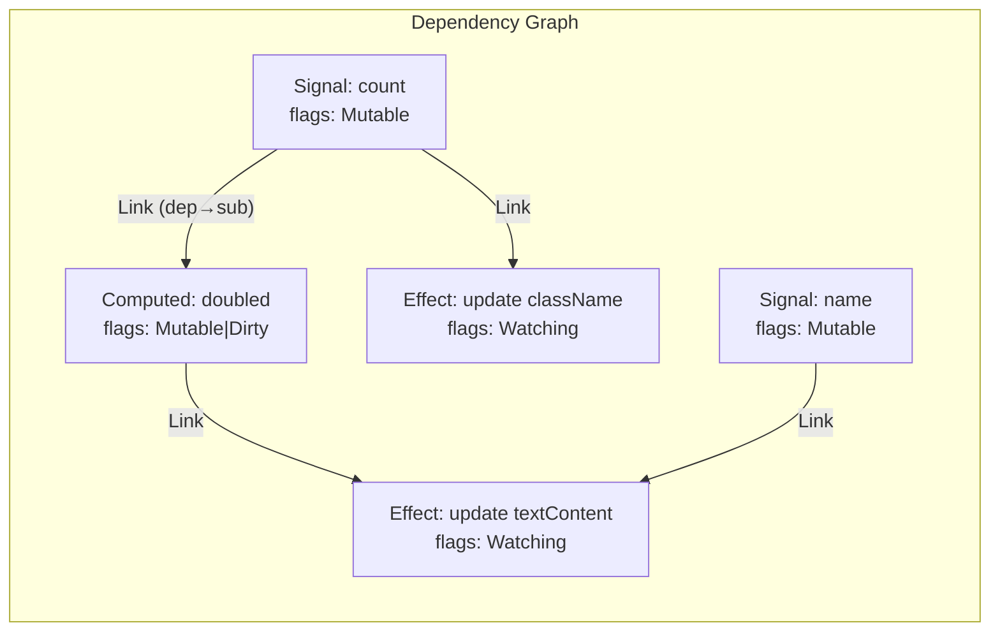
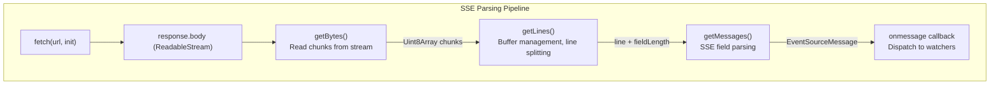
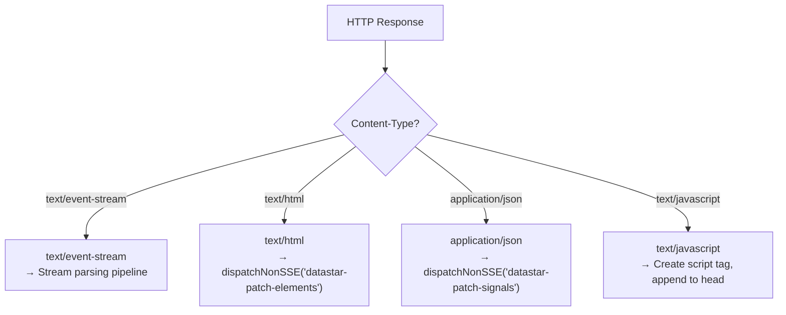
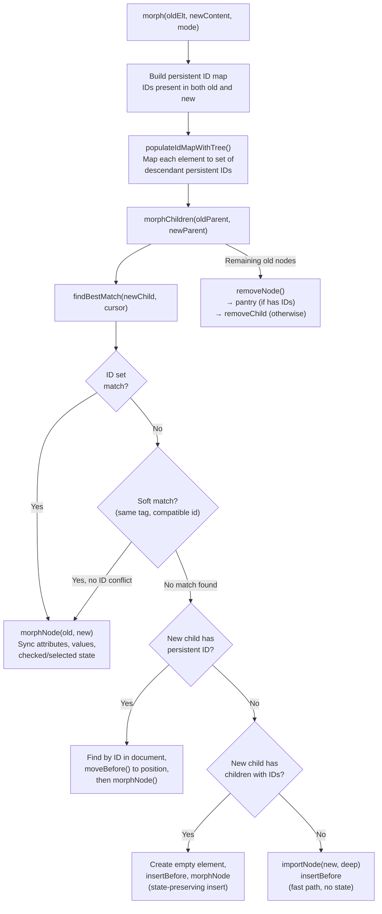
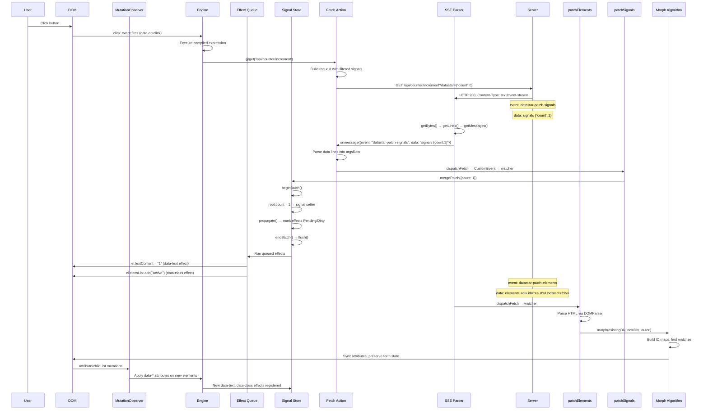

# Deep Dive: Rendering, Signals, and Server-to-Browser Data Flow

This document traces the complete lifecycle of data from server to browser and explains how Datastar's reactive system transforms signal changes into DOM updates.

---

## 1. The Reactive Signal System

### 1.1 Core Primitives

Datastar's reactivity is built on three primitives, all in `library/src/engine/signals.ts`:

**Signal** — A mutable reactive container:
```typescript
export const signal = <T>(initialValue?: T): Signal<T> => {
  return signalOper.bind(0, {
    previousValue: initialValue,
    value_: initialValue,
    flags_: ReactiveFlags.Mutable,
  }) as Signal<T>
}
```
A signal is a function. Call with no args to read (`signal()`), call with a value to write (`signal(newValue)` returns `true` if changed, `false` if same value).

**Computed** — A derived value that lazily re-evaluates when dependencies change:
```typescript
export const computed = <T>(getter: (previousValue?: T) => T): Computed<T>
```
Marked with `computedSymbol`. Only re-evaluates when dirty-flagged.

**Effect** — A side effect that re-runs when any accessed signal changes:
```typescript
export const effect = (fn: () => void): Effect
```
Runs immediately on creation, then re-runs whenever a signal it read during execution changes. Returns a cleanup function.

### 1.2 The Dependency Graph

The system tracks dependencies via a doubly-linked list of `Link` nodes:

```typescript
interface ReactiveNode {
  deps_?: Link       // first dependency link
  depsTail_?: Link   // last dependency link
  subs_?: Link       // first subscriber link
  subsTail_?: Link   // last subscriber link
  flags_: ReactiveFlags
}

interface Link {
  version_: number
  dep_: ReactiveNode      // the dependency (signal/computed)
  sub_: ReactiveNode      // the subscriber (computed/effect)
  prevSub_?: Link
  nextSub_?: Link
  prevDep_?: Link
  nextDep_?: Link
}
```



Each `Link` connects a dependency to a subscriber. When a signal changes, `propagate()` walks the subscriber chain marking nodes as `Pending` or `Dirty`, then `notify()` queues effects for execution.

### 1.3 Reactivity Flags (Bitfield)

```typescript
enum ReactiveFlags {
  None          = 0,       // 000000
  Mutable       = 1 << 0,  // 000001 — can be written to (signals, computeds)
  Watching      = 1 << 1,  // 000010 — is an effect (needs re-execution)
  RecursedCheck = 1 << 2,  // 000100 — currently being checked for recursion
  Recursed      = 1 << 3,  // 001000 — detected as recursed
  Dirty         = 1 << 4,  // 010000 — value has changed, needs re-evaluation
  Pending       = 1 << 5,  // 100000 — a dependency might have changed
}

enum EffectFlags {
  Queued = 1 << 6,  // 1000000 — effect is in the queue, don't add again
}
```

These flags allow the system to skip unnecessary work. `Pending` means "a dependency *might* have changed" (check lazily), while `Dirty` means "a dependency *did* change" (must re-evaluate).

### 1.4 The Update Propagation Algorithm

When a signal value is set:

```
signal(newValue)
  ├─ if value === oldValue → return false (skip)
  ├─ set value, mark self Mutable|Dirty
  ├─ propagate(subs) → walk subscriber chain
  │   ├─ for each subscriber:
  │   │   ├─ if no flags set → mark Pending
  │   │   ├─ if Watching (is effect) → notify()
  │   │   │   └─ push to queuedEffects[] (if not already Queued)
  │   │   └─ if Mutable (is computed) with subs → recurse into subs
  │   └─ uses explicit stack (not recursion) to avoid stack overflow
  └─ if not batching → flush()
        └─ drain queuedEffects[], running each effect
```

The key insight: propagation only marks nodes, it doesn't re-evaluate anything. Effects are queued and run in order during `flush()`. This allows multiple signal changes to be coalesced.

### 1.5 Batching

```typescript
let batchDepth = 0

export const beginBatch = (): void => { batchDepth++ }
export const endBatch = (): void => {
  if (!--batchDepth) {
    flush()      // drain effect queue
    dispatch()   // fire DATASTAR_SIGNAL_PATCH_EVENT
  }
}
```

Batching defers effect execution and event dispatch until the outermost batch completes. The `mergePatch()` function (used by the signal patcher) wraps all mutations in a batch — so 50 signals updated in one SSE event cause only one round of effect execution.

### 1.6 Deep Reactivity via Proxy

The root signal store is created with `deep({})`:

```typescript
export const root: Record<string, any> = deep({})
```

`deep()` wraps objects/arrays in ES6 Proxies that intercept property access:

**Get trap:**
```
proxy.get(prop)
  ├─ if prop doesn't exist → create signal(''), dispatch, increment keys signal
  ├─ if prop is array method → read keys() for reactivity, return method
  └─ return deepObj[prop]()  ← calls the signal getter (subscribes the active effect)
```

**Set trap:**
```
proxy.set(prop, newValue)
  ├─ if prop exists and is POJO → recursive merge (delete missing keys, update changed)
  ├─ if prop exists → deepObj[prop](deep(newValue)) ← wraps in new signals, calls setter
  ├─ if prop doesn't exist → create new signal(deep(newValue))
  └─ dispatch(path, value) → accumulates into currentPatch[]
```

This means `root.user.name = "Alice"` automatically:
1. Creates `root.user` as a Proxy-wrapped signal container (if missing)
2. Creates `root.user.name` as a `signal("Alice")`
3. Dispatches a patch event with path `"user.name"` and value `"Alice"`

### 1.7 The Dispatch System

Every signal mutation through the deep Proxy accumulates `[path, value]` tuples into `currentPatch[]`. When the batch ends:

```typescript
const dispatch = (path?: string, value?: any) => {
  if (path !== undefined && value !== undefined) {
    currentPatch.push([path, value])
  }
  if (!batchDepth && currentPatch.length) {
    const detail = pathToObj(currentPatch)  // converts [["a.b", 1]] to {a:{b:1}}
    currentPatch.length = 0
    document.dispatchEvent(
      new CustomEvent(DATASTAR_SIGNAL_PATCH_EVENT, { detail })
    )
  }
}
```

This `CustomEvent` is what `data-on-signal-patch` listens to — it allows user code to react to any signal change.

---

## 2. How Attributes Become Reactive

### 2.1 Attribute Scanning

On initialization and whenever the DOM changes, the engine scans elements for `data-*` attributes:

```
MutationObserver fires
  → observe() callback
    → for added nodes: applyEls([node, ...descendants])
    → for removed nodes: cleanupEls([node, ...descendants])
    → for changed attributes: applyAttributePlugin(target, key, value)
```

### 2.2 Attribute Key Parsing

```
data-on:click__prevent__delay.500ms
      ↓ parseAttributeKey()
{
  pluginName: "on",
  key: "click",
  mods: Map {
    "prevent" → Set {},
    "delay"   → Set { "500ms" }
  }
}
```

Format: `data-{plugin}:{key}__{modifier}.{tag1}.{tag2}__{modifier2}`

### 2.3 Expression Compilation (`genRx`)

The `genRx()` function in `engine.ts` transforms attribute value expressions into executable JavaScript:

**Input:** `"$count > 5 ? 'highlight' : ''"`

**Transformation steps:**
1. **Escape handling** — Content between `🖕JS_DS🚀` markers is preserved verbatim
2. **Signal replacement** — `$count` → `$['count']`, `$user.name` → `$['user']['name']`
3. **Action replacement** — `@get('/url')` → `__action("get", evt, '/url')`
4. **Return wrapping** — If plugin declares `returnsValue`, last statement gets `return (...);`
5. **Function construction** — `new Function('el', '$', '__action', 'evt', ...argNames, expr)`

**Output:** A function `(el, ...args) => T` that:
- Receives `el` (the DOM element) and passes `root` as `$`
- Provides `__action` helper for action dispatch
- Is wrapped in try-catch with detailed error reporting including a URL to `data-star.dev/errors`

The compiled function is cached per attribute — it only compiles once, then the `rx()` wrapper re-executes it whenever an effect re-runs.

### 2.4 From Attribute to Reactive Binding

Example: `<span data-text="$count"></span>`

```
1. Engine finds data-text="$count" on <span>
2. Looks up "text" in attributePlugins
3. Creates ctx.rx = () => genRx("$count", {returnsValue: true})(el)
4. Calls text plugin's apply(ctx):

   // text plugin (simplified):
   apply({ el, rx }) {
     return effect(() => {
       el.textContent = rx()  // calls compiled fn, which reads root['count']
     })
   }

5. effect() immediately runs the fn:
   - Reads root['count'] (via $['count'] in compiled expression)
   - This read subscribes the effect to the 'count' signal
   - Sets el.textContent to the current value

6. When count changes → effect is dirty → re-runs → updates textContent
```

### 2.5 Cleanup Lifecycle

```
Element removed from DOM
  → MutationObserver fires (removedNodes)
  → cleanupEls(removedNodes)
    → For each element:
      → Get removals.get(el) → Map<attrKey, Map<cleanupName, fn>>
      → Call every cleanup function
      → Delete element from removals map

Cleanup functions include:
  - "attribute": the return value of plugin.apply() (e.g., the effect disposer)
  - "@get", "@post": abort controllers for in-flight requests
  - Event listener removers
```

---

## 3. The Server-to-Browser SSE Pipeline

### 3.1 Initiating the Connection

A user interaction triggers a fetch action:

```html
<button data-on:click="@get('/api/counter/increment')">+1</button>
```

The `@get` action (defined in `fetch.ts`) executes:

```
1. Create AbortController (auto-cancels previous request on same element)
2. Build request:
   - URL: /api/counter/increment
   - Method: GET
   - Headers: { Accept: "text/event-stream, text/html, application/json",
                 Datastar-Request: true }
   - Signals payload: filtered(root) → JSON stringified → ?datastar={...} query param
3. Dispatch 'started' event (for data-indicator tracking)
4. Call fetchEventSource() — the SSE streaming engine
```

### 3.2 The SSE Streaming Engine

`fetchEventSource()` in `fetch.ts` is a custom SSE client (originally based on Azure's `fetch-event-source`):



**Stage 1: `getBytes()`** — Reads the `ReadableStream` chunk by chunk:
```typescript
const reader = stream.getReader()
let result = await reader.read()
while (!result.done) {
  onChunk(result.value)  // Uint8Array
  result = await reader.read()
}
```

**Stage 2: `getLines()`** — Accumulates bytes into lines, splitting on `\n` or `\r\n`:
- Maintains a `buffer` and `position` cursor
- Tracks `fieldLength` (position of first `:` in line)
- Handles partial chunks by concatenating buffers
- Zero-copy where possible (uses `subarray` views)

**Stage 3: `getMessages()`** — Parses SSE fields per the [HTML spec](https://html.spec.whatwg.org/multipage/server-sent-events.html#event-stream-interpretation):
```typescript
switch (field) {
  case 'data':  message.data = message.data ? `${message.data}\n${value}` : value
  case 'event': message.event = value
  case 'id':    onId(message.id = value)
  case 'retry': onRetry(message.retry = +value)
}
```
An empty line signals end-of-message → fire `onmessage`.

**Stage 4: `onmessage` callback** — Parses data lines into watcher arguments:
```typescript
onmessage: (evt) => {
  if (!evt.event.startsWith('datastar')) return
  const argsRawLines: Record<string, string[]> = {}
  for (const line of evt.data.split('\n')) {
    const i = line.indexOf(' ')
    const k = line.slice(0, i)   // argument name
    const v = line.slice(i + 1)  // argument value
    ;(argsRawLines[k] ||= []).push(v)
  }
  // Join multi-line values
  const argsRaw = Object.fromEntries(
    Object.entries(argsRawLines).map(([k, v]) => [k, v.join('\n')])
  )
  dispatchFetch(evt.event, el, argsRaw)  // CustomEvent → engine → watcher
}
```

### 3.3 Content-Type Routing

The fetch action doesn't only handle SSE. It inspects `Content-Type` and routes accordingly:



For non-SSE responses, it reads `datastar-*` headers for additional arguments (selector, mode, namespace, etc.).

### 3.4 SSE Message Protocol

An SSE message from the server to Datastar follows this format:

```
event: datastar-patch-signals
id: optional-event-id
retry: 1000
data: signals {"count":42,"user":{"name":"Alice"}}
data: onlyIfMissing true

```

The `data:` lines use a key-value format where the first word is the argument name and the rest is the value. Multi-line values (like HTML) span multiple `data: elements` lines:

```
event: datastar-patch-elements
data: selector #content
data: mode inner
data: elements <div class="card">
data: elements   <h2>Title</h2>
data: elements   <p>Body text</p>
data: elements </div>

```

### 3.5 Signal Patching (Server → Browser Signals)

When the server sends `event: datastar-patch-signals`:

```
1. Watcher receives: { signals: '{"count":42}', onlyIfMissing: 'false' }
2. patchSignals plugin:
   - Parses JSON string via jsStrToObject() (supports function revival)
   - Calls mergePatch({count: 42}, {ifMissing: false})
3. mergePatch():
   - beginBatch()
   - For each key in patch:
     - null value → delete from root (signal removal)
     - POJO value → recurse into nested object
     - primitive → set on root (creates or updates signal)
   - endBatch() → flush() effects → dispatch() patch event
4. All effects subscribed to changed signals re-run
```

**RFC 7386 JSON Merge Patch semantics:**
```json
{"count": 42}           → Set count to 42
{"count": null}         → Delete count signal
{"user": {"name": "A"}} → Set user.name to "A" (preserves user.email)
{"user": null}          → Delete entire user object
```

**`onlyIfMissing` mode:** When `true`, only sets values for signals that don't already exist. Used for initializing defaults without overwriting user-modified state.

### 3.6 Element Patching (Server → Browser DOM)

When the server sends `event: datastar-patch-elements`:

```
1. Watcher receives: { selector: '#counter', mode: 'outer', elements: '<div id="counter">42</div>' }
2. patchElements plugin:
   - Validates mode (one of 8: remove/outer/inner/replace/prepend/append/before/after)
   - Validates namespace (html/svg/mathml)
   - Parses HTML string via DOMParser
   - Optionally wraps with View Transitions API
3. Based on mode:
   - remove: target.remove()
   - outer/inner: morph(target, newContent, mode)
   - replace: target.replaceWith(newContent)
   - prepend/append/before/after: target[mode](newContent)
```

### 3.7 The Morphing Algorithm

The `morph()` function in `patchElements.ts` is a sophisticated DOM reconciliation algorithm:



**Key details:**

1. **Persistent ID tracking:** Before morphing, computes the intersection of IDs in old and new content. Only IDs that appear in both (with matching tag names) are considered "persistent."

2. **ID set matching:** Each element gets a set of all persistent IDs in its subtree. When scanning for matches, the algorithm prefers elements whose subtrees share IDs with the new content.

3. **Soft matching:** Fallback when no ID match exists. Matches by `nodeType + tagName + (compatible id)`. Won't soft-match an element with a persistent ID to a different ID.

4. **Pantry pattern:** When removing a node that contains persistent IDs, it's moved to a hidden "pantry" `<div>` instead of being destroyed. This preserves the DOM node so it can be moved back in later during the same morph operation.

5. **`moveBefore` API:** Uses the new DOM `moveBefore()` method if available (preserves element state like iframe contents, CSS animations), falls back to `insertBefore()`.

6. **Form state preservation:** Explicitly handles `<input>` values, `checked` state, `<textarea>` content, `<option>` selected state, and dispatches `change` events when values change.

7. **Script de-duplication:** Tracks all `<script>` elements in a WeakSet. New scripts are only executed if they haven't been seen before (prevents re-execution on morph).

8. **`data-ignore-morph`:** Elements with this attribute are skipped entirely during morphing — useful for preserving third-party widget state.

---

## 4. Retry and Error Handling

### 4.1 Automatic Retry

The fetch action implements exponential backoff:

```
retryInterval: 1000ms (initial)
retryScaler: 2 (multiplier per retry)
retryMaxWaitMs: 30000ms (cap)
retryMaxCount: 10 (max attempts)

Retry 1: wait 1000ms
Retry 2: wait 2000ms
Retry 3: wait 4000ms
...
Retry n: wait min(1000 * 2^n, 30000)ms
```

**Retry modes:**
- `auto` (default for SSE): Retry on network errors, not on 204/redirect/HTTP errors
- `error`: Retry only on 4xx/5xx status codes
- `always`: Retry after stream closes (for long-lived SSE connections)
- `never`: No retries

### 4.2 Visibility Handling

For GET requests, `openWhenHidden` defaults to `false`:
- When the tab becomes hidden → abort current request
- When the tab becomes visible → rebuild request with fresh signals and reconnect
- This prevents stale connections and unnecessary server load

For mutating requests (POST, PUT, etc.), `openWhenHidden` defaults to `true` to avoid losing writes.

### 4.3 Request Cancellation

Three modes via `requestCancellation`:
- `auto` (default): Abort previous request from same element when new one starts
- `cleanup`: Abort on element removal (cleanup lifecycle)
- `disabled`: No automatic cancellation
- Can also pass a custom `AbortController`

### 4.4 Indicator Tracking

The `data-indicator` attribute creates a boolean signal that tracks fetch state:

```html
<div data-indicator:loading>
  <button data-on:click="@get('/api/data')" data-attr:disabled="$loading">
    Load
  </button>
  <span data-show="$loading">Loading...</span>
</div>
```

The indicator plugin listens for `started`, `finished`, `error`, and `retrying` events dispatched by the fetch action.

---

## 5. The Complete Reactive Cycle

Here's the full path from user click to DOM update:



---

## 6. Server SDK Protocol (Reference Implementation)

### 6.1 SSE Generator Interface

Every server SDK must implement:

```go
type ServerSentEventGenerator struct {
    // Must set: Cache-Control: no-cache
    //           Content-Type: text/event-stream
    //           Connection: keep-alive (HTTP/1.1)
    // Must flush immediately after headers
}

func (s *SSE) PatchElements(elements string, opts ...Option)
func (s *SSE) PatchSignals(signals string, opts ...Option)
func (s *SSE) ExecuteScript(script string, opts ...Option)
func (s *SSE) ReadSignals(r *http.Request) (map[string]any, error)
```

### 6.2 Wire Format Examples

**Patch signals (set counter to 5):**
```
event: datastar-patch-signals
data: signals {"count":5}

```

**Patch signals (only if missing, with event ID and custom retry):**
```
event: datastar-patch-signals
id: init-001
retry: 5000
data: signals {"theme":"dark","lang":"en"}
data: onlyIfMissing true

```

**Patch elements (replace outer HTML):**
```
event: datastar-patch-elements
data: elements <div id="counter">
data: elements   <span>5</span>
data: elements   <button data-on:click="@get('/api/increment')">+</button>
data: elements </div>

```

**Patch elements (append to list):**
```
event: datastar-patch-elements
data: selector #todo-list
data: mode append
data: elements <li>New item</li>

```

**Remove element:**
```
event: datastar-patch-elements
data: selector #notification-42
data: mode remove

```

**Execute script:**
```
event: datastar-patch-elements
data: selector body
data: mode append
data: elements <script data-effect="el.remove()">alert('Hello!')</script>

```

### 6.3 Reading Signals from Requests

**GET requests:** Signals are in the `datastar` query parameter as URL-encoded JSON:
```
GET /api/data?datastar=%7B%22count%22%3A0%7D
→ { "count": 0 }
```

**POST/PUT/PATCH/DELETE requests:** Signals are in the request body as JSON:
```
POST /api/data
Content-Type: application/json

{"count": 0}
```

---

## 7. Key Design Decisions

### Why SSE over WebSockets?

1. **Unidirectional by design** — Server pushes state; browser sends via standard HTTP requests. No need for bidirectional framing.
2. **HTTP/2 multiplexing** — Multiple SSE streams share one TCP connection. WebSockets can't be multiplexed.
3. **Automatic reconnection** — Built into the SSE spec (and enhanced by Datastar's retry logic).
4. **Simpler server implementation** — Just write text to the response. No upgrade handshake, no frame encoding.
5. **Infrastructure friendly** — Works through proxies, load balancers, CDNs without special configuration.

### Why Morphing over Virtual DOM?

1. **No client-side component tree** — The server owns the template. The browser just patches real DOM.
2. **State preservation** — Morphing preserves focus, scroll position, CSS transitions, iframe state. VDOM diffing destroys and recreates elements.
3. **Simpler mental model** — "The server sends HTML, the browser puts it in place" vs. "reconcile virtual trees, compute patches, apply to DOM."

### Why Signals over Stores?

1. **Fine-grained updates** — Each signal independently tracks its subscribers. Changing `count` only re-runs effects that read `count`, not all effects.
2. **Automatic cleanup** — When an effect is disposed, its links are removed from all signals. No manual unsubscription.
3. **Zero overhead for unused signals** — Signals with no subscribers don't participate in propagation.
